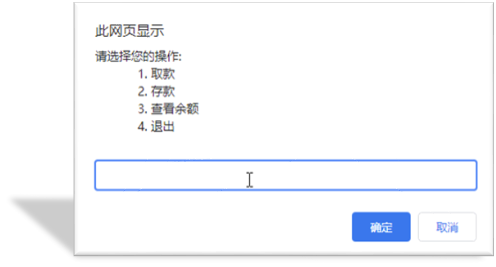

# JavaScript 笔记

## 一、运算符详解

### 1.1 算术运算符

**定义**: 用于执行数学计算的运算符

**基本运算符**:

| 运算符 | 名称 | 作用 | 示例 | 结果 |
|--------|------|------|------|------|
| **+** | 加法 | 求和 | `5 + 3` | `8` |
| **-** | 减法 | 求差 | `5 - 3` | `2` |
| **\*** | 乘法 | 求积 | `5 * 3` | `15` |
| **/** | 除法 | 求商 | `6 / 3` | `2` |
| **%** | 取模 | 求余数 | `5 % 3` | `2` |

#### 1.1.1 基本运算示例

```javascript
// 加法运算
console.log(5 + 3)        // 8
console.log(10 + 20)      // 30

// 减法运算
console.log(10 - 3)       // 7
console.log(20 - 5)       // 15

// 乘法运算
console.log(5 * 3)        // 15
console.log(4 * 6)        // 24

// 除法运算
console.log(10 / 2)       // 5
console.log(15 / 3)       // 5
console.log(5 / 2)        // 2.5

// 运算优先级
console.log(1 + 2 * 3 / 2)  // 4 (先乘除后加减)
```

#### 1.1.2 取模运算详解 ⭐⭐⭐

**定义**: 取模运算符(%)返回两个数相除的余数

**使用场景**:
- 判断奇偶数
- 判断是否能被整除
- 循环数组索引
- 时钟计算

**代码示例**:

```javascript
// 1. 判断是否能被整除
console.log(4 % 2)   // 0 (能被2整除)
console.log(6 % 3)   // 0 (能被3整除)
console.log(5 % 3)   // 2 (不能被3整除,余2)
console.log(3 % 5)   // 3 (被除数小于除数,余数是被除数本身)

// 2. 判断奇偶数
let num1 = 10
console.log(num1 % 2 === 0)  // true (偶数)

let num2 = 7
console.log(num2 % 2 === 0)  // false (奇数)
console.log(num2 % 2 === 1)  // true (奇数)

// 3. 实际应用: 判断闰年
let year = 2024
let isLeapYear = (year % 4 === 0 && year % 100 !== 0) || (year % 400 === 0)
console.log(isLeapYear)  // true

// 4. 循环数组索引
let arr = ['a', 'b', 'c']
let index = 5
console.log(arr[index % arr.length])  // 'c' (5 % 3 = 2)
```

**取模运算规律**:

```javascript
// 规律1: 被除数小于除数,余数是被除数
console.log(3 % 5)   // 3
console.log(2 % 10)  // 2

// 规律2: 被除数等于除数,余数是0
console.log(5 % 5)   // 0

// 规律3: 被除数是除数的倍数,余数是0
console.log(10 % 5)  // 0
console.log(15 % 3)  // 0

// 规律4: 余数的符号与被除数相同
console.log(5 % 3)   // 2
console.log(-5 % 3)  // -2
console.log(5 % -3)  // 2
```

#### 1.1.3 NaN详解

**定义**: NaN = Not a Number (不是一个数字)

**产生NaN的情况**:

```javascript
// 1. 非数字字符串进行数学运算
console.log('pink老师' - 2)    // NaN
console.log('hello' * 3)       // NaN
console.log('abc' / 2)         // NaN

// 2. undefined参与数学运算
console.log(undefined + 1)     // NaN
console.log(undefined * 2)     // NaN

// 3. 特殊的数学运算
console.log(0 / 0)             // NaN
console.log(Math.sqrt(-1))     // NaN

// 4. 注意: 字符串的加法是拼接
console.log('pink老师' + 2)    // 'pink老师2' (不是NaN)
console.log('10' + 5)          // '105' (字符串拼接)
```

**NaN的特性**:

```javascript
// 1. NaN不等于任何值,包括它自己
console.log(NaN === NaN)       // false
console.log(NaN == NaN)        // false

// 2. 检测NaN的方法
console.log(isNaN(NaN))        // true
console.log(isNaN('hello'))    // true
console.log(isNaN(123))        // false
console.log(isNaN('123'))      // false (会转换为数字)

// 3. Number.isNaN() 更严格
console.log(Number.isNaN(NaN))      // true
console.log(Number.isNaN('hello'))  // false (不会转换)
```

#### 1.1.4 变量参与运算

```javascript
// 变量参与算术运算
let num = 10
console.log(num + 10)    // 20
console.log(num - 5)     // 5
console.log(num * 2)     // 20
console.log(num / 2)     // 5
console.log(num % 3)     // 1

// 多个变量运算
let a = 5
let b = 3
console.log(a + b)       // 8
console.log(a - b)       // 2
console.log(a * b)       // 15
console.log(a / b)       // 1.666...
console.log(a % b)       // 2
```

### 1.2 赋值运算符

**定义**: 用于给变量赋值的运算符

**基本赋值**: `=` 将右边的值赋给左边的变量

**复合赋值运算符**:

| 运算符 | 作用 | 示例 | 等价于 |
|--------|------|------|--------|
| **+=** | 加法赋值 | `x += 3` | `x = x + 3` |
| **-=** | 减法赋值 | `x -= 3` | `x = x - 3` |
| **\*=** | 乘法赋值 | `x *= 3` | `x = x * 3` |
| **/=** | 除法赋值 | `x /= 3` | `x = x / 3` |
| **%=** | 取模赋值 | `x %= 3` | `x = x % 3` |

**代码示例**:

```javascript
// 基本赋值
let num = 10
console.log(num)  // 10

// 加法赋值
num += 5  // num = num + 5
console.log(num)  // 15

// 减法赋值
num -= 3  // num = num - 3
console.log(num)  // 12

// 乘法赋值
num *= 2  // num = num * 2
console.log(num)  // 24

// 除法赋值
num /= 4  // num = num / 4
console.log(num)  // 6

// 取模赋值
num %= 4  // num = num % 4
console.log(num)  // 2
```

**实际应用**:

```javascript
// 累加器
let sum = 0
sum += 10  // sum = 10
sum += 20  // sum = 30
sum += 30  // sum = 60
console.log(sum)  // 60

// 计数器
let count = 0
count += 1  // count = 1
count += 1  // count = 2
count += 1  // count = 3
console.log(count)  // 3

// 折扣计算
let price = 100
price *= 0.8  // 打8折
console.log(price)  // 80
```

### 1.3 自增/自减运算符

**定义**: 让变量自身加1或减1

| 运算符 | 名称 | 作用 | 示例 |
|--------|------|------|------|
| **++** | 自增 | 变量值加1 | `i++` 或 `++i` |
| **--** | 自减 | 变量值减1 | `i--` 或 `--i` |

#### 1.3.1 单独使用

**规则**: ++在前和++在后,单独使用时效果相同

```javascript
// 后缀式 (常用)
let i = 1
i++
console.log(i)  // 2

// 前缀式
let j = 1
++j
console.log(j)  // 2

// 自减
let k = 5
k--
console.log(k)  // 4

let m = 5
--m
console.log(m)  // 4
```

#### 1.3.2 参与运算 ⭐⭐⭐

**规则**:
- **前缀式(++i)**: 先自增,再使用
- **后缀式(i++)**: 先使用,再自增

**代码对比**:

```javascript
// 后缀式: 先使用,再自增
let i = 1
console.log(i++)  // 1 (先输出1,再自增)
console.log(i)    // 2

// 前缀式: 先自增,再使用
let j = 1
console.log(++j)  // 2 (先自增,再输出2)
console.log(j)    // 2
```

**详细示例**:

```javascript
// 示例1: 后缀式参与运算
let a = 10
let b = a++ + 5
console.log(b)  // 15 (10 + 5)
console.log(a)  // 11

// 示例2: 前缀式参与运算
let c = 10
let d = ++c + 5
console.log(d)  // 16 (11 + 5)
console.log(c)  // 11

// 示例3: 混合运算
let x = 1
let y = x++ + 1
console.log(y)  // 2 (1 + 1)
console.log(x)  // 2

// 示例4: 前缀混合
let m = 1
let n = ++m + 1
console.log(n)  // 3 (2 + 1)
console.log(m)  // 2
```

**复杂示例** (了解):

```javascript
// 复杂运算
let i = 1
let result = i++ + ++i + i
// 执行过程:
// i++ → 先用1,后i变2
// ++i → 先i变3,再用3
// i → 直接用3
// 1 + 3 + 3 = 7
console.log(result)  // 7
console.log(i)       // 3
```

#### 1.3.3 使用注意

```javascript
// ✅ 正确: 只有变量能自增
let num = 10
num++

// ❌ 错误: 常量不能自增
5++     // 报错
'abc'++ // 报错

// ✅ 开发中推荐后缀式
for (let i = 0; i < 10; i++) {
    console.log(i)
}

// 等价于
for (let i = 0; i < 10; ++i) {
    console.log(i)
}
```

### 1.4 比较运算符

**定义**: 比较两个数据的大小或是否相等,返回布尔值

**比较运算符列表**:

| 运算符 | 名称 | 作用 | 示例 | 结果 |
|--------|------|------|------|------|
| **>** | 大于 | 左边是否大于右边 | `5 > 3` | `true` |
| **<** | 小于 | 左边是否小于右边 | `5 < 3` | `false` |
| **>=** | 大于等于 | 左边是否大于或等于右边 | `5 >= 5` | `true` |
| **<=** | 小于等于 | 左边是否小于或等于右边 | `3 <= 5` | `true` |
| **==** | 相等 | 值是否相等(会类型转换) | `2 == '2'` | `true` |
| **===** | 全等 | 值和类型都相等 ⭐ | `2 === '2'` | `false` |
| **!=** | 不等 | 值是否不等 | `2 != 3` | `true` |
| **!==** | 不全等 | 值或类型不等 | `2 !== '2'` | `true` |

#### 1.4.1 基本比较

```javascript
// 数字比较
console.log(3 > 5)    // false
console.log(3 < 5)    // true
console.log(3 >= 3)   // true
console.log(5 <= 3)   // false

// 变量比较
let age = 18
console.log(age >= 18)  // true
console.log(age < 18)   // false
```

#### 1.4.2 == vs === ⭐⭐⭐⭐⭐

**== (相等)**: 只比较值,会进行类型转换

**=== (全等)**: 比较值和类型,不会类型转换

```javascript
// == 会进行隐式类型转换
console.log(2 == 2)      // true
console.log(2 == '2')    // true (字符串'2'转为数字2)
console.log(1 == true)   // true (true转为1)
console.log(0 == false)  // true (false转为0)
console.log('' == 0)     // true (空字符串转为0)

// === 严格比较,不转换类型
console.log(2 === 2)     // true
console.log(2 === '2')   // false (类型不同)
console.log(1 === true)  // false (类型不同)
console.log(0 === false) // false (类型不同)
console.log('' === 0)    // false (类型不同)
```

**开发建议**: ⭐⭐⭐⭐⭐
```javascript
// ✅ 推荐: 使用 ===
if (age === 18) {
    console.log('成年了')
}

// ❌ 不推荐: 使用 ==
if (age == 18) {
    console.log('成年了')
}
```

#### 1.4.3 特殊值比较

```javascript
// NaN的比较
console.log(NaN === NaN)  // false (NaN不等于任何值,包括自己)
console.log(NaN == NaN)   // false

// null和undefined
console.log(null == undefined)   // true
console.log(null === undefined)  // false (类型不同)

// 0的比较
console.log(0 == false)   // true
console.log(0 === false)  // false
console.log(0 == '')      // true
console.log(0 === '')     // false
```

#### 1.4.4 字符串比较

**规则**: 按字符ASCII码逐个比较

```javascript
// 字符串比较
console.log('a' < 'b')     // true
console.log('a' > 'b')     // false
console.log('abc' < 'abd') // true
console.log('aa' < 'ab')   // true
console.log('aa' < 'aac')  // true

// ASCII码值
console.log('A' < 'a')     // true (65 < 97)
console.log('0' < '9')     // true (48 < 57)

// 中文比较(按Unicode编码)
console.log('张' < '李')   // false
```

#### 1.4.5 不等比较

```javascript
// != (不等)
console.log(2 != 3)      // true
console.log(2 != '2')    // false (会转换类型)
console.log(2 != '3')    // true

// !== (不全等)
console.log(2 !== '2')   // true (类型不同)
console.log(2 !== 2)     // false
console.log(2 !== 3)     // true
```

### 1.5 逻辑运算符

**定义**: 用于连接多个布尔值,返回布尔结果

**逻辑运算符列表**:

| 运算符 | 名称 | 读法 | 特点 | 口诀 |
|--------|------|------|------|------|
| **&&** | 逻辑与 | 并且 | 都真才真 | 一假则假 |
| **\|\|** | 逻辑或 | 或者 | 一真则真 | 一真则真 |
| **!** | 逻辑非 | 取反 | 真变假,假变真 | 取反 |

#### 1.5.1 逻辑与 (&&)

**规则**: 两边都为true,结果才为true

**真值表**:

| A | B | A && B |
|---|---|--------|
| true | true | true |
| true | false | false |
| false | true | false |
| false | false | false |

**代码示例**:

```javascript
// 基本使用
console.log(true && true)    // true
console.log(true && false)   // false
console.log(false && true)   // false
console.log(false && false)  // false

// 表达式使用
console.log(3 < 5 && 3 > 2)  // true && true = true
console.log(3 < 5 && 3 < 2)  // true && false = false
console.log(3 > 5 && 3 > 2)  // false && true = false

// 实际应用: 判断范围
let age = 25
console.log(age >= 18 && age <= 60)  // true (在18-60之间)

let score = 85
console.log(score >= 60 && score < 90)  // true (及格且不到优秀)
```

**短路运算**:

```javascript
// 如果第一个为false,不会计算第二个
let a = 5
console.log(a > 10 && a++)  // false (a++不执行)
console.log(a)              // 5

// 如果第一个为true,会计算第二个
let b = 5
console.log(b < 10 && b++)  // true (b++执行)
console.log(b)              // 6
```

#### 1.5.2 逻辑或 (||)

**规则**: 只要有一个为true,结果就为true

**真值表**:

| A | B | A \|\| B |
|---|---|----------|
| true | true | true |
| true | false | true |
| false | true | true |
| false | false | false |

**代码示例**:

```javascript
// 基本使用
console.log(true || true)    // true
console.log(true || false)   // true
console.log(false || true)   // true
console.log(false || false)  // false

// 表达式使用
console.log(3 > 5 || 3 > 2)  // false || true = true
console.log(3 < 5 || 3 < 2)  // true || false = true
console.log(3 > 5 || 3 < 2)  // false || false = false

// 实际应用: 满足任意条件
let age = 15
console.log(age < 18 || age > 60)  // true (未成年或老年)

let day = '周六'
console.log(day === '周六' || day === '周日')  // true (周末)
```

**短路运算**:

```javascript
// 如果第一个为true,不会计算第二个
let a = 5
console.log(a < 10 || a++)  // true (a++不执行)
console.log(a)              // 5

// 如果第一个为false,会计算第二个
let b = 5
console.log(b > 10 || b++)  // false || 5 = 5 (b++执行)
console.log(b)              // 6
```

#### 1.5.3 逻辑非 (!)

**规则**: 取反,true变false,false变true

**代码示例**:

```javascript
// 基本使用
console.log(!true)   // false
console.log(!false)  // true

// 表达式使用
console.log(!(3 > 5))  // !false = true
console.log(!(3 < 5))  // !true = false

// 双重取反
console.log(!!true)   // true
console.log(!!false)  // false
console.log(!!'hello') // true (非空字符串转布尔为true)
console.log(!!'')      // false (空字符串转布尔为false)

// 实际应用
let isLogin = false
console.log(!isLogin)  // true (未登录)

if (!isLogin) {
    console.log('请先登录')
}
```

#### 1.5.4 复合逻辑运算

```javascript
// 多个逻辑运算
let age = 20
let gender = '男'
let score = 85

// 成年男性且成绩优秀
console.log(age >= 18 && gender === '男' && score >= 90)  // false

// 未成年或女性或不及格
console.log(age < 18 || gender === '女' || score < 60)  // false

// 复杂条件
let result = (age >= 18 && age <= 60) || score >= 90
console.log(result)  // true
```

#### 1.5.5 逻辑运算的隐式转换

```javascript
// 非布尔值参与逻辑运算
console.log(1 && 2)      // 2 (都为真,返回最后一个真值)
console.log(0 && 2)      // 0 (第一个为假,返回第一个假值)
console.log(1 || 2)      // 1 (第一个为真,返回第一个真值)
console.log(0 || 2)      // 2 (第一个为假,返回第二个值)

// 实际应用: 设置默认值
let username = ''
let defaultName = username || '游客'
console.log(defaultName)  // '游客'

let age = 0
let defaultAge = age || 18
console.log(defaultAge)  // 18
```

### 1.6 运算符优先级

**优先级表** (从高到低):


| 优先级 | 运算符 | 说明 |
|--------|--------|------|
| 1 | `()` | 括号 |
| 2 | `!` `++` `--` | 一元运算符 |
| 3 | `*` `/` `%` | 乘除取模 |
| 4 | `+` `-` | 加减 |
| 5 | `>` `<` `>=` `<=` | 比较运算符 |
| 6 | `==` `!=` `===` `!==` | 相等运算符 |
| 7 | `&&` | 逻辑与 |
| 8 | `\|\|` | 逻辑或 |
| 9 | `=` `+=` `-=` | 赋值运算符 |

**重点**:
```
! > && > ||
```

**代码示例**:

```javascript
// 括号优先级最高
console.log((2 + 3) * 4)  // 20
console.log(2 + 3 * 4)    // 14

// 逻辑运算符优先级
console.log(!true && false)  // false (先!,再&&)
console.log(true && false || true)  // true (先&&,再||)

// 复杂表达式
let result = 2 + 3 * 4 > 10 && 5 < 10
// 执行顺序:
// 1. 3 * 4 = 12
// 2. 2 + 12 = 14
// 3. 14 > 10 = true
// 4. 5 < 10 = true
// 5. true && true = true
console.log(result)  // true
```

---

## 二、流程控制语句

### 2.1 表达式和语句

#### 2.1.1 表达式

**定义**: 可以被求值的代码,有返回结果

**示例**:

```javascript
// 算术表达式
3 + 5          // 返回 8
10 * 2         // 返回 20

// 比较表达式
5 > 3          // 返回 true
age >= 18      // 返回 true 或 false

// 逻辑表达式
true && false  // 返回 false

// 赋值表达式
let x = 10     // 返回 10

// 函数调用表达式
alert('hello') // 返回 undefined
```

#### 2.1.2 语句

**定义**: 执行某个操作的代码,不一定有返回值

**示例**:

```javascript
// 声明语句
let age = 18

// 赋值语句
age = 20

// 条件语句
if (age >= 18) {
    console.log('成年')
}

// 循环语句
for (let i = 0; i < 5; i++) {
    console.log(i)
}
```

**区别**:

| 对比项 | 表达式 | 语句 |
|--------|--------|------|
| **返回值** | 有 | 不一定有 |
| **作用** | 产生值 | 执行操作 |
| **示例** | `3 + 5` | `if (条件) {}` |

### 2.2 分支语句

**定义**: 根据条件判断,选择性执行代码

**分支语句类型**:
1. if分支语句 ⭐⭐⭐⭐⭐
2. 三元运算符
3. switch语句

#### 2.2.1 if单分支语句

**语法**:

```javascript
if (条件表达式) {
    // 条件为true时执行的代码
}
```

**执行流程**:
```
判断条件 → true → 执行代码块
         → false → 跳过代码块
```

**代码示例**:

```javascript
// 示例1: 简单判断
if (3 > 5) {
    console.log('执行')  // 不执行
}

if (3 < 5) {
    console.log('执行')  // 执行
}

// 示例2: 变量判断
let age = 20
if (age >= 18) {
    console.log('成年了')  // 执行
}

// 示例3: 用户输入
let score = +prompt('请输入成绩')
if (score >= 700) {
    alert('恭喜考入黑马程序员')
}
```

**隐式类型转换**:

```javascript
// 数字: 0为false,其他为true
if (0) {
    console.log('执行')  // 不执行
}

if (1) {
    console.log('执行')  // 执行
}

// 字符串: 空字符串为false,其他为true
if ('') {
    console.log('执行')  // 不执行
}

if ('hello') {
    console.log('执行')  // 执行
}

// undefined、null为false
if (undefined) {
    console.log('执行')  // 不执行
}
```

**注意事项**:

```javascript
// ✅ 推荐: 使用大括号
if (age >= 18) {
    console.log('成年')
}

// ⚠️ 可以省略大括号(只有一条语句)
if (age >= 18)
    console.log('成年')

// ❌ 不推荐省略(容易出错)
if (age >= 18)
    console.log('成年')
    console.log('可以投票')  // 这句总会执行
```

#### 2.2.2 if...else 双分支语句

**语法**:

```javascript
if (条件表达式) {
    // 条件为true时执行
} else {
    // 条件为false时执行
}
```

**执行流程**:
```
判断条件 → true → 执行if代码块
         → false → 执行else代码块
```

**代码示例**:

```javascript
// 示例1: 简单判断
let age = 15
if (age >= 18) {
    console.log('成年')
} else {
    console.log('未成年')
}

// 示例2: 登录验证
let uname = prompt('请输入用户名:')
let pwd = prompt('请输入密码:')

if (uname === 'pink' && pwd === '123456') {
    alert('恭喜登录成功')
} else {
    alert('用户名或密码错误')
}

// 示例3: 奇偶判断
let num = +prompt('请输入一个数字:')
if (num % 2 === 0) {
    alert('偶数')
} else {
    alert('奇数')
}
```

**实际应用**:

```javascript
// 判断闰年
let year = +prompt('请输入年份:')
if ((year % 4 === 0 && year % 100 !== 0) || year % 400 === 0) {
    alert(year + '是闰年')
} else {
    alert(year + '不是闰年')
}

// 判断成绩及格
let score = +prompt('请输入成绩:')
if (score >= 60) {
    alert('及格')
} else {
    alert('不及格')
}
```

#### 2.2.3 if...else if 多分支语句

**语法**:

```javascript
if (条件1) {
    // 条件1为true时执行
} else if (条件2) {
    // 条件2为true时执行
} else if (条件3) {
    // 条件3为true时执行
} else {
    // 所有条件都为false时执行
}
```

**执行流程**:
```
判断条件1 → true → 执行代码块1,结束
          → false → 判断条件2 → true → 执行代码块2,结束
                               → false → 判断条件3 → true → 执行代码块3,结束
                                                    → false → 执行else代码块
```

**代码示例**:

```javascript
// 示例1: 成绩等级
let score = +prompt('请输入成绩:')

if (score >= 90) {
    alert('成绩优秀,宝贝你是我的骄傲')
} else if (score >= 70) {
    alert('成绩良好,宝贝你要加油哦')
} else if (score >= 60) {
    alert('成绩及格,宝贝你很危险')
} else {
    alert('成绩不及格,我不想和你说话')
}

// 示例2: 年龄段判断
let age = +prompt('请输入年龄:')

if (age < 12) {
    console.log('儿童')
} else if (age < 18) {
    console.log('青少年')
} else if (age < 60) {
    console.log('成年人')
} else {
    console.log('老年人')
}

// 示例3: 季节判断
let month = +prompt('请输入月份:')

if (month >= 3 && month <= 5) {
    console.log('春季')
} else if (month >= 6 && month <= 8) {
    console.log('夏季')
} else if (month >= 9 && month <= 11) {
    console.log('秋季')
} else if (month === 12 || month === 1 || month === 2) {
    console.log('冬季')
} else {
    console.log('输入错误')
}
```

**注意事项**:

```javascript
// ⚠️ 条件顺序很重要
let score = 85

// ❌ 错误: 先判断大范围
if (score >= 60) {
    console.log('及格')  // 执行这里,后面的不再判断
} else if (score >= 90) {
    console.log('优秀')  // 永远不会执行
}

// ✅ 正确: 先判断小范围
if (score >= 90) {
    console.log('优秀')
} else if (score >= 60) {
    console.log('及格')  // 执行这里
}
```

#### 2.2.4 三元运算符

**定义**: 简化的if...else语句

**语法**:

```javascript
条件 ? 表达式1 : 表达式2

// 等价于
if (条件) {
    表达式1
} else {
    表达式2
}
```

**执行流程**:
```
条件为true → 返回表达式1的值
条件为false → 返回表达式2的值
```

**代码示例**:

```javascript
// 示例1: 简单使用
let age = 20
let result = age >= 18 ? '成年' : '未成年'
console.log(result)  // '成年'

// 示例2: 直接输出
console.log(5 > 3 ? '真的' : '假的')  // '真的'

// 示例3: 数字补0
let num = +prompt('请输入一个数字:')
num = num < 10 ? '0' + num : num
alert(num)

// 示例4: 求最大值
let a = 10
let b = 20
let max = a > b ? a : b
console.log(max)  // 20

// 示例5: 判断奇偶
let n = 7
let type = n % 2 === 0 ? '偶数' : '奇数'
console.log(type)  // '奇数'
```

**嵌套三元运算符** (不推荐):

```javascript
// ⚠️ 可以嵌套,但不推荐
let score = 85
let grade = score >= 90 ? '优秀' : 
            score >= 70 ? '良好' : 
            score >= 60 ? '及格' : '不及格'
console.log(grade)  // '良好'

// ✅ 推荐: 复杂逻辑用if...else if
let score2 = 85
let grade2
if (score2 >= 90) {
    grade2 = '优秀'
} else if (score2 >= 70) {
    grade2 = '良好'
} else if (score2 >= 60) {
    grade2 = '及格'
} else {
    grade2 = '不及格'
}
```

**使用建议**:

```javascript
// ✅ 适合: 简单的双分支
let status = age >= 18 ? 'adult' : 'child'

// ❌ 不适合: 复杂逻辑
// 推荐用if...else
```

#### 2.2.5 switch语句

**定义**: 用于等值判断的多分支语句

**语法**:

```javascript
switch (表达式) {
    case 值1:
        代码1
        break
    case 值2:
        代码2
        break
    case 值3:
        代码3
        break
    default:
        默认代码
}
```

**执行流程**:
```
计算表达式的值 → 与case值1比较 → 相等 → 执行代码1 → break结束
                               → 不等 → 与case值2比较 → 相等 → 执行代码2 → break
                                                      → 不等 → ...
                                                      → 都不等 → 执行default
```

**代码示例**:

```javascript
// 示例1: 基本使用
let num = 2
switch (num) {
    case 1:
        console.log('您选择的是1')
        break
    case 2:
        console.log('您选择的是2')  // 执行
        break
    case 3:
        console.log('您选择的是3')
        break
    default:
        console.log('没有符合条件的')
}

// 示例2: 星期判断
let day = 3
switch (day) {
    case 1:
        console.log('星期一')
        break
    case 2:
        console.log('星期二')
        break
    case 3:
        console.log('星期三')  // 执行
        break
    case 4:
        console.log('星期四')
        break
    case 5:
        console.log('星期五')
        break
    case 6:
        console.log('星期六')
        break
    case 7:
        console.log('星期日')
        break
    default:
        console.log('输入错误')
}

// 示例3: 水果价格
let fruit = prompt('请输入水果名称:')
switch (fruit) {
    case '苹果':
        alert('5元/斤')
        break
    case '香蕉':
        alert('3元/斤')
        break
    case '橙子':
        alert('4元/斤')
        break
    default:
        alert('没有该水果')
}
```

**case穿透**:

```javascript
// 没有break会继续执行下一个case
let score = 'B'
switch (score) {
    case 'A':
        console.log('优秀')
        break
    case 'B':
        console.log('良好')  // 执行
        // 没有break,继续执行
    case 'C':
        console.log('及格')  // 也执行
        break
    case 'D':
        console.log('不及格')
        break
}
// 输出: 良好 及格

// 利用穿透合并分支
let month = 3
switch (month) {
    case 3:
    case 4:
    case 5:
        console.log('春季')
        break
    case 6:
    case 7:
    case 8:
        console.log('夏季')
        break
    case 9:
    case 10:
    case 11:
        console.log('秋季')
        break
    case 12:
    case 1:
    case 2:
        console.log('冬季')
        break
}
```

**switch vs if...else if**:

| 对比项 | switch | if...else if |
|--------|--------|--------------|
| **适用场景** | 等值判断 | 区间判断 |
| **性能** | 较快 | 较慢 |
| **灵活性** | 较低 | 较高 |
| **可读性** | 清晰 | 清晰 |

```javascript
// ✅ 适合switch: 等值判断
switch (day) {
    case 1: ...
    case 2: ...
}

// ✅ 适合if: 区间判断
if (score >= 90) {
    ...
} else if (score >= 70) {
    ...
}
```

#### 2.2.6 断点调试

**定义**: 在代码执行过程中暂停,查看变量值和执行流程

**使用步骤**:

```
1. 打开浏览器开发者工具(F12)
2. 切换到Sources(源代码)面板
3. 找到JS文件
4. 在代码行号处点击,添加断点
5. 刷新页面,代码会在断点处暂停
6. 使用调试按钮控制执行
```

**调试按钮**:

| 按钮 | 功能 | 快捷键 |
|------|------|--------|
| **▶** | 继续执行 | F8 |
| **↷** | 单步跳过 | F10 |
| **↴** | 单步进入 | F11 |
| **↗** | 单步跳出 | Shift+F11 |

**实际应用**:

```javascript
let score = +prompt('请输入成绩:')

// 在这里添加断点
if (score >= 90) {
    alert('优秀')
} else if (score >= 70) {
    alert('良好')
} else {
    alert('及格')
}

// 可以查看:
// 1. score变量的值
// 2. 条件判断的结果
// 3. 代码执行的路径
```

---

## 三、循环语句

### 3.1 循环简介

**定义**: 重复执行某段代码

**使用场景**:
- 输出多次相同内容
- 遍历数组
- 累加求和
- 重复操作

**循环类型**:
1. while循环
2. for循环 ⭐⭐⭐⭐⭐
3. do...while循环

### 3.2 while循环

**语法**:

```javascript
while (条件表达式) {
    // 循环体
}
```

**执行流程**:
```
1. 判断条件
2. 条件为true → 执行循环体 → 回到步骤1
3. 条件为false → 结束循环
```

**循环三要素**:
1. **初始值**: 循环开始的起点
2. **终止条件**: 循环结束的条件
3. **变化量**: 每次循环后的变化

**代码示例**:

```javascript
// 示例1: 基本使用
// 1. 初始值
let i = 1

// 2. 终止条件
while (i <= 3) {
    console.log('月薪过万不是梦')
    // 3. 变化量
    i++
}

// 示例2: 输出1-5
let num = 1
while (num <= 5) {
    console.log(num)  // 1 2 3 4 5
    num++
}

// 示例3: 用户控制次数
let end = +prompt('请输入次数:')
let count = 1
while (count <= end) {
    document.write('我要循环 <br>')
    count++
}

// 示例4: 累加求和
let sum = 0
let n = 1
while (n <= 100) {
    sum += n
    n++
}
console.log('1-100的和是:' + sum)  // 5050

// 示例5: 倒计时
let time = 10
while (time >= 0) {
    console.log(time)
    time--
}
console.log('发射!')
```

**注意事项**:

```javascript
// ❌ 死循环: 忘记变化量
let i = 1
while (i <= 5) {
    console.log(i)
    // 忘记i++,i永远是1,条件永远为true
}

// ❌ 死循环: 条件永远为true
while (true) {
    console.log('无限循环')
}

// ✅ 正确: 三要素齐全
let i = 1         // 初始值
while (i <= 5) {  // 终止条件
    console.log(i)
    i++           // 变化量
}
```

### 3.3 for循环 ⭐⭐⭐⭐⭐

**语法**:

```javascript
for (初始值; 终止条件; 变化量) {
    // 循环体
}
```

**执行流程**:
```
1. 执行初始值(只执行一次)
2. 判断终止条件
3. 条件为true → 执行循环体 → 执行变化量 → 回到步骤2
4. 条件为false → 结束循环
```

**代码示例**:

```javascript
// 示例1: 基本使用
for (let i = 1; i <= 5; i++) {
    console.log(i)  // 1 2 3 4 5
}

// 示例2: 输出乘法表
for (let i = 1; i <= 9; i++) {
    for (let j = 1; j <= i; j++) {
        document.write(`${j} × ${i} = ${i * j} &nbsp;&nbsp;&nbsp;`)
    }
    document.write('<br>')
}

// 示例3: 累加求和
let sum = 0
for (let i = 1; i <= 100; i++) {
    sum += i
}
console.log(sum)  // 5050

// 示例4: 求偶数和
let evenSum = 0
for (let i = 2; i <= 100; i += 2) {
    evenSum += i
}
console.log(evenSum)  // 2550

// 示例5: 倒序输出
for (let i = 10; i >= 1; i--) {
    console.log(i)
}
```

**for vs while**:

| 对比项 | for循环 | while循环 |
|--------|---------|-----------|
| **语法** | 简洁 | 较繁琐 |
| **使用场景** | 次数确定 | 次数不确定 |
| **推荐度** | ⭐⭐⭐⭐⭐ | ⭐⭐⭐ |

```javascript
// 推荐: 次数确定用for
for (let i = 0; i < 10; i++) {
    console.log(i)
}

// 推荐: 次数不确定用while
while (true) {
    let input = prompt('输入exit退出')
    if (input === 'exit') break
}
```

### 3.4 break和continue

#### 3.4.1 break - 结束整个循环

**作用**: 立即结束循环,跳出循环体

**代码示例**:

```javascript
// 示例1: 基本使用
let i = 1
while (i <= 5) {
    if (i === 3) {
        break  // 当i等于3时,结束循环
    }
    console.log(i)
    i++
}
// 输出: 1 2

// 示例2: 查找数字
for (let i = 1; i <= 100; i++) {
    if (i === 50) {
        console.log('找到了50')
        break  // 找到后立即结束
    }
}

// 示例3: 用户输入
while (true) {
    let love = prompt('你爱我吗?')
    if (love === '爱') {
        alert('我也爱你')
        break  // 退出循环
    }
}
```

#### 3.4.2 continue - 结束本次循环

**作用**: 跳过本次循环,继续下一次循环

**代码示例**:

```javascript
// 示例1: 基本使用
let i = 1
while (i <= 5) {
    if (i === 3) {
        i++
        continue  // 跳过3,不输出
    }
    console.log(i)
    i++
}
// 输出: 1 2 4 5

// 示例2: 输出奇数
for (let i = 1; i <= 10; i++) {
    if (i % 2 === 0) {
        continue  // 跳过偶数
    }
    console.log(i)  // 只输出奇数
}
// 输出: 1 3 5 7 9

// 示例3: 排除特定值
for (let i = 1; i <= 5; i++) {
    if (i === 3 || i === 4) {
        continue  // 跳过3和4
    }
    console.log(i)
}
// 输出: 1 2 5
```

**break vs continue**:

| 对比项 | break | continue |
|--------|-------|----------|
| **作用** | 结束整个循环 | 结束本次循环 |
| **后续循环** | 不执行 | 继续执行 |
| **应用** | 找到结果提前退出 | 跳过某些值 |

```javascript
// break示例
for (let i = 1; i <= 5; i++) {
    if (i === 3) break
    console.log(i)  // 1 2
}

// continue示例
for (let i = 1; i <= 5; i++) {
    if (i === 3) continue
    console.log(i)  // 1 2 4 5
}
```

### 3.5 无限循环

**方式1: while(true)**

```javascript
// 常用方式
while (true) {
    let input = prompt('请输入(输入exit退出):')
    if (input === 'exit') {
        break
    }
    console.log('你输入了:' + input)
}
```

**方式2: for(;;)**

```javascript
// 不常用
for (;;) {
    let love = prompt('你爱我吗?')
    if (love === '爱') {
        alert('我也爱你')
        break
    }
}
```

**实际应用**:

```javascript
// 游戏主循环
while (true) {
    let choice = prompt(`
    游戏菜单:
    1. 开始游戏
    2. 查看排行
    3. 退出游戏
    请选择:
    `)
    
    if (choice === '3') {
        alert('谢谢游戏,再见!')
        break
    }
    
    if (choice === '1') {
        alert('游戏开始...')
    } else if (choice === '2') {
        alert('排行榜...')
    }
}
```

---

## 四、综合案例

### 4.1 ATM存取款机

**需求分析**:



**功能要求**:
1. 提供操作菜单(存钱、取钱、查看余额、退出)
2. 根据用户选择执行相应操作
3. 用户输入4退出系统
4. 循环显示菜单

**分析思路**:

```
1. 使用无限循环显示菜单
2. 准备变量存储余额
3. 使用switch判断用户选择
4. 用户输入4时break退出
5. 存钱用加法,取钱用减法,查看直接显示
```

**完整代码**:

```javascript
// 1. 准备初始余额
let money = 100

// 2. 开始无限循环
while (true) {
    // 3. 显示菜单并获取用户选择
    let choice = +prompt(`
        请您选择操作:
        1. 存钱
        2. 取钱
        3. 查看余额
        4. 退出
    `)
    
    // 4. 如果选择4,退出循环
    if (choice === 4) {
        alert('感谢使用,再见!')
        break
    }
    
    // 5. 根据选择执行操作
    switch (choice) {
        case 1:
            // 存钱
            let deposit = +prompt('请输入存款金额:')
            money += deposit
            alert(`存款成功!当前余额:${money}元`)
            break
            
        case 2:
            // 取钱
            let withdraw = +prompt('请输入取款金额:')
            if (withdraw > money) {
                alert('余额不足!')
            } else {
                money -= withdraw
                alert(`取款成功!当前余额:${money}元`)
            }
            break
            
        case 3:
            // 查看余额
            alert(`您的当前余额是:${money}元`)
            break
            
        default:
            alert('输入错误,请重新选择!')
    }
}
```

**代码优化版本**:

```javascript
// ATM系统 - 优化版
class ATM {
    constructor(initialBalance = 100) {
        this.balance = initialBalance
    }
    
    // 存钱
    deposit(amount) {
        if (amount <= 0) {
            return '存款金额必须大于0'
        }
        this.balance += amount
        return `存款成功!当前余额:${this.balance}元`
    }
    
    // 取钱
    withdraw(amount) {
        if (amount <= 0) {
            return '取款金额必须大于0'
        }
        if (amount > this.balance) {
            return '余额不足!'
        }
        this.balance -= amount
        return `取款成功!当前余额:${this.balance}元`
    }
    
    // 查看余额
    checkBalance() {
        return `您的当前余额是:${this.balance}元`
    }
    
    // 运行ATM
    run() {
        while (true) {
            let choice = +prompt(`
                ATM自动取款机
                1. 存钱
                2. 取钱
                3. 查看余额
                4. 退出
                请选择:
            `)
            
            if (choice === 4) {
                alert('感谢使用,再见!')
                break
            }
            
            switch (choice) {
                case 1:
                    let depositAmount = +prompt('请输入存款金额:')
                    alert(this.deposit(depositAmount))
                    break
                    
                case 2:
                    let withdrawAmount = +prompt('请输入取款金额:')
                    alert(this.withdraw(withdrawAmount))
                    break
                    
                case 3:
                    alert(this.checkBalance())
                    break
                    
                default:
                    alert('输入错误,请重新选择!')
            }
        }
    }
}

// 使用
const atm = new ATM(100)
atm.run()
```