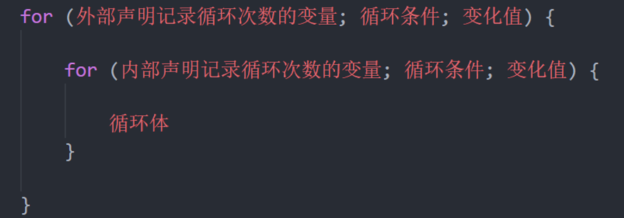
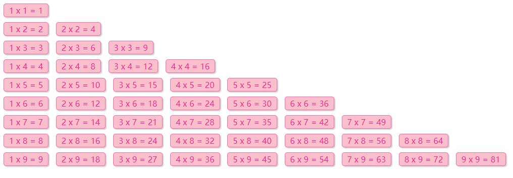
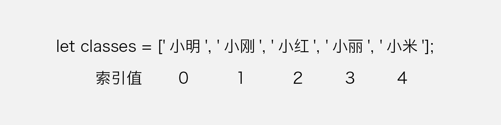
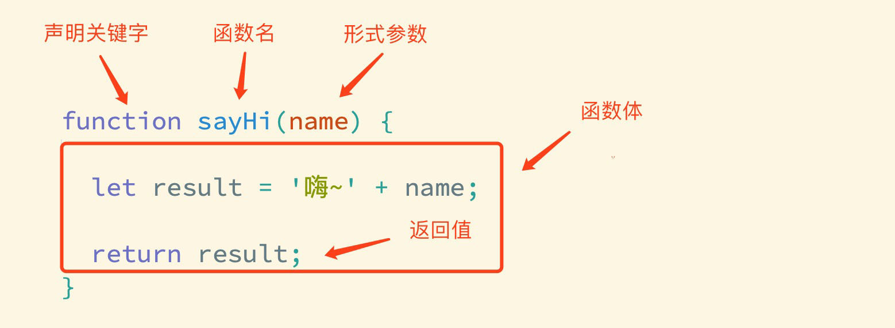

# JavaScript 笔记

## 循环与数组

### 1. if与switch的区别

#### 1.1 共同点
```
✅ 都能实现多分支选择(多选一)
✅ 大部分情况下可以互换
```

#### 1.2 区别对比

| 对比项 | if...else if | switch |
|--------|--------------|--------|
| **适用场景** | 范围判断(大于、小于) | 确定值判断 |
| **执行效率** | 条件少时效率高 | 条件多时效率高 |
| **判断方式** | 支持各种条件表达式 | 使用 === 全等判断 |
| **代码结构** | 灵活 | 更清晰 |
| **break** | 不需要 | 必须加(避免穿透) |

**代码对比**:

```javascript
// if...else if - 范围判断
let score = 85
if (score >= 90) {
    console.log('优秀')
} else if (score >= 70) {
    console.log('良好')
} else if (score >= 60) {
    console.log('及格')
} else {
    console.log('不及格')
}

// switch - 确定值判断
let day = 3
switch (day) {
    case 1:
        console.log('星期一')
        break
    case 2:
        console.log('星期二')
        break
    case 3:
        console.log('星期三')  // 执行
        break
    default:
        console.log('输入错误')
}
```

#### 1.3 注意事项

**switch的关键点** ⚠️:
```javascript
// 1. 必须使用全等 ===
let num = '2'
switch (num) {
    case 2:
        console.log('数字2')  // 不执行(类型不同)
        break
    case '2':
        console.log('字符串2')  // 执行
        break
}

// 2. 必须加break,否则穿透
let score = 'B'
switch (score) {
    case 'A':
        console.log('优秀')
        break
    case 'B':
        console.log('良好')  // 执行
        // 没有break,继续执行
    case 'C':
        console.log('及格')  // 也执行
        break
}
// 输出: 良好 及格
```

#### 1.4 使用建议

```
分支较少(2-3个) → if...else if
分支较多(4+个) → switch
范围判断 → if...else if
等值判断 → switch
```

### 2. for循环详解

#### 2.1 基本语法

**语法结构**:
```javascript
for (初始值; 终止条件; 变化量) {
    // 循环体
}
```

**执行流程**:
```
1. 执行初始值(只执行一次)
   ↓
2. 判断终止条件
   ↓
3. 条件为true → 执行循环体 → 执行变化量 → 回到步骤2
   ↓
4. 条件为false → 结束循环
```

**基本示例**:

```javascript
// 示例1: 输出1-6
for (let i = 1; i <= 6; i++) {
    document.write(`<h${i}>循环控制,即重复执行</h${i}>`)
}

// 示例2: 输出6个标题
for (let i = 1; i <= 6; i++) {
    document.write(`<h${i}>这是第${i}个标题</h${i}>`)
}

// 示例3: 累加求和
let sum = 0
for (let i = 1; i <= 100; i++) {
    sum += i
}
console.log(sum)  // 5050
```

#### 2.2 循环控制

**continue - 跳过本次循环**:

```javascript
// 跳过3,继续执行
for (let i = 1; i <= 5; i++) {
    if (i === 3) {
        continue  // 跳过3
    }
    console.log(i)  // 1 2 4 5
}

// 只输出奇数
for (let i = 1; i <= 10; i++) {
    if (i % 2 === 0) {
        continue  // 跳过偶数
    }
    console.log(i)  // 1 3 5 7 9
}
```

**break - 结束整个循环**:

```javascript
// 找到3就退出
for (let i = 1; i <= 5; i++) {
    if (i === 3) {
        break  // 结束循环
    }
    console.log(i)  // 1 2
}

// 查找数字
for (let i = 1; i <= 100; i++) {
    if (i === 50) {
        console.log('找到了50')
        break
    }
}
```

#### 2.3 for vs while

**对比表**:

| 对比项 | for循环 | while循环 |
|--------|---------|-----------|
| **语法** | 简洁 | 较繁琐 |
| **使用场景** | 次数确定 | 次数不确定 |
| **推荐度** | ⭐⭐⭐⭐⭐ | ⭐⭐⭐ |
| **可读性** | 更清晰 | 一般 |

**代码对比**:

```javascript
// for循环 - 简洁明了
for (let i = 0; i < 10; i++) {
    console.log(i)
}

// while循环 - 较繁琐
let i = 0
while (i < 10) {
    console.log(i)
    i++
}
```

**使用建议**:
```
次数确定 → 推荐for
次数不确定 → 推荐while
遍历数组 → 推荐for
用户交互 → 推荐while
```

### 3. 循环嵌套 ⭐⭐⭐⭐⭐

#### 3.1 嵌套原理

**概念**: 循环中再嵌套循环

**比喻**: 地球自转(内层循环) + 公转(外层循环)


**执行规律**:
```
外层循环1次 → 内层循环全部执行完
外层循环2次 → 内层循环又全部执行完
...
```

#### 3.2 基础示例

**示例1: 3天背单词**

```javascript
// 外层循环: 天数
for (let i = 1; i <= 3; i++) {
    document.write(`第${i}天 <br>`)
    
    // 内层循环: 每天背的单词
    for (let j = 1; j <= 5; j++) {
        document.write(`记住第${j}个单词<br>`)
    }
}

/* 输出:
第1天
记住第1个单词
记住第2个单词
记住第3个单词
记住第4个单词
记住第5个单词
第2天
记住第1个单词
...
*/
```

**执行流程图**:



#### 3.3 打印图形

**示例1: 正三角**

```javascript
// 外层控制行数
for (let i = 1; i <= 5; i++) {
    // 内层控制每行的星星数
    for (let j = 1; j <= i; j++) {
        document.write('★')
    }
    document.write('<br>')
}

/*
★
★★
★★★
★★★★
★★★★★
*/
```


**示例2: 矩形**

```javascript
// 5行6列的星星
for (let i = 1; i <= 5; i++) {
    for (let j = 1; j <= 6; j++) {
        document.write('★')
    }
    document.write('<br>')
}

/*
★★★★★★
★★★★★★
★★★★★★
★★★★★★
★★★★★★
*/
```

**示例3: 倒三角**

```javascript
for (let i = 5; i >= 1; i--) {
    for (let j = 1; j <= i; j++) {
        document.write('★')
    }
    document.write('<br>')
}

/*
★★★★★
★★★★
★★★
★★
★
*/
```

#### 3.4 九九乘法表 ⭐⭐⭐⭐⭐

**CSS样式**:

```css
span {
    display: inline-block;
    width: 100px;
    padding: 5px 10px;
    border: 1px solid pink;
    margin: 2px;
    border-radius: 5px;
    box-shadow: 2px 2px 2px rgba(255, 192, 203, .4);
    background-color: rgba(255, 192, 203, .1);
    text-align: center;
    color: hotpink;
}
```

**JavaScript代码**:

```javascript
// 外层循环: 控制行数(1-9行)
for (let i = 1; i <= 9; i++) {
    // 内层循环: 控制每行的列数
    for (let j = 1; j <= i; j++) {
        // 输出公式
        document.write(`
            <span>${j} × ${i} = ${j * i}</span>
        `)
    }
    document.write('<br>')
}
```



**执行过程分析**:

```
i=1: j从1到1 → 1×1=1
i=2: j从1到2 → 1×2=2, 2×2=4
i=3: j从1到3 → 1×3=3, 2×3=6, 3×3=9
...
i=9: j从1到9 → 1×9=9, 2×9=18, ..., 9×9=81
```

**要点**:
```
1. 外层循环控制行(1-9)
2. 内层循环控制列(1到i)
3. j <= i 确保只打印下三角
4. ${j} × ${i} = ${j * i} 输出公式
```

### 4. 数组详解

#### 4.1 数组是什么

**定义**: 按顺序保存数据的数据类型

**特点**:
- 有序的数据集合
- 可以存储任意类型的数据
- 通过索引访问元素
- 动态长度

**使用场景**:
```
✅ 存储多个学生姓名
✅ 存储商品列表
✅ 存储成绩数据
✅ 存储购物车商品
```

**为什么需要数组**:

```javascript
// ❌ 不用数组: 管理困难
let name1 = '小明'
let name2 = '小红'
let name3 = '小刚'
let name4 = '小丽'
let name5 = '小米'

// ✅ 使用数组: 统一管理
let names = ['小明', '小红', '小刚', '小丽', '小米']
```

#### 4.2 定义数组

**方式1: 字面量 ⭐推荐**

```javascript
// 空数组
let arr1 = []

// 数字数组
let scores = [78, 84, 70, 62, 75]

// 字符串数组
let names = ['小明', '小红', '小刚']

// 混合类型数组
let mix = [1, 'hello', true, null, undefined]

// 数组嵌套
let arr2 = [
    [1, 2, 3],
    [4, 5, 6],
    [7, 8, 9]
]
```

**方式2: 构造函数**

```javascript
// new Array()
let arr = new Array()  // 空数组
let arr2 = new Array(5)  // 长度为5的空数组
let arr3 = new Array(1, 2, 3)  // [1, 2, 3]
```

#### 4.3 数组索引

**定义**: 数组元素的编号,从0开始

**索引图示**:



```
数组: ['小明', '小刚', '小红', '小丽', '小米']
索引:   0       1       2       3       4
```

**访问元素**:

```javascript
let students = ['小明', '小刚', '小红', '小丽', '小米']

// 通过索引访问
console.log(students[0])  // '小明'
console.log(students[2])  // '小红'
console.log(students[4])  // '小米'

// 修改元素
students[3] = '小小丽'
console.log(students[3])  // '小小丽'

// 访问不存在的索引
console.log(students[10])  // undefined
```

**注意事项**:

```javascript
// ⚠️ 索引从0开始
let arr = ['a', 'b', 'c']
arr[0]  // 'a' (第1个)
arr[1]  // 'b' (第2个)
arr[2]  // 'c' (第3个)

// ⚠️ 最大索引 = 长度 - 1
let nums = [10, 20, 30, 40, 50]
nums.length  // 5
nums[4]      // 50 (最后一个)
```

#### 4.4 数组长度

**length属性**: 获取数组长度

```javascript
let arr = ['HTML', 'CSS', 'JavaScript']

// 获取长度
console.log(arr.length)  // 3

// 最后一个元素
console.log(arr[arr.length - 1])  // 'JavaScript'

// 遍历数组
for (let i = 0; i < arr.length; i++) {
    console.log(arr[i])
}
```

**length是可变的**:

```javascript
let arr = [1, 2, 3, 4, 5]
console.log(arr.length)  // 5

// 修改length
arr.length = 3
console.log(arr)  // [1, 2, 3]

arr.length = 6
console.log(arr)  // [1, 2, 3, empty × 3]
```

#### 4.5 数组元素类型

**可以是任意类型**:

```javascript
// 字符串数组
let courses = ['HTML', 'CSS', 'JavaScript']

// 数字数组
let scores = [78, 84, 70, 62, 75]

// 布尔数组
let flags = [true, false, true]

// 混合类型
let mix = [
    'hello',      // 字符串
    100,          // 数字
    true,         // 布尔
    null,         // null
    undefined,    // undefined
    [1, 2, 3],    // 数组
    {name: '张三'} // 对象
]

// 对象数组(常用)
let students = [
    {name: '小明', age: 18},
    {name: '小红', age: 17},
    {name: '小刚', age: 19}
]
```

### 5. 操作数组

#### 5.1 添加元素

**push() - 尾部添加** ⭐⭐⭐⭐⭐

```javascript
let arr = ['HTML', 'CSS', 'JavaScript']

// 添加一个元素
arr.push('Vue')
console.log(arr)  // ['HTML', 'CSS', 'JavaScript', 'Vue']

// 添加多个元素
arr.push('React', 'Angular')
console.log(arr)  // ['HTML', 'CSS', 'JavaScript', 'Vue', 'React', 'Angular']

// 返回值: 新数组的长度
let newLength = arr.push('Node')
console.log(newLength)  // 7
```

**unshift() - 头部添加**

```javascript
let arr = ['HTML', 'CSS', 'JavaScript']

// 头部添加
arr.unshift('VS Code')
console.log(arr)  // ['VS Code', 'HTML', 'CSS', 'JavaScript']

// 添加多个
arr.unshift('Git', 'GitHub')
console.log(arr)  // ['Git', 'GitHub', 'VS Code', 'HTML', 'CSS', 'JavaScript']
```

#### 5.2 删除元素

**pop() - 删除最后一个**

```javascript
let arr = ['HTML', 'CSS', 'JavaScript', 'Vue']

// 删除最后一个
let deleted = arr.pop()
console.log(deleted)  // 'Vue'
console.log(arr)      // ['HTML', 'CSS', 'JavaScript']

// 继续删除
arr.pop()
console.log(arr)  // ['HTML', 'CSS']
```

**shift() - 删除第一个**

```javascript
let arr = ['HTML', 'CSS', 'JavaScript']

// 删除第一个
let deleted = arr.shift()
console.log(deleted)  // 'HTML'
console.log(arr)      // ['CSS', 'JavaScript']
```

**splice() - 删除任意位置** ⭐⭐⭐⭐⭐

```javascript
let arr = ['HTML', 'CSS', 'JavaScript', 'Vue', 'React']

// splice(起始索引, 删除个数)
arr.splice(2, 1)  // 从索引2开始,删除1个
console.log(arr)  // ['HTML', 'CSS', 'Vue', 'React']

// 删除多个
arr.splice(1, 2)  // 从索引1开始,删除2个
console.log(arr)  // ['HTML', 'React']

// 删除到末尾
let arr2 = [1, 2, 3, 4, 5]
arr2.splice(2)  // 从索引2开始,删除到末尾
console.log(arr2)  // [1, 2]
```

#### 5.3 数组方法汇总

**方法对照表**:

| 方法 | 作用 | 返回值 | 改变原数组 |
|------|------|--------|-----------|
| **push()** | 尾部添加 | 新长度 | ✅ |
| **unshift()** | 头部添加 | 新长度 | ✅ |
| **pop()** | 删除最后 | 被删元素 | ✅ |
| **shift()** | 删除第一 | 被删元素 | ✅ |
| **splice()** | 任意删除 | 被删元素数组 | ✅ |

**完整示例**:

```javascript
let arr = ['HTML', 'CSS', 'JavaScript']
console.log(arr.length)  // 3

// 1. 尾部添加
arr.push('Vue')
console.log(arr)  // ['HTML', 'CSS', 'JavaScript', 'Vue']
console.log(arr.length)  // 4

// 2. 头部添加
arr.unshift('VS Code')
console.log(arr)  // ['VS Code', 'HTML', 'CSS', 'JavaScript', 'Vue']
console.log(arr.length)  // 5

// 3. 删除指定位置
arr.splice(2, 1)  // 删除'CSS'
console.log(arr)  // ['VS Code', 'HTML', 'JavaScript', 'Vue']
console.log(arr.length)  // 4

// 4. 删除最后
arr.pop()
console.log(arr)  // ['VS Code', 'HTML', 'JavaScript']
console.log(arr.length)  // 3

// 5. 删除第一
arr.shift()
console.log(arr)  // ['HTML', 'JavaScript']
console.log(arr.length)  // 2
```

**注意**:
- 所有方法都会直接修改原数组
- length属性会自动更新
- 不会发生length错乱

---

## 函数详解

### 1. 函数基础

#### 1.1 什么是函数

**定义**: 将具有相同或相似逻辑的代码"包裹"起来,实现代码复用

**作用**:
- 封装重复的代码
- 提高代码复用性
- 便于维护和管理
- 提高开发效率

**函数的组成**:



```
函数 = 关键字 + 函数名 + 参数 + 函数体 + 返回值
```

#### 1.2 声明函数

**基本语法**:

```javascript
function 函数名(参数列表) {
    // 函数体
    return 返回值
}
```

**代码示例**:

```javascript
// 1. 最简单的函数(无参数,无返回值)
function sayHi() {
    console.log('嗨~')
}

// 2. 有参数的函数
function greet(name) {
    console.log('你好,' + name)
}

// 3. 有返回值的函数
function add(a, b) {
    return a + b
}

// 4. 完整的函数
function calculate(num1, num2, operator) {
    let result
    if (operator === '+') {
        result = num1 + num2
    } else if (operator === '-') {
        result = num1 - num2
    }
    return result
}
```

#### 1.3 调用函数

**语法**: `函数名()`

```javascript
// 声明函数
function sayHi() {
    console.log('嗨~')
}

// 调用函数
sayHi()  // 输出: 嗨~

// 可以多次调用
sayHi()
sayHi()
sayHi()
```

**实际案例 - 打印星星**:

```javascript
// 声明函数
function printStars() {
    document.write('*<br>')
    document.write('**<br>')
    document.write('***<br>')
    document.write('****<br>')
    document.write('*****<br>')
    document.write('******<br>')
    document.write('*******<br>')
    document.write('********<br>')
    document.write('*********<br>')
}

// 调用5次
printStars()
printStars()
printStars()
printStars()
printStars()
```

**函数命名规范**:
```
✅ 小驼峰命名: getUserInfo、calculateTotal
✅ 动词开头: get、set、show、hide、check
✅ 语义化: 见名知意
❌ 避免使用: fn1、fn2、test
```

### 2. 函数参数详解

#### 2.1 参数的作用

**定义**: 让函数更加灵活,可以处理不同的数据

**没有参数的问题**:

```javascript
// ❌ 不灵活
function sayHi() {
    console.log('你好,小明')
}

sayHi()  // 只能向小明打招呼
```

**有参数的优势**:

```javascript
// ✅ 灵活
function sayHi(name) {
    console.log('你好,' + name)
}

sayHi('小明')  // 你好,小明
sayHi('小红')  // 你好,小红
sayHi('小刚')  // 你好,小刚
```

#### 2.2 形参和实参

**形参** (形式参数):
- 声明函数时的参数
- 相当于在函数内部声明的变量
- 没有实际值

**实参** (实际参数):
- 调用函数时传入的参数
- 给形参赋值
- 有实际值

**代码示例**:

```javascript
// num1和num2是形参
function add(num1, num2) {
    console.log(num1 + num2)
}

// 10和20是实参
add(10, 20)  // num1=10, num2=20, 输出30
add(5, 15)   // num1=5, num2=15, 输出20
```

**形参vs实参**:

| 对比项 | 形参 | 实参 |
|--------|------|------|
| **位置** | 函数声明时 | 函数调用时 |
| **作用** | 接收值的变量 | 传递的实际值 |
| **数量** | 可以多个 | 应与形参一致 |
| **本质** | 变量声明 | 变量赋值 |

#### 2.3 参数传递

**单个参数**:

```javascript
function greet(name) {
    console.log('Hello, ' + name)
}

greet('Alice')  // Hello, Alice
```

**多个参数**:

```javascript
function introduce(name, age, city) {
    console.log(`我叫${name},今年${age}岁,来自${city}`)
}

introduce('小明', 18, '北京')
// 输出: 我叫小明,今年18岁,来自北京
```

**参数顺序很重要**:

```javascript
function divide(a, b) {
    return a / b
}

console.log(divide(10, 2))  // 5
console.log(divide(2, 10))  // 0.2 (结果不同)
```

#### 2.4 参数数量不匹配

**实参多于形参**:

```javascript
function add(a, b) {
    return a + b
}

add(1, 2, 3, 4)  // 3 (多余的参数被忽略)
```

**实参少于形参**:

```javascript
function add(a, b, c) {
    return a + b + c
}

add(1, 2)  // NaN (c为undefined, 1+2+undefined=NaN)
```

**设置默认值**:

```javascript
// ES6语法
function greet(name = '游客') {
    console.log('Hello, ' + name)
}

greet()        // Hello, 游客
greet('小明')  // Hello, 小明

// ES5兼容写法
function greet2(name) {
    name = name || '游客'
    console.log('Hello, ' + name)
}
```

#### 2.5 实际应用

**案例1: 计算器**

```javascript
function calculate(num1, num2, operator) {
    let result
    switch (operator) {
        case '+':
            result = num1 + num2
            break
        case '-':
            result = num1 - num2
            break
        case '*':
            result = num1 * num2
            break
        case '/':
            result = num1 / num2
            break
    }
    return result
}

console.log(calculate(10, 5, '+'))  // 15
console.log(calculate(10, 5, '*'))  // 50
```

**案例2: 判断奇偶**

```javascript
function isEven(num) {
    if (num % 2 === 0) {
        return '偶数'
    } else {
        return '奇数'
    }
}

console.log(isEven(10))  // 偶数
console.log(isEven(7))   // 奇数
```

### 3. 返回值详解

#### 3.1 什么是返回值

**定义**: 函数执行后返回给外部的结果

**作用**:
- 将函数内部的结果传递到外部
- 可以将返回值赋给变量
- 可以继续参与运算

**语法**:

```javascript
function 函数名() {
    // 函数体
    return 结果
}

let 变量 = 函数名()
```

#### 3.2 return的使用

**基本使用**:

```javascript
// 有返回值
function add(a, b) {
    let sum = a + b
    return sum  // 将sum返回到外部
}

// 接收返回值
let result = add(5, 3)
console.log(result)  // 8

// 直接使用
console.log(add(10, 20))  // 30
```

**无返回值**:

```javascript
// 没有return
function sayHi() {
    console.log('Hello')
}

let result = sayHi()
console.log(result)  // undefined

// 空return
function test() {
    console.log('test')
    return  // 相当于return undefined
}
```

#### 3.3 return的特性

**特性1: 立即结束函数**

```javascript
function check(num) {
    if (num < 0) {
        return '负数'  // 执行后立即结束
    }
    
    if (num === 0) {
        return '零'
    }
    
    return '正数'
}

console.log(check(-5))  // 负数
console.log(check(0))   // 零
console.log(check(10))  // 正数
```

**特性2: return后面的代码不执行**

```javascript
function test() {
    console.log('1')
    return '返回值'
    console.log('2')  // 不会执行
    console.log('3')  // 不会执行
}

test()  // 只输出: 1
```

**特性3: 只能有一个返回值**

```javascript
function test() {
    return 1
    return 2  // 不会执行
}

console.log(test())  // 1

// 返回多个值: 用数组或对象
function getInfo() {
    return [18, '小明', '男']  // 数组
}

function getUser() {
    return {
        name: '小明',
        age: 18,
        gender: '男'
    }  // 对象
}
```

**特性4: return不能换行**

```javascript
// ❌ 错误
function test() {
    return
        100  // 不会返回100
}
console.log(test())  // undefined

// ✅ 正确
function test2() {
    return 100
}

// ✅ 正确(对象换行)
function test3() {
    return {
        name: '小明',
        age: 18
    }
}
```

#### 3.4 返回值的应用

**应用1: 计算求和**

```javascript
function getSum(start, end) {
    let sum = 0
    for (let i = start; i <= end; i++) {
        sum += i
    }
    return sum
}

let total1 = getSum(1, 100)    // 5050
let total2 = getSum(1, 50)     // 1275
console.log(total1 + total2)   // 6325
```

**应用2: 数组最大值**

```javascript
function getMax(arr) {
    let max = arr[0]
    for (let i = 1; i < arr.length; i++) {
        if (arr[i] > max) {
            max = arr[i]
        }
    }
    return max
}

let nums = [3, 7, 2, 9, 5]
console.log(getMax(nums))  // 9
```

**应用3: 判断闰年**

```javascript
function isLeapYear(year) {
    if ((year % 4 === 0 && year % 100 !== 0) || year % 400 === 0) {
        return true
    } else {
        return false
    }
}

console.log(isLeapYear(2024))  // true
console.log(isLeapYear(2023))  // false
```

### 4. 作用域

#### 4.1 什么是作用域

**定义**: 变量可以被访问的范围

**作用**:
- 提高程序逻辑的局部性
- 增强程序可靠性
- 减少命名冲突

**类型**:
1. 全局作用域
2. 局部作用域(函数作用域)

#### 4.2 全局作用域

**定义**: 整个script标签或独立的js文件

**全局变量**: 在全局作用域中声明的变量

```javascript
// 全局变量
let num = 10
let name = '小明'

function test() {
    // 函数内部可以访问全局变量
    console.log(num)   // 10
    console.log(name)  // 小明
}

test()

// 全局作用域也可以访问
console.log(num)   // 10
console.log(name)  // 小明
```

#### 4.3 局部作用域

**定义**: 函数内部的作用域

**局部变量**: 在函数内部声明的变量

```javascript
function test() {
    // 局部变量
    let num = 20
    let name = '小红'
    
    console.log(num)   // 20
    console.log(name)  // 小红
}

test()

// ❌ 外部无法访问局部变量
console.log(num)   // 报错: num is not defined
console.log(name)  // 报错: name is not defined
```

#### 4.4 作用域链

**规则**: 从内向外查找变量

```javascript
let a = 10  // 全局变量

function outer() {
    let b = 20  // outer的局部变量
    
    function inner() {
        let c = 30  // inner的局部变量
        
        console.log(a)  // 10 (找到全局)
        console.log(b)  // 20 (找到outer)
        console.log(c)  // 30 (自己的)
    }
    
    inner()
    console.log(c)  // 报错(找不到)
}

outer()
```

**查找顺序**:
```
1. 先在自己作用域查找
2. 找不到去父级作用域查找
3. 一直找到全局作用域
4. 还找不到就报错
```

#### 4.5 变量的特殊情况

**情况1: 函数内未声明的变量**

```javascript
function test() {
    num = 10  // ⚠️ 没有let/const/var,成为全局变量
}

test()
console.log(num)  // 10 (可以访问)

// ❌ 强烈不推荐这种写法
```

**情况2: 形参是局部变量**

```javascript
function test(num) {
    // num是局部变量
    console.log(num)
}

test(10)  // 10

console.log(num)  // 报错: num is not defined
```

**情况3: 同名变量**

```javascript
let num = 10  // 全局

function test() {
    let num = 20  // 局部
    console.log(num)  // 20 (优先使用局部)
}

test()
console.log(num)  // 10 (全局不受影响)
```

### 5. 匿名函数

#### 5.1 什么是匿名函数

**定义**: 没有名字的函数

**特点**:
- 没有函数名
- 无法直接调用
- 需要借助其他方式使用

**分类**:
1. 函数表达式
2. 立即执行函数

#### 5.2 函数表达式

**语法**:

```javascript
let 变量名 = function() {
    // 函数体
}

// 调用
变量名()
```

**代码示例**:

```javascript
// 声明
let sayHi = function() {
    console.log('Hello')
}

// 调用
sayHi()  // Hello

// 带参数
let add = function(a, b) {
    return a + b
}

console.log(add(5, 3))  // 8

// 带返回值
let getMax = function(a, b) {
    return a > b ? a : b
}

console.log(getMax(10, 20))  // 20
```

**函数表达式 vs 函数声明**:

| 对比项 | 函数声明 | 函数表达式 |
|--------|----------|-----------|
| **语法** | `function fn() {}` | `let fn = function() {}` |
| **提升** | 有提升 | 无提升 |
| **调用时机** | 可以在声明前调用 | 只能在声明后调用 |

```javascript
// 函数声明 - 可以提前调用
sayHi()  // Hello

function sayHi() {
    console.log('Hello')
}

// 函数表达式 - 不能提前调用
greet()  // 报错

let greet = function() {
    console.log('Hi')
}
```

#### 5.3 立即执行函数 (IIFE)

**定义**: 定义完立即执行的函数

**语法**:

```javascript
// 方式1
(function() {
    // 函数体
})()

// 方式2
(function() {
    // 函数体
}())
```

**代码示例**:

```javascript
// 方式1: 推荐
(function() {
    console.log('立即执行')
})()

// 方式2
(function() {
    console.log('立即执行')
}())

// 带参数
(function(name) {
    console.log('Hello, ' + name)
})('小明')

// 带返回值
let result = (function(a, b) {
    return a + b
})(10, 20)
console.log(result)  // 30
```

**使用场景**:

```javascript
// 1. 创建独立作用域,避免变量污染
(function() {
    let num = 10
    console.log(num)
})()

console.log(num)  // 报错(访问不到)

// 2. 只执行一次的初始化代码
(function() {
    console.log('页面初始化...')
    // 初始化操作
})()
```

**注意事项** ⚠️:

```javascript
// ⚠️ 多个立即执行函数要用分号隔开
(function() {
    console.log('函数1')
})();  // 必须加分号

(function() {
    console.log('函数2')
})()

// ❌ 不加分号会报错
(function() {
    console.log('函数1')
})()
(function() {
    console.log('函数2')
})()
```

---

## 对象与内置对象

### 1. 对象基础

#### 1.1 什么是对象

**定义**: 一种无序的数据集合

**特点**:
- 由属性和方法组成
- 属性描述特征(名词)
- 方法描述行为(动词)
- 用花括号{}表示

**与数组的区别**:

| 对比项 | 数组 | 对象 |
|--------|------|------|
| **结构** | 有序集合 | 无序集合 |
| **访问** | 通过索引 | 通过属性名 |
| **适用** | 存储列表数据 | 描述具体事物 |

**示例对比**:

```javascript
// 数组 - 存储多个学生
let students = ['小明', '小红', '小刚']

// 对象 - 描述一个学生
let student = {
    name: '小明',
    age: 18,
    gender: '男'
}
```

#### 1.2 对象的创建

**方式1: 字面量 ⭐推荐**

```javascript
// 空对象
let obj = {}

// 有属性的对象
let person = {
    name: '小明',
    age: 18,
    gender: '男'
}
```

**方式2: new Object()**

```javascript
// 创建空对象
let person = new Object()

// 添加属性
person.name = '小明'
person.age = 18
```

### 2. 对象的属性

#### 2.1 属性的定义

**定义**: 描述对象特征的信息

**语法**:

```javascript
let 对象名 = {
    属性名1: 属性值1,
    属性名2: 属性值2,
    属性名3: 属性值3
}
```

**代码示例**:

```javascript
let person = {
    name: '小明',      // 姓名
    age: 18,          // 年龄
    height: 175,      // 身高
    weight: 65,       // 体重
    gender: '男',     // 性别
    hobbies: ['篮球', '游戏', '音乐']  // 爱好
}
```

#### 2.2 属性的访问

**方式1: 点语法** ⭐推荐

```javascript
let person = {
    name: '小明',
    age: 18,
    gender: '男'
}

// 访问属性
console.log(person.name)    // 小明
console.log(person.age)     // 18
console.log(person.gender)  // 男
```

**方式2: 方括号语法**

```javascript
let person = {
    name: '小明',
    age: 18
}

// 访问属性
console.log(person['name'])  // 小明
console.log(person['age'])   // 18

// 属性名是变量时必须用方括号
let key = 'name'
console.log(person[key])  // 小明
```

**两种方式对比**:

| 语法 | 优点 | 缺点 | 使用场景 |
|------|------|------|----------|
| **点语法** | 简洁 | 属性名不能是变量 | 日常开发 |
| **方括号** | 灵活 | 较繁琐 | 属性名是变量 |

```javascript
let obj = {
    name: '小明',
    'user-name': '小红'  // 特殊属性名
}

// ✅ 点语法
console.log(obj.name)

// ❌ 点语法无法访问特殊属性名
// console.log(obj.user-name)  // 报错

// ✅ 方括号可以
console.log(obj['user-name'])
```

#### 2.3 修改和添加属性

**修改属性**:

```javascript
let person = {
    name: '小明',
    age: 18
}

// 修改属性
person.name = '小红'
person.age = 20

console.log(person)  // {name: '小红', age: 20}
```

**添加属性**:

```javascript
let person = {
    name: '小明'
}

// 动态添加属性
person.age = 18
person.gender = '男'
person['city'] = '北京'

console.log(person)
// {name: '小明', age: 18, gender: '男', city: '北京'}
```

**删除属性**:

```javascript
let person = {
    name: '小明',
    age: 18,
    gender: '男'
}

// 删除属性
delete person.gender

console.log(person)  // {name: '小明', age: 18}
```

### 3. 对象的方法

#### 3.1 方法的定义

**定义**: 对象中的函数称为方法

**语法**:

```javascript
let 对象名 = {
    方法名: function() {
        // 方法体
    }
}
```

**代码示例**:

```javascript
let person = {
    name: '小明',
    age: 18,
    
    // 方法1
    sayHi: function() {
        console.log('大家好')
    },
    
    // 方法2
    introduce: function() {
        console.log('我叫' + this.name + ',今年' + this.age + '岁')
    }
}
```

#### 3.2 方法的调用

**语法**: `对象名.方法名()`

```javascript
let person = {
    name: '小红',
    age: 17,
    
    sayHi: function() {
        console.log('Hello')
    },
    
    sing: function() {
        console.log('两只老虎...')
    }
}

// 调用方法
person.sayHi()   // Hello
person.sing()    // 两只老虎...
```

#### 3.3 方法中的this

**定义**: this指向调用方法的对象

```javascript
let person = {
    name: '小明',
    age: 18,
    
    introduce: function() {
        console.log('我叫' + this.name)
        console.log('今年' + this.age + '岁')
    }
}

person.introduce()
// 我叫小明
// 今年18岁
```

**this的指向**:

```javascript
let person1 = {
    name: '小明',
    greet: function() {
        console.log('我是' + this.name)
    }
}

let person2 = {
    name: '小红',
    greet: person1.greet  // 共用方法
}

person1.greet()  // 我是小明
person2.greet()  // 我是小红
```

### 4. 遍历对象

#### 4.1 for...in循环

**语法**:

```javascript
for (let key in object) {
    // key是属性名
    // object[key]是属性值
}
```

**代码示例**:

```javascript
let person = {
    name: '小明',
    age: 18,
    gender: '男'
}

// 遍历对象
for (let key in person) {
    console.log(key)           // 属性名
    console.log(person[key])   // 属性值
}

/* 输出:
name
小明
age
18
gender
男
*/
```

**实际应用**:

```javascript
let student = {
    name: '张三',
    age: 20,
    score: 85,
    city: '北京'
}

// 打印所有信息
for (let key in student) {
    console.log(key + ': ' + student[key])
}

/* 输出:
name: 张三
age: 20
score: 85
city: 北京
*/
```

**注意事项** ⚠️:

```javascript
let obj = {
    name: '小明'
}

for (let key in obj) {
    // ❌ 错误: key是字符串,不能用点语法
    // console.log(obj.key)  // undefined
    
    // ✅ 正确: 必须用方括号
    console.log(obj[key])  // 小明
}
```

**不要用for...in遍历数组**:

```javascript
let arr = ['a', 'b', 'c']

// ⚠️ 不推荐
for (let i in arr) {
    console.log(typeof i)  // string (索引是字符串)
    console.log(arr[i])
}

// ✅ 推荐
for (let i = 0; i < arr.length; i++) {
    console.log(typeof i)  // number
    console.log(arr[i])
}
```

### 5. null值

**定义**: 表示空对象

**特点**:
- 是一种数据类型
- typeof检测结果是object
- 通常表示对象不存在

```javascript
// null的使用
let obj = null

console.log(typeof obj)  // object
console.log(obj)         // null

// 实际应用
let user = null  // 用户未登录

if (user === null) {
    console.log('请先登录')
}

// 清空对象
let person = {name: '小明'}
person = null  // 清空
```

**null vs undefined**:

| 对比项 | null | undefined |
|--------|------|-----------|
| **含义** | 空对象 | 未定义 |
| **类型** | object | undefined |
| **使用** | 主动设置为空 | 变量未赋值 |

```javascript
let a = null       // 主动设置为空
let b              // 未赋值,自动为undefined

console.log(a)  // null
console.log(b)  // undefined

console.log(typeof a)  // object
console.log(typeof b)  // undefined
```

### 6. 内置对象 - Math

#### 6.1 Math对象简介

**定义**: JavaScript内置的数学对象

**特点**:
- 不是构造函数
- 不需要new
- 直接使用Math.方法()

#### 6.2 Math属性

**Math.PI - 圆周率**

```javascript
console.log(Math.PI)  // 3.141592653589793

// 计算圆的周长
let r = 5
let perimeter = 2 * Math.PI * r
console.log(perimeter)  // 31.41592653589793

// 计算圆的面积
let area = Math.PI * r * r
console.log(area)  // 78.53981633974483
```

#### 6.3 Math方法

**Math.random() - 随机数** ⭐⭐⭐⭐⭐

```javascript
// 0到1之间的随机数(包括0,不包括1)
console.log(Math.random())  // 0.5847362957264837

// 0-10之间的随机整数
let num = Math.floor(Math.random() * 11)

// 1-10之间的随机整数
let num2 = Math.floor(Math.random() * 10) + 1

// 5-10之间的随机整数
let num3 = Math.floor(Math.random() * 6) + 5

// 封装随机数函数
function getRandom(min, max) {
    return Math.floor(Math.random() * (max - min + 1)) + min
}

console.log(getRandom(1, 100))  // 1-100随机数
```

**Math.ceil() - 向上取整**

```javascript
console.log(Math.ceil(3.1))   // 4
console.log(Math.ceil(3.9))   // 4
console.log(Math.ceil(-3.1))  // -3
console.log(Math.ceil(-3.9))  // -3
```

**Math.floor() - 向下取整**

```javascript
console.log(Math.floor(3.1))   // 3
console.log(Math.floor(3.9))   // 3
console.log(Math.floor(-3.1))  // -4
console.log(Math.floor(-3.9))  // -4
```

**Math.round() - 四舍五入**

```javascript
console.log(Math.round(3.4))   // 3
console.log(Math.round(3.5))   // 4
console.log(Math.round(3.9))   // 4
console.log(Math.round(-3.4))  // -3
console.log(Math.round(-3.5))  // -3 (注意)
console.log(Math.round(-3.6))  // -4
```

**Math.max() - 最大值**

```javascript
console.log(Math.max(1, 5, 3, 9, 2))  // 9
console.log(Math.max(10, 20))         // 20

// 数组求最大值
let arr = [3, 7, 2, 9, 5]
let max = Math.max(...arr)  // ES6展开运算符
console.log(max)  // 9
```

**Math.min() - 最小值**

```javascript
console.log(Math.min(1, 5, 3, 9, 2))  // 1
console.log(Math.min(10, 20))         // 10

// 数组求最小值
let arr = [3, 7, 2, 9, 5]
let min = Math.min(...arr)
console.log(min)  // 2
```

**Math.abs() - 绝对值**

```javascript
console.log(Math.abs(5))    // 5
console.log(Math.abs(-5))   // 5
console.log(Math.abs(0))    // 0
```

**Math.pow() - 幂运算**

```javascript
console.log(Math.pow(2, 3))   // 8 (2的3次方)
console.log(Math.pow(4, 2))   // 16 (4的2次方)
console.log(Math.pow(5, 0))   // 1
console.log(Math.pow(2, -2))  // 0.25
```

**Math.sqrt() - 平方根**

```javascript
console.log(Math.sqrt(9))    // 3
console.log(Math.sqrt(16))   // 4
console.log(Math.sqrt(2))    // 1.4142135623730951
console.log(Math.sqrt(-1))   // NaN
```

#### 6.4 Math方法汇总

**方法对照表**:

| 方法 | 作用 | 示例 | 结果 |
|------|------|------|------|
| **Math.random()** | 0-1随机数 | `Math.random()` | `0.xxxxx` |
| **Math.ceil()** | 向上取整 | `Math.ceil(3.1)` | `4` |
| **Math.floor()** | 向下取整 | `Math.floor(3.9)` | `3` |
| **Math.round()** | 四舍五入 | `Math.round(3.5)` | `4` |
| **Math.max()** | 最大值 | `Math.max(1, 5, 3)` | `5` |
| **Math.min()** | 最小值 | `Math.min(1, 5, 3)` | `1` |
| **Math.abs()** | 绝对值 | `Math.abs(-5)` | `5` |
| **Math.pow()** | 幂运算 | `Math.pow(2, 3)` | `8` |
| **Math.sqrt()** | 平方根 | `Math.sqrt(9)` | `3` |

#### 6.5 实际应用

**案例1: 生成验证码**

```javascript
function generateCode(length) {
    let code = ''
    for (let i = 0; i < length; i++) {
        // 随机生成0-9的数字
        code += Math.floor(Math.random() * 10)
    }
    return code
}

console.log(generateCode(6))  // 385729
```

**案例2: 随机点名**

```javascript
let students = ['小明', '小红', '小刚', '小丽', '小美']

function randomName() {
    let index = Math.floor(Math.random() * students.length)
    return students[index]
}

console.log(randomName())  // 随机输出一个学生
```

**案例3: 猜数字游戏**

```javascript
// 生成1-100的随机数
let answer = Math.floor(Math.random() * 100) + 1

let count = 0
while (true) {
    let guess = +prompt('请猜一个1-100的数字:')
    count++
    
    if (guess === answer) {
        alert(`恭喜猜对了!答案是${answer},你猜了${count}次`)
        break
    } else if (guess > answer) {
        alert('太大了')
    } else {
        alert('太小了')
    }
}
```