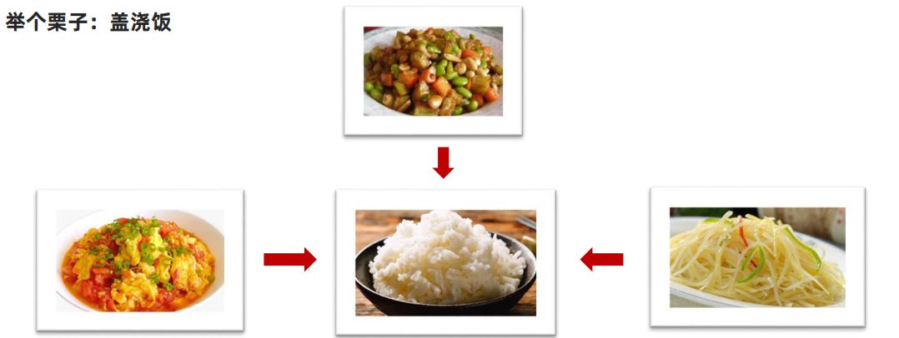
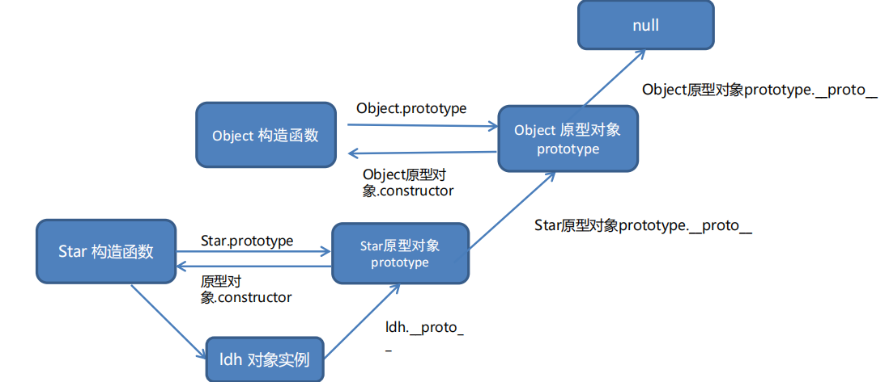

# JavaScript 进阶笔记

---

## 面向对象 & 原型

### 1. 编程思想

#### 面向过程（POP）

- 把解决问题的步骤拆分成若干函数，**按顺序依次调用**
- 思路清晰，适合简单、流程固定的场景
- 类比：**蛋炒饭** — 一步一步按顺序操作


#### 面向对象（OOP）

- 把问题中的事物抽象成**对象**，由对象之间分工协作完成任务
- 每个对象都是功能中心，具有明确分工
- 类比：**盖浇饭** — 各司其职，可复用、易维护



| 对比项 | 面向过程 | 面向对象 |
|--------|----------|----------|
| 思维方式 | 步骤拆解 | 对象抽象 |
| 代码复用 | 较差 | 好 |
| 可维护性 | 较差 | 好 |
| 适用场景 | 小型、简单项目 | 大型、多人协作项目 |

**OOP 三大特性：**

| 特性 | 说明 |
|------|------|
| 封装性 | 将数据和方法包装在对象内部，隐藏实现细节 |
| 继承性 | 子类可复用父类的属性和方法，减少重复代码 |
| 多态性 | 同一操作作用于不同对象，产生不同效果 |

---

### 2. 构造函数

构造函数是实现封装的重要方式，通过 `new` 关键字创建实例对象。

```js
function Person() {
  this.name = '佚名'

  // 设置名字
  this.setName = function (name) {
    this.name = name
  }

  // 读取名字
  this.getName = () => {
    console.log(this.name)
  }
}

const p1 = new Person()
p1.setName('小明')
console.log(p1.name) // 小明

const p2 = new Person()
console.log(p2.name) // 佚名（p1 与 p2 互不影响）
```

> ⚠️ **缺点：** 构造函数中定义的方法，每次 `new` 都会在内存中**重新创建一份**，造成内存浪费。

---

### 3. 原型对象 prototype

为解决构造函数内存浪费问题，将**共享方法**挂载到原型对象上。

**核心规则：**

- 每个构造函数都有一个 `prototype` 属性，指向其**原型对象**
- 原型对象上的方法/属性，**所有实例共享**，不会重复创建
- 构造函数和原型对象中的 `this` 都指向**实例化的对象**

```js
function Person() {}

// 将方法定义在原型对象上（共享，节省内存）
Person.prototype.sayHi = function () {
  console.log('Hi~' + this.name)
}

const p1 = new Person()
p1.sayHi() // Hi~
```

**属性/方法查找顺序：**

```
访问对象属性/方法
    ↓
① 当前实例对象自身
    ↓（没找到）
② 原型对象 prototype
    ↓（没找到）
③ Object.prototype
    ↓（没找到）
null → 返回 undefined
```

> ✅ 实践建议：**不变的方法统一定义在 `prototype` 上，数据属性定义在构造函数内部。**

---

### 4. constructor 属性

- **位置：** 每个原型对象（`prototype`）上都有 `constructor` 属性
- **作用：** 指回该原型对象所属的**构造函数**（即"我的爸爸是谁"）

```js
function Person() {}
console.log(Person.prototype.constructor === Person) // true
```

**使用场景 —— 批量添加原型方法时需手动恢复 `constructor`：**

```js
function Person() {}

// ❌ 这样会覆盖整个 prototype，导致 constructor 丢失
Person.prototype = {
  sayHi() { console.log('Hi') },
  sayBye() { console.log('Bye') }
}

// ✅ 正确做法：手动添加 constructor 指回构造函数
Person.prototype = {
  constructor: Person, // 👈 关键！
  sayHi() { console.log('Hi') },
  sayBye() { console.log('Bye') }
}
```

---

### 5. 对象原型 `__proto__`

- 每个**实例对象**都有一个 `__proto__` 属性，指向其构造函数的 `prototype`
- 正是通过 `__proto__`，实例对象才能访问原型对象上的属性和方法

```js
function Person() {}
const p = new Person()

console.log(p.__proto__ === Person.prototype) // true
console.log(p.__proto__.constructor === Person) // true
```

| 属性 | 所属 | 指向 |
|------|------|------|
| `prototype` | 构造函数 | 原型对象 |
| `__proto__` | 实例对象 | 构造函数的 prototype |
| `constructor` | 原型对象 | 构造函数本身 |

> 📌 `__proto__` 是非标准属性（规范写法为 `[[Prototype]]`），实际开发中不建议直接操作。

---

### 6. 原型继承

JS 中继承主要通过**原型对象**实现：将子类的 `prototype` 指向父类的实例。

```js
// 父类
function Person() {
  this.eyes = 2
  this.head = 1
}

// 子类：Woman
function Woman() {}
// 核心：子类原型 = new 父类实例
Woman.prototype = new Person()
// 恢复 constructor 指向
Woman.prototype.constructor = Woman
// 子类独有方法
Woman.prototype.baby = function () {
  console.log('宝贝~')
}

// 子类：Man
function Man() {}
Man.prototype = new Person()
Man.prototype.constructor = Man

const w = new Woman()
const m = new Man()
console.log(w.eyes) // 2（继承自 Person）
console.log(m.head) // 1（继承自 Person）
```

**原型继承示意：**

```
Woman实例  →  Woman.prototype(=new Person)  →  Person.prototype  →  Object.prototype  →  null
Man实例    →  Man.prototype(=new Person)    →  Person.prototype  →  Object.prototype  →  null
```

---

### 7. 原型链

不同构造函数的原型对象通过 `__proto__` 关联，形成**链状结构**，称为**原型链**。



**原型链查找规则：**

1. 查找对象**自身**是否有该属性/方法
2. 没有则沿 `__proto__` 向上找**原型对象**
3. 再没有则找 **`Object.prototype`**
4. 最终到达 `null`，返回 `undefined`

```js
function Person() {}
const ldh = new Person()

console.log(ldh instanceof Person)  // true
console.log(ldh instanceof Object)  // true
console.log(ldh instanceof Array)   // false
console.log([1,2,3] instanceof Array)  // true
console.log(Array instanceof Object)   // true
```

> 📌 `instanceof` 用于检测某构造函数的 `prototype` 是否出现在实例对象的原型链上。

---

## Day 04 · 深浅拷贝 & 异常 & this & 防抖节流

### 8. 浅拷贝

> 浅拷贝和深拷贝**只针对引用类型**（对象、数组）。

**浅拷贝：** 拷贝对象的第一层属性，若属性值是引用类型，则仅拷贝其**地址**（引用）。

**常见方法：**

```js
// 对象浅拷贝
const obj = { name: 'pink', info: { age: 18 } }

// 方法1：Object.assign
const o1 = Object.assign({}, obj)

// 方法2：展开运算符
const o2 = { ...obj }

// ⚠️ 修改深层属性会互相影响
o1.info.age = 99
console.log(obj.info.age) // 99 ← 被影响了！
```

```js
// 数组浅拷贝
const arr = [1, 2, [3, 4]]
const a1 = [...arr]
const a2 = arr.concat()
```

| 层级 | 浅拷贝结果 |
|------|------------|
| 第一层（基本类型） | ✅ 完全独立，互不影响 |
| 深层（引用类型） | ❌ 共享地址，修改互相影响 |

---

### 9. 深拷贝

**深拷贝：** 拷贝对象的**所有层级**，新旧对象完全独立，互不影响。

#### 方法一：递归实现

```js
function deepCopy(newObj, oldObj) {
  for (let k in oldObj) {
    if (oldObj[k] instanceof Array) {
      // ⚠️ 必须先判断 Array，因为 Array 也是 Object
      newObj[k] = []
      deepCopy(newObj[k], oldObj[k])
    } else if (oldObj[k] instanceof Object) {
      newObj[k] = {}
      deepCopy(newObj[k], oldObj[k])
    } else {
      newObj[k] = oldObj[k]
    }
  }
}

const obj = { uname: 'pink', age: 18, hobby: ['足球'], family: { baby: '小pink' } }
const o = {}
deepCopy(o, obj)

o.family.baby = '老pink'
console.log(obj.family.baby) // 小pink ← 不受影响 ✅
```

#### 方法二：lodash `cloneDeep`

```html
<script src="./lodash.min.js"></script>
<script>
  const obj = { uname: 'pink', age: 18, family: { baby: '小pink' } }
  const o = _.cloneDeep(obj)  // lodash 深拷贝
  o.family.baby = '老pink'
  console.log(obj.family.baby) // 小pink ✅
</script>
```

#### 方法三：JSON 序列化

```js
const obj = { uname: 'pink', age: 18, family: { baby: '小pink' } }
const o = JSON.parse(JSON.stringify(obj))
o.family.baby = '老pink'
console.log(obj.family.baby) // 小pink ✅
```

> ⚠️ **JSON 序列化的局限：**
> - 无法拷贝 `undefined`、`Symbol`、函数
> - 无法处理循环引用
> - `Date` 对象会被转为字符串

**三种深拷贝方法对比：**

| 方法 | 优点 | 缺点 |
|------|------|------|
| 递归 | 可定制，理解原理 | 代码量大，需处理边界 |
| lodash `cloneDeep` | 简单可靠，功能完善 | 需引入第三方库 |
| JSON 序列化 | 代码最简洁 | 不支持函数/undefined/循环引用 |

---

### 10. 异常处理

#### `throw` 抛出异常

```js
function counter(x, y) {
  if (!x || !y) {
    throw new Error('参数不能为空！') // 抛出异常，程序终止
  }
  return x + y
}
counter() // Uncaught Error: 参数不能为空！
```

**要点：**
- `throw` 后程序**立即终止**执行
- 配合 `Error` 对象可提供更详细的错误信息
- `new Error('msg')` 包含 `message`、`stack` 等属性

#### `try...catch...finally`

```js
function foo() {
  try {
    // 预估可能出错的代码
    const p = document.querySelector('.p')
    p.style.color = 'red'
  } catch (error) {
    // 捕获错误，程序不会崩溃
    console.log(error.message)
    return // 阻止后续代码执行
  } finally {
    // 无论是否出错，都会执行
    console.log('finally 始终执行')
  }
}
```

| 关键字 | 说明 |
|--------|------|
| `try` | 包裹可能出错的代码块 |
| `catch(err)` | 捕获错误，`err.message` 为错误信息 |
| `finally` | 无论是否出错都会执行（常用于资源释放） |

#### `debugger`

```js
// 代码中插入 debugger，等同于在浏览器中打断点
function foo() {
  debugger // 执行到此处时，浏览器会暂停
  console.log('hello')
}
```

---

### 11. this 指向

#### 普通函数中的 this

> **谁调用，`this` 就指向谁**

```js
function sayHi() {
  console.log(this)
}
sayHi()           // window（严格模式下为 undefined）
window.sayHi()    // window

const user = { name: '小明' }
user.sayHi = sayHi
user.sayHi()      // user 对象
```

#### 箭头函数中的 this

> **箭头函数本身没有 `this`，访问的是外层作用域的 `this`**

```js
const user = {
  name: '小明',
  // ❌ 不推荐：箭头函数中 this 为 window，不是 user
  walk: () => {
    console.log(this) // window
  },
  // ✅ 推荐：普通函数，this 为 user
  sleep: function () {
    console.log(this) // user
    // 内部箭头函数继承外层 sleep 的 this
    const fn = () => console.log(this) // user
    fn()
  }
}
```

**箭头函数 `this` 的注意事项：**

| 场景 | 建议 |
|------|------|
| DOM 事件回调 | ❌ 不推荐箭头函数（`this` 会变成 `window`） |
| 原型对象方法 | ❌ 不推荐箭头函数（`this` 会变成 `window`） |
| 需要继承外层 `this` 时 | ✅ 推荐使用箭头函数 |

---

### 12. 改变 this 指向

JavaScript 提供 3 个方法动态指定 `this` 的值：

#### `call` — 调用并指定 this，参数逐个传入

```js
function sayHi(msg) {
  console.log(this.name + ':' + msg)
}
const user = { name: '小明' }

sayHi.call(user, 'hello') // 小明:hello
```

#### `apply` — 调用并指定 this，参数以**数组**传入

```js
function counter(x, y) {
  return x + y
}

// apply 第2个参数为数组
const result = counter.apply(null, [5, 10])
console.log(result) // 15

// 实用场景：求数组最大值
const arr = [3, 1, 8, 2]
console.log(Math.max.apply(null, arr)) // 8
```

#### `bind` — **不调用**函数，返回指定了 this 的新函数

```js
function sayHi() {
  console.log(this.name)
}
const user = { name: '小明' }

// 创建新函数，this 永久绑定为 user
const boundFn = sayHi.bind(user)
boundFn() // 小明

// 常见场景：定时器中保留 this
const btn = document.querySelector('button')
btn.addEventListener('click', function () {
  this.disabled = true
  setTimeout(function () {
    this.disabled = false // ❌ this 是 window
  }.bind(this), 2000) // ✅ 绑定 btn
})
```

**三者对比：**

| 方法 | 是否立即调用 | 参数传递方式 | 使用场景 |
|------|-------------|-------------|----------|
| `call` | ✅ 是 | 逐个传入 | 需要立即调用，且有参数 |
| `apply` | ✅ 是 | 数组传入 | 参数已在数组中（如 Math.max） |
| `bind` | ❌ 否 | 逐个传入 | 不立即调用，只修改 this（如回调函数） |

---

### 13. 防抖与节流

性能优化的两种常见手段，用于控制**高频触发**的事件回调执行频率。

#### 防抖（Debounce）

> 事件触发后等待 **n 秒**才执行，若期间再次触发则**重新计时**

- 适用：搜索框输入联想、窗口 resize 后计算、表单验证
- 原理：每次触发先清除上一个定时器，再重新设置

```js
function debounce(fn, delay) {
  let timer = null
  return function (...args) {
    clearTimeout(timer) // 清除上次计时
    timer = setTimeout(() => {
      fn.apply(this, args)
    }, delay)
  }
}

// 使用示例
const input = document.querySelector('input')
input.addEventListener('input', debounce(function () {
  console.log('发起搜索：', this.value)
}, 500))
```

#### 节流（Throttle）

> 连续触发事件，但在 **n 秒内只执行一次**

- 适用：鼠标移动、页面滚动、按钮频繁点击
- 原理：记录上次执行时间，间隔不足则跳过

```js
function throttle(fn, interval) {
  let lastTime = 0
  return function (...args) {
    const now = Date.now()
    if (now - lastTime >= interval) {
      fn.apply(this, args)
      lastTime = now
    }
  }
}

// 使用示例
window.addEventListener('mousemove', throttle(function (e) {
  console.log(e.clientX, e.clientY)
}, 200))
```

**防抖 vs 节流：**

| 对比 | 防抖（Debounce） | 节流（Throttle） |
|------|----------------|----------------|
| 执行时机 | 停止触发后 n 秒执行 | 每 n 秒执行一次 |
| 连续触发时 | 只执行最后一次 | 均匀执行多次 |
| 适用场景 | 输入搜索、表单提交 | 滚动、鼠标移动 |

---

## 📋 知识总结

### Day 03 核心知识点

| 知识点 | 核心内容 |
|--------|----------|
| 面向过程 vs 面向对象 | 步骤拆解 vs 对象抽象；OOP 更灵活、可复用、易维护 |
| 构造函数封装 | `new` 创建实例，实例彼此独立；缺点是方法重复创建浪费内存 |
| 原型对象 `prototype` | 构造函数的 `prototype` 上挂载共享方法，所有实例共享，节省内存 |
| `constructor` 属性 | 原型对象上的属性，指回构造函数；批量赋值原型时需手动恢复 |
| 对象原型 `__proto__` | 实例对象指向其构造函数原型对象，是属性查找链的关键 |
| 原型继承 | `子类.prototype = new 父类()` + 恢复 `constructor`，实现继承 |
| 原型链 | 对象通过 `__proto__` 逐级向上查找，最终到 `Object.prototype → null` |

### Day 04 核心知识点

| 知识点 | 核心内容 |
|--------|----------|
| 浅拷贝 | 仅拷贝第一层，深层引用类型共享地址；`Object.assign` / 展开运算符 |
| 深拷贝 | 完整独立拷贝所有层级；递归 / `lodash.cloneDeep` / `JSON序列化` |
| `throw` | 主动抛出异常，程序终止；配合 `Error` 对象使用 |
| `try...catch` | 捕获异常保证程序不崩溃；`finally` 始终执行，用于资源释放 |
| 普通函数 this | 谁调用指向谁；无明确调用者时指向 `window`（严格模式为 `undefined`） |
| 箭头函数 this | 无自身 `this`，继承外层作用域；不适合 DOM 回调和原型方法 |
| call / apply / bind | 动态改变 `this`；call/apply 立即调用，bind 返回新函数不调用 |
| 防抖 Debounce | n 秒内重复触发则重新计时，只执行最后一次；适合搜索输入 |
| 节流 Throttle | 连续触发时每 n 秒只执行一次；适合滚动、鼠标移动 |

### 🔑 重点难点提示

1. **原型链查找顺序** — 实例自身 → `prototype` → `Object.prototype` → `null`，是 JS 对象系统的核心
2. **深拷贝递归中先判断 Array** — 因为 `Array instanceof Object === true`，若先判断 `Object` 会错误处理数组
3. **箭头函数与普通函数的 this 差异** — 箭头函数的 `this` 在定义时就确定，普通函数在调用时确定
4. **bind 的使用场景** — 最常见于将回调函数的 `this` 绑定到外层对象（如定时器、异步回调）
5. **防抖 vs 节流的选择** — 关注"最终结果"用防抖，关注"过程中的均匀响应"用节流