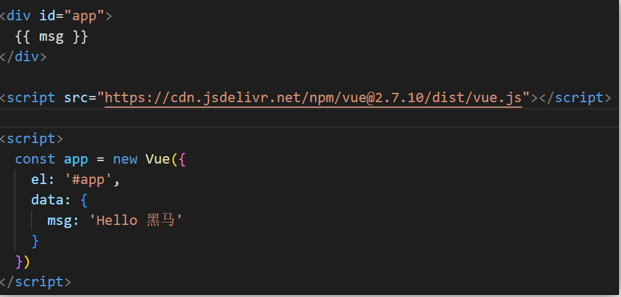
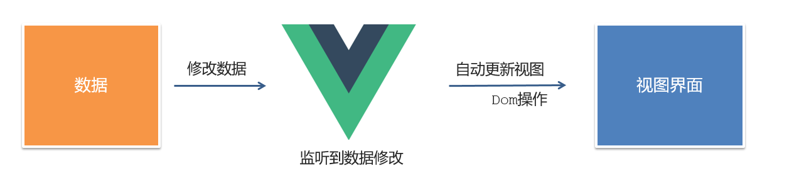
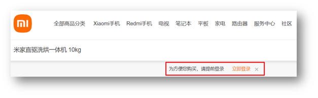
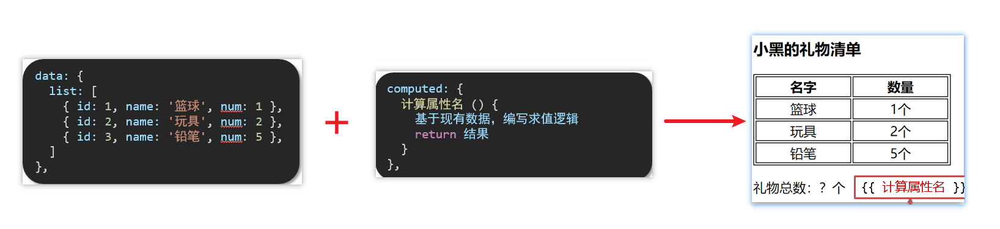
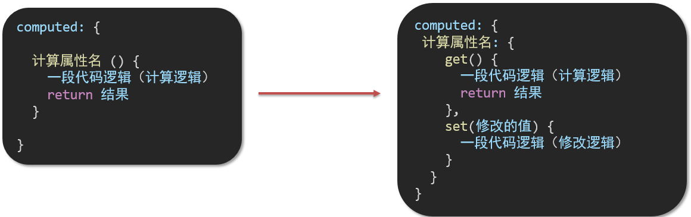
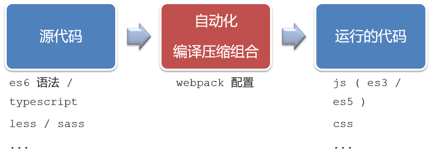
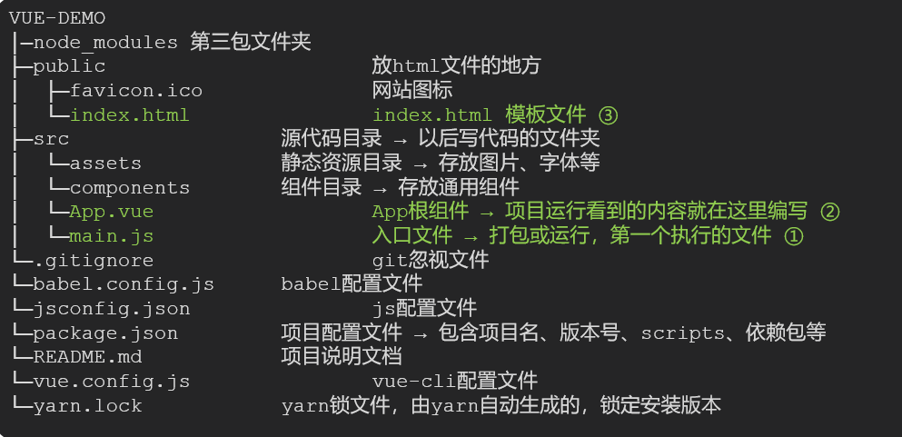
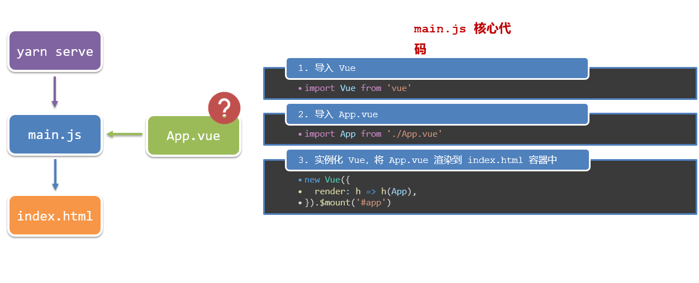
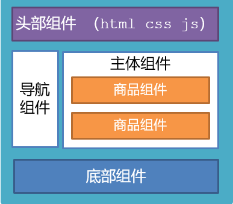
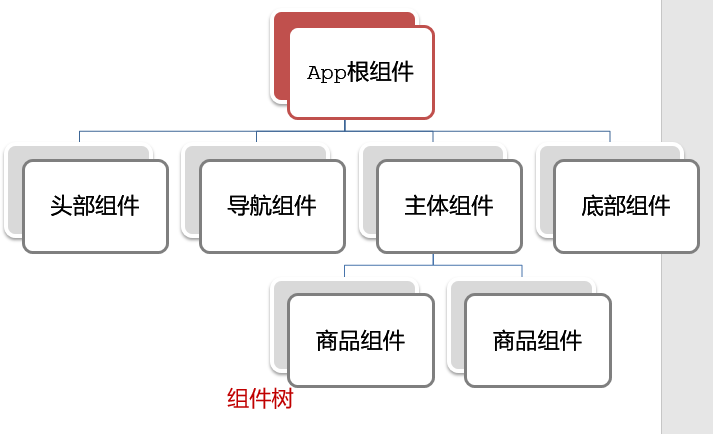

# Vue2 笔记

---

## Vue 基础与常用指令

### 1. 什么是 Vue

> Vue（读音 /vjuː/，类似 view）是一套**构建用户界面**的**渐进式框架**。

#### 核心概念拆解

**① 构建用户界面**

基于数据，渲染出用户可见的页面界面。


**② 渐进式**

循序渐进，不必学完所有 API 才能开发，可以学一点用一点。

| 开发方式 | 说明 | 适用场景 |
|----------|------|----------|
| Vue 核心包 | 只引入 Vue 核心包 | 局部模块改造 |
| Vue 核心包 + 插件 + 工程化 | 完整工程化体系 | 整站开发 |

**③ 框架 vs 库**


| 对比项 | 库（Library） | 框架（Framework） |
|--------|--------------|------------------|
| 定义 | 工具箱，一堆方法集合 | 完整的解决方案 |
| 代表 | axios、lodash、echarts | Vue、React、Angular |
| 使用方式 | 按需调用 | 遵守框架规则编写代码 |

---

### 2. 创建 Vue 实例

**核心步骤（4步）：**

1. 准备容器（HTML 挂载点）
2. 引入 Vue 包（开发版 / 生产版）
3. `new Vue()` 创建实例
4. 指定配置项渲染数据



```html
<!-- 第1步：准备容器 -->
<div id="app">
  {{ msg }}
</div>

<!-- 第2步：引包 -->
<script src="https://cdn.jsdelivr.net/npm/vue@2/dist/vue.js"></script>
<script>
  // 第3步：创建实例，第4步：指定配置项
  const app = new Vue({
    el: '#app',       // 挂载点：与容器 id 对应
    data: {           // 提供数据
      msg: 'Hello Vue!'
    }
  })
</script>
```

**配置项说明：**

| 配置项 | 类型 | 说明 |
|--------|------|------|
| `el` | String | 挂载点，CSS 选择器形式，指定 Vue 管理的容器 |
| `data` | Object | 提供渲染数据，数据变化视图自动更新 |
| `methods` | Object | 提供方法（事件处理函数等） |

---

### 3. 插值表达式

**语法：** `{{ 表达式 }}`

用于在模板中将 `data` 中的数据渲染到页面。


```html
<h3>{{ title }}</h3>
<p>{{ nickName.toUpperCase() }}</p>
<p>{{ age >= 18 ? '成年' : '未成年' }}</p>
<p>{{ obj.name }}</p>
<p>{{ fn() }}</p>
```

**支持的表达式示例：**

```js
money + 100          // 运算表达式
price >= 100 ? 'A' : 'B'  // 三元表达式
obj.name             // 对象属性访问
arr[0]               // 数组索引
fn()                 // 函数调用
```

**❌ 错误用法：**

```html
<!-- 1. data 中未声明的变量 -->
<p>{{ hobby }}</p>

<!-- 2. 语句（if/for 不是表达式） -->
<p>{{ if (true) {} }}</p>

<!-- 3. 标签属性中不能用插值表达式 -->
<p title="{{ username }}">错误示范</p>
```

> ✅ 插值表达式**只能**用在**标签内容**中，不能用于标签属性。

---

### 4. 响应式特性

**响应式：数据变 → 视图自动更新**

`data` 中的数据最终会被代理到 Vue 实例上，可以直接通过实例访问和修改。

```js
const app = new Vue({
  el: '#app',
  data: { count: 0 }
})

// 访问数据
console.log(app.count)  // 0

// 修改数据 → 视图自动更新
app.count = 10
```



---

### 5. 常用指令总览

> 指令（Directives）是 Vue 提供的带有 **`v-` 前缀**的特殊标签属性，用于提升操作 DOM 的效率。

| 分类 | 指令 | 作用 |
|------|------|------|
| 内容渲染 | `v-text` | 渲染纯文本内容（类似 innerText） |
| 内容渲染 | `v-html` | 渲染 HTML 内容（类似 innerHTML） |
| 条件渲染 | `v-show` | 控制元素显示隐藏（切换 display） |
| 条件渲染 | `v-if` / `v-else-if` / `v-else` | 条件性创建/移除元素 |
| 事件绑定 | `v-on` / `@` | 绑定事件监听 |
| 属性绑定 | `v-bind` / `:` | 动态绑定 HTML 属性 |
| 双向绑定 | `v-model` | 表单元素双向数据绑定 |
| 列表渲染 | `v-for` | 基于数组循环渲染列表 |

---

### 6. 内容渲染指令

#### v-text

```html
<!-- 将 uname 的值渲染到 p 标签中，会覆盖原有内容 -->
<p v-text="uname">这里会被覆盖</p>
```

#### v-html

```html
<!-- 能解析 HTML 标签，会覆盖原有内容 -->
<p v-html="intro"></p>
```

```js
const app = new Vue({
  el: '#app',
  data: {
    uname: '张三',
    intro: '<h2>这是一个<strong>非常优秀</strong>的boy</h2>'
  }
})
```

| 指令 | 是否解析 HTML | 说明 |
|------|--------------|------|
| `v-text` | ❌ 不解析 | 渲染纯文本，同 innerText |
| `v-html` | ✅ 解析 | 渲染 HTML，同 innerHTML，注意 XSS 风险 |
| `{{ }}` | ❌ 不解析 | 灵活，可与其他内容混合使用 |

---

### 7. 条件渲染指令

#### v-show

```html
<div v-show="isShow">我是通过 display 控制显示隐藏的</div>
```

- 原理：切换元素的 `display: none`，**DOM 始终存在**
- 适用：**频繁切换**显示隐藏的场景（性能更好）


#### v-if / v-else-if / v-else

```html
<p v-if="gender === 1">♂ 男</p>
<p v-else>♀ 女</p>

<p v-if="score >= 90">A：奖励电脑一台</p>
<p v-else-if="score >= 75">B：奖励周末郊游</p>
<p v-else-if="score >= 60">C：奖励零食礼包</p>
<p v-else>D：惩罚一周不能玩手机</p>
```

- 原理：条件为 `false` 时**直接移除 DOM 节点**
- 适用：**不频繁切换**，或初始渲染时确定不显示的场景



**v-show vs v-if 对比：**

| 对比项 | v-show | v-if |
|--------|--------|------|
| 控制方式 | CSS display | 创建/移除 DOM |
| 初始渲染消耗 | 较高（都渲染） | 较低（false 不渲染） |
| 切换消耗 | 低 | 高（重新创建销毁） |
| 适用场景 | 频繁切换 | 不频繁切换 |

---

### 8. 事件绑定指令

**语法：**
```html
<button v-on:事件名="处理逻辑">按钮</button>
<!-- 简写 -->
<button @事件名="处理逻辑">按钮</button>
```

#### 三种使用方式

**① 内联语句（简单逻辑）**

```html
<button @click="count++">+1</button>
<button @click="count--">-1</button>
<span>{{ count }}</span>
```

**② 方法名（推荐）**

```html
<button @click="toggle">切换显示</button>
```

```js
const app = new Vue({
  el: '#app',
  data: { isShow: true },
  methods: {
    toggle() {
      this.isShow = !this.isShow  // methods 中 this 指向 Vue 实例
    }
  }
})
```

**③ 方法调用传参**

```html
<!-- 传递参数 -->
<button @click="buy(5)">可乐 5元</button>
<button @click="buy(10)">咖啡 10元</button>

<!-- 需要事件对象时，用 $event 占位 -->
<button @click="buy(5, $event)">可乐 5元</button>
```

```js
methods: {
  buy(price, e) {
    this.money -= price
    console.log(e) // 原生事件对象
  }
}
```

> 📌 `methods` 中的函数内部 `this` 始终指向 **Vue 实例**。

---

### 9. 属性绑定指令

**语法：**
```html
<标签 v-bind:属性名="表达式"></标签>
<!-- 简写 -->
<标签 :属性名="表达式"></标签>
```

```html

<a :href="link">跳转</a>
<input :disabled="isDisabled">
```

```js
const app = new Vue({
  el: '#app',
  data: {
    imgUrl: './imgs/banner.png',
    msg: '图片标题',
    isDisabled: true
  }
})
```

> 📌 `v-bind` 用于动态绑定**任意 HTML 属性**，绑定的值是 JS 表达式。

---

### 10. 列表渲染指令

**语法：**
```html
<li v-for="(item, index) in arr" :key="item.id">
  {{ index }} - {{ item.name }}
</li>
```

```html
<!-- 遍历对象 -->
<div v-for="(value, key, index) in obj">{{ key }}: {{ value }}</div>

<!-- 遍历数字（从1开始） -->
<p v-for="n in 10">第 {{ n }} 项</p>
```

**书架案例：**

```html
<ul>
  <li v-for="(item, index) in booksList" :key="item.id">
    <span>{{ item.name }}</span>
    <span>{{ item.author }}</span>
    <button @click="del(item.id)">删除</button>
  </li>
</ul>
```

```js
methods: {
  del(id) {
    this.booksList = this.booksList.filter(item => item.id !== id)
  }
}
```

---

### 11. v-for 中的 key

**语法：** `:key="唯一值"`

**作用：** 给列表项添加**唯一标识**，帮助 Vue 进行列表的**正确排序复用**，提升渲染性能。

```html
<li v-for="(item, index) in list" :key="item.id">
  {{ item.name }}
</li>
```

**注意事项：**

| 规则 | 说明 |
|------|------|
| 值类型 | 只能是**字符串**或**数字** |
| 唯一性 | 必须在当前列表中**唯一** |
| 推荐用 id | 稳定不变，不推荐用 index（会随删除变化） |

> ⚠️ 不加 key 或使用 index 作为 key，在列表有增删操作时可能导致**渲染错乱**（就地复用问题）。

---

### 12. 双向绑定指令

**语法：** `v-model="data中的变量"`

**本质：** 数据 → 视图（`:value`）+ 视图 → 数据（`@input`）的语法糖

```html
<div id="app">
  账户：<input type="text" v-model="username"><br>
  密码：<input type="password" v-model="password"><br>
  <button @click="login">登录</button>
  <button @click="reset">重置</button>
</div>
```

```js
const app = new Vue({
  el: '#app',
  data: {
    username: '',
    password: ''
  },
  methods: {
    login() {
      console.log(this.username, this.password)
    },
    reset() {
      this.username = ''
      this.password = ''
    }
  }
})
```


---

## 指令进阶:计算属性与侦听器

### 13. 指令修饰符

通过 `.` 后缀为指令添加特殊处理行为，简化代码。

#### 按键修饰符

```html
<!-- 仅在按下 Enter 键时触发 -->
<input @keyup.enter="submit" v-model="username">
```

#### v-model 修饰符

```html
<!-- 去除首尾空格 -->
<input v-model.trim="username">

<!-- 自动转为数字类型 -->
<input v-model.number="age">
```

#### 事件修饰符

```html
<!-- 阻止事件冒泡 -->
<div @click="fatherFn">
  <div @click.stop="sonFn">子元素</div>
</div>

<!-- 阻止默认行为（如 a 标签跳转） -->
<a @click.prevent href="http://www.baidu.com">阻止跳转</a>

<!-- 同时阻止冒泡和默认行为 -->
<a @click.stop.prevent href="#">阻止所有</a>
```

**修饰符汇总：**

| 类型 | 修饰符 | 说明 |
|------|--------|------|
| 按键 | `.enter` `.esc` `.tab` | 监听特定按键 |
| v-model | `.trim` | 去除首尾空格 |
| v-model | `.number` | 转换为数字类型 |
| 事件 | `.stop` | 阻止事件冒泡 |
| 事件 | `.prevent` | 阻止默认行为 |
| 事件 | `.once` | 只触发一次 |

---

### 14. v-bind 样式控制增强

#### 动态绑定 class（对象语法）

```html
<!-- 键为类名，值为布尔值；true 则添加该类 -->
<div :class="{ active: isActive, disabled: isDisabled }"></div>
```

适用场景：**一个或多个类名来回切换**（如高亮、选中）

**Tab 栏切换案例：**

```html
<li v-for="(item, index) in list" :key="item.id">
  <a :class="{ active: activeIndex === index }" @click="activeIndex = index">
    {{ item.name }}
  </a>
</li>
```

#### 动态绑定 class（数组语法）

```html
<!-- 数组中所有类名都会添加到元素上 -->
<div :class="['box', 'pink', isBig ? 'big' : '']"></div>
```

适用场景：**批量添加类名**

#### 动态绑定 style

```html
<!-- 对象语法：CSS 属性名用驼峰命名 -->
<div :style="{ backgroundColor: bgColor, fontSize: size + 'px' }"></div>
```

**进度条案例：**

```html
<div class="inner" :style="{ width: percent + '%' }">
  <span>{{ percent }}%</span>
</div>
<button @click="percent = 25">25%</button>
<button @click="percent = 50">50%</button>
<button @click="percent = 75">75%</button>
<button @click="percent = 100">100%</button>
```

---

### 15. v-model 在其他表单元素的使用

`v-model` 会根据控件类型自动选择绑定的正确属性：

| 表单元素 | 绑定属性 | 说明 |
|----------|----------|------|
| `input[text]` / `textarea` | `value` | 文本内容 |
| `input[checkbox]` | `checked` | 是否勾选（布尔值） |
| `input[radio]` | `checked` | 选中的值（需配合 `value`） |
| `select` | `value` | 选中项的 value |

```html
<!-- 文本框 -->
姓名：<input type="text" v-model="name">

<!-- 复选框 -->
是否单身：<input type="checkbox" v-model="isSingle">

<!-- 单选框（需设置 value） -->
性别：
<input type="radio" v-model="gender" value="male">男
<input type="radio" v-model="gender" value="female">女

<!-- 下拉框 -->
城市：
<select v-model="city">
  <option value="bj">北京</option>
  <option value="sh">上海</option>
</select>

<!-- 多行文本 -->
简介：<textarea v-model="desc"></textarea>
```

---

### 16. computed 计算属性

**概念：** 基于**现有数据**计算出新属性，依赖数据变化时**自动重新计算**。

**语法：**

```js
const app = new Vue({
  el: '#app',
  data: {
    list: [
      { id: 1, name: '篮球', num: 3 },
      { id: 2, name: '玩具', num: 2 },
      { id: 3, name: '铅笔', num: 5 }
    ]
  },
  computed: {
    // 计算属性：函数写法，但使用时当属性用
    totalCount() {
      return this.list.reduce((sum, item) => sum + item.num, 0)
    }
  }
})
```

```html
<!-- 模板中像普通属性一样使用 -->
<p>礼物总数：{{ totalCount }} 个</p>
```



**注意事项：**

- `computed` 与 `data` 是**同级**配置项
- 计算属性是**属性**不是方法，模板中不加 `()`
- 计算属性名**不能**与 `data` 中的属性**同名**
- 内部 `this` 指向 **Vue 实例**

---

### 17. computed vs methods



**核心区别：缓存**

```js
computed: {
  // 有缓存：依赖数据不变时，多次访问只计算一次
  totalCount() {
    console.log('计算属性执行了') // 依赖不变时只打印一次
    return this.list.reduce((sum, item) => sum + item.num, 0)
  }
},
methods: {
  // 无缓存：每次调用都重新执行
  getTotalCount() {
    console.log('方法执行了') // 每次调用都打印
    return this.list.reduce((sum, item) => sum + item.num, 0)
  }
}
```

| 对比项 | computed 计算属性 | methods 方法 |
|--------|-----------------|-------------|
| 缓存 | ✅ 有缓存，性能更好 | ❌ 无缓存 |
| 调用方式 | 当属性使用 `{{ total }}` | 当方法调用 `{{ getTotal() }}` |
| 适用场景 | 依赖数据计算结果 | 事件处理、业务逻辑 |

---

### 18. 计算属性的完整写法

默认简写只支持**读取**，如果需要**修改**计算属性，必须使用完整写法（`get` + `set`）。

```js
computed: {
  // 简写（只读）
  // fullName() { return this.firstName + this.lastName }

  // 完整写法（可读可写）
  fullName: {
    get() {
      return this.firstName + ' ' + this.lastName
    },
    set(newValue) {
      // 修改计算属性时触发
      const parts = newValue.split(' ')
      this.firstName = parts[0]
      this.lastName = parts[1]
    }
  }
}
```

```html
姓：<input v-model="firstName">
名：<input v-model="lastName">
全名：<span>{{ fullName }}</span>
<button @click="fullName = '刘 备'">改名</button>
```

---

### 19. watch 侦听器

**作用：** 监视数据变化，执行**业务逻辑**或**异步操作**。

#### 简单写法（监视基本类型 / 对象属性）

```js
watch: {
  // 监视 data 中的属性
  words(newValue, oldValue) {
    console.log('变化了', newValue, oldValue)
    // 可在此发起异步请求
  },

  // 监视对象中的某个属性（用引号包裹）
  'obj.words'(newValue) {
    // 带防抖的异步请求
    clearTimeout(this.timer)
    this.timer = setTimeout(async () => {
      const res = await axios({ url: '...', params: { words: newValue } })
      this.result = res.data.data
    }, 300)
  }
}
```

#### 完整写法（深度监视 / 立即执行）

```js
watch: {
  obj: {
    deep: true,       // 深度监视，监听对象内部属性变化
    immediate: true,  // 立即执行，页面初始化时触发一次 handler
    handler(newValue) {
      clearTimeout(this.timer)
      this.timer = setTimeout(async () => {
        const res = await axios({
          url: 'https://applet-base-api-t.itheima.net/api/translate',
          params: newValue
        })
        this.result = res.data.data
      }, 300)
    }
  }
}
```

**两种写法对比：**

| 特性 | 简单写法 | 完整写法 |
|------|----------|----------|
| 语法复杂度 | 简单 | 较复杂 |
| 深度监视 | ❌ | ✅ `deep: true` |
| 立即执行 | ❌ | ✅ `immediate: true` |
| 适用场景 | 监视基础类型或对象某个属性 | 监视整个对象或需要立即执行 |

---

## 生命周期与工程化开发

### 20. Vue 生命周期

**Vue 生命周期：** 一个 Vue 实例从**创建**到**销毁**的完整过程。

**四个阶段：**


| 阶段 | 说明 | 关键操作 |
|------|------|----------|
| **创建阶段** | 初始化响应式数据 | 可访问 data、methods，但 DOM 未生成 |
| **挂载阶段** | 渲染模板，生成真实 DOM | DOM 渲染完毕，可操作 DOM |
| **更新阶段** | 数据变化，重新渲染视图 | 每次数据更新都会触发 |
| **销毁阶段** | 销毁 Vue 实例 | 清除定时器、取消事件监听等 |

---

### 21. 生命周期钩子函数


```js
const app = new Vue({
  el: '#app',
  data: { count: 0 },

  // ===== 创建阶段 =====
  beforeCreate() {
    // 数据和方法还未初始化，极少使用
  },
  created() {
    // ✅ 数据和方法已初始化，DOM 未渲染
    // 最佳使用场景：发送初始化网络请求（Ajax）
    // this.$el 不可用
  },

  // ===== 挂载阶段 =====
  beforeMount() {
    // DOM 未完成渲染，极少使用
  },
  mounted() {
    // ✅ DOM 渲染完毕
    // 最佳使用场景：操作 DOM、初始化第三方库（echarts 等）、获取焦点
  },

  // ===== 更新阶段 =====
  beforeUpdate() {
    // 数据已改变，DOM 还未更新
  },
  updated() {
    // DOM 已更新完毕
  },

  // ===== 销毁阶段 =====
  beforeDestroy() {
    // ✅ 实例销毁前
    // 最佳使用场景：清除定时器、取消事件监听、释放资源
  },
  destroyed() {
    // 实例已销毁
  }
})
```

**常用钩子速记：**

| 钩子 | 触发时机 | 典型用途 |
|------|----------|----------|
| `created` | 数据初始化完成，DOM 未生成 | 发送网络请求、初始化数据 |
| `mounted` | DOM 渲染完成 | 操作 DOM、初始化图表库、自动聚焦 |
| `beforeDestroy` | 实例销毁前 | 清除定时器、取消订阅 |

**案例：created 中发请求，mounted 中自动聚焦**

```js
const app = new Vue({
  el: '#app',
  data: { list: [], words: '' },
  async created() {
    // 越早发请求越好，created 是最早可以发请求的时机
    const res = await axios.get('http://hmajax.itheima.net/api/news')
    this.list = res.data.data
  },
  mounted() {
    // DOM 已存在，可以操作
    document.querySelector('#inp').focus()
  }
})
```

---

### 22. 工程化开发与脚手架

#### 两种开发方式对比

| 方式 | 说明 | 优缺点 |
|------|------|--------|
| 传统方式 | 直接在 HTML 中引入 Vue | 简单，但不支持现代语法/预处理器 |
| 工程化方式 | 基于 webpack 构建工具 | 功能强大，但需配置 webpack |



#### Vue CLI 脚手架

> Vue CLI 是 Vue 官方提供的**全局命令工具**，可快速创建标准化的 Vue 项目架子（内置 webpack 配置）。

**安装与使用：**

```bash
# 1. 全局安装 Vue CLI（只需一次）
npm install -g @vue/cli
# 或
yarn global add @vue/cli

# 2. 查看版本
vue --version

# 3. 创建项目（项目名不能含中文）
vue create my-project

# 4. 启动项目
cd my-project
npm run serve
# 或
yarn serve
```

---

### 23. 项目目录与运行流程

#### 项目目录结构



```
my-project/
├── public/
│   └── index.html        # 模板文件（挂载点所在）
├── src/
│   ├── assets/           # 静态资源（图片、样式等）
│   ├── components/       # 普通组件
│   ├── App.vue           # 根组件
│   └── main.js           # 入口文件
├── package.json
└── vue.config.js         # Vue CLI 配置文件
```

**三个核心文件：**

| 文件 | 作用 |
|------|------|
| `main.js` | 入口文件，创建 Vue 实例，挂载根组件 |
| `App.vue` | 根组件，所有页面内容的入口 |
| `index.html` | 模板文件，提供 `#app` 挂载点 |

#### 运行流程



```
index.html（提供 #app 容器）
    ↓
main.js（入口：new Vue → 挂载 App.vue）
    ↓
App.vue（根组件：包含页面结构、样式、逻辑）
    ↓
各子组件（Header、Main、Footer...）
```

**main.js 示例：**

```js
import Vue from 'vue'
import App from './App.vue'

Vue.config.productionTip = false

new Vue({
  render: h => h(App),  // 渲染根组件
}).$mount('#app')        // 挂载到 index.html 的 #app
```

---

### 24. 组件化开发

**核心思想：** 把一个页面拆分成若干**独立的组件**，每个组件包含自己的结构、样式、行为。



**优势：**
- 便于维护：每个组件职责单一
- 利于复用：相同功能模块只写一次
- 提升效率：多人并行开发不同组件

**组件分类：**

| 类型 | 说明 |
|------|------|
| 根组件（App.vue） | 整个应用最顶层的组件 |
| 普通组件（.vue 文件） | 可复用的局部功能模块 |

---

### 25. 根组件 App.vue



**.vue 单文件组件由三部分构成：**

```vue
<template>
  <!-- 结构：有且只能有一个根元素 -->
  <div class="app">
    <h1>{{ title }}</h1>
  </div>
</template>

<script>
// JS 逻辑
export default {
  data() {
    return {
      title: 'Hello Vue!'
    }
  }
}
</script>

<style lang="less">
/* 样式：lang="less" 开启 less 支持（需安装 less less-loader） */
.app {
  color: red;
  h1 {
    font-size: 24px;
  }
}
</style>
```

| 区块 | 必须 | 说明 |
|------|------|------|
| `<template>` | ✅ | 组件结构，有且只能有**一个根元素** |
| `<script>` | 否 | JS 逻辑，`export default {}` 导出组件配置 |
| `<style>` | 否 | 组件样式，`lang="less"` 支持 Less 预处理 |

> 📌 推荐安装 **Vetur** 插件（VSCode）获得 .vue 文件语法高亮和智能提示。

---

### 26. 局部注册组件

**特点：** 只能在**注册它的组件内部**使用。

**使用步骤：**

1. 创建 `.vue` 组件文件
2. 在父组件中**导入**
3. 在 `components` 选项中**注册**
4. 在模板中**使用**

```vue
<!-- App.vue -->
<template>
  <div class="app">
    <HmHeader></HmHeader>
    <HmMain></HmMain>
    <HmFooter></HmFooter>
  </div>
</template>

<script>
// 第2步：导入组件
import HmHeader from './components/HmHeader.vue'
import HmMain from './components/HmMain.vue'
import HmFooter from './components/HmFooter.vue'

export default {
  // 第3步：注册组件
  components: {
    HmHeader,   // 等同于 HmHeader: HmHeader
    HmMain,
    HmFooter
  }
}
</script>
```


> 📌 组件命名规范：使用**大驼峰命名法**（PascalCase），如 `HmHeader`、`MyButton`。

---

### 27. 全局注册组件

**特点：** 全局注册的组件，在项目中**任何组件**都可以直接使用。

**使用步骤：**

1. 创建 `.vue` 组件文件
2. 在 `main.js` 中导入并全局注册

```js
// main.js
import Vue from 'vue'
import App from './App.vue'

// 导入全局组件
import HmButton from './components/HmButton.vue'

// 全局注册（在 new Vue 之前）
Vue.component('HmButton', HmButton)

new Vue({
  render: h => h(App)
}).$mount('#app')
```

```vue
<!-- 在任意组件中直接使用，无需导入和注册 -->
<template>
  <div>
    <HmButton></HmButton>
  </div>
</template>
```

**局部 vs 全局注册对比：**

| 对比项 | 局部注册 | 全局注册 |
|--------|----------|----------|
| 注册位置 | 组件内的 `components` 选项 | `main.js` 中 `Vue.component()` |
| 可用范围 | 仅在注册的组件内 | 项目中任意组件 |
| 适用场景 | 组件专用，不复用 | 通用组件（按钮、弹窗等） |

---

### 🔑 重点难点提示

1. **v-show vs v-if 的选择** — 频繁切换用 `v-show`（只改 CSS），条件复杂/初始不渲染用 `v-if`（操作 DOM）

2. **v-for 必须加 :key** — 使用稳定唯一的 `id` 作为 key，避免用 `index`，否则列表增删时会出现渲染错乱

3. **computed 缓存机制** — 依赖数据不变则不重新计算，直接返回缓存结果；methods 无论如何每次都执行

4. **watch 深度监视** — 监视对象整体时需加 `deep: true`，否则对象内部属性变化不会触发；监视对象某属性用 `'obj.key'` 字符串形式

5. **生命周期钩子选择** — 请求数据用 `created`（更早），操作 DOM 和初始化第三方库用 `mounted`（DOM 已就绪）

6. **组件注册命名规范** — 统一使用**大驼峰（PascalCase）**命名，在模板中两种形式均可：`<MyComp>` 或 `<my-comp>`