# Vue2 笔记

---

## 组件进阶与通信

### 1. scoped 样式隔离

#### 问题：默认样式全局生效

组件中的 `<style>` 默认会作用到**全局**，多个组件中存在同名 class 时，样式会互相污染。

#### 解决：添加 scoped 属性

```vue
<style scoped>
  /* 样式只作用于当前组件 */
  .title { color: red; }
</style>
```

#### scoped 原理


1. 给当前组件内所有标签自动添加 `data-v-xxxxxx` 的唯一属性
2. CSS 选择器被自动编译为 `.title[data-v-xxxxxx]` 形式
3. 只有当前组件的元素才有这个自定义属性，样式只能作用到自己组件内

> ✅ **开发建议**：组件样式都应该加 `scoped`，避免样式污染。

---

### 2. data 必须是函数

#### 为什么 data 要写成函数？

组件是**可复用**的，同一个组件可以被使用多次。若 `data` 是一个对象，所有实例会**共享同一份数据**，相互影响。

写成**函数**，每次创建组件实例都会**重新执行函数**，返回一个**全新的独立对象**，保证各实例数据互不干扰。

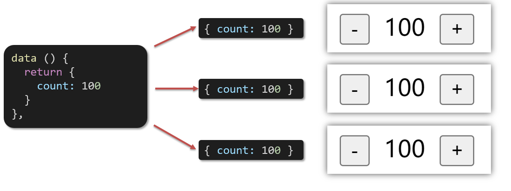

```js
// ❌ 错误写法：所有实例共享同一份数据
export default {
  data: { count: 0 }
}

// ✅ 正确写法：每个实例独立一份数据
export default {
  data() {
    return { count: 0 }
  }
}
```

> 📌 根组件（`main.js` 中的 `new Vue()`）的 data 可以是对象，因为根组件只有一个实例；**普通组件的 data 必须是函数**。

---

### 3. 组件通信概述

**组件通信**：组件与组件之间的数据传递。由于每个组件的数据是独立的，无法直接访问其他组件数据，需要通过特定方案传递。

**组件关系分类：**

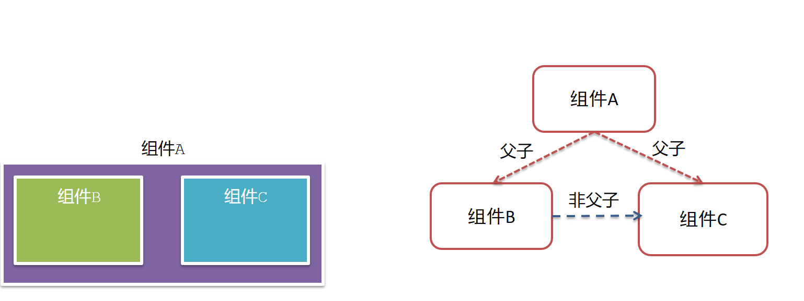

| 关系 | 通信方案 |
|------|----------|
| 父 → 子 | `props` |
| 子 → 父 | `$emit` 自定义事件 |
| 非父子（兄弟/跨层级） | Event Bus / provide & inject |

**父子通信流程图：**

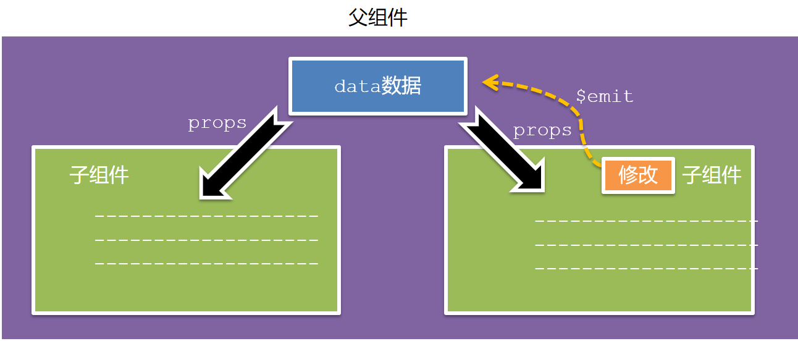

---

### 4. 父传子 Props

**父组件**通过给子组件添加**属性**的方式传值，子组件通过 **`props`** 接收。

**父组件 App.vue：**

```vue
<template>
  <div>
    <!-- 静态传值 -->
    <UserCard title="个人信息" />
    <!-- 动态传值（绑定 data 中的数据） -->
    <UserCard :username="username" :age="age" :isSingle="isSingle" :hobby="hobby" />
  </div>
</template>

<script>
import UserCard from './components/UserCard.vue'
export default {
  components: { UserCard },
  data() {
    return {
      username: '小帅',
      age: 28,
      isSingle: true,
      hobby: ['篮球', '足球', '羽毛球']
    }
  }
}
</script>
```

**子组件 UserCard.vue：**

```vue
<template>
  <div>
    <p>姓名：{{ username }}</p>
    <p>年龄：{{ age }}</p>
    <p>单身：{{ isSingle }}</p>
    <p>爱好：{{ hobby.join('、') }}</p>
  </div>
</template>

<script>
export default {
  // 数组写法（仅接收）
  props: ['username', 'age', 'isSingle', 'hobby']
}
</script>
```

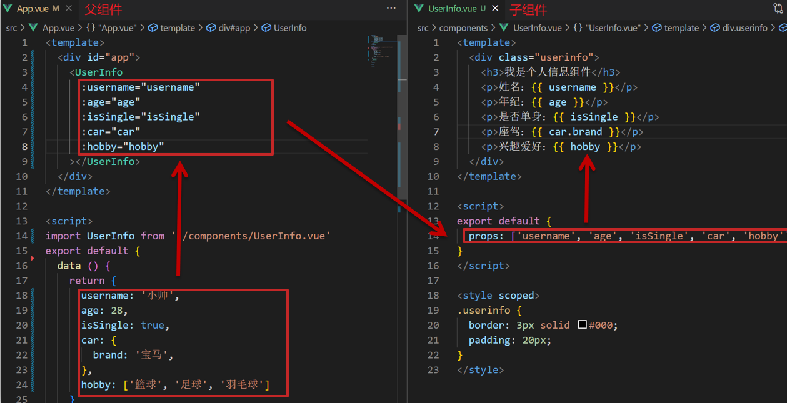

**父向子传值步骤：**

1. 父组件以**属性方式**传值给子组件标签
2. 子组件通过 **`props`** 声明并接收
3. 模板中**直接使用** props 中的值（同 data 一样使用）

---

### 5. Props 校验

为 props 指定验证要求，不符合规则时控制台会报错，便于快速发现问题。


**完整校验写法：**

```js
export default {
  props: {
    // 仅类型校验（简写）
    title: String,

    // 完整校验配置
    w: {
      type: Number,       // 类型：Number / String / Boolean / Array / Object / Function
      required: true,     // 是否必填（required 和 default 一般不同时用）
      default: 0,         // 默认值（复杂类型用函数返回）
      validator(val) {    // 自定义校验
        if (val < 0 || val > 100) {
          console.error('w 的值必须在 0-100 之间')
          return false
        }
        return true
      }
    },

    // 复杂类型的默认值用函数
    list: {
      type: Array,
      default: () => []
    }
  }
}
```

---

### 6. 单向数据流

**核心原则：谁的数据谁负责**

- `data` 的数据是**自己的** → 可以随意修改
- `props` 的数据是**外部传入的** → **不能直接修改**，要遵守单向数据流

**单向数据流：** 父级 props 更新 → 向下流动影响子组件；子组件**不能反向修改** props。

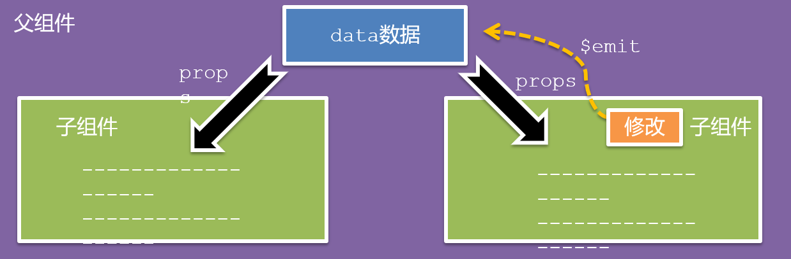

```js
// ❌ 错误：直接修改 props
this.count++ // 如果 count 是 props 传来的，这样会报警告

// ✅ 正确：通过 $emit 通知父组件修改
this.$emit('update-count', this.count + 1)
```

---

### 7. 子传父 $emit

子组件通过 **`$emit`** 触发自定义事件，携带数据通知父组件。


**子组件：**

```vue
<template>
  <div>
    <button @click="handleDelete">删除</button>
  </div>
</template>

<script>
export default {
  methods: {
    handleDelete() {
      // 触发自定义事件，携带数据
      this.$emit('delete-item', this.id)
    }
  }
}
</script>
```

**父组件：**

```vue
<template>
  <!-- 监听子组件触发的自定义事件 -->
  <TodoItem @delete-item="handleDelete" />
</template>

<script>
export default {
  methods: {
    handleDelete(id) {
      // 函数参数就是子组件 $emit 传来的值
      this.list = this.list.filter(item => item.id !== id)
    }
  }
}
</script>
```

**子传父步骤：**

1. 子组件 `$emit('事件名', 数据)` 触发事件
2. 父组件 `@事件名="处理函数"` 监听事件
3. 处理函数的**参数**就是子组件传来的数据

---

### 8. 非父子通信 — Event Bus

**事件总线**：创建一个空的 Vue 实例作为**中间人**，实现任意组件间通信。

**适用场景：** 兄弟组件 / 跨层级组件通信（复杂场景推荐 Vuex）

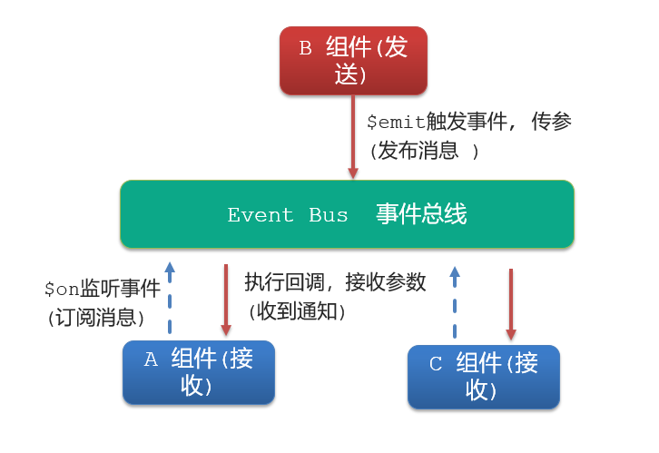

**第一步：创建事件总线 `utils/EventBus.js`**

```js
import Vue from 'vue'
const Bus = new Vue()
export default Bus
```

**第二步：接收方（A 组件）监听事件**

```vue
<script>
import Bus from '../utils/EventBus'
export default {
  data() {
    return { msg: '' }
  },
  created() {
    // 监听事件，接收数据
    Bus.$on('sendMsg', (msg) => {
      this.msg = msg
    })
  }
}
</script>
```

**第三步：发送方（B 组件）触发事件**

```vue
<script>
import Bus from '../utils/EventBus'
export default {
  methods: {
    sendMessage() {
      Bus.$emit('sendMsg', '这是来自 B 的消息')
    }
  }
}
</script>
```

| 角色 | 方法 | 说明 |
|------|------|------|
| 发送方 | `Bus.$emit('事件名', 数据)` | 触发事件，携带数据 |
| 接收方 | `Bus.$on('事件名', 回调)` | 监听事件，获取数据 |

> 📌 一个事件可以被**多个组件同时监听**，都能收到数据。

---

### 9. 非父子通信 — provide & inject

**作用：** 跨层级数据共享，祖先组件向所有后代组件提供数据。

**适用场景：**

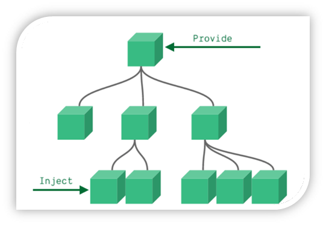

```js
// 祖先组件（App.vue）提供数据
export default {
  provide() {
    return {
      // 简单类型：非响应式
      color: this.color,
      // 复杂类型（对象/数组）：响应式
      userInfo: this.userInfo
    }
  },
  data() {
    return {
      color: 'red',
      userInfo: { name: '小明', age: 18 }
    }
  }
}
```

```js
// 任意后代组件接收
export default {
  inject: ['color', 'userInfo'],
  created() {
    console.log(this.color)    // 'red'
    console.log(this.userInfo) // { name: '小明', age: 18 }
  }
}
```

**注意事项：**

| 数据类型 | 是否响应式 | 说明 |
|----------|-----------|------|
| 简单类型（字符串/数字/布尔） | ❌ 不响应式 | 祖先修改，后代不更新 |
| 复杂类型（对象/数组） | ✅ 响应式 | 祖先修改，后代自动更新 |

> ⚠️ 子孙组件通过 `inject` 获取的数据，**不能在自身组件内直接修改**。

---

### 10. v-model 原理

`v-model` 本质是 `:value` + `@input` 事件的**语法糖**。

```vue
<!-- v-model 语法糖 -->
<input v-model="msg">

<!-- 等价于下面的完整写法 -->
<input :value="msg" @input="msg = $event.target.value">
```

- **数据 → 视图**：`:value` 绑定数据
- **视图 → 数据**：`@input` 监听输入，用 `$event.target.value` 更新数据

> 📌 `$event` 是模板中获取**原生事件对象**的固定写法。

---

### 11. v-model 应用于组件

在**组件**上使用 `v-model`，实现父子组件数据双向绑定。

**本质：**
```vue
<BaseSelect v-model="selectId" />
<!-- 等价于 -->
<BaseSelect :value="selectId" @input="selectId = $event" />
```

**子组件需要：**
- props 通过 **`value`** 接收数据
- 触发 **`input`** 事件向父组件传值

```vue
<!-- BaseSelect.vue 子组件 -->
<template>
  <select :value="value" @change="handleChange">
    <option value="101">北京</option>
    <option value="102">上海</option>
    <option value="103">武汉</option>
  </select>
</template>

<script>
export default {
  props: { value: String },
  methods: {
    handleChange(e) {
      this.$emit('input', e.target.value) // 触发 input 事件
    }
  }
}
</script>
```

```vue
<!-- 父组件 -->
<BaseSelect v-model="selectId"></BaseSelect>
```

---

### 12. .sync 修饰符

**作用：** 简化子组件修改父组件 props 的写法（双向绑定语法糖）。

**本质：**
```vue
<!-- .sync 写法 -->
<BaseDialog :visible.sync="isShow" />

<!-- 等价于完整写法 -->
<BaseDialog :visible="isShow" @update:visible="isShow = $event" />
```

**子组件触发更新：**

```js
// 子组件中触发 update:属性名 事件
this.$emit('update:visible', false)
```

**完整示例：**

```vue
<!-- BaseDialog.vue -->
<script>
export default {
  props: { visible: Boolean },
  methods: {
    close() {
      this.$emit('update:visible', false) // 通知父组件关闭弹窗
    }
  }
}
</script>
```

```vue
<!-- 父组件 -->
<button @click="isShow = true">打开弹窗</button>
<BaseDialog :visible.sync="isShow" />
```

**v-model vs .sync 对比：**

| 特性 | v-model | .sync |
|------|---------|-------|
| 绑定属性名 | 固定为 `value` | 可自定义任意属性名 |
| 触发事件名 | 固定为 `input` | `update:属性名` |
| 适用场景 | 表单类组件 | 弹窗、抽屉等 visible 控制 |

---

### 13. ref 和 $refs

**作用：** 在当前组件内，精准获取**DOM 元素**或**子组件实例**。

```vue
<template>
  <!-- 给 DOM 元素或组件打上 ref 标记 -->
  <div ref="chartRef">图表容器</div>
  <BaseForm ref="formRef" />
</template>

<script>
export default {
  mounted() {
    // 通过 $refs.标记名 获取
    console.log(this.$refs.chartRef)   // DOM 元素
    console.log(this.$refs.formRef)    // 子组件实例（可调用子组件方法）

    // 初始化 echarts（需要真实 DOM）
    const chart = echarts.init(this.$refs.chartRef)
  }
}
</script>
```

**`$refs` vs `document.querySelector` 对比：**

| 方式 | 查找范围 | 精准性 |
|------|----------|--------|
| `document.querySelector` | 整个页面 | ❌ 可能误选其他组件内同名元素 |
| `this.$refs` | **当前组件内** | ✅ 精准，不会跨组件 |

---

### 14. $nextTick 异步更新

#### 问题：Vue 的异步 DOM 更新

Vue 更新 DOM 是**异步**的（批量更新，提升性能），数据修改后 DOM 不会立刻更新。

```js
methods: {
  editFn() {
    this.isShowEdit = true   // 修改数据（DOM 还未更新）
    this.$refs.inp.focus()   // ❌ 此时 input 还未渲染到页面，focus 无效！
  }
}
```

#### 解决：$nextTick

`$nextTick(回调)` 会在 **DOM 更新完成后**才执行回调。

```js
methods: {
  editFn() {
    this.isShowEdit = true
    // ✅ 等 DOM 更新后再执行
    this.$nextTick(() => {
      this.$refs.inp.focus()
    })
  }
}
```

> ⚠️ `$nextTick` 内的回调**必须使用箭头函数**，确保 `this` 指向 Vue 实例。

---

## 自定义指令、插槽与路由入门

### 15. 自定义指令

**概念：** 开发者自己定义的指令，用于**封装 DOM 操作**，扩展额外功能。

#### 全局注册（main.js 中）

```js
// 自动聚焦指令
Vue.directive('focus', {
  inserted(el) {  // 被绑定元素插入父节点时触发
    el.focus()
  }
})
```

#### 局部注册（组件内）

```js
export default {
  directives: {
    focus: {
      inserted(el) {
        el.focus()
      }
    }
  }
}
```

#### 使用指令

```html
<!-- 注册时不加 v-，使用时必须加 v- -->
<input type="text" v-focus />
```

**指令钩子函数说明：**

| 钩子 | 触发时机 |
|------|----------|
| `inserted` | 元素被插入到父节点时（常用） |
| `update` | 组件更新时（数据变化） |
| `bind` | 指令第一次绑定到元素时 |
| `componentUpdated` | 组件及子组件全部更新后 |

---

### 16. 指令的值与 update 钩子

通过 `=` 为指令绑定具体值，通过 `binding.value` 获取，值变化时触发 `update`。

```html
<h2 v-color="color1">文字颜色</h2>
<h2 v-color="color2">文字颜色</h2>
```

```js
directives: {
  color: {
    // 首次绑定时执行
    inserted(el, binding) {
      el.style.color = binding.value
    },
    // 指令的值发生变化时执行
    update(el, binding) {
      el.style.color = binding.value
    }
  }
}
```

---

### 17. v-loading 指令封装

**需求：** 数据请求期间，显示 loading 蒙层，请求完成后移除。

**实现思路：**

1. 准备 `.loading` CSS 类，通过伪元素实现全屏蒙层
2. `v-loading="true"` → 添加 `.loading` 类（显示蒙层）
3. `v-loading="false"` → 移除 `.loading` 类（隐藏蒙层）

```css
/* 蒙层样式 */
.loading:before {
  content: '';
  position: absolute;
  left: 0;
  top: 0;
  width: 100%;
  height: 100%;
  background: #fff url('./loading.gif') no-repeat center;
}
```

```js
// 注册 v-loading 指令
Vue.directive('loading', {
  inserted(el, binding) {
    binding.value ? el.classList.add('loading') : el.classList.remove('loading')
  },
  update(el, binding) {
    binding.value ? el.classList.add('loading') : el.classList.remove('loading')
  }
})
```

```vue
<!-- 使用 -->
<div class="box" v-loading="isLoading">
  <ul>...</ul>
</div>
```

---

### 18. 默认插槽

**作用：** 让组件内部的某些**结构**支持**自定义**，使组件更加灵活复用。

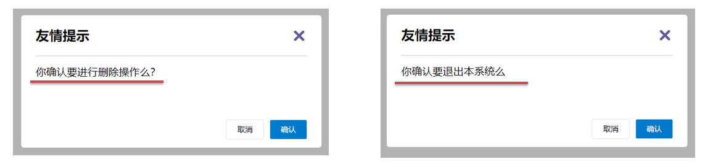

**语法：**

```vue
<!-- MyDialog.vue 组件内部 -->
<template>
  <div class="dialog">
    <div class="dialog-header">友情提示</div>
    <div class="dialog-content">
      <!-- slot 占位，使用组件时传入内容会替换这里 -->
      <slot>这是默认内容（后备内容）</slot>
    </div>
    <div class="dialog-footer">
      <button>确认</button>
    </div>
  </div>
</template>
```

```vue
<!-- 使用组件时传入自定义内容 -->
<MyDialog>
  <p>确定要删除吗？</p>
</MyDialog>

<!-- 不传内容，显示后备内容 -->
<MyDialog></MyDialog>
```

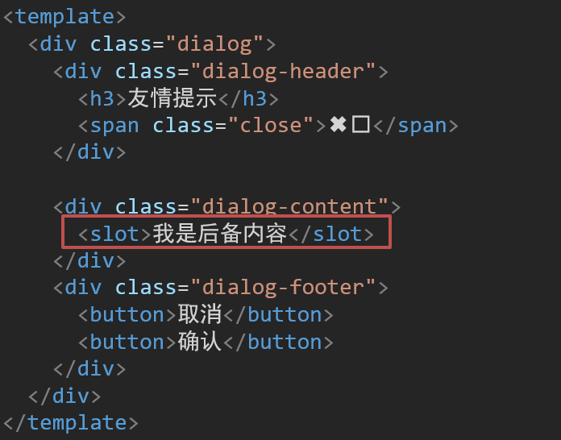

**插槽使用步骤：**

1. 组件内用 `<slot></slot>` 占位
2. 使用组件时，在标签内传入内容
3. 可以传：纯文本、HTML 标签、组件

---

### 19. 具名插槽

**作用：** 一个组件内有**多处**需要自定义的结构时，用 `name` 区分不同插槽。

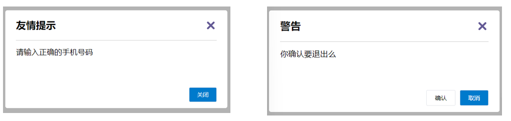

**组件内定义具名插槽：**

```vue
<!-- MyDialog.vue -->
<template>
  <div class="dialog">
    <div class="dialog-header">
      <slot name="head"></slot>   <!-- 具名插槽 -->
    </div>
    <div class="dialog-content">
      <slot name="content"></slot>
    </div>
    <div class="dialog-footer">
      <slot name="footer"></slot>
    </div>
  </div>
</template>
```

**使用组件时分发内容：**

```vue
<MyDialog>
  <!-- v-slot:插槽名，简写为 #插槽名 -->
  <template #head>
    <h3>温馨提示</h3>
  </template>

  <template #content>
    <p>确认要退出系统吗？</p>
  </template>

  <template #footer>
    <button>取消</button>
    <button>确认</button>
  </template>
</MyDialog>
```

> 📌 `v-slot:名字` 可以简写为 **`#名字`**，只能用在 `<template>` 标签上。

---

### 20. 作用域插槽

**作用：** 子组件在定义插槽时，可以**向外传递数据**，父组件使用插槽时可以接收并使用这些数据。

**使用场景：** 封装表格组件，表格行的操作按钮由外部自定义，但数据由内部提供。

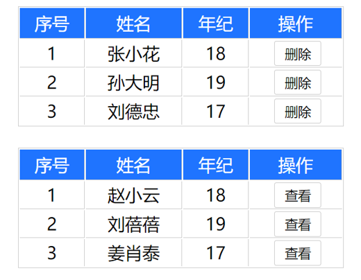

**子组件（MyTable.vue）向插槽传数据：**

```vue
<template>
  <table>
    <tbody>
      <tr v-for="(item, index) in data" :key="item.id">
        <td>{{ item.name }}</td>
        <td>
          <!-- 给 slot 绑定数据，外部可以使用 -->
          <slot :item="item" :index="index"></slot>
        </td>
      </tr>
    </tbody>
  </table>
</template>
```

**父组件接收插槽数据：**

```vue
<MyTable :data="list">
  <!-- #default="obj" 接收插槽传来的所有数据对象 -->
  <template #default="{ item, index }">
    <button @click="del(item.id)">删除</button>
    <button @click="edit(item)">编辑</button>
  </template>
</MyTable>
```

**三种插槽对比：**

| 插槽类型 | 语法 | 核心能力 |
|----------|------|----------|
| 默认插槽 | `<slot>` | 自定义单处结构 |
| 具名插槽 | `<slot name="xxx">` + `#xxx` | 自定义多处结构 |
| 作用域插槽 | `<slot :data="val">` + `#default="obj"` | 自定义结构 + 使用子组件数据 |

---

### 21. 单页应用程序 SPA

| 对比 | 单页应用（SPA） | 多页应用（MPA） |
|------|----------------|----------------|
| 定义 | 所有功能在**一个 HTML** 中实现 | 多个 HTML 页面 |
| 页面切换 | **局部刷新**，用户体验好 | 整页跳转，体验较差 |
| 首屏加载 | 较慢（一次性加载资源） | 较快 |
| 适用场景 | 系统类/内部网站/移动端 | 公司官网/电商网站 |
| 代表 | 网易云音乐、后台管理系统 | 京东、淘宝 |

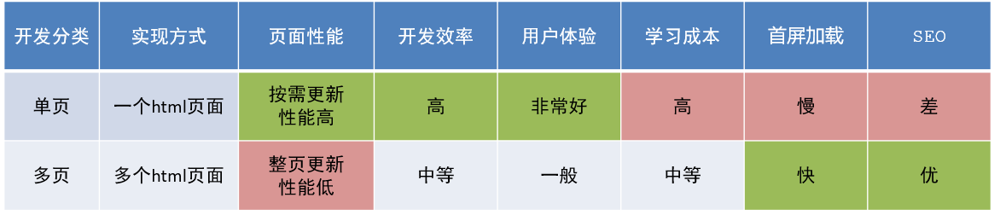

---

### 22. VueRouter 基本使用

**VueRouter：** Vue 官方路由插件，实现**路径变化**时**切换显示**对应**组件**。

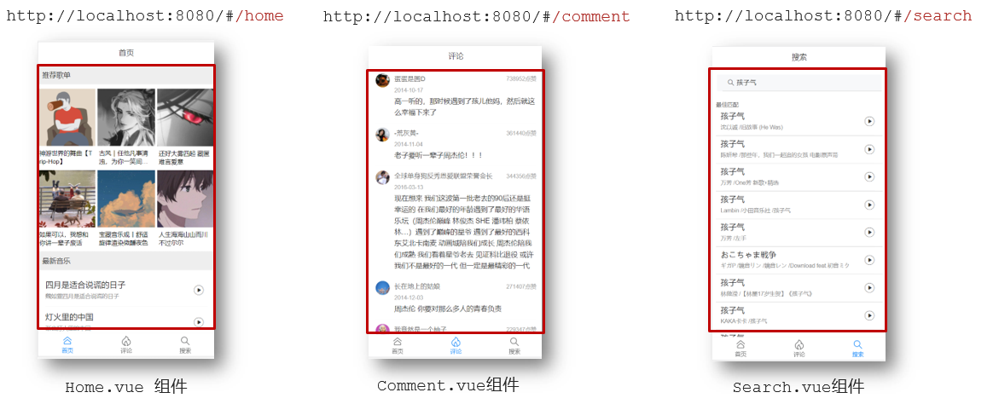

#### 5 + 2 步骤

**5 个基础步骤（main.js）：**

```js
// 1. 安装
// yarn add vue-router@3.6.5

// 2. 引入
import VueRouter from 'vue-router'

// 3. 安装注册插件
Vue.use(VueRouter)

// 4. 创建路由对象，配置路由规则
const router = new VueRouter({
  routes: [
    { path: '/home', component: Home },
    { path: '/search', component: Search }
  ]
})

// 5. 注入到 Vue 实例
new Vue({
  render: h => h(App),
  router  // 建立关联
}).$mount('#app')
```

**2 个核心步骤（模板中）：**

```vue
<!-- 第1步：配置导航链接 -->
<a href="#/home">首页</a>
<a href="#/search">搜索</a>

<!-- 第2步：配置路由出口（组件渲染位置） -->
<router-view></router-view>
```

---

### 23. 组件存放目录规范

| 目录 | 存放内容 | 用途 |
|------|----------|------|
| `src/views/` | **页面组件** | 配合路由使用，整个页面级别 |
| `src/components/` | **复用组件** | 多个页面共用的小组件 |

> 分类目的：**更易维护**，职责清晰。

---

### 24. 路由模块抽离

将路由配置从 `main.js` 中抽离到独立文件，便于维护。

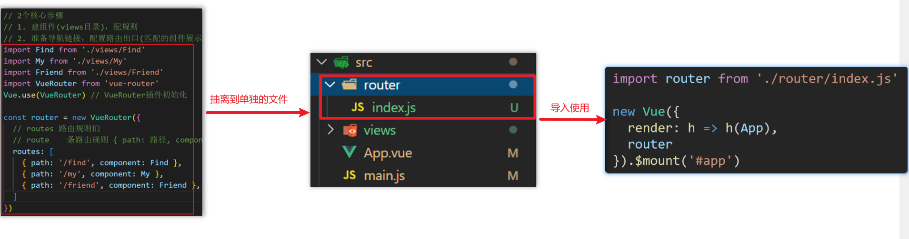

**`src/router/index.js`：**

```js
import Vue from 'vue'
import VueRouter from 'vue-router'
import Home from '@/views/Home.vue'   // @ 代表 src 目录
import Search from '@/views/Search.vue'

Vue.use(VueRouter)

const router = new VueRouter({
  routes: [
    { path: '/home', component: Home },
    { path: '/search', component: Search }
  ]
})

export default router
```

**`main.js` 中引入：**

```js
import router from './router/index'  // 或 './router'

new Vue({
  render: h => h(App),
  router
}).$mount('#app')
```

> 📌 `@` 是脚手架环境下 `src` 目录的别名，用于快速引入组件，避免相对路径过长。

---

## Vue Router 深入

### 25. 声明式导航 router-link

`router-link` 是 Vue Router 提供的**全局组件**，用于替代 `<a>` 标签实现路由跳转。

```vue
<router-link to="/home">首页</router-link>
<router-link to="/search">搜索</router-link>
<!-- 路由出口 -->
<router-view></router-view>
```

**`router-link` vs `<a>` 标签：**

| 对比 | `<a>` 标签 | `router-link` |
|------|-----------|----------------|
| `href` | 需要加 `#` | `to` 属性，**无需加 `#`** |
| 导航高亮 | ❌ 需手动维护 | ✅ 自动添加高亮类名 |
| 本质 | — | 渲染为 `<a>` 标签 |

---

### 26. router-link 高亮类名

`router-link` 跳转后，会自动给当前激活的链接添加两个类名：


| 类名 | 匹配方式 | 说明 |
|------|----------|------|
| `router-link-active` | **模糊匹配**（常用） | `to="/my"` 可匹配 `/my`、`/my/a`、`/my/b` 等 |
| `router-link-exact-active` | **精确匹配** | `to="/my"` 仅匹配 `/my` |

```css
/* 给高亮类名设置样式 */
.router-link-active {
  color: #e01222;
  background-color: #fff;
}
```

---

### 27. 自定义高亮类名

默认类名太长，可以自定义：

```js
const router = new VueRouter({
  routes: [...],
  linkActiveClass: 'active',          // 自定义模糊匹配类名
  linkExactActiveClass: 'exact-active' // 自定义精确匹配类名
})
```

---

### 28. 查询参数传参

**传参：** 在 `to` 属性中通过 `?` 拼接参数

```vue
<!-- 声明式 -->
<router-link to="/search?keyword=Vue&type=1">搜索</router-link>
```

```js
// 编程式
this.$router.push('/search?keyword=Vue&type=1')
// 或对象写法
this.$router.push({
  path: '/search',
  query: { keyword: 'Vue', type: 1 }
})
```

**接收参数：** `$route.query.参数名`

```js
created() {
  console.log(this.$route.query.keyword) // 'Vue'
}
```

---

### 29. 动态路由传参

**配置动态路由：**

```js
const router = new VueRouter({
  routes: [
    { path: '/detail/:id', component: ArticleDetail },
    // 参数可选（加 ? 号）
    { path: '/search/:words?', component: Search }
  ]
})
```

**传参：**

```vue
<!-- 声明式 -->
<router-link :to="`/detail/${item.id}`">查看详情</router-link>
```

```js
// 编程式
this.$router.push(`/detail/${item.id}`)
```

**接收参数：** `$route.params.参数名`

```js
created() {
  const id = this.$route.params.id
}
```

**两种传参方式对比：**

| 对比项 | 查询参数传参 | 动态路由传参 |
|--------|-------------|-------------|
| URL 形式 | `/path?key=value` | `/path/value` |
| 适合传 | **多个参数** | **单个参数**（更优雅） |
| 接收方式 | `$route.query.key` | `$route.params.key` |
| 路由配置 | 无需特殊配置 | 需配置 `:参数名` |

---

### 30. 路由重定向与 404

#### 重定向

```js
const router = new VueRouter({
  routes: [
    // 访问 / 时自动跳转到 /home
    { path: '/', redirect: '/home' },
    { path: '/home', component: Home },
    { path: '/search', component: Search }
  ]
})
```

#### 404 页面

```js
import NotFound from '@/views/NotFound.vue'

const router = new VueRouter({
  routes: [
    { path: '/home', component: Home },
    // ... 其他路由
    // 放在最后，匹配所有未知路径
    { path: '*', component: NotFound }
  ]
})
```

---

### 31. 路由模式 Hash / History

| 模式 | URL 示例 | 说明 |
|------|----------|------|
| `hash`（默认） | `http://localhost:8080/#/home` | 带 `#`，兼容性好，无需服务端配置 |
| `history` | `http://localhost:8080/home` | 无 `#`，更美观，**上线需服务端支持** |

```js
const router = new VueRouter({
  mode: 'history', // 切换为 history 模式
  routes: [...]
})
```

---

### 32. 编程式导航

用 **JS 代码**实现路由跳转，适用于点击按钮等场景。

#### 两种跳转语法

```js
// path 路径跳转（简易）
this.$router.push('/home')
this.$router.push({ path: '/home' })

// name 命名路由跳转（路径长时更清晰）
this.$router.push({ name: 'ArticleDetail' })
```

#### 编程式导航传参

```js
// ① path + query 传参
this.$router.push('/search?keyword=Vue')
this.$router.push({ path: '/search', query: { keyword: 'Vue' } })

// ② path + 动态路由传参
this.$router.push('/detail/123')
this.$router.push({ path: '/detail/123' })

// ③ name + query 传参
this.$router.push({ name: 'Search', query: { keyword: 'Vue' } })

// ④ name + params 动态路由传参
this.$router.push({ name: 'Detail', params: { id: 123 } })
```

**回退上一页：**

```js
this.$router.back()  // 等同于浏览器后退
this.$router.go(-1)  // 也可以用 go(-n)
```

> ⚠️ `path` 不能配合 `params` 使用，`params` 只能配合 `name` 使用。

---

### 33. 嵌套路由（二级路由）

**使用场景：** 页面中只有**部分内容切换**时，使用嵌套路由（如底部 TabBar 切换内容区）。

**配置语法：**

```js
const router = new VueRouter({
  routes: [
    {
      path: '/',
      component: Layout,
      redirect: '/article',       // 默认重定向到子路由
      children: [                  // 二级路由配置
        // 注意：子路由 path 不加 /
        { path: '/article', component: Article },
        { path: '/collect', component: Collect },
        { path: '/like', component: Like },
        { path: '/user', component: User }
      ]
    },
    { path: '/detail/:id', component: ArticleDetail }
  ]
})
```

**在一级路由组件中配置二级出口：**

```vue
<!-- Layout.vue -->
<template>
  <div class="layout">
    <!-- 内容区：显示二级路由匹配的组件 -->
    <div class="content">
      <router-view></router-view>
    </div>
    <!-- 底部导航 -->
    <nav class="tabbar">
      <router-link to="/article">面经</router-link>
      <router-link to="/collect">收藏</router-link>
      <router-link to="/like">喜欢</router-link>
      <router-link to="/user">我的</router-link>
    </nav>
  </div>
</template>

<style>
/* 高亮二级导航 */
a.router-link-active {
  color: orange;
}
</style>
```

---

### 34. keep-alive 组件缓存

**问题：** 路由切换时，原组件被**销毁**，返回后重新创建，数据重新加载（滚动位置也丢失）。

**解决：** 用 `<keep-alive>` 包裹 `<router-view>`，缓存不活跃的组件实例。

```vue
<!-- App.vue -->
<template>
  <div>
    <!-- 缓存指定组件 -->
    <keep-alive :include="['LayoutPage']">
      <router-view></router-view>
    </keep-alive>
  </div>
</template>
```

**keep-alive 三个属性：**

| 属性 | 类型 | 说明 |
|------|------|------|
| `include` | 字符串/数组 | 只有匹配的组件**会被缓存** |
| `exclude` | 字符串/数组 | 匹配的组件**不会被缓存** |
| `max` | 数字 | 最多缓存多少个组件实例 |

> 📌 `include`/`exclude` 中的值是组件的 **`name` 属性**，因此需要给组件设置 `name`。

**keep-alive 触发的额外钩子：**

```js
export default {
  name: 'LayoutPage',
  activated() {
    // 组件被激活（进入页面）时触发
    console.log('页面被激活，可在此刷新数据')
  },
  deactivated() {
    // 组件被停用（离开页面）时触发
    console.log('页面被缓存')
  }
}
```

> ⚠️ 缓存后的组件**不再触发** `created`、`mounted`、`destroyed` 等钩子，改用 `activated` / `deactivated`。

---

### 35. ESlint 代码规范

**ESLint：** 代码检查工具，确保代码符合团队约定的规范（项目使用 JavaScript Standard Style）。

**常见规范要求：**

- 字符串使用**单引号**
- 语句末尾**不加分号**
- 关键字后**加空格**：`if (condition) {}`
- 使用**全等** `===`，不用 `==`

**VS Code 配置自动修复（settings.json）：**

```json
{
  "editor.codeActionsOnSave": {
    "source.fixAll": true   // 保存时自动修复 ESLint 错误
  },
  "editor.formatOnSave": false  // 关闭 VS Code 自带格式化
}
```
---

### 🔑 重点难点提示

1. **组件通信方案选择** — 父子通信用 props/$emit；兄弟/跨层级少量数据用 Event Bus；深层跨级共享用 provide/inject；复杂应用用 Vuex

2. **v-model / .sync 的区别** — v-model 固定绑定 `value` 属性 + `input` 事件，适合表单；.sync 可自定义属性名，适合弹窗等 visible 控制场景

3. **$nextTick 的使用时机** — 凡是**修改数据后立即操作 DOM**（如获取焦点、获取元素尺寸），都需要用 $nextTick 等 DOM 更新后再操作

4. **作用域插槽的核心理解** — 数据在子组件内，结构由父组件定义；子传数据给 slot，父通过 `#default="obj"` 消费

5. **动态路由传参与查询参数** — 单个核心 id 用动态路由（URL 更优雅），多个筛选参数用 query（无需修改路由配置）；注意 `path` 不能配合 `params` 使用

6. **keep-alive 缓存** — 缓存后组件不再触发 created/mounted，改用 activated 处理进入页面的逻辑；include 中填写组件的 name 属性值