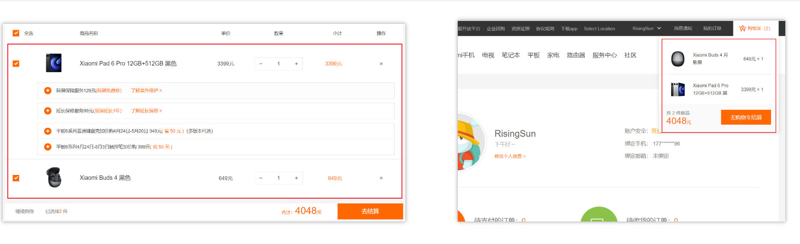
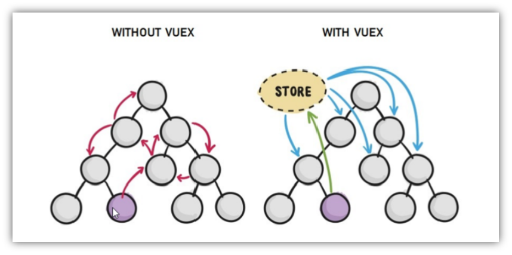
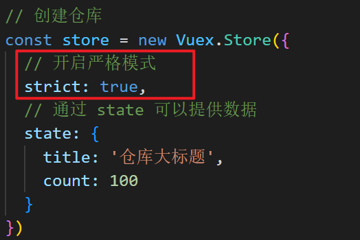
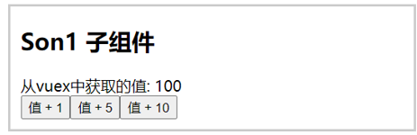
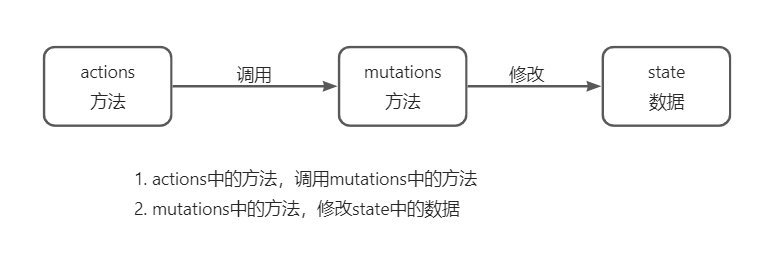
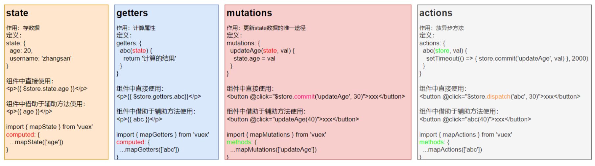
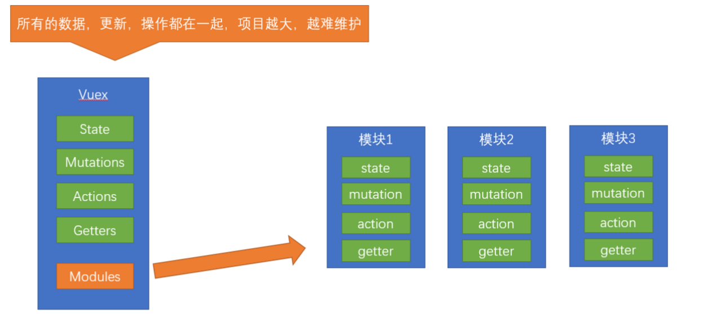
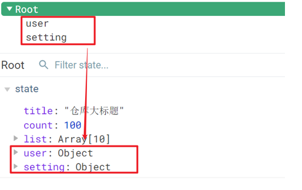

# Vue2 笔记 

---


## 1. Vuex 概述

### 什么是 Vuex

Vuex 是 Vue 的**状态管理工具（插件）**，用于管理多个组件**共享的数据**（状态）。

> 大白话：把多个组件都要用的数据，统一放到一个"仓库"里集中管理。

**典型使用场景：**
- 个人信息（多个组件都要展示用户名、头像）
- 购物车数据（多个页面都要读取和修改）



### 优势



| 优势 | 说明 |
|------|------|
| 数据集中化管理 | 所有共享数据统一存储，避免数据分散 |
| 响应式变化 | 数据变化，所有使用该数据的组件自动更新 |
| 操作简洁 | 提供辅助函数（mapState、mapMutations 等）简化代码 |

> ⚠️ 不是所有场景都需要 Vuex，仅在**多组件共享数据**时使用。引入 Vuex 会增加项目复杂度，按需使用。

---

## 2. 创建 Vuex 仓库

### 安装

```bash
yarn add vuex@3
# 或
npm i vuex@3
```

> 注意：Vue2 对应 **Vuex3**，Vue3 对应 Vuex4。

### 创建仓库文件 `store/index.js`

```js
import Vue from 'vue'
import Vuex from 'vuex'

// 1. 安装插件
Vue.use(Vuex)

// 2. 创建仓库
const store = new Vuex.Store({
  // 配置项：state / mutations / actions / getters / modules
})

// 3. 导出仓库
export default store
```

### 在 `main.js` 中挂载

```js
import Vue from 'vue'
import App from './App.vue'
import store from './store'  // 引入仓库

new Vue({
  render: h => h(App),
  store  // 挂载到 Vue 实例，所有组件可通过 this.$store 访问
}).$mount('#app')
```

### 验证是否挂载成功

```js
// App.vue
created() {
  console.log(this.$store) // 打印出仓库对象即成功
}
```

---

## 3. 核心概念 — state

**state** 是 Vuex 的**数据源**，类似组件中的 `data`，但供**全局所有组件**访问。

### 提供数据

```js
const store = new Vuex.Store({
  state: {
    count: 101,
    title: 'Vuex 状态管理'
  }
})
```

### 三种访问方式

**① 模板中直接访问**

```html
<h1>{{ $store.state.count }}</h1>
```

**② 组件逻辑中访问**

```js
methods: {
  getCount() {
    return this.$store.state.count
  }
}
// 或通过计算属性
computed: {
  count() {
    return this.$store.state.count
  }
}
```

**③ JS 模块文件中访问（import 导入）**

```js
import store from '@/store'
console.log(store.state.count)
```

---

## 4. 辅助函数 mapState

**作用：** 将 store 中的 state 数据**批量映射**为组件的**计算属性**，避免重复写 `this.$store.state.xxx`。

```js
import { mapState } from 'vuex'

export default {
  computed: {
    // 展开运算符将映射结果混入 computed
    ...mapState(['count', 'title'])
    // 等价于：
    // count() { return this.$store.state.count },
    // title() { return this.$store.state.title }
  }
}
```

```html
<!-- 模板中直接使用，无需 $store.state -->
<div>{{ count }}</div>
<div>{{ title }}</div>
```

---

## 5. 严格模式与单向数据流

### 问题：直接修改 state

```js
// ❌ 错误：直接修改 state（Vue 默认不监测，不报错但违反规范）
this.$store.state.count++
```

### 开启严格模式

```js
const store = new Vuex.Store({
  strict: true,  // 开启严格模式
  state: { count: 0 }
})
```

开启后，直接修改 state 会**抛出错误**，强制通过 `mutations` 修改数据。



**Vuex 单向数据流规则：**

```
组件 → dispatch(action) → commit(mutation) → 修改 state → 响应式更新组件
```

> 📌 核心原则：**state 的修改只能通过 mutations，且 mutations 必须是同步的。**

---

## 6. 核心概念 — mutations

**mutations** 是 Vuex 中**唯一合法修改 state 的方式**，必须是**同步**操作。

### 定义 mutations

```js
const store = new Vuex.Store({
  state: { count: 0 },
  mutations: {
    // 第一个参数固定为 state
    addCount(state) {
      state.count += 1
    },
    changeTitle(state) {
      state.title = '新标题'
    }
  }
})
```

### 组件中提交 mutations

```js
// 语法：this.$store.commit('mutations方法名')
methods: {
  handleAdd() {
    this.$store.commit('addCount')
  }
}
```

**mutations 的完整流程：**

1. 在 store 的 `mutations` 中**定义方法**
2. 组件中通过 **`$store.commit('方法名')`** 调用
3. mutations 方法内修改 `state` 数据
4. 所有使用该数据的组件**自动响应更新**

---

## 7. 带参数的 mutations

mutations 方法可以接收**一个额外参数**（载荷 payload），用于传递动态数据。



### 定义带参数的 mutations

```js
mutations: {
  addCount(state, n) {
    state.count += n
  },
  changeCount(state, newCount) {
    state.count = newCount
  }
}
```

### 提交时传参

```js
// 传单个参数
this.$store.commit('addCount', 10)

// 传多个参数时，用对象包装
this.$store.commit('addCount', {
  count: 10,
  step: 2
})
```

### 双向绑定 Vuex 数据

```vue
<!-- 不能直接用 v-model 绑定 state，需要拆分为 :value + @input -->
<input :value="count" @input="handleInput" type="text">

<script>
methods: {
  handleInput(e) {
    const num = +e.target.value
    this.$store.commit('changeCount', num)
  }
}
</script>
```

---

## 8. 辅助函数 mapMutations

**作用：** 将 mutations 中的方法**批量映射**为组件的 `methods`，简化调用代码。

```js
import { mapMutations } from 'vuex'

export default {
  methods: {
    ...mapMutations(['addCount', 'subCount'])
    // 等价于：
    // addCount(n) { this.$store.commit('addCount', n) },
    // subCount(n) { this.$store.commit('subCount', n) }
  }
}
```

```html
<!-- 直接调用，参数会自动传递 -->
<button @click="addCount(5)">+5</button>
<button @click="subCount(3)">-3</button>
```

---

## 9. 核心概念 — actions

**actions** 负责处理**异步操作**（如 Ajax 请求），然后通过 commit 调用 mutations 修改 state。

> ⚠️ mutations 必须是同步的，异步逻辑必须放在 actions 中。



### 定义 actions

```js
const store = new Vuex.Store({
  state: { count: 0 },
  mutations: {
    changeCount(state, newCount) {
      state.count = newCount
    }
  },
  actions: {
    // context：上下文对象（类似 store），可调用 commit / dispatch / state 等
    setAsyncCount(context, num) {
      setTimeout(() => {
        // actions 不能直接修改 state，必须通过 commit 调用 mutations
        context.commit('changeCount', num)
      }, 1000)
    },

    // 异步请求示例
    async fetchUserInfo(context) {
      const res = await axios.get('/api/user')
      context.commit('setUserInfo', res.data)
    }
  }
})
```

### 组件中调用 actions

```js
// 语法：this.$store.dispatch('action方法名', 参数)
methods: {
  handleAsync() {
    this.$store.dispatch('setAsyncCount', 666)
  }
}
```

**mutations vs actions 对比：**

| 对比项 | mutations | actions |
|--------|-----------|---------|
| 是否可异步 | ❌ 必须同步 | ✅ 可以异步 |
| 修改 state | ✅ 直接修改 | ❌ 必须通过 commit mutations |
| 调用方式 | `$store.commit()` | `$store.dispatch()` |
| 适用场景 | 简单数据修改 | 异步请求、复杂逻辑 |

---

## 10. 辅助函数 mapActions

**作用：** 将 actions 中的方法**批量映射**为组件的 `methods`。

```js
import { mapActions } from 'vuex'

export default {
  methods: {
    ...mapActions(['setAsyncCount', 'fetchUserInfo'])
    // 等价于：
    // setAsyncCount(n) { this.$store.dispatch('setAsyncCount', n) }
  }
}
```

```html
<button @click="setAsyncCount(200)">异步 +200</button>
```

---

## 11. 核心概念 — getters

**getters** 类似组件中的**计算属性**，基于 state 派生出新的数据，有**缓存特性**。

**使用场景：** 需要对 state 中的数据进行**过滤、计算、格式化**后再展示。

### 定义 getters

```js
const store = new Vuex.Store({
  state: {
    list: [1, 2, 3, 4, 5, 6, 7, 8, 9, 10],
    price: 9.9
  },
  getters: {
    // 第一个参数固定为 state，必须有返回值
    filterList(state) {
      return state.list.filter(item => item > 5)  // [6,7,8,9,10]
    },
    formattedPrice(state) {
      return '¥' + state.price.toFixed(2)
    }
  }
})
```

### 使用 getters

```html
<!-- 直接访问 -->
<div>{{ $store.getters.filterList }}</div>
```

---

## 12. 辅助函数 mapGetters

**作用：** 将 getters **批量映射**为组件的**计算属性**。

```js
import { mapGetters } from 'vuex'

export default {
  computed: {
    ...mapGetters(['filterList', 'formattedPrice'])
  }
}
```

```html
<div>{{ filterList }}</div>
<div>{{ formattedPrice }}</div>
```

---

## 13. Vuex 使用小结



**四个核心概念速查：**

| 概念 | 作用 | 提供/修改 | 访问方式 | 辅助函数 |
|------|------|-----------|----------|----------|
| `state` | 存储数据 | 在 store 中声明 | `$store.state.xxx` | `mapState` → computed |
| `mutations` | 同步修改数据 | mutations 对象中定义 | `$store.commit('fn', 参数)` | `mapMutations` → methods |
| `actions` | 异步操作，最终调用 mutations | actions 对象中定义 | `$store.dispatch('fn', 参数)` | `mapActions` → methods |
| `getters` | 基于 state 的计算属性 | getters 对象中定义 | `$store.getters.xxx` | `mapGetters` → computed |

**辅助函数放置位置：**

```js
computed: {
  ...mapState(['count']),     // state → 计算属性
  ...mapGetters(['total']),   // getters → 计算属性
},
methods: {
  ...mapMutations(['add']),   // mutations → 方法
  ...mapActions(['fetchData']) // actions → 方法
}
```

---

## 14. 核心概念 — module 模块化

### 为什么要模块化

当应用变得复杂，所有状态都放在一个 store 中会导致文件**臃肿难以维护**。

通过模块化，将 store 按功能**拆分成多个小模块**，每个模块独立维护自己的 state、mutations、actions、getters。



### 创建模块文件

**`store/modules/user.js`**

```js
const state = {
  userInfo: { name: 'zs', age: 18 },
  myMsg: '我的数据'
}

const mutations = {
  setUser(state, newUserInfo) {
    state.userInfo = newUserInfo
  },
  updateMsg(state, msg) {
    state.myMsg = msg
  }
}

const actions = {
  setUserSecond(context, newUserInfo) {
    setTimeout(() => {
      context.commit('setUser', newUserInfo)
    }, 1000)
  }
}

const getters = {
  UpperCaseName(state) {
    return state.userInfo.name.toUpperCase()
  }
}

export default {
  namespaced: true,  // 开启命名空间（必须）
  state,
  mutations,
  actions,
  getters
}
```

**`store/modules/setting.js`**

```js
const state = {
  theme: 'dark',
  desc: '项目描述信息'
}

const mutations = {
  setTheme(state, newTheme) {
    state.theme = newTheme
  }
}

export default {
  namespaced: true,
  state,
  mutations,
  actions: {},
  getters: {}
}
```

### 在主 store 中注册模块

**`store/index.js`**

```js
import Vue from 'vue'
import Vuex from 'vuex'
import user from './modules/user'
import setting from './modules/setting'

Vue.use(Vuex)

const store = new Vuex.Store({
  modules: {
    user,
    setting
  }
})

export default store
```

---

## 15. 模块中访问 state

子模块的 state 会被挂载到**根 state 下，以模块名为属性名**。



### 方式一：直接访问

```html
<!-- 语法：$store.state.模块名.数据名 -->
<div>{{ $store.state.user.userInfo.name }}</div>
<div>{{ $store.state.setting.theme }}</div>
```

### 方式二：mapState 辅助函数（需开启 namespaced）

```js
computed: {
  // 第一个参数传模块名
  ...mapState('user', ['userInfo', 'myMsg']),
  ...mapState('setting', ['theme', 'desc'])
}
```

> ⚠️ 使用 mapState 映射模块数据，模块必须开启 **`namespaced: true`**。

---

## 16. 模块中访问 getters

### 方式一：直接访问

```html
<!-- 语法：$store.getters['模块名/getter名'] -->
<div>{{ $store.getters['user/UpperCaseName'] }}</div>
```

### 方式二：mapGetters 辅助函数

```js
computed: {
  ...mapGetters('user', ['UpperCaseName'])
}
```

---

## 17. 模块中调用 mutations

> ⚠️ 默认模块中的 mutations 会被**挂载到全局**，开启命名空间后才挂载到子模块。

### 方式一：直接 commit

```js
// 语法：$store.commit('模块名/mutation名', 参数)
this.$store.commit('user/setUser', { name: 'xiaowang', age: 25 })
this.$store.commit('setting/setTheme', 'pink')
```

### 方式二：mapMutations 辅助函数

```js
methods: {
  ...mapMutations('user', ['setUser']),
  ...mapMutations('setting', ['setTheme'])
}
```

```html
<button @click="setUser({ name: 'xiaoli', age: 80 })">更新用户</button>
<button @click="setTheme('skyblue')">切换主题</button>
```

---

## 18. 模块中调用 actions

> ⚠️ 同 mutations，默认挂载全局，需开启命名空间才挂载到子模块。

### 方式一：直接 dispatch

```js
// 语法：$store.dispatch('模块名/action名', 参数)
this.$store.dispatch('user/setUserSecond', { name: 'xiaohong', age: 28 })
```

### 方式二：mapActions 辅助函数

```js
methods: {
  ...mapActions('user', ['setUserSecond'])
}
```

```html
<button @click="setUserSecond({ name: 'xiaoli', age: 80 })">一秒后更新</button>
```

---

## 19. 模块化使用小结

### 直接访问（原生方式）

```js
// state
$store.state.模块名.数据名

// getters
$store.getters['模块名/getter名']

// mutations
$store.commit('模块名/mutation名', 参数)

// actions
$store.dispatch('模块名/action名', 参数)
```

### 辅助函数方式（需开启 namespaced: true）

```js
import { mapState, mapGetters, mapMutations, mapActions } from 'vuex'

export default {
  computed: {
    ...mapState('模块名', ['数据名']),        // state → computed
    ...mapGetters('模块名', ['getter名']),    // getters → computed
  },
  methods: {
    ...mapMutations('模块名', ['mutation名']), // mutations → methods
    ...mapActions('模块名', ['action名']),     // actions → methods
  }
}
```

**重命名写法（解决命名冲突）：**

```js
...mapState('user', { myUserInfo: 'userInfo' })
// 组件中用 myUserInfo 访问 user 模块的 userInfo
```

---

## 20. 综合案例 — 购物车

### 功能需求

1. 动态渲染购物车列表（请求 → 存 Vuex → 渲染）
2. 数量修改（+ / -）
3. 底部总数量和总价格统计

### 目录结构

```
src/
├── store/
│   ├── index.js          # 主仓库
│   └── modules/
│       └── cart.js       # 购物车模块
├── components/
│   ├── CartHeader.vue
│   ├── CartItem.vue
│   └── CartFooter.vue
└── App.vue
```

### cart 模块完整代码

**`store/modules/cart.js`**

```js
import axios from 'axios'

export default {
  namespaced: true,

  state() {
    return {
      list: []  // 购物车列表
    }
  },

  mutations: {
    // 更新列表
    updateList(state, payload) {
      state.list = payload
    },
    // 更新某项数量
    updateCount(state, payload) {
      const goods = state.list.find(item => item.id === payload.id)
      if (goods) goods.count = payload.count
    }
  },

  actions: {
    // 异步获取列表
    async getList(ctx) {
      const res = await axios.get('http://localhost:3000/cart')
      ctx.commit('updateList', res.data)
    },
    // 异步更新数量
    async updateCount(ctx, payload) {
      await axios.patch(`http://localhost:3000/cart/${payload.id}`, {
        count: payload.count
      })
      ctx.commit('updateCount', payload)
    }
  },

  getters: {
    // 总数量
    total(state) {
      return state.list.reduce((sum, item) => sum + item.count, 0)
    },
    // 总价格
    totalPrice(state) {
      return state.list.reduce((sum, item) => sum + item.count * item.price, 0)
    }
  }
}
```

### App.vue — 请求渲染数据

```vue
<template>
  <div id="app">
    <CartHeader />
    <CartItem v-for="item in list" :key="item.id" :item="item" />
    <CartFooter />
  </div>
</template>

<script>
import { mapState } from 'vuex'
import CartHeader from './components/CartHeader.vue'
import CartItem from './components/CartItem.vue'
import CartFooter from './components/CartFooter.vue'

export default {
  components: { CartHeader, CartItem, CartFooter },
  computed: {
    ...mapState('cart', ['list'])
  },
  created() {
    // 页面初始化时发请求获取数据
    this.$store.dispatch('cart/getList')
  }
}
</script>
```

### CartItem.vue — 商品项与数量修改

```vue
<template>
  <div class="goods-container">
    <div class="left">
      
    </div>
    <div class="right">
      <div class="title">{{ item.name }}</div>
      <div class="info">
        <span class="price">￥{{ item.price }}</span>
        <div class="btns">
          <button @click="onBtnClick(-1)">-</button>
          <span>{{ item.count }}</span>
          <button @click="onBtnClick(1)">+</button>
        </div>
      </div>
    </div>
  </div>
</template>

<script>
export default {
  props: { item: Object },
  methods: {
    onBtnClick(step) {
      const newCount = this.item.count + step
      if (newCount < 1) return  // 数量最少为 1
      this.$store.dispatch('cart/updateCount', {
        id: this.item.id,
        count: newCount
      })
    }
  }
}
</script>
```

### CartFooter.vue — 总计展示

```vue
<template>
  <div class="footer-container">
    <div>
      <span>共 {{ total }} 件商品，合计：</span>
      <span class="price">￥{{ totalPrice }}</span>
    </div>
    <button class="btn-settle">结算</button>
  </div>
</template>

<script>
import { mapGetters } from 'vuex'
export default {
  computed: {
    ...mapGetters('cart', ['total', 'totalPrice'])
  }
}
</script>
```

### 数据流向图

```
用户点击 +/-
    ↓
CartItem 调用 dispatch('cart/updateCount', payload)
    ↓
actions 发送 axios.patch 请求到后端
    ↓
actions 调用 commit('cart/updateCount', payload)
    ↓
mutations 修改 state.list 中对应项的 count
    ↓
CartItem 和 CartFooter 响应式更新视图
```

---

## 📋 知识总结

### Vuex 五大核心概念

| 概念 | 类比 | 作用 | 关键规则 |
|------|------|------|----------|
| `state` | data | 全局数据源，存储共享数据 | 只读，不能直接修改 |
| `mutations` | 同步方法 | 唯一合法修改 state 的方式 | **必须同步**，通过 commit 调用 |
| `actions` | 异步方法 | 处理异步逻辑，提交 mutations | 可异步，通过 dispatch 调用 |
| `getters` | computed | 基于 state 的派生数据 | 有缓存，依赖变化自动重算 |
| `modules` | 模块拆分 | 按功能拆分 store，避免臃肿 | 需开启 namespaced: true |

### 辅助函数速查

| 辅助函数 | 放置位置 | 作用 |
|----------|----------|------|
| `mapState` | `computed` | state → 计算属性 |
| `mapGetters` | `computed` | getters → 计算属性 |
| `mapMutations` | `methods` | mutations → 方法 |
| `mapActions` | `methods` | actions → 方法 |

### 完整数据流

```
组件（视图）
    ↓ dispatch
  Actions（异步操作 / Ajax）
    ↓ commit
  Mutations（同步修改）
    ↓ 直接修改
  State（数据源）
    ↓ 响应式更新
组件（视图）
```

### 模块化访问语法对比

| 方式 | state | getters | mutations | actions |
|------|-------|---------|-----------|---------|
| **直接访问** | `$store.state.模块名.key` | `$store.getters['模块名/key']` | `$store.commit('模块名/fn', 参数)` | `$store.dispatch('模块名/fn', 参数)` |
| **辅助函数** | `mapState('模块名', ['key'])` | `mapGetters('模块名', ['key'])` | `mapMutations('模块名', ['fn'])` | `mapActions('模块名', ['fn'])` |

---

### 🔑 重点难点提示

1. **mutations 必须同步** — 异步操作（定时器、Ajax）必须放在 actions 中，actions 再 commit mutations，确保数据变化可被 devtools 追踪

2. **actions 不直接改 state** — actions 内部通过 `context.commit('mutationName', payload)` 调用 mutations，再由 mutations 修改 state，形成清晰的数据流

3. **模块化必须开启 namespaced: true** — 不开启时，子模块的 mutations/actions 会挂载到全局，容易造成命名冲突；开启后需加模块名前缀访问

4. **辅助函数的放置位置** — `mapState` / `mapGetters` 放 `computed`（它们是属性）；`mapMutations` / `mapActions` 放 `methods`（它们是方法），混淆位置会导致报错

5. **getters 的设计思路** — 当同一个 state 派生逻辑在多个组件中重复出现时，应提取到 getters 中统一管理，同时利用缓存提升性能

6. **购物车案例的数据流设计** — 严格遵循"组件 dispatch → actions 处理异步 → commit mutations → mutations 修改 state"的单向流，保证数据变化可追溯、易调试