# Vue3 笔记

---

## 1. 认识 Vue3

### Vue2 选项式 API vs Vue3 组合式 API

**Vue2 — 选项式 API（Options API）**

```vue
<script>
export default {
  data() {
    return { count: 0 }
  },
  methods: {
    addCount() {
      this.count++
    }
  }
}
</script>
```

**Vue3 — 组合式 API（Composition API）**

```vue
<script setup>
import { ref } from 'vue'

const count = ref(0)
const addCount = () => count.value++
</script>
```

**组合式 API 的优点：**

| 对比项 | 选项式 API（Vue2） | 组合式 API（Vue3） |
|--------|------------------|------------------|
| 代码组织 | 按选项类型分散（data/methods/computed...） | 按**功能逻辑**集中组织 |
| 代码量 | 较多（固定结构、this 使用） | 更少、更简洁 |
| 逻辑复用 | Mixins（易命名冲突） | 自定义 Hook（更清晰） |
| TypeScript 支持 | 较弱 | 更友好 |

### Vue3 的核心优势

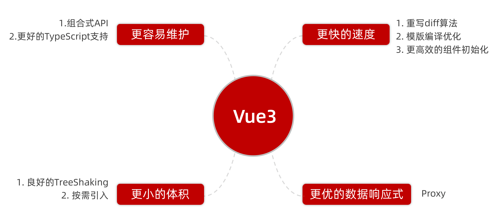

- **性能提升**：重写虚拟 DOM，渲染速度提升约 1.3~2 倍
- **体积更小**：Tree-shaking 支持更好，按需引入
- **组合式 API**：逻辑复用更灵活，代码维护性更强
- **更好的 TypeScript 支持**
- **新增内置组件**：Fragment、Teleport、Suspense

---

## 2. 搭建 Vue3 项目

### create-vue 脚手架

> `create-vue` 是 Vue 官方新一代脚手架，底层使用 **Vite**（极速冷启动，热更新快）替代了 Vue CLI 的 webpack。

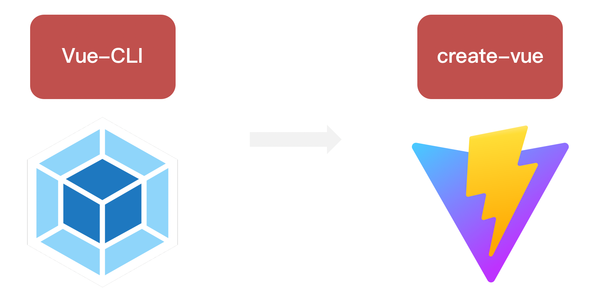

**前置条件：** 已安装 **Node.js 16.0+**

```bash
# 执行命令，按提示选择配置项
npm init vue@latest
```

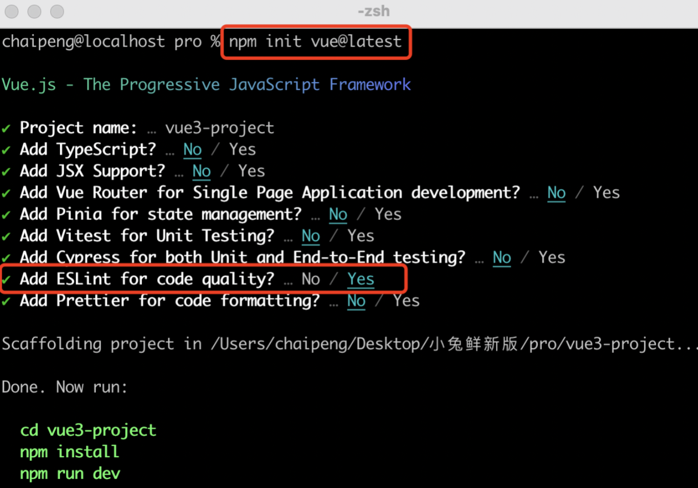

**按提示选择：**

```
✔ Project name: my-vue3-app
✔ Add TypeScript? No
✔ Add JSX Support? No
✔ Add Vue Router for Single Page Application development? Yes
✔ Add Pinia for state management? Yes
✔ Add Vitest for Unit Testing? No
✔ Add an End-to-End Testing Solution? No
✔ Add ESLint for code quality? Yes
```

```bash
# 进入项目并安装依赖
cd my-vue3-app
npm install
npm run dev
```

---

## 3. 项目结构与关键文件

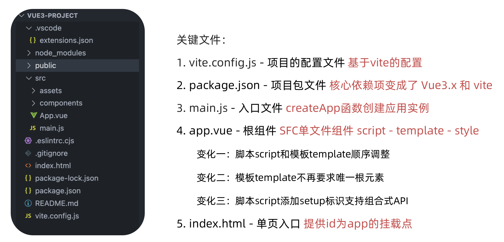

```
my-vue3-app/
├── public/                  # 静态资源（不会被 vite 处理）
├── src/
│   ├── assets/              # 项目静态资源（图片、字体等）
│   ├── components/          # 复用组件
│   ├── views/               # 页面组件（配合路由）
│   ├── router/              # 路由配置
│   ├── stores/              # Pinia 状态管理
│   ├── App.vue              # 根组件
│   └── main.js              # 入口文件
├── index.html               # 入口 HTML（Vite 直接以此为入口）
├── vite.config.js           # Vite 配置文件
└── package.json
```

**`main.js` — Vue3 入口写法**

```js
import { createApp } from 'vue'  // Vue3 使用 createApp，不再是 new Vue()
import App from './App.vue'

createApp(App).mount('#app')
```

> 📌 Vue3 中通过 `createApp()` 创建应用实例，彻底告别 `new Vue()`。

---

## 4. 组合式 API — setup

### setup 的写法与执行时机

`setup` 是组合式 API 的**入口函数**，在组件实例创建前执行。

```vue
<script>
export default {
  setup() {
    // 在此处定义数据和方法
    const message = 'Hello Vue3'
    const logMessage = () => console.log(message)

    // ⚠️ 必须 return，才能在模板中使用
    return { message, logMessage }
  },
  beforeCreate() {
    // setup 在 beforeCreate 之前执行！
  }
}
</script>
```

**执行时机：**

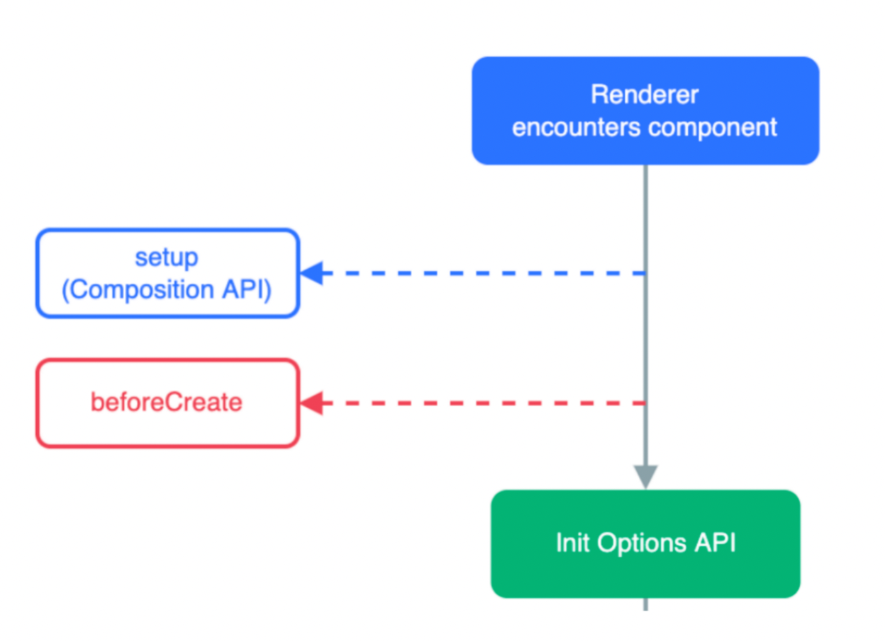

> setup 在所有生命周期钩子之前执行，此时组件实例还未创建，**无法使用 `this`**。

### `<script setup>` 语法糖（推荐）

在 `<script>` 标签上添加 `setup` 属性，无需手动 `return`，顶层声明的变量和函数**自动暴露给模板**。

```vue
<script setup>
// 直接写，无需 export default 和 return
const message = 'Hello Vue3'
const logMessage = () => console.log(message)
</script>

<template>
  <div>{{ message }}</div>
  <button @click="logMessage">打印</button>
</template>
```

**两种写法对比：**

| 写法 | 代码量 | 是否需要 return | 推荐度 |
|------|--------|----------------|--------|
| `export default { setup() {} }` | 较多 | ✅ 需要 | 了解即可 |
| `<script setup>` 语法糖 | 最少 | ❌ 不需要 | ✅ **强烈推荐** |

---

## 5. 响应式 — reactive

> `reactive()` 接收一个**对象类型**的参数，返回一个**响应式代理对象**（基于 Proxy 实现）。

```vue
<script setup>
import { reactive } from 'vue'

// 传入对象，得到响应式对象
const state = reactive({
  msg: 'Hello',
  count: 0,
  user: { name: '小明' }
})

const updateMsg = () => {
  // 直接修改属性，视图自动更新
  state.msg = 'Hello Vue3'
  state.count++
  state.user.name = '小红'
}
</script>

<template>
  <p>{{ state.msg }}</p>
  <p>{{ state.count }}</p>
  <button @click="updateMsg">修改</button>
</template>
```

**❌ reactive 的限制：**

```js
// ❌ 不能直接赋值整个对象（会失去响应式）
let state = reactive({ count: 0 })
state = { count: 1 }  // 断开了响应式连接！

// ✅ 应该修改属性，而不是替换整个对象
state.count = 1
```

---

## 6. 响应式 — ref

> `ref()` 接收**任意类型**（简单类型或对象类型）的参数，返回一个带有 `.value` 属性的**响应式 ref 对象**。

```vue
<script setup>
import { ref } from 'vue'

// 简单类型
const count = ref(0)
const name = ref('小明')
const isShow = ref(false)

// 对象类型（内部自动用 reactive 处理）
const user = ref({ name: '小明', age: 18 })

const update = () => {
  // ⚠️ JS 中修改必须加 .value
  count.value++
  name.value = '小红'
  user.value.age = 20
  // 对象类型可以整体替换（reactive 不行）
  user.value = { name: '小花', age: 22 }
}
</script>

<template>
  <!-- 模板中不需要 .value，Vue 自动解包 -->
  <p>{{ count }}</p>
  <p>{{ name }}</p>
  <p>{{ user.age }}</p>
  <button @click="update">修改</button>
</template>
```

**`.value` 使用规则：**

| 场景 | 是否需要 .value |
|------|----------------|
| `<script>` / JS 逻辑中 | ✅ 需要 `.value` |
| `<template>` 模板中 | ❌ 自动解包，不需要 |

---

## 7. reactive vs ref 对比

| 对比项 | `reactive` | `ref` |
|--------|-----------|-------|
| 接收类型 | **仅对象类型**（对象/数组） | **任意类型**（简单类型 + 对象） |
| 访问方式 | 直接访问属性 `state.count` | JS 中需 `.value`，模板中自动解包 |
| 对象替换 | ❌ 不能整体替换 | ✅ 可以整体替换 `ref.value = newObj` |
| 底层实现 | Proxy | 简单类型用 `Object.defineProperty`，对象类型内部用 `reactive` |
| 推荐度 | 按需使用 | ✅ **统一推荐使用 ref** |

> ✅ **最佳实践：统一使用 `ref`**，减少记忆负担，项目中无论什么类型都用 ref 处理。

---

## 8. 组合式 API — computed

> 计算属性的**核心逻辑与 Vue2 一致**，只是 API 写法变为函数式导入调用。

```vue
<script setup>
import { ref, computed } from 'vue'

const count = ref(2)
const list = ref([1, 2, 3, 4, 5, 6, 7, 8])

// 只读计算属性（简写）
const doubleCount = computed(() => count.value * 2)

// 过滤列表
const filterList = computed(() => list.value.filter(item => item > 2))

// 可读可写的计算属性（完整写法）
const fullName = computed({
  get() {
    return firstName.value + ' ' + lastName.value
  },
  set(val) {
    [firstName.value, lastName.value] = val.split(' ')
  }
})
</script>

<template>
  <p>原始值：{{ count }}，双倍：{{ doubleCount }}</p>
  <p>过滤后：{{ filterList }}</p>
</template>
```

**注意：** 原文档中 `filterList` 代码有误，正确写法如下：

```js
// ❌ 原文档错误写法
const filterList = computed(item => item > 2)  // 缺少 list.value.filter

// ✅ 正确写法
const filterList = computed(() => list.value.filter(item => item > 2))
```

---

## 9. 组合式 API — watch

> `watch` 用于**监听响应式数据的变化**，数据变化时执行回调函数。

### 监听单个数据

```vue
<script setup>
import { ref, watch } from 'vue'
const count = ref(0)

watch(count, (newValue, oldValue) => {
  console.log(`count 变化：${oldValue} → ${newValue}`)
})
</script>
```

### 监听多个数据

```vue
<script setup>
import { ref, watch } from 'vue'
const count = ref(0)
const name = ref('cp')

// 第一个参数改为数组
watch([count, name], ([newCount, newName], [oldCount, oldName]) => {
  console.log('count 或 name 发生了变化')
  console.log(`count: ${oldCount} → ${newCount}`)
  console.log(`name: ${oldName} → ${newName}`)
})
</script>
```

### immediate — 立即执行

```vue
<script setup>
import { ref, watch } from 'vue'
const count = ref(0)

watch(count, (newValue, oldValue) => {
  console.log(`count 变化：${oldValue} → ${newValue}`)
}, {
  immediate: true  // 创建时立即执行一次，后续变化继续执行
})
</script>
```

### deep — 深度监听

```vue
<script setup>
import { ref, watch } from 'vue'
const state = ref({ count: 0 })

// ❌ 不加 deep：修改嵌套属性不会触发
watch(state, () => {
  console.log('变化了')  // 不会触发！
})

// ✅ 加 deep：监听对象内部任意属性变化
watch(state, () => {
  console.log('变化了')  // 会触发 ✅
}, { deep: true })

const changeCount = () => {
  state.value.count++
}
</script>
```

### 精确监听对象的某个属性（推荐）

```js
const state = ref({ count: 0, name: 'zs' })

// 只监听 count 属性，而不是整个对象（性能更好）
watch(
  () => state.value.count,   // getter 函数写法
  (newCount, oldCount) => {
    console.log(`count: ${oldCount} → ${newCount}`)
  }
)
```

**watch 配置项总结：**

| 配置项 | 类型 | 默认值 | 说明 |
|--------|------|--------|------|
| `immediate` | Boolean | `false` | 是否在创建时立即执行一次 |
| `deep` | Boolean | `false` | 是否深度监听对象内部属性 |
| `flush` | String | `'pre'` | 回调触发时机（`'pre'`/`'post'`/`'sync'`） |

---

## 10. 组合式 API — 生命周期函数

### Vue2 选项式 vs Vue3 组合式对比

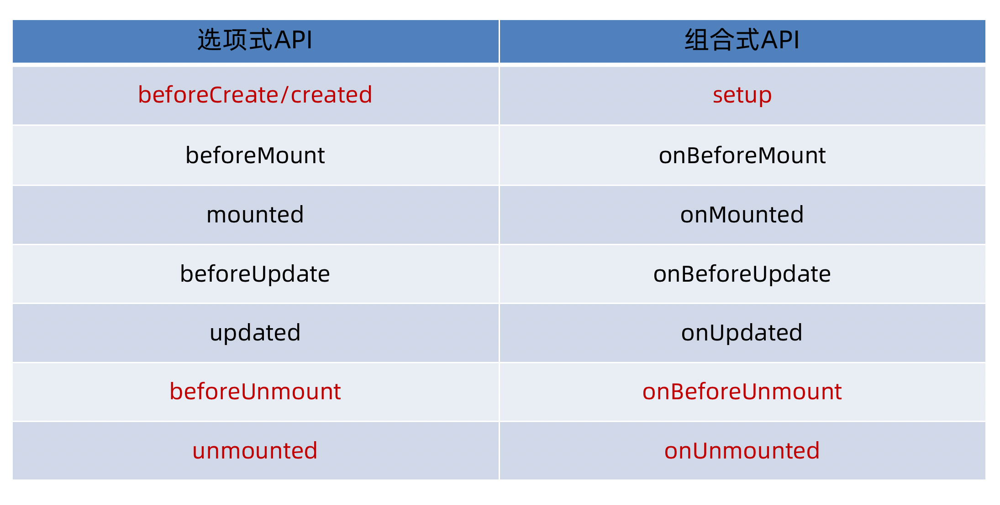

| Vue2 选项式 | Vue3 组合式 | 说明 |
|------------|------------|------|
| `beforeCreate` | ❌ 不需要（setup 本身就是） | setup 在其之前执行 |
| `created` | ❌ 不需要（setup 本身就是） | setup 即为 created 阶段 |
| `beforeMount` | `onBeforeMount` | 挂载前 |
| `mounted` | `onMounted` | ✅ **最常用**，DOM 渲染完成 |
| `beforeUpdate` | `onBeforeUpdate` | 数据变化，DOM 更新前 |
| `updated` | `onUpdated` | DOM 更新后 |
| `beforeDestroy` | `onBeforeUnmount` | 组件卸载前（名称变了！） |
| `destroyed` | `onUnmounted` | 组件卸载后 |

### 基本使用

```vue
<script setup>
import { onMounted, onUpdated, onBeforeUnmount, onUnmounted } from 'vue'

onMounted(() => {
  // DOM 已渲染，可以操作 DOM、发请求、初始化图表等
  console.log('组件挂载完成')
})

onUpdated(() => {
  console.log('组件更新了')
})

onBeforeUnmount(() => {
  // 清除定时器、取消订阅等
  console.log('组件即将卸载')
})

// 同一个钩子可以多次调用，按顺序执行
onMounted(() => {
  console.log('第二个 onMounted')
})
</script>
```

> ✅ 在 `<script setup>` 中，`setup` 函数本身就相当于 `beforeCreate` + `created` 阶段，**不需要** `onBeforeCreate` 和 `onCreated`。

---

## 11. 组合式 API — 父子通信

### 父传子 — defineProps

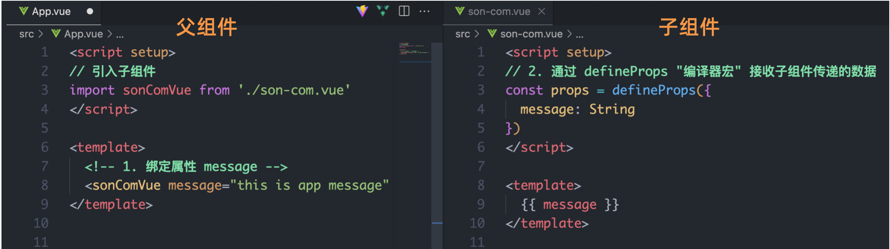

**父组件：**

```vue
<template>
  <!-- 和 Vue2 一样，通过属性传递 -->
  <SonComponent :title="title" :count="count" :list="list" />
</template>

<script setup>
import { ref } from 'vue'
import SonComponent from './components/SonComponent.vue'

const title = ref('标题')
const count = ref(10)
const list = ref([1, 2, 3])
</script>
```

**子组件（接收 props）：**

```vue
<template>
  <div>
    <h3>{{ title }}</h3>
    <p>{{ count }}</p>
  </div>
</template>

<script setup>
// defineProps 是编译宏，不需要导入，直接使用
const props = defineProps({
  title: {
    type: String,
    default: '默认标题'
  },
  count: {
    type: Number,
    required: true
  },
  list: {
    type: Array,
    default: () => []
  }
})

// 通过 props.xxx 访问
console.log(props.title)
</script>
```

### 子传父 — defineEmits

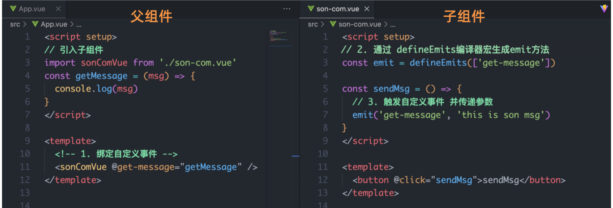

**子组件（触发事件）：**

```vue
<template>
  <button @click="handleClick">通知父组件</button>
</template>

<script setup>
// defineEmits 声明组件可以触发的事件
const emit = defineEmits(['sendMsg', 'update:count'])

const handleClick = () => {
  // 触发自定义事件，第二个参数是传递的数据
  emit('sendMsg', '来自子组件的消息')
}
</script>
```

**父组件（监听事件）：**

```vue
<template>
  <SonComponent @sendMsg="handleMsg" />
</template>

<script setup>
const handleMsg = (msg) => {
  console.log('收到子组件消息：', msg)
}
</script>
```

**Vue2 vs Vue3 父子通信对比：**

| 方向 | Vue2 | Vue3 |
|------|------|------|
| 父传子 | `props: ['xxx']` | `defineProps({})` |
| 子传父 | `this.$emit('event', data)` | `const emit = defineEmits(['event'])` + `emit('event', data)` |

---

## 12. 组合式 API — 模板引用 ref

> 通过 `ref` 标识获取**真实 DOM 元素**或**组件实例对象**，类似 Vue2 的 `this.$refs`。

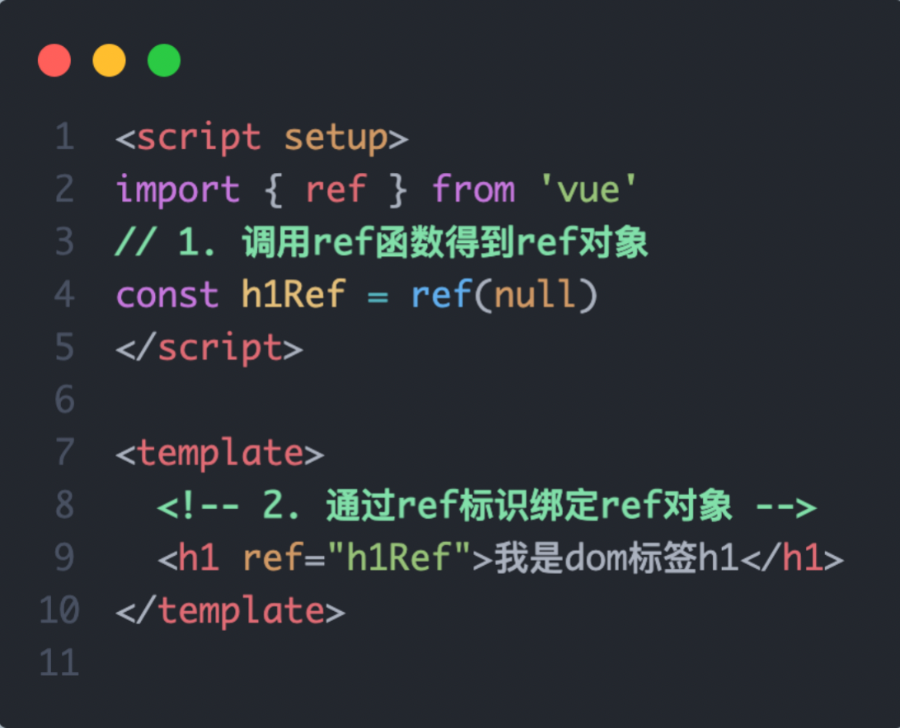

### 获取 DOM 元素

```vue
<template>
  <!-- 在标签上添加 ref 属性，值与 script 中的变量同名 -->
  <input ref="inputRef" type="text" />
  <div ref="chartRef">图表容器</div>
</template>

<script setup>
import { ref, onMounted } from 'vue'

// 1. 声明同名 ref 变量（初始值为 null）
const inputRef = ref(null)
const chartRef = ref(null)

onMounted(() => {
  // 2. 组件挂载后，ref 变量的 .value 就是真实 DOM 元素
  inputRef.value.focus()   // 自动聚焦
  console.log(chartRef.value)  // DOM 元素
})
</script>
```

### 获取子组件实例 — defineExpose

> 在 `<script setup>` 语法糖下，组件内部的数据和方法**默认不对外暴露**。父组件通过 `ref` 获取子组件实例时，需要子组件通过 **`defineExpose`** 主动声明可访问的内容。

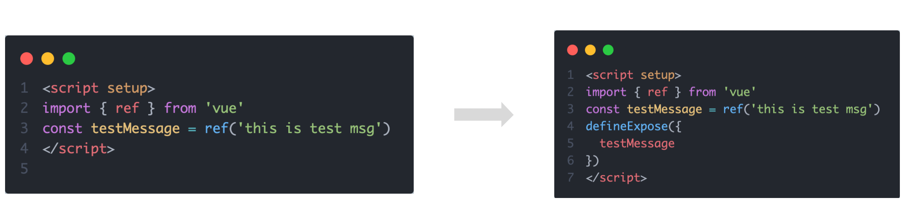

**子组件 — 暴露内容：**

```vue
<script setup>
import { ref } from 'vue'

const count = ref(0)
const message = ref('子组件数据')
const privateData = ref('私有，不对外暴露')

const childMethod = () => {
  console.log('子组件方法被调用')
}

// 显式声明哪些可以被父组件访问
defineExpose({
  count,
  message,
  childMethod
  // privateData 未暴露，父组件无法访问
})
</script>
```

**父组件 — 访问子组件：**

```vue
<template>
  <ChildComponent ref="childRef" />
  <button @click="callChild">调用子组件方法</button>
</template>

<script setup>
import { ref, onMounted } from 'vue'
import ChildComponent from './ChildComponent.vue'

const childRef = ref(null)

onMounted(() => {
  console.log(childRef.value.count)    // ✅ 可以访问
  childRef.value.childMethod()         // ✅ 可以调用
  // console.log(childRef.value.privateData) // ❌ undefined，未暴露
})

const callChild = () => {
  childRef.value.childMethod()
}
</script>
```

---

## 13. 组合式 API — provide & inject

> 用于**跨层级组件通信**，顶层组件向任意深度的后代组件传递数据和方法，无需逐层传递 props。

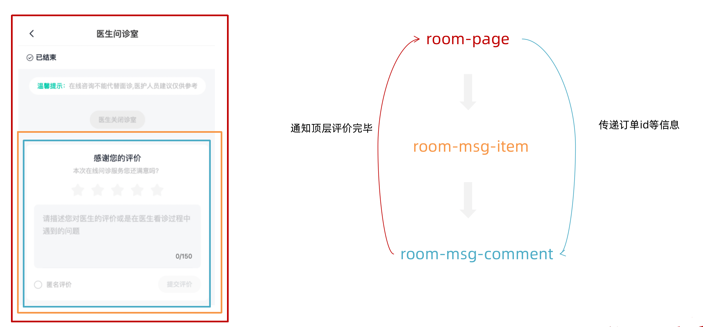

### 跨层传递普通数据

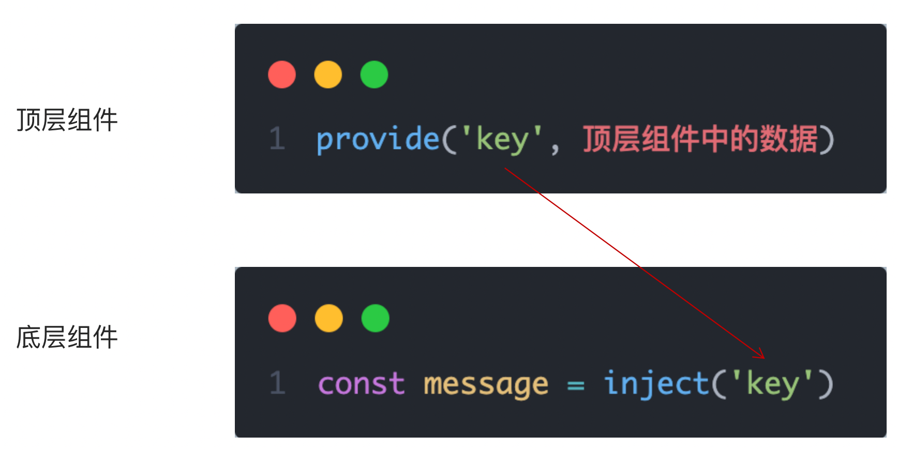

**顶层组件（提供数据）：**

```vue
<script setup>
import { provide } from 'vue'

// provide(键名, 数据)
provide('theme', 'dark')
provide('appName', 'MyApp')
</script>
```

**底层组件（注入数据）：**

```vue
<script setup>
import { inject } from 'vue'

// inject(键名, 默认值)
const theme = inject('theme', 'light')   // 第二参数为默认值
const appName = inject('appName')
</script>
```

### 跨层传递响应式数据

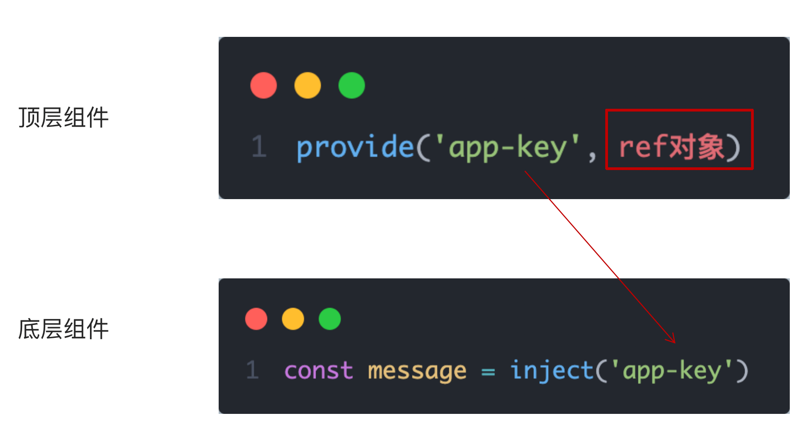

```vue
<!-- 顶层组件 -->
<script setup>
import { ref, provide } from 'vue'

const count = ref(0)

// 传递 ref 对象，后代组件中数据是响应式的
provide('count', count)
</script>
```

```vue
<!-- 后代组件 -->
<script setup>
import { inject } from 'vue'

const count = inject('count')
// count 是响应式的，视图会自动更新
</script>
```

### 跨层传递方法（子改父数据）

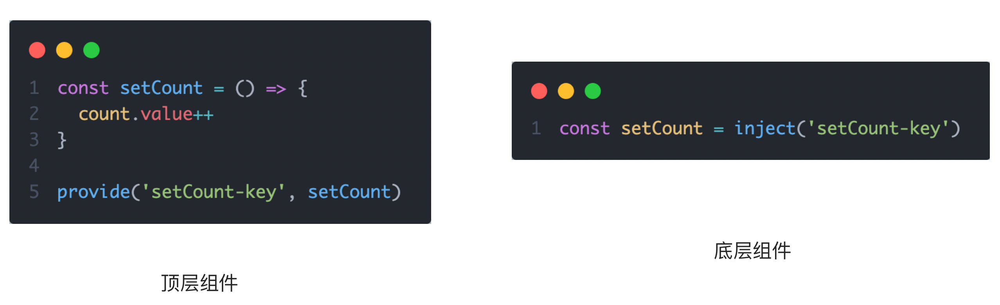

```vue
<!-- 顶层组件 -->
<script setup>
import { ref, provide } from 'vue'

const count = ref(0)

// 提供修改数据的方法，让后代组件可以修改顶层组件的数据
const updateCount = (newVal) => {
  count.value = newVal
}

provide('count', count)
provide('updateCount', updateCount)
</script>
```

```vue
<!-- 后代组件 -->
<script setup>
import { inject } from 'vue'

const count = inject('count')
const updateCount = inject('updateCount')

const handleClick = () => {
  updateCount(count.value + 1)  // 调用顶层方法修改数据
}
</script>
```

**provide / inject vs props / emit：**

| 对比项 | props / emit | provide / inject |
|--------|-------------|-----------------|
| 适用层级 | 父子组件（一层） | 任意深度跨层级 |
| 数据传递 | 需逐层传递 | 直接注入，无需中间层 |
| 响应式 | ✅ | ✅（传 ref 对象即可） |
| 适用场景 | 直接父子关系 | 深层嵌套，全局配置 |

---

## 14. Vue3.3 新特性 — defineOptions

### 问题背景

使用 `<script setup>` 后，无法直接设置组件的 `name`、`inheritAttrs` 等选项，原来需要额外再添加一个普通 `<script>` 块：

```vue
<!-- ❌ 麻烦：需要两个 script 块 -->
<script>
export default {
  name: 'MyComponent',     // 只是为了设置 name
  inheritAttrs: false
}
</script>

<script setup>
// 主要逻辑
</script>
```

### 解决方案：defineOptions

`defineOptions` 是 Vue3.3 引入的**编译宏**，可以在 `<script setup>` 中直接定义组件选项。

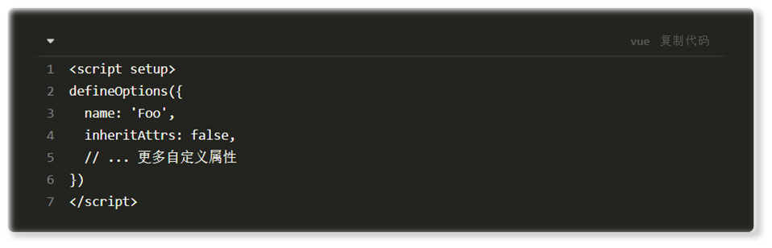

```vue
<script setup>
// defineOptions 不需要导入，直接使用
defineOptions({
  name: 'MyComponent',      // 设置组件名（keep-alive 的 include 依赖此值）
  inheritAttrs: false       // 禁用 attribute 继承
})

// 其他组合式逻辑正常写
import { ref } from 'vue'
const count = ref(0)
</script>
```

> 📌 `defineOptions` 中**不能**设置 `props`、`emits`、`expose`、`slots`，这些有专属的 `defineXxx` 宏处理。

---

## 15. Vue3.3 新特性 — defineModel

### 问题背景

在 Vue3 中，组件上使用 `v-model` 相当于：
- 传递 `modelValue` prop
- 监听 `update:modelValue` 事件

传统写法需要同时定义 `props` 和 `emits`，代码较冗余：

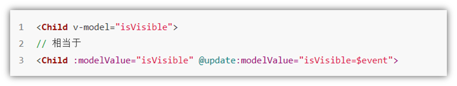

```vue
<!-- ❌ 传统写法：冗长 -->
<script setup>
const props = defineProps(['modelValue'])
const emit = defineEmits(['update:modelValue'])

const handleChange = (e) => {
  emit('update:modelValue', e.target.value)
}
</script>
```

### defineModel 简化写法

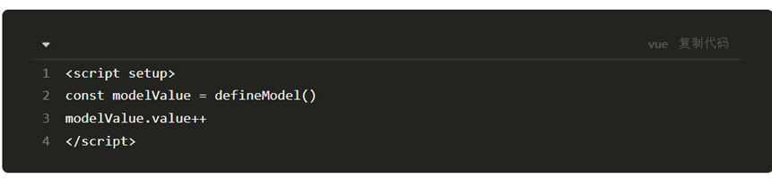

```vue
<!-- ✅ defineModel 写法：简洁 -->
<script setup>
const modelValue = defineModel()  // 自动处理 props 接收和 emit 触发

// 直接修改 modelValue.value 即可，等同于 emit('update:modelValue', val)
</script>

<template>
  <input :value="modelValue" @input="modelValue = $event.target.value" />
  <!-- 或者更简洁地 -->
  <input v-model="modelValue" />
</template>
```

**父组件使用：**

```vue
<template>
  <MyInput v-model="inputVal" />
</template>

<script setup>
import { ref } from 'vue'
const inputVal = ref('')
</script>
```

### 启用 defineModel（Vite 配置）

`defineModel` 在 Vue 3.3 中为**实验性特性**，需要在 `vite.config.js` 中开启：

```js
// vite.config.js
import { fileURLToPath, URL } from 'node:url'
import { defineConfig } from 'vite'
import vue from '@vitejs/plugin-vue'

export default defineConfig({
  plugins: [
    vue({
      script: {
        defineModel: true  // 开启 defineModel 支持
      }
    })
  ],
  resolve: {
    alias: {
      '@': fileURLToPath(new URL('./src', import.meta.url))
    }
  }
})
```

> 📌 Vue 3.4+ 中 `defineModel` 已成为**稳定特性**，无需额外配置即可使用。

---

## 📋 知识总结

### Vue3 vs Vue2 核心变化

| 对比项 | Vue2 | Vue3 |
|--------|------|------|
| 创建实例 | `new Vue()` | `createApp()` |
| 响应式原理 | `Object.defineProperty`（有缺陷） | `Proxy`（更强大） |
| API 风格 | 选项式 API（Options API） | 组合式 API（Composition API）为主 |
| 生命周期 | `beforeCreate` / `created` ... | `setup` 替代前两个，其余加 `on` 前缀 |
| 组件通信 | `props` / `this.$emit` / `this.$refs` | `defineProps` / `defineEmits` / `ref` |
| 跨层通信 | provide/inject（非响应式） | provide/inject（传 ref 即响应式） |
| 逻辑复用 | Mixins（易冲突） | 自定义 Hook（`.js` / `.ts` 文件） |
| 构建工具 | Vue CLI（webpack） | create-vue（Vite，极速） |
| TypeScript | 支持较差 | 原生良好支持 |

### 组合式 API 速查

| API | 作用 | 返回值/用法 |
|-----|------|-------------|
| `ref(val)` | 创建任意类型响应式数据 | `.value` 访问/修改 |
| `reactive(obj)` | 创建对象类型响应式数据 | 直接访问属性 |
| `computed(() => ...)` | 计算属性（有缓存） | `.value` 访问 |
| `watch(source, cb, opts)` | 监听数据变化 | `immediate`/`deep` 配置 |
| `onMounted(cb)` | 挂载完成钩子 | 操作 DOM、发请求 |
| `onBeforeUnmount(cb)` | 卸载前钩子 | 清除定时器、取消订阅 |
| `provide(key, val)` | 向后代提供数据 | 顶层组件使用 |
| `inject(key, default)` | 注入祖先数据 | 后代组件使用 |

### 编译宏速查（无需 import，直接使用）

| 编译宏 | 作用 | 位置 |
|--------|------|------|
| `defineProps({})` | 声明接收的 props | `<script setup>` |
| `defineEmits([])` | 声明可触发的事件 | `<script setup>` |
| `defineExpose({})` | 主动暴露给父组件的属性/方法 | `<script setup>` |
| `defineOptions({})` | 定义组件选项（name 等）| `<script setup>`（Vue3.3+）|
| `defineModel()` | 简化 v-model 双向绑定 | `<script setup>`（Vue3.4 稳定）|

### 生命周期速查

```
setup()                    ← beforeCreate + created
onBeforeMount()            ← beforeMount
onMounted()                ← mounted        ✅ 最常用：操作 DOM / 发请求
onBeforeUpdate()           ← beforeUpdate
onUpdated()                ← updated
onBeforeUnmount()          ← beforeDestroy  ✅ 清除定时器 / 取消订阅
onUnmounted()              ← destroyed
```

---

### 🔑 重点难点提示

1. **ref 的 .value 规则** — 在 `<script>` / JS 中必须用 `.value`，在 `<template>` 中 Vue 会自动解包，**不需要** `.value`；初学者最常犯的错误就是在模板里多写了 `.value`

2. **reactive 的整体替换陷阱** — `reactive` 创建的对象不能整体赋值替换，否则失去响应式；`ref` 创建的对象可以整体替换（`ref.value = newObj`），这也是推荐统一使用 `ref` 的原因

3. **watch 深度监听** — 监听 `ref` 包裹的对象时，修改内部属性**默认不触发**（浅监听），需加 `{ deep: true }`；或使用 `() => state.value.xxx` 的 getter 函数精确监听某个属性

4. **defineExpose 必须主动暴露** — `<script setup>` 下组件默认是封闭的，父组件通过 `ref` 获取子组件实例后，只能访问 `defineExpose` 中显式声明的内容，未声明的为 `undefined`

5. **provide 传响应式数据** — `provide` 传普通值是**非响应式**的（后代修改不更新）；传 `ref` / `reactive` 对象才是**响应式**的；如需让后代修改，应一并传入修改方法

6. **组合式 API 的生命周期命名** — Vue3 中 `beforeDestroy` 改为 `onBeforeUnmount`，`destroyed` 改为 `onUnmounted`，名称发生了变化，注意不要写错