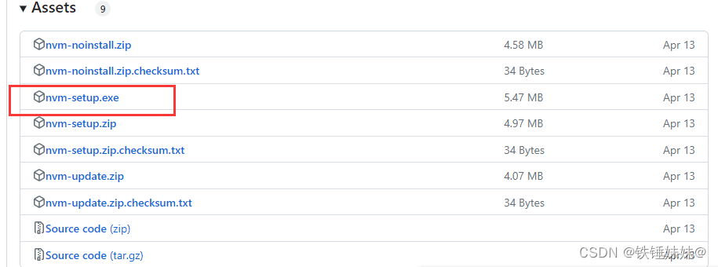
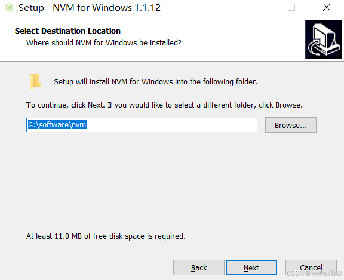
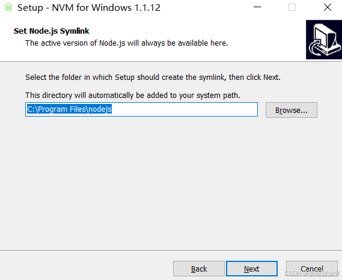
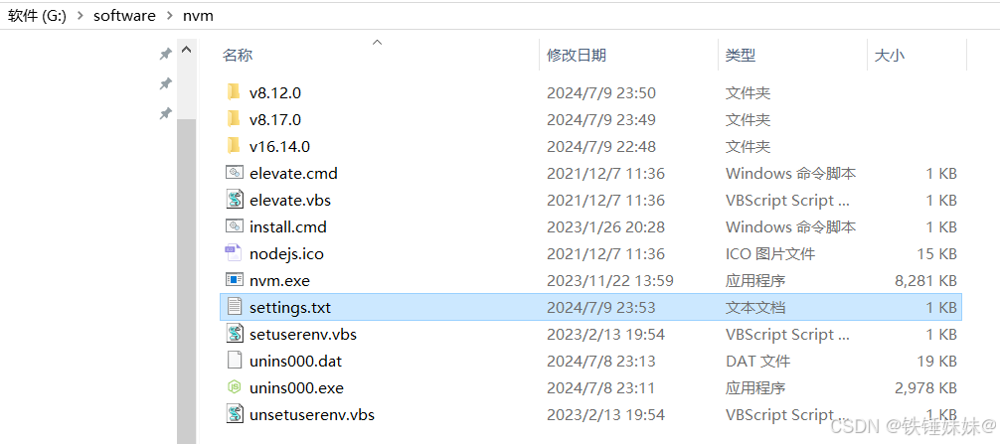
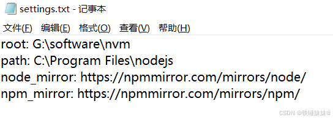
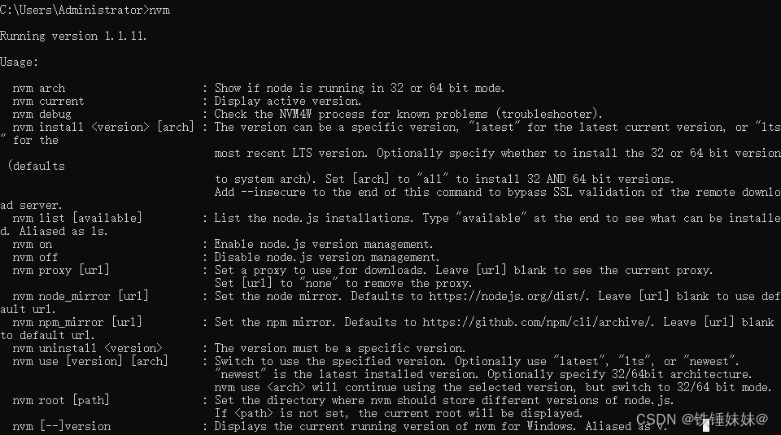
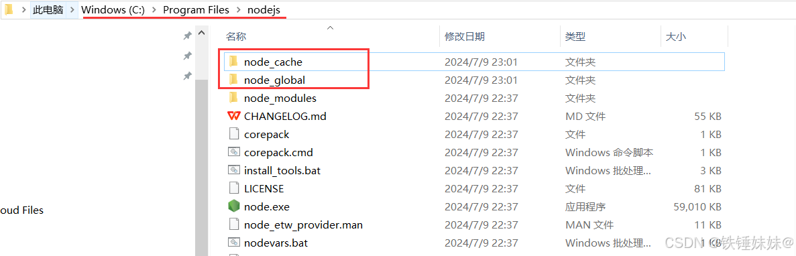
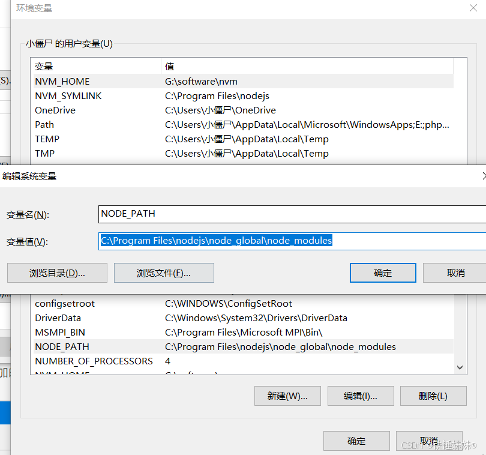
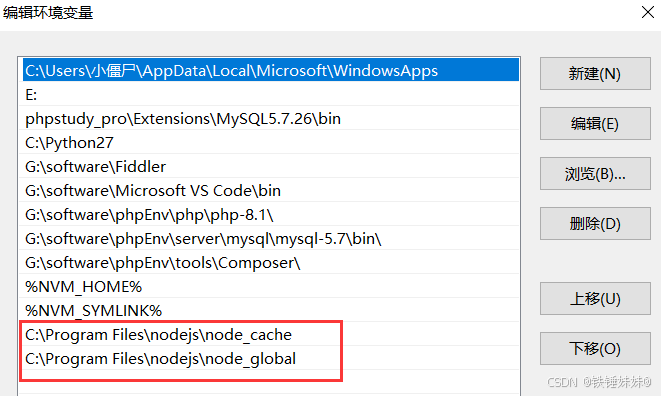

# 🚀 NVM - Node Version Manager

> ⚠️ **重要提醒**：安装nvm时不能安装任何node版本（如存在请删除后再安装nvm），再检查环境变量，如果还有node.js相关也删掉，保证系统无任何node.js 残留。<br>
> 卸载完之后cmd命令行输入 `node -v` 查看是否还能查到node信息，无的话表示删除干净。

## 📖 nvm 简介

- nvm 是 node.js 版本管理工具，用于在同一台机器上安装和管理多个 node.js 版本。
- nvm 可以方便地切换不同的 node.js 版本，以满足不同项目的需求。

## 🔧 nvm 安装指南

### 1. 📥 官网下载 nvm 包

- [nvm 下载地址](https://github.com/coreybutler/nvm-windows/releases)
  

### 2. ⚙️ 安装 nvm 包





> 💡 **注意**：安装路径的文件夹名称不要出现中文，空格等，否则后期npm使用的时候会出现符号格式不正确问题

### 3. 🔄 配置路径和下载镜像

- 找到nvm安装路径 -> 找到 `setting.txt` 文件 -> 新增两行信息，配置下载源

```shell
node_mirror: https://npmmirror.com/mirrors/node/
npm_mirror: https://npmmirror.com/mirrors/npm/
```





> 📝 **配置说明**：<br>
> 第一行是 nvm安装路径<br>
> 第二行是 nodejs路径<br>
> 第三行是 node下载镜像<br>
> 第四行是 npm下载镜像

### 4. ✅ 检查nvm是否安装完成

- 打开cmd命令行，输入 `nvm -v` 查看nvm版本号



## 💻 nvm 常用命令

- `nvm version`: 查看nvm版本号
- `nvm list available`: 查看所有可安装的node.js版本列表
- `nvm install <version>`: 安装指定版本的node.js
- `nvm use <version>`: 切换到指定版本的node.js
- `nvm list`: 查看已安装的node.js版本列表
- `nvm uninstall <version>`: 卸载指定版本的node.js

## 🌐 镜像源配置

### 修改npm默认镜像源为淘宝镜像

- 打开cmd命令行，输入 `npm config set registry https://registry.npmmirror.com` 配置npm默认镜像源为淘宝镜像
- 输入 `npm config get registry` 查看npm默认镜像源是否为淘宝镜像

> 🔧 **故障排除**：如果遇到淘宝镜像源过期问题 <br>
> // 1. 清空缓存 <br>
>`npm cache clean --force` <br>
>// 2. 切换新源 <br>
>`npm config set registry https://registry.npmmirror.com`

### 使用 nrm 来管理 npm 源

- 安装 nrm 工具：`npm install -g nrm`
- 查看可用的 npm 源：`nrm ls`
- 切换 npm 源：`nrm use <source>`
- 添加自定义 npm 源：`nrm add <source> <url>`
- 删除自定义 npm 源：`nrm del <source>`
- 测试 npm 源速度：`nrm test <source>`
- 查看当前 npm 源：`nrm current`

## ⚙️ 环境变量配置

### 为什么要配置环境变量？

- 为了命令行安装包时，将包安装到自己设置的目录下

### 配置步骤

#### 1. 📁 创建文件夹

- 首先创建 "node_global" 和 "node_cache" 两个文件夹进行全局安装的时候安装对应的库到这两个文件。
- 在nvm的 nodejs 安装路径 C:\Program Files\nodejs 新建两个文件夹命名为 "node_global" 和 "node_cache"。



#### 2. 🔧 配置环境变量

- 新增系统变量 `NODE_GLOBAL`，值为 `C:\Program Files\nodejs\node_global`
- 新增用户变量 `NODE_CACHE`，值为 `C:\Program Files\nodejs\node_cache`

```shell
npm config set prefix "C:\Program Files\nodejs\node_global"
npm config set cache "C:\Program Files\nodejs\node_cache"
```

- 在【系统变量】新建环境变量 `NODE_PATH` 值为 C:\Program Files\nodejs\node_global\node_modules
- 其中 C:\Program Files\nodejs\node_global\node_modules 就是上面创建的全局模块安装路径文件夹



- 修改 【用户变量】中的 path 变量
- 这里我其实没有修改或者增加什么变量，是安装时候默认添加的。



## 🎯 使用技巧

### 常用场景

- **开发多个项目**：不同项目可能需要不同版本的Node.js
- **测试兼容性**：测试代码在不同Node.js版本下的运行情况
- **学习新特性**：体验最新版本的Node.js特性

### 最佳实践

- 定期更新nvm到最新版本
- 使用LTS版本进行生产环境开发
- 保持npm包管理器的更新

---

> 💫 **总结**：nvm是Node.js开发者的必备工具，能够有效管理多个Node.js版本，提高开发效率！