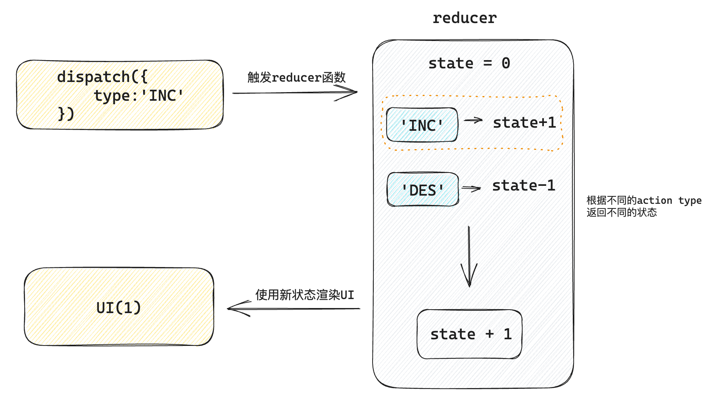
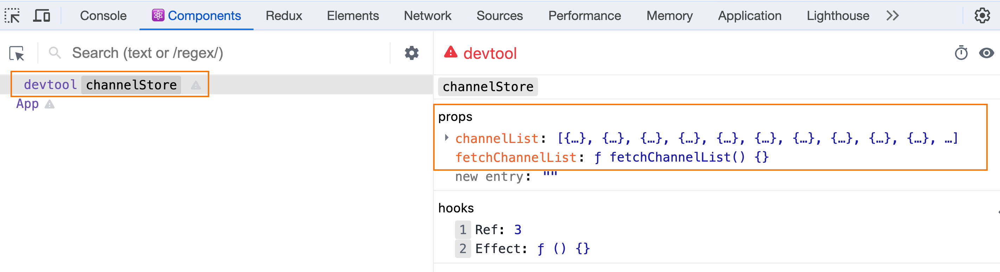

# React 进阶：Hooks 进阶与 TypeScript

# 基础使用
作用: 让 React 管理多个**相对关联**的状态数据
```jsx
import { useReducer } from 'react'

// 1. 定义reducer函数，根据不同的action返回不同的新状态
function reducer(state, action) {
  switch (action.type) {
    case 'INC':
      return state + 1
    case 'DEC':
      return state - 1
    default:
      return state
  }
}

function App() {
  // 2. 使用useReducer分派action
  const [state, dispatch] = useReducer(reducer, 0)
  return (
    <>
      {/* 3. 调用dispatch函数传入action对象 触发reducer函数，分派action操作，使用新状态更新视图 */}
      <button onClick={() => dispatch({ type: 'DEC' })}>-</button>
      {state}
      <button onClick={() => dispatch({ type: 'INC' })}>+</button>
    </>
  )
}

export default App
```

# 更新流程

# 分派action传参
> 做法：分派action时如果想要传递参数，需要在action对象中添加一个payload参数，放置状态参数

```jsx
// 定义reducer

import { useReducer } from 'react'

// 1. 根据不同的action返回不同的新状态
function reducer(state, action) {
  console.log('reducer执行了')
  switch (action.type) {
    case 'INC':
      return state + 1
    case 'DEC':
      return state - 1
    case 'UPDATE':
      return state + action.payload
    default:
      return state
  }
}

function App() {
  // 2. 使用useReducer分派action
  const [state, dispatch] = useReducer(reducer, 0)
  return (
    <>
      {/* 3. 调用dispatch函数传入action对象 触发reducer函数，分派action操作，使用新状态更新视图 */}
      <button onClick={() => dispatch({ type: 'DEC' })}>-</button>
      {state}
      <button onClick={() => dispatch({ type: 'INC' })}>+</button>
      <button onClick={() => dispatch({ type: 'UPDATE', payload: 100 })}>
        update to 100
      </button>
    </>
  )
}

export default App
```


# useMemo
作用：它在每次重新渲染的时候能够缓存计算的结果
## 看个场景
下面我们的本来的用意是想**基于count的变化计算斐波那契数列之和**，但是当我们修改num状态的时候，斐波那契求和函数也会被执行，显然是一种浪费
```jsx
// useMemo
// 作用：在组件渲染时缓存计算的结果

import { useState } from 'react'

function factorialOf(n) {
  console.log('斐波那契函数执行了')
  return n <= 0 ? 1 : n * factorialOf(n - 1)
}

function App() {
  const [count, setCount] = useState(0)
  // 计算斐波那契之和
  const sumByCount = factorialOf(count)

  const [num, setNum] = useState(0)

  return (
    <>
      {sum}
      <button onClick={() => setCount(count + 1)}>+count:{count}</button>
      <button onClick={() => setNum(num + 1)}>+num:{num}</button>
    </>
  )
}

export default App
```
## useMemo缓存计算结果
> 思路: 只有count发生变化时才重新进行计算

```jsx
import { useMemo, useState } from 'react'

function fib (n) {
  console.log('计算函数执行了')
  if (n < 3) return 1
  return fib(n - 2) + fib(n - 1)
}

function App() {
  const [count, setCount] = useState(0)
  // 计算斐波那契之和
  // const sum = fib(count)
  // 通过useMemo缓存计算结果，只有count发生变化时才重新计算
  const sum = useMemo(() => {
    return fib(count)
  }, [count])

  const [num, setNum] = useState(0)

  return (
    <>
      {sum}
      <button onClick={() => setCount(count + 1)}>+count:{count}</button>
      <button onClick={() => setNum(num + 1)}>+num:{num}</button>
    </>
  )
}

export default App
```
# React.memo
作用：允许组件在props没有改变的情况下跳过重新渲染
## 组件默认的渲染机制
> 默认机制：顶层组件发生重新渲染，这个组件树的子级组件都会被重新渲染

```jsx
// memo
// 作用：允许组件在props没有改变的情况下跳过重新渲染

import { useState } from 'react'

function Son() {
  console.log('子组件被重新渲染了')
  return <div>this is son</div>
}

function App() {
  const [, forceUpdate] = useState()
  console.log('父组件重新渲染了')
  return (
    <>
      <Son />
      <button onClick={() => forceUpdate(Math.random())}>update</button>
    </>
  )
}

export default App
```
## 使用React.memo优化
> 机制：只有props发生变化时才重新渲染
> 下面的子组件通过 memo 进行包裹之后，返回一个新的组件MemoSon, 只有传给MemoSon的props参数发生变化时才会重新渲染

```jsx
import React, { useState } from 'react'

const MemoSon = React.memo(function Son() {
  console.log('子组件被重新渲染了')
  return <div>this is span</div>
})

function App() {
  const [, forceUpdate] = useState()
  console.log('父组件重新渲染了')
  return (
    <>
      <MemoSon />
      <button onClick={() => forceUpdate(Math.random())}>update</button>
    </>
  )
}

export default App
```
## props变化重新渲染
```jsx
import React, { useState } from 'react'

const MemoSon = React.memo(function Son() {
  console.log('子组件被重新渲染了')
  return <div>this is span</div>
})

function App() {
  console.log('父组件重新渲染了')

  const [count, setCount] = useState(0)
  return (
    <>
      <MemoSon count={count} />
      <button onClick={() => setCount(count + 1)}>+{count}</button>
    </>
  )
}

export default App
```
## props的比较机制
> 对于props的比较，进行的是‘浅比较’，底层使用 `Object.is` 进行比较，针对于对象数据类型，只会对比俩次的引用是否相等，如果不相等就会重新渲染，React并不关心对象中的具体属性

```jsx

import React, { useState } from 'react'

const MemoSon = React.memo(function Son() {
  console.log('子组件被重新渲染了')
  return <div>this is span</div>
})

function App() {
  // const [count, setCount] = useState(0)
  const [list, setList] = useState([1, 2, 3])
  return (
    <>
      <MemoSon list={list} />
      <button onClick={() => setList([1, 2, 3])}>
        {JSON.stringify(list)}
      </button>
    </>
  )
}

export default App
```
说明：虽然俩次的list状态都是 `[1,2,3]` , 但是因为组件App俩次渲染生成了不同的对象引用list，所以传给MemoSon组件的props视为不同，子组件就会发生重新渲染
## 自定义比较函数
> 如果上一小节的例子，我们不想通过引用来比较，而是完全比较数组的成员是否完全一致，则可以通过自定义比较函数来实现

```jsx
import React, { useState } from 'react'

// 自定义比较函数
function arePropsEqual(oldProps, newProps) {
  console.log(oldProps, newProps)
  return (
    oldProps.list.length === newProps.list.length &&
    oldProps.list.every((oldItem, index) => {
      const newItem = newProps.list[index]
      console.log(newItem, oldItem)
      return oldItem === newItem
    })
  )
}

const MemoSon = React.memo(function Son() {
  console.log('子组件被重新渲染了')
  return <div>this is span</div>
}, arePropsEqual)

function App() {
  console.log('父组件重新渲染了')
  const [list, setList] = useState([1, 2, 3])
  return (
    <>
      <MemoSon list={list} />
      <button onClick={() => setList([1, 2, 3])}>
        内容一样{JSON.stringify(list)}
      </button>
      <button onClick={() => setList([4, 5, 6])}>
        内容不一样{JSON.stringify(list)}
      </button>
    </>
  )
}

export default App
```
# useCallback
## 看个场景
上一小节我们说到，当给子组件传递一个`引用类型`prop的时候，即使我们使用了`memo` 函数依旧无法阻止子组件的渲染，其实传递prop的时候，往往传递一个回调函数更为常见，比如实现子传父，此时如果想要避免子组件渲染，可以使用 `useCallback`缓存回调函数
```jsx
// useCallBack

import { memo, useState } from 'react'

const MemoSon = memo(function Son() {
  console.log('Son组件渲染了')
  return <div>this is son</div>
})

function App() {
  const [, forceUpate] = useState()
  console.log('父组件重新渲染了')
  const onGetSonMessage = (message) => {
    console.log(message)
  }

  return (
    <div>
      <MemoSon onGetSonMessage={onGetSonMessage} />
      <button onClick={() => forceUpate(Math.random())}>update</button>
    </div>
  )
}

export default App
```
## useCallback缓存函数
> useCallback缓存之后的函数可以在组件渲染时保持引用稳定，也就是返回同一个引用

```jsx
// useCallBack

import { memo, useCallback, useState } from 'react'

const MemoSon = memo(function Son() {
  console.log('Son组件渲染了')
  return <div>this is son</div>
})

function App() {
  const [, forceUpate] = useState()
  console.log('父组件重新渲染了')
  const onGetSonMessage = useCallback((message) => {
    console.log(message)
  }, [])

  return (
    <div>
      <MemoSon onGetSonMessage={onGetSonMessage} />
      <button onClick={() => forceUpate(Math.random())}>update</button>
    </div>
  )
}

export default App
```


# forwardRef
作用：允许组件使用ref将一个DOM节点暴露给父组件
```jsx
import { forwardRef, useRef } from 'react'

const MyInput = forwardRef(function Input(props, ref) {
  return <input {...props} type="text" ref={ref} />
}, [])

function App() {
  const ref = useRef(null)

  const focusHandle = () => {
    console.log(ref.current.focus())
  }

  return (
    <div>
      <MyInput ref={ref} />
      <button onClick={focusHandle}>focus</button>
    </div>
  )
}

export default App
```
# useImperativeHandle
作用：如果我们并不想暴露子组件中的DOM而是想暴露子组件内部的方法
```jsx
import { forwardRef, useImperativeHandle, useRef } from 'react'

const MyInput = forwardRef(function Input(props, ref) {
  // 实现内部的聚焦逻辑
  const inputRef = useRef(null)
  const focus = () => inputRef.current.focus()

  // 暴露子组件内部的聚焦方法
  useImperativeHandle(ref, () => {
    return {
      focus,
    }
  })

  return <input {...props} ref={inputRef} type="text" />
})

function App() {
  const ref = useRef(null)

  const focusHandle = () => ref.current.focus()

  return (
    <div>
      <MyInput ref={ref} />
      <button onClick={focusHandle}>focus</button>
    </div>
  )
}

export default App
```


顾名思义，Class API就是使用ES6支持的原生Class API来编写React组件
# 基础体验
通过一个简单的 Counter 自增组件看一下组件的基础编写结构
```jsx
// class API
import { Component } from 'react'

class Counter extends Component {
  // 状态变量
  state = {
    count: 0,
  }

  // 事件回调
  clickHandler = () => {
    // 修改状态变量 触发UI组件渲染
    this.setState({
      count: this.state.count + 1,
    })
  }

  // UI模版
  render() {
    return <button onClick={this.clickHandler}>+{this.state.count}</button>
  }
}

function App() {
  return (
    <div>
      <Counter />
    </div>
  )
}

export default App
```
# 组件生命周期
# 组件通信
## 父传子
```jsx
// class API
import { Component } from 'react'

class Son extends Component {
  render() {
    const { count } = this.props
    return <div>this is Son, {count}</div>
  }
}

class App extends Component {
  // 状态变量
  state = {
    count: 0,
  }

  setCount = () => {
    this.setState({
      count: this.state.count + 1,
    })
  }

  // UI模版
  render() {
    return (
      <>
        <Son count={this.state.count} />
        <button onClick={this.setCount}>+</button>
      </>
    )
  }
}

export default App
```
## 子传父
```jsx
// class API
import { Component } from 'react'

class Son extends Component {
  render() {
    const { msg, onGetSonMsg } = this.props
    return (
      <>
        <div>this is Son, {msg}</div>
        <button onClick={() => onGetSonMsg('this is son msg')}>
          changeMsg
        </button>
      </>
    )
  }
}

class App extends Component {
  // 状态变量
  state = {
    msg: 'this is initail app msg',
  }

  onGetSonMsg = (msg) => {
    this.setState({ msg })
  }

  // UI模版
  render() {
    return (
      <>
        <Son msg={this.state.msg} onGetSonMsg={this.onGetSonMsg} />
      </>
    )
  }
}

export default App
```

更多阅读
[Component – React 中文文档](https://zh-hans.react.dev/reference/react/Component)


# 快速上手
[Zustand Documentation](https://docs.pmnd.rs/zustand/getting-started/introduction)
## store/index.js - 创建store
```javascript
import { create } from 'zustand'

const useStore = create((set) => {
  return {
    count: 0,
    inc: () => {
      set(state => ({ count: state.count + 1 }))
    }
  }
})

export default useStore
```
## app.js - 绑定组件
```jsx
import useStore from './store/useCounterStore.js'

function App() {
  const { count, inc } = useStore()
  return <button onClick={inc}>{count}</button>
}

export default App
```

# 异步支持
对于异步操作的支持不需要特殊的操作，直接在函数中编写异步逻辑，最后把接口的数据放到set函数中返回即可
## store/index.js - 创建store
```javascript
import { create } from 'zustand'

const URL = 'http://geek.itheima.net/v1_0/channels'

const useStore = create((set) => {
  return {
    count: 0,
    ins: () => {
      return set(state => ({ count: state.count + 1 }))
    },
    channelList: [],
    fetchChannelList: async () => {
      const res = await fetch(URL)
      const jsonData = await res.json()
      set({channelList: jsonData.data.channels})
    }
  }
})

export default useStore
```
## app.js - 绑定组件
```jsx
import { useEffect } from 'react'
import useChannelStore from './store/channelStore'

function App() {
  const { channelList, fetchChannelList } = useChannelStore()
 
  useEffect(() => {
    fetchChannelList()
  }, [fetchChannelList])

  return (
    <ul>
      {channelList.map((item) => (
        <li key={item.id}>{item.name}</li>
      ))}
    </ul>
  )
}

export default App
```
# 切片模式
场景：当我们单个store比较大的时候，可以采用一种`切片模式`进行模块拆分再组合
## 拆分并组合切片
```javascript

import { create } from 'zustand'

// 创建counter相关切片
const createCounterStore = (set) => {
  return {
    count: 0,
    setCount: () => {
      set(state => ({ count: state.count + 1 }))
    }
  }
}

// 创建channel相关切片
const createChannelStore = (set) => {
  return {
    channelList: [],
    fetchGetList: async () => {
      const res = await fetch(URL)
      const jsonData = await res.json()
      set({ channelList: jsonData.data.channels })
    }
  }
}

// 组合切片
const useStore = create((...a) => ({
  ...createCounterStore(...a),
  ...createChannelStore(...a)
}))
```
## 组件使用
```jsx
function App() {
  const {count, inc, channelList, fetchChannelList } = useStore()
  return (
    <>
      <button onClick={inc}>{count}</button>
      <ul>
        {channelList.map((item) => (
          <li key={item.id}>{item.name}</li>
        ))}
      </ul>
    </>
  )
}

export default App
```

# 对接DevTools
> 简单的调试我们可以安装一个 名称为 simple-zustand-devtools 的调试工具

## 安装调试包
```bash
npm i simple-zustand-devtools -D
```
## 配置调试工具
```javascript
import create from 'zustand'

// 导入核心方法
import { mountStoreDevtool } from 'simple-zustand-devtools'

// 省略部分代码...


// 开发环境开启调试
if (process.env.NODE_ENV === 'development') {
  mountStoreDevtool('channelStore', useChannelStore)
}


export default useChannelStore
```
## 打开 React调试工具



# 阶段重点
React和TypeScript集合使用的重点集中在 `和存储数据/状态有关的Hook函数` 以及 `组件接口` 的位置，这些地方最需要数据类型校验


# 使用Vite创建项目
> Vite是一个框架无关的前端工具链工具，可以帮助我们快速创建一个 `react+ts` 的工程化环境出来，我们可以基于它做语法学习

[Vite](https://cn.vitejs.dev/)
```bash
npm create vite@latest react-typescript -- --template react-ts
```
# 安装依赖运行项目
```bash
# 安装依赖
npm i 

# 运行项目
npm run dev
```


# useState
##  简单场景
> 简单场景下，可以使用TS的自动推断机制，不用特殊编写类型注解，运行良好

```typescript
const [val, toggle] = React.useState(false)

// `val` 会被自动推断为布尔类型
// `toggle` 方法调用时只能传入布尔类型
```

## 复杂场景
> 复杂数据类型，useState支持通过`泛型参数`指定初始参数类型以及setter函数的入参类型

```typescript
type User = {
  name: string
  age: number
}
const [user, setUser] = React.useState<User>({
  name: 'jack',
  age: 18
})
// 执行setUser
setUser(newUser)
// 这里newUser对象只能是User类型
```
## 没有具体默认值
> 实际开发时，有些时候useState的初始值可能为null或者undefined，按照泛型的写法是不能通过类型校验的，此时可以通过完整的类型联合null或者undefined类型即可

```typescript
type User = {
  name: String
  age: Number
}
const [user, setUser] = React.useState<User>(null)
// 上面会类型错误，因为null并不能分配给User类型

const [user, setUser] = React.useState<User | null>(null)
// 上面既可以在初始值设置为null，同时满足setter函数setUser的参数可以是具体的User类型
```
# useRef
> 在TypeScript的环境下，`useRef` 函数返回一个`只读` 或者 `可变` 的引用，只读的场景常见于获取真实dom，可变的场景，常见于缓存一些数据，不跟随组件渲染，下面分俩种情况说明

## 获取dom
> 获取DOM时，通过泛型参数指定具体的DOM元素类型即可

```tsx
function Foo() {
  // 尽可能提供一个具体的dom type, 可以帮助我们在用dom属性时有更明确的提示
  // divRef的类型为 RefObject<HTMLDivElement>
  const inputRef = useRef<HTMLDivElement>(null)

  useEffect(() => {
    inputRef.current.focus()
  })

  return <div ref={inputRef}>etc</div>
}
```
如果你可以确保`divRef.current` 不是null，也可以在传入初始值的位置
```typescript
// 添加非null标记
const divRef = useRef<HTMLDivElement>(null!)
// 不再需要检查`divRef.current` 是否为null
doSomethingWith(divRef.current)
```
## 稳定引用存储器
> 当做为可变存储容器使用的时候，可以通过`泛型参数`指定容器存入的数据类型, 在还为存入实际内容时通常把null作为初始值，所以依旧可以通过联合类型做指定

```tsx
interface User {
  age: number
}

function App(){
  const timerRef = useRef<number | undefined>(undefined)
  const userRes = useRef<User | null> (null)
  useEffect(()=>{
    timerRef.current = window.setInterval(()=>{
      console.log('测试')
    },1000)
    
    
    return ()=>clearInterval(timerRef.current)
  })
  return <div> this is app</div>
}
```


# 为Props添加类型
> props作为React组件的参数入口，添加了类型之后可以限制参数输入以及在使用props有良好的类型提示

## 使用interface接口
```tsx
interface Props {
  className: string
}

export const Button = (props:Props)=>{
  const { className } = props
  return <button className={ className }>Test</button>
}
```
## 使用自定义类型Type
```tsx
type Props =  {
  className: string
}

export const Button = (props:Props)=>{
  const { className } = props
  return <button className={ className }>Test</button>
}
```
# 为Props的chidren属性添加类型
> children属性和props中其他的属性不同，它是React系统中内置的，其它属性我们可以自由控制其类型，children属性的类型最好由React内置的类型提供，兼容多种类型


```tsx
type Props = {
  children: React.ReactNode
}

export const Button = (props: Props)=>{
   const { children } = props
   return <button>{ children }</button>
}
```
:::warning
说明：React.ReactNode是一个React内置的联合类型，包括 `React.ReactElement` 、`string`、`number` `React.ReactFragment` 、`React.ReactPortal` 、`boolean`、 `null` 、`undefined`
:::
# 为事件prop添加类型
```tsx
// props + ts
type Props = {
  onGetMsg?: (msg: string) => void
}

function Son(props: Props) {
  const { onGetMsg } = props
  const clickHandler = () => {
    onGetMsg?.('this is msg')
  }
  return <button onClick={clickHandler}>sendMsg</button>
}

function App() {
  const getMsgHandler = (msg: string) => {
    console.log(msg)
  }
  return (
    <>
      <Son onGetMsg={(msg) => console.log(msg)} />
      <Son onGetMsg={getMsgHandler} />
    </>
  )
}

export default App
```
# 为事件handle添加类型
> 为事件回调添加类型约束需要使用React内置的泛型函数来做，比如最常见的鼠标点击事件和表单输入事件：

```tsx
function App(){
  const changeHandler: React.ChangeEventHandler<HTMLInputElement> = (e)=>{
    console.log(e.target.value)
  }
  
  const clickHandler: React.MouseEventHandler<HTMLButtonElement> = (e)=>{
    console.log(e.target)
  }

  return (
    <>
      <input type="text" onChange={ changeHandler }/>
      <button onClick={ clickHandler }> click me!</button>
    </>
  )
}
```


---

## 补充与延伸

> 以下内容为对原笔记的补充。

### useReducer vs useState 选型

- 状态是单一原始值、更新逻辑简单 → `useState`。
- 多个子状态强关联、下一个状态依赖上一个状态、更新逻辑分散在多处 → `useReducer`，把更新逻辑集中在 reducer 中更易维护和测试。
- `useReducer` + `useContext` 组合可以实现一个"迷你 Redux"，中小应用可以以此替代引入状态管理库。

### 性能优化三件套的使用原则

`useMemo`、`React.memo`、`useCallback` 都是**用额外的记忆开销换取跳过重复计算/渲染**，不要默认到处使用：

- 先确认存在真实的性能问题（React DevTools Profiler 可以定位），再做优化。
- `React.memo` 包裹的子组件如果接收函数/对象 props，必须配合 `useCallback`/`useMemo` 稳定引用，否则 memo 完全失效——三者经常成组出现。
- 依赖数组写错比不用更糟：会导致读到过期值的隐蔽 bug。
- React 团队已发布 React Compiler（自动记忆化编译器），未来手写这三个 API 的场景会大幅减少，但理解原理仍是面试必考。

### ref 相关 API 版本提示

- 笔记中 `forwardRef` 的写法适用于 React 18 及之前。**React 19 起函数组件可以直接把 ref 作为普通 prop 接收**，`forwardRef` 不再必需（仍向后兼容）。
- `useImperativeHandle` 的定位是"限制父组件能触碰的能力"——只暴露 focus 之类的方法而非整个 DOM 节点，避免父组件越权操作子组件内部。

### Class 生命周期与 Hooks 对照

| 类组件 | 函数组件近似写法 |
| --- | --- |
| `constructor` 初始化 state | `useState` 初始值 |
| `componentDidMount` | `useEffect(fn, [])` |
| `componentDidUpdate` | `useEffect(fn, [deps])` |
| `componentWillUnmount` | `useEffect` 返回的清理函数 |
| `shouldComponentUpdate` | `React.memo` |

### zustand 与 Redux 选型参考

- zustand：API 极简（一个 create 函数）、无需 Provider 包裹、天然支持异步、包体积小，中小项目和快速迭代场景优先考虑。
- Redux Toolkit：生态成熟（DevTools 时间旅行、中间件体系、RTK Query 数据请求方案），团队协作、大型项目、需要严格数据流规范时更合适。
- 两者核心思想一致：单一 store、通过定义好的方法修改状态、组件通过选择器订阅切片数据——zustand 的 `useStore(state => state.count)` 与 `useSelector` 思路相同，也同样存在"selector 返回新对象导致多余渲染"的问题。

### React + TypeScript 常用类型速查

| 场景 | 类型写法 |
| --- | --- |
| children | `React.ReactNode` |
| CSS 样式对象 | `React.CSSProperties` |
| 点击事件（按钮） | `React.MouseEvent<HTMLButtonElement>` |
| 输入事件 | `React.ChangeEvent<HTMLInputElement>` |
| 表单提交 | `React.FormEvent<HTMLFormElement>` |
| 组件 props 含 children | `type Props = { children: React.ReactNode }` |
| useRef 获取 DOM | `useRef<HTMLInputElement>(null)` |
| useState 复杂类型 | `useState<User[]>([])`，无默认值用 `useState<User \| null>(null)` |

补充说明：

- `interface` 与 `type` 在定义 props 上大多可互换；interface 支持声明合并和 extends 继承，type 支持联合/交叉类型。团队统一风格即可。
- 事件处理函数如果内联书写（直接写在 JSX 里），TS 通常能自动推断事件类型，无需手动标注；抽离成独立函数时才需要显式标注。
