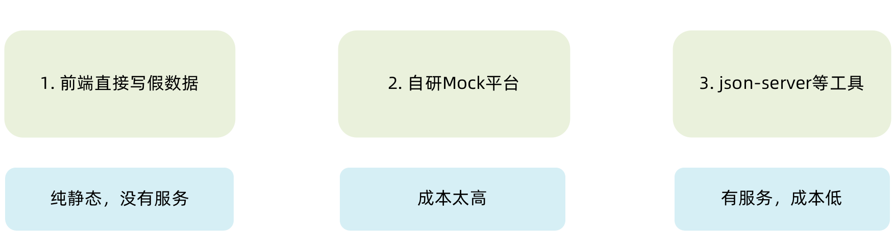
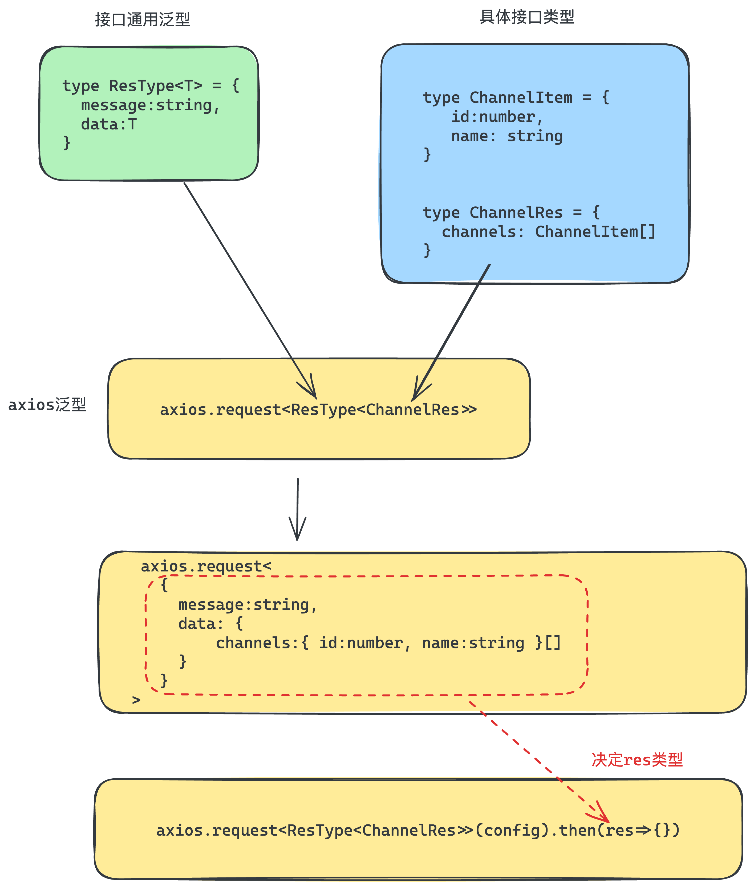
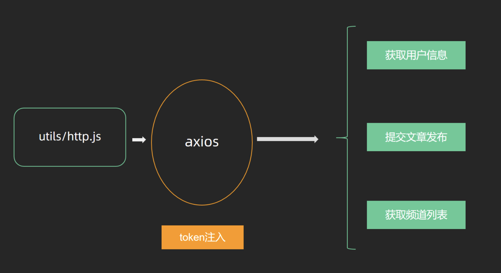
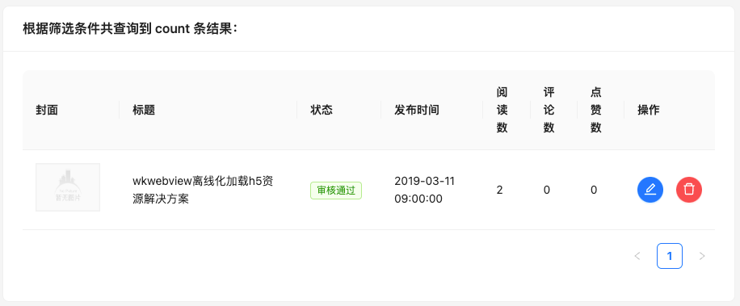
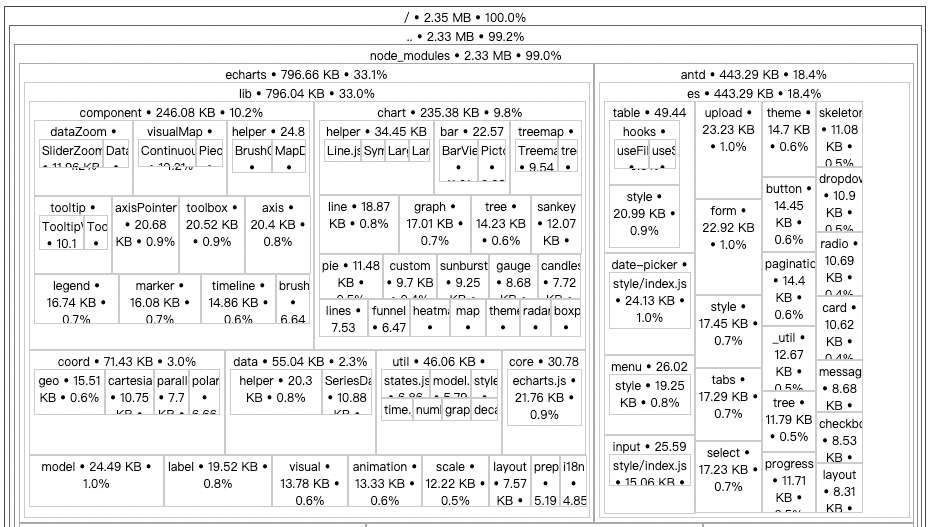

# React 项目经验

> 本文基于三个实战项目提炼：**极客园 PC 管理后台**（CRA + antd + Redux Toolkit，贯穿登录/布局/增删改查/打包优化的完整后台项目）、**记账本移动端**（CRA + antd-mobile + RTK + json-server）、**极客园移动端 TS 版**（Vite + TypeScript + antd-mobile）。总结可复用的项目架构与开发经验。

---

## 一、项目搭建与工程化

### 1. 脚手架选型

| 方案 | 特点 | 项目实践 |
| --- | --- | --- |
| CRA（create-react-app） | 底层基于 webpack，开箱即用，修改配置需借助 craco | 极客园 PC、记账本 |
| Vite | 启动快、原生 ESM、配置直观，TS 支持好 | 极客园移动端 TS 版 |

新项目建议优先 Vite（CRA 已停止维护）；接手老项目时需要掌握 craco 覆盖 webpack 配置的方式。

### 2. 目录结构设计

三个项目都遵循同一套按职责分层的结构，这是 React 项目的通用约定：

```bash
-src
  -apis           项目接口函数（按业务模块拆分文件）
  -assets         静态资源（图片等）
  -components     通用组件（跨页面复用）
  -pages          页面组件（一个路由一个文件夹，页面私有组件放自己目录下）
  -store          集中状态管理（modules 下按业务拆分子模块）
  -utils          工具封装（token、axios 等，通过 index.js 统一导出）
  -router         路由配置
  -App.js         根组件
  -index.js       项目入口
```

经验：
- **utils 通过 `index.js` 统一出口**（`export { http, getToken, ... }`），业务代码只 `import from '@/utils'`，后续内部重构不影响调用方。
- 页面私有组件（如记账本的 `DailyBill`）放在页面目录内，升级为通用组件时再移入 `components`。

### 3. 路径别名配置（@ → src）

两件事要分开做：**构建工具的路径解析** 和 **编辑器的智能提示**。

CRA 方案（craco）：

```javascript
// craco.config.js
const path = require('path')
module.exports = {
  webpack: {
    alias: { '@': path.resolve(__dirname, 'src') }
  }
}
```

```json
// jsconfig.json —— 让 VSCode 识别 @ 提供联想
{
  "compilerOptions": {
    "baseUrl": "./",
    "paths": { "@/*": ["src/*"] }
  }
}
```

Vite + TS 方案：

```typescript
// vite.config.ts
import path from 'path'
export default defineConfig({
  resolve: {
    alias: { '@': path.resolve(__dirname, './src') }
  }
})
```

```json
// tsconfig.json
{
  "compilerOptions": {
    "baseUrl": ".",
    "paths": { "@/*": ["src/*"] }
  }
}
```

### 4. 样式方案与组件库

- PC 后台：`antd` + `sass`（安装 sass 包即可在 CRA 中使用 scss）。
- 移动端：`antd-mobile` + `normalize.css` 做样式 reset。
- antd-mobile 主题定制基于 CSS 变量，用 `:root:root` 双重选择器提高优先级实现全局主题色覆盖：

```css
:root:root {
  --adm-color-primary: rgb(105, 174, 120);
}
```

### 5. 数据 Mock

常见的 Mock 方式对比：



前后端并行开发时，用 `json-server` 可以最低成本地把一个 json 文件变成 REST 接口：

1. `npm i -D json-server`
2. 准备 `server/data.json`
3. package.json 加命令：`"server": "json-server ./server/data.json --port 8888"`

补充：团队协作中更常见的替代方案还有 Apifox/Postman 的 Mock 服务、msw（拦截请求，Mock 逻辑与代码同仓库），可按团队习惯选择。

---

## 二、网络层封装

### 1. axios 实例封装（utils/request.js）

统一 baseURL、超时时间、请求/响应拦截器，这是所有项目的标配起手式：

```javascript
import axios from 'axios'

const http = axios.create({
  baseURL: 'http://geek.itheima.net/v1_0',
  timeout: 5000
})

// 请求拦截器：统一注入 token
http.interceptors.request.use(config => {
  const token = getToken()
  if (token) {
    config.headers.Authorization = `Bearer ${token}`
  }
  return config
})

// 响应拦截器：脱壳 + 统一错误处理
http.interceptors.response.use(
  response => response.data,
  error => {
    // 401 = token 失效：清除本地凭证，退回登录页
    if (error.response?.status === 401) {
      clearToken()
      router.navigate('/login')
      window.location.reload()
    }
    return Promise.reject(error)
  }
)

export { http }
```

关键经验：

- **请求拦截器注入 token**：后端通过请求头 `Authorization: Bearer ${token}` 做接口权限控制，在拦截器统一拼接，业务代码无感知。
- **响应拦截器处理 401**：token 过期的兜底逻辑放在网络层做一次，所有接口自动获得该能力。
- **API 按模块拆分**：接口函数集中放 `apis/` 目录（如 `apis/article.js` 导出 `getArticleListAPI`），组件内不直接写 url，方便复用与修改。

### 2. TypeScript 版本的泛型封装

TS 项目中给响应数据加泛型，可以让每个接口的返回值获得完整类型提示：



```typescript
// apis/shared.ts —— 后端统一响应结构
export type ResType<T> = {
  message: string
  data: T
}

// apis/list.ts —— 具体接口
type ChannelRes = {
  channels: { id: number; name: string }[]
}

export function fetchChannelAPI() {
  return http.request<ResType<ChannelRes>>({ url: '/channels' })
}
```

经验：**先按接口文档定义响应类型，再写请求函数**，`res.data.data.channels` 每一层都有提示，重构时改动点由编译器兜底。

---

## 三、登录与鉴权体系

一套完整的前端鉴权闭环包含四个环节，缺一不可：

### 1. Token 的获取与存储（Redux + localStorage 双写）

- Redux 存内存：组件响应式读取。
- localStorage 持久化：刷新不丢。
- **在 reducer 的同步修改方法里同时写入两处**，保证永远一致：

```javascript
const userStore = createSlice({
  name: 'user',
  initialState: {
    token: getToken() || '',   // 初始化时优先读本地
    userInfo: {}
  },
  reducers: {
    setUserToken (state, action) {
      state.token = action.payload
      setToken(state.token)     // 同步写入 localStorage
    },
    clearUserInfo (state) {
      state.token = ''
      state.userInfo = {}
      clearToken()              // 退出时两处一起清
    }
  }
})
```

localStorage 存取封装成 `setToken/getToken/clearToken` 工具函数，key 用常量管理。

### 2. 请求层注入

见上文请求拦截器——token 一次注入，全接口生效。

### 3. 路由层鉴权（AuthRoute 高阶组件）

后端接口通过请求头中的 token 判定权限，前端路由则通过 AuthRoute 拦截未登录访问：



思路：判断本地是否有 token，有则放行渲染子组件，没有则重定向登录页：

```jsx
import { getToken } from '@/utils'
import { Navigate } from 'react-router-dom'

const AuthRoute = ({ children }) => {
  return getToken() ? <>{children}</> : <Navigate to="/login" replace />
}
```

```jsx
// 路由配置中包裹需要保护的路由
{ path: '/', element: <AuthRoute><Layout /></AuthRoute> }
```

补充：`replace` 属性很重要——重定向不产生历史记录，防止用户点后退又回到被拦截页。这种"包裹组件"模式可扩展为按角色的权限路由（再判断用户角色决定放行或跳 403）。

### 4. 失效兜底

响应拦截器捕获 401 → 清 token → 跳登录。与路由鉴权互为补充：路由鉴权拦"没登录"，401 兜底拦"登录已过期"。

---

## 四、Layout 与路由设计经验

### 1. 嵌套路由的标准结构

后台系统的经典路由设计：一级路由分 `Layout`（受保护）和 `Login`，Layout 下挂业务页面作为二级路由：

```jsx
const router = createBrowserRouter([
  {
    path: '/',
    element: <AuthRoute><Layout /></AuthRoute>,
    children: [
      { index: true, element: <Home /> },        // 默认二级路由
      { path: 'article', element: <Article /> },
      { path: 'publish', element: <Publish /> },
    ],
  },
  { path: '/login', element: <Login /> },
])
```

Layout 中用 `<Outlet />` 声明二级路由出口。移动端记账本同理：Layout + TabBar 对应 month/year 二级路由。

### 2. 菜单与路由联动的技巧

把菜单项的 `key` 直接设计成**路由路径**，跳转和高亮都不需要额外映射表：

```jsx
const items = [
  { label: '首页', key: '/', icon: <HomeOutlined /> },
  { label: '文章管理', key: '/article', icon: <DiffOutlined /> },
]

const navigate = useNavigate()
const menuClick = (route) => navigate(route.key)      // 点击跳转

const location = useLocation()
const selectedKey = location.pathname                  // 反向高亮：当前路径即选中 key
<Menu selectedKeys={selectedKey} onClick={menuClick} />
```

**反向高亮**解决的是"直接输入 URL / 刷新页面时菜单高亮正确"的问题——高亮跟随 URL 而不是跟随点击，URL 是唯一数据源。

### 3. 编辑/新增复用同一页面

文章"发布"和"编辑"共用 Publish 页面，通过 URL 查询参数区分：

- 列表页跳转：`navigate(`/publish?id=${data.id}`)`
- Publish 页：`useSearchParams()` 取 id，**有 id 则拉详情回填，无 id 则是新增**。
- 提交时按 id 有无决定调 `PUT`（更新）还是 `POST`（新增）。
- 页面文案同样按 id 适配：`{articleId ? '编辑文章' : '发布文章'}`。

表单回填用 antd 的 `form.setFieldsValue()`；表单之外的状态（封面图列表、图片类型）需要手动 `setState` 回填。这是后台 CRUD 最常用的复用模式。

---

## 五、表单与数据流经验

### 1. antd Form 关键点

- `Form.Item` 必须加 **name 属性**，校验和取值才能生效。
- 校验规则用 `rules` 数组，`validateTrigger={['onBlur']}` 控制触发时机。
- 提交用 `onFinish`（校验通过才触发），初始值用 `initialValues`。
- 需要**代码控制表单**（回填、重置）时用 `const [form] = Form.useForm()` + `form.setFieldsValue()`。

### 2. 列表页的"参数驱动"模式

典型的后台列表页 = 筛选区 + 表格区：



文章列表把所有请求参数收进一个 params 状态，**useEffect 依赖 params，任何筛选/分页只需 setParams**，接口自动重发：

```jsx
const [params, setParams] = useState({ page: 1, per_page: 4, status: null, channel_id: null })

useEffect(() => {
  async function fetchArticleList () {
    const res = await http.get('/mp/articles', { params })
    setArticleList({ list: res.data.results, count: res.data.total_count })
  }
  fetchArticleList()
}, [params])

// 分页切换 = 修改参数
const pageChange = (page) => setParams({ ...params, page })
```

这个模式把"筛选、分页、删除后刷新"统一成了"修改参数"一件事，是列表页最值得沉淀的抽象。

### 3. 受控上传与 ref 暂存

antd Upload 组件加 `fileList` 属性达成受控；"三图切单图再切回三图不丢图"的需求用 **useRef 做暂存仓库**：上传完成时把完整列表存入 ref，切换类型时按需从 ref 取一张或全部——ref 不触发重渲染，恰好适合当"数据仓库"。

### 4. 无限滚动列表（移动端）

基于"时间戳游标"的分页拼接，核心三点：

```typescript
const loadMore = async () => {
  const res = await fetchListAPI({ channel_id, timestamp: listRes.pre_timestamp })
  if (res.data.data.results.length === 0) {
    setHasMore(false)                       // ① 没有更多数据立刻停止
  }
  setListRes({
    results: [...listRes.results, ...res.data.data.results],  // ② 拼接新老数据
    pre_timestamp: res.data.data.pre_timestamp,               // ③ 更新游标供下次请求
  })
}
<InfiniteScroll loadMore={loadMore} hasMore={hasMore} />
```

### 5. 数据请求逻辑封装成自定义 Hook

TS 项目把"频道数据获取"封装成 `useFetchChannels()`，组件只拿结果不关心过程。判断标准：**一段 useState + useEffect 的组合被两个以上组件需要，或单组件内它让主逻辑变得杂乱，就抽 Hook**。

### 6. 派生数据用 useMemo

记账本对账单"按日分组""日收支统计"这类**从已有状态计算而来的数据**，一律用 `useMemo` 包裹并声明依赖，而不是再开一个 state 存计算结果——避免双份数据不同步：

```javascript
const dayGroup = useMemo(() => {
  const group = _.groupBy(currentMonthList, item => dayjs(item.date).format('YYYY-MM-DD'))
  return { dayKeys: Object.keys(group), group }
}, [currentMonthList])
```

配套工具：`lodash`（groupBy 等数据处理）+ `dayjs`（时间格式化），移动端/后台通用组合。

---

## 六、通用组件封装思路

以 echarts 图表封装为例，三步走：

1. **跑通基础 Demo**：先在页面里把第三方库最小示例跑起来（`useRef` 拿容器 DOM + `useEffect` 里 init）。
2. **原样抽离成组件**：代码剪切到独立文件，先保证功能不变。
3. **抽象可变参数**：把会变化的部分提升为 props（数据 `xData/sData`、样式 `style` 给默认值），useEffect 依赖加上这些 props 保证数据变化时重新渲染。

```jsx
const BarChart = ({ xData, sData, style = { width: '400px', height: '300px' } }) => {
  const chartRef = useRef(null)
  useEffect(() => {
    const myChart = echarts.init(chartRef.current)
    myChart.setOption({
      xAxis: { type: 'category', data: xData },
      yAxis: { type: 'value' },
      series: [{ data: sData, type: 'bar' }]
    })
  }, [xData, sData])
  return <div ref={chartRef} style={style}></div>
}
```

记账本的 Icon 组件同理：结构写死 → 把图片 url 中变化的文件名设计成 `type` prop。**封装的本质是"识别不变与可变"**。

补充两点原笔记未提及的完善方向：

- echarts 实例应在 effect 清理函数中调用 `myChart.dispose()` 销毁，防止组件反复挂载时内存泄漏。
- 更严谨的写法中，重复渲染应复用实例（`echarts.getInstanceByDom` 判断）而非每次 init。

---

## 七、打包与性能优化

### 1. 路由懒加载

一级手段，按路由分割代码，首屏只加载当前页面的 JS：

```jsx
import { lazy, Suspense } from 'react'
const Publish = lazy(() => import('@/pages/Publish'))

// 路由配置中用 Suspense 包裹
{ path: 'publish', element: <Suspense fallback={'加载中'}><Publish /></Suspense> }
```

验证方式：打包后切换路由，观察 Network 面板是否按需加载了分割后的 chunk。

### 2. 打包体积分析

`source-map-explorer` 可视化每个包的体积占比，**先定位大头再优化**，不盲目动手：

```json
"scripts": {
  "analyze": "source-map-explorer 'build/static/js/*.js'"
}
```



### 3. CDN 外置大依赖

把 react/react-dom 这类体积大、更新频率低的库排除出打包产物，改走 CDN：

- craco 中配置 `webpackConfig.externals = { react: 'React', 'react-dom': 'ReactDOM' }`（key 是包名，value 是 CDN 脚本挂到 window 上的全局变量名）。
- 用 `whenProd` 保证只在生产构建生效，开发环境仍走本地依赖。
- 通过 HtmlWebpackPlugin 把 CDN 链接注入 `index.html` 的 script 标签。

### 4. 本地预览产物

`npm i -g serve` → `serve -s ./build`，在接近生产的静态服务器环境下验证打包结果（`-s` 参数即单页应用 fallback，等价于服务器的 history 模式配置）。

---

## 八、Redux 在项目中的组织方式

- store 按业务拆 modules（`store/modules/user.js`），`configureStore` 的 reducer 里注册。
- 每个 slice 文件的固定导出结构：**默认导出 reducer，具名导出同步 action 和异步 action 函数**。
- 异步请求写成 thunk 形式统一放 slice 文件里，组件只 `dispatch(fetchLogin(form))`，不直接碰 http。
- 组件端两件套：`useSelector` 取数据、`useDispatch` 派发修改。
- 页面加载时拉数据的固定套路：`useEffect(() => { dispatch(fetchUserInfo()) }, [dispatch])`。

---

## 九、踩坑与细节备忘

1. **RangePicker 中文化**：单独给组件传 `locale={locale}`（`import locale from 'antd/es/date-picker/locale/zh_CN'`）。
2. **Select 配合 Form.Item 设默认选中**：不要用 Select 自己的 defaultValue，用 Form 的 `initialValues={{ status: null }}`。
3. **Table 记得加 rowKey**：`<Table rowKey="id" />`，否则控制台 key 警告。
4. **封面无图兜底**：`cover.images[0] || img404`，渲染函数里给缺省值。
5. **删除后刷新列表**：删除接口成功后重置 params 触发列表重新请求，而不是手动从本地数组里删——以服务端数据为准。
6. **提交前校验业务规则**：如"封面类型与图片数量一致"（`imageType !== imageList.length` 则提示并 return），把校验挡在请求之前。
7. **编辑回填图片格式转换**：服务端返回的是 url 数组，Upload 需要的是 `[{ url }]` 对象数组；反过来提交时，新上传的图取 `item.response.data.url`、回填的图取 `item.url`，需要统一格式化函数处理两种来源。
8. **退出登录三步**：清 Redux + 清 localStorage（封装在一个 action 里）→ 跳转登录页。
