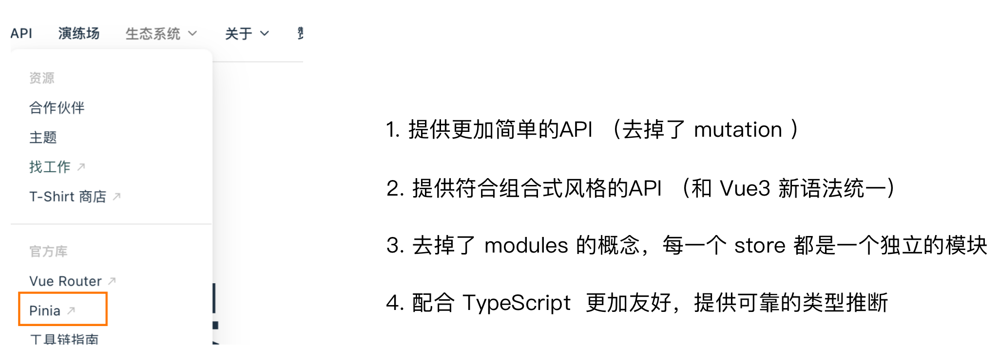
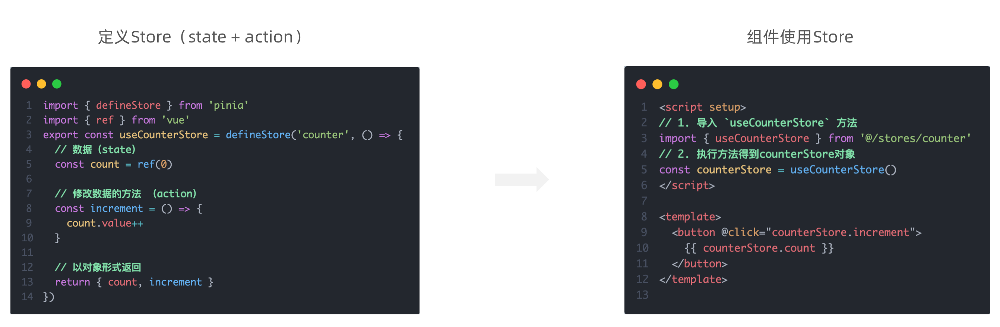
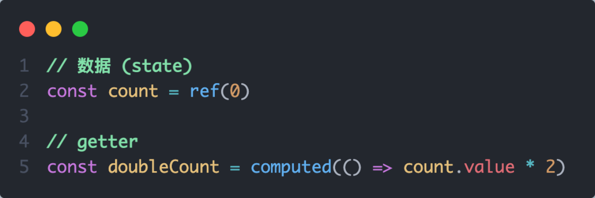
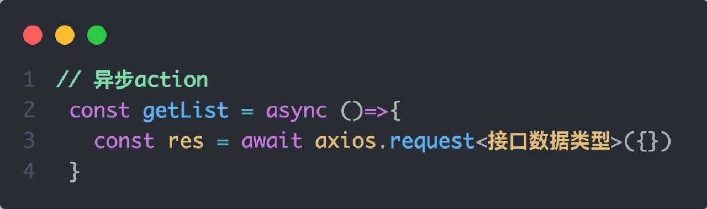
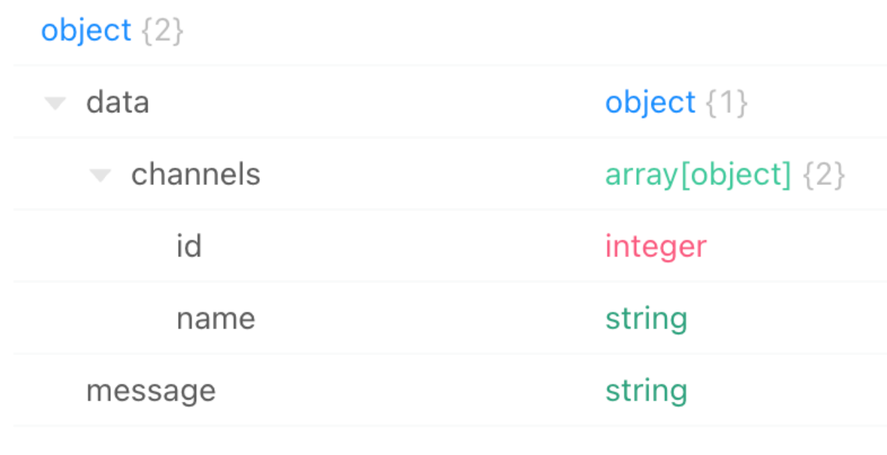
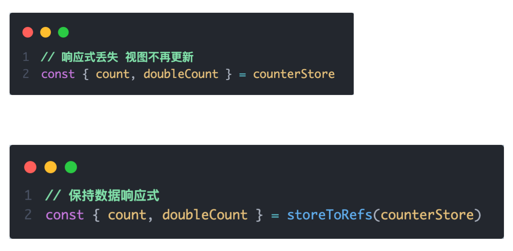
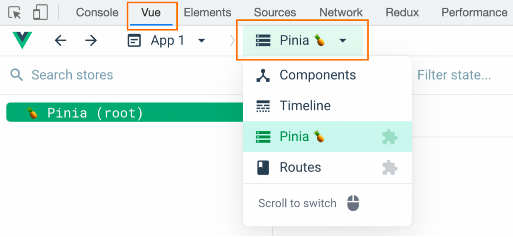

# Pinia 笔记

---


## 1. 什么是 Pinia

**Pinia** 是 Vue 的专属**最新状态管理库**，是 Vuex 状态管理工具的**替代品**，由 Vue 核心团队成员开发维护，已成为 Vue3 官方推荐的状态管理方案。



**核心定位：** 集中管理多个组件**共享的状态（数据）**，解决跨组件数据传递的问题。

**典型使用场景：**
- 多个组件都要展示的数据（用户信息、头像、权限）
- 多个组件共同读写的数据（购物车列表、全局配置）
- 需要跨多层组件传递且频繁变化的状态

---

## 2. Pinia vs Vuex 对比

| 对比项 | Vuex（Vue2/3） | Pinia（Vue3 推荐） |
|--------|--------------|-----------------|
| 核心概念 | state / mutations / actions / getters | state / actions / getters（**去掉了 mutations**）|
| 修改数据 | 同步必须通过 `commit mutations`，异步用 `dispatch actions` | **直接修改**或在 actions 中修改，无强制区分 |
| 模块化 | `modules` + `namespaced: true` 配置 | **每个 store 文件天然独立**，无需 modules |
| TypeScript 支持 | 类型推断较弱 | **原生完整支持**，类型推断友好 |
| 代码量 | 样板代码多，结构固定 | **更简洁**，与组合式 API 风格统一 |
| devtools 支持 | 支持 | **深度集成** Vue DevTools，开箱即用 |
| 插件系统 | 有 | **有**（如持久化插件） |

> ✅ **结论：Vue3 项目统一推荐使用 Pinia，不再使用 Vuex。**

---

## 3. 手动安装 Pinia 到 Vue3 项目

> 使用 `create-vue` 脚手架创建项目时可直接勾选 Pinia 自动集成。以下为从零手动添加流程。

**第一步：使用 Vite 创建空 Vue3 项目**

```bash
npm init vite@latest
# 按提示选择 Vue + JavaScript（或 TypeScript）
cd 项目名
npm install
```

**第二步：安装 Pinia**

```bash
npm install pinia
```

**第三步：在 `main.js` 中注册 Pinia**

```js
import { createApp } from 'vue'
import { createPinia } from 'pinia'  // ① 导入
import App from './App.vue'

const app = createApp(App)
const pinia = createPinia()          // ② 创建 pinia 实例

app.use(pinia)                       // ③ 注册到 Vue 应用（必须在 mount 之前）
app.mount('#app')

// 链式简写
// createApp(App).use(createPinia()).mount('#app')
```

**推荐项目目录结构：**

```
src/
├── stores/              # 统一存放所有 store 文件
│   ├── counter.js       # 计数器 store
│   ├── user.js          # 用户 store
│   └── channel.js       # 频道 store
├── components/
├── views/
├── App.vue
└── main.js
```

---

## 4. Pinia 基础使用



### 4.1 定义 Store

Pinia 使用 **`defineStore`** 函数定义 store，推荐使用**组合式写法**（与 Vue3 `<script setup>` 完全一致的风格）。

新建 `src/stores/counter.js`：

```js
import { defineStore } from 'pinia'
import { ref, computed } from 'vue'

// defineStore(id, setup函数)
// 参数1：store 的唯一标识 id（字符串），在 devtools 中显示，命名与文件名保持一致
// 参数2：组合式 setup 函数（与 <script setup> 写法完全相同）
export const useCounterStore = defineStore('counter', () => {

  // ① state：使用 ref 定义响应式数据
  const count = ref(0)
  const name = ref('Pinia')

  // ② getters：使用 computed 定义计算属性（有缓存）
  const doubleCount = computed(() => count.value * 2)

  // ③ actions：普通函数定义方法（同步/异步均可）
  const increment = () => {
    count.value++
  }

  const decrement = (step = 1) => {
    count.value -= step
  }

  // ⚠️ 必须 return，外部才能访问
  return {
    count,
    name,
    doubleCount,
    increment,
    decrement
  }
})
```

**命名规范速查：**

| 规范项 | 示例 |
|--------|------|
| 文件存放位置 | `src/stores/` |
| 文件命名 | `counter.js`（小写，与功能名对应） |
| 导出函数命名 | `use` + 功能名 + `Store` → `useCounterStore` |
| defineStore 第一个参数 id | 与文件名一致 → `'counter'` |

---

### 4.2 组件中使用 Store

```vue
<template>
  <div>
    <h2>Pinia 计数器</h2>
    <!-- 通过 store 实例直接访问 state、getters、actions -->
    <p>当前值：{{ counterStore.count }}</p>
    <p>双倍值：{{ counterStore.doubleCount }}</p>
    <button @click="counterStore.increment()">+ 1</button>
    <button @click="counterStore.decrement(5)">- 5</button>
  </div>
</template>

<script setup>
// ① 导入 store 钩子函数
import { useCounterStore } from '@/stores/counter'

// ② 调用函数得到响应式 store 实例（同一个组件多次调用返回同一个实例）
const counterStore = useCounterStore()

// 直接通过实例访问
console.log(counterStore.count)        // state：0
console.log(counterStore.doubleCount)  // getter：0
counterStore.increment()               // action：执行方法
</script>
```

> 📌 `useCounterStore()` 返回的是**响应式 Proxy 对象**，数据变化时视图自动更新。在同一个应用中多次调用同一个 `useXxxStore()`，返回的是**同一个 store 实例**（单例）。

---

## 5. getters 实现

Pinia 中的 **getters** 使用 Vue3 的 **`computed`** 函数实现，需要在 setup 函数中定义并 **return** 出去才能在组件中使用。



```js
// stores/counter.js
import { defineStore } from 'pinia'
import { ref, computed } from 'vue'

export const useCounterStore = defineStore('counter', () => {
  const count = ref(10)
  const price = ref(9.9)
  const list = ref([1, 2, 3, 4, 5, 6, 7, 8])

  // 基础计算
  const doubleCount = computed(() => count.value * 2)

  // 数字格式化
  const formattedPrice = computed(() => `¥${price.value.toFixed(2)}`)

  // 列表过滤（大于5的元素）
  const bigList = computed(() => list.value.filter(item => item > 5))

  // getters 之间互相引用（直接使用其他 computed 变量）
  const doubleCountPlusTen = computed(() => doubleCount.value + 10)

  // getters 也必须 return 出去
  return {
    count,
    price,
    list,
    doubleCount,
    formattedPrice,
    bigList,
    doubleCountPlusTen
  }
})
```

**组件中使用 getters（访问方式与 state 完全一致）：**

```vue
<template>
  <p>count 的双倍：{{ counterStore.doubleCount }}</p>
  <p>格式化价格：{{ counterStore.formattedPrice }}</p>
  <p>大于5的列表：{{ counterStore.bigList }}</p>
  <p>双倍+10：{{ counterStore.doubleCountPlusTen }}</p>
</template>

<script setup>
import { useCounterStore } from '@/stores/counter'
const counterStore = useCounterStore()
</script>
```

**getters 特性：**
- 基于 `computed` 实现，具有**缓存特性**，依赖数据不变则不重新计算
- 可以在 getter 中引用同 store 内其他 getter
- 只读，不能直接赋值（需通过 actions 修改依赖的 state）

---

## 6. actions 异步实现

Pinia 的 **actions** 可以直接编写**异步逻辑**，写法与组件中获取异步数据**完全一致**，直接使用 `async / await`，无需额外配置。

> Vuex 中异步操作必须在 actions，同步必须在 mutations；Pinia **彻底去掉这种区分**，统一在 actions 中处理所有逻辑。



**需求：** 在 Pinia 中获取频道列表数据，并把数据渲染到 App 组件的模板中。



**接口信息：**
- 请求地址：`http://geek.itheima.net/v1_0/channels`
- 请求方式：GET
- 请求参数：无

**第一步：定义 `src/stores/channel.js`**

```js
import { defineStore } from 'pinia'
import { ref } from 'vue'
import axios from 'axios'

export const useChannelStore = defineStore('channel', () => {

  // state：频道列表
  const channelList = ref([])

  // action：异步获取频道数据
  const getChannelList = async () => {
    // 与组件中 axios 写法完全一致
    const res = await axios.get('http://geek.itheima.net/v1_0/channels')
    // 直接赋值给 state
    channelList.value = res.data.data.channels
  }

  return {
    channelList,
    getChannelList
  }
})
```

**第二步：在 App.vue 中调用**

```vue
<template>
  <div>
    <h3>频道列表</h3>
    <ul>
      <li v-for="item in channelStore.channelList" :key="item.id">
        {{ item.name }}
      </li>
    </ul>
    <button @click="channelStore.getChannelList()">刷新数据</button>
  </div>
</template>

<script setup>
import { onMounted } from 'vue'
import { useChannelStore } from '@/stores/channel'

const channelStore = useChannelStore()

// 组件挂载时发请求获取数据
onMounted(() => {
  channelStore.getChannelList()
})
</script>
```

**补充：actions 中的完整错误处理（最佳实践）**

```js
// stores/channel.js（带 loading 和错误处理的完整版）
export const useChannelStore = defineStore('channel', () => {
  const channelList = ref([])
  const loading = ref(false)
  const error = ref(null)

  const getChannelList = async () => {
    loading.value = true
    error.value = null
    try {
      const res = await axios.get('http://geek.itheima.net/v1_0/channels')
      channelList.value = res.data.data.channels
    } catch (err) {
      error.value = '请求失败，请重试'
      console.error(err)
    } finally {
      loading.value = false
    }
  }

  return { channelList, loading, error, getChannelList }
})
```

---

## 7. storeToRefs 工具函数

### 问题：直接解构 store 会丢失响应式

```js
const counterStore = useCounterStore()

// ❌ 直接解构：count、doubleCount 变成普通 JS 值，失去响应式！
const { count, doubleCount, increment } = counterStore
// 此后修改 counterStore.count，模板中的 count 不会更新
```

### 解决：使用 storeToRefs

**`storeToRefs`** 是 Pinia 提供的工具函数，将 store 中的 **state 和 getters** 转为独立的 **ref 对象**，解构后仍保持响应式联系。



```vue
<template>
  <p>count: {{ count }}</p>
  <p>doubleCount: {{ doubleCount }}</p>
  <button @click="increment()">+1</button>
</template>

<script setup>
import { storeToRefs } from 'pinia'               // 从 pinia 导入
import { useCounterStore } from '@/stores/counter'

const counterStore = useCounterStore()

// ✅ state 和 getters：storeToRefs 解构，保持响应式
const { count, doubleCount } = storeToRefs(counterStore)

// ✅ actions（方法）：直接从 store 解构，无需 storeToRefs
const { increment, decrement } = counterStore
</script>
```

**核心规则：**

| 解构内容 | 推荐方式 | 说明 |
|----------|----------|------|
| **state**（数据） | `storeToRefs(store)` | 保持响应式，必须用 |
| **getters**（计算属性） | `storeToRefs(store)` | 保持响应式，必须用 |
| **actions**（方法） | 直接解构 `store` | 方法本身无需响应式 |

**`storeToRefs` vs Vue 的 `toRefs`：**

```js
import { storeToRefs } from 'pinia'  // ✅ 推荐：只处理 state 和 getters，跳过 actions
import { toRefs } from 'vue'         // ⚠️ 不推荐用于 store：会把 actions 也转成 ref
```

---

## 8. Pinia 调试工具

Pinia 与 **Vue DevTools** 深度集成，安装浏览器插件后无需额外配置，即可直接调试。



**主要调试功能：**
- 实时查看所有 store 的 **state 数据**和 **getters 计算结果**
- 在 devtools 面板中**手动修改 state**，实时查看视图变化
- 查看 **actions 调用历史记录**，支持时间旅行调试
- 多个 store 分开独立显示，层次清晰

**安装 Vue DevTools：**

```
Chrome 应用商店 → 搜索 "Vue.js devtools" → 安装
Edge 应用商店  → 搜索 "Vue.js devtools" → 安装
```

> 📌 **开发阶段建议始终开启 devtools**，在调试数据流问题时效率远高于 `console.log`。

---

## 9. Pinia 持久化插件

**问题：** Pinia 的 state 默认保存在**内存**中，**页面一刷新数据就丢失**（如登录 token、用户信息）。

**解决：** 使用 `pinia-plugin-persistedstate` 插件，将指定 state 自动同步到 `localStorage` 或 `sessionStorage`，刷新页面后自动恢复。

**官方文档：** https://prazdevs.github.io/pinia-plugin-persistedstate/zh/

### 第一步：安装插件

```bash
npm i pinia-plugin-persistedstate
```

### 第二步：在 main.js 中注册

```js
import { createApp } from 'vue'
import { createPinia } from 'pinia'
import persist from 'pinia-plugin-persistedstate'  // 导入持久化插件
import App from './App.vue'

const app = createApp(App)

// 将插件挂载到 pinia 实例上
app.use(createPinia().use(persist))

app.mount('#app')
```

### 第三步：在 store 中开启持久化

**最简方式（全部字段持久化）：**

```js
// stores/counter.js
import { defineStore } from 'pinia'
import { computed, ref } from 'vue'

export const useCounterStore = defineStore('counter', () => {
  const count = ref(0)
  const doubleCount = computed(() => count.value * 2)
  const increment = () => count.value++

  return {
    count,
    doubleCount,
    increment
  }
}, {
  // ✅ 开启持久化
  // 默认使用 localStorage，key 为 store 的 id（即 'counter'）
  persist: true
})
```

**高级配置（精确控制持久化字段）：**

```js
// stores/user.js
import { defineStore } from 'pinia'
import { ref } from 'vue'

export const useUserStore = defineStore('user', () => {
  const token = ref('')
  const userInfo = ref(null)
  const loading = ref(false)   // 临时状态，不需要持久化
  const theme = ref('light')   // 如需持久化可加入 paths

  return { token, userInfo, loading, theme }
}, {
  persist: {
    key: 'hm-user',                    // 自定义 localStorage 中存储的键名
    storage: localStorage,             // 存储介质（默认 localStorage，可改 sessionStorage）
    paths: ['token', 'userInfo'],      // 仅持久化指定字段，loading 不会被持久化
  }
})
```

**持久化配置项说明：**

| 配置项 | 类型 | 默认值 | 说明 |
|--------|------|--------|------|
| `key` | `String` | store 的 `id` | 本地存储的键名 |
| `storage` | `Storage` | `localStorage` | 存储介质，可改为 `sessionStorage` |
| `paths` | `String[]` | 全部 state 字段 | 指定需要持久化的字段名，未列出的字段不会持久化 |
| `beforeRestore` | `Function` | — | 数据恢复前执行的钩子 |
| `afterRestore` | `Function` | — | 数据恢复后执行的钩子 |

> 📌 **最佳实践：** 只持久化关键数据（如 `token`、`userInfo`），避免把 `loading`、`error`、弹窗状态等临时 UI 状态存入 localStorage，造成不必要的存储占用和状态恢复异常。

---

## 📋 知识总结

### Pinia 三大核心要素

| 要素 | 对应 Vue3 API | 作用 | 注意点 |
|------|-------------|------|--------|
| **state** | `ref()` / `reactive()` | 响应式状态数据，全局共享 | 可直接修改，也可通过 $patch 批量修改 |
| **getters** | `computed()` | 基于 state 的派生数据，有缓存 | 只读，依赖变化才重新计算 |
| **actions** | 普通函数 / `async` 函数 | 封装业务逻辑（同步/异步均可） | 直接修改 state，无需 commit |

### 完整 Store 开发模板

```js
// src/stores/模块名.js
import { defineStore } from 'pinia'
import { ref, computed } from 'vue'
import axios from 'axios'

export const use模块名Store = defineStore('模块名', () => {

  // ① state
  const data = ref([])
  const count = ref(0)

  // ② getters（computed）
  const total = computed(() => data.value.length)
  const doubleCount = computed(() => count.value * 2)

  // ③ actions — 同步
  const setCount = (n) => { count.value = n }

  // ④ actions — 异步
  const fetchData = async () => {
    const res = await axios.get('/api/xxx')
    data.value = res.data
  }

  // ⑤ 必须 return
  return { data, count, total, doubleCount, setCount, fetchData }

}, {
  persist: {                     // 可选：持久化配置
    key: '存储键名',
    paths: ['需要持久化的字段']
  }
})
```

### 组件使用完整模板

```vue
<script setup>
import { onMounted } from 'vue'
import { storeToRefs } from 'pinia'
import { use模块名Store } from '@/stores/模块名'

const store = use模块名Store()

// state + getters → storeToRefs 解构（必须，保持响应式）
const { data, count, total, doubleCount } = storeToRefs(store)

// actions → 直接解构（无需 storeToRefs）
const { setCount, fetchData } = store

onMounted(() => fetchData())
</script>
```

### Pinia 关键 API 速查

| API | 来源 | 说明 |
|-----|------|------|
| `defineStore(id, setup)` | pinia | 定义 store，id 唯一 |
| `useXxxStore()` | 自定义 | 获取 store 响应式实例（单例） |
| `storeToRefs(store)` | pinia | 响应式解构 state 和 getters |
| `store.$patch({})` | pinia | 批量修改多个 state 属性 |
| `store.$patch(fn)` | pinia | 通过函数批量修改（支持条件逻辑） |
| `store.$reset()` | pinia | 重置 state 为初始值（选项式写法支持） |

### Pinia vs Vuex 核心差异总结

| 功能 | Vuex | Pinia |
|------|------|-------|
| 同步修改数据 | 必须 `commit('mutation名')` | **直接赋值**即可 |
| 异步操作 | `dispatch('action名')` | action 中直接 `async/await` |
| 模块化 | `modules` + `namespaced: true` | 每个 store 文件**天然独立** |
| 辅助函数 | `mapState / mapGetters / mapMutations / mapActions` | `storeToRefs` + 直接解构 |
| TypeScript | 支持较弱 | **原生完整支持** |

---

### 🔑 重点难点提示

1. **Pinia 完全去掉 mutations** — 数据修改不再有同步/异步的强制分离，无论什么操作都在 actions 中完成，甚至可以在组件中直接对 `store.xxx` 赋值，这是 Pinia 最核心的简化

2. **storeToRefs 解构规则** — `state` 和 `getters` 必须用 `storeToRefs` 解构；`actions`（方法）直接从 store 解构即可。混淆这两种规则是最常见的 Pinia 使用错误

3. **组合式 store 必须手动 return** — 与 `<script setup>` 不同，Pinia 的组合式 setup 函数中定义的变量和函数**必须手动 return**，否则组件中访问为 `undefined`

4. **异步 action 写法简单直接** — 在 action 中用 `async/await` 发请求后，直接给 `ref` 变量赋值即可，写法与组件 `onMounted` 中**完全一致**，没有任何额外概念需要学习

5. **持久化要精细控制** — 通过 `paths` 只持久化必要字段（如 `token`、`userInfo`），不要无脑 `persist: true` 全量持久化，避免 `loading`、`error` 等临时状态也被存储

6. **store 中 actions 可互相调用** — 在同一 store 的 action 中，可以直接调用其他 action 函数（因为同在 setup 闭包内），无需通过任何中间层，写法与普通函数调用完全一样