# Java IO 流 

---

## 一、File 类

### 1.1 计算机基础常识

```
1. 以 .jpg 结尾的一定是图片吗？不一定，也可能是文件夹
2. 文本文档：用记事本打开后人能看懂的文件（.txt / .html / .css 等）
3. 路径 E:\Idea\io\1.jpg 中，1.jpg 的父路径是 E:\Idea\io
4. 分隔符：
   - 路径名称分隔符：Windows → \，Linux/Mac → /
   - 路径分隔符（多个路径之间）：;
```

### 1.2 File 类概述

`File` 是 **文件和目录（文件夹）路径名的抽象表示**。

```java
// 创建 File 对象时，传递的路径可以不存在（不会报错）
File file = new File("E:\\Idea\\io\\1.jpg");
```

---

### 1.3 File 静态成员

| 静态属性 | 说明 | 值（Windows） |
|----------|------|--------------|
| `File.pathSeparator` | 路径和路径之间的分隔符 | `;` |
| `File.separator` | 路径中的名称分隔符 | `\` |

```java
// 跨平台写法（推荐）
String path = "E:" + File.separator + "Idea" + File.separator + "io";
// 而不是硬编码 "E:\\Idea\\io"（仅 Windows 有效）
```

---

### 1.4 File 构造方法

| 构造方法 | 说明 |
|----------|------|
| `File(String pathname)` | 直接指定完整路径 |
| `File(String parent, String child)` | 父路径（String）+ 子路径 |
| `File(File parent, String child)` | 父路径（File 对象）+ 子路径 |

```java
File file1 = new File("E:\\Idea\\io\\1.jpg");                    // 方式一
File file2 = new File("E:\\Idea\\io", "1.jpg");                  // 方式二
File file3 = new File(new File("E:\\Idea\\io"), "1.jpg");        // 方式三
```

---

### 1.5 File 常用方法汇总

#### 获取方法

| 方法 | 说明 |
|------|------|
| `String getAbsolutePath()` | 获取**绝对路径**（带盘符） |
| `String getPath()` | 获取**封装路径**（new 时写的是什么就返回什么） |
| `String getName()` | 获取文件或文件夹**名称** |
| `long length()` | 获取**文件大小**（字节数，文件夹返回 0） |
| `File getParentFile()` | 获取父目录的 File 对象 |

```java
    File file = new File("module21\\1.txt");
    System.out.println(file.getAbsolutePath()); // E:\Idea\...\module21\1.txt
    System.out.println(file.getPath());         // module21\1.txt
    System.out.println(file.getName());         // 1.txt
    System.out.println(file.length());          // 字节数
```

#### 创建方法

| 方法 | 说明 |
|------|------|
| `boolean createNewFile()` | 创建**文件**（已存在返回 false，不存在创建并返回 true） |
| `boolean mkdir()` | 创建**单级**文件夹 |
| `boolean mkdirs()` | 创建**多级**文件夹（推荐，单级也能用） |

```java
File file1 = new File("E:\\Idea\\io\\test.txt");
file1.createNewFile(); // 创建文件

File file2 = new File("E:\\Idea\\io\\a\\b\\c");
file2.mkdirs(); // 创建多级目录
```

#### 删除方法

| 方法 | 说明 |
|------|------|
| `boolean delete()` | 删除文件或**空文件夹** |

> ⚠️ **注意：**
> - `delete()` **不走回收站**，直接彻底删除
> - 只能删除**空文件夹**，非空文件夹需要先递归删除内容

#### 判断方法

| 方法 | 说明 |
|------|------|
| `boolean isDirectory()` | 是否为**文件夹** |
| `boolean isFile()` | 是否为**文件** |
| `boolean exists()` | 是否**存在** |

#### 遍历方法

| 方法 | 说明 |
|------|------|
| `String[] list()` | 遍历文件夹，返回 String 数组（文件/夹名称） |
| `File[] listFiles()` | 遍历文件夹，返回 File 数组（**推荐**） |

> `listFiles()` 底层调用 `list()`，将 String 数组中每项封装为 File 对象后返回。

---

### 1.6 相对路径与绝对路径

| 类型 | 说明 | 示例 |
|------|------|------|
| **绝对路径** | 从盘符开始写 | `E:\\idea\\io\\1.txt` |
| **相对路径** | 不从盘符开始 | `module21\\1.txt` |

> 💡 **IDEA 中相对路径技巧：**  
> 参照路径 = 当前 Project 的根目录（绝对路径）  
> 相对路径 = 完整路径去掉参照路径后的剩余部分  
> 例：`E:\Idea\workspace\javase\module21\1.txt` → 相对路径为 `module21\1.txt`  
> 如果直接写文件名 `1.txt`，默认位置是当前 Project 根目录下

---

### 1.7 练习：递归遍历指定文件夹下所有 .jpg 文件

```java
public class Demo04File {
    public static void main(String[] args) {
        File file = new File("E:\\Idea\\io\\aa");
        findJpg(file);
    }

    private static void findJpg(File file) {
        File[] files = file.listFiles();
        if (files == null) return; // 防止空指针（权限不足或路径不存在）

        for (File f : files) {
            if (f.isFile()) {
                // 是文件，判断是否以 .jpg 结尾
                if (f.getName().endsWith(".jpg")) {
                    System.out.println(f.getName());
                }
            } else {
                // 是文件夹，递归
                findJpg(f);
            }
        }
    }
}
```

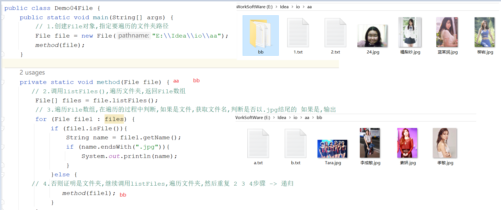

---

## 二、IO 流概述与分类

### 2.1 为什么需要 IO 流

数组和集合只能**临时存储**数据（程序结束后数据消失）。IO 流可以将数据**永久保存到硬盘**，或从硬盘读取数据到内存。

```
IO 流：将一个设备上的数据传输到另一个设备上的技术
  I = Input（输入）：硬盘 → 内存（读数据）
  O = Output（输出）：内存 → 硬盘（写数据）
```

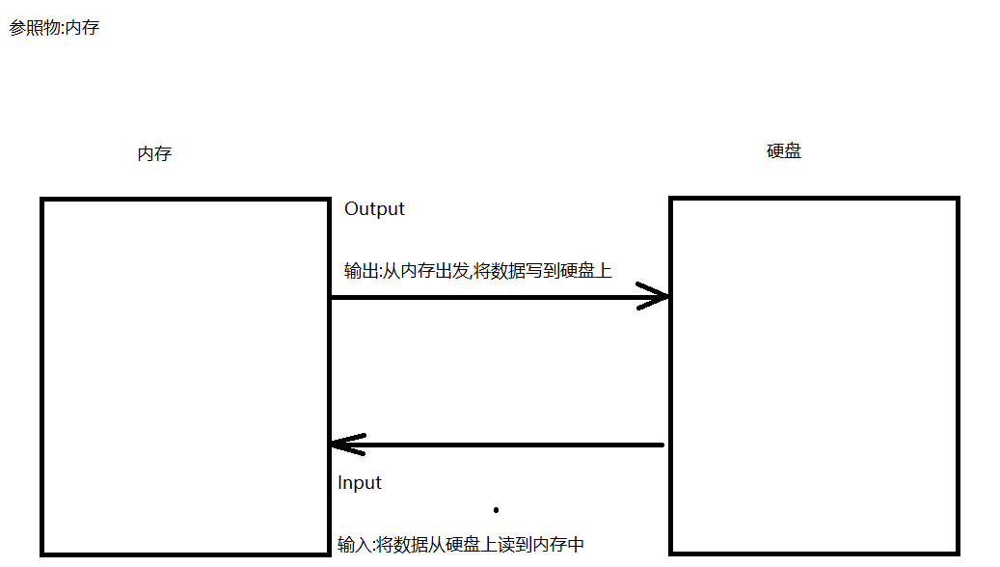

---

### 2.2 IO 流分类

#### 按数据类型分

| 类型 | 抽象基类 | 说明 |
|------|----------|------|
| **字节输出流** | `OutputStream` | 万能流，可操作任意文件 |
| **字节输入流** | `InputStream` | 万能流，可操作任意文件 |
| **字符输出流** | `Writer` | 专门操作**文本文档** |
| **字符输入流** | `Reader` | 专门操作**文本文档** |

#### 按流向分

| 流向 | 说明 |
|------|------|
| 输入流（Input） | 从硬盘读到内存 |
| 输出流（Output） | 从内存写到硬盘 |

> 💡 **选择原则：**
> - 操作文本文件（.txt .html .java 等）→ 优先用**字符流**
> - 操作图片、音频、视频、二进制文件 → 必须用**字节流**
> - 文件复制 → 优先用**字节流**（字节流是万能流）

---

### 2.3 IO 流体系结构

```
            IO 流
           /      \
       字节流      字符流
      /      \    /      \
  输出流  输入流  输出流  输入流
    |        |      |       |
OutputStream InputStream Writer Reader
    |            |          |       |
FileOutputStream FileInputStream FileWriter FileReader
BufferedOutputStream BufferedInputStream BufferedWriter BufferedReader
ObjectOutputStream ObjectInputStream
OutputStreamWriter InputStreamReader
PrintStream
```

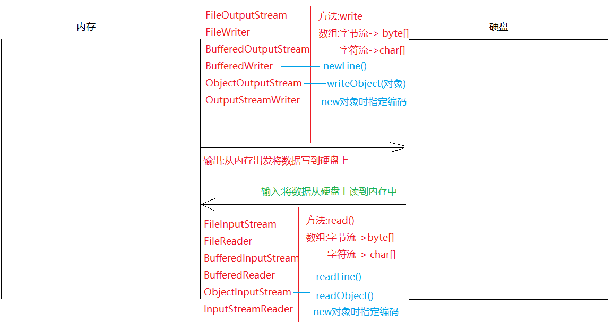

---

## 三、字节流

### 3.1 FileOutputStream（字节输出流）

```java
概述：字节输出流，往硬盘上写数据
父类：OutputStream（抽象类）
```

**构造方法：**

| 构造方法 | 说明 |
|----------|------|
| `FileOutputStream(File file)` | 覆盖写入（每次运行覆盖旧文件） |
| `FileOutputStream(String name)` | 覆盖写入 |
| `FileOutputStream(String name, boolean append)` | `append=true` → **追加续写** |

> ⚠️ **特点：**
> - 指定的文件如果**不存在**，自动创建（但父目录必须存在）
> - 默认每次运行**覆盖**旧文件（`append=false`）

**常用方法：**

| 方法 | 说明 |
|------|------|
| `void write(int b)` | 写**一个字节** |
| `void write(byte[] b)` | 写**一个字节数组** |
| `void write(byte[] b, int off, int len)` | 写字节数组的**指定部分** |
| `void close()` | 关闭流（必须调用！） |

```java
// 1. 写一个字节
FileOutputStream fos = new FileOutputStream("module21\\1.txt");
fos.write(97); // 写入字符 'a'（ASCII 97）
fos.close();

// 2. 写字节数组
FileOutputStream fos2 = new FileOutputStream("module21\\1.txt");
byte[] bytes = {97, 98, 99, 100, 101}; // a b c d e
fos2.write(bytes);
fos2.close();

// 3. 写字节数组的一部分
FileOutputStream fos3 = new FileOutputStream("module21\\1.txt");
fos3.write(bytes, 0, 2); // 从索引0开始，写2个字节 → "ab"
fos3.close();

// 4. 写字符串（推荐方式）
FileOutputStream fos4 = new FileOutputStream("module21\\1.txt");
fos4.write("Hello Java".getBytes());
fos4.close();
```

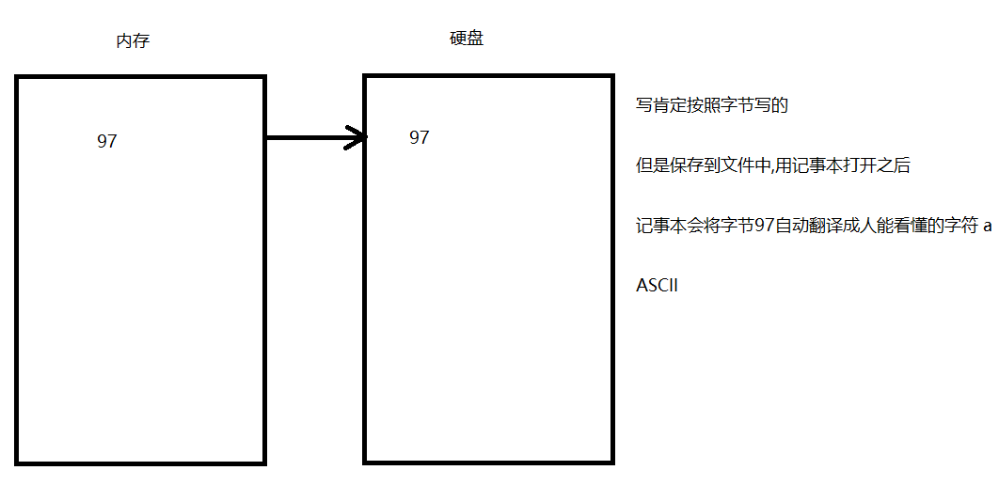

**续写与换行：**

```java
// 追加续写（append=true）
FileOutputStream fos = new FileOutputStream("module21\\1.txt", true);
fos.write("床前明月光\r\n".getBytes()); // Windows 换行：\r\n
fos.write("疑是地上霜\r\n".getBytes()); // Linux 换行：\n  Mac：\r
fos.close();
```

| 系统 | 换行符 | 占用字节数 |
|------|--------|-----------|
| Windows | `\r\n` | 2 字节 |
| Linux | `\n` | 1 字节 |
| Mac OS | `\r` | 1 字节 |

---

### 3.2 FileInputStream（字节输入流）

```java
概述：字节输入流，从硬盘读数据到内存
父类：InputStream（抽象类）
```

**构造方法：**

| 构造方法 | 说明 |
|----------|------|
| `FileInputStream(File file)` | |
| `FileInputStream(String path)` | |

**常用方法：**

| 方法 | 说明 |
|------|------|
| `int read()` | 读**一个字节**，返回字节值；到达文件末尾返回 `-1` |
| `int read(byte[] b)` | 读**一个字节数组**，返回读取的字节个数；到末尾返回 `-1` |
| `int read(byte[] b, int off, int len)` | 读字节数组的指定部分 |
| `void close()` | 关闭流 |

```java
// 1. 一次读一个字节（循环读取）
FileInputStream fis = new FileInputStream("module21\\1.txt");
int len;
while ((len = fis.read()) != -1) {
    System.out.print((char) len);
}
fis.close();

// 2. 一次读一个字节数组（效率更高，推荐）
FileInputStream fis2 = new FileInputStream("module21\\1.txt");
byte[] bytes = new byte[1024]; // 通常定义为 1024 或 1024 的倍数
int len2;
while ((len2 = fis2.read(bytes)) != -1) {
    System.out.print(new String(bytes, 0, len2)); // 注意：用 len2，不用 bytes.length
}
fis2.close();
```

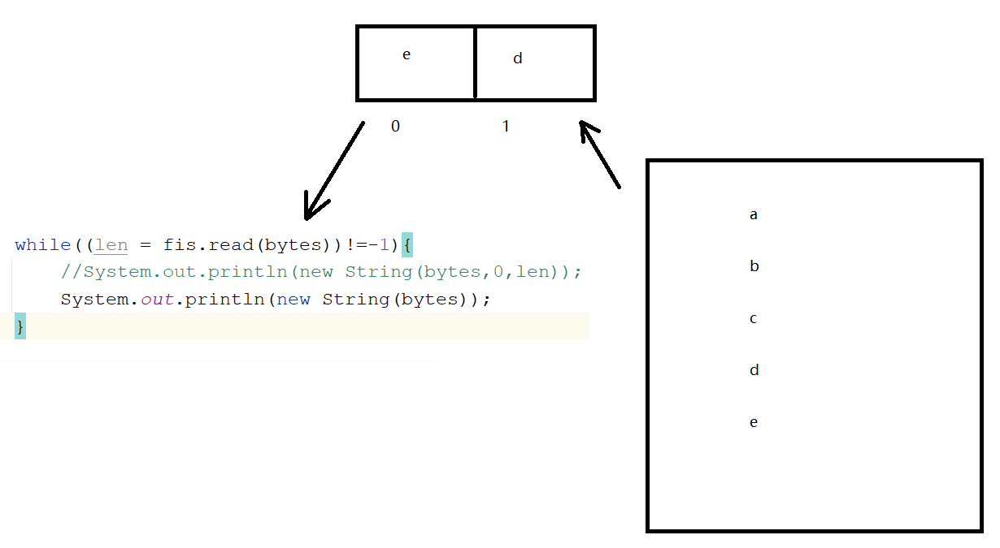

**关于 read() 返回 -1：**

```
每个文件末尾都有一个不可见的"结束标记"
当 read() 读到结束标记时，返回 -1
```

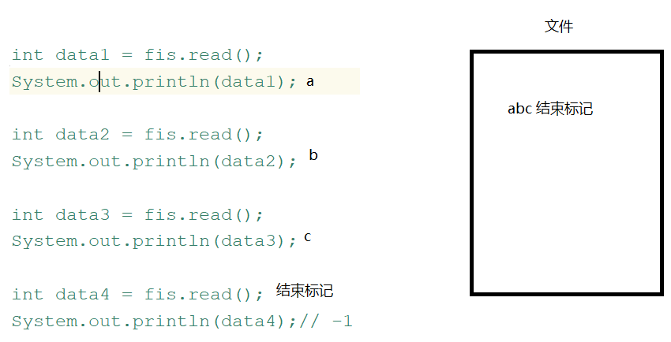

> ⚠️ **常见问题：**
> - 一个流对象读完之后不要再读，否则永远返回 -1
> - 流关闭之后不能继续使用，否则抛出 `java.io.IOException: Stream Closed`

---

### 3.3 字节流复制文件

```java
public class Demo01CopyFile {
    public static void main(String[] args) throws Exception {
        // 1. 创建输入流（读源文件）
        FileInputStream fis = new FileInputStream("E:\\Idea\\io\\source.jpg");
        // 2. 创建输出流（写目标文件）
        FileOutputStream fos = new FileOutputStream("E:\\Idea\\io\\target.jpg");

        // 3. 定义缓冲数组，边读边写
        byte[] bytes = new byte[1024];
        int len;
        while ((len = fis.read(bytes)) != -1) {
            fos.write(bytes, 0, len); // 读多少写多少
        }

        // 4. 先关输出流，再关输入流（先开后关原则）
        fos.close();
        fis.close();
    }
}
```

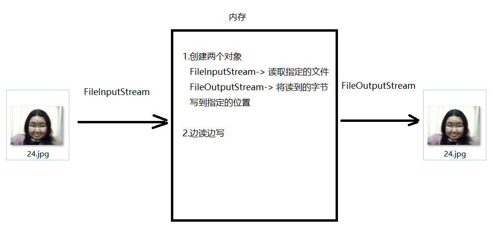

---

## 四、字符流

### 4.1 为什么需要字符流

```
问题：字节流读取中文可能出现乱码
原因：
  UTF-8：一个汉字占 3 个字节
  GBK：一个汉字占 2 个字节
  按字节读取时，可能切断一个汉字的字节序列，导致乱码

解决：使用字符流，按"字符"为单位读取文本
```

> ⚠️ **注意：**
> - 字符流只适合操作**文本文件**，不适合复制二进制文件（图片/视频会损坏）
> - 编码和解码必须使用**相同的字符集**，否则仍然乱码
> - 文件复制统一使用**字节流**

---

### 4.2 FileReader（字符输入流）

```java
概述：字符输入流，读文本文档到内存
父类：Reader（抽象类）
```

| 方法 | 说明 |
|------|------|
| `int read()` | 读**一个字符**，返回字符对应 int 值；末尾返回 -1 |
| `int read(char[] cbuf)` | 读**一个字符数组**，返回读取个数 |
| `int read(char[] cbuf, int off, int len)` | 读字符数组的指定部分 |
| `void close()` | 关闭流 |

```java
// 方式一：一次读一个字符
FileReader fr = new FileReader("module21\\1.txt");
int len;
while ((len = fr.read()) != -1) {
    System.out.print((char) len);
}
fr.close();

// 方式二：一次读一个字符数组（推荐）
FileReader fr2 = new FileReader("module21\\1.txt");
char[] chars = new char[1024];
int len2;
while ((len2 = fr2.read(chars)) != -1) {
    System.out.print(new String(chars, 0, len2));
}
fr2.close();
```

---

### 4.3 FileWriter（字符输出流）

```java
概述：字符输出流，将数据写到文本文件中
父类：Writer（抽象类）
```

**构造方法：**

| 构造方法 | 说明 |
|----------|------|
| `FileWriter(File file)` | 覆盖写 |
| `FileWriter(String fileName)` | 覆盖写 |
| `FileWriter(String fileName, boolean append)` | `true` → 追加续写 |

**常用方法：**

| 方法 | 说明 |
|------|------|
| `void write(int c)` | 写一个字符 |
| `void write(char[] cbuf)` | 写一个字符数组 |
| `void write(char[] cbuf, int off, int len)` | 写字符数组的指定部分 |
| `void write(String str)` | **直接写字符串**（字符流独有优势） |
| `void flush()` | 将缓冲区数据**刷到文件**，流对象仍可继续使用 |
| `void close()` | **先 flush 后关闭**，流对象不可再使用 |

```java
FileWriter fw = new FileWriter("module21\\2.txt");
fw.write("千山鸟飞绝\r\n");
fw.write("万径人踪灭\r\n");
fw.write("孤舟蓑笠翁\r\n");
fw.write("独钓寒江雪\r\n");
fw.close(); // close() 内部自动调用 flush()
```

> ⚠️ **重要：** `FileWriter` 底层自带**缓冲区**，写的数据先进缓冲区，必须调用 `flush()` 或 `close()` 才能真正写入文件。如果只 `write()` 不 `close()/flush()`，文件内容可能为空！

**flush() 与 close() 区别：**

| 方法 | 是否释放资源 | 能否继续使用 |
|------|------------|------------|
| `flush()` | 否 | ✅ 可以 |
| `close()` | ✅ 是 | ❌ 不能 |

---

### 4.4 IO 异常处理

**传统方式（JDK7 之前）：**

```java
FileWriter fw = null;
try {
    fw = new FileWriter("module21\\3.txt");
    fw.write("你好");
} catch (Exception e) {
    e.printStackTrace();
} finally {
    if (fw != null) { // 防止 fw 为 null 时调用 close() 报空指针
        try {
            fw.close();
        } catch (IOException e) {
            e.printStackTrace();
        }
    }
}
```

**try-with-resources（JDK7+ 推荐）：**

```java
// 格式：try(IO对象声明) { ... } catch(...) { ... }
// 特点：自动关闭流，代码更简洁

try (FileWriter fw = new FileWriter("module21\\4.txt");
     FileReader fr = new FileReader("module21\\4.txt")) {
    fw.write("你好");
    fw.flush();
    // 代码块结束后自动调用 fw.close() 和 fr.close()
} catch (Exception e) {
    e.printStackTrace();
}
```

> 💡 try-with-resources 支持同时声明多个资源，用 `;` 分隔，关闭顺序与声明顺序**相反**（后声明的先关闭）。

---

## 五、缓冲流

### 5.1 为什么需要缓冲流

`FileInputStream`/`FileOutputStream` 的读写是**直接与硬盘交互**的本地方法（native），效率低。

缓冲流底层带一个长度为 **8192 字节**的缓冲数组，读写在**内存**中完成，效率大幅提升。

> 使用时，将基本流作为参数传入缓冲流构造方法（**装饰者模式**）

---

### 5.2 字节缓冲流

| 类 | 说明 |
|----|------|
| `BufferedOutputStream` | 字节缓冲输出流，包装 `OutputStream` |
| `BufferedInputStream` | 字节缓冲输入流，包装 `InputStream` |

```java
    // 使用字节缓冲流复制大文件（比基本流快很多）
    FileInputStream fis = new FileInputStream("E:\\Idea\\io\\1.avi");
    FileOutputStream fos = new FileOutputStream("E:\\Idea\\io\\2.avi");
    
    BufferedInputStream bis = new BufferedInputStream(fis);
    BufferedOutputStream bos = new BufferedOutputStream(fos);
    
    int len;
    while ((len = bis.read()) != -1) {
        bos.write(len);
    }
    
    // 只需关闭缓冲流，其 close() 内部会自动关闭包装的基本流
    bos.close();
    bis.close();
```

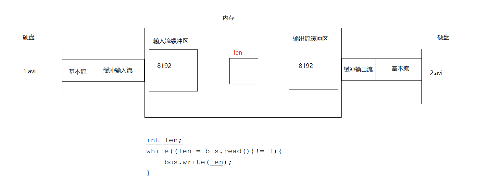

**缓冲流工作原理：**
```
硬盘 → [FileInputStream] → [BufferedInputStream缓冲区(8192字节)]
     → [BufferedOutputStream缓冲区(8192字节)] → [FileOutputStream] → 硬盘
```

> 💡 **性能对比：**  
> 基本字节流逐字节复制 1GB 文件可能需要数分钟；缓冲流可在秒级完成。

---

### 5.3 字符缓冲流

字符流基本类本身就带缓冲区，效率提升不如字节缓冲流明显，但字符缓冲流有**两个非常实用的特有方法**：

| 类 | 特有方法 | 说明 |
|----|----------|------|
| `BufferedWriter` | `newLine()` | 写入**系统相关的换行符**（跨平台） |
| `BufferedReader` | `String readLine()` | **一次读一行**，到末尾返回 `null` |

#### BufferedWriter

```java
BufferedWriter bw = new BufferedWriter(new FileWriter("module22\\1.txt"));
bw.write("床前明月光");
bw.newLine(); // 跨平台换行（自动判断 \r\n 或 \n）
bw.write("疑是地上霜");
bw.newLine();
bw.write("举头望明月");
bw.newLine();
bw.write("低头思故乡");
bw.newLine();
bw.close();
```

#### BufferedReader

```java
BufferedReader br = new BufferedReader(new FileReader("module22\\1.txt"));
String line;
while ((line = br.readLine()) != null) { // 读到 null 代表文件末尾
    System.out.println(line);
}
br.close();
```

> 💡 **`readLine()` 读取的内容不包含换行符**，需自行处理换行输出。

---

## 六、转换流（解决乱码）

### 6.1 字符编码与字符集

```
编码：按照某种规则，将字符存储到计算机中（字符 → 二进制）
解码：将计算机中的二进制按规则还原为字符（二进制 → 字符）
乱码原因：编码和解码使用的规则不一致
```

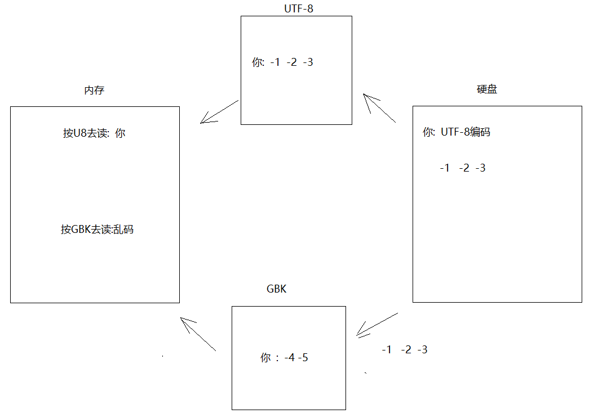

**常见字符集：**

| 字符集 | 说明 | 汉字占用字节 |
|--------|------|------------|
| ASCII | 基于拉丁字母，7位，128个字符 | — |
| ISO-8859-1 | 单字节，兼容 ASCII，不支持中文 | — |
| GB2312 | 简体中文，约7000汉字 | 2字节 |
| **GBK** | 最常用中文码表，21003汉字，兼容GB2312 | **2字节** |
| GB18030 | 最新中文码表，70244汉字 | 1/2/4字节 |
| **UTF-8** | 万国码，互联网首选，变长编码 | **3字节** |
| UTF-16 | 固定2或4字节 | 2字节 |

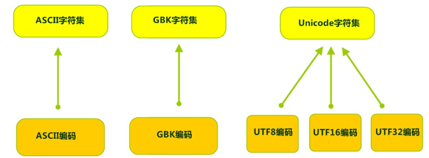

> 🔑 **核心原则：编码和解码必须使用相同的字符集！**

---

### 6.2 InputStreamReader（字节流 → 字符流）

> 是**字节流通向字符流的桥梁**，可指定编码格式读取文件

```java
// 格式
InputStreamReader isr = new InputStreamReader(InputStream in, String charsetName);
```

```java
// 以 GBK 编码读取 GBK 格式的文件（解决乱码）
InputStreamReader isr = new InputStreamReader(
    new FileInputStream("E:\\Idea\\io\\1.txt"), "GBK"); // 不区分大小写
int data;
while ((data = isr.read()) != -1) {
    System.out.print((char) data);
}
isr.close();
```

---

### 6.3 OutputStreamWriter（字符流 → 字节流）

> 是**字符流通向字节流的桥梁**，可指定编码格式写入文件

```java
// 格式
OutputStreamWriter osw = new OutputStreamWriter(OutputStream out, String charsetName);
```

```java
// 以 GBK 编码写入文件
OutputStreamWriter osw = new OutputStreamWriter(
    new FileOutputStream("E:\\Idea\\io\\1.txt"), "GBK");
osw.write("你好世界");
osw.close();
```

**转换流使用场景：**

```
场景1：读取 GBK 编码的文件（IDEA 默认 UTF-8）
  → InputStreamReader(new FileInputStream(path), "GBK")

场景2：将数据以 GBK 格式写入文件供其他程序使用
  → OutputStreamWriter(new FileOutputStream(path), "GBK")

场景3：网络通信中指定编码格式
  → 包装 Socket 的 InputStream/OutputStream

JDK11 简化写法：
  FileReader fr = new FileReader("path", Charset.forName("GBK"));
  FileWriter fw = new FileWriter("path", Charset.forName("GBK"));
```

---

## 七、序列化与反序列化流

### 7.1 概述

| 操作 | 流 | 说明 |
|------|---|------|
| **序列化**（写对象） | `ObjectOutputStream` | 将 Java 对象转为字节序列写入文件 |
| **反序列化**（读对象） | `ObjectInputStream` | 从文件读取字节序列还原为 Java 对象 |

```
应用场景：游戏存档、对象持久化、网络传输对象等
```

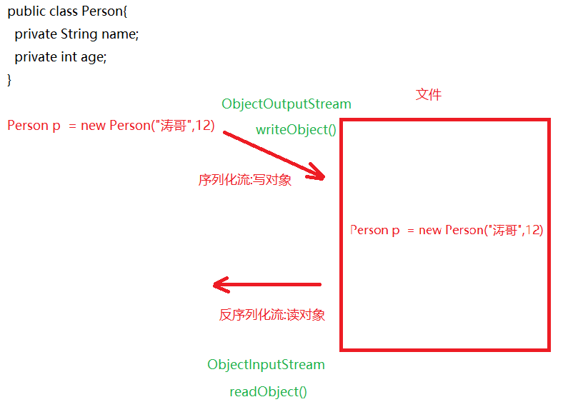

> ⚠️ **前提条件：** 被序列化的对象必须**实现 `Serializable` 接口**（标记接口，无需实现任何方法）

---

### 7.2 ObjectOutputStream（序列化）

```java
// 构造：ObjectOutputStream(OutputStream out)
// 方法：writeObject(Object obj)

// 实体类（必须实现 Serializable）
public class Person implements Serializable {
    public static final long serialVersionUID = 42L; // 固定序列号（重要！）
    private String name;
    private Integer age;
    // ... 构造方法、getter/setter、toString
}

// 序列化写对象
ObjectOutputStream oos = new ObjectOutputStream(
    new FileOutputStream("module22\\person.txt"));
Person p1 = new Person("张三", 25);
oos.writeObject(p1);
oos.close();
```

---

### 7.3 ObjectInputStream（反序列化）

```java
// 构造：ObjectInputStream(InputStream in)
// 方法：Object readObject()

ObjectInputStream ois = new ObjectInputStream(
    new FileInputStream("module22\\person.txt"));
Person person = (Person) ois.readObject();
System.out.println(person);
ois.close();
```

---

### 7.4 serialVersionUID（序列号）

**问题：** 序列化后修改了类（添加/删除字段），再反序列化会报 `InvalidClassException`（序列号不匹配）。

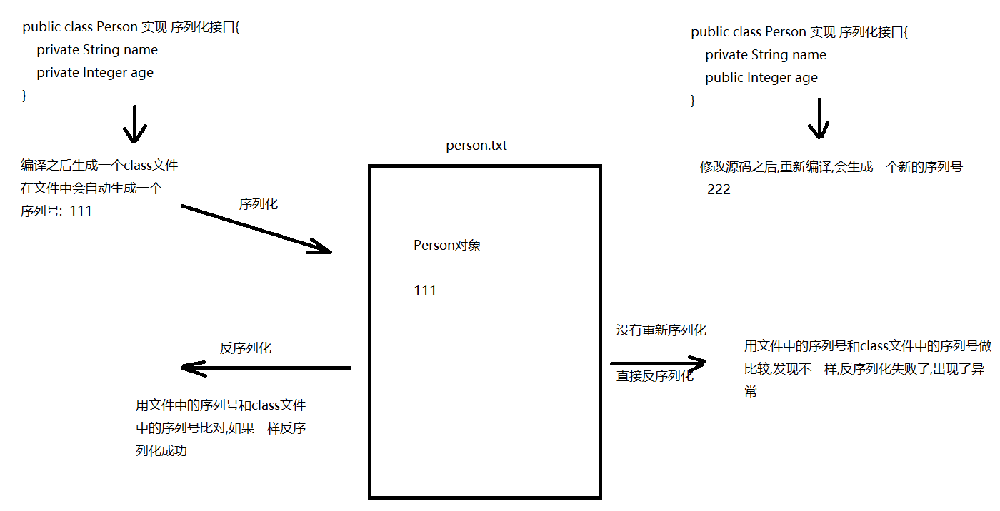

**解决：手动定义 `serialVersionUID` 并固定值**

```java
public class Person implements Serializable {
    // 固定序列号，不管类如何修改，序列号不变
    public static final long serialVersionUID = 42L;
    
    private String name;
    private Integer age;
    // 后续新增字段不影响反序列化
    // private String address; // 新增字段也OK
}
```

---

### 7.5 transient 关键字

用 `transient` 修饰的字段**不参与序列化**（敏感信息如密码不想被持久化时使用）：

```java
public class User implements Serializable {
    private String username;
    private transient String password; // 不会被序列化
}
```

---

### 7.6 序列化多个对象（推荐用集合）

**问题：** 多次 `readObject()` 次数与写入不匹配时抛出 `EOFException`。

**解决：将对象放入集合，序列化/反序列化集合整体**

```java
// 序列化
ObjectOutputStream oos = new ObjectOutputStream(
    new FileOutputStream("module22\\persons.txt"));
ArrayList<Person> list = new ArrayList<>();
list.add(new Person("张三", 20));
list.add(new Person("李四", 25));
list.add(new Person("王五", 30));
oos.writeObject(list); // 只写一次
oos.close();

// 反序列化
ObjectInputStream ois = new ObjectInputStream(
    new FileInputStream("module22\\persons.txt"));
ArrayList<Person> result = (ArrayList<Person>) ois.readObject(); // 只读一次
for (Person p : result) {
    System.out.println(p);
}
ois.close();
```

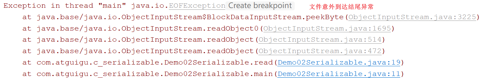

---

## 八、打印流 PrintStream

### 8.1 基本使用

| 方法 | 说明 |
|------|------|
| `println(T x)` | 原样输出，**自动换行** |
| `print(T x)` | 原样输出，**不换行** |

```java
// 构造：PrintStream(String fileName)
PrintStream ps = new PrintStream("module22\\printstream.txt");
ps.println("第一行内容"); // 写入文件并换行
ps.println("第二行内容");
ps.close();
```

---

### 8.2 改变输出流向（日志记录）

`System.out.println()` 默认输出到控制台，可以通过 `System.setOut()` 将输出重定向到文件：

```java
// 将 System.out 重定向到文件
PrintStream ps = new PrintStream("module22\\log.txt");
System.setOut(ps); // 改变流向

System.out.println("2024-01-01 错误：空指针异常");
System.out.println("2024-01-01 原因：user 对象未初始化");
ps.close();
```

**使用场景：** 将运行日志永久保存到文件，而不是仅显示在控制台（控制台内容是临时的，新程序运行后会覆盖）。

---

### 8.3 PrintStream 续写

```java
// 通过包装 FileOutputStream(path, true) 实现续写
PrintStream ps = new PrintStream(
    new FileOutputStream("module22\\log.txt", true)); // true = 追加
System.setOut(ps);
System.out.println("追加的日志内容");
ps.close();
```

---

## 九、Properties 集合结合 IO 流

### 9.1 Properties 概述

```
Properties extends Hashtable
特点：
  - 无序、无索引
  - key 唯一，value 可重复
  - 线程安全
  - key 和 value 默认都是 String 类型
```

### 9.2 特有方法

| 方法 | 说明 |
|------|------|
| `setProperty(String key, String value)` | 存键值对 |
| `getProperty(String key)` | 根据 key 获取 value |
| `Set<String> stringPropertyNames()` | 获取所有 key 存入 Set |
| `load(InputStream in)` | 从流中加载配置数据到集合 |
| `store(OutputStream out, String comments)` | 将集合数据写入文件 |

```java
Properties properties = new Properties();
properties.setProperty("username", "root");
properties.setProperty("password", "123456");

Set<String> keys = properties.stringPropertyNames();
for (String key : keys) {
    System.out.println(key + " = " + properties.getProperty(key));
}
```

---

### 9.3 结合 IO 流读取配置文件

**使用场景：** 将数据库用户名、密码等配置从代码中分离，写入 `.properties` 文件，修改配置时无需改动源码。

**配置文件格式（`jdbc.properties`）：**

```properties
# 这是注释（# 开头）
jdbc.username=root
jdbc.password=1234
jdbc.url=jdbc:mysql://localhost:3306/mydb
# 注意：
# 1. key=value 形式，不加引号
# 2. 每个键值对单独一行
# 3. 键值对之间不要有多余空格
# 4. 不建议使用中文（会乱码）
```

```java
// 读取配置文件
Properties properties = new Properties();
FileInputStream fis = new FileInputStream("module22\\jdbc.properties");
properties.load(fis); // 将流中的数据加载到 Properties 集合
fis.close();

String username = properties.getProperty("jdbc.username"); // root
String password = properties.getProperty("jdbc.password"); // 1234
System.out.println(username + " / " + password);
```

> 💡 **实际开发中**，这是读取数据库配置、Redis 配置等的常用方式。Spring Boot 的 `application.properties` 就是这种模式的扩展。

---

## 十、Commons-IO 工具包

### 10.1 介绍

Apache 基金会开发的 IO 工具库，大幅简化 IO 操作代码量（避免大量重复代码和递归）。

**引入方式：**
1. 在模块下创建 `lib` 文件夹
2. 将 `commons-io-x.x.jar` 放入 `lib` 文件夹
3. 右键 jar 包 → `Add as Library` → Level 选 `Module`

---

### 10.2 IOUtils 类

| 方法 | 说明 |
|------|------|
| `IOUtils.copy(InputStream in, OutputStream out)` | 字节流文件复制 |
| `IOUtils.closeQuietly(Closeable closeable)` | 静默关闭流（自动处理关闭异常） |

```java
// 一行代码实现文件复制
IOUtils.copy(
    new FileInputStream("E:\\Idea\\io\\source.jpg"),
    new FileOutputStream("E:\\Idea\\io\\target.jpg")
);

// 静默关闭（不需要 try-catch）
FileWriter fw = null;
try {
    fw = new FileWriter("module22\\test.txt");
    fw.write("Hello");
} catch (Exception e) {
    e.printStackTrace();
} finally {
    IOUtils.closeQuietly(fw); // 比手动 close() 简洁安全
}
```

---

### 10.3 FileUtils 类

| 方法 | 说明 |
|------|------|
| `FileUtils.copyDirectoryToDirectory(File src, File dest)` | 复制整个目录（递归） |
| `FileUtils.copyFile(File src, File dest)` | 复制单个文件 |
| `FileUtils.writeStringToFile(File file, String str)` | 写字符串到文件 |
| `FileUtils.readFileToString(File file)` | 读文件内容为字符串 |
| `FileUtils.deleteDirectory(File directory)` | 删除整个目录（包含内容） |

```java
// 复制整个目录（自动递归，无需手写递归）
FileUtils.copyDirectoryToDirectory(
    new File("E:\\Idea\\io\\src"),
    new File("E:\\Idea\\io\\dest")
);

// 写字符串到文件
FileUtils.writeStringToFile(new File("module22\\test.txt"), "Hello World");

// 读文件内容为字符串
String content = FileUtils.readFileToString(new File("module22\\test.txt"));
System.out.println(content);
```

> 💡 Commons-IO 3.x 版本中，`readFileToString` 和 `writeStringToFile` 建议指定编码：  
> `FileUtils.readFileToString(file, "UTF-8")`

---

## 十一、IO 流快速记忆总结


**记忆口诀：**
```
字节流：万能流（InputStream / OutputStream）
字符流：文本专用（Reader / Writer）
缓冲流：加速器（Buffered 前缀）
转换流：编码桥（InputStreamReader / OutputStreamWriter）
序列化：对象持久化（ObjectInput/OutputStream）
打印流：日志输出（PrintStream）
```

---

## 十二、知识总结

### 📋 IO 流四大基类速查

| 基类 | 类型 | 流向 | 操作单位 |
|------|------|------|---------|
| `OutputStream` | 字节流 | 输出（写） | 字节 |
| `InputStream` | 字节流 | 输入（读） | 字节 |
| `Writer` | 字符流 | 输出（写） | 字符 |
| `Reader` | 字符流 | 输入（读） | 字符 |

---

### 🗂️ 常用流类汇总

| 流类 | 类型 | 用途 |
|------|------|------|
| `FileOutputStream` | 字节输出 | 写文件（字节） |
| `FileInputStream` | 字节输入 | 读文件（字节） |
| `FileWriter` | 字符输出 | 写文本文件 |
| `FileReader` | 字符输入 | 读文本文件 |
| `BufferedOutputStream` | 字节缓冲输出 | 高效写文件 |
| `BufferedInputStream` | 字节缓冲输入 | 高效读文件 |
| `BufferedWriter` | 字符缓冲输出 | 高效写文本 + `newLine()` |
| `BufferedReader` | 字符缓冲输入 | 高效读文本 + `readLine()` |
| `OutputStreamWriter` | 字符→字节桥 | 指定编码写文件 |
| `InputStreamReader` | 字节→字符桥 | 指定编码读文件 |
| `ObjectOutputStream` | 序列化 | 写对象到文件 |
| `ObjectInputStream` | 反序列化 | 从文件读对象 |
| `PrintStream` | 打印流 | 打印输出/日志 |

---

### ⚡ 核心知识点速记

| 知识点 | 关键记忆 |
|--------|---------|
| `read()` 返回 -1 | 文件末尾标记，循环读取的退出条件 |
| `write(bytes, 0, len)` | 读多少写多少，防止最后一次读取时多写 |
| `flush()` vs `close()` | flush 不关流可继续用，close 先 flush 再关 |
| 字节流 vs 字符流 | 二进制文件→字节流，纯文本→字符流 |
| 字符流缓冲区 | FileWriter 底层有缓冲区，不 flush/close 数据丢失 |
| 缓冲流大小 | 内置 8192 字节缓冲区，读写在内存中完成 |
| `newLine()` | BufferedWriter 特有，跨平台换行 |
| `readLine()` | BufferedReader 特有，读取内容不含换行符 |
| 乱码解决 | 转换流指定编码 or 保证编码一致 |
| `Serializable` | 标记接口，序列化对象必须实现 |
| `serialVersionUID` | 手动固定，防止 InvalidClassException |
| `transient` | 修饰的字段不参与序列化 |
| Properties | 配置文件读取，`load()` + `getProperty()` |
| try-with-resources | JDK7+，自动关流，推荐使用 |

---

### 📐 文件操作选择流程图

```
需要操作文件？
    ↓
是否是文本文件（可用记事本看懂）？
  ├── 是 → 只是读写文本内容 → 使用 字符流（FileReader/FileWriter）
  │         需要高效读写    → 使用 字符缓冲流（BufferedReader/BufferedWriter）
  │         存在编码问题    → 使用 转换流（InputStreamReader/OutputStreamWriter）
  └── 否 → 图片/视频/音频  → 使用 字节流（FileInputStream/FileOutputStream）
            需要高效读写    → 使用 字节缓冲流（Buffered...）
            需要复制文件    → 字节流 + 缓冲数组（byte[1024]）
            需要持久化对象  → 序列化流（ObjectOutputStream/ObjectInputStream）
```

---

### ⚠️ 常见错误与重要补充

**1. 关于路径书写（补充）：**
```java
// Windows 路径有两种正确写法：
String path1 = "E:\\Idea\\io\\1.txt";  // 转义反斜杠
String path2 = "E:/Idea/io/1.txt";     // 正斜杠（推荐，跨平台）

// 跨平台最佳实践：
String path3 = "E:" + File.separator + "Idea" + File.separator + "1.txt";
```

**2. 关于 NIO（补充，JDK7+）：**

Java 7 引入了 `java.nio.file` 包，提供更现代的文件 API：

```java
import java.nio.file.*;

// Files 工具类（推荐在实际项目中使用）
Files.copy(Path source, Path target);                          // 复制文件
Files.move(Path source, Path target);                          // 移动文件
Files.delete(Path path);                                       // 删除文件
List<String> lines = Files.readAllLines(Path.of("1.txt"));   // 读所有行
Files.write(Path.of("1.txt"), "Hello".getBytes());           // 写文件
Files.createDirectories(Path.of("a/b/c"));                   // 创建多级目录
```

**3. 流关闭顺序（补充）：**
```
原则：先开的后关，后开的先关
例：先开 fis，再开 bis → 关闭时先关 bis，再关 fis
    但：缓冲流 close() 内部会自动关闭基本流，无需手动关基本流
```

**4. 字节流读中文（补充）：**
```
字节流读取中文时，即使编码一致也可能乱码（字节数组切割不当）
解决：如果需要读取中文文本内容，优先使用字符流或字符缓冲流
```

**5. Properties 配置文件（补充）：**
```properties
# 配置文件中含中文会乱码的解决方案：
# 方式1：使用 InputStreamReader 指定编码读取
Properties prop = new Properties();
prop.load(new InputStreamReader(new FileInputStream("config.properties"), "UTF-8"));

# 方式2：配置文件保存为 UTF-8 编码
```

**6. 序列化注意事项（补充）：**
```
- static 修饰的字段不参与序列化（属于类，不属于对象）
- transient 修饰的字段不参与序列化
- 父类没有实现 Serializable，子类实现了，父类的字段不会被序列化
- 推荐始终显式定义 serialVersionUID，使用 IDE 生成或自定义固定值
```

**7. `mkdir()` vs `mkdirs()`（原文易混淆）：**

| 方法 | 说明 |
|------|------|
| `mkdir()` | 只能创建**单级**目录，父目录必须存在 |
| `mkdirs()` | 可以创建**多级**目录，**推荐使用** |
