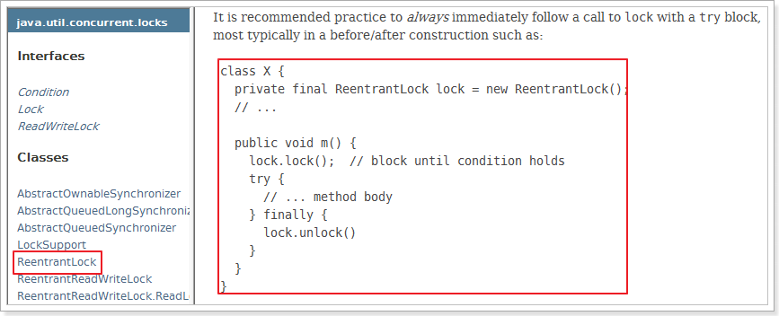
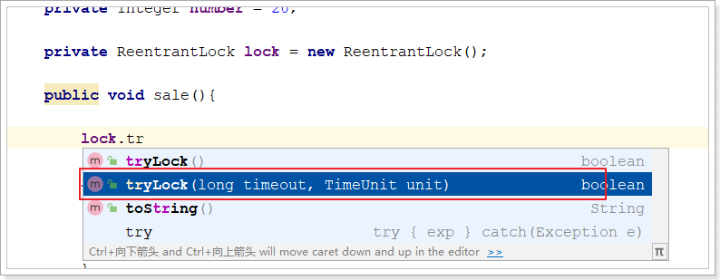
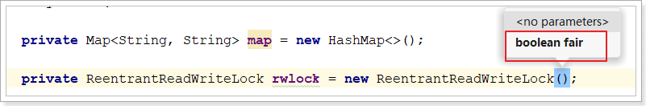
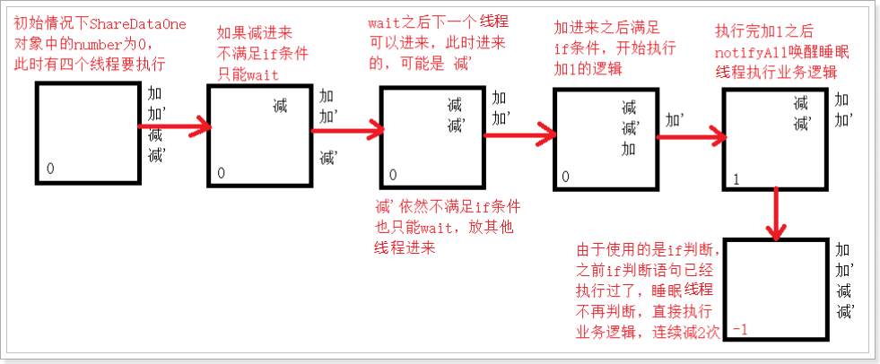
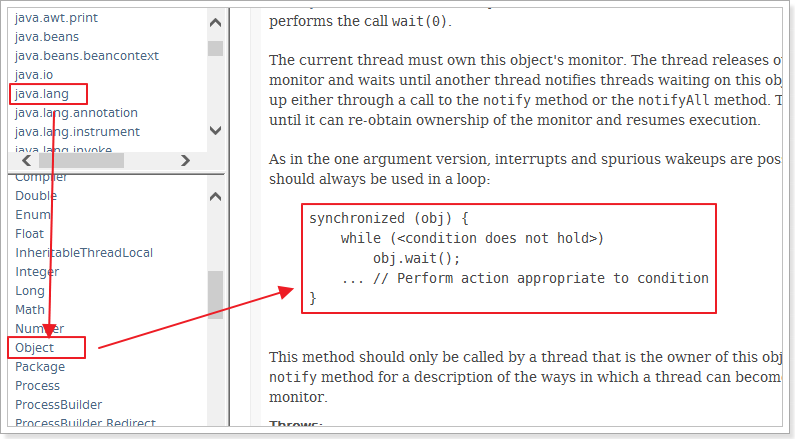
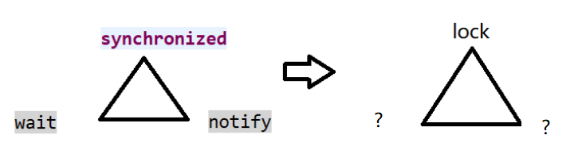
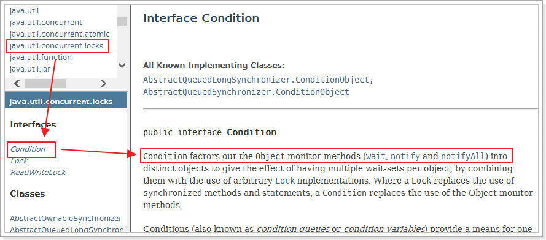
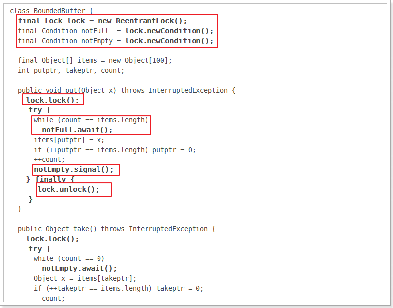
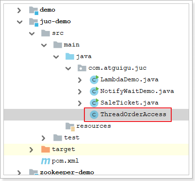

# JUC 并发编程笔记（上）

> 内容涵盖：JUC概述、Lock锁、线程间通信

---

# 1. JUC概述及回顾

## 1.1. JUC是什么？

在 Java 5.0 提供了 `java.util.concurrent`(简称JUC)包，在此包中增加了在并发编程中很常用的工具类。此包包括了几个小的、已标准化的可扩展框架，并提供一些功能实用的类，没有这些类，一些功能会很难实现或实现起来冗长乏味。

参照JDK文档：  https://docs.oracle.com/en/java/javase/17/docs/api/java.base/module-summary.html


## 1.2. 进程和线程

**进程：**进程是一个具有一定独立功能的程序关于某个数据集合的一次运行活动。它是操作系统动态执行的基本单元，在传统的操作系统中，进程既是基本的分配单元，也是基本的执行单元。

**线程：**通常在`一个进程中可以包含一个或若干个线程`。线程可以利用进程所拥有的资源，在引入线程的操作系统中。

通常都是把`进程作为分配资源的基本单位`，而把`线程作为独立运行和独立调度的基本单位`，由于线程比进程更小，基本上不拥有系统资源，故对它的调度所付出的开销就会小得多，能更高效的提高系统多个程序间并发执行的程度。

**生活实例：**

- 大四的时候写论文，用word写论文，同时用QQ音乐放音乐，同时用QQ聊天，这些是多个进程。

- 使用QQ，查看进程一定有一个QQ.exe的进程，我可以用qq和A文字聊天，和B视频聊天，给C传文件，给D发一段语言，QQ支持录入信息的搜索，这些是进程中的线程。
- word如没有保存，停电关机，再通电后打开word可以恢复之前未保存的文档，word也会检查你的拼写，其中包含两个线程：容灾备份，语法检查

## 1.3. 并行和并发

**并发（Concurrency）**：并发指的是多个任务在同一个时间段内交替执行。在并发场景下，多个任务可以同时存在，但实际上每个任务只能以一种交替的方式执行，即任务之间可能会进行快速的切换或分时执行。这种交替执行的方式可以通过操作系统的时间片轮转或线程调度算法来实现。

例如在多线程编程中，可以使用并发来提高应用程序的响应能力和资源利用率。虽然并发可以使得多个任务同时存在，但由于任务之间的切换开销，实际上可能会出现一些等待时间，因此并发并不一定能够加速任务的执行。

`例子：`

- 限量抢购
- 春运抢票
- 电商秒杀

**并行（Parallelism）**：并行指的是多个任务在同一时刻同时执行。在并行场景下，多个任务可以同时进行，每个任务拥有自己的处理单元（例如CPU核心），从而实现真正的并行执行。并行可以通过硬件支持和多线程编程技术来实现。

并行通常用于同时处理大规模的任务集合，可以显著提高任务的执行速度和吞吐量。通过将任务划分为更小的子任务，并分配给不同的处理单元并行执行，可以加快整体任务的完成时间。

 `例子：`

泡方便面，电水壶烧水，一边撕调料倒入桶中

**总结来说，**并发是指多个任务在同一个时间段内交替执行，而并行则是指多个任务在同一时刻同时执行。

## 1.4.同步和异步


同步和异步是两种不同的工作方式，用于处理任务的执行方式：

**同步：**在同步操作中，任务按照顺序依次执行，每个任务必须等待前一个任务完成后才能开始执行。这意味着任务之间是连续的、有序的，一个任务的完成通常会阻塞后续任务的执行，直到它自己完成。

`例子：`想象你在餐馆点餐，每个顾客都必须等待前面的顾客点完餐并完成付款，然后才能点餐。这是一个同步的过程，每个任务（点餐和付款）按顺序执行，一个任务完成后才能开始下一个。

**异步：**在异步操作中，任务可以同时执行，而不需要等待前一个任务完成。任务的执行不按照固定的顺序，可以随时开始和结束，任务之间是相互独立的。

`例子：`想象你使用手机上的社交媒体应用，你可以同时发送消息给多个朋友，而不必等待一个朋友回复后才能给下一个朋友发送消息。这是一个异步的过程，每个任务（发送消息给不同的朋友）可以独立执行，而不会相互阻塞。

总之，同步是按照顺序执行任务，而异步是任务可以同时执行而不受顺序限制。在计算机编程和生活中的许多情况下，都可以看到这两种不同的工作方式。

## 1.5.线程的状态

1. 新建（New）：线程被创建但尚未启动执行。
2. 就绪（Runnable）：线程等待CPU时间片以便执行，也就是处于就绪状态。
3. 阻塞（Blocked）：线程暂停执行，通常是因为等待某些条件满足，例如等待I/O操作完成、等待锁释放等。
4. 无限期等待（Waiting）：线程无限期地等待某个条件的发生，通常需要其他线程来唤醒它。
5. 有限期等待（Timed Waiting）：线程等待一段时间，超过指定时间后会自动唤醒。
6. 终止（Terminated）：线程执行完成或者异常终止，进入终止状态。

Thread类中的源码里可以看到线程的以下状态：

```java
public enum State {
    /**
     * Thread state for a thread which has not yet started.
     */
    NEW, //新建

    /**
     * Thread state for a runnable thread.  A thread in the runnable
     * state is executing in the Java virtual machine but it may
     * be waiting for other resources from the operating system
     * such as processor.
     */
    RUNNABLE, //就绪

    /**
     * Thread state for a thread blocked waiting for a monitor lock.
     * A thread in the blocked state is waiting for a monitor lock
     * to enter a synchronized block/method or
     * reenter a synchronized block/method after calling
     * {@link Object#wait() Object.wait}.
     */
    BLOCKED, //阻塞

    /**
     * Thread state for a waiting thread.
     * A thread is in the waiting state due to calling one of the
     * following methods:
     * <ul>
     *   <li>{@link Object#wait() Object.wait} with no timeout</li>
     *   <li>{@link #join() Thread.join} with no timeout</li>
     *   <li>{@link LockSupport#park() LockSupport.park}</li>
     * </ul>
     *
     * <p>A thread in the waiting state is waiting for another thread to
     * perform a particular action.
     *
     * For example, a thread that has called {@code Object.wait()}
     * on an object is waiting for another thread to call
     * {@code Object.notify()} or {@code Object.notifyAll()} on
     * that object. A thread that has called {@code Thread.join()}
     * is waiting for a specified thread to terminate.
     */
    WAITING, //不见不散

    /**
     * Thread state for a waiting thread with a specified waiting time.
     * A thread is in the timed waiting state due to calling one of
     * the following methods with a specified positive waiting time:
     * <ul>
     *   <li>{@link #sleep Thread.sleep}</li>
     *   <li>{@link Object#wait(long) Object.wait} with timeout</li>
     *   <li>{@link #join(long) Thread.join} with timeout</li>
     *   <li>{@link LockSupport#parkNanos LockSupport.parkNanos}</li>
     *   <li>{@link LockSupport#parkUntil LockSupport.parkUntil}</li>
     * </ul>
     */
    TIMED_WAITING, //过时不候

    /**
     * Thread state for a terminated thread.
     * The thread has completed execution.
     */
    TERMINATED; //终止
}
```

## 1.6 Wait和Sleep

> wait必须在锁环境下使用

## 1.7 创建线程回顾

**创建线程常用的两种方式**：

1. 继承Thread：java是单继承，资源宝贵，要用接口方式
2. 实现Runable接口

**继承Thread抽象类**：

```java
class T1 extends Thread{
    @Override
    public void run() {
        System.out.println("Thread....");
        super.run();
    }
}

public class ThreadDemo {
    public static void main(String[] args) {
        
        T1 t1 = new T1();
        t1.start();
    }
}
```

**实现Runnable接口**的方式：

1. 新建类实现runnable接口：这种方法会新增类，有更好的方法

```java
class T2 implements Runnable{
    @Override
    public void run() {
        System.out.println(Thread.currentThread().getName() +" runnable....");
    }
}

public class ThreadDemo {
    public static void main(String[] args) {
        
        new Thread(new T2(), "线程名").start();
    }
}
```

2. 匿名内部类。

```java
new Thread(new Runnable() {
    @Override
    public void run() {
 		// 调用资源方法，完成业务逻辑
    }
}, "your thread name").start();
```

3、lambda表达式

```java
new Thread(()->{
    // 调用资源方法，完成业务逻辑
}, "your thread name").start();
```

## 1.8 synchronized回顾

> 如何编写企业需要的工程化多线程代码？

**多线程编程模板（上）：**

- 高内聚 低耦合 
- **线程 操作 资源类**

**实现步骤：**

1. 创建资源类
2. 资源类里创建同步方法、同步代码块
3. 多线程调用

**例子：**卖票程序

创建类：SaleTicket.java

```java
package com.atguigu.demojuc.chap01;


//资源类中内聚操作资源的方法，降低线程操作资源的耦合性
class Ticket{

    //  定义一个票数
    private int number = 20;

    //  定义一个卖票的方法: 出现了资源抢占；
    //  synchronized: 使用synchronized同步方法解决
    public synchronized void sale(){

        //  判断
        if (number<=0){
            System.out.println(Thread.currentThread().getName() + "票已售罄！");
            return;
        }

        try {
            System.out.println(Thread.currentThread().getName() + "开始售票，当前票数：" + number);
            Thread.sleep(200);
            System.out.println(Thread.currentThread().getName() + "买票售票，剩余票数：" + --number);

        } catch (InterruptedException e) {
            e.printStackTrace();
        }
    }
}


public class SaleTicket {

    public static void main(String[] args) {
        //  创建资源类对象
        Ticket ticket = new Ticket();

        //  创建线程
        new Thread(()->{
            for (int i = 0; i < 21; i++) {
                ticket.sale();
            }
        },"A").start();

        new Thread(()->{
            for (int i = 0; i < 21; i++) {
                ticket.sale();
            }
        },"B").start();

        new Thread(()->{
            for (int i = 0; i < 21; i++) {
                ticket.sale();
            }
        },"C").start();
    }
}
```

## 1.9 复习：synchronized的8锁问题

> synchronized锁的是什么？类对象、实例对象

看下面这段儿代码，回答多线程的8个问题：

1. 先访问短信，再访问邮件，先打印短信还是邮件
2. 停4秒在短信方法内，先打印短信还是邮件
3. 先访问短信，再访问hello方法，是先打短信还是hello
4. 现在有两部手机，第一部发短信，第二部发邮件，先打印短信还是邮件
5. 两个静态同步方法，1部手机，先打印短信还是邮件
6. 两个静态同步方法，2部手机，先打印短信还是邮件
7. 1个静态同步方法，1个普通同步方法，1部手机，先打印短信还是邮件
8. 1个静态同步方法，1个普通同步方法，2部手机，先打印短信还是邮件

```java
package com.atguigu.juc.chap01;

import java.util.concurrent.TimeUnit;

/**
 * @author: atguigu
 * @create: 2024-03-23 11:20
 */
class Phone {

    /*情况一：start*/
  /*  public synchronized void sendSms() {
        System.out.println(Thread.currentThread().getName()+",sendSms");
    }

    public synchronized void sendEmail() {
        System.out.println(Thread.currentThread().getName()+",sendEmail");
    }*/
    /*情况一：end*/

    /*情况二：start 停4秒在短信方法内，先打印短信还是邮件*/
    //public synchronized void sendSms() {
    //    try {
    //        //Thread.sleep(4000);
    //        TimeUnit.SECONDS.sleep(4);
    //    } catch (InterruptedException e) {
    //        throw new RuntimeException(e);
    //    }
    //    System.out.println(Thread.currentThread().getName()+",sendSms");
    //}
    //
    //public synchronized void sendEmail() {
    //    System.out.println(Thread.currentThread().getName()+",sendEmail");
    //}
    /*情况一：end*/

    /*情况三：先访问短信（普通同步方法+睡眠），再访问hello方法（普通方法），是先打短信还是hello*/
    //public synchronized void sendSms() {
    //    try {
    //        //Thread.sleep(4000);
    //        TimeUnit.SECONDS.sleep(4);
    //    } catch (InterruptedException e) {
    //        throw new RuntimeException(e);
    //    }
    //    System.out.println(Thread.currentThread().getName() + ",sendSms");
    //}
    //
    //public void hello() {
    //    System.out.println(Thread.currentThread().getName() + ",hello");
    //}
    /*情况三：end*/


    /*情况四：start 现在有两部手机，第一部发短信，第二部发邮件，先打印短信还是邮件*/
    //public synchronized void sendSms() {
    //    try {
    //        //Thread.sleep(4000);
    //        TimeUnit.SECONDS.sleep(4);
    //    } catch (InterruptedException e) {
    //        throw new RuntimeException(e);
    //    }
    //    System.out.println(Thread.currentThread().getName() + ",sendSms");
    //}
    //
    //public synchronized void sendEmail() {
    //    System.out.println(Thread.currentThread().getName() + ",sendEmail");
    //}
    /*情况四：end*/

    /*情况五：两个静态同步方法，1部手机，先打印短信还是邮件*/
    //public static synchronized void sendSms() {
    //    try {
    //        //Thread.sleep(4000);
    //        TimeUnit.SECONDS.sleep(4);
    //    } catch (InterruptedException e) {
    //        throw new RuntimeException(e);
    //    }
    //    System.out.println(Thread.currentThread().getName() + ",sendSms");
    //}
    //
    //public static synchronized void sendEmail() {
    //    System.out.println(Thread.currentThread().getName() + ",sendEmail");
    //}
    /*情况五：end*/

    /*情况六：两个静态同步方法，2部手机，先打印短信还是邮件*/
    //public static synchronized void sendSms() {
    //    try {
    //        //Thread.sleep(4000);
    //        TimeUnit.SECONDS.sleep(4);
    //    } catch (InterruptedException e) {
    //        throw new RuntimeException(e);
    //    }
    //    System.out.println(Thread.currentThread().getName() + ",sendSms");
    //}
    //
    //public static synchronized void sendEmail() {
    //    System.out.println(Thread.currentThread().getName() + ",sendEmail");
    //}
    /*情况六：end*/

    /*情况七：1个静态同步方法，一个普通同步方法，1部手机*/
    //public static synchronized void sendSms() {
    //    try {
    //        //Thread.sleep(4000);
    //        TimeUnit.SECONDS.sleep(4);
    //    } catch (InterruptedException e) {
    //        throw new RuntimeException(e);
    //    }
    //    System.out.println(Thread.currentThread().getName() + ",sendSms");
    //}
    //
    //public synchronized void sendEmail() {
    //    System.out.println(Thread.currentThread().getName() + ",sendEmail");
    //}
    /*情况七：end*/


    /*情况8：1个静态同步方法，1个普通同步方法，2部手机，先打印短信还是邮件*/
    public static synchronized void sendSms() {
        try {
            //Thread.sleep(4000);
            TimeUnit.SECONDS.sleep(4);
        } catch (InterruptedException e) {
            throw new RuntimeException(e);
        }
        System.out.println(Thread.currentThread().getName() + ",sendSms");
    }

    public synchronized void sendEmail() {
        System.out.println(Thread.currentThread().getName() + ",sendEmail");
    }
    /*情况8：end*/

}


public class Lock8 {

    public static void main(String[] args) {
        //情况一：先访问短信，再访问邮件  结论：先短信再邮件
        //Phone phone = new Phone();
        //new Thread(()->{
        //    phone.sendSms();
        //}, "A").start();
        //
        //new Thread(()->{
        //    phone.sendEmail();
        //}, "B").start();

        //情况二：停4秒在短信方法内，先打印短信还是邮件  结论：先短信再邮件 原因：跟1一样两个线程使用是同一把锁:锁phone对象
        //Phone phone = new Phone();
        //new Thread(() -> {
        //    phone.sendSms();
        //}, "A").start();
        //
        //new Thread(() -> {
        //    phone.sendEmail();
        //}, "B").start();

        //情况三：先访问短信，再访问hello方法，是先打短信还是hello  结论：先hello,睡眠4秒后再短信 原因：线程一使用phone对象作为锁 线程二没有锁
        //Phone phone = new Phone();
        //new Thread(()->{
        //    //普通同步方法
        //    phone.sendSms();
        //}, "A").start();
        //
        //new Thread(()->{
        //    //普通方法
        //    phone.hello();
        //}, "B").start();


        //情况四：现在有两部手机，第一部发短信，第二部发邮件，先打印短信还是邮件
        //分析：线程A，B分别持有自己锁（phone实例对象） 结论：先邮件 睡眠4秒后 才短信
        //Phone phone1 = new Phone();
        //Phone phone2 = new Phone();
        //
        //new Thread(() -> {
        //    phone1.sendSms();
        //}, "A").start();
        //
        //
        //new Thread(() -> {
        //    phone2.sendEmail();
        //}, "B").start();

        //情况五：两个静态同步方法，1部手机，先打印短信还是邮件
        //分析：静态同步方法，锁变成Class类对象，是一把锁  结果：先睡眠4秒 再发送短信 最后执行发邮件
        //Phone phone = new Phone();
        //new Thread(() -> {
        //    phone.sendSms();
        //}, "A").start();
        //
        //
        //new Thread(() -> {
        //    phone.sendEmail();
        //}, "B").start();

        //情况六：两个静态同步方法，2部手机，先打印短信还是邮件
        //分析：静态同步方法，锁变成Class类对象，是一把锁  结果：先睡眠4秒 再发送短信 最后执行发邮件
        //Phone phone1 = new Phone();
        //Phone phone2 = new Phone();
        //new Thread(() -> {
        //    phone1.sendSms();
        //}, "A").start();
        //
        //
        //new Thread(() -> {
        //    phone2.sendEmail();
        //}, "B").start();

        //情况七：1个静态同步方法，1个普通同步方法，1部手机，先打印短信还是邮件
        //分析：线程A获取到phone实例锁，线程B锁是Phone Class类对象 不是同一把锁 结论：先邮件  睡眠4秒后打印短信
        //Phone phone = new Phone();
        //new Thread(() -> {
        //    phone.sendSms();
        //}, "A").start();
        //
        //
        //new Thread(() -> {
        //    phone.sendEmail();
        //}, "B").start();

        //情况8：1个静态同步方法，1个普通同步方法，2部手机，先打印短信还是邮件
        //分析：线程A锁是Phone类对象，线程B锁是phone2实例对象 不是同一把锁 结果：结论：先邮件  睡眠4秒后打印短信
        Phone phone1 = new Phone();
        Phone phone2 = new Phone();
        new Thread(() -> {
            phone1.sendSms();
        }, "A").start();


        new Thread(() -> {
            phone2.sendEmail();
        }, "B").start();
    }
}
```

```
1. 先访问短信，再访问邮件，先打印短信还是邮件
    先短信再邮件！
    两个方法都是属于同步方法：正常按照顺序执行，本质：cup 资源抢占， 都有锁！同时这个两个方法使用的锁是同一把锁！

2. 停4秒在短信方法内，先打印短信还是邮件
    先短信再邮件！
    原因：短信与邮件使用的是同一把锁 ，那么这个锁是谁？ this

3. 先访问短信，再访问hello方法，是先打短信还是hello
    先hello ，再短信！
    原因：一个有锁，一个没有锁！然后按照顺序执行, 短信中有睡眠,hello 中没有，先执行hello！

4. 现在有两部手机，第一部发短信，第二部发邮件，先打印短信还是邮件
    Phone phone = new Phone();
    Phone phone2 = new Phone();
    先邮件，再短信！
    原因：两个同步方法使用的不是同一把锁：因为对象变了 ，phone ,phone2

5. 两个静态同步方法，1部手机，先打印短信还是邮件
    先短信，再邮件
    因为同一把锁，那么这个锁是谁? Phone.class

    静态方法随着类的加载而加载，此时没有对象！

6. 两个静态同步方法，2部手机，先打印短信还是邮件
    先短信，再邮件：
       Phone phone = new Phone();    Phone phone2 = new Phone();
    原因：同一把锁！    phone and phone2 都是来自于同一个元模板： Phone.class

7. 1个静态同步方法，1个普通同步方法，1部手机，先打印短信还是邮件
    先邮件，再短信
    原因：短信锁，Phone.class  邮件锁，this

8. 1个静态同步方法，1个普通同步方法，2部手机，先打印短信还是邮件
    先邮件，再短信
    原因：短信锁Phone.class  邮件锁this
```

Java中的每一个对象都可以作为锁。具体表现为以下3种形式：

1. 对于普通同步方法，锁是`当前实例对象`。
2. 对于`静态`同步方法，锁是当`前类的Class对象`。
3. 对于同步代码块，锁是Synchonized括号里配置的对象
4. 而静态同步方法（Class对象锁）与非静态同步方法（实例对象锁）之间是不会有竞争的。

# 2. Lock锁

首先看一下JUC的重磅武器——锁（Lock）

相比同步锁，JUC包中的Lock锁的功能更加强大，他是一个接口，提供了各种各样的锁（公平锁，非公平锁，共享锁，独占锁……），所以使用起来很灵活。

**这里主要有三个实现：**ReentrantLock、ReentrantReadWriteLock.ReadLock、ReentrantReadWriteLock.WriteLock

## 2.1. ReentrantLock可重入锁

`ReentrantLock`是可重入的互斥锁，虽然具有与`synchronized`相同功能，但是会比`synchronized`有更多的方法，因此更加灵活。

ReentrantLock使用方式参照官方文档：



使用ReentrantLock改造卖票程序：只需改造Ticket类

**注意：if语句中不要忘记lock.unlock();**

```java
class Ticket{

    private final ReentrantLock lock = new ReentrantLock();

    //  定义一个票数
    private int number = 1;

    //  定义一个卖票的方法:
    public void sale(){

        lock.lock();

        //  判断
        if (number<=0){
            System.out.println(Thread.currentThread().getName() + "票已售罄！");
            lock.unlock();
            System.out.println("return");
            return;
        }

        try {
            System.out.println(Thread.currentThread().getName() + "开始买票，当前票数：" + number);
            Thread.sleep(200);
            System.out.println(Thread.currentThread().getName() + "买票结束，剩余票数：" + --number);

        } catch (InterruptedException e) {
            e.printStackTrace();
        } finally {
            System.out.println("finally");
            lock.unlock();
        }
    }
}
```

### 2.1.1. 测试可重入性

可重入锁又名递归锁，是指在同一个线程中，外层方法获取锁的时候，再进入该线程的内层方法会自动获取锁。Java中ReentrantLock和synchronized都是可重入锁，可重入锁的一个优点是`可一定程度避免死锁`。

**例如下面代码：**

ReentrantLockDemo类中有两个普通同步方法，都需要对象a的锁。`如果是不可重入锁的话`，a方法首先获取到锁，a方法在执行的过程中需要调用b方法，此时锁被a方法占有，b方法无法获取到锁，这样就会导致b方法无法执行，a方法也无法执行，出现了死锁情况。可重入锁可避免这种死锁的发生。

使用synchronized实现可重入锁：

```java
package com.atguigu.demojuc.chap02;

public class ReentrantLockDemo {

    public synchronized void a(){
        this.b();
        System.out.println("a");
    }

    public synchronized void b(){
        System.out.println("b");
    }

    public static void main(String[] args) {
        new ReentrantLockDemo().a();
    }
}
```

使用ReentrantLock实现可重入锁：：

```java
package com.atguigu.demojuc.chap02;

public class ReentrantLockDemo2 {

    private final ReentrantLock lock = new ReentrantLock();

    public void a(){
        lock.lock();
        this.b();
        System.out.println("a");
        lock.unlock();
    }

    public void b(){
        lock.lock();
        System.out.println("b");
        lock.unlock();
    }

    public static void main(String[] args) {
        new ReentrantLockDemo().a();
    }
}
```

在抢票案例中测试：

```java
class Ticket{

    private final ReentrantLock lock = new ReentrantLock();

    //  定义一个票数
    private int number = 1;

    //  定义一个卖票的方法:
    public void sale(){

        lock.lock();

        //  判断
        if (number<=0){
            System.out.println(Thread.currentThread().getName() + "票已售罄！");
            lock.unlock();
            System.out.println("return");
            return;
        }

        try {
            System.out.println(Thread.currentThread().getName() + "开始买票，当前票数：" + number);
            Thread.sleep(200);
            System.out.println(Thread.currentThread().getName() + "买票结束，剩余票数：" + --number);

            // 调用check方法测试锁的可重入性
            check();

        } catch (InterruptedException e) {
            e.printStackTrace();
        } finally {
            System.out.println("finally");
            lock.unlock();
        }
    }

    /**
     * 为了测试可重入锁，添加检查余票方法
     */
    public void check(){
        lock.lock();
        System.out.println("检查余票。。。。");
        lock.unlock();
    }
}
```

可以发现程序可以正常执行，说明该锁确实可重入。

### 2.1.2. 测试公平锁

ReentrantLock还可以实现公平锁。所谓公平锁，也就是在锁上等待时间最长的线程优先获得锁的使用权。通俗的理解就是谁排队时间最长谁先获取锁。（公平锁不允许插队，非公平锁允许插队）

```java
private ReentrantLock lock = new ReentrantLock(true);
```

**测试结果：**可以看到ABC三个线程是按顺序买票成功的。

### 2.1.3. 限时等待

这个是什么意思呢？也就是通过我们的tryLock方法来实现，可以选择传入时间参数，表示等待指定的时间，无参则表示立即返回锁申请的结果：true表示获取锁成功，false表示获取锁失败。我们可以将这种方法用来解决死锁问题。



**一个死锁的例子：**

```java
package com.atguigu.demojuc.chap02;

public class DeadlockDemo {

    private static final Object lock1 = new Object();
    private static final Object lock2 = new Object();

    public static void main(String[] args) {

        new Thread(() -> {
            synchronized (lock1) {
                System.out.println("Thread 1: Holding lock 1...");
                try {
                    Thread.sleep(500); // Simulate some work
                } catch (InterruptedException e) {
                    e.printStackTrace();
                }
                System.out.println("Thread 1: Waiting for lock 2...");
                synchronized (lock2) {
                    System.out.println("Thread 1: Both locks acquired.");
                }
            }
        }).start();

        new Thread(() -> {
            synchronized (lock2) {
                System.out.println("Thread 2: Holding lock 2...");
                try {
                    Thread.sleep(500); // Simulate some work
                } catch (InterruptedException e) {
                    e.printStackTrace();
                }
                System.out.println("Thread 2: Waiting for lock 1...");
                synchronized (lock1) {
                    System.out.println("Thread 2: Both locks acquired.");
                }
            }
        }).start();

    }
}
```

**使用ReentrantLock解决死锁问题：**

```java
package com.atguigu.demojuc.chap02;

import java.util.concurrent.locks.ReentrantLock;

public class DeadlockDemo2 {

    private static ReentrantLock lock1 = new ReentrantLock();
    private static ReentrantLock lock2 = new ReentrantLock();

    public static void main(String[] args) {

        new Thread(() -> {

            boolean result1 = lock1.tryLock();
            if (result1){
                try {
                    System.out.println("Thread 1: Holding lock 1...");
                    try {
                        Thread.sleep(500); // Simulate some work
                    } catch (InterruptedException e) {
                        e.printStackTrace();
                    }

                    System.out.println("Thread 1: Waiting for lock 2...");

                    boolean result2 = lock2.tryLock();
                    if(result2){
                        try {
                            System.out.println("Thread 1: Both locks acquired.");
                        } finally {
                            lock2.unlock();
                        }
                    }else {
                        System.out.println("Thread 1: 未获取到锁2");
                    }

                }finally {
                    lock1.unlock();
                }
            }else{
                System.out.println("Thread 1: 未获取到锁1");
            }


        }).start();

        new Thread(() -> {

            boolean result2 = lock2.tryLock();

            if(result2){
                try {

                    System.out.println("Thread 2: Holding lock 2...");
                    try {
                        Thread.sleep(500); // Simulate some work
                    } catch (InterruptedException e) {
                        e.printStackTrace();
                    }
                    System.out.println("Thread 2: Waiting for lock 1...");


                    boolean result1 = lock1.tryLock();
                    if(result1){
                        try {
                            System.out.println("Thread 2: Both locks acquired.");
                        } finally {
                            lock1.unlock();
                        }
                    }else {
                        System.out.println("Thread 2: 未获取到锁1");
                    }
                }finally {
                    lock2.unlock();
                }
            }else{
                System.out.println("Thread 2: 未获取到锁2");
            }

        }).start();

    }
}
```

### 2.1.4. ReentrantLock和synchronized区别

（1）`synchronized`是`独占锁`，加锁和解锁的过程`自动进行`，易于操作，但不够灵活。`ReentrantLock`也是`独占锁`，加锁和解锁的过程需要`手动进行`，不易操作，但非常灵活。

（2）synchronized`可重入`，因为加锁和解锁自动进行，不必担心最后是否释放锁；ReentrantLock也`可重入`，但加锁和解锁需要手动进行，且次数需一样，否则其他线程无法获得锁。

（3）synchronized不可响应中断，一个线程获取不到锁就一直等着；`ReentrantLock可以响应中断`（tryLock方法：获取不到锁则返回false）。

（4）synchronized不具备设置公平锁的特点，`ReentrantLock可以成为公平锁`。

## 2.2. ReentrantReadWriteLock读写锁

在并发场景中用于解决线程安全的问题，我们几乎会高频率的使用到`独占式锁`，通常使用java提供的关键字synchronized或者concurrents包中实现了Lock接口的ReentrantLock。它们都是独占式获取锁，也就是在同一时刻只有一个线程获取锁。而在一些业务场景中，`大部分只是读数据，写数据很少`，如果仅仅是读数据的话并不会影响数据正确性，而如果在这种业务场景下，依然使用独占锁的话，很显然这将是出现性能瓶颈的地方。针对这种读多写少的情况，java还提供了另外一个实现Lock接口的`ReentrantReadWriteLock`(读写锁)。`读写锁允许同一时刻被多个读线程访问，但是在写线程访问时，所有的读线程和其他的写线程都会被阻塞。`

**读写锁的特点：**

1. 写写不可并发
2. 读写不可并发/写读不可并发
3. 读读可以并发

### 2.2.1. 读写问题

接下来以缓存为例用代演示读写锁，重现问题：

```java
package com.atguigu.demojuc.chap02;

class MyCache{

    private Map<String, String> cache= new HashMap<>();
    
    //写
    public void put(String key, String value){
        try {
            System.out.println(Thread.currentThread().getName() + " 开始写入！");
            Thread.sleep(300);
            cache.put(key, value);
            System.out.println(Thread.currentThread().getName() + " 写入成功！");
        } catch (InterruptedException e) {
            e.printStackTrace();
        }
    }

    //读
    public void get(String key){
        try {
            System.out.println(Thread.currentThread().getName() + " 开始读出！");
            Thread.sleep(300);
            String value = cache.get(key);
            System.out.println(Thread.currentThread().getName() + " 读出成功！" + value);
        } catch (InterruptedException e) {
            e.printStackTrace();
        }
    }
}

public class ReentrantReadWriteLockDemo {

    public static void main(String[] args) {

        MyCache cache = new MyCache();

        for (int i = 1; i <= 5; i++) {
            String num = String.valueOf(i);
            // 开启5个写线程
            new Thread(()->{
                cache.put(num, num);
            }, num).start();
        }

        for (int i = 1; i <= 5; i++) {
            String num = String.valueOf(i);
            // 开启5个读线程
            new Thread(()->{
                cache.get(num);
            }, num).start();
        }
    }
}
```

**打印结果：发现写操作不具有原子性**

### 2.2.2. 读写锁的使用

改造MyCache，加入读写锁：

```java
class MyCache{

    // 加入读写锁
    public final ReentrantReadWriteLock readWriteLock = new ReentrantReadWriteLock();

    private Map<String, String> cache= new HashMap<>();

    public void put(String key, String value){

        // 加写锁
        readWriteLock.writeLock().lock();

        try {
            System.out.println(Thread.currentThread().getName() + " 开始写入！");
            Thread.sleep(300);
            cache.put(key, value);
            System.out.println(Thread.currentThread().getName() + " 写入成功！");
        } catch (InterruptedException e) {
            e.printStackTrace();
        } finally {
            // 释放写锁
            readWriteLock.writeLock().unlock();
        }
    }

    public void get(String key){

        // 加入读锁
        readWriteLock.readLock().lock();

        try {
            System.out.println(Thread.currentThread().getName() + " 开始读出！");
            Thread.sleep(300);
            String value = cache.get(key);
            System.out.println(Thread.currentThread().getName() + " 读出成功！" + value);
        } catch (InterruptedException e) {
            e.printStackTrace();
        }finally {
            // 释放读锁
            readWriteLock.readLock().unlock();
        }
    }
}
```

**结论：读写锁保证了写操作的原子性，并且可以进行并发读**

### 2.2.3. 锁降级

这里可以举个例子：`在当前线程拥有写锁的情况下，获取到读锁，随后释放写锁的过程就是锁降级`。

```java
public void test(){
    rwlock.writeLock().lock();
    System.out.println("获取到写锁。。。。");
    //写数据
    
    rwlock.readLock().lock();

    System.out.println("获取到读锁----------");
    rwlock.writeLock().unlock();
    
    //读数据
    //可以插入其他的读线程（因为读读可并发），从而提高应用程序的执行效率
    
    System.out.println("释放写锁==============");
    rwlock.readLock().unlock();
    System.out.println("释放读锁++++++++++++++++");
}


//错误的锁降级示例，因为在释放写锁和获取读锁之间能够有其他的写线程插入，从而影响数据的一致性
public void test(){
    rwlock.writeLock().lock();
    System.out.println("获取到写锁。。。。");
   
    System.out.println("释放写锁==============");
    rwlock.writeLock().unlock();
    
    //可能插入其他写线程
    
    System.out.println("获取到读锁----------");
     rwlock.readLock().lock();
    
    rwlock.readLock().unlock();
    System.out.println("释放读锁++++++++++++++++");
}
```

锁降级是一种多线程编程中的一种锁策略，它指的是在持有某个锁的同时，降低该锁的粒度，也就是将一个较大粒度的锁替换为一个较小粒度的锁。这通常是为了减少锁的竞争，提高程序的并发性能。

锁降级的典型场景是在持有某个写锁时，释放写锁并获取读锁。这样做的好处是在执行读操作期间，其他线程可以同时执行读操作，提高了并发性能。

在这个例子中，我们首先创建了一个`LockDowngradingDemo`对象，并启动了一个写线程（writerThread）和一个读线程（readerThread）。写线程首先获取写锁，更新数据，然后将锁降级为读锁。读线程在获取读锁后读取数据。这个过程演示了锁降级的概念，允许多个线程在持有读锁的情况下同时访问数据，提高了并发性能。`请注意，在锁降级期间，我们要确保数据的一致性，即在降级为读锁之前和之后都可以正确读取数据。这是锁降级的关键部分。（先获取读锁，再释放写锁）`

```java
package com.atguigu.demojuc.chap02;

public class LockDowngradingDemo {

    private final ReentrantReadWriteLock rwLock = new ReentrantReadWriteLock();
    private final Lock readLock = rwLock.readLock();
    private final Lock writeLock = rwLock.writeLock();
    private int data = 0;

    public int readData() {
        readLock.lock();
        try {
            return data;
        } finally {
            readLock.unlock();
        }
    }

    public void updateData(int newData) {
        writeLock.lock();
        try {
            data = newData; // 更新数据
            System.out.println("Data updated to: " + newData);

            // 锁降级
            readLock.lock(); // 获取读锁
            System.out.println("Lock downgraded to read lock.");
        } finally {
            writeLock.unlock(); // 释放写锁
        }

        try {
            // 在持有读锁的情况下执行其他操作
            int currentData = readData();
            System.out.println("Read data: " + currentData);
        } finally {
            readLock.unlock(); // 释放读锁
        }
    }

    /**
     * @param args
     */
    public static void main(String[] args) {

        LockDowngradingDemo example = new LockDowngradingDemo();

        new Thread(() -> {
            example.updateData(42);
        }).start();

        new Thread(() -> {
            int currentData = example.readData();
            System.out.println("Reader got data: " + currentData);
        }).start();
    }
}
```

### 2.2.4. 读写锁总结

1. 支持公平/非公平策略

   

2. 支持可重入

   - 同一读线程在获取了读锁后还可以获取读锁
   - 同一写线程在获取了写锁之后既可以再次获取写锁又可以获取读锁
   - 同一读线程在获取了读锁后**不可以**获取写锁

3. 支持锁降级，不支持锁升级

4. 读写锁如果使用不当，很容易产生“饥饿”问题：

   在读线程非常多，写线程很少的情况下，很容易导致写线程“饥饿”，虽然使用“公平”策略可以一定程度上缓解这个问题，但是“公平”策略是以牺牲系统吞吐量为代价的。

> 锁饥饿（Lock Starvation）是指在多线程编程中的一种情况，其中某些线程可能无法获得所需的锁，而一直等待下去，从而无法继续执行，即线程被"饿死"在等待锁的过程中。这可能会导致应用程序的性能问题和不稳定性。

# 3. 线程间通信

**面试题：**两个线程，一个线程打印1-52，另一个打印字母A-Z，打印顺序为12A34B...5152Z，要求用线程间通信

## 3.1. 回顾线程通信

**简单案例：**

两个线程操作一个初始值为0的变量，实现一个线程对变量增加1，一个线程对变量减少1，交替10轮。

**线程间通信模型：**

1. 生产者+消费者
2. 通知等待唤醒机制

**多线程编程模板（中）：**

1. 判断

2. 干活
3. 通知

代码实现：

```java
package com.atguigu.demojuc.chap03;

class ShareDataOne{
    private Integer number = 0;

    /**
     *  增加1
     */
    public synchronized void increment() throws InterruptedException {
        // 1. 判断
        if (number != 0) {
            this.wait();
        }

        // 2. 干活
        number++;
        System.out.println(Thread.currentThread().getName() + ": " + number);

        // 3. 通知
        this.notifyAll();
    }

    /**
     * 减少1
     */
    public synchronized void decrement() throws InterruptedException {
        // 1. 判断
        if (number != 1) {
            this.wait();
        }

        // 2. 干活
        number--;
        System.out.println(Thread.currentThread().getName() + ": " + number);

        // 3. 通知
        this.notifyAll();
    }
}

/**
 * 现在两个线程，
 * 可以操作初始值为零的一个变量，
 * 实现一个线程对该变量加1，一个线程对该变量减1，
 * 交替，10轮。
 *
 * 笔记：Java里面如何进行工程级别的多线程编写
 * 1 多线程编程模板（套路）
 *    1.1  线程    操作    资源类
 *    1.2  高内聚  低耦合
 * 2 多线程编程模板（套路）
 *    2.1  判断
 *    2.2  干活
 *    2.3  通知
 */
public class NotifyWaitDemo {

    public static void main(String[] args) {
        ShareDataOne shareDataOne = new ShareDataOne();

        new Thread(()->{
            for (int i = 0; i < 10; i++) {
                try {
                    shareDataOne.increment();
                } catch (InterruptedException e) {
                    e.printStackTrace();
                }
            }
        }, "AAA").start();

        new Thread(()->{
            for (int i = 0; i < 10; i++) {
                try {
                    shareDataOne.decrement();
                } catch (InterruptedException e) {
                    e.printStackTrace();
                }
            }
        }, "BBB").start();

    }
}
```

部分打印结果：AAA和BBB交互执行，执行结果是1 0 1 0... 一共10轮

```
AAA: 1
BBB: 0
AAA: 1
BBB: 0
AAA: 1
BBB: 0
AAA: 1
BBB: 0
。。。。
```

**如果换成4个线程会怎样？**

改造mian方法，**加入CCC和DDD两个线程：为了方便测试出效果，将循环次数改成100**

```java
public class NotifyWaitDemo {

    public static void main(String[] args) {
        ShareDataOne shareDataOne = new ShareDataOne();

        new Thread(()->{
            for (int i = 0; i < 100; i++) {
                try {
                    shareDataOne.increment();//+1
                } catch (InterruptedException e) {
                    e.printStackTrace();
                }
            }
        }, "AAA").start();

        new Thread(()->{
            for (int i = 0; i < 100; i++) {
                try {
                    shareDataOne.decrement();//-1
                } catch (InterruptedException e) {
                    e.printStackTrace();
                }
            }
        }, "BBB").start();

        new Thread(()->{
            for (int i = 0; i < 100; i++) {
                try {
                    shareDataOne.increment();//+1
                } catch (InterruptedException e) {
                    e.printStackTrace();
                }
            }
        }, "CCC").start();

        new Thread(()->{
            for (int i = 0; i < 100; i++) {
                try {
                    shareDataOne.decrement();//-1
                } catch (InterruptedException e) {
                    e.printStackTrace();
                }
            }
        }, "DDD").start();

    }
}
```

打印结果，依然会有概率是，10101010...。

但是，多执行几次，也会出现错乱的现象：

```
AAA: 1
BBB: 0
CCC: 1
AAA: 2
CCC: 3
BBB: 2
CCC: 3
DDD: 2
AAA: 3
DDD: 2
CCC: 3
BBB: 2
```

## 3.2. 虚假唤醒

换成4个线程会导致错误，**虚假唤醒**

**原因：**在java多线程判断时，不能用if，程序出事出在了判断上面。

**注意：**消费者被唤醒后是从wait()方法（被阻塞的地方）后面执行，而不是重新从同步块开头。

如下图： 出现-1的情况分析！



解决虚假唤醒：查看API，java.lang.Object的wait方法



中断和虚假唤醒是可能产生的，所以要用循环，if只判断一次，while是只要唤醒就要重新再判断一次。

**多线程编程模板（下）：**

 * 防止虚假唤醒（使用while，代替if）

```java
// 1. 判断
while (number != 0) {
    this.wait();
}

// 1. 判断
while (number != 1) {
    this.wait();
}
```

再次测试，完美解决

## 3.3. 线程通信（Condition）

对标synchronized：



Condition：查看API，java.util.concurrent.locks



并提供了实现案例：



使用Condition实现线程通信，改造之前的代码：

**只需要改造ShareDataOne：注意要删掉increment和decrement方法的synchronized**

```java
class ShareDataOne{
    private Integer number = 0;

    final Lock lock = new ReentrantLock(); // 初始化lock锁
    final Condition condition = lock.newCondition(); // 初始化condition对象

    /**
     *  增加1
     */
    public void increment() throws InterruptedException {

        lock.lock(); // 加锁

        try{
            // 1. 判断
            while (number != 0) {
                // this.wait();
                condition.await();
            }

            // 2. 干活
            number++;
            System.out.println(Thread.currentThread().getName() + ": " + number);

            // 3. 通知
            // this.notifyAll();
            condition.signalAll(); //唤醒所有等待的线程
        } catch (InterruptedException e) {
            e.printStackTrace();
        } finally {
            lock.unlock();
        }
    }

    /**
     * 减少1
     */
    public void decrement() throws InterruptedException {

        lock.lock(); // 加锁

        try{

            // 1. 判断
            while (number != 1) {
                // this.wait();
                condition.await();
            }

            // 2. 干活
            number--;
            System.out.println(Thread.currentThread().getName() + ": " + number);

            // 3. 通知
            // this.notifyAll();
            condition.signalAll(); //唤醒所有等待的线程
        } catch (InterruptedException e) {
            e.printStackTrace();
        } finally {
            lock.unlock();
        }
    }
}
```

```java
condition.signal(); // 唤醒一个等待的线程    
condition.signalAll();  //唤醒所有等待的线程
```

## 3.4. 定制化调用通信

**案例**：

​		多线程之间按顺序调用，实现AA->BB->CC。三个线程启动，要求如下：

​		AA打印5次，BB打印10次，CC打印15次

​		接着

​		AA打印5次，BB打印10次，CC打印15次

​		。。。打印10轮

分析实现方式：

1. 有一个锁Lock，3把钥匙Condition
2. 有顺序通知（切换线程），需要有标识位
3. 判断标志位
4. 输出线程名 + 内容
5. 修改标识符，通知下一个

具体实现：

 

内容：

```java
package com.atguigu.juc.chap03;

import java.util.concurrent.locks.Condition;
import java.util.concurrent.locks.Lock;
import java.util.concurrent.locks.ReentrantLock;

public class ThreadOrderAccess {

    //声明全局锁对象
    private static Lock lock = new ReentrantLock();

    //为A,B,C线程声明Condition对象负责不同线程等待，唤醒
    private static Condition conditionA = lock.newCondition();
    private static Condition conditionB = lock.newCondition();
    private static Condition conditionC = lock.newCondition();


    //声明全局flag标识，作为线程阻塞，执行条件
    private static int flag = 1;


    /**
     * A线程负责调用打印5次方法
     */
    public void print5() {
        //1.先获取锁
        lock.lock();

        try {
            //2.判断A线程等待条件（不等于1将当前线程进入等待状态）
            while (flag != 1) {
                conditionA.await();
            }

            //3.干活（flag=1则打印5次执行）
            for (int i = 1; i <= 5; i++) {
                System.out.println(Thread.currentThread().getName() + "," + i);
            }

            //4.将flag标识修改为2，唤醒B线程干活
            flag = 2;
            conditionB.signalAll();
        } catch (InterruptedException e) {
            throw new RuntimeException(e);
        } finally {
            //5.将锁释放
            lock.unlock();
        }
    }


    /**
     * B线程负责调用打印10次方法
     */
    public void print10() {
        //1.先获取锁
        lock.lock();

        try {
            //2.判断B线程等待条件（不等于2将当前线程进入等待状态）
            while (flag != 2) {
                conditionB.await();
            }

            //3.干活（flag=2则打印10次执行）
            for (int i = 1; i <= 10; i++) {
                System.out.println(Thread.currentThread().getName() + "," + i);
            }

            //4.将flag标识修改为3，唤醒C线程干活
            flag = 3;
            conditionC.signalAll();
        } catch (InterruptedException e) {
            throw new RuntimeException(e);
        } finally {
            //5.将锁释放
            lock.unlock();
        }
    }

    /**
     * C线程负责调用打印15次方法
     */
    public void print15() {
        //1.先获取锁
        lock.lock();

        try {
            //2.判断C线程等待条件（不等于3将当前线程进入等待状态）
            while (flag != 3) {
                conditionC.await();
            }

            //3.干活（flag=3则打印15次执行）
            for (int i = 1; i <= 15; i++) {
                System.out.println(Thread.currentThread().getName() + "," + i);
            }

            //4.将flag标识修改为1，唤醒A线程干活
            flag = 1;
            conditionA.signalAll();
        } catch (InterruptedException e) {
            throw new RuntimeException(e);
        } finally {
            //5.将锁释放
            lock.unlock();
        }
    }

    public static void main(String[] args) {
        //2.创建资源类对象
        ThreadOrderAccess orderAccess = new ThreadOrderAccess();
        //1.创建三个线程A,B,C
        new Thread(()->{
            for (int i = 0; i < 10; i++) {
                orderAccess.print5();
            }
        }, "A").start();


        new Thread(()->{
            for (int i = 0; i < 10; i++) {
                orderAccess.print10();
            }
        }, "B").start();

        new Thread(()->{
            for (int i = 0; i < 10; i++) {
                orderAccess.print15();
            }
        }, "C").start();
    }
}
```

在Java中，一个`ReentrantLock`可以与多个`Condition`对象一起使用，每个`Condition`对象可以用于不同的线程协调和通信场景，以便更精细地控制多线程之间的执行顺序和互斥访问。
