# JUC 并发编程笔记（中）

> 内容涵盖：并发容器类、JUC辅助类、Callable接口、阻塞队列、ThreadPool线程池

---

# 4. 并发容器类

**面试题：**请举例说明集合类是不安全的。

## 4.1. 重现线程不安全：List

首先以List作为演示对象，创建多个线程，对List接口的常用实现类ArrayList进行add操作。

```java
package com.atguigu.demojuc.chap04;

public class NotSafeDemo {

    public static void main(String[] args) {
        //1.声明List集合对象
        List<String> list = new ArrayList<>();

        //2.开启多线程对list集合进行读写操作
        for (int i = 0; i < 100; i++) {
            new Thread(() -> {
                //2.1 将随机字符串加入集合
                list.add(UUID.randomUUID().toString());
                //2.2 将集合中进行输出打印 调用对象.toString方法
                System.out.println(list);
            }).start();
        }
    }
}
```

测试结果：**出现了线程不安全错误**

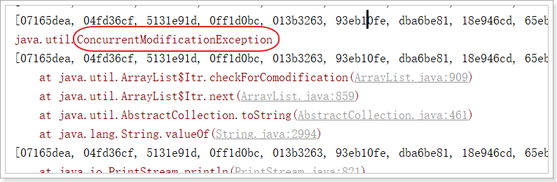

ArrayList在多个线程同时对其进行修改的时候，就会抛出`java.util.ConcurrentModificationException异常（并发修改异常）`，因为ArrayList的add及其他方法都是线程不安全的，有源码佐证：

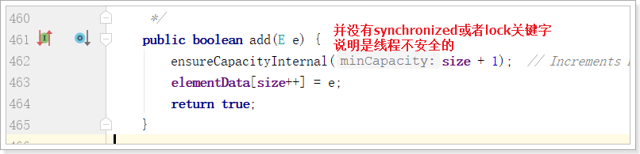

**解决方案：**

List接口有很多实现类，除了常用的ArrayList之外，还有Vector和SynchronizedList。

 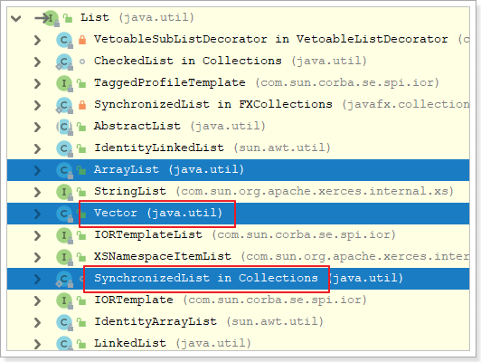

他们都有synchronized关键字，说明都是线程安全的。

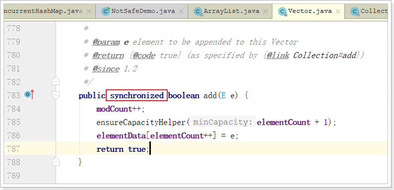

改用Vector或者synchronizedList试试：

```java
    public static void main(String[] args) {

        //List<String> list = new Vector<>();
        List<String> list = Collections.synchronizedList(new ArrayList<>());

        for (int i = 0; i < 200; i++) {
            new Thread(()->{
                list.add(UUID.randomUUID().toString().substring(0, 8));
                System.out.println(list);
            }, String.valueOf(i)).start();
        }
    }
```

即可解决！

**Vector和Synchronized的缺点：**

- Vector：内存消耗比较大，适合一次增量比较大的情况（Vector每次扩容是原来容量的一倍，ArrayList是原来的1.5倍）
- SynchronizedList：迭代器涉及的代码没有加上线程同步代码

```java
//Vector：读取加锁！
public synchronized ListIterator<E> listIterator() {
	return new ListItr(0);
}
//synchronizedList： 读取数据：读取数据没有加锁！
public ListIterator<E> listIterator() {
	return list.listIterator(); // Must be manually synched by user
}
```

## 4.2. CopyOnWrite容器

什么是CopyOnWrite容器

**CopyOnWrite容器**（简称COW容器）即**写时复制**的容器。通俗的理解是当我们往一个容器添加元素的时候，不直接往当前容器添加，而是先将当前容器进行Copy，复制出一个新的容器，然后新的容器里添加元素，添加完元素之后，再将原容器的引用指向新的容器。这样做的好处是我们可以对CopyOnWrite容器进行并发的读，而不需要加锁，因为当前容器不会添加任何元素。所以`CopyOnWrite容器也是一种读写分离的思想，读和写不同的容器`。

从JDK1.5开始Java并发包里提供了两个使用CopyOnWrite机制实现的并发容器,它们是`CopyOnWriteArrayList`和`CopyOnWriteArraySet`。

先看看CopyOnWriteArrayList类：发现它的本质就是数组

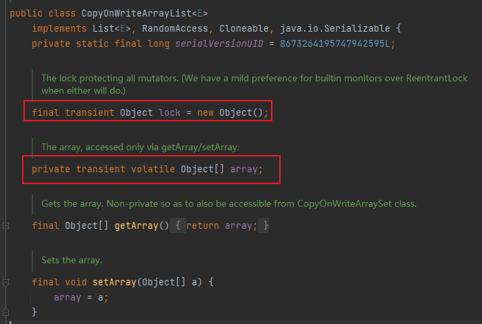

再来看看CopyOnWriteArrayList的add方法：发现该方法是线程安全的

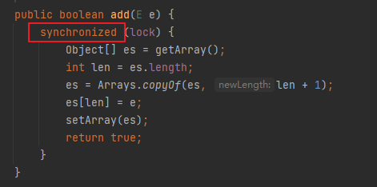

使用CopyOnWriteArrayList改造main方法：

```java
    public static void main(String[] args) {

        //List<String> list = new Vector<>();
        //List<String> list = Collections.synchronizedList(new ArrayList<>());
        List<String> list = new CopyOnWriteArrayList<>();

        for (int i = 0; i < 200; i++) {
            new Thread(()->{
                list.add(UUID.randomUUID().toString().substring(0, 8));
                System.out.println(list);
            }, String.valueOf(i)).start();
        }
    }
```

`CopyOnWrite并发容器用于读多写少的并发场景`。比如：白名单，黑名单。假如我们有一个搜索网站，用户在这个网站的搜索框中，输入关键字搜索内容，但是某些关键字不允许被搜索。这些不能被搜索的关键字会被放在一个黑名单当中，黑名单一定周期才会更新一次。

**缺点：**

1. 内存占用问题。写的时候会创建新对象添加到新容器里，而旧容器的对象还在使用，所以有两份对象内存。
2. 数据一致性问题。CopyOnWrite容器只能保证数据的最终一致性，不能保证数据的实时一致性。所以如果你希望写入的数据，马上能读到，请不要使用CopyOnWrite容器。

## 4.3. 扩展类比：Set和Map

HashSet和HashMap也都是线程不安全的，类似于ArrayList，也可以通过代码证明。

```java

private static void notSafeSet() {
    Set<String> set = new HashSet<>();

    for (int i = 0; i < 30; i++) {
        new Thread(()->{
            set.add(UUID.randomUUID().toString().substring(0, 8));
            System.out.println(set);
        }, String.valueOf(i)).start();
    }
}

private static void notSafeMap() {
    Map<String, String> map = new HashMap<>();

    for (int i = 0; i < 30; i++) {
        new Thread(()->{
            map.put(String.valueOf(Thread.currentThread().getName()), UUID.randomUUID().toString().substring(0, 8));
            System.out.println(map);
        }, String.valueOf(i)).start();
    }
}
```

都会报：ConcurrentModificationException异常信息。

Collections提供了方法synchronizedList保证list是同步线程安全的，Set和Map呢？

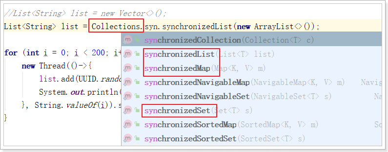

JUC提供的CopyOnWrite容器实现类有：CopyOnWriteArrayList和CopyOnWriteArraySet。

## 4.4、ConcurrentHashMap

有没有Map的实现：

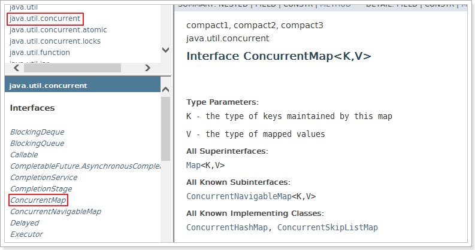

**ConcurrentHashMap的特点：**

1. **并发性**：`ConcurrentHashMap` 允许多个线程同时访问，读操作不会被阻塞，不需要加锁。这意味着多个线程可以并发地读取其中的数据，而不会发生竞争或锁定。
2. **分段锁**：`ConcurrentHashMap` ConcurrentHashMap是线程安全的Map容器，JDK8之前，ConcurrentHashMap使用锁分段技术，将数据分成一段段存储，每个数据段配置一把锁，即segment类，这个类继承ReentrantLock来保证线程安全，JKD8的版本取消Segment这个分段锁数据结构，底层也是使用Node数组+链表+红黑树，从而实现对每一段数据就行加锁，也减少了并发冲突的概率。这种设计允许多个线程同时进行读操作，只有在写操作时才需要锁定相应的段，以确保线程安全。这提高了并发性能，因为不同段之间的操作不会相互阻塞。

总之，`ConcurrentHashMap` 是一个用于高并发环境的非常有用的数据结构，它提供了高效的并发访问支持，允许多个线程同时读取和写入数据，而不需要显式的锁定。这使得它在并发编程中非常有价值，特别是在需要高效地处理共享数据的情况下。

**最终实现：**

```java
package com.atguigu.demojuc.chap04;

public class NotSafeDemo {

    public static void main(String[] args) {
        notSafeList();
        notSafeSet();
        notSafeMap();
    }

    private static void notSafeMap() {
        //Map<String, String> map = new HashMap<>();
        //Map<String, String> map = Collections.synchronizedMap(new HashMap<>());
        Map<String, String> map = new ConcurrentHashMap<>();//加入了分段锁

        for (int i = 0; i < 100; i++) {
            new Thread(()->{
                map.put(String.valueOf(Thread.currentThread().getName()), UUID.randomUUID().toString().substring(0, 8));
                System.out.println(map);
            }, String.valueOf(i)).start();
        }
    }

    private static void notSafeSet() {
        //Set<String> set = new HashSet<>();
        //Set<String> set = Collections.synchronizedSet(new HashSet<>());
        Set<String> set = new CopyOnWriteArraySet<>();

        for (int i = 0; i < 100; i++) {
            new Thread(()->{
                set.add(UUID.randomUUID().toString().substring(0, 8));
                System.out.println(set);
            }, String.valueOf(i)).start();
        }
    }

    private static void notSafeList() {
        //List<String> list = new ArrayList<>();
        //List<String> list = new Vector<>();
        //List<String> list = Collections.synchronizedList(new ArrayList<>());
        List<String> list = new CopyOnWriteArrayList<>();

        for (int i = 0; i < 100; i++) {
            new Thread(()->{
                list.add(UUID.randomUUID().toString().substring(0, 8));
                System.out.println(list);
            }, String.valueOf(i)).start();
        }
    }
}
```

## 4.5. 案例相关代码

```java
package com.atguigu.juc.chap04;

import java.util.*;
import java.util.concurrent.ConcurrentHashMap;
import java.util.concurrent.CopyOnWriteArrayList;
import java.util.concurrent.CopyOnWriteArraySet;

public class UnSafeCollection {

    public static void main(String[] args) {
        //unsafeList();
        //unsafeMap();
        //1.创建Set集合-HashSet 确保元素不重复,实现天然去重
        //Set<String> set = new HashSet<>();
        //Set<String> set = Collections.synchronizedSet(new HashSet<>());
        Set<String> set = new CopyOnWriteArraySet<>();
        //2.循环产生多线程并发对Set集合进行读写操作
        for (int i = 0; i < 100; i++) {
            new Thread(() -> {
                set.add(UUID.randomUUID().toString().substring(0, 8));
                System.out.println(set);
            }).start();
        }
    }

    private static void unsafeMap() {
        //1.创建Map集合-HashMap
        //Map<String, String> map = new HashMap<>();
        //1.1 使用HashTable线程安全集合类
        //Map<String, String> map = new Hashtable<>();
        //1.2 通过集合工具类产生线程安全集合
        //Map<String, String> map = Collections.synchronizedMap(new HashMap<>());
        //1.3 使用ConcurrentHashMap线程安全集合类
        Map<String, String> map = new ConcurrentHashMap<>();
        //2.循环产生多线程并发对Map集合进行读写操作
        for (int i = 0; i < 30; i++) {
            int finalI = i;
            new Thread(() -> {
                //2.1 新增元素
                map.put(finalI + "", UUID.randomUUID().toString());
                //2.2 打印集合元素
                System.out.println(map);
            }).start();
        }
    }


    /**
     * 测试List集合线程安全
     */
    private static void unsafeList() {
        //1.声明List集合对象
        //List<String> list = new ArrayList<>();
        //1.1 提供线程安全List集合
        //List<String> list = new Vector<>();
        //1.2 通过集合工具类产生线程安全集合  Map,Set都提供线程安全类
        //List<String> list = Collections.synchronizedList(new ArrayList<>());
        //1.3 通过写时复制容器创建线程安全集合
        List<String> list = new CopyOnWriteArrayList<>();
        //2.开启多线程对list集合进行读写操作
        for (int i = 0; i < 100; i++) {
            new Thread(() -> {
                //2.1 将随机字符串加入集合
                list.add(UUID.randomUUID().toString());
                //2.2 将集合中进行输出打印 调用对象.toString方法
                System.out.println(list);
            }).start();
        }
    }
}
```

# 5. JUC强大的辅助类

JUC的多线程辅助类非常多，这里我们介绍三个：

1. CountDownLatch（倒计数器）
2. CyclicBarrier（循环栅栏）
3. Semaphore（信号量）

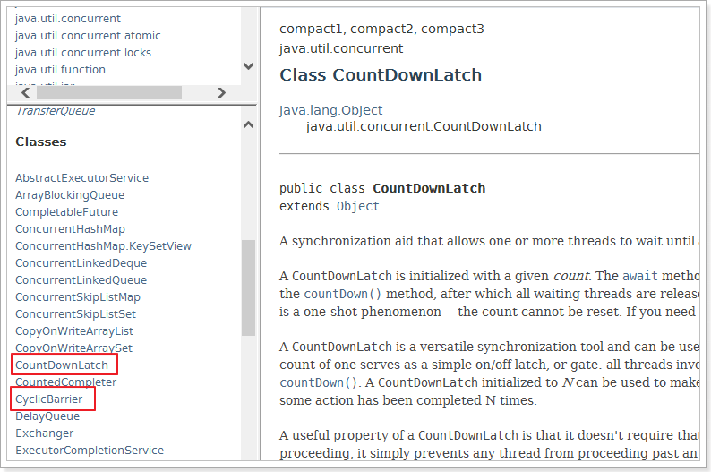

## 5.1. CountDownLatch

CountDownLatch是一个非常实用的多线程控制工具类，应用非常广泛。

例如：在手机上安装一个应用程序，假如需要5个子线程检查服务授权，那么主线程会维护一个计数器，初始计数就是5。用户每同意一个授权该计数器减1，当计数减为0时，主线程才启动，否则就只有阻塞等待了。

CountDownLatch中count down是倒数的意思，latch则是门闩的含义。整体含义可以理解为倒数的门栓，似乎有一点“三二一，芝麻开门”的感觉。CountDownLatch的作用也是如此。

常用的就下面几个方法：

```java
new CountDownLatch(int count) //实例化一个倒计数器，count指定初始计数
countDown() // 每调用一次，计数减一
await() //等待，当计数减到0时，阻塞线程（可以是一个，也可以是多个）并行执行
```

案例：6个同学陆续离开教室后值班同学才可以关门。

```java
package com.atguigu.juc.chap05;

import java.util.Random;
import java.util.concurrent.CountDownLatch;
import java.util.concurrent.TimeUnit;

public class CountDownLatchDemo {

    /**
     * 6个同学(子线程)陆续离开教室后值班同学（主线程）才可以关门
     */
    public static void main(String[] args) throws InterruptedException {
        //1.创建倒计数器对象
        CountDownLatch countDownLatch = new CountDownLatch(6);

        //2.循环创建6个子线程分别执行各自业务（完成课后作业）
        for (int i = 1; i <= 6; i++) {
            new Thread(()->{
                System.out.println(Thread.currentThread().getName()+"，开始学习");
                try {
                    TimeUnit.SECONDS.sleep(new Random().nextInt(10));
                } catch (InterruptedException e) {
                    throw new RuntimeException(e);
                }
                System.out.println(Thread.currentThread().getName()+"，结束学习");
                countDownLatch.countDown();
            }, "同学"+i).start();
        }
        //3.主线程阻塞等待各个子线程执行结束
        countDownLatch.await(10, TimeUnit.SECONDS);
        System.out.println(Thread.currentThread().getName()+"班长锁门，走人！");
    }
}
```

打印结果：

```
同学1，开始学习
同学4，开始学习
同学3，开始学习
同学2，开始学习
同学5，开始学习
同学6，开始学习
同学5，结束学习
同学2，结束学习
同学4，结束学习
同学1，结束学习
同学6，结束学习
同学3，结束学习
main班长锁门，走人！
```

**面试：**CountDownLatch 与 join 方法的区别

调用一个子线程的 `join()`方法后，该线程会`一直被阻塞直到该线程运行完毕`。 CountDownLatch 则使用计数器允许子线程运行完毕或者运行中时候递减计数，也就是 `CountDownLatch 可以在子线程运行任何时候让 await 方法返回`而不一定必须等到线程结束；countDownLatch 相比 Join 方法让我们对线程同步有更灵活的控制。

使用join实现上面功能的代码案例：

```java
package com.atguigu.demojuc.chap05;

public class JoinDemo {

    /**
     * main方法也是一个进程，在这里是主进程，即上锁的同学
     */
    public static void main(String[] args) throws InterruptedException {

        Runnable runnable = () -> {
            try {
                // 每个同学墨迹几秒钟
                TimeUnit.SECONDS.sleep(new Random().nextInt(5));
                System.out.println(Thread.currentThread().getName() + " 同学出门了");
            } catch (InterruptedException e) {
                e.printStackTrace();
            }
        };


        Thread t1 = new Thread(runnable);
        t1.start();

        Thread t2 = new Thread(runnable);
        t2.start();

        Thread t3 = new Thread(runnable);
        t3.start();

        Thread t4 = new Thread(runnable);
        t4.start();

        Thread t5 = new Thread(runnable);
        t5.start();

        Thread t6 = new Thread(runnable);
        t6.start();

        //子线程并入主线程
        t1.join();
        t2.join();
        t3.join();
        t4.join();
        t5.join();
        t6.join();

        System.out.println("值班同学锁门了");
    }
}
```

## 5.2. CyclicBarrier

从字面上的意思可以知道，这个类的中文意思是“循环栅栏”。大概的意思就是一个可循环利用的屏障。是 Java 中用于多线程编程的同步工具之一，它的主要作用是在`多个线程相互等待达到某个共同点之后再一起继续执行`。CyclicBarrier 是一个同步辅助类，通常用于协调多个线程之间的任务分配和执行。

常用方法：

1. CyclicBarrier(int parties, Runnable barrierAction) 创建一个CyclicBarrier实例，parties指定参与相互等待的线程数，barrierAction一个可选的Runnable命令，该参数只在每个屏障点运行一次，可以在执行后续业务之前共享状态。该操作由最后一个进入屏障点的线程执行。
2. CyclicBarrier(int parties) 创建一个CyclicBarrier实例，parties指定参与相互等待的线程数。
3. await() 该方法被调用时表示当前线程已经到达屏障点，当前线程阻塞进入休眠状态，`直到所有线程都到达屏障点`，当前线程才会被唤醒。

案例：组队打boss过关卡游戏。

```java
package com.atguigu.juc.chap05;

import java.util.Random;
import java.util.concurrent.BrokenBarrierException;
import java.util.concurrent.CyclicBarrier;
import java.util.concurrent.TimeUnit;

public class CyclicBarrierDemo {

    /**
     * 组队打boss过关卡游戏
     * 共计三个线程（玩家），要求所有线程执行完某一关（到达某个屏障点），才能够继续执行下一关
     *
     * @param args
     */
    public static void main(String[] args) {
        //1.声明循环栅栏对象 p1:线程数量 p2:所有线程到达屏障点后执行业务-由最后一个到达屏障点线程执行
        CyclicBarrier cyclicBarrier = new CyclicBarrier(3, () -> {
            System.out.println(Thread.currentThread().getName()+"（裁判）,所有玩家都完成该关卡，继续...");
        });

        //2.创建三个线程，业务逻辑，线程间互相等待，全部到达屏障点，才继续
        for (int i = 1; i <= 3; i++) {
            new Thread(() -> {
                try {
                    //2.1 模拟当前线程过游戏所有关卡
                    System.out.println(Thread.currentThread().getName() + "，开始过第1关");
                    TimeUnit.SECONDS.sleep(new Random().nextInt(5));
                    System.out.println(Thread.currentThread().getName() + "，第1关,已过");
                    cyclicBarrier.await();


                    //2.2 如果当前线程先到达屏障点，其他线程还未到达，将当前线程进入阻塞状态，一直到其他所有线程全部到达屏障点
                    System.out.println(Thread.currentThread().getName() + "，开始过第2关");
                    TimeUnit.SECONDS.sleep(new Random().nextInt(5));
                    System.out.println(Thread.currentThread().getName() + "，第2关,已过");
                    cyclicBarrier.await();


                    System.out.println(Thread.currentThread().getName() + "，开始过第3关");
                    TimeUnit.SECONDS.sleep(new Random().nextInt(5));
                    System.out.println(Thread.currentThread().getName() + "，第3关,已过");
                    cyclicBarrier.await();
                } catch (Exception e) {
                    throw new RuntimeException(e);
                }
            }, "玩家" + i).start();
        }
    }
}
```

输出：

```
玩家1，开始过第1关
玩家3，开始过第1关
玩家2，开始过第1关
玩家3，第1关,已过
玩家1，第1关,已过
玩家2，第1关,已过
玩家2（裁判）,所有玩家都完成该关卡，继续...
玩家2，开始过第2关
玩家1，开始过第2关
玩家3，开始过第2关
玩家3，第2关,已过
玩家2，第2关,已过
玩家1，第2关,已过
玩家1（裁判）,所有玩家都完成该关卡，继续...
玩家1，开始过第3关
玩家3，开始过第3关
玩家2，开始过第3关
玩家1，第3关,已过
玩家2，第3关,已过
玩家3，第3关,已过
玩家3（裁判）,所有玩家都完成该关卡，继续...
```

**注意：所有的"过关了"都是由最后到达await方法的线程执行打印的**

**面试：**CyclicBarrier和CountDownLatch的区别？

- CountDownLatch允许一个或多个线程等待一组事件的产生，而CyclicBarrier用于等待其他线程运行到栅栏位置
- CountDownLatch的计数器只能使用一次，而CyclicBarrier的计数器可以使用多次
- 所以CyclicBarrier能够处理更为复杂的场景

## 5.3. Semaphore

Semaphore翻译成字面意思为 信号量，Semaphore可以控制同时访问的线程个数。非常适合需求量大，而资源又很紧张的情况。比如给定一个资源数目有限的资源池，假设资源数目为N，每一个线程均可获取一个资源，但是当资源分配完毕时，后来线程需要阻塞等待，直到前面已持有资源的线程释放资源之后才能继续。

**常用方法：**

```java
public Semaphore(int permits) // 构造方法，permits指资源数目（信号量）
public void acquire() throws InterruptedException // 占用资源，当一个线程调用acquire操作时，它要么通过成功获取信号量（信号量减1），要么一直等下去，直到有线程释放信号量，或超时。
public void release() // （释放）实际上会将信号量的值加1，然后唤醒等待的线程。
```

信号量主要用于两个目的：

1. 多个共享资源的互斥使用。
2. 用于并发线程数的控制。保护一个关键部分不要一次输入超过N个线程。`（限流）`

**案例：**6辆车抢占3个车位

```java
package com.atguigu.juc.chap05;

import java.util.Random;
import java.util.concurrent.Semaphore;
import java.util.concurrent.TimeUnit;

public class SemaphoreDemo {

    /**
     * 案例：6辆车（线程）要进入到停车场共计有3个车位（信号量）
     */
    public static void main(String[] args) {

        //1.构建信号量对象
        Semaphore semaphore = new Semaphore(3);

        //2.循环创建6个线程，拿到信号量才能执行线程业务
        for (int i = 1; i <= 6; i++) {
            new Thread(() -> {
                try {
                    //2.1 每个车辆只有拿到信号才能停车 当前线程会一直阻塞到获取信号为止
                    semaphore.acquire();

                    //2.2 线程业务逻辑
                    System.out.println(Thread.currentThread().getName()+" 抢到了一个停车位！");
                    TimeUnit.SECONDS.sleep(new Random().nextInt(5));
                    //2.3 当前车辆业务执行完毕，释放信号量
                    System.out.println(Thread.currentThread().getName()+" 离开停车位！！");

                    semaphore.release();
                } catch (Exception e) {
                    throw new RuntimeException(e);
                }
            }, "" + i).start();
        }
    }
}
```

打印结果：

```
0 抢到了一个停车位！！
1 抢到了一个停车位！！
2 抢到了一个停车位！！
1 离开停车位！！
3 抢到了一个停车位！！
2 离开停车位！！
4 抢到了一个停车位！！
0 离开停车位！！
5 抢到了一个停车位！！
5 离开停车位！！
3 离开停车位！！
4 离开停车位！！
```

# 6. Callable接口

`Thread类、Runnable接口`使得多线程编程简单直接。

但Thread类和Runnable接口都`不允许声明检查型异常`，`也不能定义返回值`。没有返回值这点稍微有点麻烦。不能声明抛出检查型异常则更麻烦一些。

以上两个问题现在都得到了解决。从java5开始，提供了Callable接口，是Runable接口的增强版。`用Call()方法作为线程的执行体，增强了之前的run()方法。`因为call方法可以有返回值，也可以声明抛出异常。

## 6.1. Callable和Runnable对比

先初步认识一下Callable接口：这是一个函数式接口，因此可以用作lambda表达式或方法引用的赋值对象。

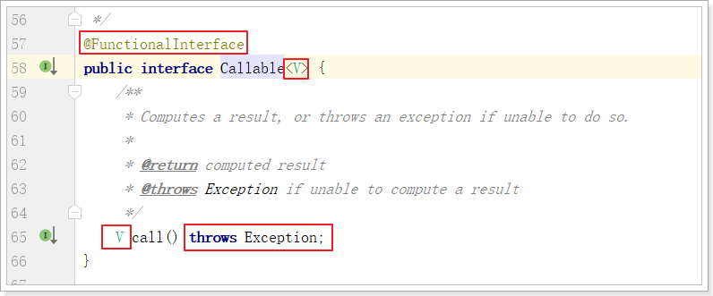

具体代码实现对比：

```java
class MyRunnableThread implements Runnable{
    @Override
    public void run() {

    }
}

class MyCallableThread implements Callable<Integer>{

    @Override
    public Integer call() throws Exception {
        return null;
    }
}

public class CallableDemo {

    public static void main(String[] args) {
        // 创建多线程
    }
}
```

该如何使用Callable创建Thread对象，如果使用Runnable是：

```java
public class CallableDemo {

    public static void main(String[] args) {
        // 创建多线程
        new Thread(new MyRunnableThread(), "threadName").start();
    }
}
```

现在能不能直接把MyRunnableThread换成MyCallableThread。当然不行，thread的构造方法参数需要Runnable类型的数据模型，而MyCallableThread属于Callable类型的。

那么到底怎么使用Callable创建thread对象呢？

## 6.2. Callable的使用

这里需要一个FutureTask：

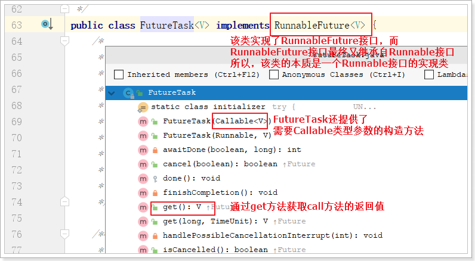

发现：FutureTask其实可以充当了一个中间人的角色

```java
package com.atguigu.demojuc.chap06;

class MyRunnableThread implements Runnable{
    @Override
    public void run() {
        System.out.println(Thread.currentThread().getName() + " Runnable");
    }
}

/**
 * 1. 创建Callable的实现类，并重写call()方法，该方法为线程执行体，并且该方法有返回值
 */
class MyCallableThread implements Callable<Integer> {

    @Override
    public Integer call() throws Exception {
        
        int i;
        for (i = 0; i < 10; i++) {
            Thread.sleep(300);
            System.out.println(Thread.currentThread().getName() + " 执行了！" + i);
        }

        return i;
    }
}

public class CallableDemo {

    public static void main(String[] args) throws InterruptedException, ExecutionException {

        // 创建多线程
        new Thread(new MyRunnableThread(), "threadName").start();

        //new Thread(new MyCallableThread(), "threadName").start();
        // 2. 创建Callable的实例，并用FutureTask类来包装Callable对象
        // 3. 创建FutureTask对象，需要一个Callable类型的参数
        FutureTask task = new FutureTask<>(new MyCallableThread());
        // 4. 创建多线程，由于FutureTask的本质是Runnable的实现类，所以第一个参数可以直接使用task
        new Thread(task, "MyCallableThread").start();

        //取消任务
//        Thread.sleep(1000);
//        task.cancel(true); //线程运行时可以被打断吗
//        boolean cancelled = task.isCancelled();
//        System.out.println("cancelled " + cancelled);

        //等待任务执行完毕
//        while (!task.isDone()) { //也可以使用task.isDone()判断子线程是否执行完毕
//            Thread.sleep(100);
//            System.out.println("wait...");
//        }

        //获取结果
        System.out.println(task.get());//get方法阻塞主线程，因为需要返回子线程的结果
        System.out.println(Thread.currentThread().getName() + " over!");

    }
}
```

`FutureTask` 是 Java 中的一个类，它实现了 `Future` 和 `Runnable` 接口，用于表示一个可取消的异步计算任务。`FutureTask` 的主要作用是允许您在一个线程中计算结果，然后在另一个线程中获取该计算的结果，同时还支持任务的取消操作。以下是 `FutureTask` 的一些主要作用：

1. **异步计算**：`FutureTask` 允许您在一个线程中执行耗时的计算任务，而不会阻塞主线程。这对于需要执行计算密集型操作或长时间等待外部资源的应用程序非常有用，因为它可以让主线程继续执行其他任务。
2. **获取计算结果**：通过调用 `get()` 方法，您可以获取 `FutureTask` 的计算结果。如果计算尚未完成，`get()` 方法会阻塞当前线程，直到计算完成为止。
3. **取消任务**：`FutureTask` 允许您通过调用 `cancel(boolean mayInterruptIfRunning)` 方法来取消任务的执行。您可以选择是否允许在任务运行时中断任务。取消操作可以用于管理任务的生命周期和资源释放。
4. **任务状态查询**：`FutureTask` 提供了一些方法来查询任务的状态，例如 `isDone()` 用于检查任务是否已完成，`isCancelled()` 用于检查任务是否已被取消。
5. **异常处理**：如果异步任务抛出了异常，`FutureTask` 会捕获异常并在后续调用 `get()` 方法时重新抛出。这使得您可以在获取计算结果时处理可能的异常情况。

总之，`FutureTask` 是一个强大的工具，用于管理异步计算任务的执行和结果获取。它提供了异步计算、取消任务、异常处理和任务状态查询等功能，可以帮助编写更加灵活和高效的多线程应用程序。

**注意：**

1. **为了防止主线程阻塞，建议get方法放到最后**

2. **只计算一次**，FutureTask会复用之前计算过的结果

创建多个线程，会怎样？

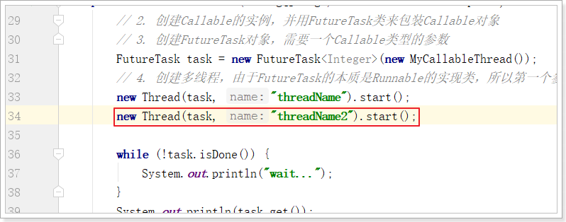

运行结果依然只有一个，就是首先执行的线程，可能是ThreadName，也可能是ThreadName2。

如果想打印threadName2的结果（重新执行call方法中的内容），怎么办？**再创建一个FutureTask对象即可。**

## 6.3. 面试题

**面试题：callable接口与runnable接口的区别？**

- 相同点：都是接口，都可以编写多线程程序，都采用Thread.start()启动线程


- 不同点：


1. 具体方法不同：一个是run，一个是call
2. Runnable没有返回值；Callable可以返回执行结果，是个泛型
3. Callable接口的call()方法允许抛出异常；Runnable的run()方法异常只能在内部消化，不能往上继续抛

**面试题：**获得多线程的方法几种？

（1）继承thread类（2）runnable接口

如果只回答这两个你连被问到juc的机会都没有 

`正确答案如下：`

- 传统的是继承thread类和实现runnable接口
- java5以后又有实现callable接口和java的线程池

# 7. 阻塞队列（BlockingQueue）

栈与队列简单回顾：

栈：先进后出，后进先出

队列：先进先出 FIFO

## 7.1. 什么是BlockingQueue

在多线程领域：所谓**阻塞**，在某些情况下会**挂起线程**（即阻塞），一旦条件满足，被挂起的线程又会自动被唤起。

BlockingQueue即阻塞队列，是java.util.concurrent下的一个接口，因此不难理解，BlockingQueue是为了解决多线程中数据高效安全传输而提出的。从阻塞这个词可以看出，在某些情况下对阻塞队列的访问可能会造成阻塞。

**被阻塞的情况主要有如下两种：**

1. 当队列`满`了的时候，依然进行`入队`列操作

2. 当队列`空`了的时候，依然进行`出队`列操作

因此，当一个线程试图对一个已经满了的队列进行入队列操作时，它将会被阻塞，除非有另一个线程做了出队列操作；

同样，当一个线程试图对一个空队列进行出队列操作时，它将会被阻塞，除非有另一个线程进行了入队列操作。

**阻塞队列主要用在生产者/消费者的场景**，下面这幅图展示了一个线程生产、一个线程消费的场景：

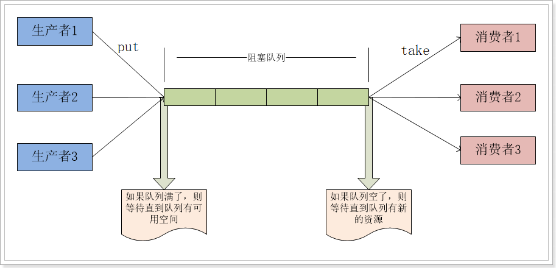

**为什么需要BlockingQueue**

多线程环境中，通过队列可以很容易实现数据共享，比如经典的“生产者”和“消费者”模型中，通过队列可以很便利地实现两者之间的数据共享。

假设我们有若干生产者线程，另外又有若干个消费者线程。如果生产者线程需要把准备好的数据共享给消费者线程，利用队列的方式来传递数据，就可以很方便地解决他们之间的数据共享问题。

但如果生产者和消费者在某个时间段内，万一发生数据处理速度不匹配的情况呢？理想情况下，`如果生产者产出数据的速度大于消费者消费的速度，并且当生产出来的数据累积到一定程度的时候，那么生产者必须暂停等待一下（阻塞生产者线程）`，以便等待消费者线程把累积的数据处理完毕，`反之亦然`。然而，在concurrent包发布以前，在多线程环境下，我们每个程序员都必须去自己控制这些细节，尤其还要兼顾效率和线程安全，而这会给我们的程序带来不小的复杂度。

**这也是我们在多线程环境下，为什么需要BlockingQueue的原因。作为BlockingQueue的使用者，我们再也不需要关心什么时候需要阻塞线程，什么时候需要唤醒线程，因为这一切BlockingQueue都给你一手包办了。**

## 7.2. 认识BlockingQueue

java.util.concurrent 包里的 BlockingQueue是一个接口，继承Queue接口，Queue接口继承 Collection。

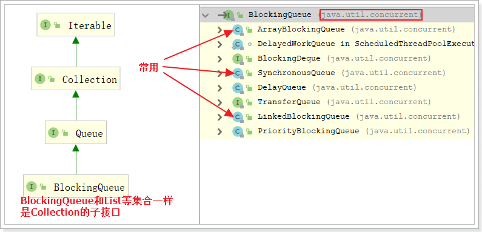

BlockingQueue接口主要有以下7个实现类：

1. `ArrayBlockingQueue：由数组结构组成的有界阻塞队列。`使用一个固定大小的数组来存储元素。它需要在创建时指定容量，不支持动态扩展。
2. `LinkedBlockingQueue：由链表结构组成的有界阻塞队列。`使用一个链表来存储元素，它可以是无界的（未指定容量）或有界的（在创建时指定容量）。当使用无界队列时，它可以一直增长（最大值是Integer.MAX_VALUE），不会导致生产者或消费者被阻塞。对于有界队列，当队列满时，生产者会被阻塞，直到有空间可用，当队列为空时，消费者会被阻塞，直到有元素可取出。
3. PriorityBlockingQueue：支持优先级排序的无界阻塞队列。
4. DelayQueue：使用优先级队列实现的延迟无界阻塞队列。
5. `SynchronousQueue：不存储元素的阻塞队列，也即单个元素的队列。`
6. LinkedTransferQueue：由链表组成的无界阻塞队列。
7. LinkedBlockingDeque：由链表组成的双向阻塞队列。

BlockingQueue接口有以下几个方法：

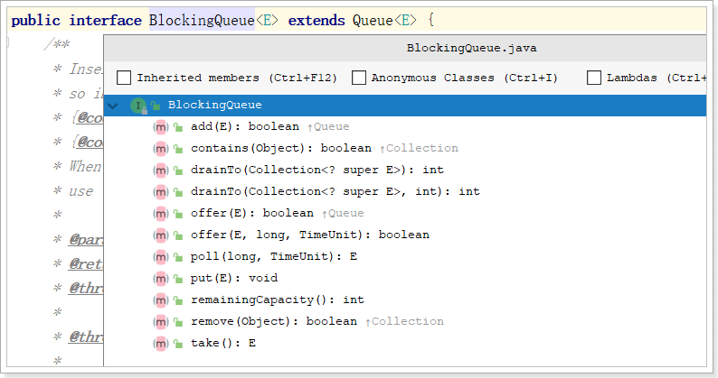

阻塞队列提供以下**4种处理方法**：

|                  | 抛出异常  | 特殊值   | 阻塞   | 超时                 |
| ---------------- | --------- | -------- | ------ | -------------------- |
| **插入**         | add(e)    | offer(e) | put(e) | offer(e, time, unit) |
| **移除**         | remove()  | poll()   | take() | poll(time, unit)     |
| **检查（获取）** | element() | peek()   | 不可用 | 不可用               |

**抛出异常**

​		add正常执行返回true，element（不删除）和remove（删除）返回阻塞队列中的第一个元素
​		当阻塞队列满时，再往队列里add插入元素会抛IllegalStateException:Queue full
​		当阻塞队列空时，再从队列里remove移除元素会抛NoSuchElementException
​		当阻塞队列空时，再调用element检查元素会抛出NoSuchElementException

**特殊值**
​		插入方法，成功ture失败false
​		移除方法，成功返回出队列的元素，队列里没有就返回null
​		检查方法，成功返回队列中的元素，没有返回null

**阻塞**

​		如果试图的操作无法立即执行，该方法调用将会发生阻塞，直到能够执行。
​		当阻塞队列满时，再往队列里put元素，队列会一直阻塞生产者线程，直到put数据or响应中断退出
​		当阻塞队列空时，再从队列里take元素，队列会一直阻塞消费者线程，直到队列可用

**超时**

​		如果试图的操作无法立即执行，该方法调用将会发生阻塞，直到能够执行，但等待时间不会超过给定值。
​		返回一个特定值以告知该操作是否成功(典型的是 true / false)。

## 7.3. 代码演示

**阻塞队列的操作：**

```java
package com.atguigu.demojuc.chap07;

public class BlockingQueueDemo {

    public static void main(String[] args) throws InterruptedException {

        //创建有界阻塞队列
        BlockingQueue<String> queue = new ArrayBlockingQueue<>(3);

        // 第一组方法：add remove element
        System.out.println(queue.add("a")); //入队,正常则返回true
        System.out.println(queue.add("b"));
        System.out.println(queue.add("c"));
        // System.out.println(queue.add("d")); //队列已满仍然入队，报异常
        System.out.println(queue.element()); //获取队列中的第一个元素，并返回
        System.out.println(queue.remove()); //出队第一个元素，返回出队元素
        System.out.println(queue.remove());
        System.out.println(queue.remove());
        //System.out.println(queue.remove()); //队列已空仍然出队，报异常
        //System.out.println(queue.element()); //队列已空仍然获取元素，报异常


        // 第二组：offer poll peek
        /*System.out.println(queue.offer("a")); //入队,正常则返回true
        System.out.println(queue.offer("b"));
        System.out.println(queue.offer("c"));
        System.out.println(queue.offer("d")); //队列已满仍然入队, 返回false
        System.out.println(queue.peek()); //获取队列中的第一个元素，并返回
        System.out.println(queue.poll()); //出队第一个元素，返回出队元素
        System.out.println(queue.poll());
        System.out.println(queue.poll());
        System.out.println(queue.poll()); //队列已空仍然出队，返回null
        System.out.println(queue.peek());  //队列已空仍然获取元素，返回null*/

        // 第三组：put take
        /*queue.put("a"); //入队
        queue.put("b");
        queue.put("c");
        System.out.println(queue.take()); //出队第一个元素，返回出队元素，则后面代码不会阻塞
        queue.put("d"); //队列已满仍然入队, 发生阻塞
        System.out.println(queue.take()); //出队第一个元素，返回出队元素
        System.out.println(queue.take());
        System.out.println(queue.take());
        System.out.println(queue.take()); //队列已空仍然出队，发生阻塞*/

        // 第四组：offer poll
        /*System.out.println(queue.offer("a")); //入队,正常则返回true
        System.out.println(queue.offer("b"));
        System.out.println(queue.offer("c"));
        System.out.println(queue.offer("d", 5, TimeUnit.SECONDS)); //队列已满仍然入队,超时返回false
        System.out.println(queue.poll()); //出队第一个元素，返回出队元素
        System.out.println(queue.poll());
        System.out.println(queue.poll());
        System.out.println(queue.poll(5, TimeUnit.SECONDS)); //队列已空仍然出队，,超时返回null*/
    }
}
```

## 7.4. 生产者消费者案例

```java
package com.atguigu.demojuc.chap07;

public class BlockingQueueDemo2 {

    public static void main(String[] args) {

        //创建无界阻塞队列
        //BlockingQueue<Integer> queue = new LinkedBlockingDeque<>();

        //创建有界阻塞队列：当消费的进度较慢，生产进度较快，而且队列放不下的时候，生产会被自动阻塞，等待消费
        BlockingQueue<Integer> queue = new ArrayBlockingQueue<>(3);

        //生产者
         new Thread(()->{

             try {
                 for (int i = 1; i <= 10; i++) {

                     queue.put(i);
                     System.out.println("生产第" + i + "个馒头，" + "目前还剩" + queue.size() + "个馒头");
                     TimeUnit.SECONDS.sleep(1);

                 }
             } catch (InterruptedException e) {
                 throw new RuntimeException(e);
             }

         }, "生产者").start();

        //消费者
        new Thread(()->{

            try {
                for (int i = 1; i <= 10; i++) {

                    System.out.println("消费第" + queue.take() + "个馒头" + "目前还剩" + queue.size() + "个馒头");
                    TimeUnit.SECONDS.sleep(3);

                }
            } catch (InterruptedException e) {
                throw new RuntimeException(e);
            }
        }, "消费者").start();
    }
}
```

## 7.5、SynchronousQueue

SynchronousQueue，实际上它不是一个真正的队列，因为它不会为队列中元素维护存储空间（队列容量为0）。

**作用：直接交付场景**

就好比将文件直接交给同事，不是将文件放到她的邮箱中，这样可以尽快拿到文件。这种实现队列的方式看似很奇怪，但由于可以直接交付工作，从而降低了将数据从生产者移动到消费者的延迟。

因为SynchronousQueue没有存储功能，因此put和take会一直阻塞，直到有另一个线程已经准备好参与到交付过程中。仅当有足够多的消费者，并且总是有一个消费者准备好获取交付、	的工作时，才适合使用同步队列。

```java
package com.atguigu.demojuc.chap07;

public class SynchronousQueueDemo {

    public static void main(String[] args) throws InterruptedException {

        BlockingQueue<String> synchronousQueue = new SynchronousQueue<>();
//        synchronousQueue.put("a"); //不存储元素的阻塞队列
//        System.out.println(synchronousQueue.take()); //null

         new Thread(()->{
             try {
                 String data = UUID.randomUUID().toString().substring(0, 8);
                 System.out.println("生产: " + data);
                 synchronousQueue.put(data);
             } catch (InterruptedException e) {
                 e.printStackTrace();
             }
         }, "生产者线程").start();


         new Thread(()->{
                 try {
                     String data = synchronousQueue.take();
                     System.out.println(Thread.currentThread().getName()
                             + " 消费: " + data);
                 } catch (InterruptedException e) {
                     e.printStackTrace();
                 }
         }, "消费者线程").start();
    }
}
```

# 8. ThreadPool线程池

## 8.1. 架构说明

Java中的线程池是通过Executor框架实现的，该框架中用到了**Executor，ExecutorService，ThreadPoolExecutor**这几个类。

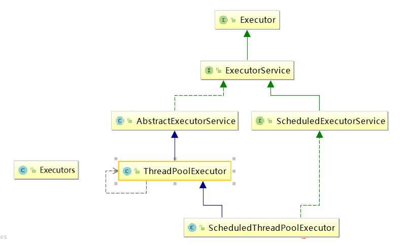

Executor接口是顶层接口，只有一个execute方法，过于简单。通常不使用它，而是使用ExecutorService接口：

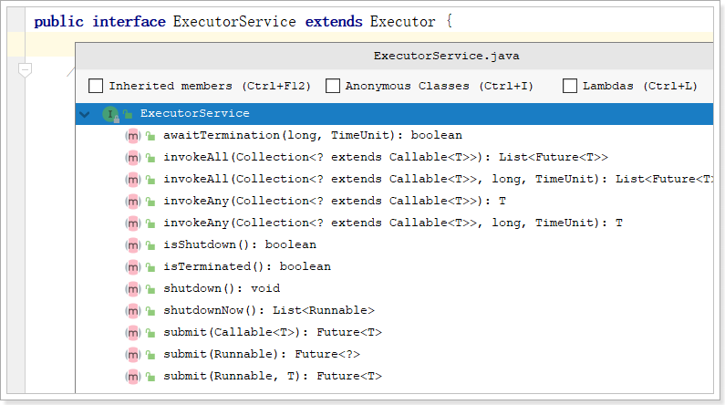

那么问题来了，怎么创建一个线程池对象呢？通常使用Executors工具类

**面试题：execute和submit的区别**

1. execute是Executor接口的方法，而submit是ExecutorService的方法，并且ExecutorService接口继承了Executor接口。
2. execute只接受Runnable参数，没有返回值；而submit可以接受Runnable参数和Callable参数，并且返回了Future对象，可以进行任务取消、获取任务结果、判断任务是否执行完毕/取消等操作。
3. 通过execute方法提交的任务无法获取具体的异常信息；而submit方法可以通过Future对象获取异常信息。

## 8.2. Executors工具类

架构图可以看到Executors工具类，可以用它快速创建线程池：

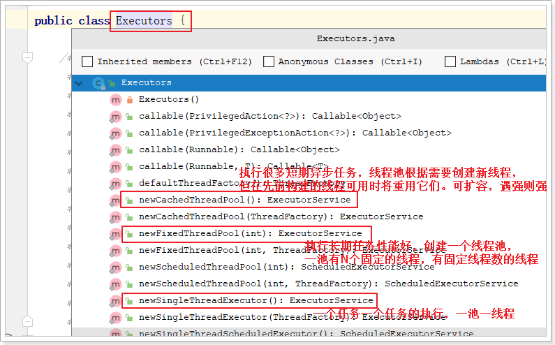

直接编码演示：每种线程池的效果

```java
package com.atguigu.juc.chap08;

import java.util.concurrent.ExecutionException;
import java.util.concurrent.ExecutorService;
import java.util.concurrent.Executors;
import java.util.concurrent.Future;

public class ExecutorsDemo {

    /**
     * 使用工具类创建线程池，使用线程池执行异步任务
     */
    public static void main(String[] args) throws ExecutionException, InterruptedException {
        //1.采用Executors产生线程池
        //1.1 创建单一线程-线程池对象
        ExecutorService executorService = Executors.newSingleThreadExecutor();
        //2. 调用线程池对象执行任务（Runnable，Callable）
        //2.1 execute方法入参只能是Runnable 只适用于线程没有返回结果
        //executorService.execute();
        //2.2 submit方法入参可以是Runnable或Callable，适用于线程有或者没有返回结果
        //executorService.submit(() -> {
        //    System.out.println(Thread.currentThread().getName() + ",任务执行...");
        //});
        Future<String> future = executorService.submit(() -> {
            System.out.println(Thread.currentThread().getName() + ",任务执行...");
            return "atguigu";
        });

        //3.获取子线程执行结果
        String s = future.get();
        System.out.println(Thread.currentThread().getName()+","+s);
        //3.测试时候-线程池使用完毕后关闭
        //executorService.shutdown();
    }
}
```

定时任务：延迟执行

```java
package com.atguigu.jucdemo.chap08;

public class ScheduledThreadPoolDemo {

    public static void main(String[] args) {

        ScheduledExecutorService scheduledThreadPool = Executors.newScheduledThreadPool(3);
        System.out.println(new Date());

        try {

            for (int i = 0; i < 10; i++) {
                //延迟执行
                scheduledThreadPool.schedule(()->{
                    System.out.println(Thread.currentThread().getName() + " 定时任务被执行" + new Date());
                    try {
                        TimeUnit.SECONDS.sleep(2);
                    } catch (InterruptedException e) {
                        throw new RuntimeException(e);
                    }
                }, 5, TimeUnit.SECONDS);
            }

        } finally {
            scheduledThreadPool.shutdown();
        }
    }
}
```

定时任务：延迟并间隔执行

```java
package com.atguigu.jucdemo.chap08;

import java.util.Date;
import java.util.concurrent.Executors;
import java.util.concurrent.ScheduledExecutorService;
import java.util.concurrent.TimeUnit;

public class ScheduledAtFixRateDemo {

    public static void main(String[] args) {

        ScheduledExecutorService scheduledThreadPool = Executors.newScheduledThreadPool(3);
        System.out.println(new Date());

        //try {

            for (int i = 0; i < 10; i++) {
                //延迟执行
                scheduledThreadPool.scheduleAtFixedRate(()->{
                    System.out.println(Thread.currentThread().getName() + " 定时任务被执行" + new Date());
                    try {
                        TimeUnit.SECONDS.sleep(2);
                    } catch (InterruptedException e) {
                        throw new RuntimeException(e);
                    }
                }, 5, 1, TimeUnit.SECONDS);
            }

        /*} finally {
            scheduledThreadPool.shutdown(); //不要销毁这个对象，因为任务会一直执行
        }*/
    }
}
```

## 8.3. 底层原理

### 8.3.1. 线程池的7个重要参数

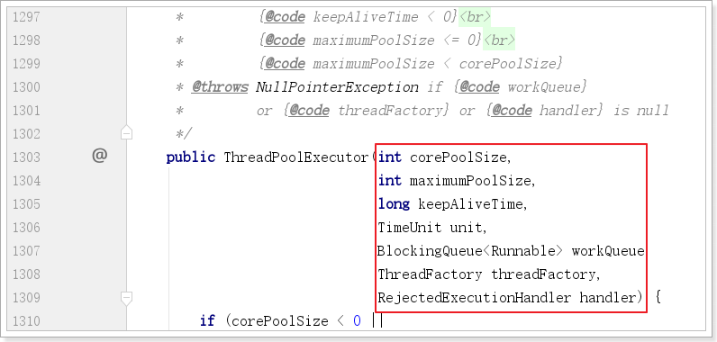

1. corePoolSize：线程池中的常驻核心线程数
2. maximumPoolSize：线程池中能够容纳同时 执行的最大线程数，此值必须大于等于1
3. keepAliveTime：多余的空闲线程的存活时间 当前池中线程数量超过corePoolSize时，当空闲时间达到keepAliveTime时，多余线程会被销毁直到 只剩下corePoolSize个线程为止
4. unit：keepAliveTime的单位 
5. workQueue：任务队列，被提交但尚未被执行的任务
6. threadFactory：表示生成线程池中工作线程的线程工厂， 用于创建线程，**一般默认的即可**
7. handler：拒绝策略，表示当队列满了，并且工作线程等于线程池的最大线程数（maximumPoolSize）时，如何来拒绝 请求执行的runnable的策略

### 8.3.2. 线程池底层工作原理

具体流程：

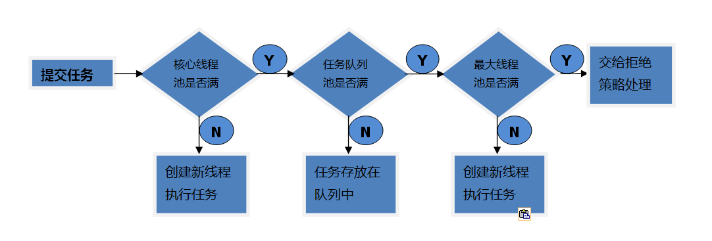

1. 在创建了线程池后，线程池中的`线程数为零`。
2. 当调用execute()方法添加一个请求任务时，线程池会做出如下判断：
   3. 如果正在运行的线程数量小于`corePoolSize`，那么`马上创建线程`运行这个任务；
   4. 如果正在运行的线程数量`大于或等于corePoolSize`，那么`将这个任务放入队列`；
   5. 如果这个时候`队列满了`且正在`运行的线程数量还小于maximumPoolSize`，那么还是要`创建非核心线程`立刻运行这个任务；
   6. 如果`队列满了`且正在`运行的线程数量等于maximumPoolSize`，那么线程池会`启动饱和拒绝策略`来执行。

7. 当一个线程完成任务时，它会从队列中取下一个任务来执行。
8. 当一个线程无事可做超过一定的时间（keepAliveTime）时，线程会判断：

   - 如果当前运行的线程数大于corePoolSize，那么这个线程就被停掉。
   - 线程池的所有任务完成后，`它最终会收缩到corePoolSize的大小`。

### 8.3.3. 拒绝策略

一般我们创建线程池时，`为防止资源被耗尽，任务队列都会选择创建有界任务队列`，但这种模式下如果出现任务队列已满且线程池创建的线程数达到你设置的最大线程数时，这时就需要你指定ThreadPoolExecutor的RejectedExecutionHandler参数即合理的拒绝策略，`来处理线程池"超载"的情况`。

**ThreadPoolExecutor自带的拒绝策略如下：**

1. AbortPolicy(默认)：直接抛出RejectedExecutionException异常阻止系统正常运行
2. CallerRunsPolicy：“调用者运行”一种调节机制，该策略既不会抛弃任务，也不会抛出异常，而是将某些任务回退到调用者，从而降低新任务的流量。
3. DiscardOldestPolicy：抛弃队列中等待最久的任务，然后把当前任务加人队列中，尝试再次提交当前任务。
4. DiscardPolicy：该策略默默地丢弃无法处理的任务，不予任何处理也不抛出异常。 如果允许任务丢失，这是最好的一种策略。

以上内置的策略均实现了RejectedExecutionHandler接口，`也可以自己扩展RejectedExecutionHandler接口`，定义自己的拒绝策略

## 8.4. 自定义线程池

​		在《阿里巴巴java开发手册》中指出了`线程资源必须通过线程池提供`，不允许在应用中自行显示的创建线程，这样一方面是线程的创建更加规范，可以合理控制开辟线程的数量；另一方面线程的细节管理交给线程池处理，优化了资源的开销。而线程池不允许使用Executors去创建，而要通过ThreadPoolExecutor方式，这一方面是由于jdk中Executor框架虽然提供了如newFixedThreadPool()、newSingleThreadExecutor()、newCachedThreadPool()等创建线程池的方法，但都有其局限性，不够灵活；使用ThreadPoolExecutor有助于大家明确线程池的运行规则，创建符合自己的业务场景需要的线程池，避免资源耗尽的风险。

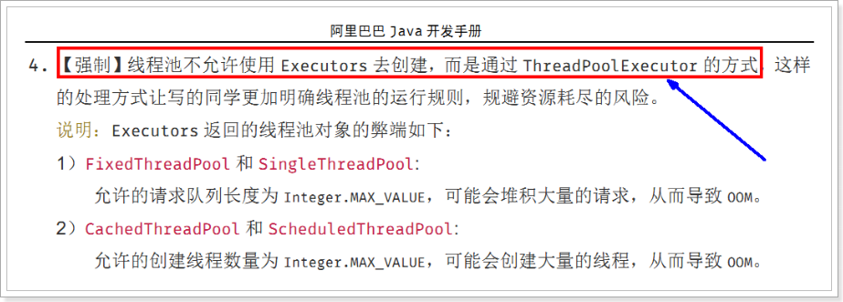

自定义线程池：

```java
package com.atguigu.demojuc.chap08;

class MyRunnable implements Runnable{

    private int param;

    public MyRunnable(int param) {
        this.param = param;
    }

    @Override
    public void run() {
        System.out.println(Thread.currentThread().getName() +  " Runnable......" + param);
    }
}

public class CustomizeThreadPoolDemo {

    public static void main(String[] args) {

        // 自定义连接池
        ExecutorService threadPool = new ThreadPoolExecutor(2, 5,
                2, TimeUnit.SECONDS, new ArrayBlockingQueue<>(3),
                Executors.defaultThreadFactory(),
                new ThreadPoolExecutor.AbortPolicy() //丢弃任务并抛出异常
                //new ThreadPoolExecutor.CallerRunsPolicy() //由调用线程处理该任务，谁调用谁处理
                //new ThreadPoolExecutor.DiscardOldestPolicy() //丢弃队列中等待最久的任务，添加新任务
                //new ThreadPoolExecutor.DiscardPolicy() //也是丢弃任务，但是不抛出异常。 
                /*new RejectedExecutionHandler() {
                    @Override
                    public void rejectedExecution(Runnable r, ThreadPoolExecutor executor) {
                        System.out.println("自定义拒绝策略");
                    }
                }*/
        );

        try {
            for (int i = 0; i < 9; i++) {
                threadPool.execute(() -> {
                //threadPool.submit(() -> { //这里也可以使用submit
                    System.out.println(Thread.currentThread().getName() + "执行了业务逻辑");
                });
            }
        } catch (Exception e) {
            e.printStackTrace();
        } finally {
            threadPool.shutdown();
        }

    }
}
```

## 8.5、总结

线程池是多线程编程中的一个重要概念，它的主要作用是有效地管理和复用线程，以提高多线程应用程序的性能和资源利用率。以下是线程池的主要作用和优点：

1. **线程复用**：线程池会在池中维护一组可重用的线程，这些线程可以反复执行任务。线程的复用减少了线程创建和销毁的开销，提高了执行任务的效率。
2. **任务队列**：线程池通常与任务队列结合使用，将待执行的任务排队等待执行。这允许任务按顺序执行，控制并发度，防止任务过多导致资源耗尽。
3. **线程生命周期管理**：线程池可以管理线程的生命周期，包括线程的创建、销毁、超时处理等。这有助于减少资源泄漏和提高系统的稳定性。
4. **可控性**：线程池允许您控制线程的数量、最大并发数、线程优先级等参数，以满足不同应用场景的需求。

总之，线程池是一种重要的多线程编程工具，它可以帮助您更有效地管理线程资源，提高多线程应用程序的性能和稳定性。在大多数情况下，使用线程池是编写高效且可维护的多线程应用程序的最佳实践之一。
