# JUC 并发编程笔记（下）

> 内容涵盖：多线程底层原理（JMM、volatile、CAS、ABA）、synchronized底层实现、HashMap 与 ConcurrentHashMap 原理

---

# 9. 多线程高并发底层原理

## 9.1. Java内存模型

计算机运行架构图，如下：

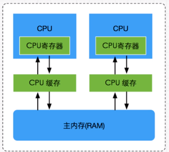

由于cpu的运行程序速度远大于主存储的速度，所以会在主存RAM和CPU之间加多级高速缓存，缓存的速度接近cpu的运行速度，这样会大大提高计算机的运行速度。

**CPU 通过CPU缓存和CPU寄存器来提高数据访问速度，减少对RAM的访问次数，提高对RAM的访问效率，从而提高计算机的性能。**

`JMM即为JAVA 内存模型（Java Memory Model）`。因为在不同的硬件生产商和不同的操作系统下，内存的访问逻辑有一定的差异，结果就是当你的代码在某个系统环境下运行良好，并且线程安全，但是换了个系统就出现各种问题。Java内存模型，就是为了**屏蔽系统和硬件的差异**，让一套代码在不同平台下能到达相同的访问结果。JMM从java 5开始的JSR-133发布后，已经成熟和完善起来。

JMM规定了内存主要划分为**主内存**和**工作内存**两种。**主内存对应的是硬件的物理内存，工作内存对应的是寄存器和高速缓存**。

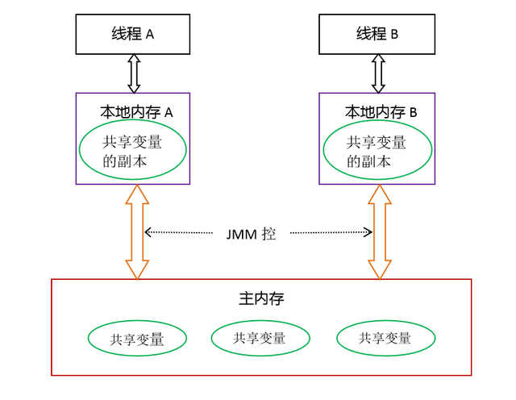

- **共享变量**：如果一个变量被多个线程使用，那么这个变量会在每个线程的工作内存中保有一个副本，这种变量就是共享变量。
- **主内存**：保存了所有的共享变量。
- **工作内存**：每个线程都有自己的工作内存，线程独享，保存了线程用到的变量副本（主内存共享变量的一份拷贝）。

**JMM**对共享内存的操作做出了如下两条规定：

- 线程对共享内存的所有操作都必须在自己的工作内存中进行，不能直接从主内存中读写；
- 不同线程无法直接访问其他线程工作内存中的变量，因此共享变量的值传递需要通过主内存完成。

**Java内存模型的三大特性**

- 可见性
- 有序性
- 原子性

## 9.2. volatile关键字

### 9.2.1. 可见性

**问题：**在多线程编程中，可见性是指当一个线程修改了共享变量的值后，其他线程能够立即看到这个修改后的值。然而，由于现代计算机体系结构中存在缓存等优化机制，可能导致某个线程对共享变量的修改对其他线程不可见。

验证volatile关键字保证内存可见性：

```java
package com.atguigu.demojuc.chap09;

public class VolatileDemo {

    private static Integer flag = 1;

    public static void main(String[] args)  throws InterruptedException {

        new Thread(new Runnable() {
            @Override
            public void run() {
                System.out.println("我是子线程工作内存flag的值：" + flag);
                while(flag == 1){}
                System.out.println("子线程操作结束..." + flag);
            }
        }).start();

        Thread.sleep(500);

        flag = 2; //主线程修改flag的值
        System.out.println("我是主线程工作内存flag的值：" + flag);
    }
}
```

这是没有添加volatile关键字，打印效果如下：

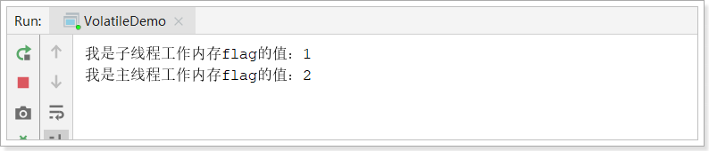

子线程读取不到主线程修改后的flag值，陷入死循环程序无法结束。

接下来添加volatile关键字再试试：

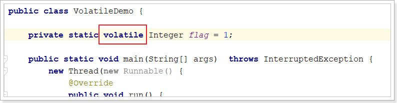

打印结果如下：子线程可以读取的新值并结束子线程

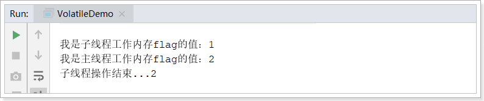

**总结：**使用`volatile`关键字可以确保共享变量的可见性。当一个变量被声明为`volatile`时，每次访问该变量时都会从主内存中读取最新的值，并且对该变量的修改会立即写入主内存，而不是先写入缓存。这样可以保证当一个线程修改了`volatile`变量后，其他线程立即看到最新的值。

通过使用`volatile`关键字，我们可以避免在多线程环境下出现数据不一致的问题，因为任何对`volatile`变量的修改都会立即可见于其他线程。

### 9.2.2. 有序性

**问题：**在多线程编程中，有序性指的是指令的执行顺序要与源代码中的顺序一致。由于现代计算机体系结构中存在指令重排的优化机制，编译器和处理器可能会重新排序指令的执行顺序以提高性能。指令重排可以改变指令的执行顺序，但**不能改变单线程程序的结果**。然而，在**多线程编程中，指令重排可能会引起问题**，因为它可能违反了程序员的意图，可能会导致程序出现错误或产生难以预测的结果。

在 JDK 17 中，默认情况下使用了更强的内存模型，因此在某些情况下可能无法复现在较旧版本中需要 `volatile` 关键字才能保证的内存有序性问题。

**注意：此特性需要在jdk1.8环境中做测试**

```java
public class VolatileOrderDemo {

    static int a,b;
    static int x,y;

    public static void main(String[] args) throws InterruptedException {

        int i = 0;
        while (true){
            i++;
            a = b = x = y = 0;
            
            Thread thread1 = new Thread(() -> {
                a = 1;
                x = b;
            }, "");	
            
            Thread thread2 = new Thread(() -> {
                b = 1;
                y = a;
            }, "");

            thread1.start();
            thread2.start();

            thread1.join();
            thread2.join();

            System.out.println("第" + i + "次打印：x=" + x + ", y=" + y);

            if (x == 0 && y == 0){
                break;
            }
        }
    }
}
```

**分析，正常情况下：**

如果thread1先执行，xy的值是[0, 1] ；a=1 x=b {b:0} b=1 y=a {a:1};  x=0,y=1

如果thread2先执行是[1, 0]  b = 1 y=a {a:0} a=1 x=b{b:1}

如果出现[0, 0]，则说明进行了指令重排。

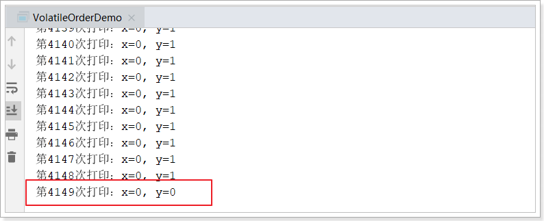

**解决方案：**给a, b添加volatile关键字。使用volatile修饰的变量会禁止编译器和处理器对其进行优化。

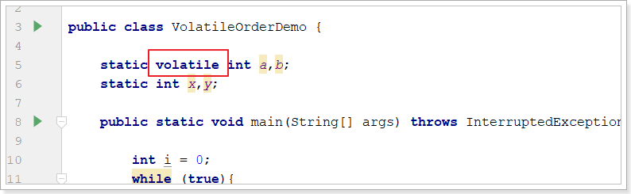

**结论：**通过将变量声明为`volatile`，可以避免指令重排的优化机制，从而保证指令的执行顺序与源代码中的顺序一致，以避免多线程环境下的错误；则是编译器和处理器为了提高性能而进行的指令执行顺序的重新排序。

### 9.2.3. 不具备原子性

编写如下程序：

```java
class DataOne{

    private Integer number = 0;

    public Integer incr(){
        return ++number;
    }
}

public class VolatileAtomicDemo {

    public static void main(String[] args) {

        DataOne dataOne = new DataOne();

        for (int i = 0; i < 1000; i++) {
            new Thread(() -> {
                System.out.println(dataOne.incr());
            }).start();
        }
    }
}
```

执行效果如下：

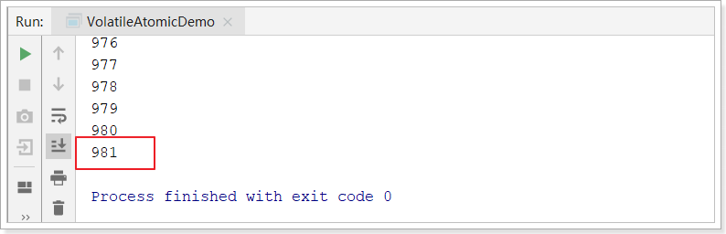

1000个线程执行++number操作，如果++number操作具备原子性，最后的值应该是1000。说明++number**不具备原子性**。

接下来，给number添加volatile关键字：

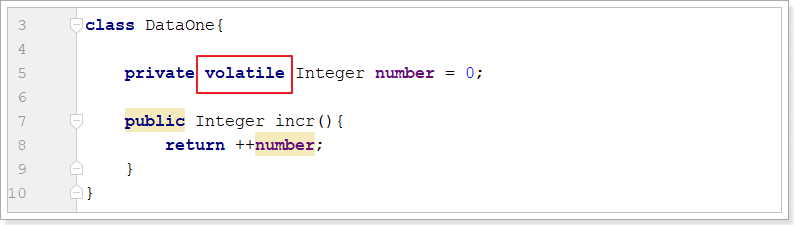

测试结果依然不是1000，如下：

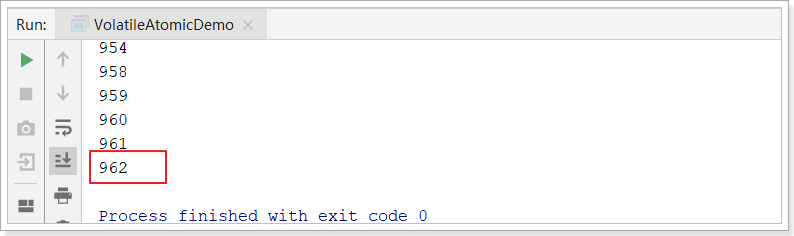

**说明volatile关键字不能保证原子性。**

给incr方法`添加同步锁`试试：

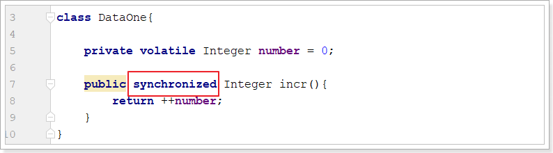

测试：

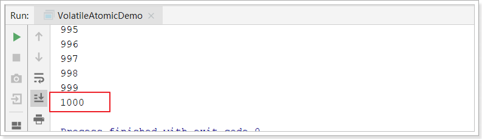

效果完美！

**总结：**`volatile`关键字只能保证单个变量的可见性，并不能解决原子性问题。对于原子性需求，需要使用更强大的同步机制，如锁、原子操作等。

## 9.3. CAS

### 9.3.1. 验证原子性

DataOne中的incr方法**不使用synchronized，如何保证多线程并发安全?**

**答案：**原子操作类

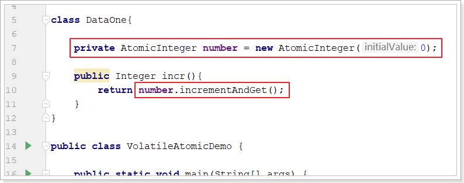

测试结果如下：

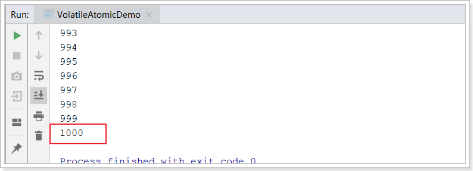

也很完美！ 

### 9.3.2. 原子类基本代码

在JUC下有个atomic包，有很多原子操作的包装类：

 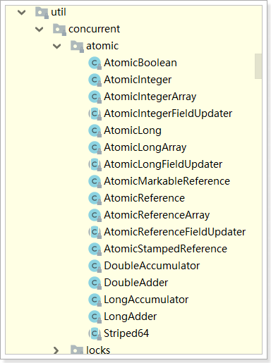

这里以AtomicInteger这个类来演示：

```java
public class AtomicDemo {

    public static void main(String[] args) {

        //乐观锁原理：比较和交换
        AtomicInteger i = new AtomicInteger(1);

        //比较当前值initialValue 1 和预期值expectedValue 1，相等，则将当前值换为新值
        System.out.println("第一次更新：" + i.compareAndSet(1, 200));
        System.out.println("第一次更新后i的值：" + i.get());

        System.out.println("第二次更新：" + i.compareAndSet(1, 300));
        System.out.println("第二次更新后i的值：" + i.get());

        System.out.println("第三次更新：" + i.compareAndSet(200, 300));
        System.out.println("第三次更新后i的值：" + i.get());

    }
}
```

输出结果如下：

```
第一次更新：true
第一次更新后i的值：200
第二次更新：false
第二次更新后i的值：200
第三次更新：true
第三次更新后i的值：300
```

结果分析：

```
第一次更新：i的值（1）和预期值（1）相同，所以执行了更新操作，把i的值更新为200
第二次更新：i的值（200）和预期值（1）不同，所以不再执行更新操作
第三次更新：i的值（200）和预期值（1）相同，所以执行了更新操作，把i的值更新为300
```

### 9.3.3. CAS

**CAS (Compare-and-Swap) 是一种原子操作指令，用于解决多线程并发安全问题。CAS 操作是一种乐观锁算法，它用于实现并发控制，特别是在多线程环境下。**因为它在对共享变量更新之前，会先比较当前值是否与更新前的值一致，如果一致则更新，如果不一致则重新获取共享变量的值，再次判断当前值是否与更新前的值一致，循环执行，直到当前值与更新前的值一致为止，才执行更新。

CAS操作有3个基本参数：内存地址V，旧值A，新值B。它的作用是将指定内存地址V的内容与所给的旧值A相比，如果相等，则将其内容替换为指令中提供的新值B；如果不等，则更新失败。

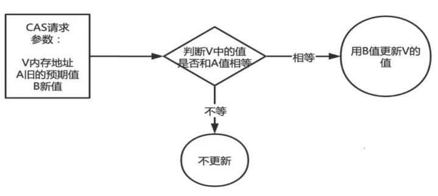

### 9.3.4. Unsafe

**compareAndSet**的源代码如下：

```java
public final boolean compareAndSet(int expectedValue, int newValue) {
    return U.compareAndSetInt(this, VALUE, expectedValue, newValue);
}

//以上代码的U：Unsafe提供硬件级别的原子操作
//这个类存在于jdk.internal.misc中，其内部方法可以像C、C++的指针一样，直接操作内存
private static final Unsafe U = Unsafe.getUnsafe();

//方法的VALUE参数：获取AtomicInteger类的value属性的偏移量（内存地址）
private static final long VALUE = U.objectFieldOffset(AtomicInteger.class, "value");

// U的compareAndSetInt方法：对象、对象的属性地址偏移量、预期值、修改值
public final native boolean compareAndSetInt(Object o, long offset,int expected, int x);
```

### 9.3.5. 缺点

**开销大**：在并发量比较高的情况下，如果反复尝试更新某个变量，却又一直更新不成功，会给CPU带来较大的压力。

 **不能保证代码块的原子性**：CAS机制所保证的只是一个变量的原子性操作，而不能保证整个代码块的原子性。

**ABA问题**：当变量从A修改为B再修改回A时，变量值等于期望值A，但是无法判断是否修改，CAS操作在ABA修改后依然成功。 

解决ABA思想：更新时候携带版本号 **AtomicStampedReference**

## 9.4. AQS

### 9.4.1. 什么是AQS

**AbstractQueuedSynchronizer**抽象队列同步器**简称AQS**，是整个java.util.concurrent包的核心。AQS框架提供了一套通用的机制来管理同步状态（synchronization state）、阻塞/唤醒线程、管理等待队列。

JUC下的Lock（ReentrantLock、ReentrantReadWriteLock等）以及并发工具类（Semaphore、CountDownLatch、CyclicBarrier等）就是通过AQS实现的

**AQS的基本思想：**

- **CLH同步队列**：全称是(Craig.Landin. and Haqersten)lock queue，用来存储被阻塞的线程信息，是一个FIFO（First-In-First-Out）双向队列。
  - FIFO：意味着等待时间最长的线程将首先获得锁或资源（公平锁排队）。
  - 双向队列：意味着允许多个线程同时从队列的两端进行插入、删除和查找操作（非公平锁插队）。

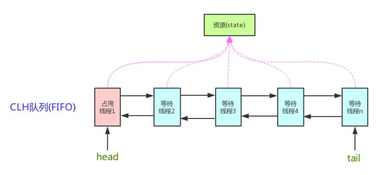

- **state 属性**：表示资源的状态

例如：

- 对于ReentrantLock来说，state=1，表示资源被占用；state=0，表示资源没有被占用。
- 对于CountDownLatch来说，state=0，表示计数器归零，所有线程都可以访问资源；state为N表示计数器未归零，所有线程都需要阻塞。

### 9.4.2. ReentrantLock底层原理

#### 9.4.2.1. 公平和非公平

公平锁指的是按照线程请求的顺序，来分配锁；而非公平锁指的是不完全按照请求的顺序，在一定情况下，可以允许插队。但需要注意这里的非公平并不是指完全的随机，**不是说线程可以任意插队，而是仅仅“在合适的时机”插队**。

那么什么时候是合适的时机呢？假设当前线程在请求获取锁的时候，恰巧前一个持有锁的线程释放了这把锁，那么当前申请锁的线程就可以不顾已经等待的线程而选择立刻插队。但是如果当前线程请求的时候，前一个线程并没有在那一时刻释放锁，那么当前线程还是一样会进入等待队列。

#### 9.4.2.2. ReentrantLock

接下来就以ReetrantLock为例，说明AQS在锁底层的应用。

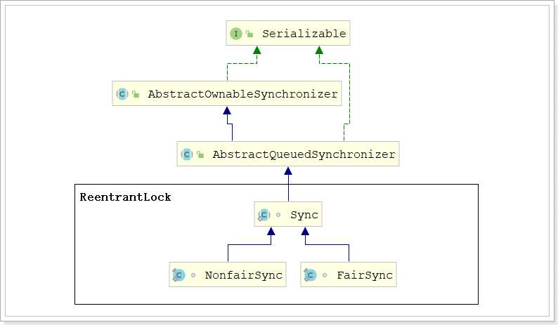

在ReentrantLock类中包含了3个AQS的实现类：

1. 抽象类Sync
2. 非公平锁实现类NonfaireSync
3. 公平锁实现类FairSync

在ReetrantLock的源码中可以发现：

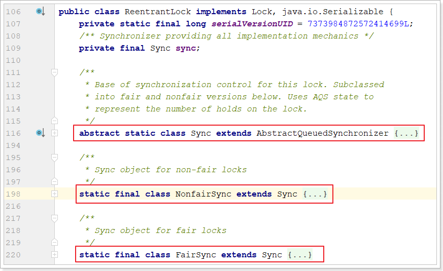

#### 9.4.2.3. 上锁

**调试非公平ReentrantLock的lock方法的源代码：**

（1）Sync抽象类：

```java
/**
 * 获取锁的操作，如果初始尝试获取锁失败，则进行阻塞式获取锁。
 */
final void lock() {
    if (!initialTryLock()) // 如果初始尝试获取锁失败
        acquire(1); // 获取锁
}
```

（2）NonfairSync：非公平锁的同步器子类

```java
/**
 * 初始尝试获取锁。
 * @return 如果成功获取锁，则返回true；否则返回false。
 */
final boolean initialTryLock() {
    Thread current = Thread.currentThread();
    if (compareAndSetState(0, 1)) { // 使用CAS机制将state设置为1
        setExclusiveOwnerThread(current); // 设置当前线程持有独占锁
        return true; // 成功获取锁
    } else if (getExclusiveOwnerThread() == current) { // 如果当前线程已经持有独占锁则重入
        int c = getState() + 1; // 获取当前状态，并增加1
        if (c < 0) // 状态不合法
            throw new Error("Maximum lock count exceeded"); // 抛出异常
        setState(c); // 设置新的状态值
        return true; // 成功获取锁
    } else
        return false; // 未能获取锁
}
```

（3）AbstractQueuedSynchronizer：AQS

```java
/**
 * 获取锁的操作。
 */
public final void acquire(int arg) {
    if (!tryAcquire(arg)) // 尝试直接获取锁，如果失败
        acquire(null, arg, false, false, false, 0L); // 获取锁
}
```

（4）NonfairSync：非公平锁的同步器子类

```java
/**
 * 尝试获取锁。
 * @return 如果成功获取锁，则返回true；否则返回false。
 */
protected final boolean tryAcquire(int acquires) {
    if (getState() == 0 && compareAndSetState(0, acquires)) { // 使用CAS机制将state设置为1
        setExclusiveOwnerThread(Thread.currentThread()); // 设置当前线程持有独占锁
        return true; // 成功获取锁
    }
    return false; // 未能获取锁
}
```

**调试公平锁：**

（1）FairSync：公平锁的同步器子类

```java
/**
 * 初始尝试获取锁的操作。
 * @return 如果成功获取锁，则返回true；否则返回false。
 */
final boolean initialTryLock() {
    Thread current = Thread.currentThread();
    int c = getState(); // 获取当前状态值
    if (c == 0) { // 当前状态为0，表示锁未被持有
        if (!hasQueuedThreads() && compareAndSetState(0, 1)) { // 没有等待的线程，使用CAS机制将state设置为1
            setExclusiveOwnerThread(current); // 设置当前线程持有独占锁
            return true; // 成功获取锁
        }
    } else if (getExclusiveOwnerThread() == current) { // 如果当前线程已经持有独占锁则重入
        if (++c < 0) // 状态不合法
            throw new Error("Maximum lock count exceeded"); // 抛出异常
        setState(c); // 设置新的状态值
        return true; // 成功获取锁
    }
    return false; // 未能获取锁
}
```

（2）FairSync：公平锁的同步器子类

```java
/**
 * 尝试获取锁的操作。
 * @return 如果成功获取锁，则返回true；否则返回false。
 */
protected final boolean tryAcquire(int acquires) {
    if (getState() == 0 && !hasQueuedPredecessors() &&
        compareAndSetState(0, acquires)) { // 当前状态为0，没有等待的前驱节点，使用CAS机制将state设置为1
        setExclusiveOwnerThread(Thread.currentThread()); // 将当前线程设置为独占所有者线程
        return true; // 成功获取锁
    }
    return false; // 未能获取锁
}
```

#### 9.4.2.3. 解锁

（1）AbstractQueuedSynchronizer：AQS

```java
/**
 * 释放锁的操作。
 * @return 如果成功释放锁，并且成功唤醒下一个等待线程，则返回true；否则返回false。
 */
public final boolean release(int arg) {
    if (tryRelease(arg)) { // 尝试释放锁
        signalNext(head); // 唤醒下一个等待线程
        return true; // 成功释放锁并唤醒下一个等待线程
    }
    return false; // 未能释放锁
}
```

（2）Sync抽象类：

```java
/**
 * 尝试释放锁的操作。
 * @return 如果成功释放锁并且锁完全释放，则返回true；否则返回false。
 */
@ReservedStackAccess
protected final boolean tryRelease(int releases) {
    int c = getState() - releases; // 减1
    if (getExclusiveOwnerThread() != Thread.currentThread())//当前线程未持有锁
        throw new IllegalMonitorStateException(); // 抛出异常
    boolean free = (c == 0); // 判断是否完全释放了锁
    if (free)
        setExclusiveOwnerThread(null); // 如果完全释放了锁，将独占所有者线程设置为null
    setState(c); // 更新状态值
    return free; // 返回是否完全释放了锁
}
```

（3）AbstractQueuedSynchronizer：AQS

```java
/**
 * 唤醒给定节点的后继节点（如果存在），并取消其WAITING状态
 * 当一个或多个线程被取消时，这可能无法唤醒一个合适的线程，但cancelAcquire确保活性。
 */
private static void signalNext(Node h) {
    Node s;
    if (h != null && (s = h.next) != null && s.status != 0) { // 如果头节点和它的后继节点都不为空，并且后继节点的状态不为0
        s.getAndUnsetStatus(WAITING); // 取消后继节点的WAITING状态
        LockSupport.unpark(s.waiter); // 唤醒后继节点所对应的线程
    }
}
```

**面试题：**

**AQS的底层原理：**AQS使用一个volatile成员变量state来表示锁是否已被持有，通过内置的FIFO队列存储被阻塞的线程。AQS使用CAS机制对state进行原子操作从而对state的值进行修改。如果state的值为0，表示锁未被持有，则将当前线程设置为工作线程（即获取到了锁），并将state的值设置为1，返回成功获取到锁。如果未能成功获取到锁，AQS先自旋获取锁，如果一直获取不到，则将当前获取不到锁的线程加入到FIFO队列中

### 9.4.3. 自旋锁

**自旋锁（spinlock）**：

是指当一个线程在获取锁的时候，如果锁已经被其它线程获取，那么该线程将循环等待，然后不断的判断锁是否能够被成功获取，直到获取到锁才会退出循环。

获取锁的线程一直处于活跃状态，但是并没有执行任何有效的任务，如果长时间使用这种锁会造成系统负载很大，耗费性能，阻止了其他线程的运行和调度。

自旋的线程保持旋转状态(反复尝试获取锁)，而持有该锁的线程并不打算释放锁，这样导致的是结果是无限期推迟，直到持有锁的线程可以完成并释放它为止。

```java
for(;;){

}

while(true){

}

do{
    
}while()
```

- 对于ReentrantLock来说，自旋的过程就是不断尝试 调用lock()的过程（使用CAS的方式修改state值）
- 对于原子操作类来说，自旋的过程就是比较和交换失败后再次尝试比较和交换的过程（CAS）

**优点：**

- **1.** 自旋锁尽可能的减少线程的阻塞，**这对于锁的竞争不激烈，且占用锁时间非常短的代码块来说性能能大幅度的提升，因为自旋的消耗会小于线程阻塞挂起再唤醒的操作的消耗** 
- 2.**不使用自旋，并且获取不到锁的时候直接进入阻塞状态** ，从而进入内核态，当获取到锁的时候需要从内核态恢复，这个会导致系统在用户态与内核态之间来回切换，严重影响锁的性能

**缺点：**

但是如果锁的竞争激烈，或者持有锁的线程需要长时间占用锁执行同步块，这时候就不适合使用自旋锁了，因为自旋锁在获取锁前一直都是占用 cpu 做无用功，线程自旋的消耗大于线程阻塞挂起操作的消耗，其它需要 cpu 的线程又不能获取到 cpu，造成 cpu 的浪费。所以这种情况下我们要关闭自旋锁。

# 10. 扩展

## 10.1 synchronized原理

### ①提出问题

```java
synchronized (this) {}
```

在这个语法结构中，我们总说this是锁对象，那如果this是锁的话，钥匙在哪呢？

其实这是一个思想误区，synchronized底层的工作机制并不是“用钥匙开锁”这样的模式，而是“小狗撒尿”：

- 小狗：申请锁的线程
- 小狗留下痕迹的地方：监视器对象

那this作为锁对象的作用是什么呢？底层代码执行时通过锁对象找到监视器对象，详细过程我们还要从头说起

### ②锁膨胀机制(锁升级)

#### [1]初衷

锁膨胀机制是 JDK1.6 引入的，在引入之前，线程申请锁都必须严格执行加锁、解锁这样的操作

但是其实，如果来申请锁的只有一个线程，那么没必要严格执行加锁、解锁

因为此时没有竞争，此时不执行加锁、解锁的操作就可以节约操作时间

#### [2]过程

- 无锁状态：没有线程来申请锁
- 偏向锁状态：只有一个线程来申请锁，<span style="color:blue;font-weight:bold;">没有竞争</span>，不需要做加锁、解锁的操作
  - 从无锁状态到当前状态，每次来申请锁的都是这同一个线程，中间没有别的线程来申请过
- 轻量级锁状态：只有一个线程来申请锁，<span style="color:blue;font-weight:bold;">没有竞争</span>，不需要做加锁、解锁的操作
  - 从上一个状态到现在状态，锁对象被不同线程申请过，只不过每次都是只有一个线程来申请
- 重量级锁状态：同时有多个线程来申请锁，<span style="color:blue;font-weight:bold;">有竞争</span>，需要做加锁、解锁的操作

#### [3]代码演示锁膨胀过程

锁状态的英文名称：

| 英文单词     | 含义解释                                                     |
| ------------ | ------------------------------------------------------------ |
| non-biasable | 不可偏向，意思是当前 JVM 没有开启偏向锁功能（此时锁的状态是无锁状态） |
| biasable     | 可偏向，意思是当前 JVM 开启了偏向锁功能（此时锁的状态是无锁状态） |
| biased       | 偏向锁                                                       |
| thin lock    | 轻量级锁                                                     |
| fat lock     | 重量级锁                                                     |

导入依赖（0.17 表示对应 JDK 17）：这个库可以帮助你分析Java对象的内存布局和大小。

```xml
<dependency>
    <groupId>org.openjdk.jol</groupId>
    <artifactId>jol-core</artifactId>
    <version>0.17</version>
</dependency>
```

设置 JVM 参数，开启偏向锁功能，立即开启：

```text
-XX:+UseBiasedLocking
-XX:BiasedLockingStartupDelay=0
```

附：临时设置 JVM 参数的操作方式如下

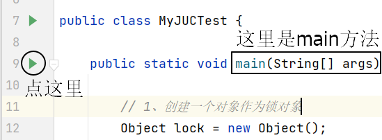

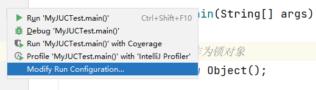

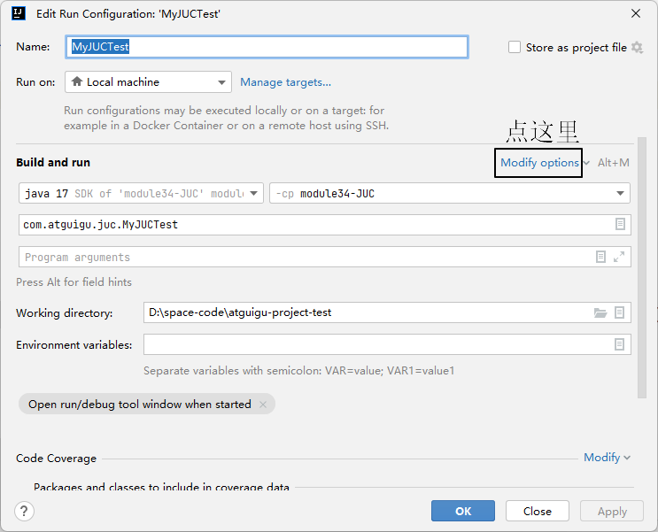

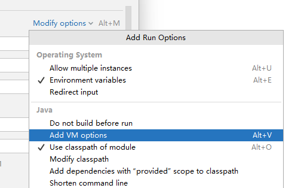

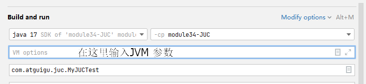

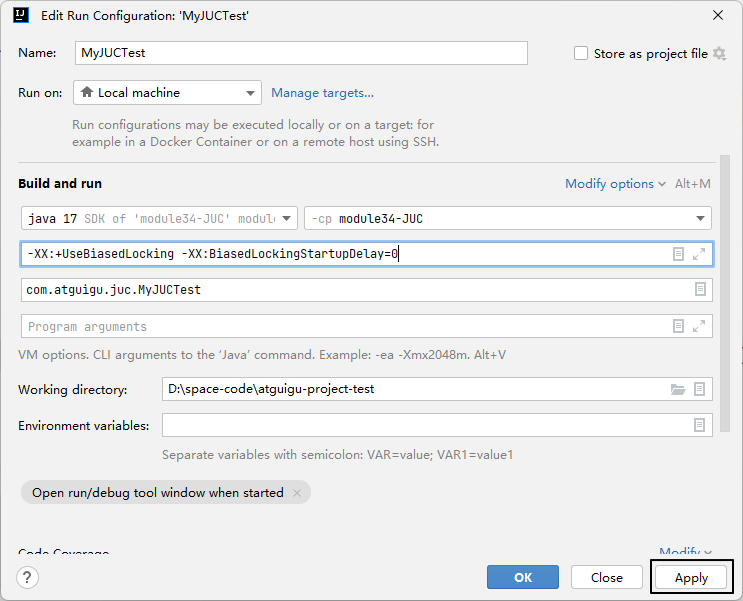

升级至轻量级锁的测试代码：

```java
// 1、创建一个对象作为锁对象
Object lock = new Object();

// 2、没有线程申请锁
System.out.println(ClassLayout.parseInstance(lock).toPrintable());

// 3、main 线程申请锁
synchronized (lock) {
    System.out.println(ClassLayout.parseInstance(lock).toPrintable());
}

// 4、创建子线程申请锁
new Thread(() -> {
    synchronized (lock) {
        System.out.println(ClassLayout.parseInstance(lock).toPrintable());
    }
}, "thread-a").start();
```

> java.lang.Object object internals:
> OFF  SZ   TYPE DESCRIPTION               VALUE
>   0   8        (object header: mark)     0x0000000000000005 (<span style="color:blue;">**biasable**</span>; age: 0)
>   8   4        (object header: class)    0x00000d58
>  12   4        (object alignment gap)    
> Instance size: 16 bytes
> Space losses: 0 bytes internal + 4 bytes external = 4 bytes total
>
> java.lang.Object object internals:
> OFF  SZ   TYPE DESCRIPTION               VALUE
>   0   8        (object header: mark)     0x000001469f8b2805 (<span style="color:blue;">**biased**</span>: 0x0000000051a7e2ca; epoch: 0; age: 0)
>   8   4        (object header: class)    0x00000d58
>  12   4        (object alignment gap)    
> Instance size: 16 bytes
> Space losses: 0 bytes internal + 4 bytes external = 4 bytes total
>
> java.lang.Object object internals:
> OFF  SZ   TYPE DESCRIPTION               VALUE
>   0   8        (object header: mark)     0x00000008065ff448 (<span style="color:blue;">**thin lock**</span>: 0x00000008065ff448)
>   8   4        (object header: class)    0x00000d58
>  12   4        (object alignment gap)    
> Instance size: 16 bytes
> Space losses: 0 bytes internal + 4 bytes external = 4 bytes total

升级至重量级锁的代码：

```java
// 1、创建一个对象作为锁对象
Object lock = new Object();

// 2、没有线程申请锁
System.out.println(ClassLayout.parseInstance(lock).toPrintable());

// 3、main 线程申请锁
synchronized (lock) {
    System.out.println(ClassLayout.parseInstance(lock).toPrintable());
}

// 4、创建两个线程申请锁
new Thread(() -> {
    synchronized (lock) {
        while (true) {
        }
    }
}, "thread-a").start();

new Thread(() -> {
    synchronized (lock) {
        while (true) {
        }
    }
}, "thread-b").start();

TimeUnit.SECONDS.sleep(1);

System.out.println(ClassLayout.parseInstance(lock).toPrintable());
```

> java.lang.Object object internals:
> OFF  SZ   TYPE DESCRIPTION               VALUE
>   0   8        (object header: mark)     0x0000000000000005 (<span style="color:blue;">**biasable**</span>; age: 0)
>   8   4        (object header: class)    0x00000d58
>  12   4        (object alignment gap)    
> Instance size: 16 bytes
> Space losses: 0 bytes internal + 4 bytes external = 4 bytes total
>
> java.lang.Object object internals:
> OFF  SZ   TYPE DESCRIPTION               VALUE
>   0   8        (object header: mark)     0x0000029f98ea6005 (<span style="color:blue;">**biased**</span>: 0x00000000a7e63a98; epoch: 0; age: 0)
>   8   4        (object header: class)    0x00000d58
>  12   4        (object alignment gap)    
> Instance size: 16 bytes
> Space losses: 0 bytes internal + 4 bytes external = 4 bytes total
>
> java.lang.Object object internals:
> OFF  SZ   TYPE DESCRIPTION               VALUE
>   0   8        (object header: mark)     0x0000029fc74ed562 (<span style="color:blue;">**fat lock**</span>: 0x0000029fc74ed562)
>   8   4        (object header: class)    0x00000d58
>  12   4        (object alignment gap)    
> Instance size: 16 bytes
> Space losses: 0 bytes internal + 4 bytes external = 4 bytes total

### ③对象存储结构

#### [1]概述

接下来我们试着来回答这个问题：从锁对象出发，是如何一步一步找到监视器对象的？

为了回答这个问题，我们来看看对象存储结构

现在我们都知道了对象（包括数组）都是放在堆内存中，那么对象在堆内存中保存时的数据结构是什么样子的呢？

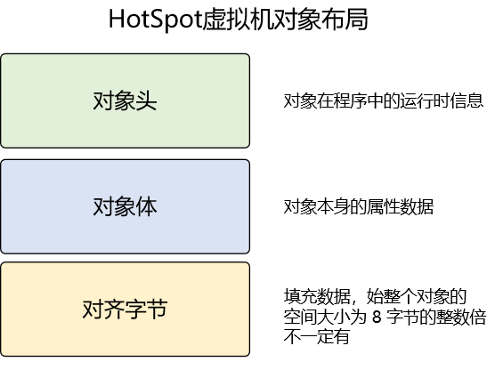

而为了回答“锁对象如何找到监视器对象”这个问题，我们需要进一步关注对象头的内部结构：

- 非数组对象
  - Mark Word
  - 类型指针
- 数组
  - Mark Word
  - 类型指针
  - 数组长度

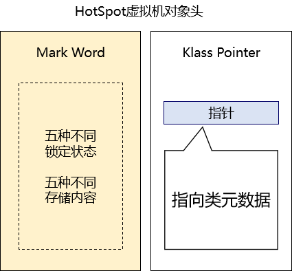

#### [2]Mark Word

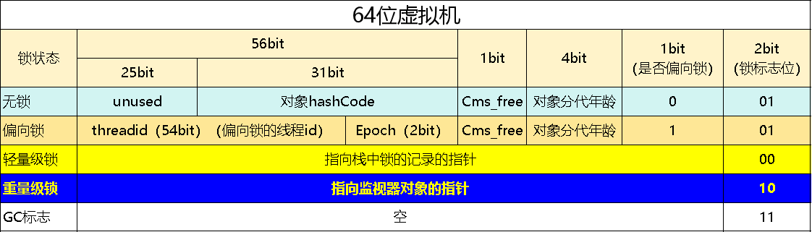

 **[Epoch](https://www.baidu.com/s?rsv_dl=re_dqa_generate&sa=re_dqa_generate&wd=Epoch&rsv_pq=bd54e4d2000001b6&oq=Epoch 再偏向锁中表示什么&rsv_t=b4b4y0ZnpvCOzuRnNr6XVY/HMmSvIYSQ3bMrBjhoLB6uTvUS+rLdcfFyEMw&tn=baidu&ie=utf-8)在偏向锁中表示一个时间戳，用于记录偏向锁的持有时间。** 

锁的优缺点的对比：

| 锁       | 优点                                                         | 缺点                                          | 适用场景                                            |
| -------- | ------------------------------------------------------------ | --------------------------------------------- | --------------------------------------------------- |
| 偏向锁   | 加锁和解锁不需要额外的消耗，和执行非同步方法相比仅存在纳秒级的差距 | 如果线程间存在竞争，会带来额外的锁撤销的消耗  | 适用于只有一个线程访问同步块场景                    |
| 轻量级锁 | 竞争的线程不会阻塞，提高了程序的响应速度                     | 如果始终得不到锁竞争的线程，使用自旋会消耗CPU | 追求响应时间，                同步块执行速度非常快  |
| 重量级锁 | 线程竞争不使用自旋，不会消耗CPU                              | 线程阻塞，响应时间缓慢                        | 追求吞吐量，                     同步块执行速度较长 |

#### [3]举例打印对象结构

对象结构：

```java
public class Student {
    
    private Integer stuId;
    private String stuName;
    private Integer stuAge;
```

测试代码：

```java
// 1、创建对象
Student student = new Student(5, "tom green", 65);

// 2、打印对象结构分析结果
System.out.println(ClassLayout.parseInstance(student).toPrintable());
```

下面分析打印结果：

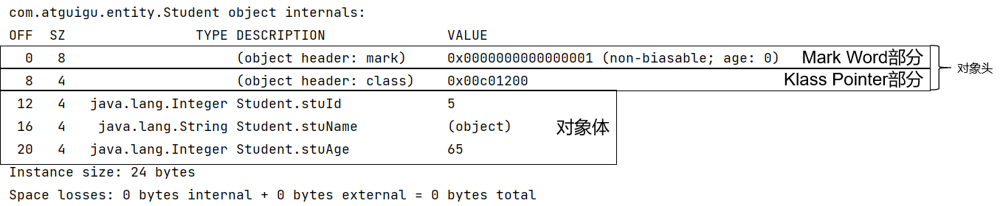

再看一下Mark Word的具体值：

- 0x0000000000000001开头的0x说明这是十六进制表示的
- 十六进制转换为二进制后，最后一个字节的内容是：0000 0001，说明是无锁状态


再结合前面锁膨胀的测试代码分析一下：

- 偏向锁时
  - Mark Word值举例：0x000001e768875805
  - 十六进制转换为二进制后，最后一个字节的内容是：0000 0101


- 轻量级锁时
  - Mark Word值举例：0x00000009b27ff1b8
  - 十六进制转换为二进制后，最后一个字节的内容是：1011 1000
  - 最后两位是锁标识位，00表示轻量级锁
- 重量级锁时
  - Mark Word值举例：0x00000199fe841872
  - 十六进制转换为二进制后，最后一个字节的内容是：0111 0010
  - 最后两位是锁标识位，10表示重量级锁

### ④锁重入机制

#### [1]概念

同步锁发生了多层嵌套：

```java
synchroinized (this) {
    synchroinized (this) {
    
    }
}
```

#### [2]举例证明存在的意义

```java
public void method01() {
    // 包含同步代码块的方法调用另一个包含同步代码块的方法，导致同步代码块简介嵌套
    synchronized (this) {
        method02();
    }
}

public void method02() {
    synchronized (this) {
        // 如果根据业务的需要，当前方法确实需要加 synchronized，那么就不应该去掉
        // 因为外界调用当前方法未必会提供 synchronized 保证
    }
}

public void method03() {
    method02();
}
```

#### [3]为什么要支持锁重入？

同一个线程，在外层synchronized得到锁之后，执行同步代码的过程中，又遇到了同一个锁对象的synchronized，
此时系统必须允许这个线程继续得到锁，否则程序无法继续执行

### ⑤锁操作字节码指令

#### [1]测试代码

```java
public class CodeAnalyze {

    public void doSth() {
        synchronized (this) {

        }
    }

    public static void main(String[] args) {
        System.out.println("先运行一下 main 方法以确保当前类编译.....");
    }
}
```

#### [2]分析字节码文件

在编译得到的字节码文件所在目录运行如下命令：

```shell
javap -c .\CodeAnalyze.class
```

#### [3]两个指令

- 加锁操作对应的字节码指令：<span style="color:blue;font-weight:bolder;">monitor</span><span style="color:red;font-weight:bolder;">enter</span>
- 解锁操在对应的字节码指令：<span style="color:blue;font-weight:bolder;">monitor</span><span style="color:red;font-weight:bolder;">exit</span>

> <span style="color:blue;font-weight:bolder;">monitor</span><span style="color:red;font-weight:bolder;">exit</span>出现两次是为了确保锁被释放，避免因为抛异常等原因导致锁释放操作没有执行

### ⑥具体加锁解锁流程

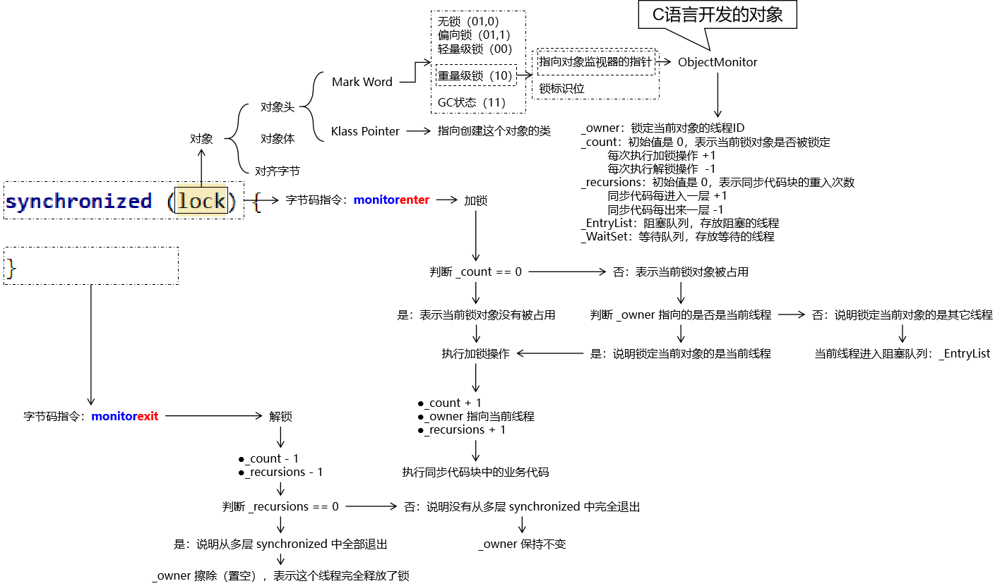

## 10.2 HashMap原理

画图讲原理，有选择的看源码

- 散列的查询速度比List快
- 以HashMap的put(key, value)方法为例，流程如下：
  - 第一步：计算key的hash值
  - 第二步：hash值对数组长度取模，取模结果就是存储位置的数组下标
  - 第三步：看数组下标位置是否有数据
    - 无数据：直接存放到该位置
    - 有数据：调用key的equals()方法
      - 相等：说明是同一个key，进行覆盖
      - 不相等：说明不同key值发生了hash碰撞
        - 数据少：用链表
        - 数据多：红黑树

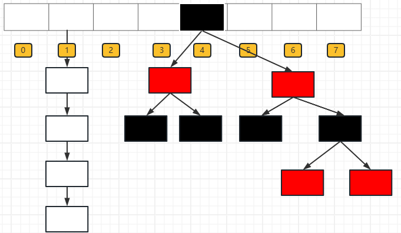

- 链表转换为红黑树的两个必须同时满足的条件：
  - 条件1：链表长度大于8
  - 条件2：数组长度大于等于64（说明经历了至少两次扩容）

## 10.3 ConcurrentHashMap原理

画图讲原理，有选择的看源码

大体思路：仅针对数组的某个区间段加锁，更细粒度的锁，会让并发性能更高

### 10.3.1 对比同步容器Map

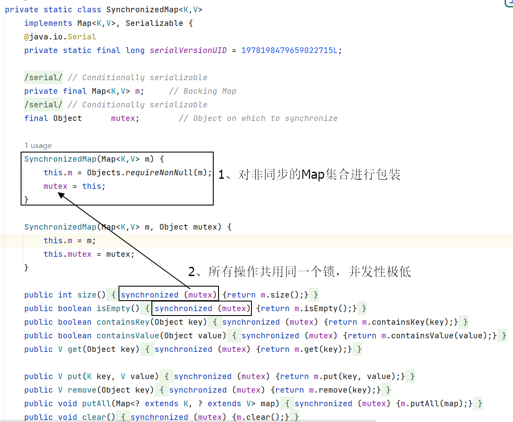

### 10.3.2 ConcurrentHashMap

#### ①原理图

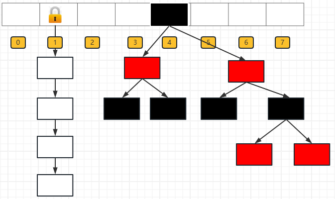

#### ②核心源码

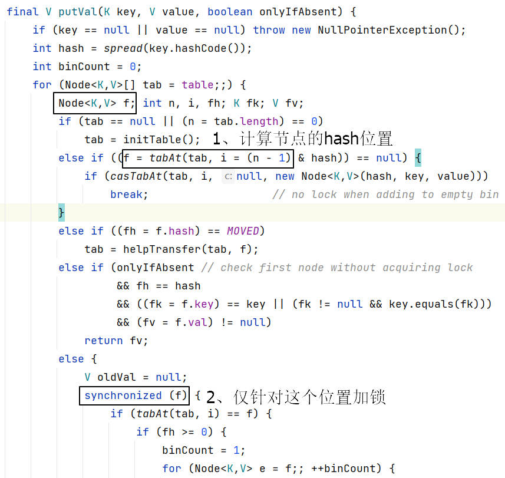

#### ③AI工具为源码附加的注释

```java
    /**
     * 插入键值对到哈希表中。如果key或value为null，会抛出NullPointerException。
     * 如果onlyIfAbsent为true，则只有在键不存在时才插入值；否则总会插入值。
     * 返回值为旧的值，如果键不存在或者onlyIfAbsent为true且插入了新值，则返回null。
     *
     * 此方法在并发环境下通过CAS操作和同步块来保证线程安全。
     * 在插入过程中，如果发现哈希表需要扩容或者当前节点需要转换为树节点，则会进行相应的操作。
     *
     * @param key 键
     * @param value 值
     * @param onlyIfAbsent 只有在键不存在时才插入值
     * @return 旧的值，如果不存在则为null
     */
    final V putVal(K key, V value, boolean onlyIfAbsent) {
        // 检查key或value是否为null
        if (key == null || value == null) throw new NullPointerException();
        // 计算哈希值
        int hash = spread(key.hashCode());
        // 用于统计在一个bin中节点的数量
        int binCount = 0;
        // 循环处理，直到成功插入节点
        for (Node<K,V>[] tab = table;;) {
            Node<K,V> f; int n, i, fh; K fk; V fv;
            // 如果table为空，初始化table
            if (tab == null || (n = tab.length) == 0)
                tab = initTable();
            // 如果当前位置为空，尝试使用CAS插入新节点
            else if ((f = tabAt(tab, i = (n - 1) & hash)) == null) {
                if (casTabAt(tab, i, null, new Node<K,V>(hash, key, value)))
                    break;                   // no lock when adding to empty bin
            }
            // 如果当前位置的节点正在被移动（可能是扩容操作），则帮助完成移动操作
            else if ((fh = f.hash) == MOVED)
                tab = helpTransfer(tab, f);
            // 如果onlyIfAbsent为true且当前节点就是我们要插入的节点，则直接返回旧值
            else if (onlyIfAbsent && fh == hash
                     && ((fk = f.key) == key || (fk != null && key.equals(fk)))
                     && (fv = f.val) != null)
                return fv;
            // 处理节点存在但不满足onlyIfAbsent条件的情况，或者节点是链表或树形节点的情况
            else {
                V oldVal = null;
                synchronized (f) {
                    // 再次检查节点是否仍然在当前位置
                    if (tabAt(tab, i) == f) {
                        // 链表或树形节点的插入处理
                        if (fh >= 0) {
                            binCount = 1;
                            for (Node<K,V> e = f;; ++binCount) {
                                K ek;
                                // 找到要插入或替换的节点
                                if (e.hash == hash &&
                                    ((ek = e.key) == key ||
                                     (ek != null && key.equals(ek)))) {
                                    oldVal = e.val;
                                    // 如果不是onlyIfAbsent，则更新节点值
                                    if (!onlyIfAbsent)
                                        e.val = value;
                                    break;
                                }
                                Node<K,V> pred = e;
                                // 遍历到链表尾部，插入新节点
                                if ((e = e.next) == null) {
                                    pred.next = new Node<K,V>(hash, key, value);
                                    break;
                                }
                            }
                        }
                        // 树形节点的插入处理
                        else if (f instanceof TreeBin) {
                            Node<K,V> p;
                            binCount = 2;
                            if ((p = ((TreeBin<K,V>)f).putTreeVal(hash, key,
                                                           value)) != null) {
                                oldVal = p.val;
                                if (!onlyIfAbsent)
                                    p.val = value;
                            }
                        }
                        // 发现递归更新操作，抛出异常
                        else if (f instanceof ReservationNode)
                            throw new IllegalStateException("Recursive update");
                    }
                }
                // 如果节点数量达到树化条件，转换为树形节点
                if (binCount != 0) {
                    if (binCount >= TREEIFY_THRESHOLD)
                        treeifyBin(tab, i);
                    // 返回旧值，如果存在
                    if (oldVal != null)
                        return oldVal;
                    break;
                }
            }
        }
        // 更新元素计数，并根据需要进行扩容或树化操作
        addCount(1L, binCount);
        return null;
    }
```
