# Java 多线程 

---

## 一、多线程基础概念

### 1.1 进程与线程

| 概念     | 说明                           |
|--------|------------------------------|
| **进程** | 在内存中正在执行的应用程序，是操作系统分配资源的基本单位 |
| **线程** | 进程中最小的执行单元，负责程序的具体运行         |

> 一个进程至少有一个线程（主线程），一个进程中可以有多个线程，称为**多线程程序**。  
> 简单理解：**一个功能就需要一条线程去执行**。

**使用场景：**

- 耗时操作：拷贝大文件、加载大量资源
- 所有的聊天软件（同时收发消息）
- 所有的后台服务器（同时处理多个客户端请求）

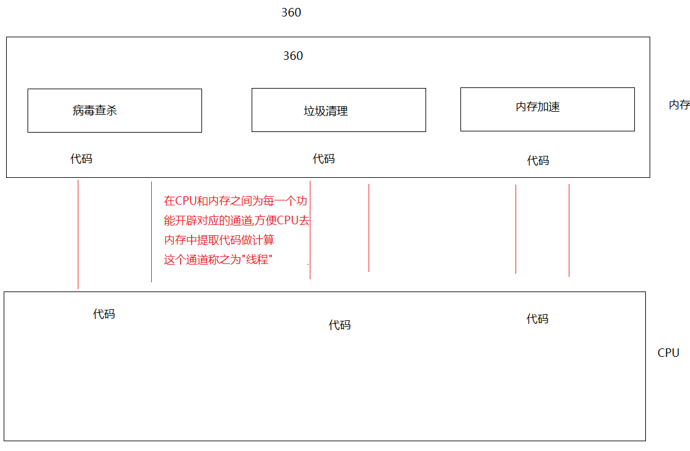

---

### 1.2 并发与并行

| 概念                 | 说明                             | 类比         |
|--------------------|--------------------------------|------------|
| **并行（Parallel）**   | 同一时刻，多个线程在**多个 CPU** 上**同时**执行 | 多个厨师同时炒多个菜 |
| **并发（Concurrent）** | 同一时刻，多个线程在**单个 CPU** 上**交替**执行 | 一个厨师交替炒多个菜 |

> 💡 现代 CPU 为多核多线程（如 2 核 4 线程），在线程数 ≤ CPU 线程数时可纯并行执行；超出时并行与并发同时存在。

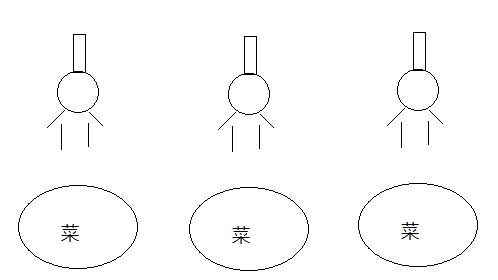

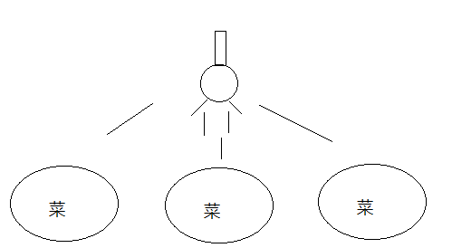

---

### 1.3 CPU 调度策略

| 策略        | 说明                              |
|-----------|---------------------------------|
| **分时调度**  | 所有线程轮流获取 CPU 使用权，平均分配时间片        |
| **抢占式调度** | 多个线程轮流**抢占** CPU，优先级高的线程抢到的概率更大 |

> ☑️ **Java 程序使用抢占式调度策略**。

---

### 1.4 主线程

```
主线程：CPU 与内存之间专门为 main() 方法服务的线程
```

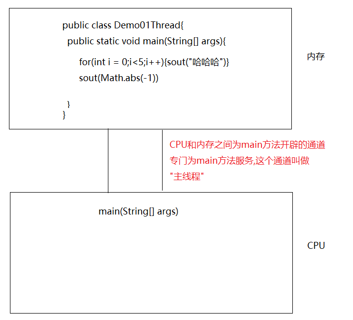

---

## 二、创建线程的四种方式

### 2.1 方式一：继承 Thread 类

**步骤：**

1. 定义一个类，继承 `Thread`
2. 重写 `run()` 方法，设置线程任务
3. 创建自定义线程对象
4. 调用 `start()` 方法开启线程（JVM 自动调用 `run()`）

```java
// 自定义线程类
public class MyThread extends Thread {
    @Override
    public void run() {
        for (int i = 0; i < 10; i++) {
            System.out.println(Thread.currentThread().getName() + "...执行了" + i);
        }
    }
}
```

```java
// 测试类
public class Test01 {
    public static void main(String[] args) {
        MyThread t1 = new MyThread();
        t1.start(); // 开启线程，JVM 自动调用 run()

        for (int i = 0; i < 10; i++) {
            System.out.println("main 线程执行了" + i);
        }
    }
}
```

> ⚠️ **注意：**
> - `start()` 与 `run()` 的区别：`start()` 开启新线程，`run()` 只是普通方法调用，不会开启新线程。
> - 同一个线程对象**不能重复调用** `start()`，如需再次开启，需 `new` 一个新对象。
> - 重写的 `run()` 方法中有异常**只能 try-catch，不能 throws**，原因是父类 `Thread` 的 `run()` 没有声明抛出异常。

**内存运行原理：**

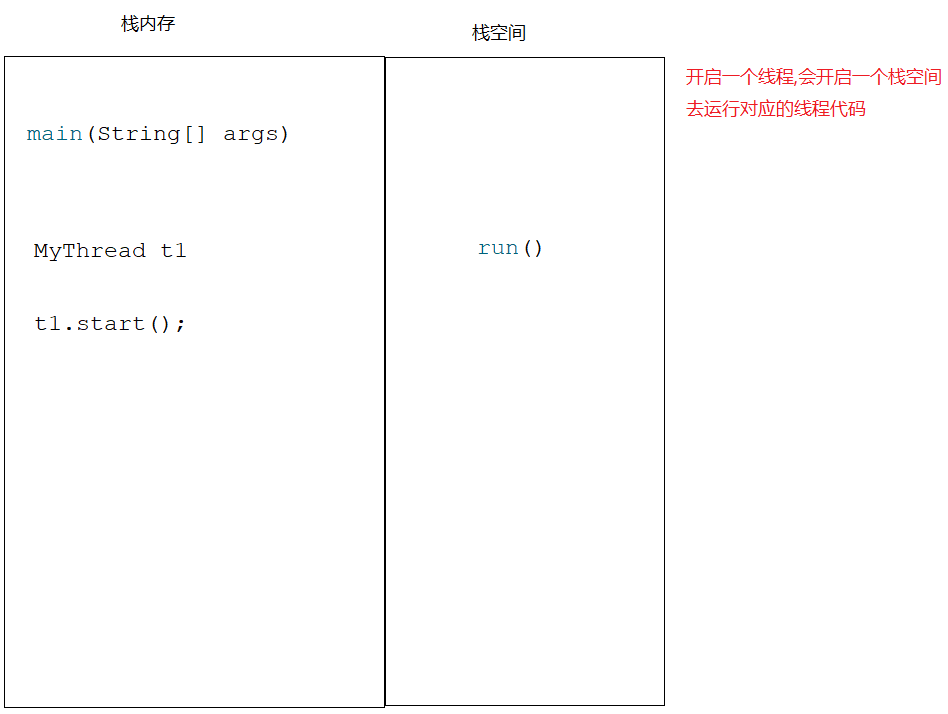

---

### 2.2 方式二：实现 Runnable 接口

**步骤：**

1. 创建类，实现 `Runnable` 接口
2. 重写 `run()` 方法，设置线程任务
3. 创建自定义类对象，通过 `Thread(Runnable target)` 构造方法传入
4. 调用 `start()` 方法开启线程

```java
// 实现 Runnable 接口
public class MyRunnable implements Runnable {
    @Override
    public void run() {
        for (int i = 0; i < 10; i++) {
            System.out.println(Thread.currentThread().getName() + "...执行了" + i);
        }
    }
}
```

```java
// 测试类
public class Test01 {
    public static void main(String[] args) {
        MyRunnable myRunnable = new MyRunnable();
        Thread t1 = new Thread(myRunnable);
        t1.start();

        for (int i = 0; i < 10; i++) {
            System.out.println(Thread.currentThread().getName() + "...执行了" + i);
        }
    }
}
```

---

### 2.3 方式三：匿名内部类（基于 Runnable）

> 严格来说，匿名内部类方式建立在实现 Runnable 接口的基础上，是一种简化写法。

```java
public class Test02 {
    public static void main(String[] args) {
        // 方式1：匿名内部类
        new Thread(new Runnable() {
            @Override
            public void run() {
                for (int i = 0; i < 10; i++) {
                    System.out.println(Thread.currentThread().getName() + "...执行了" + i);
                }
            }
        }, "线程A").start();

        // 方式2：Lambda 表达式（JDK8+，推荐）
        new Thread(() -> {
            for (int i = 0; i < 10; i++) {
                System.out.println(Thread.currentThread().getName() + "...执行了" + i);
            }
        }, "线程B").start();
    }
}
```

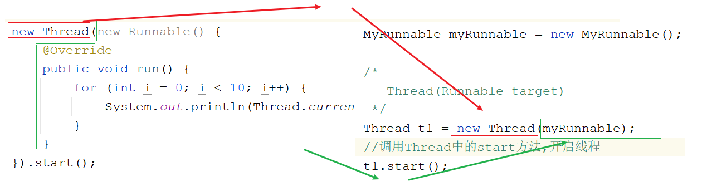

---

### 2.4 继承 Thread 与实现 Runnable 的对比

| 对比项      | 继承 Thread     | 实现 Runnable           |
|----------|---------------|-----------------------|
| **继承限制** | Java 单继承，有局限性 | 无继承限制，可同时继承其他类        |
| **数据共享** | 每个线程对象独立      | 多个线程可共享同一 Runnable 实例 |
| **推荐程度** | 不推荐（有局限）      | ✅ 推荐                  |

---

## 三、Thread 类常用方法

### 3.1 基础方法

| 方法签名                             | 说明                              |
|----------------------------------|---------------------------------|
| `void start()`                   | 开启线程，JVM 自动调用 `run()`           |
| `void run()`                     | 设置线程任务（重写此方法）                   |
| `String getName()`               | 获取线程名称（默认 Thread-0、Thread-1...） |
| `void setName(String name)`      | 设置线程名称                          |
| `static Thread currentThread()`  | 获取当前正在执行的线程对象                   |
| `static void sleep(long millis)` | 线程睡眠（毫秒），超时自动唤醒                 |

```java
public class MyThread extends Thread {
    @Override
    public void run() {
        for (int i = 0; i < 10; i++) {
            try {
                Thread.sleep(1000L); // 每次执行间隔 1 秒
            } catch (InterruptedException e) {
                throw new RuntimeException(e);
            }
            System.out.println(Thread.currentThread().getName() + "...执行了" + i);
        }
    }
}
```

```java
public class Test01 {
    public static void main(String[] args) throws InterruptedException {
        MyThread t1 = new MyThread();
        t1.setName("金莲");
        t1.start();

        for (int i = 0; i < 10; i++) {
            Thread.sleep(1000L);
            System.out.println(Thread.currentThread().getName() + "线程执行了" + i);
        }
    }
}
```

---

### 3.2 进阶方法

| 方法签名                                | 说明                 |
|-------------------------------------|--------------------|
| `void setPriority(int newPriority)` | 设置线程优先级（1~10，默认 5） |
| `int getPriority()`                 | 获取线程优先级            |
| `void setDaemon(boolean on)`        | 设置为守护线程            |
| `static void yield()`               | 礼让线程，让出当前 CPU 使用权  |
| `void join()`                       | 插队线程，等待该线程执行完毕再继续  |

#### 线程优先级

```java
// 优先级常量
Thread.MIN_PRIORITY  =1  // 最小优先级
Thread.NORM_PRIORITY =5  // 默认优先级
Thread.MAX_PRIORITY  =10 // 最大优先级

        t1.

setPriority(1);  // 设置低优先级
t2.

setPriority(10); // 设置高优先级
```

> ⚠️ 优先级高的线程抢到 CPU 的**概率更大**，但并不保证一定先执行。

---

#### 守护线程

```java
t2.setDaemon(true); // 将 t2 设置为守护线程
t1.

start();
t2.

start();
```

> 当所有**非守护线程**执行完毕后，守护线程会自动终止（但不会立刻停止，会在通知后执行一小段后结束）。  
> **典型应用：** GC 垃圾回收线程就是守护线程。

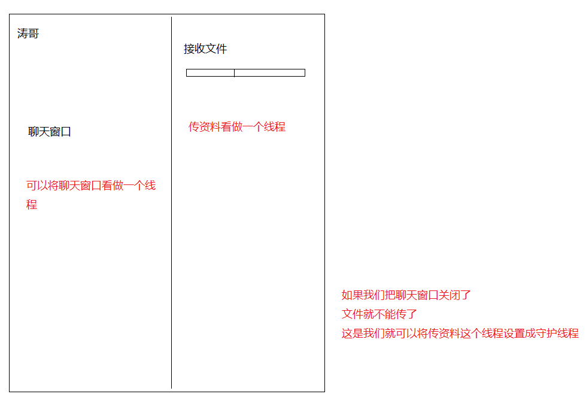

---

#### 礼让线程 yield()

```java
public class MyThread1 extends Thread {
    @Override
    public void run() {
        for (int i = 0; i < 10; i++) {
            System.out.println(Thread.currentThread().getName() + "执行了......" + i);
            Thread.yield(); // 礼让，让其他线程有机会执行
        }
    }
}
```

> ⚠️ `yield()` 只是**尽可能**让两个线程交替执行，并不能保证绝对交替（礼让后有可能还是自己抢到 CPU）。

---

#### 插队线程 join()

```java
public class Test01 {
    public static void main(String[] args) throws InterruptedException {
        MyThread1 t1 = new MyThread1();
        t1.setName("金莲");
        t1.start();

        t1.join(); // 等待 t1 线程执行完毕，main 线程才继续执行

        for (int i = 0; i < 10; i++) {
            System.out.println(Thread.currentThread().getName() + "执行了......" + i);
        }
    }
}
```

> `join()` 效果：让调用该方法的线程（t1）优先执行，当前线程（main）等待其执行完成后再继续。

---

## 四、线程安全

### 4.1 线程不安全的原因

当**多个线程同时访问共享资源**时，由于 CPU 在多个线程之间高速切换，可能导致数据错乱。

```java
// 不安全的卖票示例
public class MyTicket implements Runnable {
    int ticket = 100;

    @Override
    public void run() {
        while (true) {
            if (ticket > 0) {
                System.out.println(Thread.currentThread().getName() + "买了第" + ticket + "张票");
                ticket--;
            }
        }
    }
}
```

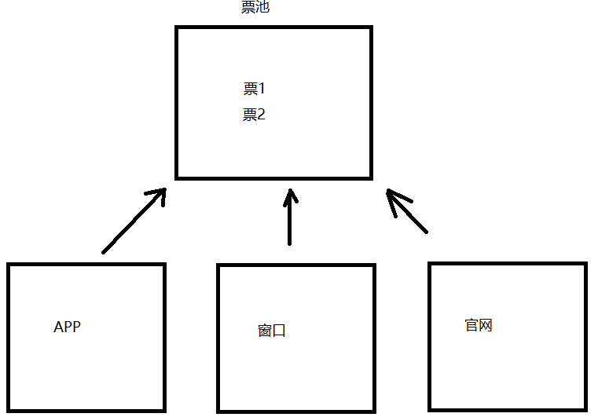

---

### 4.2 解决方案一：同步代码块

```java
// 格式
synchronized(锁对象){
        // 可能出现线程安全问题的代码
        }
```

**执行过程：**

1. 一个线程拿到锁后进入同步代码块执行
2. 其他线程拿不到锁，在外部等待
3. 执行完毕，退出同步代码块，释放锁
4. 等待的线程抢锁，进入同步代码块执行

```java
public class MyTicket implements Runnable {
    int ticket = 100;
    Object obj = new Object(); // 锁对象（多个线程必须共享同一把锁）

    @Override
    public void run() {
        while (true) {
            try {
                Thread.sleep(100L);
            } catch (InterruptedException e) {
                throw new RuntimeException(e);
            }
            synchronized (obj) {
                if (ticket > 0) {
                    System.out.println(Thread.currentThread().getName() + "买了第" + ticket + "张票");
                    ticket--;
                }
            }
        }
    }
}
```

> ⚠️ **锁对象必须是多个线程共享的同一个对象**，否则无法起到同步效果。

---

### 4.3 解决方案二：同步方法

#### 非静态同步方法（默认锁：this）

```java
// 格式
public synchronized void 方法名() {
    // 方法体
}

// 等价于
public void 方法名() {
    synchronized (this) {
        // 方法体
    }
}
```

```java
public class MyTicket implements Runnable {
    int ticket = 100;

    @Override
    public void run() {
        while (true) {
            try {
                Thread.sleep(100L);
            } catch (InterruptedException e) {
                throw new RuntimeException(e);
            }
            sellTicket();
        }
    }

    public synchronized void sellTicket() {
        if (ticket > 0) {
            System.out.println(Thread.currentThread().getName() + "买了第" + ticket + "张票");
            ticket--;
        }
    }
}
```

#### 静态同步方法（默认锁：class 对象）

```java
// 格式
public static synchronized void 方法名() {
    // 方法体
}

// 等价于
public static void 方法名() {
    synchronized (MyTicket.class) {
        // 方法体
    }
}
```

---

### 4.4 三种同步方式对比

| 方式      | 锁对象        | 特点          |
|---------|------------|-------------|
| 同步代码块   | 任意指定对象     | 灵活，可控粒度     |
| 非静态同步方法 | `this`     | 简洁，对整个方法加锁  |
| 静态同步方法  | `类名.class` | 类级别锁，影响所有实例 |

---

## 五、死锁（了解）

### 5.1 什么是死锁

**死锁：** 两个或多个线程在执行过程中，因互相等待对方持有的锁而陷入永久阻塞的状态。

> **根本原因：锁嵌套**（在持有一个锁的情况下，还去申请另一个锁）

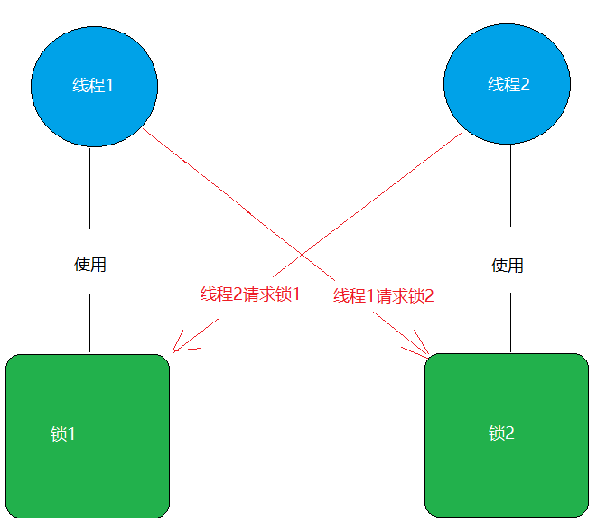

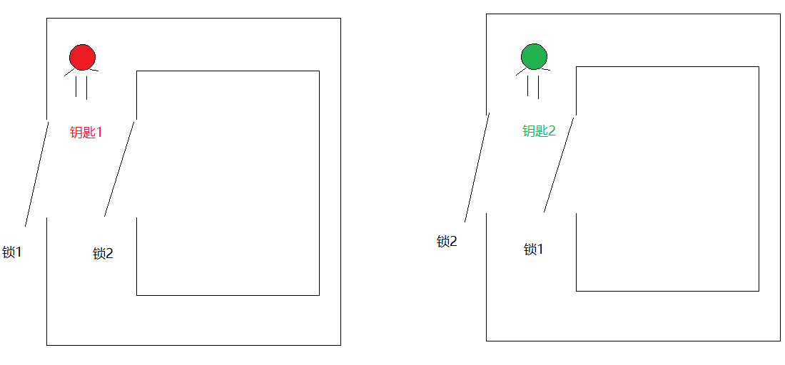

### 5.2 死锁代码示例

```java
public class DieLock implements Runnable {
    private boolean flag;

    public DieLock(boolean flag) {
        this.flag = flag;
    }

    @Override
    public void run() {
        if (flag) {
            synchronized (LockA.lockA) {
                System.out.println("if...lockA");
                synchronized (LockB.lockB) {  // 等待 lockB
                    System.out.println("if...lockB");
                }
            }
        } else {
            synchronized (LockB.lockB) {
                System.out.println("else...lockB");
                synchronized (LockA.lockA) {  // 等待 lockA
                    System.out.println("else...lockA");
                }
            }
        }
    }
}
```

### 5.3 如何避免死锁

- **尽量避免锁嵌套**
- 使用**固定的锁获取顺序**（所有线程按相同顺序加锁）
- 使用 `tryLock()` 方法设置超时（Lock 接口提供）
- 使用更高级的并发工具（如 `java.util.concurrent` 包中的类）

---

## 六、线程状态

### 6.1 六种线程状态（Java API）

| 状态                      | 描述                                                 |
|-------------------------|----------------------------------------------------|
| **NEW（新建）**             | 线程对象已创建，还未调用 `start()`                             |
| **RUNNABLE（可运行）**       | 调用 `start()` 后，可能正在运行，也可能在等待 CPU 调度                |
| **BLOCKED（锁阻塞）**        | 试图获取一个被其他线程持有的对象锁时进入此状态                            |
| **WAITING（无限等待）**       | 调用 `wait()` 后等待唤醒，必须由其他线程调用 `notify()/notifyAll()` |
| **TIMED_WAITING（计时等待）** | 调用 `sleep(long)` 或 `wait(long)` 等带超时参数的方法          |
| **TERMINATED（终止）**      | `run()` 方法执行完毕或因异常终止                               |

### 6.2 线程状态转换图

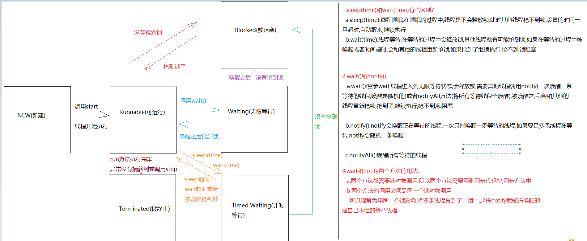

---

## 七、等待唤醒机制（生产者-消费者）

### 7.1 相关方法

> 以下方法定义在 `Object` 类中，必须在**同步代码块**中调用，且必须使用**同一把锁**。

| 方法                 | 说明                                  |
|--------------------|-------------------------------------|
| `void wait()`      | 线程等待，**释放锁**，需被其他线程调用 `notify()` 唤醒 |
| `void notify()`    | 唤醒**一个**等待线程（多个等待时随机唤醒）             |
| `void notifyAll()` | 唤醒**所有**等待线程                        |

> ⚠️ **wait() 与 sleep() 的重要区别：**
> - `wait()` 会**释放锁**，`sleep()` **不会释放锁**
> - `wait()` 需要被唤醒，`sleep()` 超时自动继续执行

---

### 7.2 生产者-消费者模式（同步代码块版）

```java
// 包子铺（共享资源）
public class BaoZiPu {
    private int count;        // 包子数量
    private boolean flag;     // 是否有包子

    public BaoZiPu() {
    }

    public BaoZiPu(int count, boolean flag) {
        this.count = count;
        this.flag = flag;
    }

    public void getCount() {
        System.out.println("消费了...第" + count + "个包子");
    }

    public void setCount() {
        count++;
        System.out.println("生产了...第" + count + "个包子");
    }

    public boolean isFlag() {
        return flag;
    }

    public void setFlag(boolean flag) {
        this.flag = flag;
    }
}
```

```java
// 生产者
public class Product implements Runnable {
    private BaoZiPu baoZiPu;

    public Product(BaoZiPu baoZiPu) {
        this.baoZiPu = baoZiPu;
    }

    @Override
    public void run() {
        while (true) {
            try {
                Thread.sleep(100L);
            } catch (InterruptedException e) {
                throw new RuntimeException(e);
            }
            synchronized (baoZiPu) {
                // ⚠️ 多生产多消费时必须用 while，防止虚假唤醒
                while (baoZiPu.isFlag()) {
                    try {
                        baoZiPu.wait();
                    } catch (InterruptedException e) {
                        throw new RuntimeException(e);
                    }
                }
                baoZiPu.setCount();
                baoZiPu.setFlag(true);
                baoZiPu.notifyAll(); // 多生产多消费时用 notifyAll()
            }
        }
    }
}
```

```java
// 消费者
public class Consumer implements Runnable {
    private BaoZiPu baoZiPu;

    public Consumer(BaoZiPu baoZiPu) {
        this.baoZiPu = baoZiPu;
    }

    @Override
    public void run() {
        while (true) {
            try {
                Thread.sleep(100L);
            } catch (InterruptedException e) {
                throw new RuntimeException(e);
            }
            synchronized (baoZiPu) {
                while (!baoZiPu.isFlag()) {
                    try {
                        baoZiPu.wait();
                    } catch (InterruptedException e) {
                        throw new RuntimeException(e);
                    }
                }
                baoZiPu.getCount();
                baoZiPu.setFlag(false);
                baoZiPu.notifyAll();
            }
        }
    }
}
```

```java
// 测试
public class Test01 {
    public static void main(String[] args) {
        BaoZiPu baoZiPu = new BaoZiPu();
        new Thread(new Product(baoZiPu)).start();
        new Thread(new Consumer(baoZiPu)).start();
    }
}
```

---

### 7.3 同步方法版（推荐封装）

```java
public class BaoZiPu {
    private int count;
    private boolean flag;

    // 消费方法（加 synchronized，默认锁 this）
    public synchronized void getCount() {
        while (!this.flag) {  // ⚠️ 多生产多消费必须用 while
            try {
                this.wait();
            } catch (InterruptedException e) {
                throw new RuntimeException(e);
            }
        }
        System.out.println("消费了...第" + count + "个包子");
        this.flag = false;
        this.notifyAll();
    }

    // 生产方法
    public synchronized void setCount() {
        while (this.flag) {   // ⚠️ 多生产多消费必须用 while
            try {
                this.wait();
            } catch (InterruptedException e) {
                throw new RuntimeException(e);
            }
        }
        count++;
        System.out.println("生产了...第" + count + "个包子");
        this.flag = true;
        this.notifyAll();
    }

    public boolean isFlag() {
        return flag;
    }

    public void setFlag(boolean flag) {
        this.flag = flag;
    }
}
```

> 🔑 **if vs while 的区别（重要！）**
> - 单生产单消费：使用 `if` 可以正常工作
> - **多生产多消费：必须使用 `while`**，防止线程被虚假唤醒后不重新判断条件，直接执行业务代码导致数据错误

---

## 八、Lock 锁

### 8.1 简介

| 项    | 说明                          |
|------|-----------------------------|
| 类型   | `Lock` 是一个**接口**            |
| 实现类  | `ReentrantLock`（可重入锁）       |
| 核心方法 | `lock()` 获取锁，`unlock()` 释放锁 |

### 8.2 基本使用

```java
public class MyTicket implements Runnable {
    int ticket = 100;
    Lock lock = new ReentrantLock(); // 创建锁对象

    @Override
    public void run() {
        while (true) {
            try {
                Thread.sleep(100L);
                lock.lock(); // 获取锁
                if (ticket > 0) {
                    System.out.println(Thread.currentThread().getName() + "买了第" + ticket + "张票");
                    ticket--;
                }
            } catch (InterruptedException e) {
                throw new RuntimeException(e);
            } finally {
                lock.unlock(); // ✅ 必须在 finally 中释放锁，防止异常导致锁不释放
            }
        }
    }
}
```

### 8.3 synchronized 与 Lock 对比

| 对比项  | synchronized | Lock                          |
|------|--------------|-------------------------------|
| 类型   | 关键字          | 接口/类                          |
| 锁释放  | 自动（代码块结束）    | 手动（必须调用 `unlock()`）           |
| 灵活性  | 较低           | 较高                            |
| 可中断  | 不可中断         | 可中断（`lockInterruptibly()`）    |
| 超时获取 | 不支持          | 支持（`tryLock(long, TimeUnit)`） |
| 公平锁  | 不支持          | 支持（`new ReentrantLock(true)`） |
| 推荐场景 | 简单同步场景       | 复杂同步场景                        |

---

## 九、Callable 接口（第三种创建方式）

### 9.1 简介

`Callable<V>` 接口类似于 `Runnable`，但功能更强大：

| 对比项  | Runnable     | Callable   |
|------|--------------|------------|
| 核心方法 | `void run()` | `V call()` |
| 返回值  | 无            | 有（泛型 V）    |
| 受检异常 | 不能 throws    | 可以 throws  |

### 9.2 使用步骤

```
Callable → FutureTask → Thread
```

```java
// 1. 实现 Callable 接口，指定返回值类型
public class MyCallable implements Callable<String> {
    @Override
    public String call() throws Exception {
        return "线程执行结果";
    }
}
```

```java
public class Test {
    public static void main(String[] args) throws ExecutionException, InterruptedException {
        MyCallable myCallable = new MyCallable();

        // 2. 用 FutureTask 包装 Callable
        FutureTask<String> futureTask = new FutureTask<>(myCallable);

        // 3. 创建 Thread，传入 FutureTask（FutureTask 实现了 Runnable）
        Thread t1 = new Thread(futureTask);
        t1.start();

        // 4. 调用 get() 获取 call() 的返回值（会阻塞等待线程执行完毕）
        String result = futureTask.get();
        System.out.println(result);
    }
}
```

### 9.3 计算 1-100 求和示例

```java
public class MySum implements Callable<Integer> {
    @Override
    public Integer call() throws Exception {
        int sum = 0;
        for (int i = 1; i <= 100; i++) {
            sum += i;
        }
        return sum;
    }
}
```

```java
FutureTask<Integer> task = new FutureTask<>(new MySum());
new

Thread(task).

start();
System.out.

println("1-100 的和："+task.get()); // 输出 5050
```

---

## 十、线程池（第四种创建方式）

### 10.1 为什么需要线程池

**问题：** 每次来一个任务就创建一个线程对象，任务结束销毁线程，频繁创建销毁线程对象**消耗大量内存和时间**。

**解决：** 线程池——预先创建线程对象，任务来了直接取用，用完归还，循环利用。

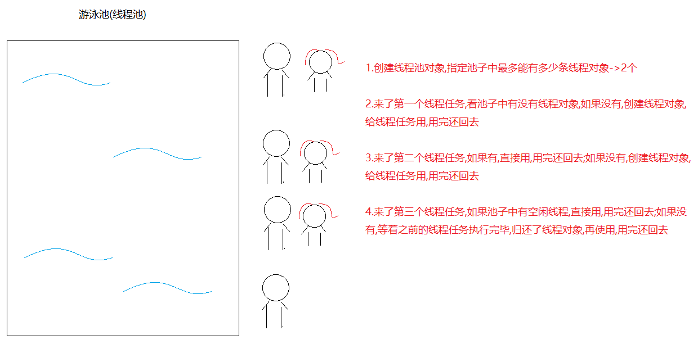

---

### 10.2 创建和使用

```java
// 创建固定大小的线程池
ExecutorService es = Executors.newFixedThreadPool(
int nThreads);

// 提交任务
        es.

submit(Runnable task);       // 提交 Runnable 任务

Future<T> f = es.submit(Callable < T > task); // 提交 Callable 任务，可获取返回值

// 获取 Callable 结果
T result = f.get();

// 关闭线程池（等已提交任务完成后关闭）
es.

shutdown();
```

### 10.3 使用 Runnable

```java
public class MyRunnable implements Runnable {
    @Override
    public void run() {
        System.out.println(Thread.currentThread().getName() + "...执行了");
    }
}

public class Test01 {
    public static void main(String[] args) {
        ExecutorService es = Executors.newFixedThreadPool(2); // 线程池中有 2 条线程
        es.submit(new MyRunnable()); // 线程1 执行
        es.submit(new MyRunnable()); // 线程2 执行
        es.submit(new MyRunnable()); // 线程1 或线程2 执行（复用）
    }
}
```

### 10.4 使用 Callable

```java
public class Test02 {
    public static void main(String[] args) throws ExecutionException, InterruptedException {
        ExecutorService es = Executors.newFixedThreadPool(2);

        Future<String> f1 = es.submit(new MyString());
        Future<Integer> f2 = es.submit(new MySum());

        System.out.println(f1.get()); // 获取字符串结果
        System.out.println(f2.get()); // 获取求和结果

        es.shutdown();
    }
}
```

### 10.5 Executors 常用工厂方法

| 方法                              | 说明            |
|---------------------------------|---------------|
| `newFixedThreadPool(int n)`     | 固定大小线程池       |
| `newCachedThreadPool()`         | 缓存线程池，线程数自动伸缩 |
| `newSingleThreadExecutor()`     | 单线程线程池（顺序执行）  |
| `newScheduledThreadPool(int n)` | 定时任务线程池       |

> 💡 **生产环境建议：** 使用 `ThreadPoolExecutor` 手动构建线程池，明确设置核心线程数、最大线程数、队列等参数，避免 OOM 风险。

```java
// 推荐的手动创建方式（生产环境）
ThreadPoolExecutor executor = new ThreadPoolExecutor(
        2,                           // 核心线程数
        5,                           // 最大线程数
        60L, TimeUnit.SECONDS,       // 空闲线程存活时间
        new ArrayBlockingQueue<>(10) // 任务队列
);
```

---

## 十一、定时器 Timer

### 11.1 简介

| 项   | 说明                            |
|-----|-------------------------------|
| 类   | `java.util.Timer`             |
| 作用  | 定时执行任务                        |
| 任务类 | `TimerTask`（抽象类，实现了 Runnable） |

### 11.2 核心方法

```java
// 从 firstTime 开始，每隔 period 毫秒执行一次 task
void schedule(TimerTask task, Date firstTime, long period)
```

### 11.3 示例

```java
public class Demo01Timer {
    public static void main(String[] args) {
        Timer timer = new Timer();
        timer.schedule(new TimerTask() {
            @Override
            public void run() {
                System.out.println("定时任务执行了！");
            }
        }, new Date(), 2000L); // 从当前时间开始，每 2 秒执行一次
    }
}
```

> 💡 **JDK8+ 推荐：** 使用 `ScheduledExecutorService` 代替 `Timer`，更安全可靠（Timer 中某个任务抛出异常会导致整个定时器崩溃）。

```java
// 推荐替代方案
ScheduledExecutorService scheduler = Executors.newScheduledThreadPool(1);
scheduler.

scheduleAtFixedRate(
    () ->System.out.

println("定时任务执行了！"),
    0,2,TimeUnit.SECONDS // 初始延迟0秒，每2秒执行一次
);
```

---

## 十二、知识总结

### 📋 创建多线程的四种方式对比

| 方式          | 实现                                            | 有无返回值        | 推荐度   |
|-------------|-----------------------------------------------|--------------|-------|
| 继承 Thread   | `extends Thread` → 重写 `run()`                 | ❌            | ⭐⭐    |
| 实现 Runnable | `implements Runnable` → 重写 `run()`            | ❌            | ⭐⭐⭐   |
| 实现 Callable | `implements Callable<V>` → 重写 `call()`        | ✅            | ⭐⭐⭐⭐  |
| 线程池         | `Executors.newFixedThreadPool()` + `submit()` | ✅（配合 Future） | ⭐⭐⭐⭐⭐ |

---

### 🔒 线程安全解决方案对比

| 方案      | 语法                                    | 锁对象           | 灵活性     |
|---------|---------------------------------------|---------------|---------|
| 同步代码块   | `synchronized(obj){ }`                | 指定对象          | 高（可控粒度） |
| 非静态同步方法 | `public synchronized void m()`        | `this`        | 中       |
| 静态同步方法  | `public static synchronized void m()` | `类.class`     | 中       |
| Lock 锁  | `lock.lock()` / `lock.unlock()`       | ReentrantLock | 最高      |

---

### ⚡ 核心知识点速记

| 知识点                         | 关键记忆                         |
|-----------------------------|------------------------------|
| `start()` vs `run()`        | `start()` 开线程，`run()` 是普通方法  |
| `sleep()` vs `wait()`       | `sleep` 不释放锁，`wait` 释放锁      |
| `if` vs `while`（等待）         | 多生产多消费必须用 `while`，防虚假唤醒      |
| `notify()` vs `notifyAll()` | 多生产多消费必须用 `notifyAll()`      |
| 守护线程                        | GC 就是守护线程，非守护结束则守护结束         |
| 死锁                          | 锁嵌套导致，避免嵌套加锁                 |
| `join()`                    | 插队，等待某线程执行完毕                 |
| `yield()`                   | 礼让，让出 CPU（不能保证绝对交替）          |
| `FutureTask`                | 连接 `Callable` 和 `Thread` 的桥梁 |
| 线程池优势                       | 复用线程，减少创建销毁开销，提升性能           |

---

### 🗂️ 线程状态速记

```
NEW → (start) → RUNNABLE ⇆ BLOCKED (等锁)
                    ↓
              WAITING / TIMED_WAITING (wait/sleep)
                    ↓
              TERMINATED (run 执行完毕)
```

---

### ⚠️ 常见错误与补充说明

1. **`char` 对应的包装类是 `Character`，不是 `Charactor`（拼写错误需注意）**

2. **`volatile` 关键字：** 保证变量的**可见性**，但不保证原子性。多线程中若某变量只需要可见性而无需原子操作，可用 `volatile`
   修饰（比 `synchronized` 性能更好）。
```java
    private volatile boolean running = true;
```

3. **原子类：** `java.util.concurrent.atomic` 包提供了如 `AtomicInteger`、`AtomicLong` 等原子类，可以无锁实现线程安全的数值操作。
```java
    AtomicInteger count = new AtomicInteger(0);
    count.incrementAndGet(); // 原子性 ++
```

4. **`ThreadLocal`：** 为每个线程提供独立的变量副本，避免线程间数据共享问题，常用于存储 Session、数据库连接等线程私有数据。

5. **线程池关闭：** `shutdown()` 等待已提交任务完成后关闭；`shutdownNow()` 立即尝试停止所有任务并关闭线程池。

6. **Timer 的缺陷：** 单线程执行所有任务，一个任务异常导致整个 Timer 崩溃，**生产环境建议使用 `ScheduledExecutorService`**。
