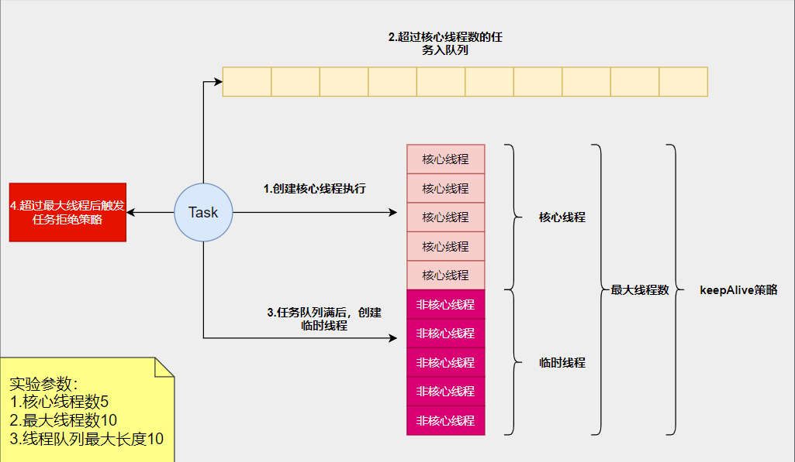
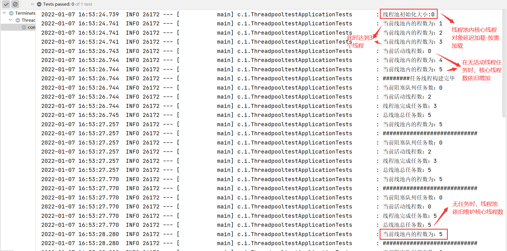
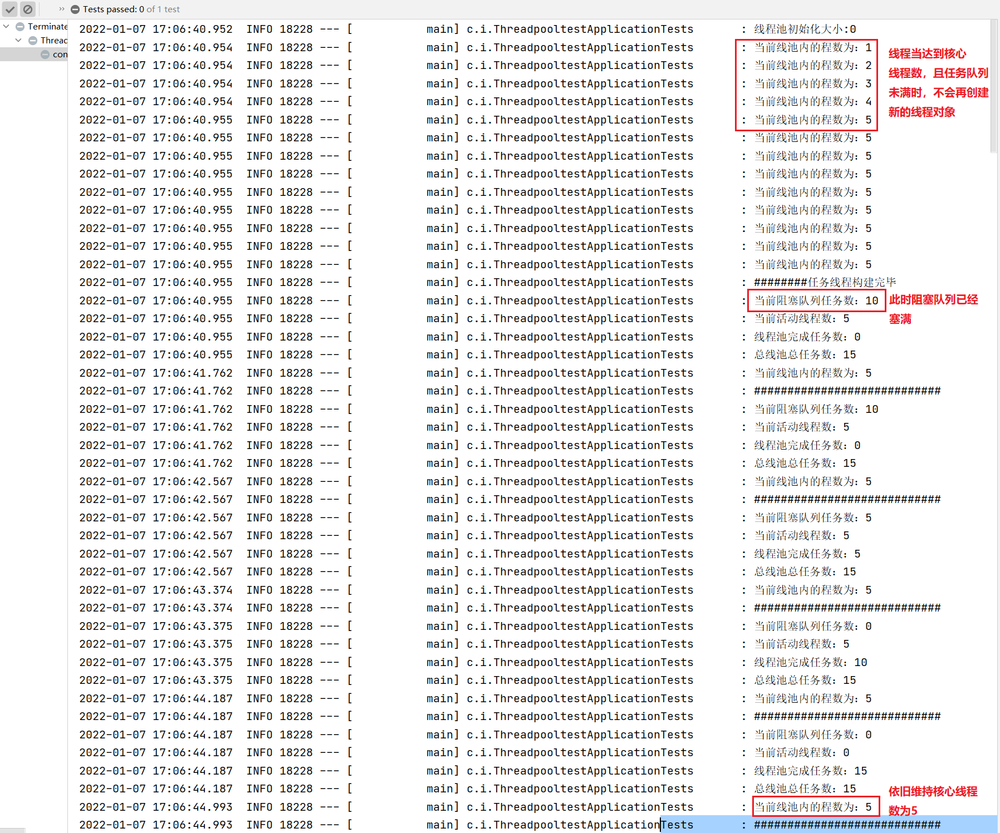
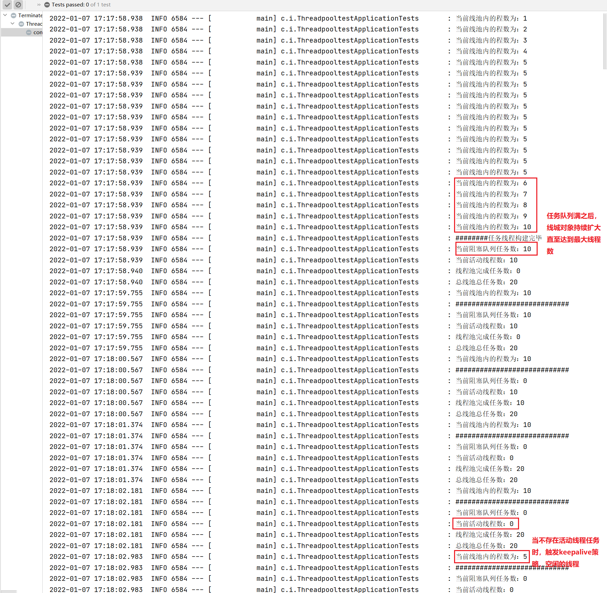
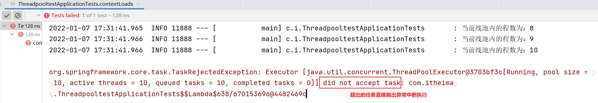
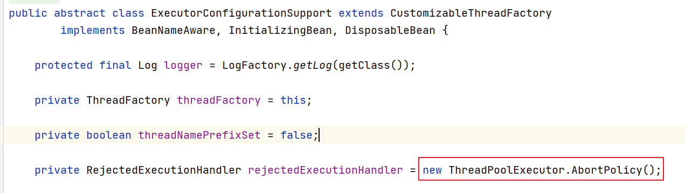
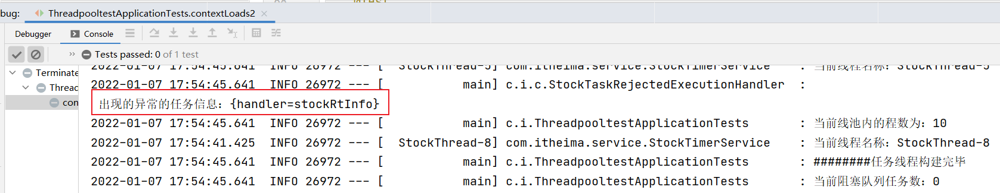

# 线程池详解

## 线程池核心参数

线程池的几个核心参数：

- **核心线程数** (`corePoolSize`)
- 最大线程数 (`maxPoolSize`)
- 超过核心线程数的空闲线程存活时间和时间单位 (`keepAliveTime` + `TimeUnit`)
- 任务队列长度 (`workQueue`)
- 拒绝策略 (`RejectedExecutionHandler`)
- 线程工厂 (`ThreadFactory`)

## 1. 线程池工作流程概述



### 工作流程说明：

1. 当一个任务通过 `submit` 或者 `execute` 方法提交到线程池的时候，如果当前池中线程数（包括闲置线程）小于 `corePoolSize`，则创建一个新的线程执行该任务
2. 如果当前线程池中线程数已经达到 `corePoolSize`，则将任务放入等待队列
3. 如果任务队列已满，则任务无法入队列，此时如果当前线程池中线程数小于 `maxPoolSize`，则创建一个临时线程（非核心线程）执行该任务
4. 如果当前池中线程数已经等于 `maxPoolSize`，此时无法执行该任务，对于新的任务会根据拒绝执行策略处理

> ⚠️ 注意：
>
> 当池中线程数大于 `corePoolSize`，超过 `keepAliveTime` 时间的闲置线程会被回收掉。回收的是非核心线程，核心线程一般是不会回收的。如果设置 `allowCoreThreadTimeOut(true)`，则核心线程在闲置 `keepAliveTime` 时间后也会被回收。

## 2. 线程池拒绝策略

### 2.1 什么时候会触发拒绝策略？

- 当线程池调用 `shutdown()` 等方法关闭线程池后，如果再向线程池内提交任务，就会遭到拒绝
- **当线程达到最大线程数，且无空闲线程，同时任务队列已经满**

### 2.2 拒绝策略类型有哪些

JDK 为我们提供了 4 种拒绝策略：

#### `AbortPolicy`（抛出异常中断程序执行）【默认】

- 这种拒绝策略在拒绝任务时，会直接抛出一个类型为 `RejectedExecutionException` 的 `RuntimeException`，让你感知到任务被拒绝了，于是你便可以根据业务逻辑选择重试或者放弃提交等策略。
- 说白了不仅不处理当前任务，并且还抛出异常，中断当前任务的执行。

#### `DiscardPolicy`（任务丢弃不抛出异常）

- 当有新任务被提交后直接被丢弃掉，也不会给你任何的通知，相对而言存在一定的风险，因为我们提交的时候根本不知道这个任务会被丢弃，可能造成数据丢失。

#### `DiscardOldestPolicy`（丢弃存活时长最长的任务）

- 丢弃任务队列中的头结点，通常是存活时间最长的任务，它也存在一定的数据丢失风险。

#### `CallerRunsPolicy`（推荐）

- 第四种拒绝策略是，相对而言它就比较完善了，当有新任务被提交后，如果线程池没被关闭且没有能力执行，则把这个任务交于提交任务的线程执行，也就是谁提交任务，谁就负责执行任务。
- 任务线程满了后，该策略可将执行的人为交换给主线程执行，这个过程相当于一个正反馈，此时如果主线程能处理，则处理，如果也不能处理，也就意味着当前服务不能接收新的任务了。
- 主线程处理任务期间，可以为线程池腾出时间，如果此时有新的空闲线程，那么继续协助主线程处理任务。

### 2.3 如何自定义拒绝策略？

通过实现 `RejectedExecutionHandler` 接口来自定义任务拒绝策略。

## 3. 验证线程池工作流程

### 3.1 环境准备

独立构建一个 Spring Boot 测试工程，配置线程参数：

```yaml
# 定时任务线程池基础参数
task:
pool:
corePoolSize: 5 # 核心线程数
maxPoolSize: 10 # 设置最大线程数
keepAliveSeconds: 2 # 设置线程活跃时间，单位秒
queueCapacity: 10 # 设置队列容量
```

#### 参数封装：

```java
@ConfigurationProperties(prefix = "task.pool")
@Data
public class TaskThreadPoolInfo {
/**
*  核心线程数（获取硬件）：线程池创建时候初始化的线程数
*/
private Integer corePoolSize;
private Integer maxPoolSize;
private Integer keepAliveSeconds;
private Integer queueCapacity;
}
```

#### 配置线程池：

```java
@Configuration
@EnableConfigurationProperties(TaskThreadPoolInfo.class)
@Slf4j
public class TaskExecutePool {
private TaskThreadPoolInfo info;

    public TaskExecutePool(TaskThreadPoolInfo info) {
        this.info = info;
    }

    @Bean(name = "threadPoolTaskExecutor",destroyMethod = "shutdown")
    public ThreadPoolTaskExecutor threadPoolTaskExecutor(){
         //构建线程池对象
         ThreadPoolTaskExecutor taskExecutor = new ThreadPoolTaskExecutor();
         //核心线程数：核心线程数（获取硬件）：线程池创建时候初始化的线程数
         taskExecutor.setCorePoolSize(info.getCorePoolSize());
         //最大线程数：只有在缓冲队列满了之后才会申请超过核心线程数的线程
         taskExecutor.setMaxPoolSize(info.getMaxPoolSize());
         //缓冲队列：用来缓冲执行任务的队列
         taskExecutor.setQueueCapacity(info.getQueueCapacity());
         //允许线程的空闲时间：当超过了核心线程出之外的线程在空闲时间到达之后会被销毁
         taskExecutor.setKeepAliveSeconds(info.getKeepAliveSeconds());
         //线程名称前缀
         taskExecutor.setThreadNamePrefix("StockThread-");
         //参数初始化
         taskExecutor.initialize();
         return taskExecutor;
    }
}
```

#### 配置模拟股票采集服务：

```java

@Service
public class StockTimerService {
    /**
     * 拉取股票服务
     */
    public void stockRtInto() {
//模拟网络I/O  1000 毫秒
        try {
            TimeUnit.MILLISECONDS.sleep(1000);
        } catch (InterruptedException e) {
            e.printStackTrace();
        }
    }
}
```

### 3.2 任务队列未满前场景

#### 3.2.1 并发情况 -1

并发任务数小于等于核心线程数情况；

##### 测试代码：

循环总任务数等于核心线程数：

```java
@SpringBootTest
@Slf4j
public class ThreadpooltestApplicationTests {
@Autowired
private StockTimerService stockTimerService;

    @Autowired
    private ThreadPoolTaskExecutor threadPoolTaskExecutor;

    @Test
    public  void contextLoads() throws InterruptedException {
        //线程池初始化线程数为 0
        log.info("线程池初始化大小:{}",threadPoolTaskExecutor.getPoolSize());
        for (int i = 0; i < 3; i++) {
               threadPoolTaskExecutor.execute(()->{
                   stockTimerService.stockRtInto();
               });
            //获取线程池内最新的线程数量
            log.info("当前线池内的程数为：{}",threadPoolTaskExecutor.getPoolSize());
        }
        //休眠 2s 中，保证前 3 个线程任务都执行完，有闲余的线程
        TimeUnit.MILLISECONDS.sleep(2000);
        log.info("当前活动线程数：{}" ,threadPoolTaskExecutor.getActiveCount());//此时为 0，证明线程内有闲余的线程
        for (int i = 0; i < 2; i++) {
            threadPoolTaskExecutor.execute(()->{
                stockTimerService.stockRtInto();
            });
            //获取线程池内最新的线程数量
            //发现在没有达到核心线程数时，哪怕有新的任务，也依旧开启新的线程执行
            log.info("当前线池内的程数为：{}",threadPoolTaskExecutor.getPoolSize());
        }
        log.info("########任务线程构建完毕");

        while (true) {
            int queueSize = threadPoolTaskExecutor.getThreadPoolExecutor().getQueue().size();
            log.info("当前阻塞队列任务数：{}" , queueSize);
            log.info("当前活动线程数：{}" ,threadPoolTaskExecutor.getActiveCount());
            long completedTaskCount = threadPoolTaskExecutor.getThreadPoolExecutor().getCompletedTaskCount();
            log.info("线程池完成任务数：{}" ,completedTaskCount);
            //当所有任务都完成后，那么 completedTaskCount=taskCount
            long taskCount = threadPoolTaskExecutor.getThreadPoolExecutor().getTaskCount();
            log.info("总线池总任务数：{}" ,taskCount);
            try {
                Thread.sleep(500);
            } catch (InterruptedException e) {
                e.printStackTrace();
            }
            //获取线程池内最新的线程数量
            log.info("当前线池内的程数为：{}",threadPoolTaskExecutor.getPoolSize());
            log.info("############################");
        }
    }
}
```

##### 运行结果解释：



##### 结论：

- 线程池对象初始化时采用延迟加载的方式构建核心线程对象，因为线程对象构建有资源开销
- 当线程池内的线程数未达到核心线程数时，此时哪怕线程是空闲的，不会复用线程，而是最大努力构建新的线程，直到达到核心线程数为止

#### 3.2.2 并发情况 -2

并发任务数大于核心线程数，且小于等于（核心线程数 + 任务队列长度）

此时循环任务数为：15；

##### 示例代码：

```java
@SpringBootTest
@Slf4j
public class ThreadpooltestApplicationTests {
@Autowired
private StockTimerService stockTimerService;

    @Autowired
    private ThreadPoolTaskExecutor threadPoolTaskExecutor;

    @Test
    public  void contextLoads() throws InterruptedException {
        log.info("线程池初始化大小:{}",threadPoolTaskExecutor.getPoolSize());
        for (int i = 0; i < 15; i++) {
            threadPoolTaskExecutor.execute(()->{
                stockTimerService.stockRtInto();
            });
            log.info("当前线池内的程数为：{}",threadPoolTaskExecutor.getPoolSize());
        }
        log.info("########任务线程构建完毕");

        while (true) {
            int queueSize = threadPoolTaskExecutor.getThreadPoolExecutor().getQueue().size();
            log.info("当前阻塞队列任务数：{}" , queueSize);
            log.info("当前活动线程数：{}" ,threadPoolTaskExecutor.getActiveCount());
            long completedTaskCount = threadPoolTaskExecutor.getThreadPoolExecutor().getCompletedTaskCount();
            log.info("线程池完成任务数：{}" ,completedTaskCount);
            long taskCount = threadPoolTaskExecutor.getThreadPoolExecutor().getTaskCount();
            log.info("总线池总任务数：{}" ,taskCount);
            try {
                Thread.sleep(800);
            } catch (InterruptedException e) {
                e.printStackTrace();
            }
            log.info("当前线池内的程数为：{}",threadPoolTaskExecutor.getPoolSize());
            log.info("############################");
        }
    }
}
```

##### 效果：



##### 结论：

- 当核心线程数使用完后，多余的任务优先压入任务队列
- 当核心线程数被占用，且有新的任务时，优先将新的任务压入队列
- 当核心线程数已满，且阻塞队列如果未填满，会持续填入
- 当核心线程存在空闲时，会主动去阻塞队列下领取新的任务处理

### 3.3 任务队列已满后场景

#### 3.3.1 并发情况 -3

阻塞队列已满，且线程池中的线程数为未达到最大线程数：

此时循环任务数为：20

```java
@SpringBootTest
@Slf4j
public class ThreadpooltestApplicationTests {
@Autowired
private StockTimerService stockTimerService;

    @Autowired
    private ThreadPoolTaskExecutor threadPoolTaskExecutor;

    @Test
    public  void contextLoads() throws InterruptedException {
        log.info("线程池初始化大小:{}",threadPoolTaskExecutor.getPoolSize());
        for (int i = 0; i < 20; i++) {
            threadPoolTaskExecutor.execute(()->{
                stockTimerService.stockRtInto();
            });
            log.info("当前线池内的程数为：{}",threadPoolTaskExecutor.getPoolSize());
        }
        log.info("########任务线程构建完毕");

        while (true) {
            int queueSize = threadPoolTaskExecutor.getThreadPoolExecutor().getQueue().size();
            log.info("当前阻塞队列任务数：{}" , queueSize);
            log.info("当前活动线程数：{}" ,threadPoolTaskExecutor.getActiveCount());
            long completedTaskCount = threadPoolTaskExecutor.getThreadPoolExecutor().getCompletedTaskCount();
            log.info("线程池完成任务数：{}" ,completedTaskCount);
            long taskCount = threadPoolTaskExecutor.getThreadPoolExecutor().getTaskCount();
            log.info("总线池总任务数：{}" ,taskCount);
            try {
                Thread.sleep(800);
            } catch (InterruptedException e) {
                e.printStackTrace();
            }
            log.info("当前线池内的程数为：{}",threadPoolTaskExecutor.getPoolSize());
            log.info("############################");
        }
    }
}
```

##### 效果：



##### 结论：

- 当核心线程数已被使用，且任务队列已满，优先开启临时线程处理任务
- 线程执行流程：1. 先扩容 5 个核心线程处理任务 2. 将多余的 10 个任务压入队列 3. 剩下的构建临时线程处理任务（最大线程数 = 临时线程数 + 核心线程数）
- 临时线程如果空闲，且达到 `keepAliveSeconds` 指定的最大存活时间，则会被淘汰，直到达到核心线程数为止

#### 3.3.2 并发情况 -4

并发任务数量超过（最大线程数 + 任务队列长度）的情况；

定义循环线程数量：21，超过了 1 个线程；

```java
@SpringBootTest
@Slf4j
public class ThreadpooltestApplicationTests {
@Autowired
private StockTimerService stockTimerService;

    @Autowired
    private ThreadPoolTaskExecutor threadPoolTaskExecutor;

    @Test
    public  void contextLoads() throws InterruptedException {
        log.info("线程池初始化大小:{}",threadPoolTaskExecutor.getPoolSize());
        for (int i = 0; i < 21; i++) {
            threadPoolTaskExecutor.execute(()->{
                stockTimerService.stockRtInto();
            });
            log.info("当前线池内的程数为：{}",threadPoolTaskExecutor.getPoolSize());
        }
        log.info("########任务线程构建完毕");

        while (true) {
            int queueSize = threadPoolTaskExecutor.getThreadPoolExecutor().getQueue().size();
            log.info("当前阻塞队列任务数：{}" , queueSize);
            log.info("当前活动线程数：{}" ,threadPoolTaskExecutor.getActiveCount());
            long completedTaskCount = threadPoolTaskExecutor.getThreadPoolExecutor().getCompletedTaskCount();
            log.info("线程池完成任务数：{}" ,completedTaskCount);
            long taskCount = threadPoolTaskExecutor.getThreadPoolExecutor().getTaskCount();
            log.info("总线池总任务数：{}" ,taskCount);
            try {
                Thread.sleep(800);
            } catch (InterruptedException e) {
                e.printStackTrace();
            }
            log.info("当前线池内的程数为：{}",threadPoolTaskExecutor.getPoolSize());
            log.info("############################");
        }
    }
}
```

##### 效果：



通过阅读源码我们发现：



默认采用 `AbortPolicy` 策略，直接中断程序执行

##### 结论：

- 什么时候触发任务的拒绝策略？
    - 1. 任务队列已满，且没有空闲的线程（线程已经达到最大线程数），则会触发拒绝策略
    - 2. 线程池对象 `shutdown` 关闭拒绝服务时，也会触发拒绝策略
    - 3. 拒绝策略：
        - JDK 给我们提供了 4 种：
            - `AbortPolicy` 抛出异常，终止程序允许
            - `DiscardPolicy` 丢弃新的任务，不抛出异常
            - `DiscardOldestPolicy` 丢弃旧的任务，不抛出异常
            - `CallerRunsPolicy` 委托主线程执行任务 不抛出异常

## 4. 自定义线程池拒绝策略

### 第一步：自定义线程任务对象

```java
public class StockTaskRunable implements Runnable{
//携带的任务信息，任务拒绝时，使用
private Map<String,Object> infos;
private StockTimerService stockTimerService;

    public StockTaskRunable(Map<String, Object> infos, StockTimerService stockTimerService) {
        this.infos = infos;
        this.stockTimerService = stockTimerService;
    }
    
    //任务逻辑
    @Override
    public void run() {
        stockTimerService.stockRtInto();
    }
    
    //提供 get 方法
    public Map<String, Object> getInfos() {
        return infos;
    }
}
```
### 第二步：自定义拒绝策略

```java
@Slf4j
public class StockTaskRejectedExecutionHandler implements RejectedExecutionHandler {
@Override
public void rejectedExecution(Runnable r, ThreadPoolExecutor executor) {
if (r instanceof StockTaskRunable) {
StockTaskRunable r2= ((StockTaskRunable) r);
Map<String, Object> infos = r2.getInfos();
log.info("出现的异常的任务信息：{}",infos);
}
}
}
```
### 第三步：配置拒绝策略

```java
/**
 * 定义任务执行器
 * @return
 */
@Bean(name = "threadPoolTaskExecutor", destroyMethod = "shutdown")
public ThreadPoolTaskExecutor threadPoolTaskExecutor() {
    //构建线程池对象
    ThreadPoolTaskExecutor taskExecutor = new ThreadPoolTaskExecutor();
    //核心线程数：核心线程数（获取硬件）：线程池创建时候初始化的线程数
    taskExecutor.setCorePoolSize(info.getCorePoolSize());
    //最大线程数：只有在缓冲队列满了之后才会申请超过核心线程数的线程
    taskExecutor.setMaxPoolSize(info.getMaxPoolSize());
    //缓冲队列：用来缓冲执行任务的队列
    taskExecutor.setQueueCapacity(info.getQueueCapacity());
    //允许线程的空闲时间：当超过了核心线程出之外的线程在空闲时间到达之后会被销毁
    taskExecutor.setKeepAliveSeconds(info.getKeepAliveSeconds());
    //线程名称前缀
    taskExecutor.setThreadNamePrefix("StockThread-");
    //设置拒绝策略
    taskExecutor.setRejectedExecutionHandler(rejectedExecutionHandler());
    //参数初始化
    taskExecutor.initialize();
    return taskExecutor;
}

/**
 * 自定义线程拒绝策略
 * @return
 */
@Bean
public RejectedExecutionHandler rejectedExecutionHandler() {
    StockTaskRejectedExecutionHandler errorHandler = new StockTaskRejectedExecutionHandler();
    return errorHandler;
}
```
### 第四步：测试

```java

@Test
public void contextLoads2() throws InterruptedException {
    log.info("线程池初始化大小:{}", threadPoolTaskExecutor.getPoolSize());
    for (int i = 0; i < 21; i++) {
        HashMap<String, Object> info = new HashMap<>();
        info.put("handler", "stockRtInfo");
//自定义任务
        StockTaskRunable task = new StockTaskRunable(info, stockTimerService);
        threadPoolTaskExecutor.execute(task);
        log.info("当前线池内的程数为：{}", threadPoolTaskExecutor.getPoolSize());
    }
    log.info("########任务线程构建完毕");
    while (true) {
        int queueSize = threadPoolTaskExecutor.getThreadPoolExecutor().getQueue().size();
        log.info("当前阻塞队列任务数：{}", queueSize);
        log.info("当前活动线程数：{}", threadPoolTaskExecutor.getActiveCount());
        long completedTaskCount = threadPoolTaskExecutor.getThreadPoolExecutor().getCompletedTaskCount();
        log.info("线程池完成任务数：{}", completedTaskCount);
        long taskCount = threadPoolTaskExecutor.getThreadPoolExecutor().getTaskCount();
        log.info("总线池总任务数：{}", taskCount);
        try {
            Thread.sleep(800);
        } catch (InterruptedException e) {
            e.printStackTrace();
        }
        log.info("当前线池内的程数为：{}", threadPoolTaskExecutor.getPoolSize());
        log.info("############################");
    }
}
```

##### 效果：



## 5. 线程池参数设置原则

### 5.1 如何为线程池设置合适的线程参数？

目前根据一些开源框架，设置多少个线程数量通常是根据应用的类型：**I/O 密集型、CPU 密集型。**

#### I/O 密集型

I/O 密集型的场景在开发中比较常见，比如像 MySQL 数据库读写、文件的读写、网络通信等任务，这类任务不会特别消耗 CPU 资源，但是 IO 操作比较耗时，会占用比较多时间。

- I/O 密集型通常设置为 `2n+1`，其中 `n` 为 CPU 核数
- 说白了，对于 I/O 密集型的场景，不太占用 CPU 资源，所以并发的任务数大于 CPU 的核数，这样的话能更加充分的利用 CPU 资源

#### CPU 密集型

CPU 密集型的场景，比如像加解密，压缩、计算等一系列需要大量耗费 CPU 资源的任务，这些场景大部分都是纯 CPU 计算。

- CPU 密集型通常设置为 `n+1`，这样也可避免多线程环境下 CPU 资源争夺带来上下文频繁切换的开销

### 5.2 如何获取当前服务器的 CPU 核数？

```java
int cores = Runtime.getRuntime().availableProcessors();
```

### 5.3 无界队列问题

实际运行中，我们一般会设置线程池的阻塞队列长度，如果不设置，则采用默认值：

```java
private int corePoolSize = 1;
private int maxPoolSize = Integer.MAX_VALUE;
private int keepAliveSeconds = 60;
private int queueCapacity = Integer.MAX_VALUE;
```

在这个过程中，如果设置或者使用不当，容易造成内存溢出问题，同时如果设置了无界队列，那么线程池的最大线程数也就失去了意义。

所以企业开发中会明令**禁止使用默认的队列长度**。
```
