# Java 集合框架

---

## 一、集合框架概述

### 1.1 为什么需要集合

| 存储方式 | 特点 | 缺点 |
|----------|------|------|
| 变量 | 存单个数据 | 无法存多个 |
| 数组 | 有序、可存多个 | **定长**，增删不便 |
| **集合** | 有序/无序均有，方法丰富 | 只能存**引用类型** |

**集合的优势：**
- 长度可变（动态扩容）
- 提供大量内置方法，操作简便
- 支持泛型，统一元素类型

### 1.2 集合分类

```
集合框架
├── 单列集合（Collection）—— 每个元素是一个独立值
│   ├── List（有序、可重复）
│   │   ├── ArrayList
│   │   ├── LinkedList
│   │   └── Vector（已过时）
│   └── Set（元素唯一）
│       ├── HashSet
│       ├── LinkedHashSet
│       └── TreeSet
└── 双列集合（Map）—— 每个元素是 key-value 键值对
    ├── HashMap
    │   └── LinkedHashMap
    ├── TreeMap
    ├── Hashtable（已过时）
    └── Properties
```

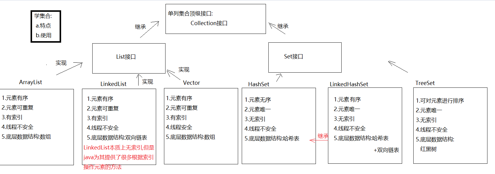

> 💡 **核心记忆：**
> - `Collection` → 单列集合顶级接口
> - `Map` → 双列集合顶级接口
> - 所有 `Set` 集合底层都依赖 `Map` 实现

---

## 二、Collection 接口

### 2.1 概述

```java
// 单列集合的顶级接口
Collection<E> collection = new ArrayList<>();
// <E> 泛型：统一元素类型，只能写引用类型
// 等号左边的泛型必须写，右边可省略（JVM 会自动推导）
```

### 2.2 常用方法

| 方法 | 说明 |
|------|------|
| `boolean add(E e)` | 添加元素（一般不用 boolean 接收，因为必定成功） |
| `boolean addAll(Collection<? extends E> c)` | 合并另一个集合的所有元素 |
| `void clear()` | 清空集合 |
| `boolean contains(Object o)` | 是否包含指定元素 |
| `boolean isEmpty()` | 集合是否为空 |
| `boolean remove(Object o)` | 删除指定元素 |
| `int size()` | 返回元素个数 |
| `Object[] toArray()` | 转为 Object 数组 |

```java
Collection<String> collection = new ArrayList<>();
collection.add("萧炎");
collection.add("萧薰儿");
collection.add("云韵");

// 合并集合
Collection<String> collection2 = new ArrayList<>();
collection2.addAll(collection);

// 常用判断
System.out.println(collection.contains("云韵")); // true
System.out.println(collection.isEmpty());        // false
System.out.println(collection.size());           // 3

// 转数组
Object[] arr = collection.toArray();
System.out.println(Arrays.toString(arr));

// 删除
collection.remove("云韵");

// 清空
collection.clear();
```

---

## 三、迭代器 Iterator

### 3.1 基本使用

```java
// 1. 概述：Iterator 接口，主要用于遍历集合
// 2. 获取：通过 Collection 的 iterator() 方法
// 3. 方法：
//    boolean hasNext()  判断是否有下一个元素
//    E next()           获取下一个元素并移动指针
```

```java
ArrayList<String> list = new ArrayList<>();
list.add("楚雨荨");
list.add("慕容云海");
list.add("端木磊");

Iterator<String> iterator = list.iterator();
while (iterator.hasNext()) {
    String element = iterator.next(); // 不要在循环体内多次调用 next()！
    System.out.println(element);
}
```

> ⚠️ **注意：** `next()` 在一次循环中只调用一次，多次调用会导致 `NoSuchElementException`。

### 3.2 迭代器内部原理

```java
// Itr 是 ArrayList 的内部类，实现了 Iterator 接口
int cursor;       // 下一个元素的索引（初始为 0）
int lastRet = -1; // 上一个元素的索引（初始为 -1）
```

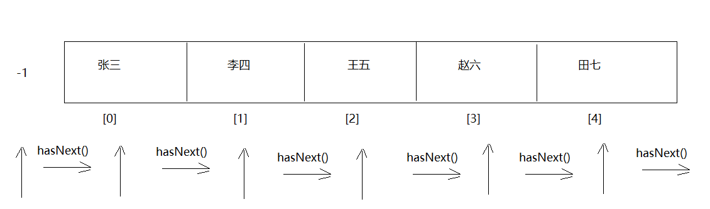

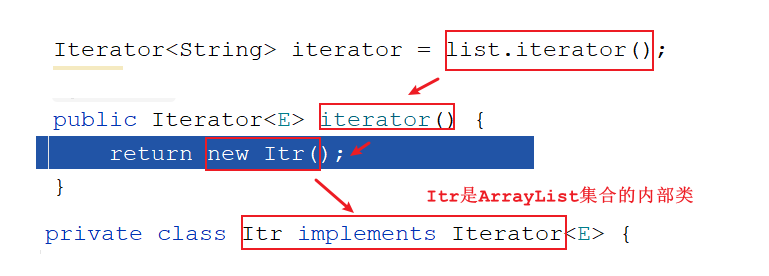

> 不同集合使用迭代器时，Iterator 接口指向不同的实现类：
> - `ArrayList` → 指向内部类 `Itr`
> - `HashSet` → 指向 HashSet 自己的内部类

### 3.3 并发修改异常（ConcurrentModificationException）

**触发场景：** 用迭代器遍历集合时，直接调用集合的 `add()`/`remove()` 修改集合长度。

```java
ArrayList<String> list = new ArrayList<>();
list.add("唐僧"); list.add("孙悟空"); list.add("猪八戒"); list.add("沙僧");

Iterator<String> iterator = list.iterator();
while (iterator.hasNext()) {
    String element = iterator.next();
    if ("猪八戒".equals(element)) {
        list.add("白龙马"); // ❌ 触发 ConcurrentModificationException！
    }
}
```

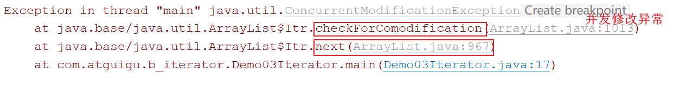

**根本原因：**
```java
// 迭代器内部维护两个计数器：
int modCount;         // 实际操作次数（集合每次 add/remove 都会 modCount++）
int expectedModCount; // 预期操作次数（迭代器创建时记录当前 modCount）

// next() 方法每次都会检查：
if (modCount != expectedModCount)
    throw new ConcurrentModificationException();
// 集合调用 add() 后 modCount 变了，但 expectedModCount 没更新，导致抛异常
```

**解决方案：使用 `ListIterator`（List 专用迭代器）**

```java
ListIterator<String> listIterator = list.listIterator();
while (listIterator.hasNext()) {
    String element = listIterator.next();
    if ("猪八戒".equals(element)) {
        listIterator.add("白龙马"); // ✅ 使用迭代器自己的 add，同步更新两个计数器
    }
}
System.out.println(list); // [唐僧, 孙悟空, 猪八戒, 白龙马, 沙僧]
```

> 💡 **原则：迭代集合过程中不要随意修改集合长度！**

---

## 四、数据结构基础

### 4.1 数据结构分类

| 逻辑结构 | 说明 |
|----------|------|
| 集合结构 | 元素间除"同属一个集合"外无其他关系 |
| **线性结构** | 一对一（数组、链表、栈、队列） |
| **树形结构** | 一对多（二叉树、红黑树） |
| 图形结构 | 多对多 |

### 4.2 栈（Stack）

```
特点：先进后出（LIFO）
类比：手枪弹夹压子弹
```

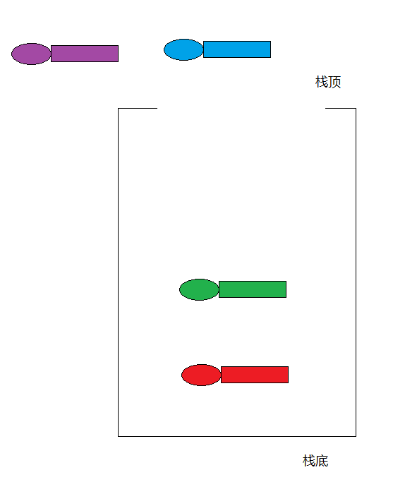

### 4.3 队列（Queue）

```
特点：先进先出（FIFO）
类比：排队过安检
```

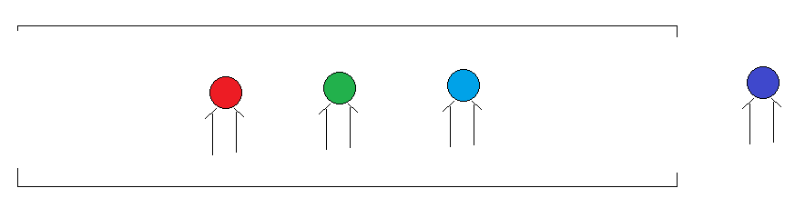

### 4.4 数组（Array）

```
特点：查询快，增删慢
查询快：有索引，直接定位（O(1)）
增删慢：需要创建新数组并复制元素，中间增删还需移位（O(n)）
```

### 4.5 链表（LinkedList）

**单向链表：** 每个节点 = 数据域 + 后继指针域（只记后面节点地址）

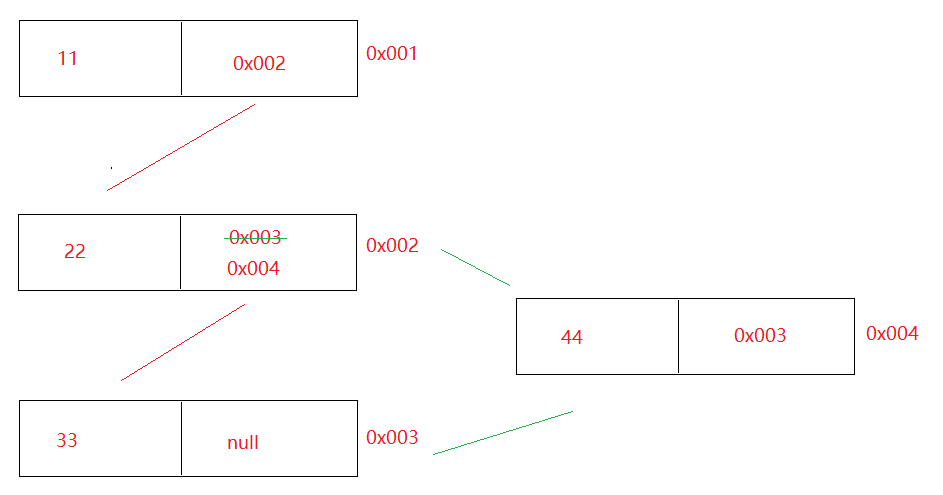

**双向链表：** 每个节点 = 前驱指针域 + 数据域 + 后继指针域（同时记前后节点地址）

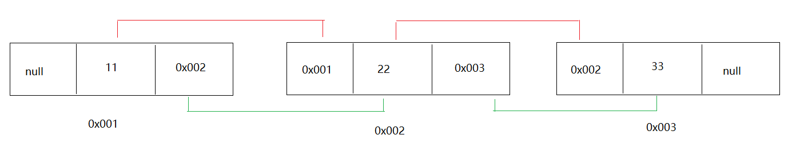

```
链表特点：查询慢（O(n)），增删快（O(1)）
```

### 4.6 红黑树（Red-Black Tree）

```java
集合引入红黑树的目的：提高查询效率（从 O(n) 降至 O(log n)）
HashSet / HashMap：JDK8 之后，哈希表 = 数组 + 链表 + 红黑树
当链表长度 >= 8 且数组长度 >= 64 时，链表转为红黑树
```

**红黑树规则：**
1. 每个节点非红即黑
2. **根节点**必须是黑色
3. 叶节点（空节点 Nil）是黑色
4. 红色节点的子节点**必须是黑色**（不能两个红节点相连）
5. 从任意节点到其所有叶节点路径上**黑色节点数量相同**


---

## 五、List 集合

### 5.1 List 接口概述

```java
List 是 Collection 的子接口
特点：元素有序、有索引、可重复
常见实现类：ArrayList、LinkedList、Vector
```

---

### 5.2 ArrayList

#### 特点与方法

| 特点 | 说明 |
|------|------|
| 元素有序 | 按存入顺序排列 |
| 元素可重复 | 允许重复元素 |
| 有索引 | 可通过索引操作 |
| 线程不安全 | 高并发需用 `CopyOnWriteArrayList` |
| **数据结构** | **数组** |

| 方法 | 说明 |
|------|------|
| `boolean add(E e)` | 尾部添加元素 |
| `void add(int index, E e)` | 指定索引位置插入 |
| `boolean remove(Object o)` | 删除指定元素 |
| `E remove(int index)` | 删除指定索引的元素，返回被删除元素 |
| `E set(int index, E e)` | 修改指定索引的元素，返回旧值 |
| `E get(int index)` | 根据索引获取元素 |
| `int size()` | 获取元素个数 |

```java
ArrayList<String> list = new ArrayList<>();
list.add("铁胆火车侠");
list.add("火影忍者");
list.add("灌篮高手");

list.add(1, "涛哥");            // 在索引1插入
list.remove("涛哥");            // 删除指定元素
String old = list.set(0, "金莲"); // 修改索引0元素
System.out.println(list.get(0)); // 金莲
System.out.println(list.size()); // 2
```

> ⚠️ **删除整数时的陷阱：**
> ```java
> ArrayList<Integer> list = new ArrayList<>();
> list.add(2);
> // list.remove(2);           // ❌ 按索引删除，索引2不存在 → IndexOutOfBoundsException
> list.remove(Integer.valueOf(2)); // ✅ 按元素值删除
> ```

#### 三种遍历方式

```java
// 方式1：迭代器
Iterator<String> it = list.iterator();
while (it.hasNext()) System.out.println(it.next());

// 方式2：普通 for + 索引
for (int i = 0; i < list.size(); i++) System.out.println(list.get(i));

// 方式3：增强 for（推荐）
for (String s : list) System.out.println(s);
```

#### 底层源码分析

```java
// 构造方法
ArrayList()                    // 创建空列表（底层数组初始为 {} 空数组）
ArrayList(int initialCapacity) // 创建指定初始容量的列表

// 扩容机制（关键）：
// 1. new ArrayList() 底层数组为长度为 0 的空数组
// 2. 第一次 add() 时，才创建长度为 10 的数组
// 3. 超出容量时，自动扩容为原来的 1.5 倍（通过 Arrays.copyOf）
```

```java
// 扩容源码简析
private Object[] grow(int minCapacity) {
    int oldCapacity = elementData.length; // 10
    // prefGrowth = oldCapacity >> 1 = 5（右移1位 = 除以2）
    // newCapacity = 10 + max(1, 5) = 15 → 即 1.5 倍
    int newCapacity = ArraysSupport.newLength(oldCapacity,
            minCapacity - oldCapacity,
            oldCapacity >> 1);
    return elementData = Arrays.copyOf(elementData, newCapacity);
}
```

| 步骤 | 说明 |
|------|------|
| 初始创建 | `new ArrayList()` → 底层数组为 `{}` |
| 首次 add | 创建长度为 **10** 的数组 |
| 超出容量 | 扩容为原来的 **1.5 倍** |

---

### 5.3 LinkedList

#### 特点与方法

| 特点 | 说明 |
|------|------|
| 元素有序 | 按存入顺序排列 |
| 元素可重复 | 允许重复元素 |
| "有索引" | 提供了按索引操作的方法，但本质是链表（无索引） |
| 线程不安全 | |
| **数据结构** | **双向链表** |

**独有的首尾操作方法：**

| 方法 | 说明 |
|------|------|
| `void addFirst(E e)` | 在列表开头插入 |
| `void addLast(E e)` | 在列表末尾插入 |
| `E getFirst()` | 获取第一个元素 |
| `E getLast()` | 获取最后一个元素 |
| `E removeFirst()` | 移除并返回第一个元素 |
| `E removeLast()` | 移除并返回最后一个元素 |
| `void push(E e)` | 入栈（等同于 `addFirst`） |
| `E pop()` | 出栈（等同于 `removeFirst`） |
| `boolean isEmpty()` | 是否为空 |

```java
LinkedList<String> linkedList = new LinkedList<>();
linkedList.add("吕布");
linkedList.add("刘备");
linkedList.add("貂蝉");

linkedList.addFirst("孙尚香"); // [孙尚香, 吕布, 刘备, 貂蝉]
linkedList.addLast("董卓");   // [孙尚香, 吕布, 刘备, 貂蝉, 董卓]

System.out.println(linkedList.getFirst()); // 孙尚香
linkedList.removeFirst(); // 移除孙尚香

// 栈操作
linkedList.push("曹操"); // 头部插入
linkedList.pop();        // 头部移除
```

#### 底层源码分析

```java
// LinkedList 底层成员
transient int size = 0;       // 元素个数
transient Node<E> first;      // 头节点
transient Node<E> last;       // 尾节点

// 节点内部类（双向链表节点）
private static class Node<E> {
    E item;          // 节点存储的数据
    Node<E> next;    // 后继节点地址
    Node<E> prev;    // 前驱节点地址
}
```

```java
// get(index) 采用二分优化：
// index < size/2 → 从头部往后遍历
// index >= size/2 → 从尾部往前遍历
// 减少不必要的遍历，提高效率
```

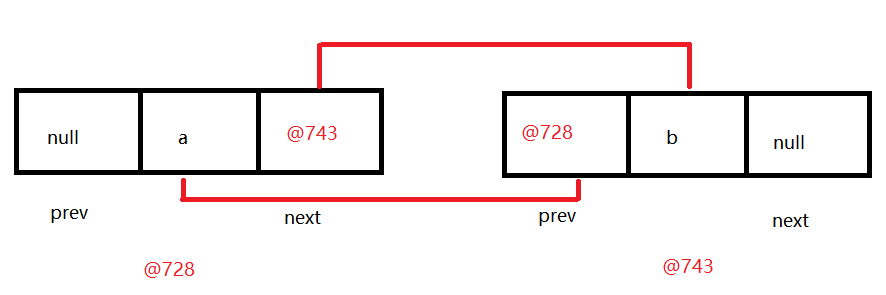

---

### 5.4 ArrayList vs LinkedList 对比

| 对比项 | ArrayList | LinkedList |
|--------|-----------|------------|
| 数据结构 | 数组 | 双向链表 |
| 查询速度 | 快（O(1)） | 慢（O(n)） |
| 增删速度 | 慢（O(n)） | 快（O(1)） |
| 内存占用 | 较少 | 较多（额外存前后指针） |
| 随机访问 | 支持 | 不支持（无真实索引） |
| 适用场景 | 查询频繁 | 增删频繁 |

---

## 六、增强 for 循环

### 6.1 基本使用

```java
// 格式：for(元素类型 变量名 : 集合名或数组名)
// 作用：遍历集合或数组
// 快捷键：集合名/数组名.for + 回车

ArrayList<String> list = new ArrayList<>();
list.add("张三"); list.add("李四"); list.add("王五");

// 遍历集合
for (String s : list) {
    System.out.println(s);
}

// 遍历数组
int[] arr = {1, 2, 3, 4, 5};
for (int i : arr) {
    System.out.println(i);
}
```

### 6.2 底层原理

| 遍历对象 | 底层实现 |
|----------|---------|
| 遍历**集合** | 迭代器（Iterator） |
| 遍历**数组** | 普通 for 循环 |

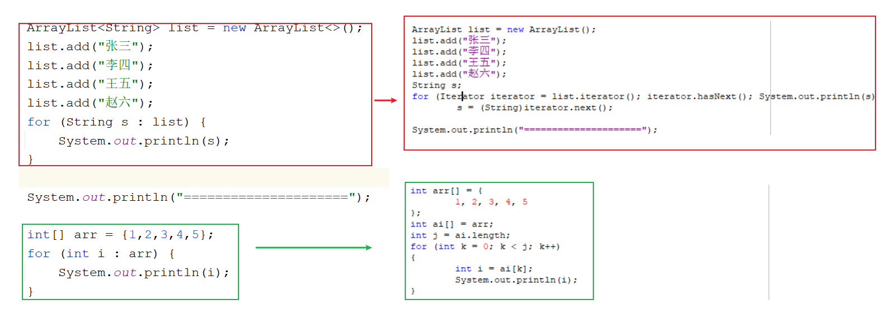

> ⚠️ 用增强 for 遍历集合时，同样**不能修改集合长度**，否则也会抛 `ConcurrentModificationException`。

---

## 七、Collections 工具类

### 7.1 概述

```java
// 特点：
// 1. 构造方法私有（不能 new）
// 2. 所有方法都是静态的
// 3. 直接通过类名调用
```

### 7.2 常用方法

| 方法 | 说明 |
|------|------|
| `addAll(Collection c, T... elements)` | 批量添加元素 |
| `shuffle(List<?> list)` | 打乱集合元素顺序 |
| `sort(List<T> list)` | 按默认规则排序（ASCII 码升序） |
| `sort(List<T> list, Comparator<T> c)` | 按指定比较器排序 |
| `reverse(List<?> list)` | 反转集合元素 |
| `max(Collection c)` | 返回最大元素 |
| `min(Collection c)` | 返回最小元素 |
| `frequency(Collection c, Object o)` | 返回指定元素出现次数 |

```java
ArrayList<String> list = new ArrayList<>();
Collections.addAll(list, "张三", "李四", "王五", "赵六");
Collections.shuffle(list);  // 打乱顺序
Collections.sort(list);     // 默认升序排序（ASCII）
System.out.println(list);
```

### 7.3 自定义排序（Comparator）

```java
// Comparator 比较器规则：
// o1 - o2 → 升序
// o2 - o1 → 降序
Collections.sort(list, new Comparator<Person>() {
    @Override
    public int compare(Person o1, Person o2) {
        return o1.getAge() - o2.getAge(); // 按年龄升序
    }
});

// JDK8+ Lambda 简化写法
Collections.sort(list, (o1, o2) -> o1.getAge() - o2.getAge());
```

### 7.4 自然排序（Comparable）

让实体类实现 `Comparable<T>` 接口，重写 `compareTo` 方法：

```java
public class Student implements Comparable<Student> {
    private String name;
    private Integer score;

    @Override
    public int compareTo(Student o) {
        return this.score - o.score; // 按分数升序
        // return o.score - this.score; // 按分数降序
    }
}

// 使用
Collections.sort(list); // 无需传比较器，使用 compareTo 规则
```

### 7.5 Arrays.asList（补充）

```java
// 快速将元素转为固定大小的 List
List<String> list = Arrays.asList("张三", "李四", "王五");
// ⚠️ 注意：此 List 不支持 add/remove 操作（大小固定）！
// 如需可修改，需要 new ArrayList<>(Arrays.asList(...))
```

---

## 八、泛型

### 8.1 泛型的作用

```
1. 统一数据类型，防止 ClassCastException（类型转换异常）
2. 使代码更灵活，编写通用的类、方法、接口
```

```java
// 没有泛型：存什么类型都行，但取出时类型转换容易出错
ArrayList list = new ArrayList();
list.add("abc");
list.add(123);
for (Object o : list) {
    String s = (String) o; // ❌ 123 不能转 String → ClassCastException
}

// 有泛型：编译期就检查类型
ArrayList<String> list2 = new ArrayList<>();
// list2.add(123); // ❌ 编译错误，直接提示
list2.add("abc"); // ✅
```

### 8.2 含有泛型的类

```java
// 定义格式：
public class 类名<E> { }

// 确定类型时机：new 对象时确定
public class MyArrayList<E> {
    Object[] obj = new Object[10];
    int size;

    public boolean add(E e) {
        obj[size++] = e;
        return true;
    }

    public E get(int index) {
        return (E) obj[index];
    }
}

// 使用
MyArrayList<String> list1 = new MyArrayList<>();
list1.add("aaa");
String s = list1.get(0); // 直接获取 String，无需强转
```

### 8.3 含有泛型的方法

```java
// 格式：修饰符 <E> 返回值类型 方法名(E e)
// 确定类型时机：调用方法时确定

public static <E> void addAll(ArrayList<E> list, E... e) {
    for (E element : e) {
        list.add(element);
    }
}
// 调用
addAll(list, "a", "b", "c");   // E 自动推导为 String
addAll(list2, 1, 2, 3);         // E 自动推导为 Integer
```

### 8.4 含有泛型的接口

```java
// 格式：public interface 接口名<E> { }
// 确定类型时机：
//   方式1：实现类时确定
//   方式2：实现类还不确定，new 对象时确定

// 方式1：实现类直接指定类型
public class MyList implements List<String> { ... }

// 方式2：实现类保留泛型，用的时候再确定
public class MyList2<E> implements List<E> { ... }
MyList2<Integer> ml = new MyList2<>();
```

### 8.5 泛型通配符

```java
// ? 表示不确定的类型

// 上限通配符：? extends 类型
// ? 只能接收该类型及其子类
public static void show(Collection<? extends Number> collection) { }
show(new ArrayList<Integer>());  // ✅ Integer 是 Number 子类
show(new ArrayList<String>());   // ❌ String 不是 Number 子类

// 下限通配符：? super 类型
// ? 只能接收该类型及其父类
public static void get(Collection<? super Number> collection) { }
get(new ArrayList<Number>());    // ✅
get(new ArrayList<Object>());    // ✅ Object 是 Number 的父类
get(new ArrayList<Integer>());   // ❌ Integer 是 Number 子类，不符合
```

> 💡 **使用场景：**
> - 类型不确定时 → 使用含泛型的类/方法/接口
> - 类型在某继承体系中但不确定具体哪个 → 使用通配符 `?`

---

## 九、Set 集合

### 9.1 哈希值基础

```java
// 哈希值：计算机算出的十进制整数，可看作对象的"数字地址"
// 获取：Object 类的 hashCode() 方法（public native int hashCode()）

// 关键结论：
// - 未重写 hashCode()：计算对象内存地址的哈希值（不同对象哈希值不同）
// - 重写了 hashCode()：计算对象内容的哈希值（内容相同则哈希值相同）
// - 哈希值不同 → 内容一定不同
// - 哈希值相同 → 内容不一定相同（哈希冲突/哈希碰撞）
```

**String 的哈希值计算算法：**

```java
// String "abc" 的哈希值计算（字节数组 {97, 98, 99}）
// 公式：h = 31 * h + (v & 0xff)
// 第1圈：h = 31*0 + 97 = 97
// 第2圈：h = 31*97 + 98 = 3105
// 第3圈：h = 31*3105 + 99 = 96354

// 为什么选 31？
// 31 是质数，使用 31 经过大量统计，能尽量减少哈希冲突
```

---

### 9.2 HashSet

| 特点 | 说明 |
|------|------|
| 元素唯一 | 自动去重 |
| 元素无序 | 存取顺序不保证一致 |
| 无索引 | 不能用索引访问 |
| 线程不安全 | 高并发需用 `CopyOnWriteArraySet` |
| **数据结构** | 哈希表（JDK8+：数组 + 链表 + 红黑树） |

```java
HashSet<String> set = new HashSet<>();
set.add("张三");
set.add("李四");
set.add("张三"); // 重复，不会被添加
System.out.println(set); // 输出：[李四, 张三]（无序）

// 遍历方式：迭代器 或 增强 for（不能用索引遍历！）
for (String s : set) System.out.println(s);
```

**HashSet 去重复原理（重点）：**

```
1. 先调用 hashCode() 计算哈希值
2. 哈希值不同 → 直接存储（不同位置）
3. 哈希值相同 → 再调用 equals() 比较内容
   - equals 返回 false → 存储（同位置形成链表/红黑树）
   - equals 返回 true  → 认为重复，不存储（去重）
```

**存储自定义对象需要去重：必须同时重写 hashCode() 和 equals()！**

```java
public class Person {
    private String name;
    private Integer age;

    // IDE 自动生成（Alt + Insert → equals() and hashCode()）
    @Override
    public boolean equals(Object o) {
        if (this == o) return true;
        if (o == null || getClass() != o.getClass()) return false;
        Person person = (Person) o;
        return Objects.equals(name, person.name) && Objects.equals(age, person.age);
    }

    @Override
    public int hashCode() {
        return Objects.hash(name, age);
    }
}

HashSet<Person> set = new HashSet<>();
set.add(new Person("涛哥", 16));
set.add(new Person("金莲", 24));
set.add(new Person("涛哥", 16)); // 重复，被去除
System.out.println(set.size()); // 2
```

> ⚠️ **如果只重写 equals 不重写 hashCode（或反之），无法正确去重！**

---

### 9.3 LinkedHashSet

| 特点 | 说明 |
|------|------|
| 元素唯一 | 自动去重 |
| **元素有序** | 按插入顺序输出 |
| 无索引 | |
| 线程不安全 | |
| **数据结构** | 哈希表 + **双向链表** |

```java
LinkedHashSet<String> set = new LinkedHashSet<>();
set.add("张三"); set.add("李四"); set.add("王五");
set.add("张三"); // 重复
System.out.println(set); // [张三, 李四, 王五]（按插入顺序）
```

> `LinkedHashSet` 用双向链表维护插入顺序，在 HashSet 的基础上保证了**有序性**。

---

### 9.4 Set 集合对比

| 集合 | 有序 | 唯一 | 索引 | 线程安全 | 数据结构 |
|------|------|------|------|----------|---------|
| `HashSet` | ❌ | ✅ | ❌ | ❌ | 哈希表 |
| `LinkedHashSet` | ✅（插入序） | ✅ | ❌ | ❌ | 哈希表+双向链表 |
| `TreeSet` | ✅（排序） | ✅ | ❌ | ❌ | 红黑树 |

---

## 十、Map 集合

### 10.1 Map 接口概述

```java
// 双列集合顶级接口
// 每个元素由 key（键）和 value（值）组成 → 键值对
// key 唯一，value 可重复
// 若 key 重复，新 value 会覆盖旧 value
```

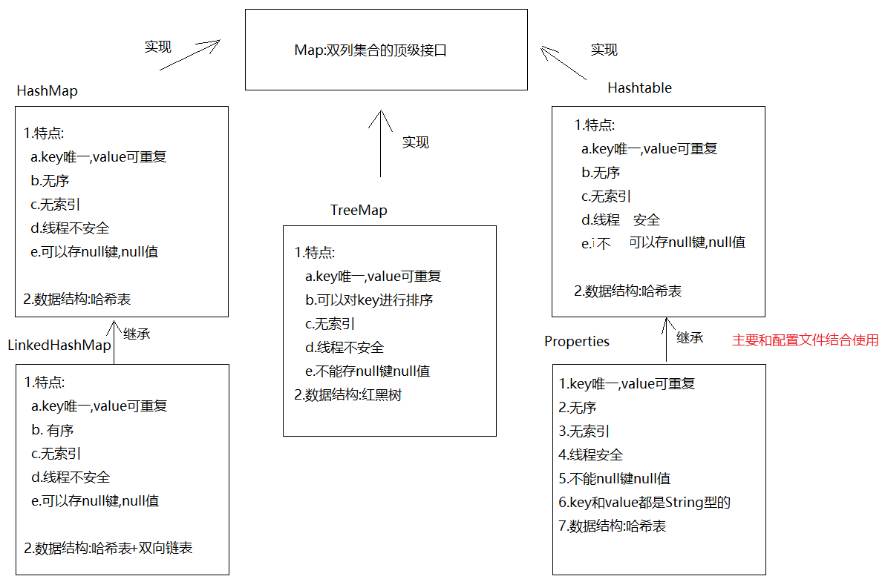

### 10.2 HashMap

| 特点 | 说明 |
|------|------|
| key 唯一 | key 重复时 value 覆盖 |
| 元素无序 | |
| 无索引 | |
| 线程不安全 | 高并发用 `ConcurrentHashMap` |
| 可存 null 键 null 值 | |
| **数据结构** | 哈希表（数组 + 链表 + 红黑树） |

**常用方法：**

| 方法 | 说明 |
|------|------|
| `V put(K key, V value)` | 添加键值对，返回被覆盖的旧 value（首次返回 null） |
| `V remove(Object key)` | 根据 key 删除，返回被删除的 value |
| `V get(Object key)` | 根据 key 获取 value |
| `boolean containsKey(Object key)` | 是否包含指定 key |
| `boolean containsValue(Object value)` | 是否包含指定 value |
| `Collection<V> values()` | 获取所有 value 的集合 |
| `Set<K> keySet()` | 获取所有 key 的 Set 集合 |
| `Set<Map.Entry<K,V>> entrySet()` | 获取所有键值对的 Set 集合 |
| `int size()` | 返回键值对个数 |

```java
HashMap<String, String> map = new HashMap<>();
map.put("猪八戒", "嫦娥");
String old = map.put("猪八戒", "高翠兰"); // 覆盖，返回 "嫦娥"
map.put("唐僧", "女儿国国王");
map.put(null, null); // 允许 null 键 null 值

map.remove("唐僧");                    // 删除
System.out.println(map.get("猪八戒")); // 高翠兰
System.out.println(map.containsKey("猪八戒")); // true

Collection<String> values = map.values(); // 所有 value
```

### 10.3 HashMap 两种遍历方式

#### 方式一：keySet（先获取 key，再通过 key 获取 value）

```java
// Set<K> keySet() → 获取所有 key，存入 Set
Set<String> keys = map.keySet();
for (String key : keys) {
    System.out.println(key + " → " + map.get(key));
}
```

#### 方式二：entrySet（直接获取键值对 Entry）

```java
// Set<Map.Entry<K,V>> entrySet() → 获取所有键值对，存入 Set
Set<Map.Entry<String, String>> entries = map.entrySet();
for (Map.Entry<String, String> entry : entries) {
    System.out.println(entry.getKey() + " → " + entry.getValue());
}
```

> 💡 `entrySet()` 方式效率更高，**推荐使用**。只遍历一次 HashMap，不需要根据 key 二次查找 value。

### 10.4 LinkedHashMap

```java
// LinkedHashMap extends HashMap
// 特点：在 HashMap 基础上，保证 key 按插入顺序输出（有序）
// 数据结构：哈希表 + 双向链表

LinkedHashMap<String, String> map = new LinkedHashMap<>();
map.put("八戒", "嫦娥");
map.put("涛哥", "金莲");
map.put("涛哥", "三上"); // key 重复，value 覆盖
map.put("唐僧", "女儿国国王");
System.out.println(map); // {八戒=嫦娥, 涛哥=三上, 唐僧=女儿国国王}（有序）
```

### 10.5 HashMap 底层源码分析

**初始化与扩容机制：**

| 参数 | 默认值 | 说明 |
|------|--------|------|
| 初始容量 | **16** | 数组初始长度（`DEFAULT_INITIAL_CAPACITY = 1 << 4`） |
| 最大容量 | `1 << 30` | |
| 加载因子 | **0.75** | 超过 `容量 × 0.75` 时触发扩容 |
| 链表转树阈值 | **8** | 链表长度 ≥ 8 且数组长度 ≥ 64 时转为红黑树 |
| 扩容倍数 | **2 倍** | `newCapacity = oldCapacity << 1` |

```java
// 索引计算公式
i = (数组长度 - 1) & 对象哈希值
// 例：数组长度 16，哈希值 96355
// i = 15 & 96355 = 3
```

**Node 内部类（链表节点）：**

```java
static class Node<K, V> implements Map.Entry<K, V> {
    final int hash;  // 对象哈希值
    final K key;
    V value;
    Node<K, V> next; // 下一个节点（链表）
}
```

**`tableSizeFor`（8421 规则）：** 确保哈希表容量始终是 2 的幂次方，优化性能。

**存储流程：**
```
put(key, value)
  → hash(key) 计算哈希值
  → i = (n-1) & hash 计算数组索引
  → 该位置为空 → 直接存入
  → 该位置不为空（哈希冲突）
    → hash 相同 && equals 相同 → 覆盖 value
    → hash 相同 && equals 不同 → 加入链表/红黑树
```

---

## 十一、TreeSet 与 TreeMap

### 11.1 TreeSet

| 特点 | 说明 |
|------|------|
| 元素唯一 | |
| **自动排序** | 默认按自然顺序（ASCII），可指定比较器 |
| 无索引 | |
| 不能存 null | |
| 线程不安全 | |
| **数据结构** | **红黑树** |

```java
// 构造方法
TreeSet()                                  // 自然顺序（ASCII 升序）
TreeSet(Comparator<? super E> comparator)  // 指定比较器排序

// 自然顺序（String 按 ASCII 升序）
TreeSet<String> set1 = new TreeSet<>();
set1.add("c"); set1.add("a"); set1.add("b");
System.out.println(set1); // [a, b, c]

// 自定义比较器（按 age 升序）
TreeSet<Person> set2 = new TreeSet<>((o1, o2) -> o1.getAge() - o2.getAge());
set2.add(new Person("柳岩", 18));
set2.add(new Person("涛哥", 12));
set2.add(new Person("三上", 20));
System.out.println(set2); // 按年龄升序输出
```

### 11.2 TreeMap

| 特点 | 说明 |
|------|------|
| key 唯一 | |
| **对 key 自动排序** | |
| 无索引 | |
| 不能存 null 键 | |
| 线程不安全 | |
| **数据结构** | **红黑树** |

```java
TreeMap()                                    // 按 key 自然顺序
TreeMap(Comparator<? super K> comparator)    // 按指定比较器排序

TreeMap<String, String> map1 = new TreeMap<>();
map1.put("c", "白毛浮绿水");
map1.put("a", "鹅鹅鹅");
map1.put("b", "曲项向天歌");
System.out.println(map1); // {a=鹅鹅鹅, b=曲项向天歌, c=白毛浮绿水}（key 升序）

// 自定义比较器（按 Person 的 age 升序）
TreeMap<Person, String> map2 = new TreeMap<>((o1, o2) -> o1.getAge() - o2.getAge());
map2.put(new Person("柳岩", 18), "北京");
map2.put(new Person("涛哥", 12), "上海");
```

---

## 十二、Properties 集合

### 12.1 概述

```java
Properties extends Hashtable

特点：
- key 唯一，value 可重复
- 无序、无索引
- 线程安全
- 不能存 null 键 null 值
- key 和 value 默认都是 String 类型
```

### 12.2 特有方法

| 方法 | 说明 |
|------|------|
| `setProperty(String key, String value)` | 存键值对 |
| `getProperty(String key)` | 根据 key 获取 value |
| `Set<String> stringPropertyNames()` | 获取所有 key（相当于 keySet） |
| `load(InputStream in)` | 从 IO 流中加载配置数据 |
| `store(OutputStream out, String comments)` | 将配置写入文件 |

```java
Properties prop = new Properties();
prop.setProperty("username", "root");
prop.setProperty("password", "1234");

System.out.println(prop.getProperty("username")); // root

// 遍历
Set<String> keys = prop.stringPropertyNames();
for (String key : keys) {
    System.out.println(key + " = " + prop.getProperty(key));
}
```

### 12.3 结合 IO 流使用（读取配置文件）

```properties
# jdbc.properties 配置文件
jdbc.username=root
jdbc.password=1234
jdbc.url=jdbc:mysql://localhost:3306/mydb
```

```java
Properties prop = new Properties();
FileInputStream fis = new FileInputStream("module22\\jdbc.properties");
prop.load(fis); // 将配置文件内容加载到 Properties 集合
fis.close();

String username = prop.getProperty("jdbc.username");
String password = prop.getProperty("jdbc.password");
```

> 💡 **使用场景：** 将数据库用户名、密码等配置抽离到 `.properties` 文件，修改配置无需改代码。

---

## 十三、历史集合（Hashtable / Vector）

### 13.1 Hashtable

| 对比项 | HashMap | Hashtable |
|--------|---------|-----------|
| 线程安全 | ❌ 不安全 | ✅ 安全 |
| null 键/值 | ✅ 允许 | ❌ 不允许 |
| 有序 | 无序 | 无序 |
| 性能 | 较高 | 较低（同步锁） |
| 推荐程度 | ✅ 推荐 | ❌ 不推荐（已过时） |

> 💡 **实际开发中：** 需要线程安全的 Map 用 `ConcurrentHashMap`，而非 `Hashtable`。

### 13.2 Vector

```java
// Vector 是 List 接口的实现类，特点与 ArrayList 相似，但线程安全
// 数据结构：数组
// 默认初始容量：10，扩容 2 倍（ArrayList 扩容 1.5 倍）

// 扩容机制：
// 无参构造：超出范围扩容 2 倍（oldCapacity + oldCapacity）
// 有参构造 Vector(int capacity, int increment)：超出范围扩容 oldCapacity + increment
```

> 💡 **实际开发中：** 需要线程安全的 List 用 `CopyOnWriteArrayList`，而非 `Vector`。

---

## 十四、集合嵌套

### 14.1 List 嵌套 List

```java
ArrayList<String> list1 = new ArrayList<>();
list1.add("杨过"); list1.add("小龙女");

ArrayList<String> list2 = new ArrayList<>();
list2.add("涛哥"); list2.add("金莲");

// 外层集合的泛型是内层集合类型
ArrayList<ArrayList<String>> bigList = new ArrayList<>();
bigList.add(list1);
bigList.add(list2);

// 嵌套遍历：先遍历外层，再遍历内层
for (ArrayList<String> innerList : bigList) {
    for (String s : innerList) {
        System.out.println(s);
    }
}
```

### 14.2 List 嵌套 Map

```java
HashMap<Integer, String> class1 = new HashMap<>();
class1.put(1, "张三"); class1.put(2, "李四");

HashMap<Integer, String> class2 = new HashMap<>();
class2.put(1, "黄晓明"); class2.put(2, "杨颖");

ArrayList<HashMap<Integer, String>> list = new ArrayList<>();
list.add(class1);
list.add(class2);

for (HashMap<Integer, String> map : list) {
    for (Map.Entry<Integer, String> entry : map.entrySet()) {
        System.out.println(entry.getKey() + "..." + entry.getValue());
    }
}
```

### 14.3 Map 嵌套 Map

```java
HashMap<Integer, String> javaSE = new HashMap<>();
javaSE.put(1, "张三"); javaSE.put(2, "李四");

HashMap<Integer, String> javaEE = new HashMap<>();
javaEE.put(1, "王五"); javaEE.put(2, "赵六");

HashMap<String, HashMap<Integer, String>> bigMap = new HashMap<>();
bigMap.put("JavaSE", javaSE);
bigMap.put("JavaEE", javaEE);

for (Map.Entry<String, HashMap<Integer, String>> entry : bigMap.entrySet()) {
    System.out.println("课程：" + entry.getKey());
    for (Map.Entry<Integer, String> innerEntry : entry.getValue().entrySet()) {
        System.out.println("  " + innerEntry.getKey() + " - " + innerEntry.getValue());
    }
}
```

---

## 十五、知识总结

### 📋 集合选择指南

```
需要存储数据？
├── 单列集合（Collection）
│   ├── 需要有序且可重复？→ List
│   │   ├── 查询多增删少？→ ArrayList（数组）
│   │   └── 增删多查询少？→ LinkedList（双向链表）
│   └── 需要元素唯一？→ Set
│       ├── 需要有序（插入顺序）？→ LinkedHashSet
│       ├── 需要自动排序？→ TreeSet
│       └── 只需去重无顺序要求？→ HashSet
└── 双列集合（Map，键值对）
    ├── 需要有序（插入顺序）？→ LinkedHashMap
    ├── 需要 key 自动排序？→ TreeMap
    ├── 只需存取无顺序要求？→ HashMap（最常用）
    └── 需要线程安全？→ ConcurrentHashMap
```

---

### 🗂️ 集合特性速查表

#### 单列集合

| 集合 | 有序 | 唯一 | 索引 | 线程安全 | null | 数据结构 |
|------|------|------|------|----------|------|---------|
| `ArrayList` | ✅ | ❌ | ✅ | ❌ | ✅ | 数组 |
| `LinkedList` | ✅ | ❌ | ✅* | ❌ | ✅ | 双向链表 |
| `Vector` | ✅ | ❌ | ✅ | ✅ | ✅ | 数组 |
| `HashSet` | ❌ | ✅ | ❌ | ❌ | ✅(1个) | 哈希表 |
| `LinkedHashSet` | ✅ | ✅ | ❌ | ❌ | ✅(1个) | 哈希表+链表 |
| `TreeSet` | ✅排序 | ✅ | ❌ | ❌ | ❌ | 红黑树 |

> `*` LinkedList 有索引操作方法，但本质上没有索引（需要遍历链表）

#### 双列集合

| 集合 | 有序 | key唯一 | 索引 | 线程安全 | null键值 | 数据结构 |
|------|------|---------|------|----------|---------|---------|
| `HashMap` | ❌ | ✅ | ❌ | ❌ | ✅ | 哈希表 |
| `LinkedHashMap` | ✅ | ✅ | ❌ | ❌ | ✅ | 哈希表+链表 |
| `TreeMap` | ✅排序 | ✅ | ❌ | ❌ | ❌ | 红黑树 |
| `Hashtable` | ❌ | ✅ | ❌ | ✅ | ❌ | 哈希表 |
| `Properties` | ❌ | ✅ | ❌ | ✅ | ❌ | 哈希表 |

---

### ⚡ 核心知识点速记

| 知识点 | 关键记忆 |
|--------|---------|
| 并发修改异常 | 迭代时不能调用集合的 `add/remove`，用 `ListIterator` 代替 |
| ArrayList 扩容 | 初始空数组，首次 add 创建容量 10，超出后扩 **1.5 倍** |
| LinkedList | 双向链表，擅长增删，`addFirst/removeLast` 等首尾操作 |
| HashSet 去重 | 先比 `hashCode()`，再比 `equals()`，两者都需重写 |
| HashMap 默认容量 | 初始 **16**，加载因子 **0.75**，扩容 **2 倍** |
| 链表转红黑树 | 链表长度 **≥ 8** 且数组长度 **≥ 64** 时转换 |
| TreeSet/TreeMap | 红黑树，自动排序，不能存 null |
| 泛型通配符 | `? extends T`（上限，只读）；`? super T`（下限，只写） |
| Comparable vs Comparator | `Comparable`：自身实现，改类；`Comparator`：外部定义，更灵活 |
| 增强 for 原理 | 遍历集合 → 迭代器；遍历数组 → 普通 for |

---

### ⚠️ 常见错误与补充说明

**1. 关于 `CopyOnWriteArrayList`（补充，JDK5+）：**

```java
// 线程安全的 ArrayList 替代品（比 Vector 更高效）
// 原理：写操作时复制一份新数组，读写不互斥
CopyOnWriteArrayList<String> list = new CopyOnWriteArrayList<>();
list.add("元素"); // 线程安全
```

**2. 关于 `ConcurrentHashMap`（补充，推荐用于多线程）：**

```java
// 线程安全的 HashMap 替代品（比 Hashtable 性能好）
// JDK7 用分段锁，JDK8 用 CAS + synchronized
ConcurrentHashMap<String, String> map = new ConcurrentHashMap<>();
```

**3. 关于 `Collections.unmodifiableList`（补充）：**

```java
// 创建不可修改的集合（只读）
List<String> readOnly = Collections.unmodifiableList(list);
// readOnly.add("x"); // ❌ 抛 UnsupportedOperationException
```

**4. JDK9+ 不可变集合（补充）：**

```java
// 更简洁的不可变集合创建方式
List<String> list = List.of("a", "b", "c");     // 不可变 List
Set<String> set = Set.of("a", "b", "c");         // 不可变 Set
Map<String, Integer> map = Map.of("a", 1, "b", 2); // 不可变 Map
```

**5. `HashMap` vs `LinkedHashMap` vs `TreeMap` 选择：**

```
不关心顺序，只要高性能 → HashMap（最常用）
需要按插入顺序输出     → LinkedHashMap
需要按 key 自动排序   → TreeMap（性能略低于 HashMap）
```

**6. 关于 `Arrays.asList` 的注意事项（修正）：**

```java
// Arrays.asList 返回的 List 大小固定，不能 add/remove
List<String> fixedList = Arrays.asList("a", "b", "c");
// fixedList.add("d"); // ❌ UnsupportedOperationException

// 如需可变 List，需包装一层
List<String> modList = new ArrayList<>(Arrays.asList("a", "b", "c"));
modList.add("d"); // ✅
```

**7. `remove` 方法陷阱（已在原文中标注，重点强调）：**

```java
ArrayList<Integer> list = new ArrayList<>(Arrays.asList(1, 2, 3));
// list.remove(1);              // ❌ 调用 remove(int index)，删除索引1的元素 "2"
list.remove(Integer.valueOf(1)); // ✅ 调用 remove(Object o)，删除元素值为 1 的元素
```
