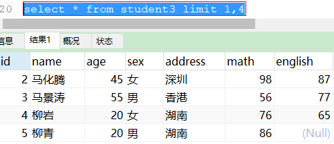
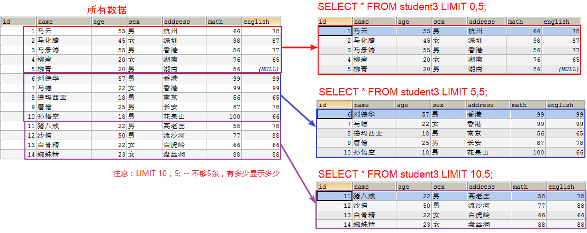
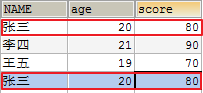
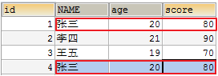
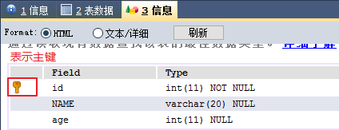
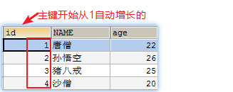
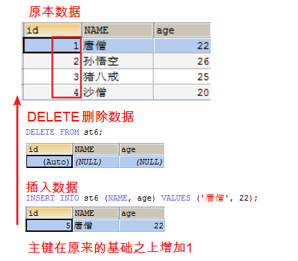
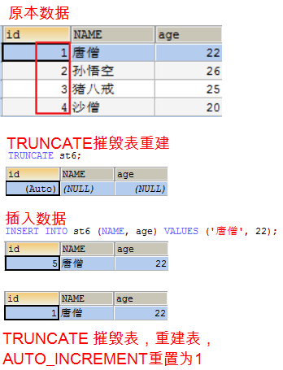

# 🗄️ MySQL高级语法与表设计

## 📚 第一部分：查询优化与约束

### 1. DQL查询语句 - LIMIT语句 🔢

#### 🎯 学习目标
- 掌握LIMIT语句的使用方法

#### 💡 核心作用
`LIMIT`是`限制`的意思，主要用于限制查询记录的条数。

#### 📝 语法格式
```sql
SELECT * FROM 表名 LIMIT offset, row_count;
-- 示例：返回从第2条记录开始的4条数据
SELECT * FROM 表名 LIMIT 1,4;
```

#### 🛠️ 实战演练
**准备测试数据：**
```sql
CREATE TABLE student3 (
  id int,
  name varchar(20),
  age int,
  sex varchar(5),
  address varchar(100),
  math int,
  english int
);

INSERT INTO student3(id,NAME,age,sex,address,math,english) VALUES 
(1,'马云',55,'男','杭州',66,78),
(2,'马化腾',45,'女','深圳',98,87),
(3,'马景涛',55,'男','香港',56,77),
(4,'柳岩',20,'女','湖南',76,65),
(5,'柳青',20,'男','湖南',86,NULL),
(6,'刘德华',57,'男','香港',99,99),
(7,'马德',22,'女','香港',99,99),
(8,'德玛西亚',18,'男','南京',56,65);
```

**查询示例：**
```sql
-- 跳过前面1条，显示4条数据
SELECT * FROM student3 LIMIT 1,4;
```



#### 🌟 分页应用场景
在电商平台等场景中，数据量巨大，需要分页显示：


**分页SQL实现：**
```sql
-- 每页显示5条记录
-- 第一页：LIMIT 0,5
-- 第二页：LIMIT 5,5  
-- 第三页：LIMIT 10,5
SELECT * FROM student3 LIMIT 0,5;
SELECT * FROM student3 LIMIT 5,5;
SELECT * FROM student3 LIMIT 10,5;
```



> **💡 注意事项：**
> - 第一个参数为0时可简写：`LIMIT 5`
> - 数据不足时显示实际条数

#### 📋 总结要点
1. **LIMIT语法格式：**
   ```sql
   SELECT 字段 FROM 表名 LIMIT 索引, 显示条数;
   ```

2. **完整SQL执行顺序：**
   ```sql
   SELECT(5) FROM(1) WHERE(2) GROUP BY(3) HAVING(4) ORDER BY(6) LIMIT(7);
   ```

---

## 🔒 第二部分：数据库约束详解

### 2. 数据库约束概述 🛡️

#### 🎯 学习目标
- 理解数据库约束的重要作用

#### 💡 约束的作用
对表中的数据进行进一步限制，确保数据的**正确性**、**有效性**和**完整性**。

#### 📋 约束类型
- ✅ `PRIMARY KEY`: 主键约束
- 🔑 `UNIQUE`: 唯一约束
- ❌ `NOT NULL`: 非空约束
- ⚙️ `DEFAULT`: 默认值约束
- 🔗 `FOREIGN KEY`: 外键约束

#### 📋 总结要点
- 约束确保数据质量，防止无效数据插入

---

### 3. 主键约束 ⭐

#### 🎯 学习目标
1. 理解主键约束的作用
2. 掌握主键的添加方法

#### 💡 主键的作用
**唯一标识一条记录**，确保数据的唯一性。

#### 🤔 为什么需要主键？
当多条记录的字段值相同时，无法区分数据，造成管理困难：




#### 📝 主键特点
- 每张表只能有一个主键
- 主键值必须唯一且不能为NULL
- 通常使用业务无关的id字段作为主键

#### 🛠️ 创建方式
**方式一：建表时添加**
```sql
字段名 字段类型 PRIMARY KEY
```

**方式二：已有表添加**
```sql
ALTER TABLE 表名 ADD PRIMARY KEY(字段名);
```

#### 💻 实战示例
```sql
-- 创建带主键的表
CREATE TABLE st5 (
	id INT PRIMARY KEY,
	NAME VARCHAR(20),
	age INT
);

-- 插入数据
INSERT INTO st5 (id, NAME,age) VALUES (1, '唐伯虎',20);
INSERT INTO st5 (id, NAME,age) VALUES (2, '周文宾',24);
INSERT INTO st5 (id, NAME,age) VALUES (3, '祝枝山',22);
INSERT INTO st5 (id, NAME,age) VALUES (4, '文征明',26);

-- 错误示例：重复主键
INSERT INTO st5 (id, NAME,age) VALUES (1, '文征明2',30); -- 报错

-- 错误示例：NULL主键
INSERT INTO st5 (id, NAME,age) VALUES (NULL, '文征明3',18); -- 报错
```



#### 📋 总结要点
- 主键作用：唯一标识记录
- 主键特点：唯一性、非空性
- 添加方式：建表时或后期添加

---

### 4. 主键自增 🔄

#### 🎯 学习目标
- 掌握主键自动增长的设置方法

#### 💡 自增优势
避免手动设置主键重复，数据库自动生成唯一ID。

#### 📝 语法格式
```sql
字段名 字段类型 PRIMARY KEY AUTO_INCREMENT
```

#### 💻 实战示例
```sql
-- 创建自增主键表
CREATE TABLE st6 (
	id INT PRIMARY KEY AUTO_INCREMENT,
	NAME VARCHAR(20),
	age INT
);

-- 插入数据（主键自动生成）
INSERT INTO st6 (NAME, age) VALUES ('唐僧', 22);
INSERT INTO st6 (NAME, age) VALUES ('孙悟空', 26);
INSERT INTO st6 (NAME, age) VALUES ('猪八戒', 25);
INSERT INTO st6 (NAME, age) VALUES ('沙僧', 20);
```



#### ⚠️ DELETE vs TRUNCATE
- **DELETE**: 删除数据，不重置自增值
  
- **TRUNCATE**: 重置表，自增值重置为1
  

#### 📋 总结要点
- 自增语法：`PRIMARY KEY AUTO_INCREMENT`
- 自动从1开始递增

---

### 5. 唯一约束 🔐

#### 🎯 学习目标
1. 理解唯一约束的作用
2. 掌握唯一约束的添加方法

#### 💡 约束作用
确保字段值在表中唯一，不允许重复。

#### 📝 语法格式
```sql
字段名 字段类型 UNIQUE
```

#### 💻 实战示例
```sql
-- 创建唯一约束表
CREATE TABLE st7 (
	id INT,
	NAME VARCHAR(20) UNIQUE
);

-- 正常插入
INSERT INTO st7 VALUES (1, '貂蝉');
INSERT INTO st7 VALUES (2, '西施');
INSERT INTO st7 VALUES (3, '王昭君');
INSERT INTO st7 VALUES (4, '杨玉环');

-- 错误示例：重复名称
INSERT INTO st7 VALUES (5, '貂蝉'); -- 报错

-- 特殊情况：多个NULL不算重复
INSERT INTO st7 VALUES (5, NULL);
INSERT INTO st7 VALUES (6, NULL); -- 允许
```

#### 📋 总结要点
- 唯一约束：字段值不能重复
- NULL值：多个NULL不算重复

---

### 6. 非空约束 🚫

#### 🎯 学习目标
1. 理解非空约束的作用
2. 掌握非空约束的添加方法

#### 💡 约束作用
强制字段必须设置值，不能为NULL。

#### 📝 语法格式
```sql
字段名 字段类型 NOT NULL
```

#### 💻 实战示例
```sql
-- 创建非空约束表
CREATE TABLE st8 (
	id INT,
	NAME VARCHAR(20) NOT NULL,
	gender CHAR(2)
);

-- 正常插入
INSERT INTO st8 VALUES (1, '郭富城', '男');
INSERT INTO st8 VALUES (2, '黎明', '男');
INSERT INTO st8 VALUES (3, '张学友', '男');
INSERT INTO st8 VALUES (4, '刘德华', '男');

-- 错误示例：NULL值
INSERT INTO st8 VALUES (5, NULL, '男'); -- 报错
```

#### 🔍 约束对比
- **主键约束**：唯一 + 非空 + 自增（通常用于id）
- **唯一非空**：唯一 + 非空（可用于其他字段）

#### 📋 总结要点
- 非空约束：字段值不能为NULL
- 格式：`NOT NULL`

---

### 7. 默认值约束 ⚙️

#### 🎯 学习目标
1. 理解默认值的作用
2. 掌握默认值的设置方法

#### 💡 约束作用
当插入数据未指定字段值时，自动使用默认值。

#### 📝 语法格式
```sql
字段名 字段类型 DEFAULT 默认值
```

#### 💻 实战示例
```sql
-- 创建默认值表
CREATE TABLE st9 (
	id INT,
	NAME VARCHAR(20),
	address VARCHAR(50) DEFAULT '广州'
);

-- 使用默认值
INSERT INTO st9 (id, NAME) VALUES (1, '刘德华');

-- 不使用默认值
INSERT INTO st9 VALUES (2, '张学友', '香港');
```


#### 📋 总结要点
- 默认值：未指定值时自动填充
- 格式：`DEFAULT 默认值`

---

## 🔗 第三部分：表关系与外键约束

### 8. 表关系概念与设计 🏗️

#### 💡 关系设计重要性
在真实开发中，数据需要合理分表存储，表之间需要建立正确的关系。

#### 📊 三种表关系类型
1. **多对多关系** 🔄
2. **一对多关系** ➡️
3. **一对一关系** ⚖️

---

### 9. 多对多关系设计 🔄

#### 🌟 典型场景
- 程序员 ↔ 项目
- 老师 ↔ 学生
- 学生 ↔ 课程
- 顾客 ↔ 商品

#### 📐 关系分析
**程序员和项目关系：**
- 一个程序员可参与多个项目
- 一个项目可由多个程序员开发


#### 🎨 E-R图表示
- **实体**：矩形表示（如程序员、项目）
- **属性**：椭圆表示（如编号、姓名）
- **关系**：菱形表示

#### 💻 实现方案
**创建中间关系表：**
```sql
-- 程序员表
CREATE TABLE coder(
	id INT PRIMARY KEY AUTO_INCREMENT,
	name VARCHAR(50),
	salary DOUBLE
);

-- 项目表  
CREATE TABLE project(
	id INT PRIMARY KEY AUTO_INCREMENT,
	name VARCHAR(50)
);

-- 中间关系表
CREATE TABLE coder_project(
	coder_id INT,
	project_id INT
);

-- 测试数据
INSERT INTO coder VALUES(1,'张三',12000);
INSERT INTO coder VALUES(2,'李四',15000);
INSERT INTO coder VALUES(3,'王五',18000);

INSERT INTO project VALUES(1,'QQ项目');
INSERT INTO project VALUES(2,'微信项目');

INSERT INTO coder_project VALUES(1,1);
INSERT INTO coder_project VALUES(1,2);
INSERT INTO coder_project VALUES(2,1);
INSERT INTO coder_project VALUES(2,2);
INSERT INTO coder_project VALUES(3,2);
```


#### 📋 总结要点
- 多对多关系需要中间表维护
- 中间表包含两方主键作为外键

---

### 10. 外键约束详解 🔗

#### 💡 外键的作用
确保中间表数据的有效性，维护表间关系的完整性。

#### ⚠️ 无外键的问题
1. **数据无效**：可插入不存在的主表ID
   

2. **关系断裂**：删除主表记录导致中间表数据无效
   
   

#### 📝 外键语法
**基础格式：**
```sql
FOREIGN KEY(当前表字段) REFERENCES 主表(主键字段)
```

**完整格式：**
```sql
CONSTRAINT 约束名 FOREIGN KEY(字段) REFERENCES 主表(主键)
```

#### 🛠️ 添加方式
**方式一：后期添加**
```sql
ALTER TABLE coder_project 
ADD CONSTRAINT c_id_fk FOREIGN KEY(coder_id) REFERENCES coder(id);

ALTER TABLE coder_project  
ADD CONSTRAINT p_id_fk FOREIGN KEY(project_id) REFERENCES project(id);
```

**方式二：建表时添加**
```sql
CREATE TABLE coder_project(
	coder_id INT,
	project_id INT,
    CONSTRAINT c_id_fk FOREIGN KEY(coder_id) REFERENCES coder(id),
    CONSTRAINT p_id_fk FOREIGN KEY(project_id) REFERENCES project(id)
);
```

#### 🔧 实施步骤
1. 清空表数据
   
2. 添加外键约束
   
3. 查看表关系
   
   
   

#### 💻 测试验证
```sql
-- 插入有效数据
INSERT INTO coder VALUES(NULL,'张三',12000);
INSERT INTO project VALUES(NULL,'QQ项目');
INSERT INTO coder_project VALUES(1,1);

-- 测试无效数据（会报错）
INSERT INTO coder_project VALUES(99,1); -- 程序员ID不存在
INSERT INTO coder_project VALUES(1,99); -- 项目ID不存在
```


#### 📋 总结要点
- **外键作用**：数据有效性、关系完整性
- **添加顺序**：先主表后从表
- **删除顺序**：先从表后主表

---

### 11. 外键级联操作 🔄

#### 💡 级联概念
主表数据变更时，自动更新或删除从表相关数据。

#### 📝 级联类型
- `ON UPDATE CASCADE`：级联更新
- `ON DELETE CASCADE`：级联删除

#### 💻 实现方案
```sql
-- 重建表并添加级联
CREATE TABLE coder_project(
	coder_id INT,
	project_id INT,
    CONSTRAINT c_id_fk FOREIGN KEY(coder_id) REFERENCES coder(id) 
        ON UPDATE CASCADE ON DELETE CASCADE,
    CONSTRAINT p_id_fk FOREIGN KEY(project_id) REFERENCES project(id)
        ON UPDATE CASCADE ON DELETE CASCADE
);
```

#### 🧪 测试验证
**级联更新测试：**
```sql
-- 修改主表ID，从表自动更新
UPDATE coder SET id = 4 WHERE id = 3;
```

**级联删除测试：**
```sql
-- 删除主表记录，从表自动删除
DELETE FROM coder WHERE id = 4;
```


#### 📋 总结要点
- **级联更新**：主键修改，外键同步更新
- **级联删除**：主键删除，外键同步删除

---

### 12. 一对多关系设计 ➡️

#### 🌟 典型场景
- 作者 ↔ 小说
- 班级 ↔ 学生
- 部门 ↔ 员工
- 客户 ↔ 订单

#### 📐 关系分析
**作者和小说关系：**
- 一个作者可写多部小说
- 一部小说只能对应一个作者


#### 💡 设计要点
在多的一方添加外键，引用一的一方的主键。

---

### 13. 一对一关系设计 ⚖️

#### 🌟 典型场景
- 人 ↔ 身份证
- 用户 ↔ 用户详情

#### 💡 使用场景
实际开发中使用较少，通常用于数据拆分或权限控制。

---

## 🎯 综合总结

### 📊 约束类型对比
| 约束类型 | 作用 | 特点 | 使用场景 |
|---------|------|------|----------|
| 主键约束 | 唯一标识 | 唯一、非空、可自增 | 表的主标识 |
| 唯一约束 | 值不重复 | 唯一、允许多个NULL | 用户名、邮箱等 |
| 非空约束 | 值必填 | 强制有值 | 重要业务字段 |
| 默认约束 | 自动填充 | 未指定时使用默认值 | 常用默认值字段 |

### 🔗 表关系设计原则
1. **多对多**：中间表 + 双向外键
2. **一对多**：多的一方添加外键
3. **一对一**：较少使用，按需设计

