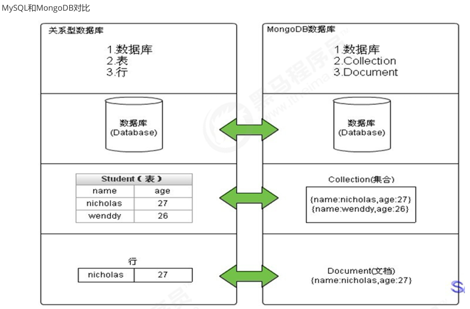
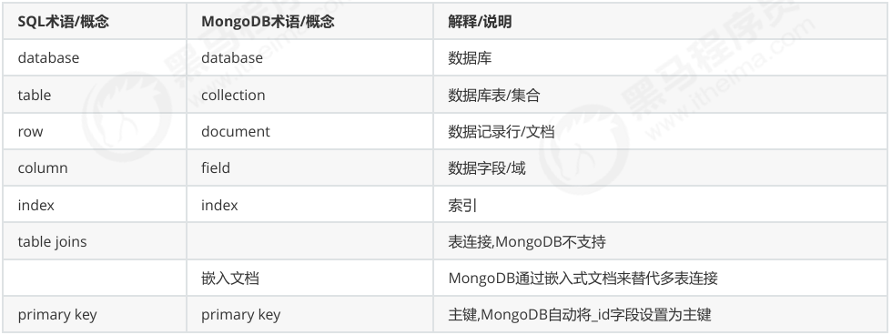
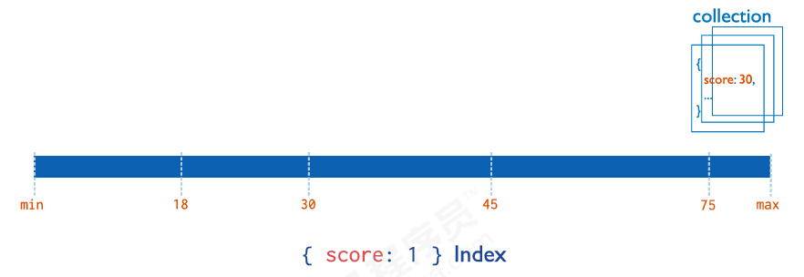
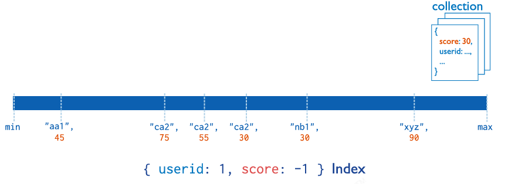
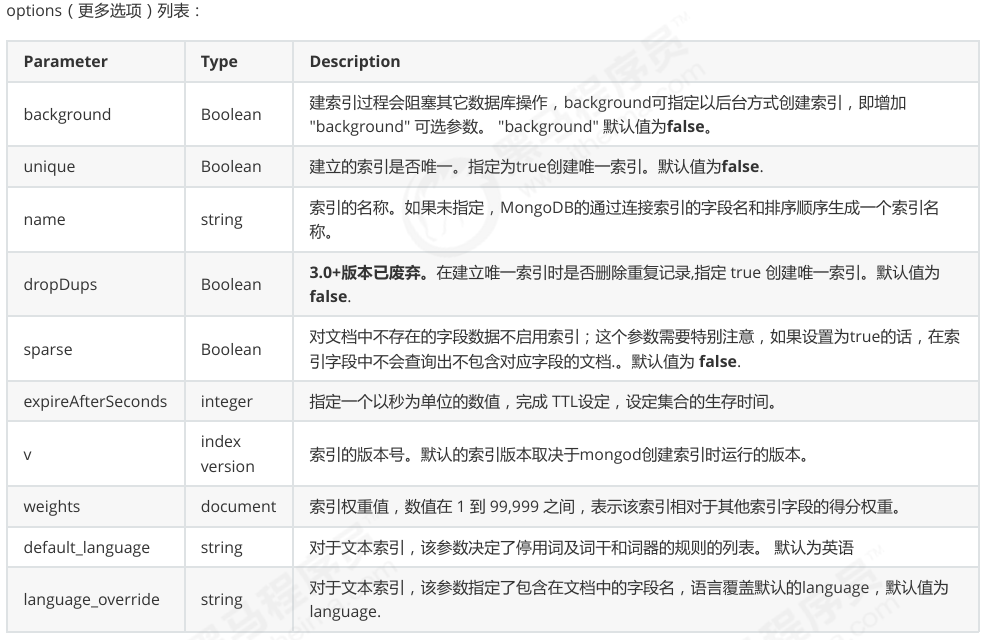
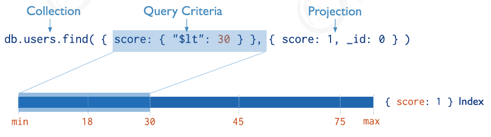

# MongoDB 📊

## 概念 🤔

### 应用场景 🎯

- 社交场景，使用 MongoDB 存储存储用户信息，以及用户发表的朋友圈信息，通过地理位置索引实现附近的人、地点等功能。
- 游戏场景，使用 MongoDB 存储游戏用户信息，用户的装备、积分等直接以内嵌文档的形式存储，方便查询、高效率存储和访问。
- 物流场景，使用 MongoDB 存储订单信息，订单状态在运送过程中会不断更新，以 MongoDB 内嵌数组的形式来存储，一次查询就能将订单所有的变更读取出来。
- 物联网场景，使用 MongoDB 存储所有接入的智能设备信息，以及设备汇报的日志信息，并对这些信息进行多维度的分析。
- 视频直播，使用 MongoDB 存储用户信息、点赞互动信息等。

这些应用场景中，数据操作方面的共同特点是：
+ 数据量大
+ 写入操作频繁（读写都很频繁）
+ 价值较低的数据，对事务性要求不高

对于这样的数据，我们更适合使用MongoDB来实现数据的存储。

### 选择依据 ✅

- 应用不需要事务及复杂 join 支持
- 新应用，需求会变，数据模型无法确定，想快速迭代开发
- 应用需要2000-3000以上的读写QPS（更高也可以）
- 应用需要TB甚至 PB 级别数据存储
- 应用发展迅速，需要能快速水平扩展
- 应用要求存储的数据不丢失
- 应用需要99.999%高可用
- 应用需要大量的地理位置查询、文本查询


### MongoDB 简介 📖

- MongoDB是一个开源、高性能、无模式的文档型数据库，当初的设计就是用于简化开发和方便扩展，是NoSQL数据库产品中的一种。是最像关系型数据库（MySQL）的非关系型数据库。
- 它支持的数据结构非常松散，是一种类似于 JSON 的 格式叫BSON，所以它既可以存储比较复杂的数据类型，又相当的灵活。
- MongoDB中的记录是一个文档，它是一个由字段和值对（field:value）组成的数据结构。MongoDB文档类似于JSON对象，即一个文档认为就是一个对象。字段的数据类型是字符型，它的值除了使用基本的一些类型外，还可以包括其他文档、普通数组和文档数组。

### MongoDB 体系结构 🏗️





## MongoDB 基本常用命令 ⌨️

### 数据库操作 🗄️

#### 1.创建和选择数据库

```sql
use example_database
```


> 在 MongoDB 中，集合只有在内容插入后才会创建! 就是说，创建集合(数据表)后要再插入一个文档(记录)，集合才会真正创建。

#### 2.查看有权限查看的所有的数据库命令

```sql
show dbs
show databases
```


#### 3.查看当前数据库的命令

```sql
db
```


> MongoDB 中默认的数据库为 test，如果你没有选择数据库，集合将存放在 test 数据库中。

另外：
- 数据库名可以是满足以下条件的任意UTF-8字符串。
- 不能是空字符串("")。
- 不得含有' '(空格)、. 、$ 、/ 、\ 和 \0 (空字符)。
- 应全部小写。
- 最多64字节。

有一些数据库名是保留的，可以直接访问这些有特殊作用的数据库。
- admin：从权限的角度来看，这是"root"数据库。要是将一个用户添加到这个数据库，这个用户自动继承所有数据库的权限。一些特定的服务器端命令也只能从这个数据库运行，比如列出所有的数据库或者关闭服务器。
- local：这个数据永远不会被复制，可以用来存储限于本地单台服务器的任意集合
- config：当Mongo用于分片设置时，config数据库在内部使用，用于保存分片的相关信息。

#### 4.数据库的删除

```sql
db.dropDatabase()
```


### 集合操作 📁

#### 1.集合的显式创建

```sql
db.createCollection(name)
```


参数说明：
- name:要创建的集合名称

集合的命名规范：
- 集合名不能是空字符串 "" 。
- 集合名不能含有 \0 字符(空字符)，这个字符表示集合名的结尾。
- 集合名不能以 "system." 开头，这是为系统集合保留的前缀。
- 用户创建的集合名字不能含有保留字符。有些驱动程序的确支持在集合名里面包含，这是因为某些系统生成的集合中包含该字符。除非你要访问这种系统创建的集合，否则千万不要在名字里出现$。

#### 2.查看当前库中的表

```sql
show collections
show tables
```


#### 3.集合的隐式创建

MongoDB 中集合只有在内容插入后才会创建! 就是说，创建集合(数据表)后要再插入一个文档(记录)，集合才会真正创建(隐式创建)。

#### 4.集合的删除

```sql
db.collection.drop()
db.集合.drop()
```


> 如果成功删除选定集合，则 drop() 方法返回 true，否则返回 false

### 文档基本CRUD 🔁

#### 1.文档的插入

```sql
db.collection.insert(
<document or array of documents>,
    {
        writeConcern: <document>,
        ordered: <boolean>
    }
)
```


参数说明：
- document:要插入的文档
- array of documents:要插入的文档数组
- writeConcern:指定写入的配置
- ordered:指定是否按顺序写入

#### 2.批量插入

```sql
db.collection.insertMany(
    [ <document 1> , <document 2>, ... ],
    {
        writeConcern: <document>,
        ordered: <boolean>
    }
)
```


#### 3.文档的基本查询

```sql
db.collection.find()
db.collection.find({})
```


例如：
```sql
db.comment.find({userid:'1003'})
db.comment.findOne({userid:'1003'})
```


#### 4.投影查询(Projection Query) 🎯

如果要查询结果返回部分字段，则需要使用投影查询（不显示所有字段，只显示指定的字段）

如：查询结果只显示: _id 、userid、nickname:
```sql
db.comment.find({userid:"1003"},{userid:1,nickname:1})

{ "_id" : "4", "userid" : "1003", "nickname" : "凯撒" }
{ "_id" : "5", "userid" : "1003", "nickname" : "凯撒" }
```

默认 _id 会显示。

如：查询结果只显示 userid、nickname，不显示 _id ：
```sql
db.comment.find({userid:"1003"},{userid:1,nickname:1,_id:0})

{ "userid" : "1003", "nickname" : "凯撒" }
{ "userid" : "1003", "nickname" : "凯撒" }
```

再例如：查询所有数据，但只显示 _id 、userid、nickname:

```sql
db.comment.find({},{userid:1,nickname:1})
```


#### 5.文档的更新

```sql
db.collection.update(query, update, options)

db.collection.update(
    <query>,
    <update>,
    {
        upsert: <boolean>,
        multi: <boolean>,
        writeConcern: <document>,
        collation: <document>,
        arrayFilters: [ <filterdocument1>, ... ],
        hint:  <document|string>        
    }
)
```


参数说明：
- query: 查询条件
- update: 更新内容
- options: 更新选项
- upsert: 如果没有找到匹配的文档，是否插入新的文档
- multi: 是否更新所有匹配的文档
- writeConcern: 指定写入的配置
- collation: 指定排序规则
- arrayFilters: 筛选数组元素
- hint: 指定索引


- 覆盖修改

```sql
db.collection.update(
    {_id:"1"},{likenum:NumberInt(1001)}
)
```


- 局部修改

```sql
db.collection.update(
    {_id:"1"},{$set:{likenum:NumberInt(1001)}}
)
```


- 批量修改

```sql
//默认只修改第一条数据
db.comment.update(
    {userid:"1003"},{$set:{nickname:"凯撒2"}}
)

//修改所有符合条件的数据
db.comment.update(
    {userid:"1003"},{$set:{nickname:"凯撒大帝"}},
    {multi:true}
)
```


- 列值增长的修改

如果我们想实现对某列值在原有值的基础上进行增加或减少，可以使用 `$inc` 运算符来实现。

需求：对3号数据的点赞数，每次递增1：
```sql
db.comment.update(
    {_id:"3"},{$inc:{likenum:NumberInt(1)}}
)
```
```sql
db.comment.update(
    {_id:"3"},{$inc:{likenum:NumberInt(1)}}
)
```


#### 6.文档的删除

```sql
db.collection.remove(query)

db.collection.remove(
    {}
)
```


### 文档的分页查询 📄

#### 1.统计查询

```sql
db.collection.count(query,options)
```


#### 2.分页查询

```sql
db.collection.find(query).skip(start).limit(pageSize)
```


#### 3.排序查询

```sql
db.collection.find(query).sort(sort)
```


#### 4.正则的复杂条件查询

```sql
db.collection.find(
    {field:/正则表达式/}
)

db.集合.find(
    {字段:/正则表达式/}
)
```


#### 5.比较查询

```sql
db.集合名称.find({ "field" : { $gt: value }}) // 大于: field > value
db.集合名称.find({ "field" : { $lt: value }}) // 小于: field < value
db.集合名称.find({ "field" : { $gte: value }}) // 大于等于: field >= value
db.集合名称.find({ "field" : { $lte: value }}) // 小于等于: field <= value
db.集合名称.find({ "field" : { $ne: value }}) // 不等于: field != value
```


#### 6.包含查询

- 包含使用：`$in`

```sql
db.集合名称.find(
    { "field" : { $in: [value1, value2, ...] }}
)
```


- 不包含使用：`$nin`

```sql
db.集合名称.find(
    { "field" : { $nin: [value1, value2, ...] }}
)
```


#### 7.条件连接查询

- `$and`：逻辑与

```sql
db.集合名称.find(
    { $and: [条件1, 条件2, ...]}
)
```


- `$or`：逻辑或

```sql
db.集合名称.find(
    { $or: [条件1, 条件2, ...]}
)
```


## 索引 🗂️

### 索引概述

- 索引支持在MongoDB中高效地执行查询。如果没有索引，MongoDB必须执行全集合扫描，即扫描集合中的每个文档，以选择与查询语句匹配的文档。这种扫描全集合的查询效率是非常低的，特别在处理大量的数据时，查询可以要花费几十秒甚至几分钟，这对网站的性能是非常致命的。
- 如果查询存在适当的索引，MongoDB可以使用该索引限制必须检查的文档数。
- 索引是特殊的数据结构，它以易于遍历的形式存储集合数据集的一小部分。索引存储特定字段或一组字段的值，按字段值排序。索引项的排序支持有效的相等匹配和基于范围的查询操作。此外，MongoDB还可以使用索引中的排序返回排序结果。

> MongoDB索引使用B树数据结构（确切的说是B-Tree，MySQL是B+Tree）

### 索引类型 🧩

#### 单字段索引

- MongoDB支持在文档的单个字段上创建用户定义的升序/降序索引，称为单字段索引（Single Field Index）。
- 对于单个字段索引和排序操作，索引键的排序顺序（即升序或降序）并不重要，因为MongoDB可以在任何方向上遍历索引。



#### 复合索引

- MongoDB还支持多个字段的用户定义索引，即复合索引（Compound Index）。
- 复合索引中列出的字段顺序具有重要意义。例如，如果复合索引由 { userid: 1, score: -1 } 组成，则索引首先按 userid 正序排序，然后在每个 userid 的值内，再在按 score 倒序排序。



#### 其他索引

地理空间索引（Geospatial Index）、文本索引（Text Indexes）、哈希索引（Hashed Indexes）

- 地理空间索引（Geospatial Index）
    - 为了支持对地理空间坐标数据的有效查询，MongoDB提供了两种特殊的索引：返回结果时使用平面几何的二维索引和返回结果时使用球面几何的二维球面索引。
- 文本索引（Text Indexes）
    - MongoDB提供了一种文本索引类型，支持在集合中搜索字符串内容。这些文本索引不存储特定于语言的停止词（例如"the"、"a"、"or"），而将集合中的词作为词干，只存储根词。
- 哈希索引（Hashed Indexes）
    - 为了支持基于散列的分片，MongoDB提供了散列索引类型，它对字段值的散列进行索引。这些索引在其范围内的值分布更加随机，但只支持相等匹配，不支持基于范围的查询。

### 索引的管理操作 🔧

#### 索引的查看

```sql
db.collection.getIndexes()

> db.comment.getIndexes()
[
    {
        "v" : 2,
        "key" : {
                "_id" : 1
        },
        "name" : "_id_",
        "ns" : "articledb.comment"
    }
]
```


#### 索引的创建

```sql
db.collection.createIndex(keys,options)
```


- keys：索引的字段和索引顺序。索引字段的顺序是索引字段的升序（1）或降序（-1）。索引字段的顺序可以省略，默认为升序。
- options：索引的选项。



> 注意在 3.0.0 版本前创建索引方法为 `db.collection.ensureIndex()` ，之后的版本使用了 `db.collection.createIndex()` 方法，`ensureIndex()` 还能用，但只是 `createIndex()` 的别名。

```sql
db.comment.createIndex({userid:1,nickname:-1})
{
        "createdCollectionAutomatically" : false,
        "numIndexesBefore" : 2,
        "numIndexesAfter" : 3,
        "ok" : 1
}
```


#### 索引的删除

- 指定索引的移除
```sql
db.collection.dropIndex(indexName)
```


- 删除所有索引

```sql
db.collection.dropIndexes()
```


### 索引的优化 🚀

#### 执行计划

- 分析查询性能（Analyze Query Performance）通常使用执行计划（解释计划、Explain Plan）来查看查询的情况，如查询耗费的时间、是否基于索引查询等。

```sql
db.collection.find(query,options).explain(options)
```


#### 涵盖的查询

- Covered Queries 当查询条件和查询的投影仅包含索引字段时，MongoDB直接从索引返回结果，而不扫描任何文档或将文档带入内存。 这些覆盖的查询可以非常有效。

