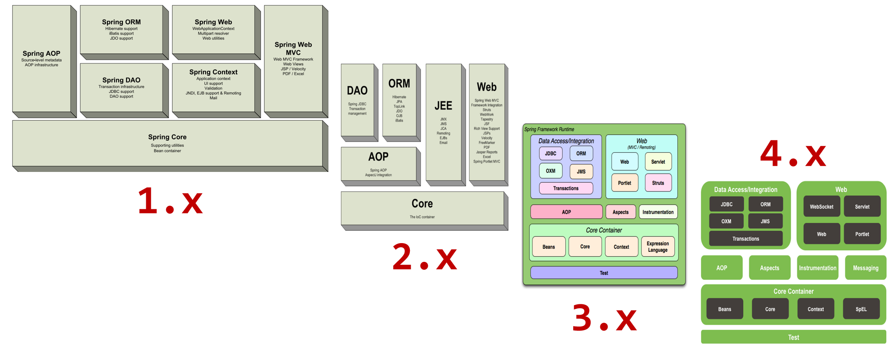
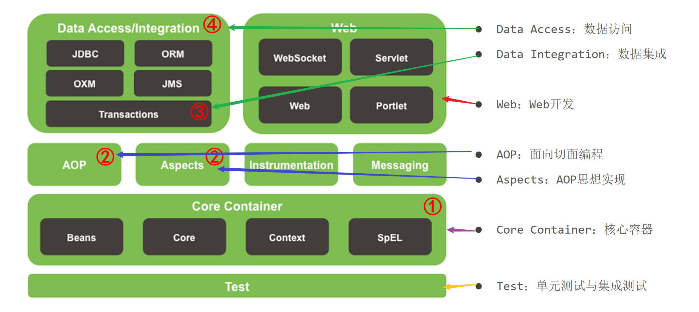
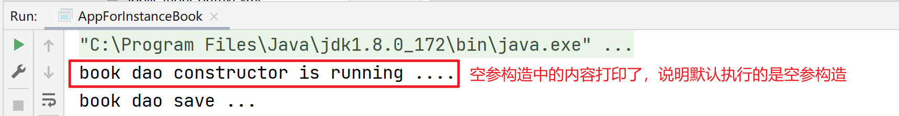
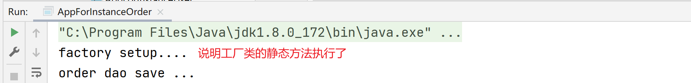
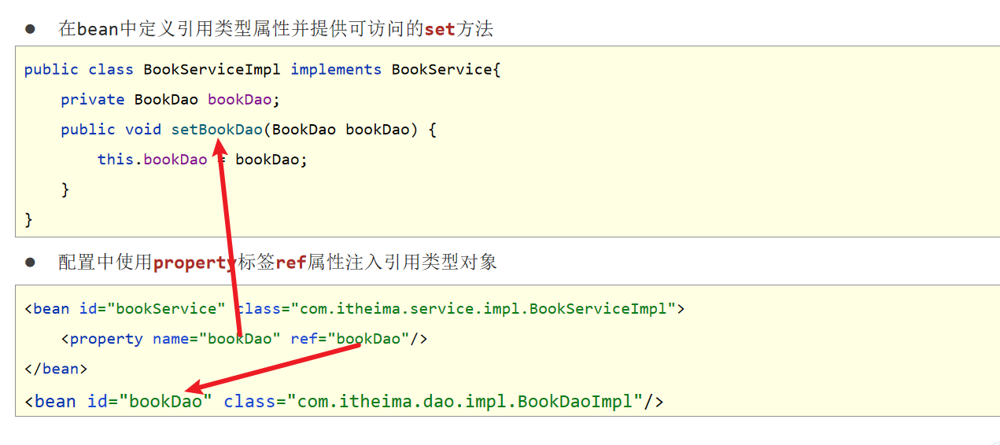
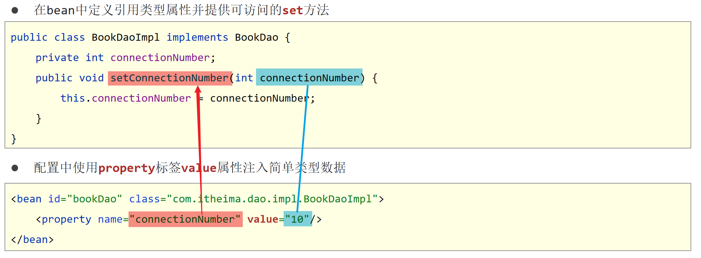
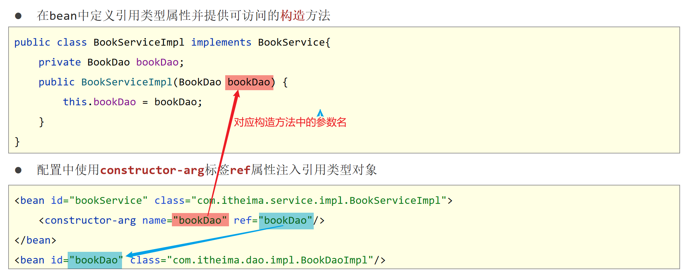
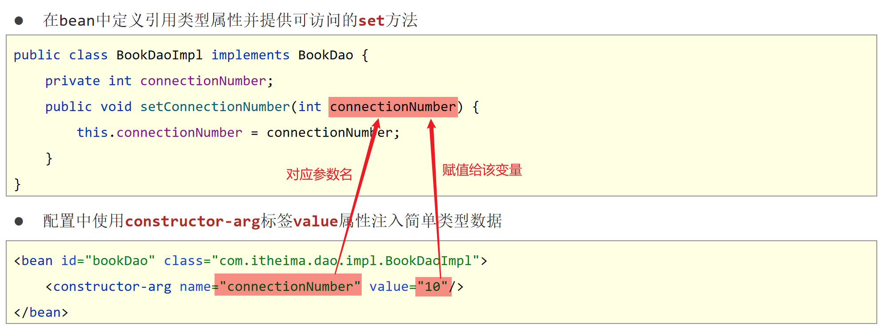
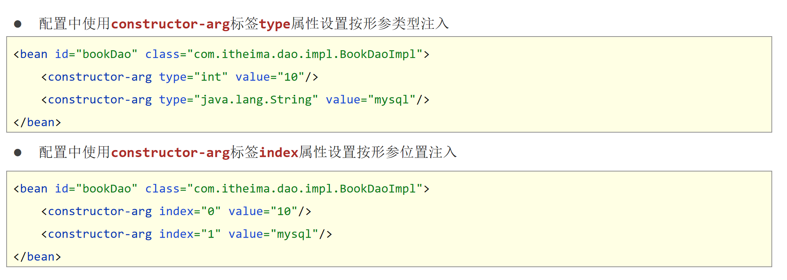

# 🌟 Spring AOP & IOC & DI 学习笔记

## Spring 框架介绍

### IOC (控制反转)
- 使用对象时，由主动 `new` 产生对象转换为由外部提供对象，此过程中对象创建控制权由程序转移到外部，此思想称为**控制反转**
- Spring 提供了一个容器，称为 **IOC 容器**，用来充当 IOC 思想中的"外部"
- IOC 容器负责对象的创建、初始化等一系列工作，被创建或被管理的对象在 IoC 容器中统称为 **Bean**

### DI (依赖注入)
- 在容器中建立 bean 与 bean 之间的依赖关系的整个过程，称为**依赖注入**

### AOP
- 面向切面编程（Aspect-Oriented Programming）

### 事务处理
- Spring 提供了声明式事务管理和编程式事务管理

---

### Spring Framework 系统架构图
- Spring Framework 是 Spring 生态圈中最基础的项目，是其他项目的根基  
    
  

---

## IOC 和 DI 入门

### IOC 实例实现步骤

1. 导入 Spring 坐标
   ```xml
   <dependencies>
       <dependency>
           <groupId>org.springframework</groupId>
           <artifactId>spring-context</artifactId>
           <version>5.2.10.RELEASE</version>
       </dependency>
   </dependencies>
   ```


2. 定义 Spring 管理的类（接口）
   ```java
   public interface BookDao {
       public void save();
   }

   public class BookDaoImpl implements BookDao {
       public void save() {
           System.out.println("book dao save ...");
       }
   }
   ```


3. 创建 Spring 配置文件，配置对应类作为 Spring 管理的 bean 对象
   ```xml
   <?xml version="1.0" encoding="UTF-8"?>
   <beans xmlns="http://www.springframework.org/schema/beans"
          xmlns:xsi="http://www.w3.org/2001/XMLSchema-instance"
          xsi:schemaLocation="http://www.springframework.org/schema/beans http://www.springframework.org/schema/beans/spring-beans.xsd">

       <bean id="bookService" class="course.service.impl.BookServiceImpl"></bean>

   </beans>
   ```


4. 初始化 IOC 容器（Spring 核心容器 / Spring 容器），通过容器获取 bean 对象
   ```java
   public class App {
       public static void main(String[] args) {
           //1.创建IoC容器对象，加载spring核心配置文件
           ApplicationContext ctx = new ClassPathXmlApplicationContext("applicationContext.xml");
           //2 从IOC容器中获取Bean对象(BookService对象)
           BookService bookService= (BookService)ctx.getBean("bookService");
           //3 调用Bean对象(BookService对象)的方法
           bookService.save();
       }
   }
   ```


---

### DI 实例实现步骤

#### 0️⃣ 环境代码

```java
public interface BookService {
    public void save();
}

public class BookServiceImpl implements BookService {
    private BookDao bookDao = new BookDaoImpl();
    public void save() {
        System.out.println("book service save ...");
        bookDao.save();
    }
}
```


#### 1️⃣ 删除使用 new 的形式创建对象的代码

```java
public class BookServiceImpl implements BookService {
    private BookDao bookDao;  //【第一步】删除使用new的形式创建对象的代码
    public void save() {
        System.out.println("book service save ...");
        bookDao.save();
    }
}
```


#### 2️⃣ 提供依赖对象对应的 setter 方法

```java
public class BookServiceImpl implements BookService {
    private BookDao bookDao;
    public void save() {
        System.out.println("book service save ...");
        bookDao.save();
    }
    //【第二步】提供依赖对象对应的setter方法
    public void setBookDao(BookDao bookDao) {
        this.bookDao = bookDao;
    }
}
```


#### 3️⃣ 配置 service 与 dao 之间的关系

```xml
<?xml version="1.0" encoding="UTF-8"?>
<beans xmlns="http://www.springframework.org/schema/beans"
       xmlns:xsi="http://www.w3.org/2001/XMLSchema-instance"
       xsi:schemaLocation="http://www.springframework.org/schema/beans http://www.springframework.org/schema/beans/spring-beans.xsd">
    <!--
		bean标签：表示配置bean
    	id属性：表示给bean起名字
    	class属性：表示给bean定义类型
	-->
    <bean id="bookDao" class="course.dao.impl.BookDaoImpl"/>

    <bean id="bookService" class="course.service.impl.BookServiceImpl">
        <!--配置server与dao的关系
			property标签：表示配置当前bean的属性
        	name属性：表示配置哪一个具体的属性
        	ref属性：表示参照哪一个bean
		-->
        <property name="bookDao" ref="bookDao"/>
    </bean>
</beans>
```


---

## Bean 的实例化四种方式

### 构造方法实例化

1. `BookDaoImpl` 实现类
   ```java
   public class BookDaoImpl implements BookDao {
       public BookDaoImpl() {
           System.out.println("book dao constructor is running ....");
       }
       public void save() {
           System.out.println("book dao save ...");
       }
   }
   ```


2. `applicationContext.xml` 配置
   ```xml
   <!--方式一：构造方法实例化bean-->
   <bean id="bookDao" class="course.dao.impl.BookDaoImpl"/>
   ```


3. `AppForInstanceBook` 测试类
   ```java
   public class AppForInstanceBook {
       public static void main(String[] args) {
           ApplicationContext ctx = new ClassPathXmlApplicationContext("applicationContext.xml");
           BookDao bookDao = (BookDao) ctx.getBean("bookDao");
           bookDao.save();
       }
   }
   ```


4. 运行结果  
   

---

### 静态工厂实例化

1. `OrderDao` 接口和 `OrderDaoImpl` 实现类
   ```java
   public interface OrderDao {
       public void save();
   }
   public class OrderDaoImpl implements OrderDao {
       public void save() {
           System.out.println("order dao save ...");
       }
   }
   ```


2. `OrderDaoFatory` 工厂类
   ```java
   public class OrderDaoFactory {
       public static OrderDao getOrderDao(){
           System.out.println("factory setup....");
           return new OrderDaoImpl();
       }
   }
   ```


3. `applicationContext.xml` 配置
   ```xml
   <!--方式二：使用静态工厂实例化bean-->
   <bean id="orderDao" class="course.factory.OrderDaoFactory" factory-method="getOrderDao"/>
   ```


4. `AppForInstanceOrder` 测试类
   ```java
   public class AppForInstanceOrder {
       public static void main(String[] args) {
           ApplicationContext ctx = new ClassPathXmlApplicationContext("applicationContext.xml");
           OrderDao orderDao = (OrderDao) ctx.getBean("orderDao");
           orderDao.save();
       }
   }
   ```


5. 运行结果  
   

---

### 实例工厂实例化

1. `UserDao` 接口和 `UserDaoImpl` 实现类
   ```java
   public interface UserDao {
       public void save();
   }
   public class UserDaoImpl implements UserDao {
       public void save() {
           System.out.println("user dao save ...");
       }
   }
   ```


2. `UserDaoFactory` 工厂类
   ```java
   //实例工厂创建对象
   public class UserDaoFactory {
       public UserDao getUserDao(){
           return new UserDaoImpl();
       }
   }
   ```


3. `applicationContext.xml` 配置
   ```xml
   <!--方式三：使用实例工厂实例化bean-->
   <bean id="userFactory" class="course.factory.UserDaoFactory"/>
   <bean id="userDao" factory-method="getUserDao" factory-bean="userFactory"/>
   ```


4. `AppForInstanceUser` 测试类
   ```java
   public class AppForInstanceUser {
       public static void main(String[] args) {
           ApplicationContext ctx = new ClassPathXmlApplicationContext("applicationContext.xml");
           UserDao userDao = (UserDao) ctx.getBean("userDao");
           userDao.save();
       }
   }
   ```


5. 运行结果  
   

---

### 实现 `FactoryBean<T>` 方式实例化

1. 定义 `UserDaoFactoryBean` 实现 `FactoryBean<UserDao>` 接口
   ```java
   //FactoryBean创建对象
   public class UserDaoFactoryBean implements FactoryBean<UserDao> {
       //代替原始实例工厂中创建对象的方法
       public UserDao getObject() throws Exception {
           return new UserDaoImpl();
       }

       public Class<?> getObjectType() {
           return UserDao.class;
       }
   }
   ```


2. `applicationContext.xml` 配置
   ```xml
   <!--方式四：使用FactoryBean实例化bean-->
   <bean id="userDao" class="course.factory.UserDaoFactoryBean"/>
   ```


---

## 依赖注入详解

### setter 方法注入

- 引用类型  
  

- 简单类型  
  

---

### 构造方法注入

- 引用类型  
  

- 简单类型  
  

- 参数适配  
  

---

### 依赖注入方式选择

1. 强制依赖使用构造器进行，使用 setter 注入有概率不进行注入导致 null 对象出现
2. 可选依赖使用 setter 注入进行，灵活性强
3. Spring 框架倡导使用构造器，第三方框架内部大多数采用构造器注入的形式进行数据初始化，相对严谨
4. 如果有必要可以两者同时使用，使用构造器注入完成强制依赖的注入，使用 setter 注入完成可选依赖的注入
5. 实际开发过程中还要根据实际情况分析，如果受控对象没有提供 setter 方法就必须使用构造器注入
6. 自己开发的模块推荐使用 setter 注入

---

### 集合注入

- 注入数组类型数据
  ```xml
  <property name="array">
      <array>
          <value>100</value>
          <value>200</value>
          <value>300</value>
      </array>
  </property>
  ```


- 注入 List 类型数据
  ```xml
  <property name="list">
      <list>
          <value>100</value>
          <value>200</value>
          <value>300</value>
      </list>
  </property>
  ```


- 注入 Set 类型数据
  ```xml
  <property name="set">
      <set>
          <value>100</value>
          <value>200</value>
          <value>300</value>
      </set>
  </property>
  ```


- 注入 Map 类型数据
  ```xml
  <property name="map">
      <map>
          <entry key="a" value="100"/>
          <entry key="b" value="200"/>
          <entry key="c" value="300"/>
      </map>
  </property>
  ```


- 注入 Properties 类型数据
  ```xml
  <property name="props">
      <props>
          <prop key="a">100</prop>
          <prop key="b">200</prop>
          <prop key="c">300</prop>
      </props>
  </property>
  ```


> `property` 标签表示 `setter` 方式注入，构造方式注入 `constructor-arg` 标签内部也可以写 `<array>`、`<list>`、`<set>`、`<map>`、`<props>` 标签

---

## Bean 的生命周期

### Bean 生命周期控制实例

```java
public class BookDaoImpl implements BookDao {
    public void save() {
        System.out.println("book dao save ...");
    }

    public void init(){
        System.out.println("init...");
    }

    public void destory(){
        System.out.println("destory...");
    }
}
```


- `applicationContext.xml` 配置
  ```xml
  <!--init-method：设置bean初始化生命周期回调函数,此处填写init方法名-->
  <!--destroy-method：设置bean销毁生命周期回调函数，仅适用于单例对象，此处填写destory方法名-->
  <bean id="bookDao" class="course.dao.impl.BookDaoImpl" init-method="init" destroy-method="destory"/>
  ```


- 测试类
  ```java
  public class AppForLifeCycle {
      public static void main(String[] args) {
          ApplicationContext ctx = new ClassPathXmlApplicationContext("applicationContext.xml");
          BookDao bookDao = (BookDao) ctx.getBean("bookDao");
          bookDao.save();
          //关闭容器
          ((ClassPathXmlApplicationContext) ctx).close();
      }
  }
  ```


---

### Bean 生命周期控制

- 实现 `InitializingBean`, `DisposableBean` 接口
  ```java
  public class BookServiceImpl implements BookService, InitializingBean, DisposableBean {
      private BookDao bookDao;
      public void setBookDao(BookDao bookDao) {
          System.out.println("set .....");
          this.bookDao = bookDao;
      }
      public void save() {
          System.out.println("book service save ...");
          bookDao.save();
      }
      public void destroy() throws Exception {
          System.out.println("service destroy");
      }
      public void afterPropertiesSet() throws Exception {
          System.out.println("service init");
      }
  }
  ```


---

### Bean 销毁时机

- 容器关闭前触发 bean 的销毁
- 关闭容器方式：
  - 手工关闭容器  
    `ConfigurableApplicationContext` 接口 `close()` 操作
  - 注册关闭钩子，在虚拟机退出前先关闭容器再退出虚拟机  
    `ConfigurableApplicationContext` 接口 `registerShutdownHook()` 操作

```java
public class AppForLifeCycle {
  public static void main( String[] args ) {
    //此处需要使用实现类类型，接口类型没有close方法
    ClassPathXmlApplicationContext ctx = new ClassPathXmlApplicationContext("applicationContext.xml");

    BookDao bookDao = (BookDao) ctx.getBean("bookDao");
    bookDao.save();
    //注册关闭钩子函数，在虚拟机退出之前回调此函数，关闭容器
    ctx.registerShutdownHook();
    //关闭容器
    //ctx.close();
  }
}
```
