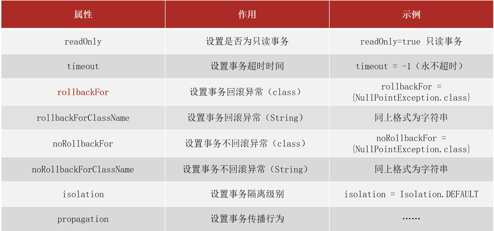

# Spring 事务学习笔记

## Spring 事务基础

### Spring 事务作用
- **事务作用**：在数据层保障一系列的数据库操作同成功同失败
- **Spring 事务作用**：在数据层或业务层保障一系列的数据库操作同成功同失败

### Spring 事务核心注解
- `@Transactional`: 声明式事务管理
- `@EnableTransactionManagement`: 开启事务管理

---

## Spring 事务使用指南

### 1️⃣ 在业务层接口上添加 Spring 事务管理
```java
public interface AccountService {
    @Transactional
    public void transfer(String out,String in ,Double money) ;
}
```


#### 💡 最佳实践
- Spring 注解式事务通常添加在业务层接口中而不会添加到业务层实现类中，降低耦合
- 注解式事务可以添加到业务方法上表示当前方法开启事务，也可以添加到接口上表示当前接口所有方法开启事务

### 2️⃣ 设置事务管理器
```java
//配置事务管理器，mybatis使用的是jdbc事务
@Bean
public PlatformTransactionManager transactionManager(DataSource dataSource){
    DataSourceTransactionManager transactionManager = new DataSourceTransactionManager();
    transactionManager.setDataSource(dataSource);
    return transactionManager;
}
```


#### 🎯 重要提示
- 事务管理器要根据实现技术进行选择
- MyBatis 框架使用的是 JDBC 事务

### 3️⃣ 开启注解式事务驱动
```java
@Configuration
@ComponentScan("com.itheima")
@PropertySource("classpath:jdbc.properties")
@Import({JdbcConfig.class,MybatisConfig.class})
@EnableTransactionManagement
public class SpringConfig {
}
```


---

## 事务配置详解

### 事务回滚机制


#### 回滚规则
- 对于 `RuntimeException` 类型异常或者 `Error` 错误，Spring 事务能够进行回滚操作
- 对于编译器异常，Spring 事务是不进行回滚的，所以需要使用 `rollbackFor` 来设置要回滚的异常

#### 解决方案
```java
@Transactional(rollbackFor = Exception.class)
public void someMethod() {
    // 业务逻辑
}
```
