# 🚀 SpringCloud高级

## 📦 Nacos配置管理

> Nacos 除了可以做注册中心，同样可以做配置管理来使用。

### 🔧 统一配置管理

当微服务部署的实例越来越多，达到数十、数百时，逐个修改微服务配置就会让人抓狂，而且很容易出错。我们需要一种统一配置管理方案，可以集中管理所有实例的配置。

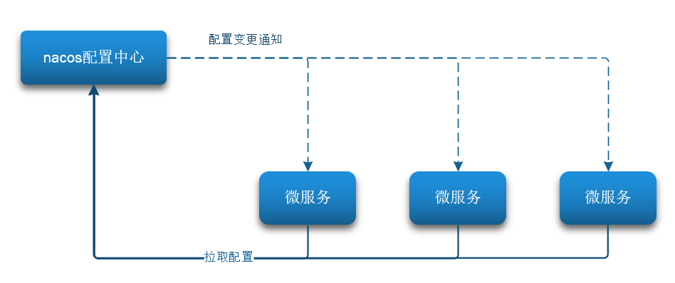

Nacos 一方面可以将配置集中管理，另一方可以在配置变更时，及时通知微服务，实现配置的热更新。

#### 1️⃣ 在 Nacos 中添加配置文件

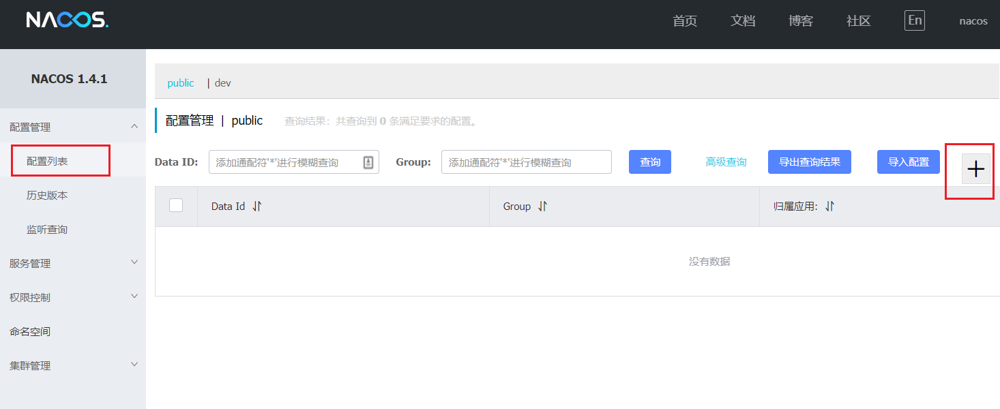

然后在弹出的表单中，填写配置信息：

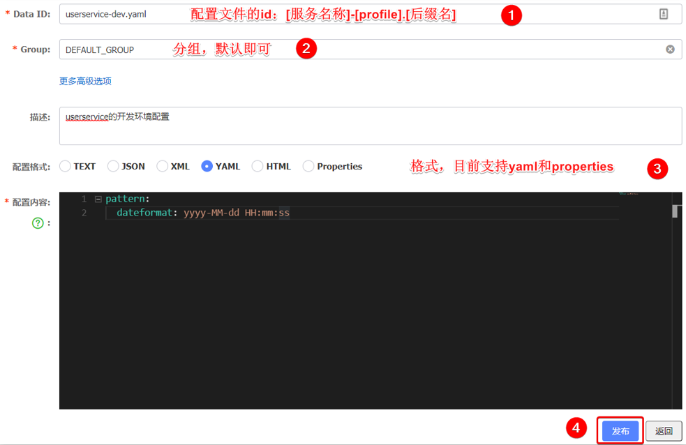

> 🔔 **注意**：项目的核心配置，需要热更新的配置才有放到 Nacos 管理的必要。基本不会变更的一些配置还是保存在微服务本地比较好。

#### 2️⃣ 从微服务拉取配置

微服务要拉取 Nacos 中管理的配置，并且与本地的 `application.yml` 配置合并，才能完成项目启动。

但如果尚未读取 `application.yml`，又如何得知 Nacos 地址呢？

因此 Spring 引入了一种新的配置文件：`bootstrap.yaml` 文件，会在 `application.yml` 之前被读取，流程如下：

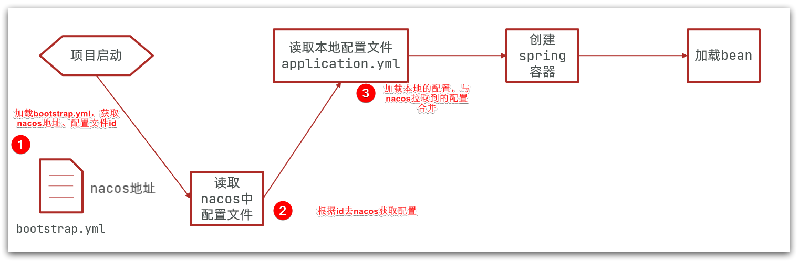

##### ① 引入 `nacos-config` 依赖

```xml
<!--nacos配置管理依赖-->
<dependency>
    <groupId>com.alibaba.cloud</groupId>
    <artifactId>spring-cloud-starter-alibaba-nacos-config</artifactId>
</dependency>
```

##### ② 添加 `bootstrap.yaml` 配置文件

```yaml
spring:
  application:
    name: userservice # 服务名称
  profiles:
    active: dev #开发环境，这里是dev 
  cloud:
    nacos:
      server-addr: localhost:8848 # Nacos地址
      config:
        file-extension: yaml # 文件后缀名
```

这里会根据 `spring.cloud.nacos.server-addr` 获取 Nacos 地址，再根据  
`${spring.application.name}-${spring.profiles.active}.${spring.cloud.nacos.config.file-extension}` 作为文件 id，来读取配置。

本例中，就是去读取 `userservice-dev.yaml`：

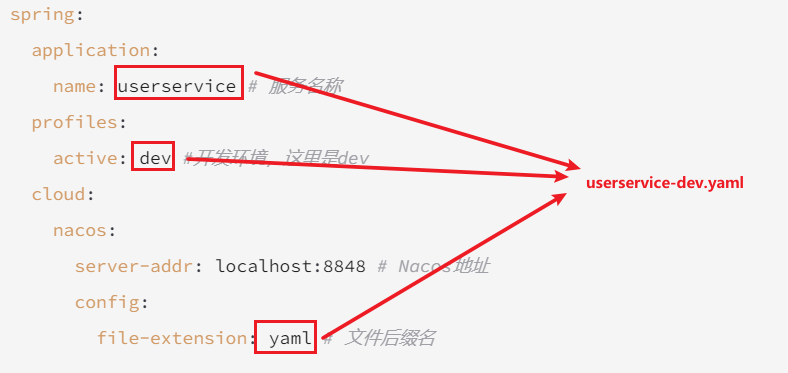

##### ③ 读取 Nacos 配置

```java
@Slf4j
@RestController
@RequestMapping("/user")
public class UserController {

    @Autowired
    private UserService userService;

    @Value("${pattern.dateformat}")
    private String dateformat;
    
    @GetMapping("now")
    public String now(){
        return LocalDateTime.now().format(DateTimeFormatter.ofPattern(dateformat));
    }
}
```

在页面访问，可以看到效果：

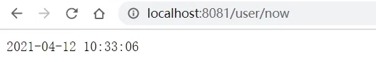

### 🔥 热更新配置

我们最终的目的，是修改 Nacos 中的配置后，微服务中无需重启即可让配置生效，也就是**配置热更新**。

要实现配置热更新，可以使用两种方式：

#### 1️⃣ 使用 `@RefreshScope` 注解

在 `@Value` 注入的变量所在类上添加注解 `@RefreshScope`：

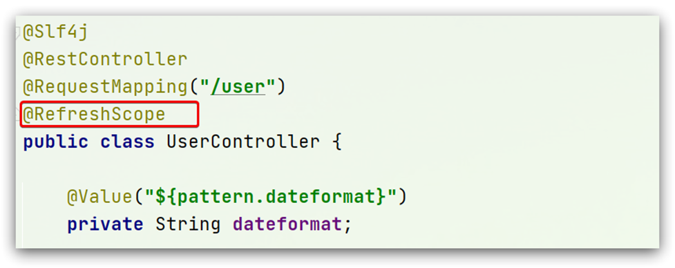

#### 2️⃣ 使用 `@ConfigurationProperties` 注解

使用 `@ConfigurationProperties` 注解代替 `@Value` 注解。

在 user-service 服务中，添加一个类，读取 `pattern.dateformat` 属性：

```java
@Data
@Component
@ConfigurationProperties(prefix = "pattern")
public class PatternProperties {
    private String dateformat;
}
```

```java
@Slf4j
@RestController
@RequestMapping("/user")
public class UserController {
    @Autowired
    private UserService userService;

    @Autowired
    private PatternProperties patternProperties;

    @GetMapping("now")
    public String now(){
        return LocalDateTime.now().format(DateTimeFormatter.ofPattern(patternProperties.getDateformat()));
    }
}
```

### 🤝 配置共享

其实微服务启动时，会去 Nacos 读取多个配置文件，例如：

- `[spring.application.name]-[spring.profiles.active].yaml`，例如：`userservice-dev.yaml`
- `[spring.application.name].yaml`，例如：`userservice.yaml`

而 `[spring.application.name].yaml` 不包含环境，因此可以被多个环境共享。

#### 1️⃣ 添加一个环境共享配置

我们在 Nacos 中添加一个 `userservice.yaml` 文件：

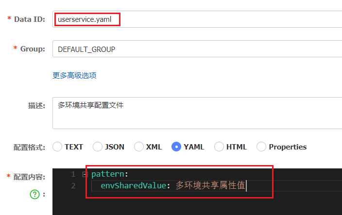

#### 2️⃣ 在 user-service 中读取共享配置

在 user-service 服务中，修改 `PatternProperties` 类，读取新添加的属性：

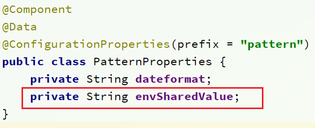

在 user-service 服务中，修改 `UserController`，添加一个方法：

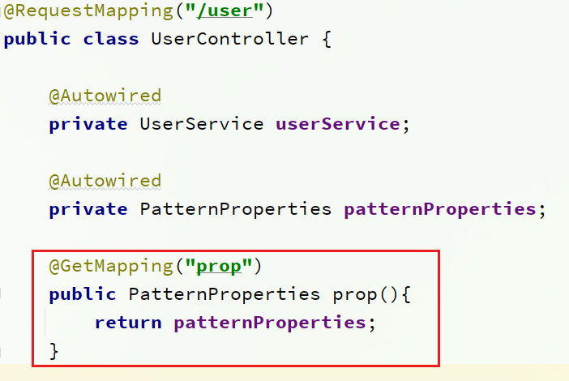

#### 3️⃣ 运行两个 `UserApplication`，使用不同的 profile

修改 `UserApplication2` 这个启动项，改变其 `profile` 值：

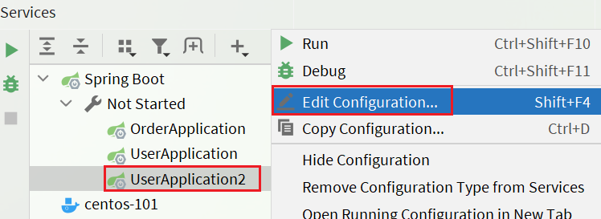

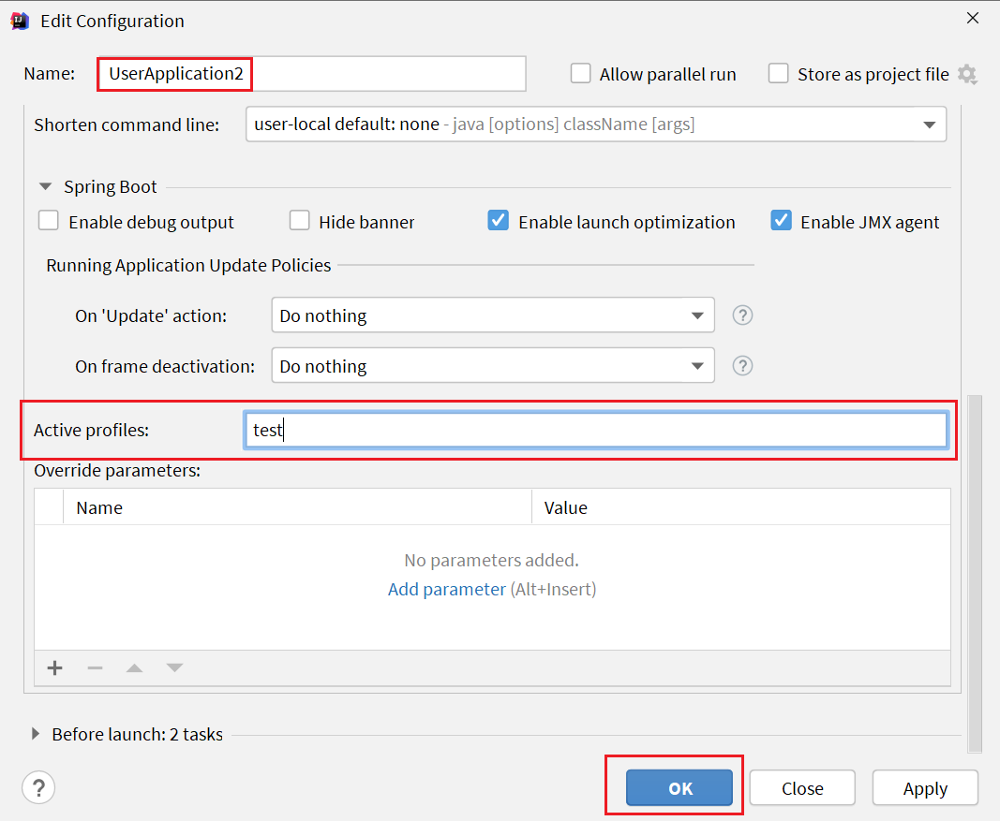

这样，`UserApplication(8081)` 使用的 `profile` 是 `dev`，`UserApplication2(8082)` 使用的 `profile` 是 `test`。

启动 `UserApplication` 和 `UserApplication2`

访问 http://localhost:8081/user/prop，结果：

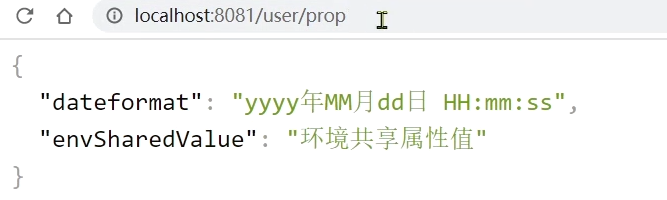

访问 http://localhost:8082/user/prop，结果：

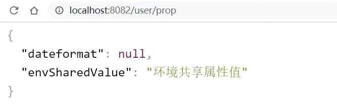

可以看出来，不管是 `dev`，还是 `test` 环境，都读取到了 `envSharedValue` 这个属性的值。

#### 4️⃣ 配置共享的优先级

当 Nacos、服务本地同时出现相同属性时，优先级有高低之分：

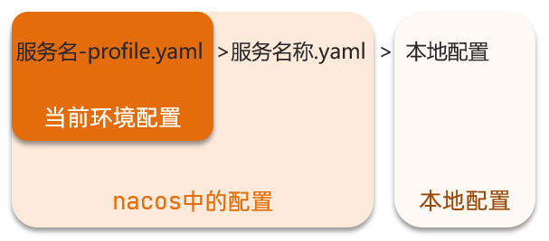

> 💡 **提示**：配置共享常用于多环境共用的配置，如数据库连接池参数、日志级别等。

---

## 📞 Feign 远程调用

### 🔄 Feign 替代 `RestTemplate`

#### 1️⃣ 引入依赖

```xml
<!--feign依赖-->
<dependency>
    <groupId>org.springframework.cloud</groupId>
    <artifactId>spring-cloud-starter-openfeign</artifactId>
</dependency>
```

#### 2️⃣ 添加注解

在启动类中添加注解 `@EnableFeignClients`：

```java
@EnableFeignClients
@SpringBootApplication
public class OrderApplication {
    public static void main(String[] args) {
        SpringApplication.run(OrderApplication.class, args);
    }
}
```

#### 3️⃣ 定义 Feign 客户端

定义一个 Feign 客户端，用于调用 user-service 服务：

```java
@FeignClient("userservice")
public interface UserClient {
    @GetMapping("/user/{id}")
    User findById(@PathVariable("id") Long id);
}
```

这个客户端主要是基于 SpringMVC 的注解来声明远程调用的信息，比如：

- 服务名称：userservice
- 请求方式：GET
- 请求路径：/user/{id}
- 请求参数：Long id
- 返回值类型：User

这样，Feign 就可以帮助我们发送 http 请求，无需自己使用 RestTemplate 来发送了。

#### 4️⃣ 总结

使用 Feign 的步骤：

① 引入依赖  
② 添加 `@EnableFeignClients` 注解  
③ 编写 `FeignClient` 接口  
④ 使用 FeignClient 中定义的方法代替 RestTemplate

### ⚙️ 自定义配置

Feign 可以支持很多的自定义配置，如下表所示：

| 类型                     | 作用       | 说明                                |
| ---------------------- | -------- | --------------------------------- |
| **feign.Logger.Level** | 修改日志级别   | 包含四种不同的级别：NONE、BASIC、HEADERS、FULL |
| feign.codec.Decoder    | 响应结果的解析器 | http远程调用的结果做解析，例如解析json字符串为java对象 |
| feign.codec.Encoder    | 请求参数编码   | 将请求参数编码，便于通过http请求发送              |
| feign.Contract         | 支持的注解格式  | 默认是SpringMVC的注解                   |
| feign.Retryer          | 失败重试机制   | 请求失败的重试机制，默认是没有，不过会使用Ribbon的重试    |

一般情况下，默认值就能满足我们使用，如果要自定义时，只需要创建自定义的 `@Bean` 覆盖默认 Bean 即可。

#### ① 配置文件方式

基于配置文件修改 feign 的日志级别可以针对单个服务：

```yaml
feign:  
  client:
    config: 
      userservice: # 针对某个微服务的配置
        loggerLevel: FULL #  日志级别 
```

也可以针对所有服务：

```yaml
feign:  
  client:
    config: 
      default: # 这里用default就是全局配置，如果是写服务名称，则是针对某个微服务的配置
        loggerLevel: FULL #  日志级别 
```

而日志的级别分为四种：

- **NONE**：不记录任何日志信息，这是默认值。
- **BASIC**：仅记录请求的方法，URL以及响应状态码和执行时间
- **HEADERS**：在BASIC的基础上，额外记录了请求和响应的头信息
- **FULL**：记录所有请求和响应的明细，包括头信息、请求体、元数据。

#### ② 代码方式

也可以基于 Java 代码来修改日志级别，先声明一个类，然后声明一个 `Logger.Level` 的对象：

```java
public class DefaultFeignConfiguration  {
    @Bean
    public Logger.Level feignLogLevel(){
        return Logger.Level.BASIC; // 日志级别为BASIC
    }
}
```

如果要**全局生效**，将其放到启动类的 `@EnableFeignClients` 这个注解中：

```java
@EnableFeignClients(defaultConfiguration = DefaultFeignConfiguration.class) 
```

如果是**局部生效**，则把它放到对应的 `@FeignClient` 这个注解中：

```java
@FeignClient(value = "userservice", configuration = DefaultFeignConfiguration.class) 
```

### 🚀 Feign 使用优化

Feign 底层发起 http 请求，依赖于其它的框架。其底层客户端实现包括：

- **URLConnection**：默认实现，不支持连接池
- **Apache HttpClient**：支持连接池
- **OKHttp**：支持连接池

因此提高 Feign 的性能主要手段就是使用**连接池**代替默认的 URLConnection。

这里我们用 Apache 的 HttpClient 来演示。

#### 1️⃣ 引入依赖

```xml
<!--httpClient的依赖 -->
<dependency>
    <groupId>io.github.openfeign</groupId>
    <artifactId>feign-httpclient</artifactId>
</dependency>
```

#### 2️⃣ 配置连接池

```yaml
feign:
  client:
    config:
      default: # default全局的配置
        loggerLevel: BASIC # 日志级别，BASIC就是基本的请求和响应信息
  httpclient:
    enabled: true # 开启feign对HttpClient的支持
    max-connections: 200 # 最大的连接数
    max-connections-per-route: 50 # 每个路径的最大连接数
```

接下来，在 FeignClientFactoryBean 中的 loadBalance 方法中打断点：

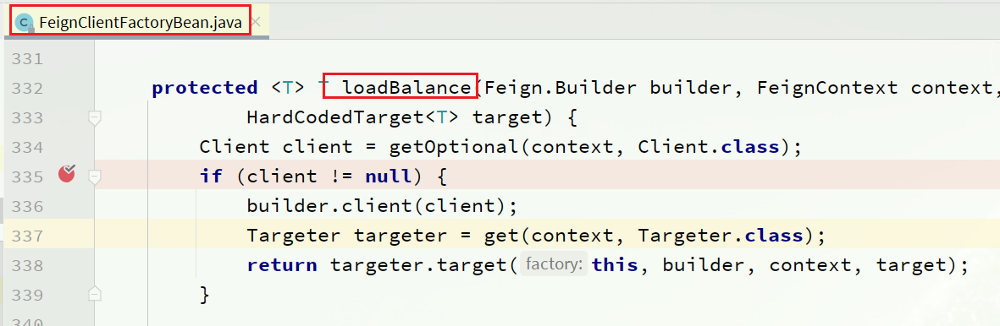

Debug 方式启动 order-service 服务，可以看到这里的 client，底层就是 Apache HttpClient：

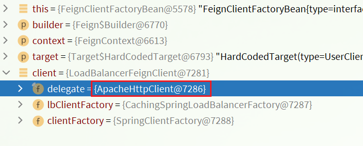

#### 3️⃣ 总结，Feign 的优化：

1. 日志级别尽量用 basic
2. 使用 HttpClient 或 OKHttp 代替 URLConnection
    - 引入 `feign-httpclient` 依赖
    - 配置文件开启 httpClient 功能，设置连接池参数

> 💡 **提示**：连接池参数应根据实际并发情况调整，避免过大或过小。

---

## 🚪 Gateway 服务网关

### 🎯 Gateway 的作用

Gateway 网关是我们服务的守门神，所有微服务的统一入口。

网关的**核心功能特性**：

- 请求路由
- 权限控制
- 限流

架构图：

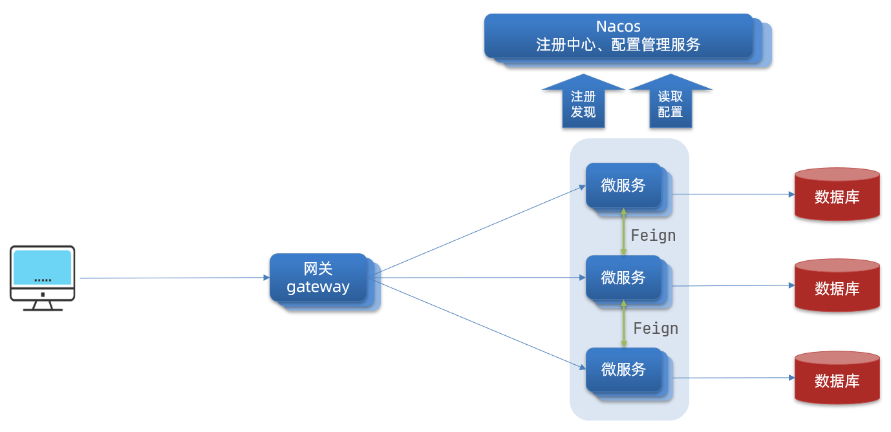

- **权限控制**：网关作为微服务入口，需要校验用户是否有请求资格，如果没有则进行拦截。
- **路由和负载均衡**：一切请求都必须先经过 gateway，但网关不处理业务，而是根据某种规则，把请求转发到某个微服务，这个过程叫做路由。当然路由的目标服务有多个时，还需要做负载均衡。
- **限流**：当请求流量过高时，在网关中按照下流的微服务能够接受的速度来放行请求，避免服务压力过大。

在 SpringCloud 中网关的实现包括两种：

- **Gateway**（推荐）
- **Zuul**

Zuul 是基于 Servlet 的实现，属于阻塞式编程。而 SpringCloud Gateway 则是基于 Spring5 中提供的 WebFlux，属于响应式编程的实现，具备更好的性能。

### 🛠️ Gateway 使用

#### 1️⃣ 创建 Gateway 模块，引入依赖

创建模块：

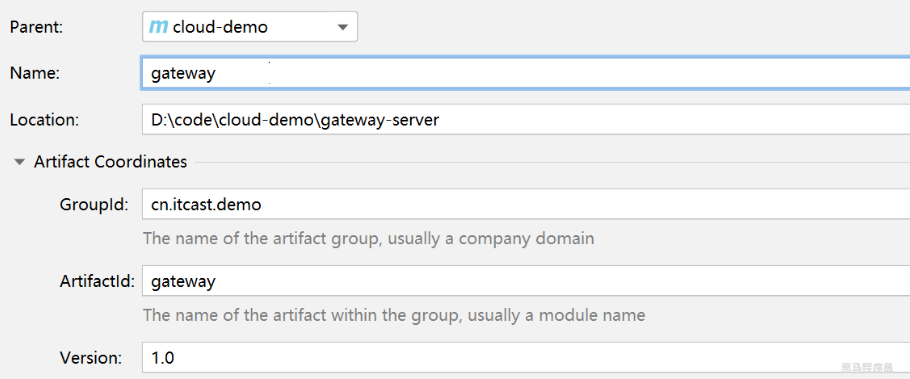

引入依赖：

```xml
<!--网关-->
<dependency>
    <groupId>org.springframework.cloud</groupId>
    <artifactId>spring-cloud-starter-gateway</artifactId>
</dependency>
<!--nacos服务发现依赖-->
<dependency>
    <groupId>com.alibaba.cloud</groupId>
    <artifactId>spring-cloud-starter-alibaba-nacos-discovery</artifactId>
</dependency>
```

#### 2️⃣ 编写启动类

```java
@SpringBootApplication
public class GatewayApplication {
	public static void main(String[] args) {
		SpringApplication.run(GatewayApplication.class, args);
	}
}
```

#### 3️⃣ 编写基础配置和路由规则

```yaml
server:
  port: 10010 # 网关端口
spring:
  application:
    name: gateway # 服务名称
  cloud:
    nacos:
      server-addr: localhost:8848 # nacos地址
    gateway:
      routes: # 网关路由配置
        - id: user-service # 路由id，自定义，只要唯一即可
          # uri: http://127.0.0.1:8081 # 路由的目标地址 http就是固定地址
          uri: lb://userservice # 路由的目标地址 lb就是负载均衡，后面跟服务名称
          predicates: # 路由断言，也就是判断请求是否符合路由规则的条件
            - Path=/user/** # 这个是按照路径匹配，只要以/user/开头就符合要求
```

我们将符合 `Path` 规则的一切请求，都代理到 `uri` 参数指定的地址。

本例中，我们将 `/user/**` 开头的请求，代理到 `lb://userservice`，lb 是负载均衡，根据服务名拉取服务列表，实现负载均衡。

#### 4️⃣ 测试

重启网关，访问 http://localhost:10010/user/1 时，符合 `/user/**` 规则，请求转发到 uri：http://userservice/user/1，得到了结果：

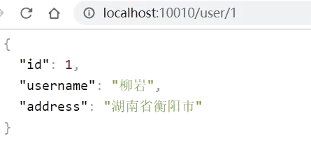

#### 5️⃣ 网关路由的流程图

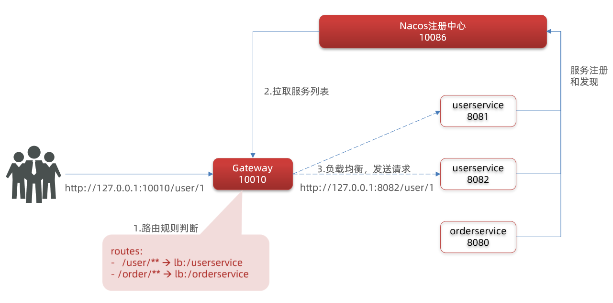

#### 6️⃣ 总结

网关搭建步骤：

1. 创建项目，引入 Nacos 服务发现和 Gateway 依赖
2. 配置 `application.yml`，包括服务基本信息、Nacos 地址、路由

路由配置包括：

1. 路由id：路由的唯一标示
2. 路由目标（uri）：路由的目标地址，http 代表固定地址，lb 代表根据服务名负载均衡
3. 路由断言（predicates）：判断路由的规则
4. 路由过滤器（filters）：对请求或响应做处理

### 🔍 断言工厂

我们在配置文件中写的断言规则只是字符串，这些字符串会被 Predicate Factory 读取并处理，转变为路由判断的条件。

例如 `Path=/user/**` 是按照路径匹配，这个规则是由 `org.springframework.cloud.gateway.handler.predicate.PathRoutePredicateFactory` 类来处理的，像这样的断言工厂在 SpringCloudGateway 还有十几个：

| **名称**   | **说明**                       | **示例**                                                     |
| ---------- | ------------------------------ | ------------------------------------------------------------ |
| After      | 是某个时间点后的请求           | -  After=2037-01-20T17:42:47.789-07:00[America/Denver]       |
| Before     | 是某个时间点之前的请求         | -  Before=2031-04-13T15:14:47.433+08:00[Asia/Shanghai]       |
| Between    | 是某两个时间点之前的请求       | -  Between=2037-01-20T17:42:47.789-07:00[America/Denver],  2037-01-21T17:42:47.789-07:00[America/Denver] |
| Cookie     | 请求必须包含某些cookie         | - Cookie=chocolate, ch.p                                     |
| Header     | 请求必须包含某些header         | - Header=X-Request-Id, \d+                                   |
| Host       | 请求必须是访问某个host（域名） | -  Host=**.somehost.org,**.anotherhost.org                   |
| Method     | 请求方式必须是指定方式         | - Method=GET,POST                                            |
| Path       | 请求路径必须符合指定规则       | - Path=/red/{segment},/blue/**                               |
| Query      | 请求参数必须包含指定参数       | - Query=name, Jack或者-  Query=name                          |
| RemoteAddr | 请求者的ip必须是指定范围       | - RemoteAddr=192.168.1.1/24                                  |
| Weight     | 权重处理                       |                                                              |

我们只需要掌握 Path 这种路由工程就可以了。

### 🧩 过滤器工厂

GatewayFilter 是网关中提供的一种过滤器，可以对进入网关的请求和微服务返回的响应做处理：

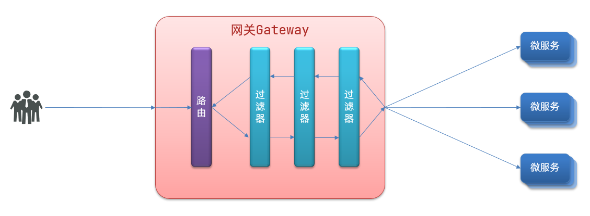

#### 路由过滤器的种类

Spring 提供了 31 种不同的路由过滤器工厂。例如：

| **名称**             | **说明**                     |
| -------------------- | ---------------------------- |
| AddRequestHeader     | 给当前请求添加一个请求头     |
| RemoveRequestHeader  | 移除请求中的一个请求头       |
| AddResponseHeader    | 给响应结果中添加一个响应头   |
| RemoveResponseHeader | 从响应结果中移除有一个响应头 |
| RequestRateLimiter   | 限制请求的流量               |

#### 请求头过滤器

下面我们以 `AddRequestHeader` 为例来讲解。

> **需求**：给所有进入 `userservice` 的请求添加一个请求头：`Truth=1115suc is best!`

只需要修改 Gateway 服务的 `application.yml` 文件，添加路由过滤即可：

```yaml
spring:
  cloud:
    gateway:
      routes:
      - id: user-service 
        uri: lb://userservice 
        predicates: 
        - Path=/user/** 
        filters: # 过滤器
        - AddRequestHeader=Truth, 1115suc is best! # 添加请求头
```

当前过滤器写在 `userservice` 路由下，因此仅仅对访问 `userservice` 的请求有效。

可以在 `userController` 方法中 **注入请求头信息**，进行测试：

```java
@GetMapping("/{id}")
public User queryById(@PathVariable("id") Long id,
                      @RequestHeader(value = "Truth",required = false) String name) {
    System.out.println("请求头中携带的name = " + name);
    return userService.queryById(id);
}
```

#### 默认过滤器

如果要对所有的路由都生效，则可以将过滤器工厂写到 default 下。格式如下：

```yaml
spring:
  cloud:
    gateway:
      routes:
      - id: user-service 
        uri: lb://userservice 
        predicates: 
        - Path=/user/**
      default-filters: # 默认过滤项
      - AddRequestHeader=Truth, Itcast is freaking awesome! 
```

#### 总结

过滤器的作用是什么？

① 对路由的请求或响应做加工处理，比如添加请求头  
② 配置在路由下的过滤器只对当前路由的请求生效

defaultFilters 的作用是什么？

① 对所有路由都生效的过滤器

### 🌍 全局过滤器

关于网关提供了 31 种，但每一种过滤器的作用都是固定的。如果我们希望拦截请求，做自己的业务逻辑则没办法实现。

#### 全局过滤器作用

全局过滤器的作用也是处理一切进入网关的请求和微服务响应，与 GatewayFilter 的作用一样。区别在于 GatewayFilter 通过配置定义，处理逻辑是固定的；而 GlobalFilter 的逻辑需要自己写代码实现。

定义方式是实现 GlobalFilter 接口。

```java
public interface GlobalFilter {
    /**
     *  处理当前请求，有必要的话通过{@link GatewayFilterChain}将请求交给下一个过滤器处理
     *
     * @param exchange 请求上下文，里面可以获取Request、Response等信息
     * @param chain 用来把请求委托给下一个过滤器 
     * @return {@code Mono<Void>} 返回标示当前过滤器业务结束
     */
    Mono<Void> filter(ServerWebExchange exchange, GatewayFilterChain chain);
}
```

在 filter 中编写自定义逻辑，可以实现下列功能：

- 登录状态判断
- 权限校验
- 请求限流等

#### 自定义全局过滤器

需求：定义全局过滤器，拦截请求，判断请求的参数是否满足下面条件：

- 参数中是否有 authorization
- authorization 参数值是否为 admin

```java
@Order(-1) // 全局过滤器，需要设置一个优先级，-1表示优先执行
@Component
public class AuthorizeFilter implements GlobalFilter {
    @Override
    public Mono<Void> filter(ServerWebExchange exchange, GatewayFilterChain chain) {
        // 1.获取请求参数
        MultiValueMap<String, String> params = exchange.getRequest().getQueryParams();
        // 2.获取authorization参数
        String auth = params.getFirst("authorization");
        // 3.校验
        if ("admin".equals(auth)) {
            // 放行
            return chain.filter(exchange);
        }
        // 4.拦截
        // 4.1.禁止访问，设置状态码
        exchange.getResponse().setStatusCode(HttpStatus.UNAUTHORIZED);
        // 4.2.结束处理
        return exchange.getResponse().setComplete();
    }
}
```

#### 过滤器执行顺序

请求进入网关会碰到三类过滤器：当前路由的过滤器、`DefaultFilter`、`GlobalFilter`

请求路由后，会将当前路由过滤器和 `DefaultFilter`、`GlobalFilter`，合并到一个过滤器链（集合）中，排序后依次执行每个过滤器：

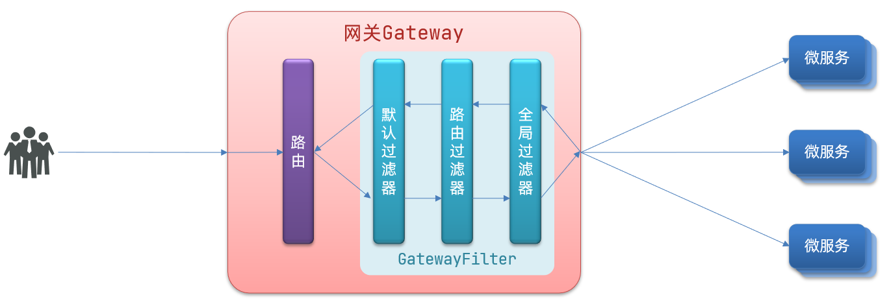

排序的规则是什么呢？

- 每一个过滤器都必须指定一个 int 类型的 `order` 值，**`order` 值越小，优先级越高，执行顺序越靠前**。
- `GlobalFilter` 通过实现 `Ordered` 接口，或者添加 `@Order` 注解来指定 `order` 值，由我们自己指定。
- 路由过滤器和 `defaultFilter` 的 `order` 由 Spring 指定，默认是按照声明顺序从 1 递增。
- 当过滤器的 order 值一样时，会按照 `defaultFilter` > 路由过滤器 > `GlobalFilter` 的顺序执行。

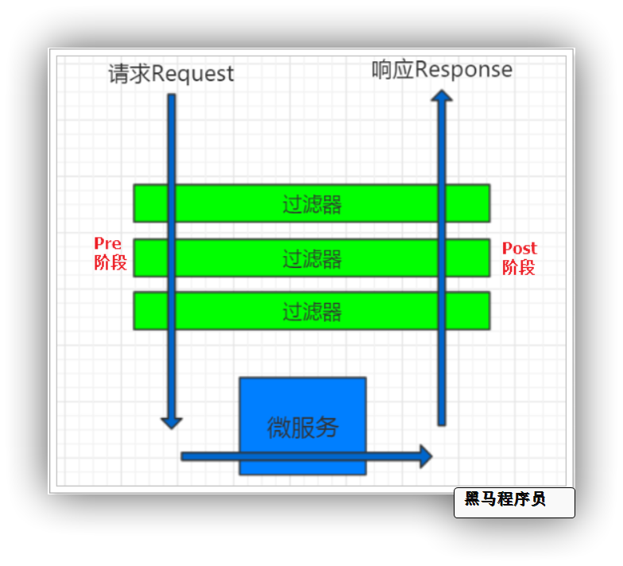

详细内容，可以查看源码：

- `org.springframework.cloud.gateway.route.RouteDefinitionRouteLocator#getFilters()` 方法是先加载 defaultFilters，然后再加载某个 route 的 filters，然后合并。
- `org.springframework.cloud.gateway.handler.FilteringWebHandler#handle()` 方法会加载全局过滤器，与前面的过滤器合并后根据 order 排序，组织过滤器链。

```java
@Slf4j
@Configuration
public class FilterConfiguration {
    @Bean
    @Order(-2)
    public GlobalFilter globalFilter1(){
        return ((exchange, chain) -> {
            log.info("过滤器1的pre阶段！");
              return chain.filter(exchange).then(Mono.fromRunnable(() -> {
                log.info("过滤器1的post阶段！");
            }));
        });
    }

    @Bean
    @Order(-1)
    public GlobalFilter globalFilter2(){
        return ((exchange, chain) -> {
            log.info("过滤器2的pre阶段！");
            return chain.filter(exchange).then(Mono.fromRunnable(() -> {
                log.info("过滤器2的post阶段！");
            }));
        });
    }

    @Bean
    @Order(0)
    public GlobalFilter globalFilter3(){
        return ((exchange, chain) -> {
            log.info("过滤器3的pre阶段！");
            return chain.filter(exchange).then(Mono.fromRunnable(() -> {
                log.info("过滤器3的post阶段！");
            }));
        });
    }
}
```

### 🌐 跨域问题

#### 什么是跨域问题

跨域：域名不一致就是跨域，主要包括：

- 域名不同： www.taobao.com 和 www.taobao.org 和 www.jd.com 和 miaosha.jd.com
- 域名相同，端口不同：localhost:8080 和 localhost:8081

跨域问题：浏览器禁止请求的发起者与服务端发生跨域 ajax 请求，请求被浏览器拦截的问题。

#### 跨域问题的解决

```yaml
spring:
  cloud:
    gateway:
      globalcors: # 全局的跨域处理
        add-to-simple-url-handler-mapping: true # 解决options请求被拦截问题
        corsConfigurations:
          '[/**]':
            allowedOrigins: # 允许哪些网站的跨域请求 
              - "http://localhost:8090"
              - "http://localhost"  # 80端口要省略不写
              - "http://127.0.0.1"
              - "http://www.1115suc.com"
            allowedMethods: # 允许的跨域ajax的请求方式
              - "GET"
              - "POST"
              - "DELETE"
              - "PUT"
              - "OPTIONS"
            allowedHeaders: "*" # 允许在请求中携带的头信息
            allowCredentials: true # 是否允许携带cookie
            maxAge: 360000 # 这次跨域检测的有效期-避免频繁发起跨域检测,服务端返回Access-Control-Max-Age来声明的有效期
```

> 🔔 **注意**：若通过 localhost 访问 nginx，则需要配置 localhost 允许跨域，对于 127.0.0.1 则不会生效，需要单独配置。

### 🚦 网关限流

网关除了请求路由、身份验证，还有一个非常重要的作用：请求限流。当系统面对高并发请求时，为了减少对业务处理服务的压力，需要在网关中对请求限流，按照一定的速率放行请求。

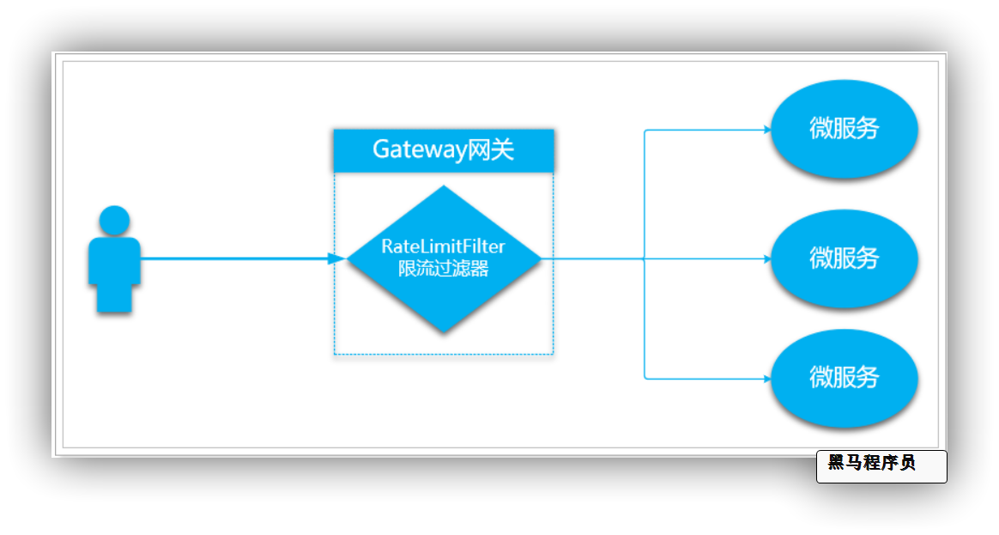

常见的限流算法包括：

- 计数器算法
- 漏桶算法
- 令牌桶算法

#### 令牌桶算法原理

SpringGateway 中采用的是令牌桶算法，令牌桶算法原理：

- 准备一个令牌桶，有固定容量，一般为服务并发上限。
- 按照固定速率，生成令牌并存入令牌桶，如果桶中令牌数达到上限，就丢弃令牌。
- 每次请求调用需要先获取令牌，只有拿到令牌，才继续执行，否则选择选择等待或者直接拒绝。

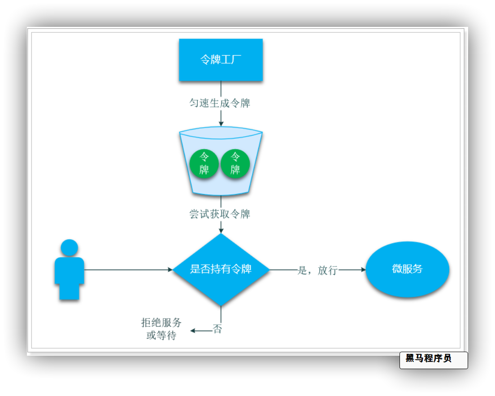

#### Gateway 中限流实现

SpringCloudGateway 是采用令牌桶算法，其令牌相关信息记录在 redis 中，因此我们需要安装 redis，并引入 Redis 相关依赖。

**1) 引入 redis 有关依赖：**

```xml
<!--redis-->
<dependency>
    <groupId>org.springframework.boot</groupId>
    <artifactId>spring-boot-starter-data-redis-reactive</artifactId>
</dependency>
```

> 💡 **注意**：这里不是普通的 redis 依赖，而是响应式的 Redis 依赖，因为 SpringGateway 是基于 WebFlux 的响应式。

**2) 配置过滤条件 key：**

Gateway 会在 Redis 中记录令牌相关信息，我们可以自己定义令牌桶的规则，例如：

- 给不同的请求 URI 路径设置不同令牌桶
- 给不同的登录用户设置不同令牌桶
- 给不同的请求 IP 地址设置不同令牌桶

Redis 中的一个 Key 和 Value 对就是一个令牌桶。因此 Key 的生成规则就是桶的定义规则。SpringCloudGateway 中 key 的生成规则定义在 `KeyResolver` 接口中：

```java
public interface KeyResolver {
	Mono<String> resolve(ServerWebExchange exchange);
}
```

这个接口中的方法返回值就是给令牌桶生成的 key。API 说明：

- **Mono**：是一个单元素容器，用来存放令牌桶的 key
- **ServerWebExchange**：上下文对象，可以理解为 ServletContext，可以从中获取 request、response、cookie 等信息

比如上面的三种令牌桶规则，生成 key 的方式如下：

- 给不同的请求 URI 路径设置不同令牌桶，示例代码：

  ```java
  return Mono.just(exchange.getRequest().getURI().getPath());// 获取请求URI
  ```

- 给不同的登录用户设置不同令牌桶

  ```java
  return exchange.getPrincipal().map(Principal::getName);// 获取用户
  ```

- 给不同的请求 IP 地址设置不同令牌桶

  ```java
  return Mono.just(exchange.getRequest().getRemoteAddress().getHostName());// 获取请求者IP
  ```

使用 IP 地址的令牌桶 key 示例：

```java
@Component
public class PathKeyResolver implements KeyResolver {
    @Override
    public Mono<String> resolve(ServerWebExchange exchange) {
        return Mono.just(exchange.getRequest().getURI().getPath());// 获取请求URI
    }
}
```

**3) 配置桶参数：**

另外，令牌桶的参数需要通过 yaml 文件来配置，**参数有 2 个**：

- `replenishRate`：每秒钟生成令牌的速率，基本上就是每秒钟允许的最大请求数量
- `burstCapacity`：令牌桶的容量，就是令牌桶中存放的最大的令牌的数量

完整配置如下：

```yaml
server:
  port: 10010 # 网关端口
spring:
  application:
    name: gateway # 服务名称
  redis:
    host: localhost
  cloud:
    nacos:
      server-addr: localhost:8848 # nacos地址
    gateway:
      routes: # 网关路由配置
        - id: user-service # 路由id，自定义，只要唯一即可
          uri: lb://userservice # 路由的目标地址 lb就是负载均衡，后面跟服务名称
          predicates: # 路由断言，也就是判断请求是否符合路由规则的条件
            - Path=/user/**
        - id: order-service # 路由id，自定义，只要唯一即可
          uri: lb://orderservice # 路由的目标地址 lb就是负载均衡，后面跟服务名称
          predicates: # 路由断言，也就是判断请求是否符合路由规则的条件
            - Path=/order/**
      default-filters:
        - AddRequestHeader=name,xiaoming
        - name: RequestRateLimiter #请求数限流 名字不能随便写
          args:
            key-resolver: "#{@ipKeyResolver}" # 指定一个key生成器
            redis-rate-limiter.replenishRate: 2 # 生成令牌的速率
            redis-rate-limiter.burstCapacity: 4 # 桶的容量
      globalcors: # 全局的跨域处理
        ........
```

这里配置了一个过滤器：`RequestRateLimiter`，并设置了三个参数：

- `key-resolver`：`"#{@ipKeyResolver}"` 是 SpEL 表达式，写法是 `#{@bean的名称}`，ipKeyResolver 就是我们定义的 Bean 名称。
- `redis-rate-limiter.replenishRate`：每秒钟生成令牌的速率。
- `redis-rate-limiter.burstCapacity`：令牌桶的容量。

这样的限流配置可以达成的效果：

- 每一个 IP 地址，每秒钟最多发起 2 次请求。
- 每秒钟超过 2 次请求，则返回 429 的异常状态码。

**4）测试：**

我们快速在浏览器多次访问 http://localhost:10010/user/1，就会得到一个错误：

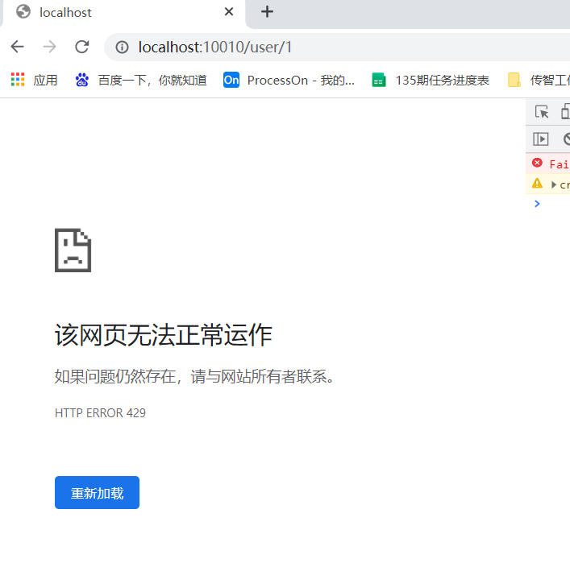

**429**：代表请求次数过多，触发限流了。

---

> 📌 **总结**：SpringCloud Gateway 作为微服务入口，集路由、过滤、限流、跨域处理于一体，是构建高可用微服务架构的关键组件。合理配置可大幅提升系统稳定性和安全性。