# 🚀 Ribbon负载均衡

> 💡 我们在order-service中，通过RestTemplate调用user-service时，添加了@LoadBalanced注解，开启了负载均衡功能，原理是什么呢？

## 🔍 负载均衡原理
SpringCloud底层其实是利用了一个名为Ribbon的组件，来实现负载均衡功能的。

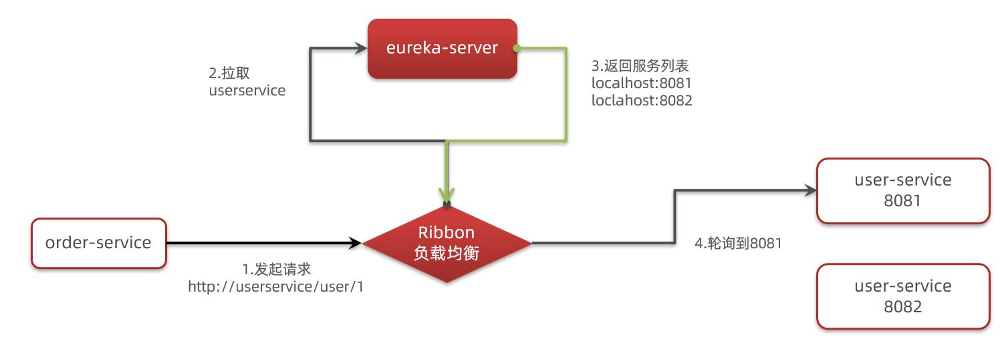

## 🔬 源码跟踪

❓ 为什么我们只输入了service名称就可以访问了呢？之前还要获取ip和端口。

显然有人帮我们根据service名称，获取到了服务实例的ip和端口。它就是`LoadBalancerInterceptor`，这个类会在对RestTemplate的请求进行拦截，然后从Eureka根据服务id获取服务列表，随后利用负载均衡算法得到真实的服务地址信息，替换服务id。

我们进行源码跟踪：

### 1️⃣ LoadBalancerInterceptor

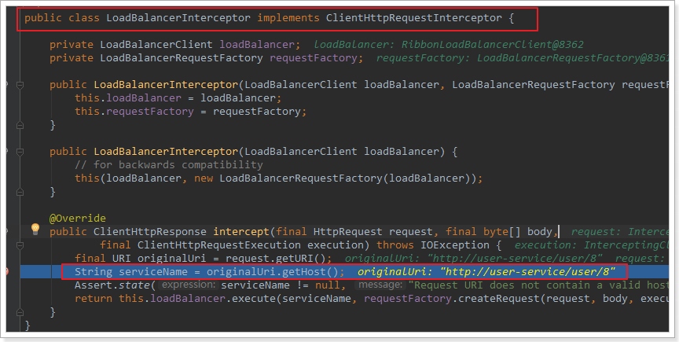

可以看到这里的intercept方法，拦截了用户的HttpRequest请求，然后做了几件事：

- `request.getURI()`：获取请求uri，本例中就是 http://user-service/user/8
- `originalUri.getHost()`：获取uri路径的主机名，其实就是服务id，`user-service`
- `this.loadBalancer.execute()`：处理服务id，和用户请求

这里的`this.loadBalancer`是`LoadBalancerClient`类型，我们继续跟入。

### 2️⃣ LoadBalancerClient

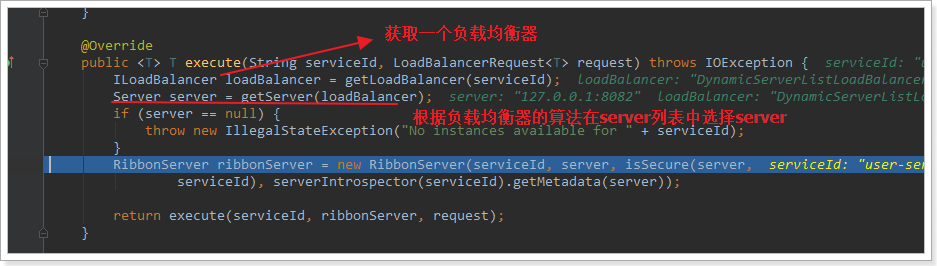

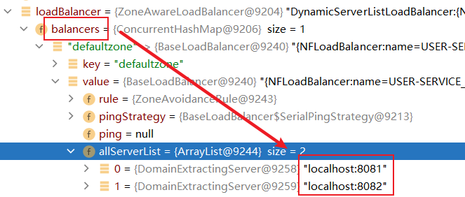

代码是这样的：

- `getLoadBalancer(serviceId)`：根据服务id获取`ILoadBalancer`，而`ILoadBalancer`会拿着服务id去eureka中获取服务列表并保存起来
- `getServer(loadBalancer)`：利用内置的负载均衡算法，从服务列表中选择一个。本例中，可以看到获取了8082端口的服务

### 3️⃣ 负载均衡策略IRule

在刚才的代码中，可以看到获取服务使通过一个`getServer`方法来做负载均衡:

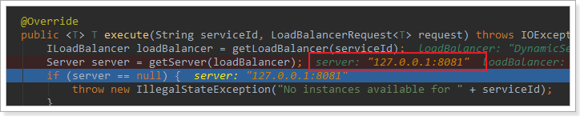

我们继续跟入：

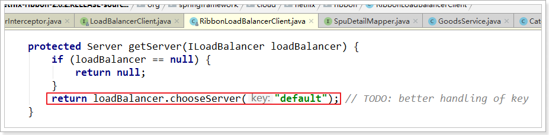

继续跟踪源码chooseServer方法，发现这么一段代码：

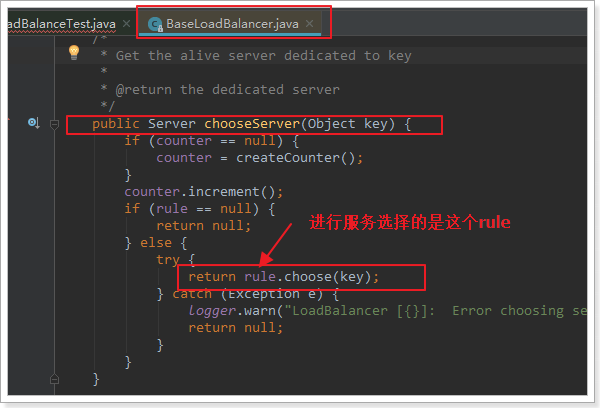

我们看看这个rule是谁：

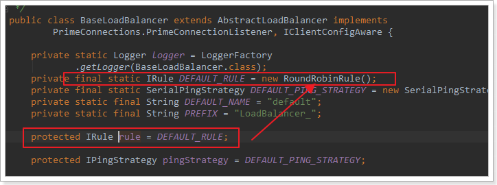

这里的rule默认值是一个`RoundRobinRule`，看类的介绍可知，这是一个轮询负载均衡算法。

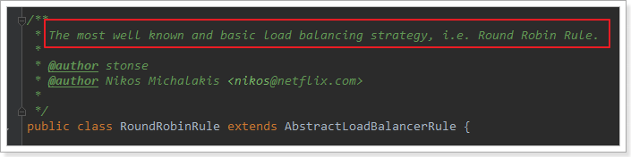

### 4️⃣ 总结

SpringCloudRibbon的底层采用了一个拦截器，拦截了RestTemplate发出的请求，对地址做了修改。用一幅图来总结一下：

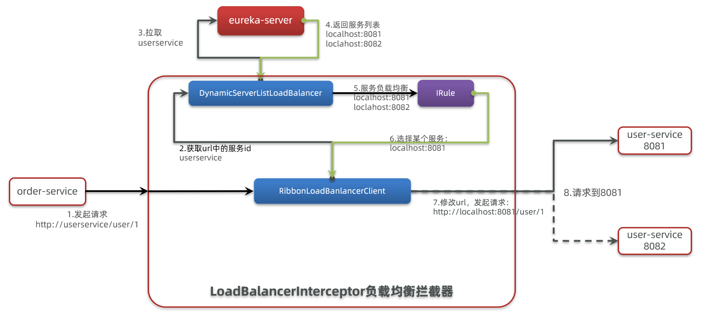

基本流程如下：

- 拦截我们的 `RestTemplate` 请求 http://userservice/user/1
- `RibbonLoadBalancerClient` 会从请求url中获取服务名称，也就是 user-service
- `DynamicServerListLoadBalancer` 根据 user-service 到 eureka 拉取服务列表
- eureka 返回列表，localhost:8081、localhost:8082
- `IRule` 利用内置负载均衡规则，从列表中选择一个，例如 localhost:8081
- `RibbonLoadBalancerClient` 修改请求地址，用 localhost:8081 替代 userservice，得到 http://localhost:8081/user/1 ,发起真实请求

## ⚖️ 负载均衡策略

### 📋 负载均衡策略概览

负载均衡的规则都定义在IRule接口中，而IRule有很多不同的实现类：

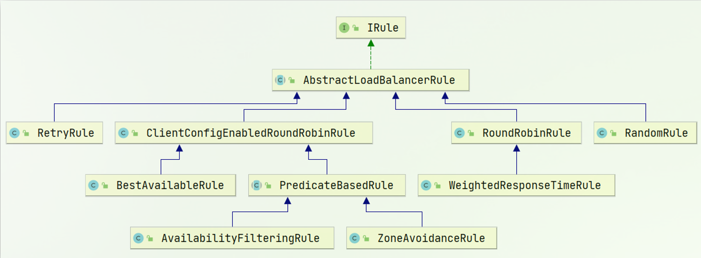

不同规则的含义如下：

| **内置负载均衡规则类**             | **规则描述**                                                                                                                                                                                                                                                           |
| ------------------------- | ------------------------------------------------------------------------------------------------------------------------------------------------------------------------------------------------------------------------------------------------------------------ |
| RoundRobinRule            | 简单轮询服务列表来选择服务器。                                                                                                                                                                                                                                                    |
| AvailabilityFilteringRule | 对以下两种服务器进行忽略：   <br/>（1）在默认情况下，这台服务器如果3次连接失败，这台服务器就会被设置为"短路"状态。短路状态将持续30秒，如果再次连接失败，短路的持续时间就会几何级地增加。 <br/> （2）并发数过高的服务器。如果一个服务器的并发连接数过高，配置了AvailabilityFilteringRule规则的客户端也会将其忽略。并发连接数的上限，可以由客户端的<clientName>.<clientConfigNameSpace>.ActiveConnectionsLimit属性进行配置。 |
| WeightedResponseTimeRule  | 为每一个服务器赋予一个权重值。服务器响应时间越长，这个服务器的权重就越小。这个规则会随机选择服务器，这个权重值会影响服务器的选择。                                                                                                                                                                                                  |
| **ZoneAvoidanceRule**     | 以区域可用的服务器为基础进行服务器的选择。使用Zone对服务器进行分类，这个Zone可以理解为一个机房、一个机架等。而后再对Zone内的多个服务做轮询。                                                                                                                                                                                       |
| BestAvailableRule         | 忽略那些短路的服务器，并选择并发数较低的服务器。                                                                                                                                                                                                                                           |
| RandomRule                | 随机选择一个可用的服务器。                                                                                                                                                                                                                                                      |
| RetryRule                 | 重试机制的选择逻辑                                                                                                                                                                                                                                                          |

> 💡 默认的实现就是ZoneAvoidanceRule，是一种轮询方案

### 🛠️ 自定义负载均衡策略

通过定义 `IRule` 实现可以修改负载均衡规则，有两种方式：

#### 1️⃣ 代码方式实现负载均衡策略

```java
@Bean
public IRule randomRule(){
    return new RandomRule();
}
```

#### 2️⃣ 配置文件方式实现负载均衡策略

```yaml
userservice: # 给某个微服务配置负载均衡规则，这里是userservice服务
  ribbon:
    NFLoadBalancerRuleClassName: com.netflix.loadbalancer.RandomRule # 负载均衡规则 
```

## ⚡ 饥饿加载

Ribbon默认是采用懒加载，即第一次访问时才会去创建LoadBalanceClient，请求时间会很长。

而饥饿加载则会在项目启动时创建，降低第一次访问的耗时，通过下面配置开启饥饿加载：

```yaml
ribbon:
  eager-load:
    enabled: true
    clients: userservice # 指定被调用微服务饥渴加载
```

## ✅ 总结要点

- Ribbon通过拦截器机制实现负载均衡
- 支持多种负载均衡策略，可根据业务需求选择
- 可通过代码或配置文件自定义负载均衡规则
- 饥饿加载可优化首次请求性能

> 🎉 Ribbon作为SpringCloud的核心组件，为微服务架构提供了强大的负载均衡能力！