# Sentinel微服务保护 🛡️

## ❄️ 雪崩问题及解决方案

### 什么是雪崩问题？

微服务中，服务间调用关系错综复杂，一个微服务往往依赖于多个其它微服务。

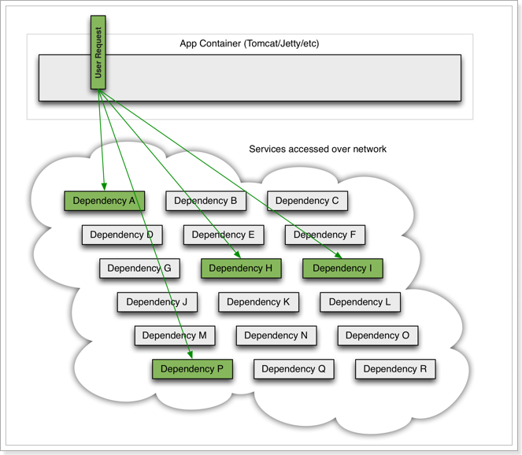

如图，如果服务提供者I发生了故障，当前应用的部分业务因为依赖于服务I，因此也会被阻塞。此时，其它不依赖于服务I的业务似乎不受影响。

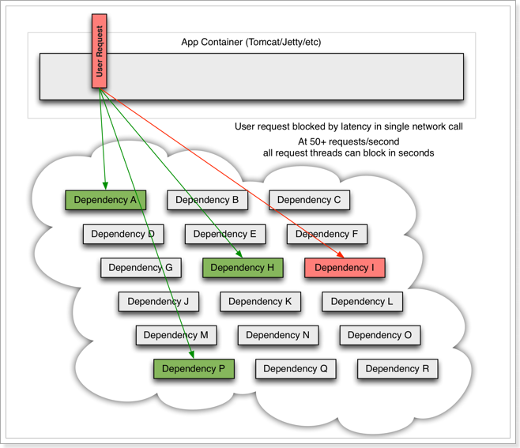

但是，依赖服务I的业务请求被阻塞，用户不会得到响应，则tomcat的这个线程不会释放，于是越来越多的用户请求到来，越来越多的线程会阻塞：

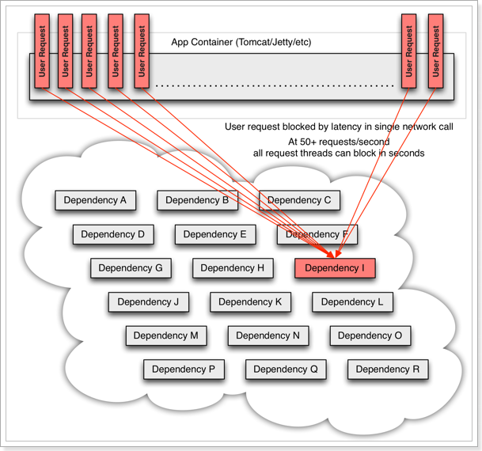

服务器支持的线程和并发数有限，请求一直阻塞，会导致服务器资源耗尽，从而使所有其它服务都不可用，那么当前服务也就不可用了。

那么，依赖于当前服务的其它服务随着时间的推移，最终也都会变的不可用，形成级联失败，雪崩就发生了：

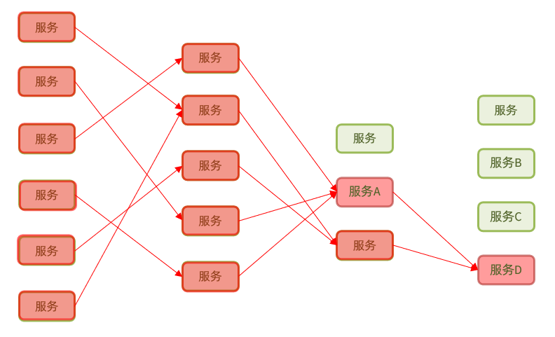

### 🛠️ 雪崩问题解决方案

#### ⏱️ 超时处理
设定超时时间，请求超过一定时间没有响应就返回错误信息，不会无休止等待。

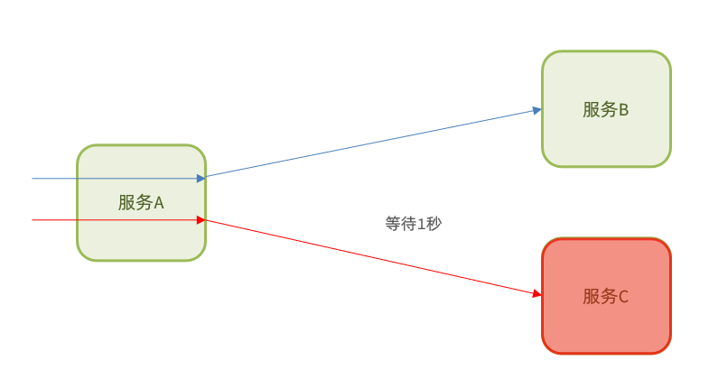

#### 🚧 仓壁模式（线程隔离）
仓壁模式来源于船舱的设计：

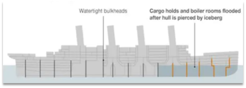

船舱都会被隔板分离为多个独立空间，当船体破损时，只会导致部分空间进水，将故障控制在一定范围内，避免整个船体都被淹没。

于此类似，我们可以限定每个业务能使用的线程数，避免耗尽整个tomcat的资源，因此也叫线程隔离。

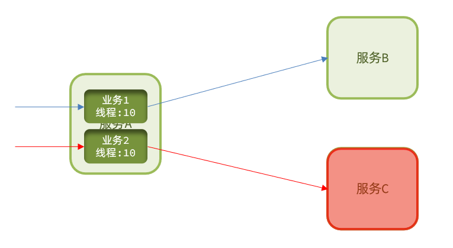

#### 🔌 断路器
断路器模式：由**断路器**统计业务执行的异常比例，如果超出阈值则会**熔断**该业务，拦截访问该业务的一切请求。

断路器会统计访问某个服务的请求数量，异常比例：

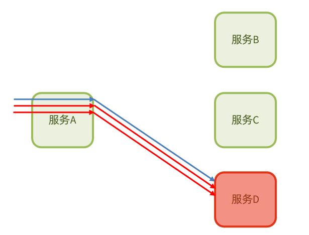

当发现访问服务D的请求异常比例过高时，认为服务D有导致雪崩的风险，会拦截访问服务D的一切请求，形成熔断：

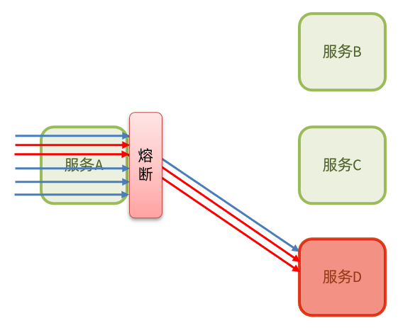

#### 🚦 限流
**流量控制**：限制业务访问的QPS，避免服务因流量的突增而故障。

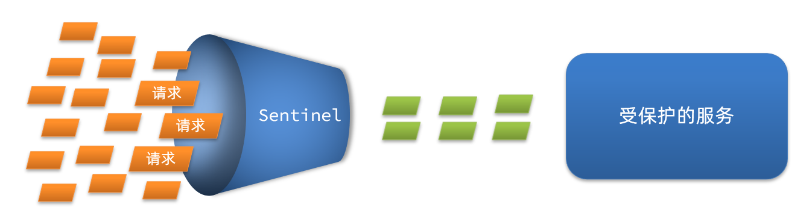

### 📝 总结

**什么是雪崩问题？**
- 微服务之间相互调用，因为调用链中的一个服务故障，引起整个链路都无法访问的情况。

**解决方案对比：**
- **限流**是对服务的保护，避免因瞬间高并发流量而导致服务故障，进而避免雪崩。是一种**预防**措施。
- **超时处理、线程隔离、降级熔断**是在部分服务故障时，将故障控制在一定范围，避免雪崩。是一种**补救**措施。

---

## 🔍 微服务保护技术对比

在SpringCloud当中支持多种服务保护技术：

- [Netflix Hystrix](https://github.com/Netflix/Hystrix)
- [Sentinel](https://github.com/alibaba/Sentinel)
- [Resilience4J](https://github.com/resilience4j/resilience4j)

早期比较流行的是Hystrix框架，但目前国内使用最广泛的还是阿里巴巴的Sentinel框架：

| 特性 | **Sentinel** | **Hystrix** |
|------|--------------|-------------|
| 隔离策略 | 信号量隔离 | 线程池隔离/信号量隔离 |
| 熔断降级策略 | 基于慢调用比例或异常比例 | 基于失败比率 |
| 实时指标实现 | 滑动窗口 | 滑动窗口（基于 RxJava） |
| 规则配置 | 支持多种数据源 | 支持多种数据源 |
| 扩展性 | 多个扩展点 | 插件的形式 |
| 基于注解的支持 | 支持 | 支持 |
| 限流 | 基于 QPS，支持基于调用关系的限流 | 有限的支持 |
| 流量整形 | 支持慢启动、匀速排队模式 | 不支持 |
| 系统自适应保护 | 支持 | 不支持 |
| 控制台 | 开箱即用，可配置规则、查看秒级监控、机器发现等 | 不完善 |
| 常见框架的适配 | Servlet、Spring Cloud、Dubbo、gRPC 等 | Servlet、Spring Cloud Netflix |

---

## 🚀 微服务整合Sentinel

### 1. 引入Sentinel依赖
```xml
<!--sentinel-->
<dependency>
    <groupId>com.alibaba.cloud</groupId> 
    <artifactId>spring-cloud-starter-alibaba-sentinel</artifactId>
</dependency>
```

### 2. 配置控制台
```yaml
server:
  port: 8088 
spring:
  cloud: 
    sentinel:
      transport:
        dashboard: localhost:8080 # Sentinel控制台地址
```

### 3. 访问Sentinel控制台
- 启动微服务
- 访问 http://localhost:8088/order/101 即可看到Sentinel控制台

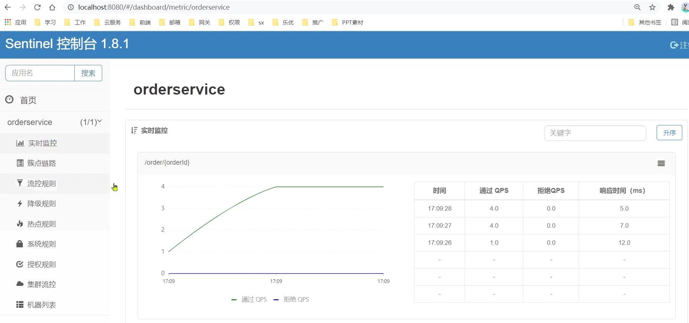

---

## 🚦 流量控制

> 💡 **注意**：雪崩问题虽然有四种方案，但是限流是避免服务因突发的流量而发生故障，是对微服务雪崩问题的预防。

### 📊 簇点链路
- 当请求进入微服务时，首先会访问`DispatcherServlet`，然后进入`Controller`、`Service`、`Mapper`，这样的一个调用链就叫做**簇点链路**。簇点链路中被监控的每一个接口就是一个**资源**。
- 默认情况下`sentinel`会监控SpringMVC的每一个端点（Endpoint，也就是`controller`中的方法），因此SpringMVC的每一个端点（Endpoint）就是调用链路中的一个资源。

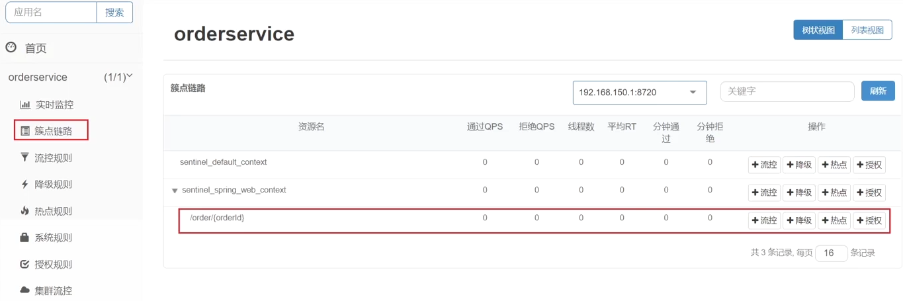

流控、熔断等都是针对簇点链路中的资源来设置的，因此我们可以点击对应资源后面的按钮来设置规则：
- **流控**：流量控制
- **降级**：降级熔断
- **热点**：热点参数限流，是限流的一种
- **授权**：请求的权限控制

### ⚡ 快速入门

#### 示例
- 点击资源 /order/{orderId} 后面的流控按钮，就可以弹出表单。


- 表单中可以填写限流规则，如下：

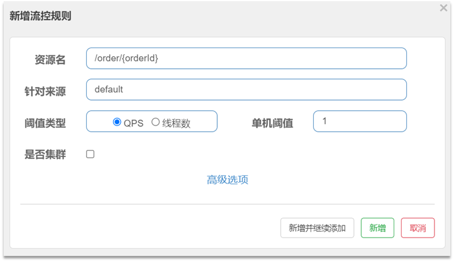

其含义是限制 /order/{orderId} 这个资源的单机QPS为1，即每秒只允许1次请求，超出的请求会被拦截并报错。

### 🔀 流控模式

在添加限流规则时，点击高级选项，可以选择三种**流控模式**：
- **直接**：统计当前资源的请求，触发阈值时对当前资源直接限流，也是默认的模式
- **关联**：统计与当前资源相关的另一个资源，触发阈值时，对当前资源限流
- **链路**：统计从指定链路访问到本资源的请求，触发阈值时，对指定链路限流

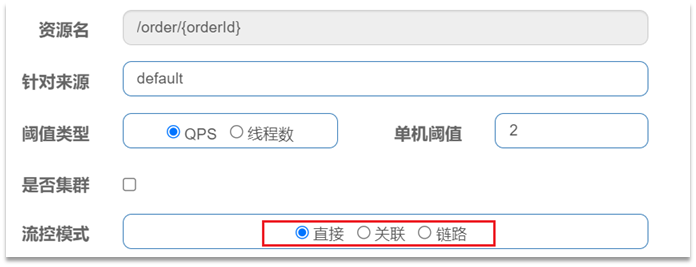

#### 🔗 关联模式
- 关联模式：统计与当前资源相关的另一个资源，触发阈值时，对当前资源限流
- 配置规则：
  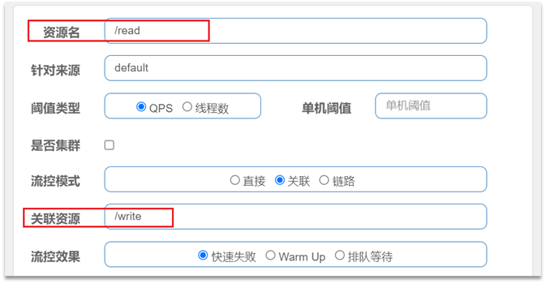

- 语法说明：当/write资源访问量触发阈值时，就会对/read资源限流，避免影响/write资源。
  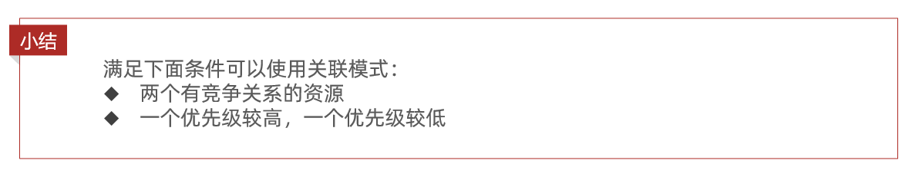

#### 🧵 链路模式
- 链路模式：只针对从指定链路访问到本资源的请求做统计，判断是否超过阈值。
- 配置规则：
  - /test1 --> /common
  - /test2 --> /common

- 如果只希望统计从/test2进入到/common的请求，则可以这样配置：
  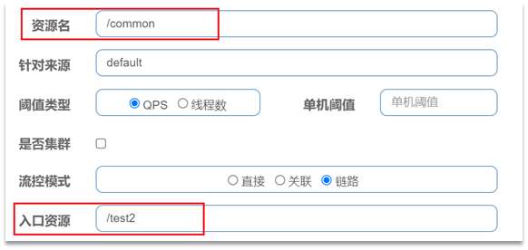

##### 🛠️ 实例
**1. 添加查询商品方法**
```java
public void queryGoods(){
    System.err.println("查询商品");
}
```

**2. 查询订单时，查询商品**
```java
@GetMapping("/query")
public String queryOrder() {
    // 查询商品
    orderService.queryGoods();
    // 查询订单
    System.out.println("查询订单");
    return "查询订单成功";
}
```

**3. 新增订单，查询商品**
```java
@GetMapping("/save")
public String saveOrder() {
    // 查询商品
    orderService.queryGoods();
    // 查询订单
    System.err.println("新增订单");
    return "新增订单成功";
}
```

**4. 给查询商品添加资源标记**
```java
@SentinelResource("goods")
public void queryGoods(){
    System.err.println("查询商品");
}
```

**5. 链路模式配置**
```yaml
spring:
  cloud:
    sentinel:
      web-context-unify: false # 关闭context整合
```

**6. 重启服务，查看簇点链路**
访问/order/query和/order/save，可以查看到sentinel的簇点链路规则中，出现了新的资源：
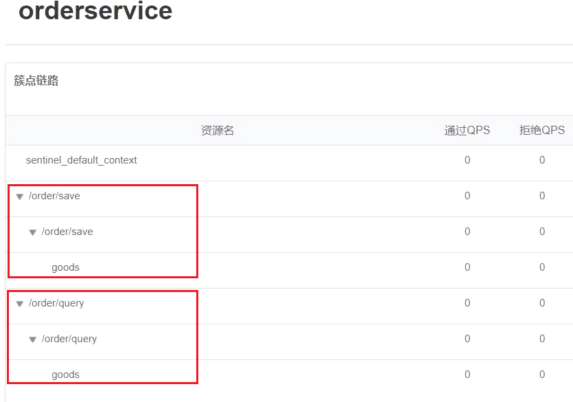

**7. 添加流控规则**
点击goods资源后面的流控按钮，在弹出的表单中填写下面信息：
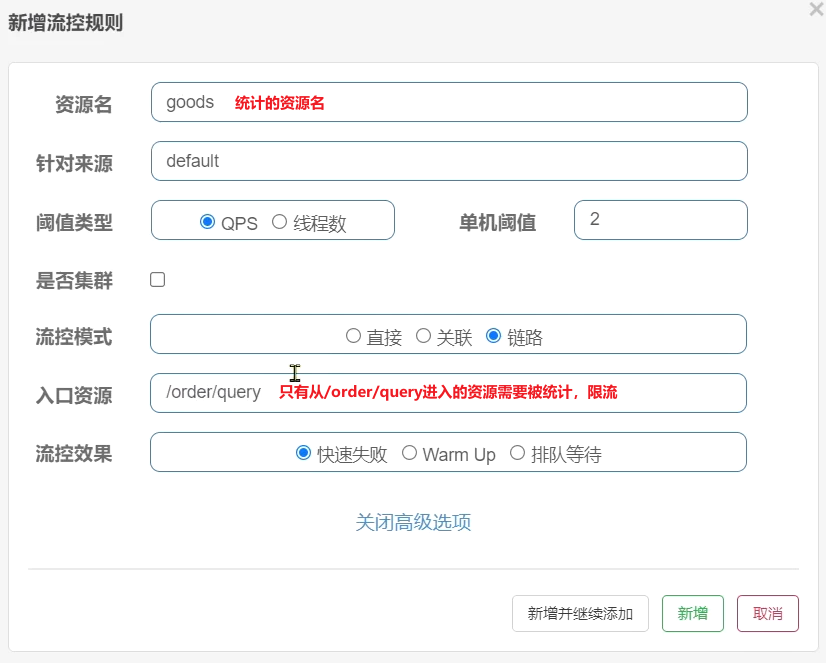
- 只统计从/order/query进入/goods的资源
- QPS阈值为2，超出则被限流

### 🎛️ 流控效果

在流控的高级选项中，还有一个流控效果选项：

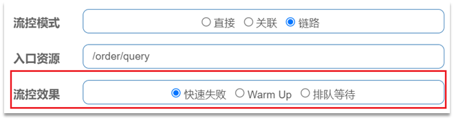

流控效果是指请求达到流控阈值时应该采取的措施，包括三种：
- **快速失败**：达到阈值后，新的请求会被立即拒绝并抛出`FlowException`异常。是默认的处理方式
- **warm up**：预热模式，对超出阈值的请求同样是拒绝并抛出异常。但这种模式阈值会动态变化，从一个较小值逐渐增加到最大阈值
- **排队等待**：让所有的请求按照先后次序排队执行，两个请求的间隔不能小于指定时长

#### 🔥 warm up（预热模式）
- 阈值一般是一个微服务能承担的最大QPS，但是一个服务刚刚启动时，一切资源尚未初始化（**冷启动**），如果直接将QPS跑到最大值，可能导致服务瞬间宕机
- warm up也叫**预热模式**，是应对服务冷启动的一种方案。请求阈值初始值是 maxThreshold / coldFactor，持续指定时长后，逐渐提高到maxThreshold值。而coldFactor的默认值是3
- 例如：设置QPS的maxThreshold为10，预热时间为5秒，那么初始阈值就是 10 / 3 ，也就是3，然后在5秒后逐渐增长到10
  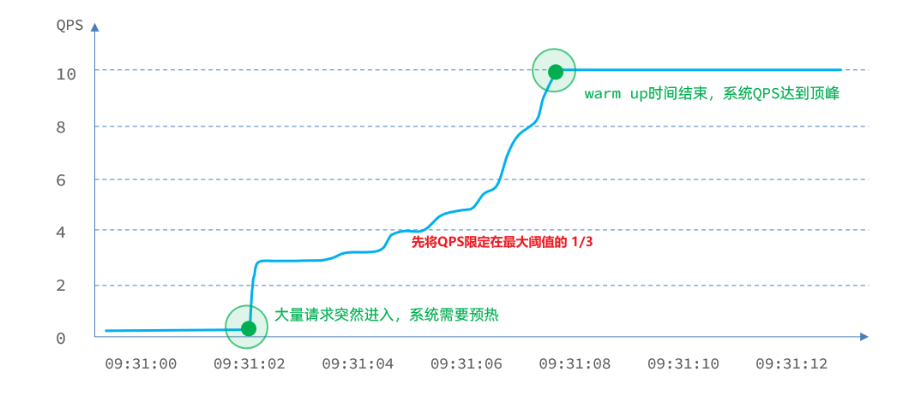

#### 🚶 排队等待
- 当请求超过QPS阈值时，快速失败和warm up 会拒绝新的请求并抛出异常。
- 而排队等待则是让所有请求进入一个队列中，然后按照阈值允许的时间间隔依次执行。后来的请求必须等待前面执行完成，如果请求预期的等待时间超出最大时长，则会被拒绝。

**工作原理示例：**
- QPS = 5，意味着每200ms处理一个队列中的请求
- timeout = 2000，意味着**预期等待时长**超过2000ms的请求会被拒绝并抛出异常

现在，第1秒同时接收到10个请求，但第2秒只有1个请求，此时QPS的曲线这样的：
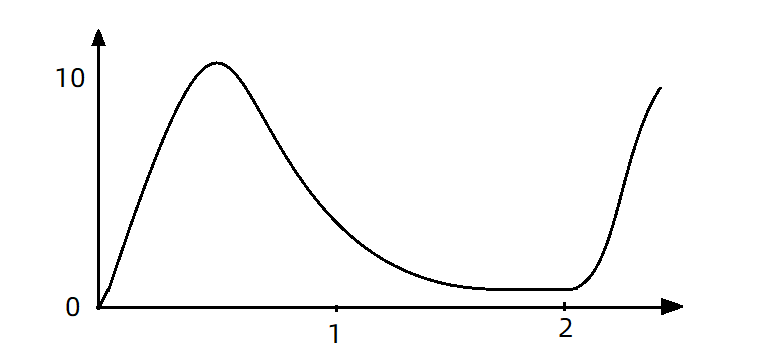

如果使用队列模式做流控，所有进入的请求都要排队，以固定的200ms的间隔执行，QPS会变的很平滑：
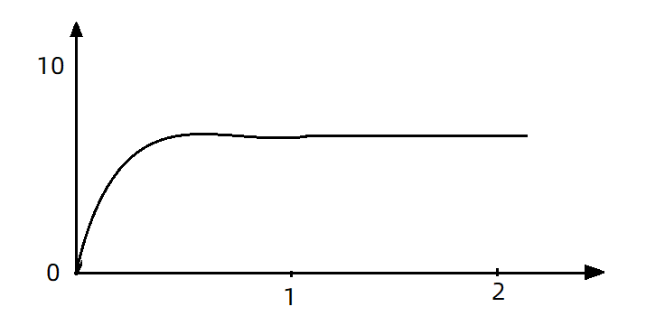

### 🌡️ 热点参数限流

之前的限流是统计访问某个资源的所有请求，判断是否超过QPS阈值。而热点参数限流是**分别统计参数值相同的请求**，判断是否超过QPS阈值。

#### 🌐 全局参数限流
例如，一个根据id查询商品的接口：
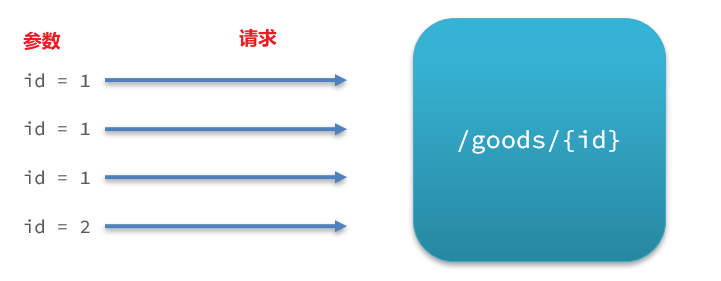

访问/goods/{id}的请求中，id参数值会有变化，热点参数限流会根据参数值分别统计QPS，统计结果：
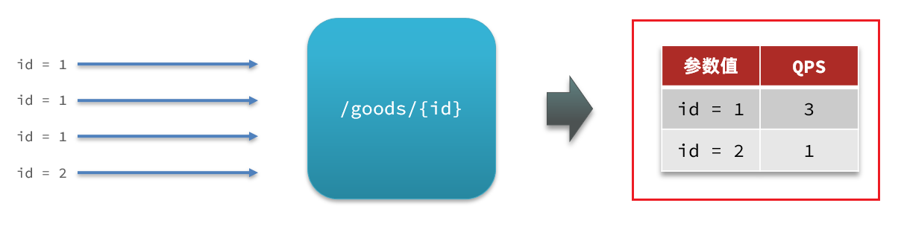

当id=1的请求触发阈值被限流时，id值不为1的请求不受影响。

**配置示例：**
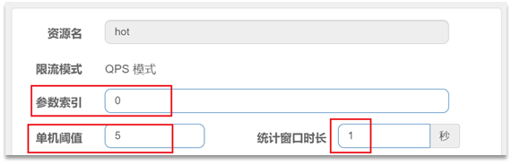
代表的含义是：对hot这个资源的0号参数（第一个参数）做统计，每1秒**相同参数值**的请求数不能超过5。

#### ⚡ 热点参数限流高级配置
刚才的配置中，对查询商品这个接口的所有商品一视同仁，QPS都限定为5。而在实际开发中，可能部分商品是热点商品，例如秒杀商品，我们希望这部分商品的QPS限制与其它商品不一样，高一些。那就需要配置热点参数限流的高级选项了：

结合上一个配置，这里的含义是对0号的long类型参数限流，每1秒相同参数的QPS不能超过5，有两个例外：
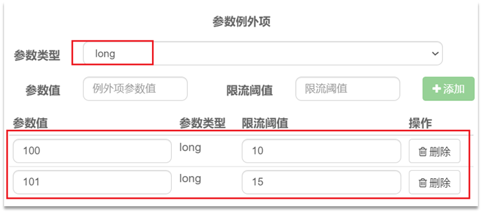
- 如果参数值是100，则每1秒允许的QPS为10
- 如果参数值是101，则每1秒允许的QPS为15

##### 🛠️ 实例
**1. 标记资源**
给order-service中的OrderController中的/order/{orderId}资源添加注解：
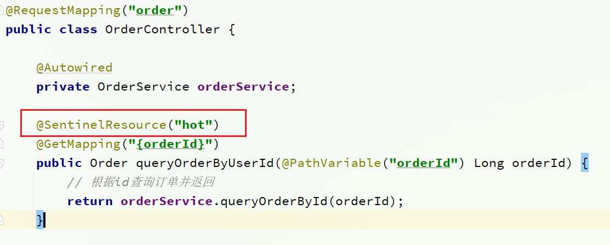

**2. 热点参数限流规则**
访问该接口，可以看到我们标记的hot资源出现了：
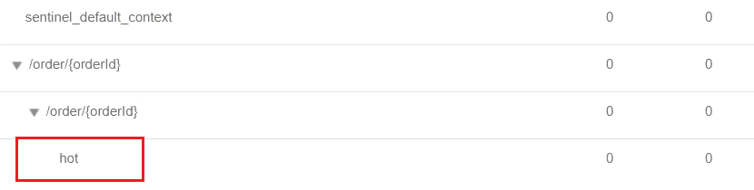

**3. 配置热点规则**
这里不要点击hot后面的按钮（页面有BUG），点击左侧菜单中**热点规则**菜单：
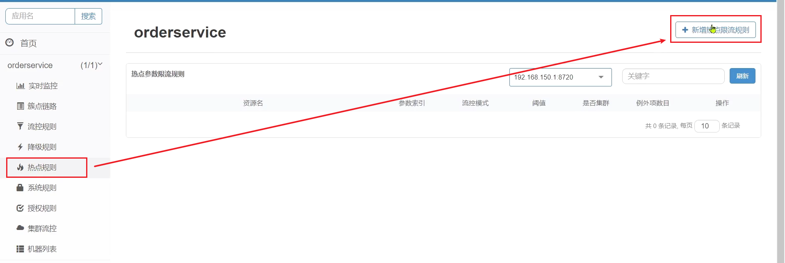

**4. 点击新增，填写表单：**
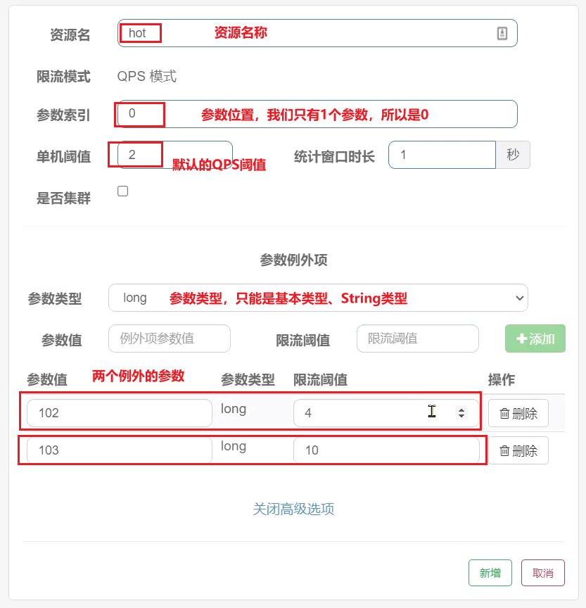

---

## 🛡️ 隔离和降级

限流是一种预防措施，虽然限流可以尽量避免因高并发而引起的服务故障，但服务还会因为其它原因而故障。而要将这些故障控制在一定范围，避免雪崩，就要靠**线程隔离**（舱壁模式）和**熔断降级**手段了。

**线程隔离**：调用者在调用服务提供者时，给每个调用的请求分配独立线程池，出现故障时，最多消耗这个线程池内资源，避免把调用者的所有资源耗尽。


**熔断降级**：是在调用方这边加入断路器，统计对服务提供者的调用，如果调用的失败比例过高，则熔断该业务，不允许访问该服务的提供者了。


> 💡 **注意**：不管是线程隔离还是熔断降级，都是对**客户端**（调用方）的保护。需要在**调用方**发起远程调用时做线程隔离、或者服务熔断。而我们的微服务远程调用都是基于`Feign`来完成的，因此我们需要将`Feign`与`Sentinel`整合，在`Feign`里面实现线程隔离和服务熔断。

### 🔗 `FeignClient`整合`Sentinel`

#### 1. 开启`FeignClient`的`Sentinel`支持
```yaml
feign:
  sentinel:
    enabled: true # 开启feign对sentinel的支持
```

#### 2. 编写失败降级逻辑
业务失败后，不能直接报错，而应该返回用户一个友好提示或者默认结果，这个就是失败降级逻辑。

给`FeignClient`编写失败后的降级逻辑有两种方式：
- **方式一**：`FallbackClass`，无法对远程调用的异常做处理
- **方式二**：`FallbackFactory`，可以对远程调用的异常做处理，**推荐使用**

##### 🛠️ 实例
**1. 在`feign-api`项目中定义类，实现`FallbackFactory`：**
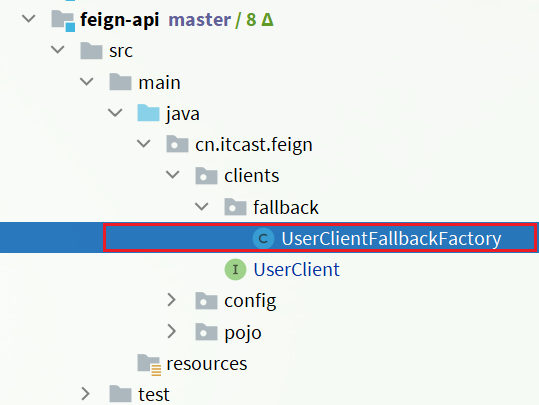
```java
@Slf4j
public class UserClientFallbackFactory implements FallbackFactory<UserClient> {
  @Override
  public UserClient create(Throwable throwable) {
    return new UserClient() {
      @Override
      public User findById(Long id) {
        log.error("查询用户异常", throwable);
        return new User();
      }
    };
  }
}
```

**2. 在`feign-api`项目中的`DefaultFeignConfiguration`类中将`UserClientFallbackFactory`注册为一个Bean：**
```java
@Bean
public UserClientFallbackFactory userClientFallbackFactory(){
    return new UserClientFallbackFactory();
}
```

**3. 在`feign-api`项目中的`UserClient`接口中使用`UserClientFallbackFactory`：**
```java
@FeignClient(value = "userservice", fallbackFactory = UserClientFallbackFactory.class)
public interface UserClient {
    @GetMapping("/user/{id}")
    User findById(@PathVariable("id") Long id);
}
```

### 🚧 线程隔离（舱壁模式）

#### 线程隔离的实现方式
线程隔离有两种方式实现：
- **线程池隔离**
- **信号量隔离**（Sentinel默认采用）

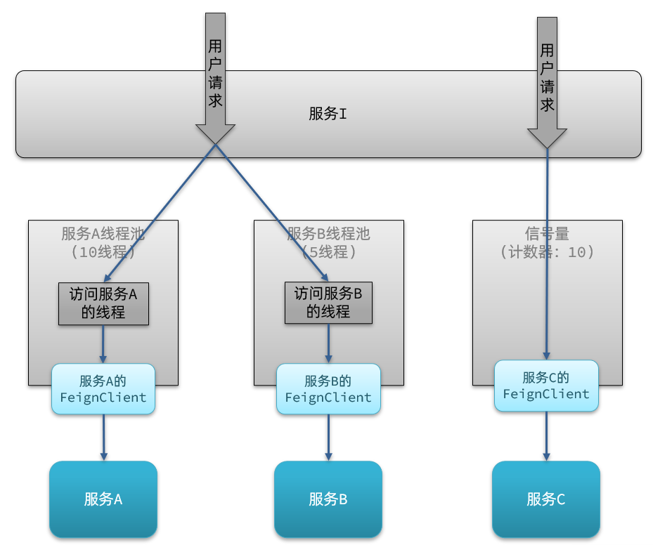

**线程池隔离**：给每个服务调用业务分配一个线程池，利用线程池本身实现隔离效果。  
**信号量隔离**：不创建线程池，而是计数器模式，记录业务使用的线程数量，达到信号量上限时，禁止新的请求。

**两者的优缺点：**
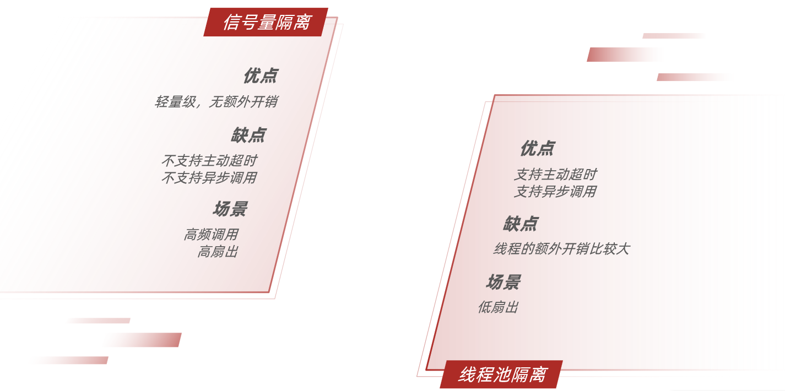

#### 🛠️ Sentinel的线程隔离
**用法说明：**
- 在添加限流规则时，可以选择两种阈值类型：
  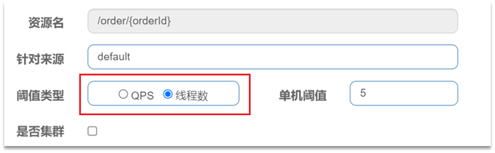
- **QPS**：就是每秒的请求数，在快速入门中已经演示过
- **线程数**：是该资源能使用的tomcat线程数的最大值。也就是通过限制线程数量，实现**线程隔离**（舱壁模式）

#### 📝 总结
**线程隔离的两种手段是？**
- 信号量隔离
- 线程池隔离

**信号量隔离的特点是？**
- 基于计数器模式，简单，开销小

**线程池隔离的特点是？**
- 基于线程池模式，有额外开销，但隔离控制更强

### 🔌 熔断降级

熔断降级是解决雪崩问题的重要手段。其思路是由**断路器**统计服务调用的异常比例、慢请求比例，如果超出阈值则会**熔断**该服务。即拦截访问该服务的一切请求；而当服务恢复时，断路器会放行访问该服务的请求。

断路器控制熔断和放行是通过状态机来完成的：
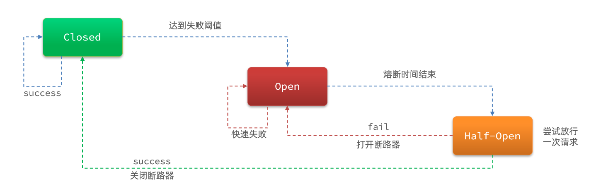

**状态机包括三个状态：**
- **closed**：关闭状态，断路器放行所有请求，并开始统计异常比例、慢请求比例。超过阈值则切换到open状态
- **open**：打开状态，服务调用被**熔断**，访问被熔断服务的请求会被拒绝，快速失败，直接走降级逻辑。Open状态5秒后会进入half-open状态
- **half-open**：半开状态，放行一次请求，根据执行结果来判断接下来的操作。
  - 请求成功：则切换到closed状态
  - 请求失败：则切换到open状态

**断路器熔断策略有三种：** 慢调用、异常比例、异常数

#### 🐌 慢调用
慢调用：业务的响应时长（RT）大于指定时长的请求认定为慢调用请求。在指定时间内，如果请求数量超过设定的最小数量，慢调用比例大于设定的阈值，则触发熔断。

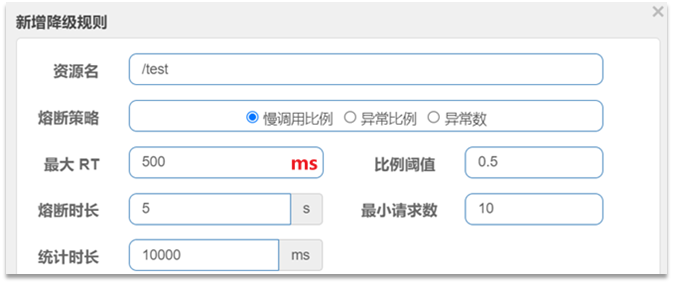

**解读**：RT超过500ms的调用是慢调用，统计最近10000ms内的请求，如果请求量超过10次，并且慢调用比例不低于0.5，则触发熔断，熔断时长为5秒。然后进入half-open状态，放行一次请求做测试。

#### ⚠️ 异常比例、异常数
异常比例或异常数：统计指定时间内的调用，如果调用次数超过指定请求数，并且出现异常的比例达到设定的比例阈值（或超过指定异常数），则触发熔断。

**异常比例配置：**
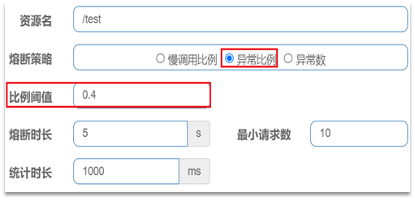
**解读**：统计最近1000ms内的请求，如果请求量超过10次，并且异常比例不低于0.4，则触发熔断。

**异常数配置：**
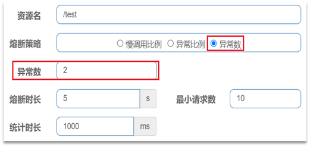
**解读**：统计最近1000ms内的请求，如果请求量超过10次，并且异常数不低于2次，则触发熔断。

---

## 🔐 授权规则

> 💡 **授权规则**可以对请求方来源做判断和控制

### 基本规则
授权规则可以对调用方的来源做控制，有白名单和黑名单两种方式。
- **白名单**：来源（origin）在白名单内的调用者允许访问
- **黑名单**：来源（origin）在黑名单内的调用者不允许访问

点击左侧菜单的授权，可以看到授权规则：
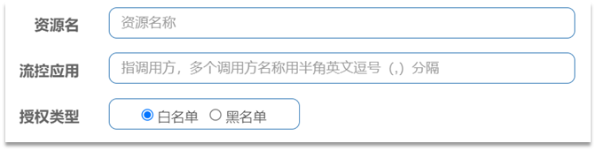

- **资源名**：就是受保护的资源，例如/order/{orderId}
- **流控应用**：是来源者的名单
  - 如果是勾选白名单，则名单中的来源被许可访问
  - 如果是勾选黑名单，则名单中的来源被禁止访问

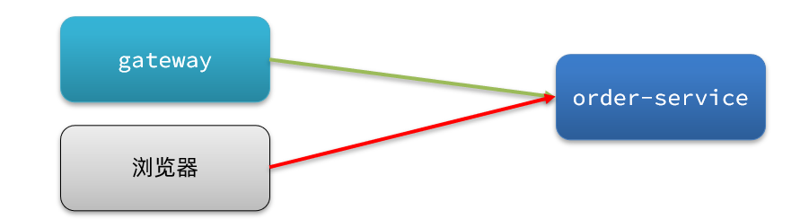

我们允许请求从gateway到order-service，不允许浏览器访问order-service，那么白名单中就要填写**网关的来源名称（origin）**。

### 🛠️ 如何获取origin
Sentinel是通过`RequestOriginParser`这个接口的`parseOrigin`来获取请求的来源的：
```java
public interface RequestOriginParser {
    String parseOrigin(HttpServletRequest request);
}
```

这个方法的作用就是从`request`对象中，获取请求者的`origin`值并返回。

默认情况下，sentinel不管请求者从哪里来，返回值永远是`default`，也就是说一切请求的来源都被认为是一样的值`default`。

因此，我们需要自定义这个接口的实现，让不同的请求，返回不同的`origin`。

例如order-service服务中，我们定义一个`RequestOriginParser`的实现类：
```java
@Component
public class HeaderOriginParser implements RequestOriginParser {
    @Override
    public String parseOrigin(HttpServletRequest request) {
        // 1.获取请求头
        String origin = request.getHeader("origin");
        // 2.非空判断
        if (StringUtils.isEmpty(origin)) {
            origin = "blank";
        }
        return origin;
    }
}
```

### 🌉 给网关添加请求头
既然获取请求`origin`的方式是从`request-header`中获取`origin`值，我们必须让所有从gateway路由到微服务的请求都带上`origin`头。

这个需要利用之前学习的一个`GatewayFilter`来实现，`AddRequestHeaderGatewayFilter`。

修改Gateway服务中的`application.yml`，添加一个defaultFilter：
```yaml
spring:
  cloud:
    gateway:
      default-filters:
        - AddRequestHeader=origin,gateway
      routes:
       # ...略
```

这样，从Gateway路由的所有请求都会带上`origin`头，值为gateway。而从其它地方到达微服务的请求则没有这个头。

### ⚙️ 配置授权规则
- 接下来，我们添加一个授权规则，放行origin值为gateway的请求。
  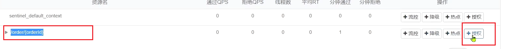

- 配置如下：
  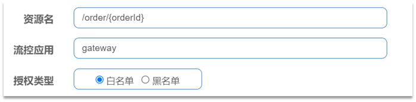

- 现在，我们直接跳过网关，访问order-service服务：
  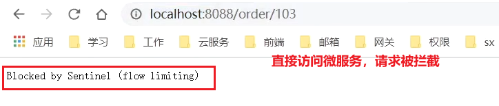

- 通过网关访问：
  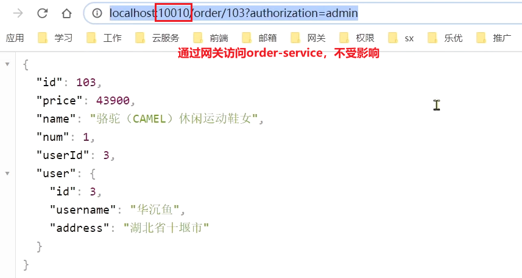

### 🛠️ 自定义异常结果

> 💡 **注意**：默认情况下，发生限流、降级、授权拦截时，都会抛出异常到调用方。异常结果都是`flow limiting`（限流）。这样不够友好，无法得知是限流还是降级还是授权拦截。

#### 异常类型
如果要自定义异常时的返回结果，需要实现`BlockExceptionHandler`接口：
```java
public interface BlockExceptionHandler {
    /**
     * 处理请求被限流、降级、授权拦截时抛出的异常：BlockException
     */
    void handle(HttpServletRequest request, HttpServletResponse response, BlockException e) throws Exception;
}
```

这个方法有三个参数：
- `HttpServletRequest request`：request对象
- `HttpServletResponse response`：response对象
- `BlockException e`：被sentinel拦截时抛出的异常

这里的`BlockException`包含多个不同的子类：

| 异常 | 说明 |
|------|------|
| FlowException | 限流异常 |
| ParamFlowException | 热点参数限流的异常 |
| DegradeException | 降级异常 |
| AuthorityException | 授权规则异常 |
| SystemBlockException | 系统规则异常 |

#### 自定义异常处理
```java
@Component
public class SentinelExceptionHandler implements BlockExceptionHandler {
    @Override
    public void handle(HttpServletRequest request, HttpServletResponse response, BlockException e) throws Exception {
        String msg = "未知异常";
        int status = 429;
        if (e instanceof FlowException) {
            msg = "请求被限流了";
        } else if (e instanceof ParamFlowException) {
            msg = "请求被热点参数限流";
        } else if (e instanceof DegradeException) {
            msg = "请求被降级了";
        } else if (e instanceof AuthorityException) {
            msg = "没有权限访问";
            status = 401;
        }
        Map map = new HashMap<>();
        map.put("msg",msg);
        map.put("status",status);
        response.setContentType("application/json;charset=utf-8");
        response.setStatus(status);
        response.getWriter().println(JSON.toJSONString(map));
    }
}
```

---

## 💾 规则持久化

> 💡 **注意**：现在，sentinel的所有规则都是内存存储，重启后所有规则都会丢失。在生产环境下，我们必须确保这些规则的持久化，避免丢失。

### 规则管理模式
规则是否能持久化，取决于规则管理模式，sentinel支持三种规则管理模式：
- **原始模式**：Sentinel的默认模式，将规则保存在内存，重启服务会丢失。
- **pull模式**
- **push模式**

#### 🔄 pull模式
pull模式：控制台将配置的规则推送到Sentinel客户端，而客户端会将配置规则保存在本地文件或数据库中。以后会定时去本地文件或数据库中查询，更新本地规则。

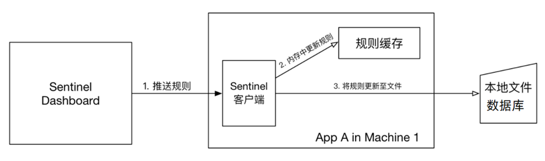

#### 🚀 push模式
push模式：控制台将配置规则推送到远程配置中心，例如Nacos。Sentinel客户端监听Nacos，获取配置变更的推送消息，完成本地配置更新。

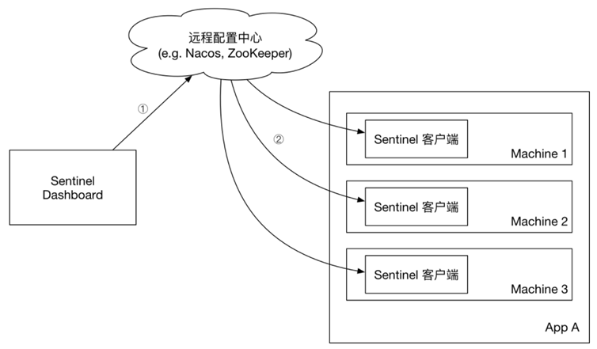

---

## 🎯 总结

Sentinel作为阿里巴巴开源的微服务流量控制组件，提供了丰富的流量控制、熔断降级、系统自适应保护等功能。通过Sentinel，我们可以有效地防止服务雪崩，保障微服务架构的稳定性。

**核心功能总结：**
1. **流量控制**：通过QPS、线程数等多种维度进行限流
2. **熔断降级**：基于慢调用比例、异常比例、异常数进行服务熔断
3. **系统保护**：根据系统负载自适应保护
4. **实时监控**：提供可视化的控制台，实时监控集群状态
5. **规则持久化**：支持多种规则持久化方式，确保规则不丢失

通过合理的配置和使用Sentinel，可以大大提高微服务系统的稳定性和可靠性。