# Seata 分布式事务 ⚙️

## 分布式事务概述

### 本地事务
本地事务，即传统的单机事务。在传统数据库事务中，必须满足 **ACID** 四个原则：

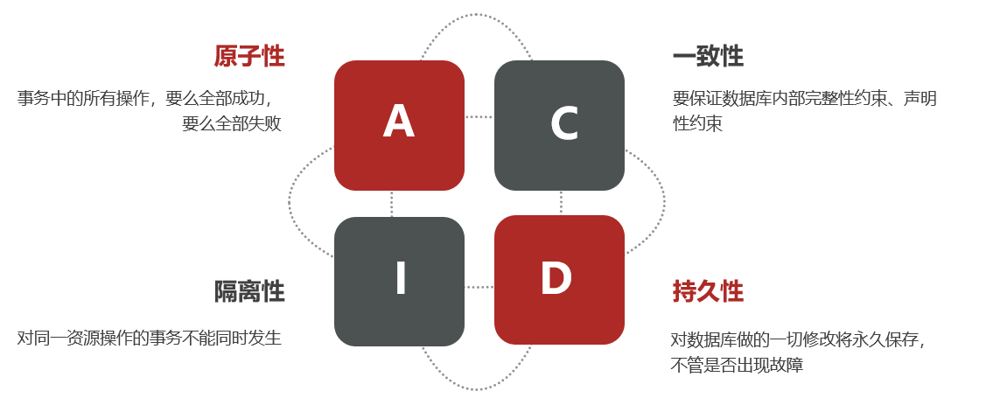

### 分布式事务
**分布式事务** 指在多个服务或数据库架构下产生的事务，主要包括：
- 跨数据源的分布式事务
- 跨服务的分布式事务
- 综合情况

在数据库水平拆分、服务垂直拆分后，一个业务操作通常需要跨多个数据库、服务才能完成。例如电商中的下单付款案例，包括：
- 创建新订单
- 扣减商品库存
- 从用户账户余额扣除金额

完成以上操作需要访问三个不同的微服务和三个不同的数据库。

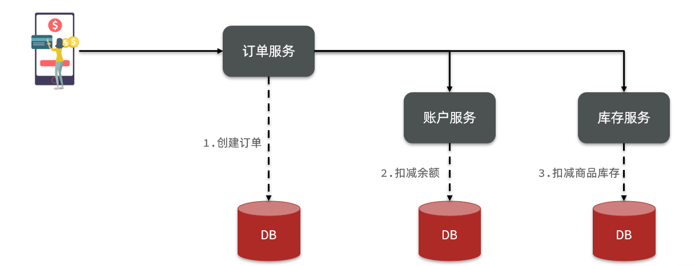

订单创建、库存扣减、账户扣款在各自服务和数据库内是本地事务，可以保证 ACID 原则。但当我们将这三个操作看作一个“业务”时，就需要保证这个“业务”的原子性：要么全部成功，要么全部失败，不允许部分成功部分失败。这就是 **分布式系统下的事务**。

此时 ACID 难以满足，这正是分布式事务要解决的问题。

---

## 理论基础

### CAP 定理
1998年，加州大学的计算机科学家 Eric Brewer 提出，分布式系统有三个指标：
- **Consistency（一致性）**
- **Availability（可用性）**
- **Partition tolerance（分区容错性）**

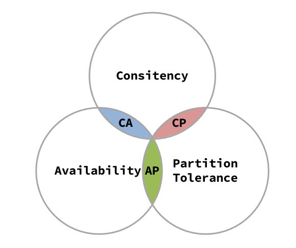

#### 一致性
用户访问分布式系统中的任意节点，得到的数据必须一致。

**示例：**
- 初始数据一致：
  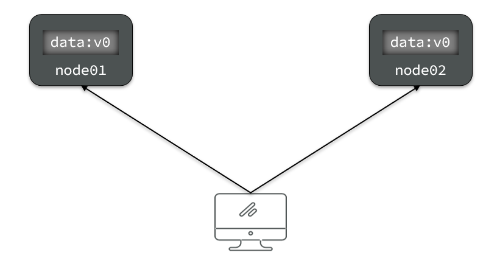
- 修改一个节点数据后出现差异：
  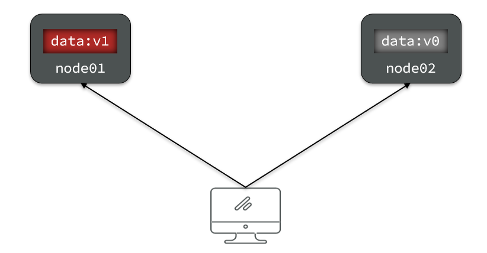
- 为保证一致性，必须同步数据：
  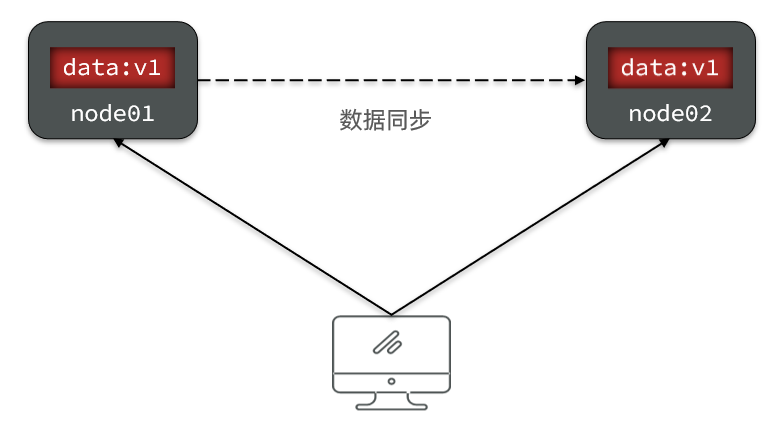

#### 可用性
用户访问集群中的任意健康节点，必须能得到响应，而不是超时或拒绝。

**示例：**
- 三个节点均可及时响应：
  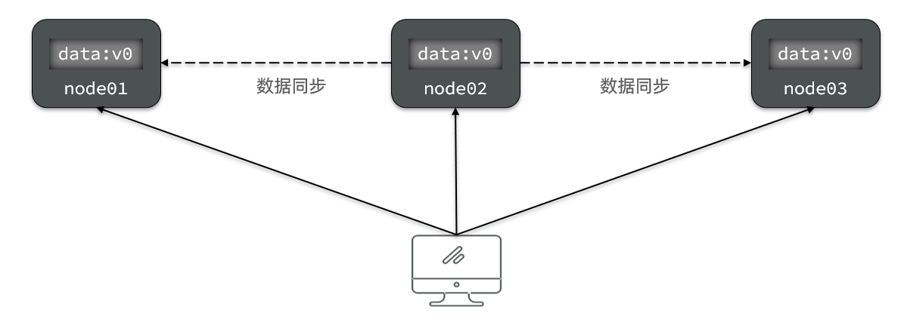
- 部分节点故障导致不可用：
  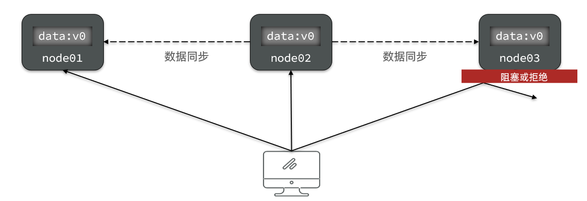

#### 分区容错性
**分区（Partition）**：因网络故障等原因，部分节点与其它节点失去连接，形成独立分区。
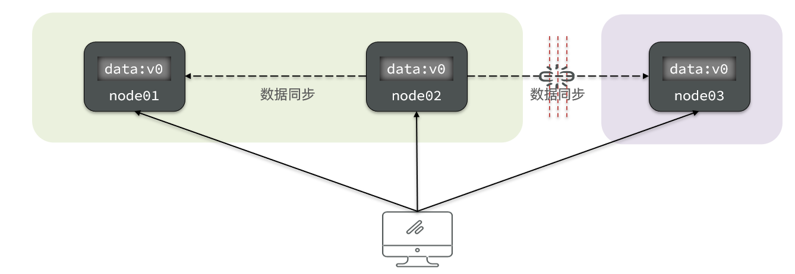

**容错（Tolerance）**：在集群出现分区时，整个系统也要持续对外提供服务。

#### CAP 矛盾
在分布式系统中，网络无法100%健康，分区容错性（P）不可避免。当节点接收到新的数据变更时：

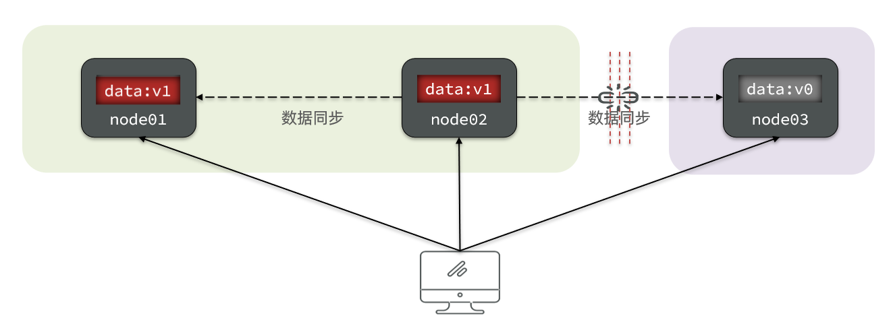

- 若保证**一致性（C）**，必须等待网络恢复并完成数据同步，此时服务阻塞，**不可用（A）**。
- 若保证**可用性（A）**，则不能等待网络恢复，数据会出现**不一致（C）**。

> 在 P 必然出现的情况下，A 和 C 只能实现一个。

### BASE 理论
BASE 理论是对 CAP 的一种解决思路，包含三个思想：
- **Basically Available（基本可用）**：分布式系统出现故障时，允许损失部分可用性，保证核心可用。
- **Soft State（软状态）**：允许在一定时间内出现中间状态（如临时不一致）。
- **Eventually Consistent（最终一致性）**：软状态结束后，最终达到数据一致。

无论哪种模式，都需要在子系统事务之间互相通讯、协调状态，即需要一个 **事务协调者（TC）**：

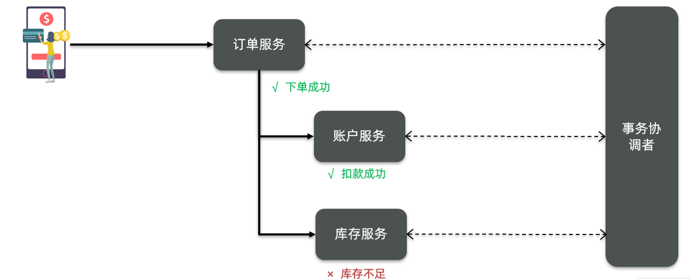

其中：
- **分支事务**：各个子系统事务
- **全局事务**：有关联的各个分支事务的集合

---

## Seata 简介

> Seata 是 2019 年 1 月蚂蚁金服和阿里巴巴共同开源的分布式事务解决方案，致力于提供高性能和简单易用的分布式事务服务。

### Seata 架构
Seata 事务管理中有三个核心角色：
- **TC（Transaction Coordinator）**：事务协调者，维护全局和分支事务状态，协调全局事务提交或回滚。
- **TM（Transaction Manager）**：事务管理器，定义全局事务范围、开始全局事务、提交或回滚全局事务。
- **RM（Resource Manager）**：资源管理器，管理分支事务处理的资源，与 TC 交互注册分支事务并报告状态，驱动分支事务提交或回滚。

整体架构如图：

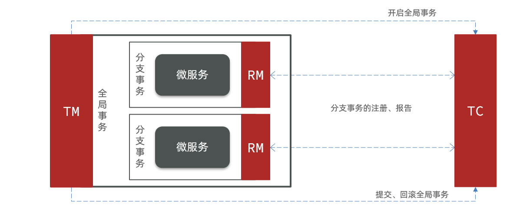

Seata 提供四种分布式事务解决方案：
- **XA 模式**：强一致性分阶段事务模式，牺牲一定可用性，无业务侵入
- **AT 模式**：最终一致的分阶段事务模式，无业务侵入（默认模式）
- **TCC 模式**：最终一致的分阶段事务模式，有业务侵入
- **SAGA 模式**：长事务模式，有业务侵入

所有方案都离不开 TC（事务协调者）。

### 微服务集成 Seata

#### 1️⃣ 引入依赖
```xml
<!--seata-->
<dependency>
    <groupId>com.alibaba.cloud</groupId>
    <artifactId>spring-cloud-starter-alibaba-seata</artifactId>
    <exclusions>
        <!--排除较低版本1.3.0-->
        <exclusion>
            <artifactId>seata-spring-boot-starter</artifactId>
            <groupId>io.seata</groupId>
        </exclusion>
    </exclusions>
</dependency>
<dependency>
    <groupId>io.seata</groupId>
    <artifactId>seata-spring-boot-starter</artifactId>
    <!--使用1.4.2版本-->
    <version>1.4.2</version>
</dependency>
```

#### 2️⃣ 配置 TC 地址
```yaml
seata:
  registry: # TC服务注册中心配置，微服务据此获取TC地址
    type: nacos
    nacos:
      server-addr: 127.0.0.1:8848
      namespace: ""
      group: DEFAULT_GROUP
      application: seata-tc-server
      username: nacos
      password: nacos
  tx-service-group: seata-demo # 事务组名称
  service:
    vgroup-mapping: # 事务组与集群映射关系
      seata-demo: SH
```

微服务通过以下四个信息在 Nacos 中定位 TC 实例：
- **namespace**：命名空间（默认 public）
- **group**：分组（DEFAULT_GROUP）
- **application**：服务名（seata-tc-server）
- **cluster**：集群名（SH）

组合起来即为：`public@DEFAULT_GROUP@seata-tc-server@SH`

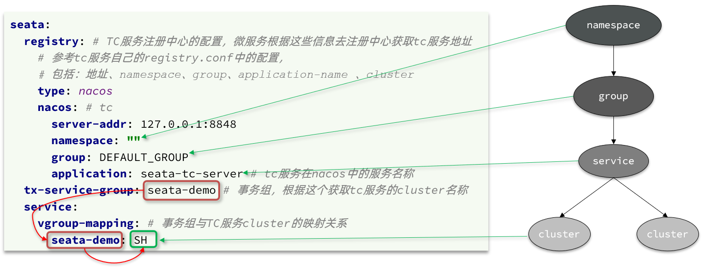

---

## Seata 事务模式

### XA 模式

> XA 规范是 X/Open 组织定义的分布式事务处理标准，几乎所有主流数据库都支持。

#### 两阶段提交
**正常情况：**
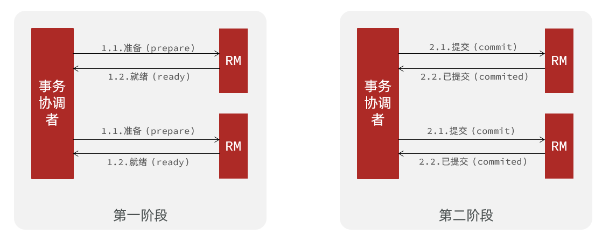

**异常情况：**
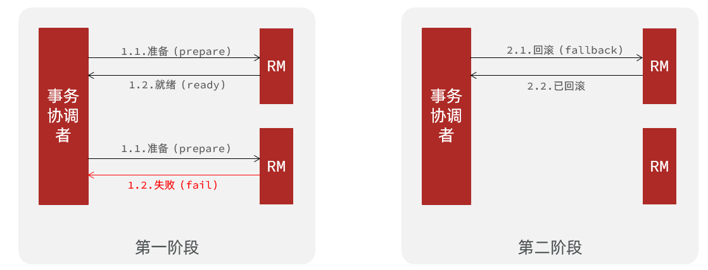

**第一阶段：**
- 事务协调者通知每个事务参与者执行本地事务
- 本地事务执行完成后报告状态给事务协调者（事务不提交，持有数据库锁）

**第二阶段：**
- 事务协调者基于第一阶段报告判断下一步操作：
    - 若全部成功，通知所有参与者提交事务
    - 若有任一失败，通知所有参与者回滚事务

#### Seata 的 XA 模型
Seata 对原始 XA 模式进行封装以适应自身模型：

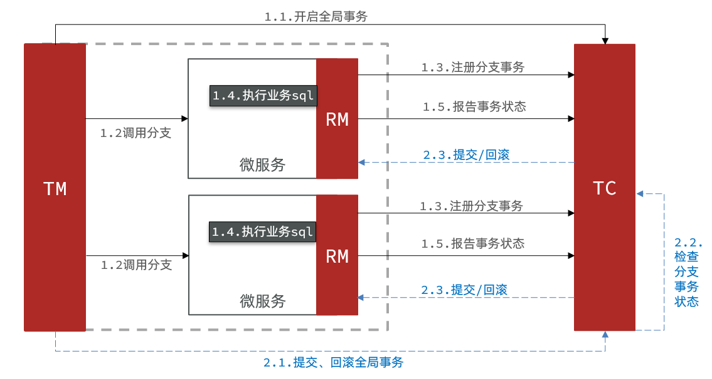

- **RM 第一阶段**：
    - 注册分支事务到 TC
    - 执行业务 SQL 但不提交
    - 报告执行状态到 TC

- **TC 第二阶段**：
    - 检测各分支事务状态
    - 全部成功则通知所有 RM 提交事务
    - 任一失败则通知所有 RM 回滚事务

- **RM 第二阶段**：
    - 接收 TC 指令，提交或回滚事务

#### 优缺点
**优点：**
- 强一致性，满足 ACID 原则
- 主流数据库支持，实现简单，无代码侵入

**缺点：**
- 一阶段锁定资源，等待二阶段结束才释放，性能较差
- 依赖关系型数据库实现事务

#### 实现 XA 模式
1. **修改 `application.yml`**（每个参与事务的微服务）：
   ```yaml
   seata:
     data-source-proxy-mode: XA
   ```

2. **在全局事务入口方法添加 `@GlobalTransactional` 注解**：
   ```java
   @GlobalTransactional
   public void createOrder() {
       // 业务逻辑
   }
   ```

3. **重启服务并测试**

### AT 模式
AT 模式同样是分阶段提交事务模型，但弥补了 XA 模式资源锁定周期过长的缺陷。

#### Seata 的 AT 模型
基本流程：

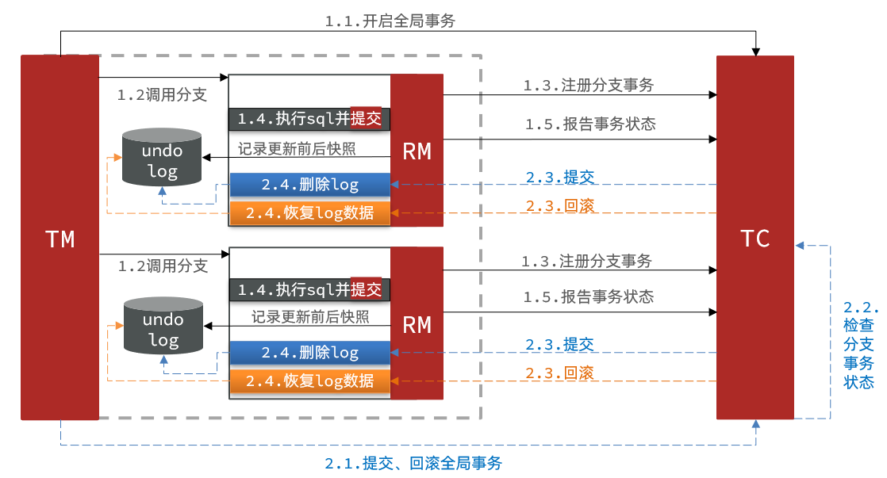

- **第一阶段 RM 工作**：
    - 注册分支事务
    - 记录 undo-log（数据快照）
    - 执行业务 SQL 并提交
    - 报告事务状态

- **第二阶段提交时 RM 工作**：
    - 删除 undo-log

- **第二阶段回滚时 RM 工作**：
    - 根据 undo-log 恢复数据到更新前

#### 流程示例
假设用户余额表：

| id | money |
|----|-------|
| 1  | 100   |


执行 SQL：`update tb_account set money = money - 10 where id = 1`

**第一阶段：**
1. TM 发起并注册全局事务到 TC
2. TM 调用分支事务
3. RM 拦截 SQL，根据 where 条件查询原始数据形成快照：`{"id": 1, "money": 100}`
4. RM 执行业务 SQL，提交本地事务（money = 90），释放数据库锁
5. RM 报告本地事务状态给 TC

**第二阶段：**
1. TM 通知 TC 事务结束
2. TC 检查分支事务状态：
    - 全部成功 → 立即删除快照
    - 任一失败 → 读取快照恢复数据到数据库（money 恢复为 100）

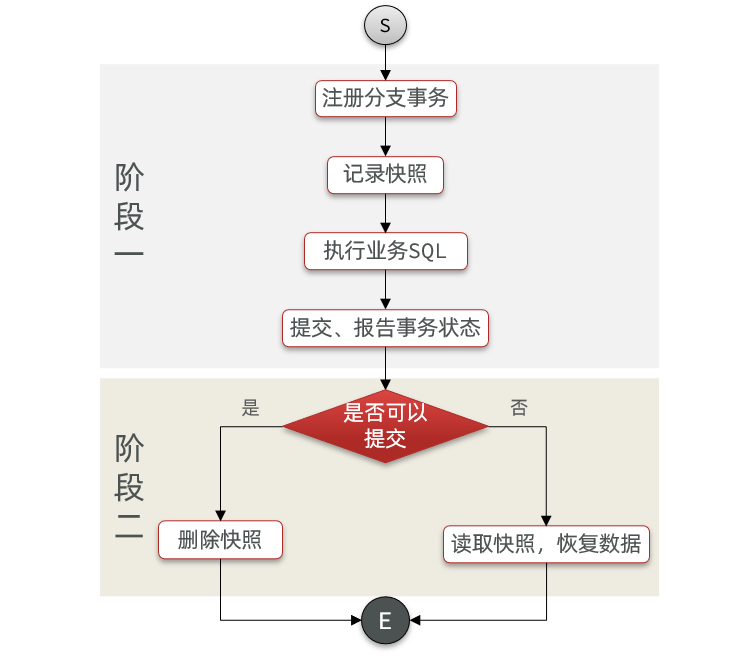

#### AT 与 XA 的区别
- **XA**：一阶段不提交事务，锁定资源；依赖数据库机制回滚；强一致
- **AT**：一阶段直接提交，不锁定资源；利用数据快照回滚；最终一致

#### 脏写问题
多线程并发访问时可能出现脏写：

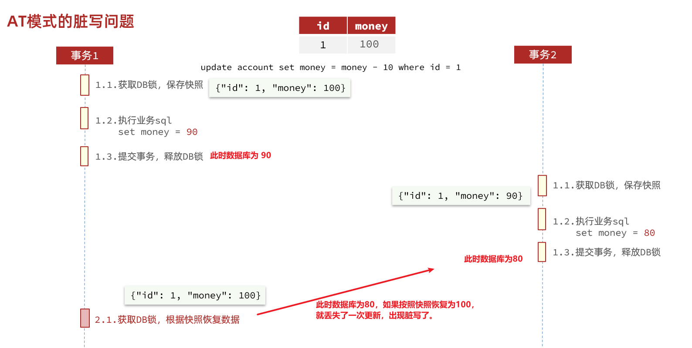

**解决方案**：引入全局锁，在释放 DB 锁之前先获取全局锁，避免并发操作。

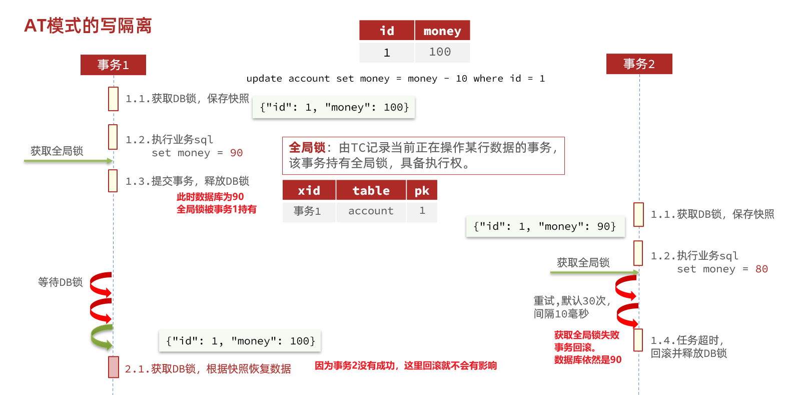

#### 优缺点
**优点：**
- 一阶段直接提交事务，释放资源，性能好
- 利用全局锁实现读写隔离
- 无代码侵入，框架自动完成回滚和提交

**缺点：**
- 两阶段之间是软状态，最终一致
- 快照功能会影响性能（但优于 XA）

#### 实现 AT 模式
1. **导入全局锁记录表**：
   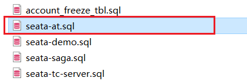

2. **修改 `application.yml`**：
   ```yaml
   seata:
     data-source-proxy-mode: AT # 默认即为 AT
   ```

3. **重启服务并测试**

### TCC 模式
TCC 模式与 AT 模式相似，但通过人工编码实现数据恢复。需要实现三个方法：
- **Try**：资源检测和预留
- **Confirm**：完成资源操作业务（Try 成功则 Confirm 必须成功）
- **Cancel**：预留资源释放（Try 的反向操作）

#### 流程示例
扣减用户余额 30 元，原余额 100 元。

**第一阶段（Try）：**
检查余额充足，则冻结金额增加 30，可用余额扣除 30：
- 初始：可用 100，冻结 0
- Try 后：可用 70，冻结 30（总金额仍为 100）

**第二阶段（Confirm）：**
提交时清除冻结金额：
- Confirm 后：可用 70，冻结 0（总金额 70）

**第二阶段（Cancel）：**
回滚时释放冻结金额，恢复可用余额：
- Cancel 后：可用 100，冻结 0（总金额 100）

#### Seata 的 TCC 模型
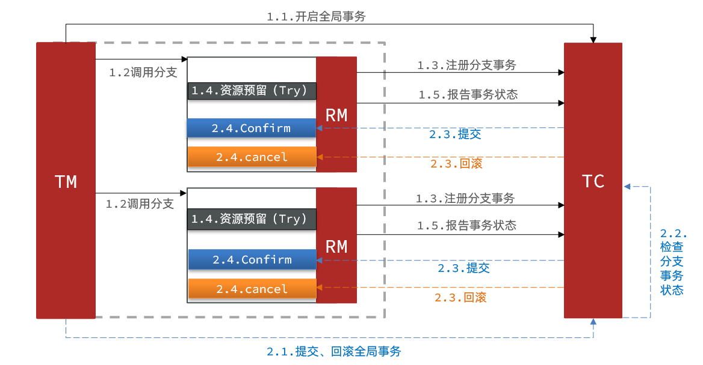

#### 优缺点
**优点：**
- 一阶段直接提交事务，释放资源，性能好
- 无需生成快照和全局锁，性能最强
- 不依赖数据库事务，可用于非事务型数据库

**缺点：**
- 代码侵入，需编写 Try、Confirm、Cancel 接口
- 软状态，最终一致
- 需考虑 Confirm 和 Cancel 的失败情况，保证幂等性

### SAGA 模式
Saga 模式是 Seata 的长事务解决方案，基于 Hector & Kenneth 在 1987 年发表的论文《Sagas》。

#### 原理
在 Saga 模式下，每个参与者都是一个冲正补偿服务，需用户实现正向操作和逆向回滚操作。

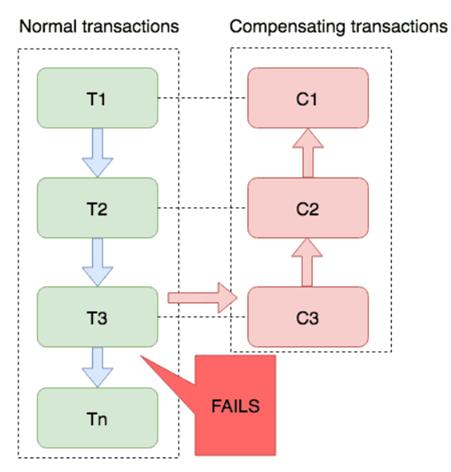

**两个阶段：**
- 一阶段：直接提交本地事务
- 二阶段：成功则无操作；失败则执行补偿业务回滚

#### 优缺点
**优点：**
- 一阶段直接提交事务，无锁，性能好
- 参与者可基于事件驱动实现异步调用，吞吐高
- 实现简单，无需编写 TCC 三个阶段

**缺点：**
- 软状态持续时间不确定，时效性差
- 没有锁和事务隔离，可能出现脏写

---

## 四种模式对比

| 模式 | 一致性 | 隔离性 | 代码侵入 | 性能 | 常见场景 |
|------|--------|--------|----------|------|----------|
| **XA** | 强一致 | 好 | 无 | 差（锁资源） | 对一致性要求高的场景 |
| **AT** | 最终一致 | 好（全局锁） | 无 | 较好 | 大部分分布式事务场景 |
| **TCC** | 最终一致 | 好（资源预留） | 有 | 好 | 对性能要求高、可接受编码的场景 |
| **SAGA** | 最终一致 | 无隔离 | 有 | 好（无锁） | 长事务、业务流程复杂的场景 |

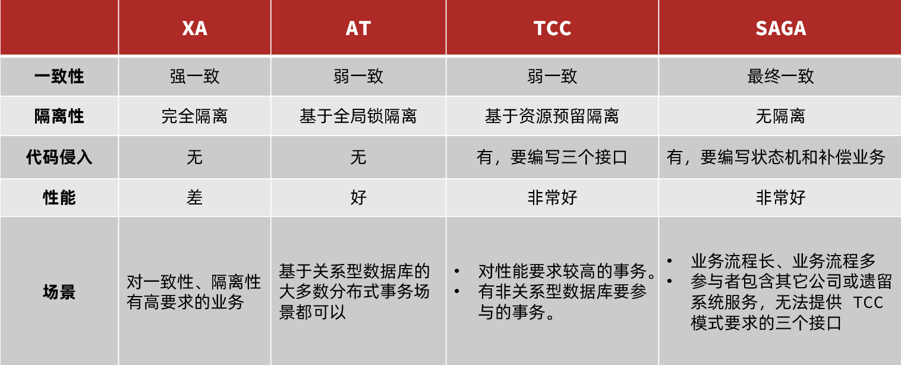

---

## 总结
Seata 提供了多种分布式事务解决方案，可根据业务需求选择合适模式：
- 追求强一致 → **XA 模式**
- 平衡性能与一致性 → **AT 模式**（默认推荐）
- 高性能要求、可接受编码 → **TCC 模式**
- 长事务、复杂流程 → **SAGA 模式**

合理选择和使用 Seata，可有效解决微服务架构下的分布式事务问题，保障数据一致性。