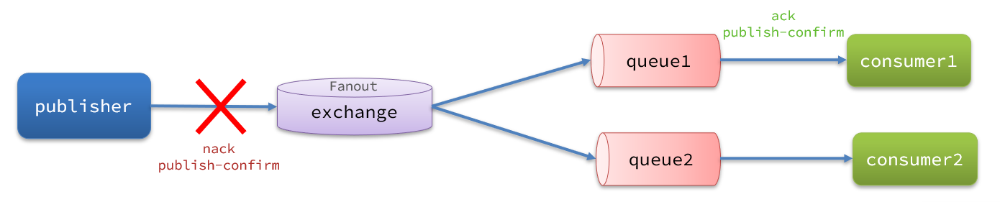
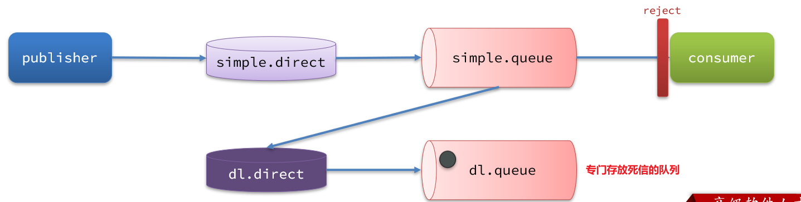
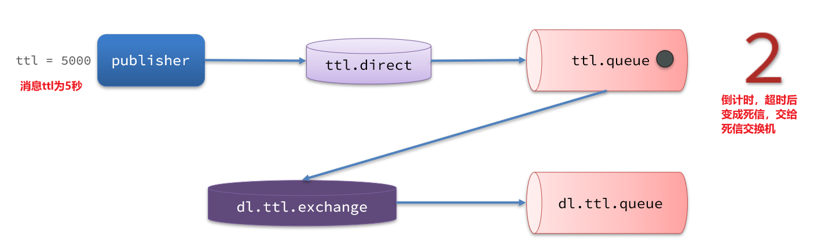
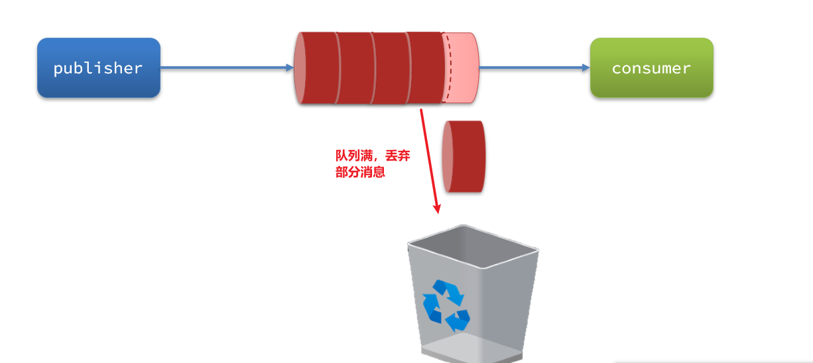
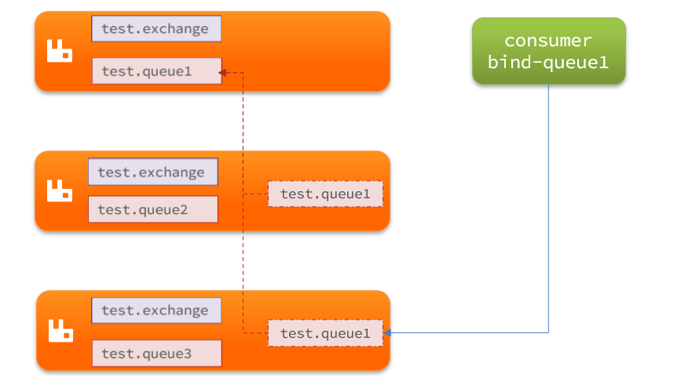
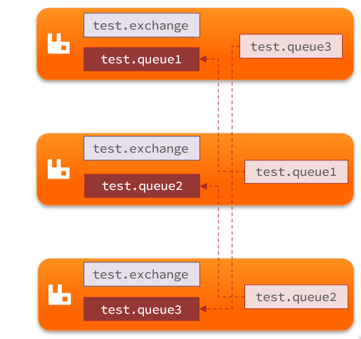

# 📦 RabbitMQ服务异步通信-高级篇

##  消息队列面临的实际问题

消息队列在使用过程中，面临着很多实际问题需要思考：


---

## 消息可靠性保障

消息从发送，到消费者接收，会经历多个过程：


### 消息丢失的常见原因

- **发送时丢失**：
  - 生产者发送的消息未送达exchange
  - 消息到达exchange后未到达queue
- **MQ宕机**，queue将消息丢失
- **consumer接收到消息后未消费就宕机**

### RabbitMQ解决方案

- ✅ 生产者确认机制
- ✅ mq持久化
- ✅ 消费者确认机制
- ✅ 失败重试机制

---

## 1️⃣ 生产者消息确认机制

### 机制说明

RabbitMQ提供了publisher confirm机制来避免消息发送到MQ过程中丢失。这种机制必须给每个消息指定一个唯一ID。消息发送到MQ以后，会返回一个结果给发送者，表示消息是否处理成功。

**返回结果有两种方式：**

- **publisher-confirm**：发送者确认
  - 消息成功投递到交换机，返回ack
  - 消息未投递到交换机，返回nack
- **publisher-return**：发送者回执
  - 消息投递到交换机了，但是没有路由到队列。返回ACK，及路由失败原因。



> ⚠️ 注意：
> 

### 1.1 修改配置

首先，修改publisher服务中的application.yml文件，添加下面的内容：

```yaml
spring:
  rabbitmq:
    publisher-confirm-type: correlated
    publisher-returns: true
    template:
      mandatory: true
```


**配置说明：**

- `publish-confirm-type`：开启publisher-confirm
  - `simple`：同步等待confirm结果，直到超时
  - `correlated`：异步回调，定义ConfirmCallback
- `publish-returns`：开启publish-return功能
- `template.mandatory`：定义消息路由失败时的策略

### 1.2 定义ReturnConfirm回调

每个RabbitTemplate只能配置一个ReturnCallback，因此需要在项目加载时配置：

```java
@Slf4j
@Configuration
public class CommonConfig implements ApplicationContextAware {
    @Override
    public void setApplicationContext(ApplicationContext applicationContext) throws BeansException {
        // 获取RabbitTemplate
        RabbitTemplate rabbitTemplate = applicationContext.getBean(RabbitTemplate.class);
        
        // 设置ReturnCallback
        rabbitTemplate.setReturnCallback((message, replyCode, replyText, exchange, routingKey) -> {
            // 投递失败，记录日志
            log.info("消息发送失败，应答码{}，原因{}，交换机{}，路由键{},消息{}",
                    replyCode, replyText, exchange, routingKey, message.toString());
            // 如果有业务需要，可以重发消息
        });

        // 设置ConfirmCallback
        rabbitTemplate.setConfirmCallback(new RabbitTemplate.ConfirmCallback() {
            @Override
            public void confirm(CorrelationData correlationData, boolean ack, String cause) {
                if(ack){
                    // 3.1.ack，消息成功
                    log.debug("消息发送成功, ID:{}", correlationData.getId());
                }else{
                    // 3.2.nack，消息失败
                    log.error("消息发送失败, ID:{}, 原因{}",correlationData.getId(), cause);
                }
            }
        });
    }
    
    @Bean
    public DirectExchange simpleExchange(){
        // 三个参数：交换机名称、是否持久化、当没有queue与其绑定时是否自动删除
        return new DirectExchange("simple.direct", false, false);
    }
    
    @Bean
    public Queue simpleQueue(){
        return new Queue("simple.queue",false);
    }
    
    @Bean
    public Binding binding(){
        return BindingBuilder.bind(simpleQueue()).to(simpleExchange()).with("simple");
    }
}
```


> **💡 小贴士**: 在Spring Boot项目中，[ApplicationContextAware](https://docs.spring.io/spring-framework/docs/current/javadoc-api/org/springframework/context/ApplicationContextAware.html)接口允许Bean获取[ApplicationContext](https://docs.spring.io/spring-framework/docs/current/javadoc-api/org/springframework/context/ApplicationContext.html)的引用，这在需要在配置类中访问其他Bean时非常有用。

### 1.3 发送消息测试

在publisher服务的`course.mq.spring.SpringAmqpTest`类中，定义一个单元测试方法：

```java
public void testSendMessage2SimpleQueue() throws InterruptedException {
    // 1.消息体
    String message = "hello, spring amqp!";
    // 2.全局唯一的消息ID，需要封装到CorrelationData中
    CorrelationData correlationData = new CorrelationData(UUID.randomUUID().toString());
    // 4.发送消息
    rabbitTemplate.convertAndSend("task.direct", "task", message, correlationData);
    // 休眠一会儿，等待ack回执
    Thread.sleep(2000);
}
```


#### 测试结果对比

| 测试场景 | 交换机 | 路由键 | 确认回调 | Return回调 |
|---------|--------|--------|----------|------------|
| **不存在的交换机** | task.direct | task | ❌ false | ❌ 未触发 |
| **存在交换机，不存在路由** | simple.direct | task | ✅ true | ✅ 触发 |
| **正确配置** | simple.direct | simple | ✅ true | ❌ 未触发 |

> 💡 **结论：** 通过发送确认和消息返还机制可以确保消息一定能够投递到指定的队列中，如果消息没有投递成功或返还了，也可以通过定时重新投递的方式进行补偿。

---

## 2️⃣ 消息持久化机制

生产者确认可以确保消息投递到RabbitMQ的队列中，但是消息发送到RabbitMQ以后，如果突然宕机，也可能导致消息丢失。

要想确保消息在RabbitMQ中安全保存，必须开启消息持久化机制：

### 2.1 交换机持久化

RabbitMQ中交换机默认是非持久化的，mq重启后就丢失。

```java
@Bean
public DirectExchange simpleExchange(){
    // 三个参数：交换机名称、是否持久化、当没有queue与其绑定时是否自动删除
    return new DirectExchange("simple.direct", true, false);
}
```


> ✅ 默认情况下，由SpringAMQP声明的交换机都是持久化的。

### 2.2 队列持久化

RabbitMQ中队列如果设置成非持久化的，mq重启后就丢失。

```java
@Bean
public Queue simpleQueue(){
    return new Queue("simple.queue",true);
}
```


> ✅ 默认情况下，由SpringAMQP声明的队列都是持久化的。

### 2.3 消息持久化

利用SpringAMQP发送消息时，可以设置消息的属性（MessageProperties），指定delivery-mode：

- **1**：非持久化
- **2**：持久化

```java
@Test
public void testSendMessage2SimpleQueue() throws InterruptedException {
    String routingKey = "simple";
    String message = "hello, spring amqp!";
    // 自定义数据
    CorrelationData data = new CorrelationData(UUID.randomUUID().toString());
    // 发送消息
    rabbitTemplate.convertAndSend("simple.direct", routingKey, message, new MessagePostProcessor() {
        // 后置处理消息
        @Override
        public Message postProcessMessage(Message message) throws AmqpException {
            // 设置消息的持久化方式
            message.getMessageProperties().setDeliveryMode(MessageDeliveryMode.NON_PERSISTENT);
            return message;
        }
    },data);
}
```


> ✅ 默认情况下，SpringAMQP发出的任何消息都是持久化的，不用特意指定。

---

## 3️⃣ 消费者消息确认机制

RabbitMQ是**阅后即焚**机制，RabbitMQ确认消息被消费者消费后会立刻删除。

### 三种确认模式对比

| 模式 | 特点 | 可靠性 |
|-----|------|--------|
| **none** | 关闭ack，MQ假定消费者获取消息后会成功处理 | ❌ 不可靠 |
| **auto** | 自动ack，由spring监测listener代码是否出现异常 | ✅ 推荐 |
| **manual** | 手动ack，需要在业务代码结束后调用api发送ack | ⚠️ 需自行控制 |

### 3.1 演示none模式

```yaml
spring:
  rabbitmq:
    listener:
      simple:
        acknowledge-mode: none # 关闭ack
```
```java
@RabbitListener(queues = "simple.queue")
public void listenSimpleQueue(String msg) {
    log.info("消费者接收到simple.queue的消息：【{}】", msg);
    // 模拟异常
    System.out.println(1 / 0);
    log.debug("消息处理完成！");
}
```


> ⚠️ 测试可以发现，当消息处理抛异常时，消息依然被RabbitMQ删除了。

### 3.2 演示auto模式

```yaml
spring:
  rabbitmq:
    listener:
      simple:
        acknowledge-mode: auto # 自动ack
```


> ✅ 抛出异常后，Spring会自动返回nack，消息恢复至Ready状态，并且没有被RabbitMQ删除。

---

## 4️⃣ 消费失败重试机制

当消费者出现异常后，消息会不断requeue（重入队）到队列，再重新发送给消费者，然后再次异常，再次requeue，无限循环。

### 4.1 本地重试配置

```yaml
spring:
  rabbitmq:
    listener:
      simple:
        retry:
          enabled: true # 开启消费者失败重试
          initial-interval: 1000ms # 初识的失败等待时长为1秒
          multiplier: 1 # 失败的等待时长倍数
          max-attempts: 3 # 最大重试次数
          stateless: true # true无状态；false有状态
```


> ✅ 开启本地重试时，消息处理过程中抛出异常，不会requeue到队列，而是在消费者本地重试。
> 重试达到最大次数后，Spring会返回ack，消息会被丢弃。

### 4.2 失败策略选择

| 策略 | 处理方式 |
|-----|----------|
| **RejectAndDontRequeueRecoverer** | 重试耗尽后，直接reject，丢弃消息（默认） |
| **ImmediateRequeueMessageRecoverer** | 重试耗尽后，返回nack，消息重新入队 |
| **RepublishMessageRecoverer** | 重试耗尽后，将失败消息投递到指定的交换机 |

### 推荐方案：RepublishMessageRecoverer

```java
@Configuration
public class ErrorMessageConfig {
    @Bean
    public DirectExchange errorMessageExchange(){
        return new DirectExchange("error.direct");
    }
    
    @Bean
    public Queue errorQueue(){
        return new Queue("error.queue", true);
    }
    
    @Bean
    public Binding errorBinding(Queue errorQueue, DirectExchange errorMessageExchange){
        return BindingBuilder.bind(errorQueue).to(errorMessageExchange).with("error");
    }

    @Bean
    public MessageRecoverer republishMessageRecoverer(RabbitTemplate rabbitTemplate){
        return new RepublishMessageRecoverer(rabbitTemplate, "error.direct", "error");
    }
}
```


---

## 消息可靠性总结

如何确保RabbitMQ消息的可靠性？

1. ✅ **开启生产者确认机制**，确保生产者的消息能到达队列
2. ✅ **开启持久化功能**，确保消息未消费前在队列中不会丢失
3. ✅ **开启消费者确认机制为auto**，由spring确认消息处理成功后完成ack
4. ✅ **开启消费者失败重试机制**，并设置MessageRecoverer，多次重试失败后将消息投递到异常交换机，交由人工处理

---

## 💀 死信交换机

### 什么是死信交换机

### 死信的三种情况：

- 消费者使用basic.reject或 basic.nack声明消费失败，并且消息的requeue参数设置为false
- 消息是一个过期消息，超时无人消费
- 要投递的队列消息满了，无法投递

### 死信交换机的作用：

如果队列绑定了死信交换机，死信会投递到死信交换机，可以收集所有消费者处理失败的消息，交由人工处理。





### 死信交换机配置示例

在 consumer 中 CommonConfig 修改消息策略

```java
    @Bean
    public MessageRecoverer republishMessageRecoverer(RabbitTemplate rabbitTemplate){
        // return new RepublishMessageRecoverer(rabbitTemplate, "error.direct", "error");
        return new RejectAndDontRequeueRecoverer();
    }
```
```java
    @Bean
    public Queue simpleQueue(){
        return QueueBuilder.durable("simple.queue")
                .deadLetterExchange("dl.direct") // 指定死信交换机
                .build();
    }
    
    // 声明死信交换机 dl.direct
    @Bean
    public DirectExchange dlExchange(){
        return new DirectExchange("dl.direct", true, false);
    }
    
    // 声明存储死信的队列 dl.queue
    @Bean
    public Queue dlQueue(){
        return new Queue("dl.queue", true);
    }
    
    // 将死信队列 与 死信交换机绑定
    @Bean
    public Binding dlBinding(){
        return BindingBuilder.bind(dlQueue()).to(dlExchange()).with("dl");
    }
```


---

## ⏰ TTL（消息超时）

一个队列中的消息如果超时未消费，则会变为死信，超时分为两种情况：

1. **消息所在的队列设置了超时时间**
2. **消息本身设置了超时时间**



### TTL配置

#### 1.接收超时死信的死信交换机

```java
    @RabbitListener(bindings = @QueueBinding(
        value = @Queue(name = "dl.ttl.queue", durable = "true"),
        exchange = @Exchange(name = "dl.ttl.direct"),
        key = "ttl"
    ))
    public void listenDlQueue(String msg){
        log.info("接收到 dl.ttl.queue的延迟消息：{}", msg);
    }
```


#### 2.声明一个队列，并且指定TTL

```java
    @Bean
    public Queue ttlQueue(){
        return QueueBuilder.durable("ttl.queue") // 指定队列名称，并持久化
            .ttl(10000) // 设置队列的超时时间，10秒
            .deadLetterExchange("dl.ttl.direct") // 指定死信交换机
            .build();
    }
```


#### 3.声明交换机，将ttl与交换机绑定

```java
    @Bean
    public DirectExchange ttlExchange(){
        return new DirectExchange("ttl.direct");
    }
    @Bean
    public Binding ttlBinding(){
        return BindingBuilder.bind(ttlQueue()).to(ttlExchange()).with("ttl");
    }
```


#### 4.发送消息

```java
    @Test
    public void testTTLMsg() {
      Message message = MessageBuilder
              .withBody("hello, ttl message".getBytes(StandardCharsets.UTF_8))
              .setExpiration("5000") // 设置消息的TTL，单位ms
              .build();
      // 消息ID，需要封装到CorrelationData中
      CorrelationData correlationData = new CorrelationData(UUID.randomUUID().toString());
      rabbitTemplate.convertAndSend("ttl.direct", "ttl", message, correlationData);
      log.debug("发送消息成功");
    }
```


### 延迟队列

利用TTL结合死信交换机，我们实现了消息发出后，消费者延迟收到消息的效果。

延迟队列的使用场景包括：

- 延迟发送短信
- 用户下单，如果用户在15 分钟内未支付，则自动取消
- 预约工作会议，20分钟后自动通知所有参会人员

#### DelayExchange 插件原理

DelayExchange需要将一个交换机声明为delayed类型。当我们发送消息到delayExchange时，流程如下：

- 接收消息
- 判断消息是否具备x-delay属性
- 如果有x-delay属性，说明是延迟消息，持久化到硬盘，读取x-delay值，作为延迟时间
- 返回routing not found结果给消息发送者
- x-delay时间到期后，重新投递消息到指定队列

#### DelayExchange 使用

插件的使用也非常简单：声明一个交换机，交换机的类型可以是任意类型，只需要设定delayed属性为true即可，然后声明队列与其绑定即可。

##### 1.声明DelayExchange交换机

```java
    @RabbitListener(bindings = @QueueBinding(
            value = @Queue(name = "delay.queue", durable = "true"),
            exchange = @Exchange(name = "delay.direct",delayed = "true"),
            key = "delay"
    ))
    public void listenDelayedQueue(String msg){
        log.info("接收到 delay.queue的延迟消息：{}", msg);
    }
```


也可以基于 @Bean 的方式


##### 2.发送消息

> 发送消息时，一定要携带x-delay属性，指定延迟的时间

```java
    @Test
    public void testDelayedMsg() {
        Message message = MessageBuilder
                .withBody("hello, delay message".getBytes(StandardCharsets.UTF_8))
                .setHeader("x-delay",5000)  // 延迟10秒,原方式为: .setExpiration("5000")
                .build();
        CorrelationData correlationData = new CorrelationData(UUID.randomUUID().toString());
        // 发送消息
        rabbitTemplate.convertAndSend("delay.direct", "delay", message, correlationData);
        log.debug("发送消息成功");
    }
```


##### 3.总结

- 延迟队列的实现原理基于DelayExchange插件，该插件需要安装到RabbitMQ中。
- 声明一个交换机，添加delayed属性为true
- 发送消息时，添加x-delay头，值为超时时间

---

## 📦 惰性队列

消息堆积：队列中的消息数量过多，导致消息积压，无法及时处理。之后发送的消息就会成为死信，可能会被丢弃，这就是消息堆积问题。

- 增加更多消费者，提高消费速度。也就是我们之前说的work queue模式
- 扩大队列容积，提高堆积上限

### 惰性队列 (Lazy Queues)

惰性队列：基于磁盘存储，消息存储在磁盘上，而不是内存中，适用于数据量较大的场景。(RabbitMQ的3.6.0版本开始)
- 接收到消息后直接存入磁盘而非内存
- 消费者要消费消息时才会从磁盘中读取并加载到内存
- 支持数百万条的消息存储

### 惰性队列使用

#### 1.基于命令行设置 lazy-queue

```shell
rabbitmqctl set_policy Lazy "^lazy-queue$" '{"queue-mode":"lazy"}' --apply-to queues  
```


- `rabbitmqctl` ：RabbitMQ的命令行工具
- `set_policy` ：添加一个策略
- `Lazy` ：策略名称，可以自定义
- `"^lazy-queue$"` ：用正则表达式匹配队列的名字
- `'{"queue-mode":"lazy"}'` ：设置队列模式为lazy模式
- `--apply-to queues  `：策略的作用对象，是所有的队列

#### 2.基于 @Bean 设置 lazy-queue

```java
@Bean
public Queue lazyQueue(){
    return QueueBuilder
            .durable("lazy.queue")
            .lazy()  // 开启 x-lazy-queue 为 lazy
            .build();
}
```


#### 3.基于 @RabbitListener 设置 lazy-queue

```java
@RabbitListener(queuesToDeclare = @Queue(
        name = "lazy.queue",
        durable = "true",
        arguments = @Argument(name = "x-queue-mode", value = "lazy")
))
public void listenLazyQueue(String msg){
    log.info("接收到 lazy.queue 的消息：{}", msg);
}
```


### 惰性队列的特点

#### 优点：

- ✅ 基于磁盘存储，消息上限高
- ✅ 没有间歇性的page-out，性能比较稳定

#### 缺点：

- ⚠️ 基于磁盘存储，消息时效性会降低
- ⚠️ 性能受限于磁盘的IO

---

## 🏗️ MQ集群

### 集群分类

RabbitMQ的集群有三种模式：

- **普通集群**：是一种分布式集群，将队列分散到集群的各个节点，从而提高整个集群的并发能力。
- **镜像集群**：是一种主从集群，普通集群的基础上，添加了主从备份功能，提高集群的数据可用性。
- **仲裁队列**：底层采用Raft协议确保主从的数据一致性。

> 镜像集群虽然支持主从，但主从同步并不是强一致的，某些情况下可能有数据丢失的风险。

### 普通集群

#### 普通集群特点

- 普通集群，或者叫标准集群（classic cluster）
- 会在集群的各个节点间共享部分数据，包括：交换机、队列元信息。不包含队列中的消息。
- 当访问集群某节点时，如果队列不在该节点，会从数据所在节点传递到当前节点并返回
- 队列所在节点宕机，队列中的消息就会丢失



### 镜像集群

#### 镜像集群特点

- 镜像集群：本质是主从模式
- 交换机、队列、队列中的消息会在各个mq的镜像节点之间同步备份。
- 创建队列的节点被称为该队列的**主节点，**备份到的其它节点叫做该队列的**镜像**节点。
- 一个队列的主节点可能是另一个队列的镜像节点
- 所有操作都是主节点完成，然后同步给镜像节点
- 主宕机后，镜像节点会替代成新的主



### 仲裁队列

#### 仲裁队列特点

- 与镜像队列一样，都是主从模式，支持主从数据同步
- 使用非常简单，没有复杂的配置
- 主从同步基于Raft协议，强一致

#### 仲裁队列配置

```java
@Bean
public Queue quorumQueue() {
    return QueueBuilder
        .durable("quorum.queue") // 持久化
        .quorum() // 仲裁队列
        .build();
}
```

### SpringAMQP连接MQ集群

```yaml
spring:
  rabbitmq:
    addresses: 192.168.200.128:8071, 192.168.200.128:8072, 192.168.200.128:8073
    username: 1115suc
    password: 24364726
    virtual-host: /
```

---