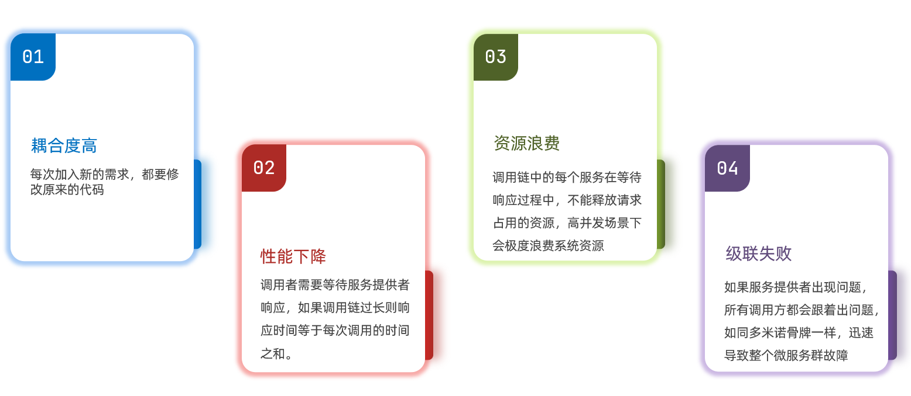
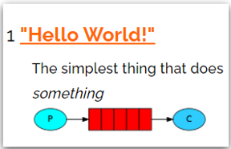
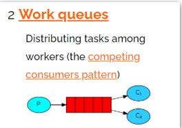
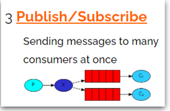
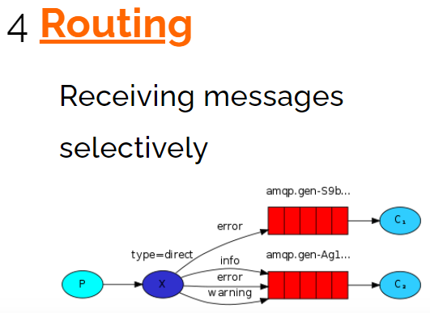
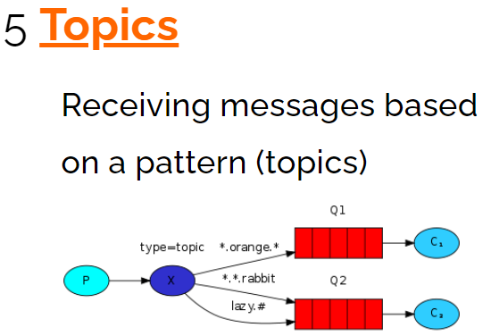
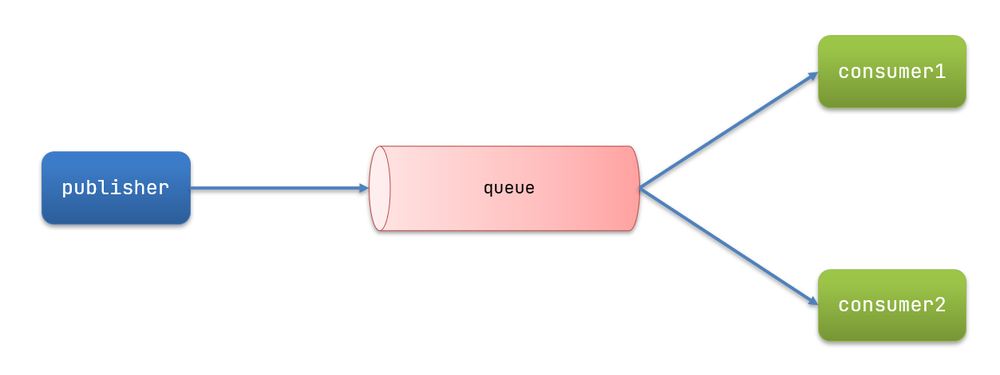
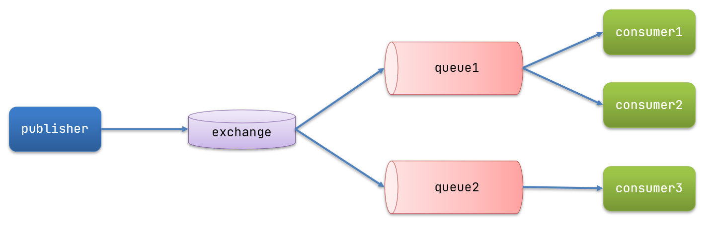
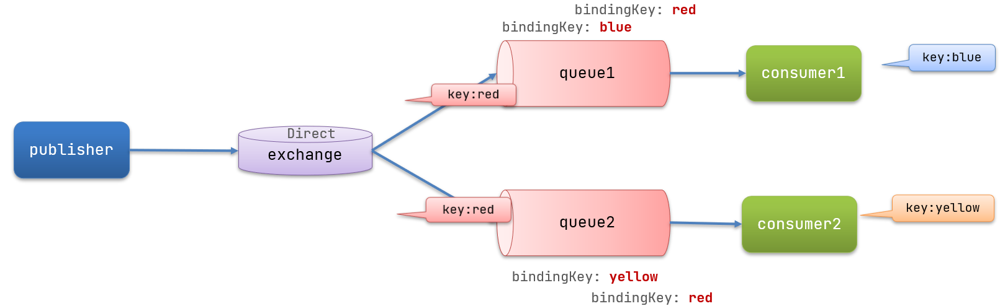

# 🐰 RabbitMQ 学习笔记

##  初识MQ

###  同步和异步通讯

服务间通讯有同步和异步两种方式：

- **同步通讯**：就像打电话，需要实时响应
- **异步通讯**：就像发邮件，不需要马上回复


####  同步通讯



✅ **优点**：
- 时效性较强，可以立即得到结果

❌ **问题**：
- 耦合度高
- 性能下降
- 有额外的资源消耗
- 有级联失败问题

####  异步通讯


**好处**：
-  吞吐量提升：无需等待订阅者处理完成
-  故障隔离：不存在级联失败问题
-  无阻塞：不会造成无效的资源占用
-  耦合度低：服务可以灵活插拔
-  流量削峰：Broker接收所有流量波动

**缺点**：
-  架构复杂，业务没有明显的流程线
-  需要依赖于Broker的可靠、安全、性能

###  技术对比

MQ，中文是消息队列（MessageQueue），字面来看就是存放消息的队列。

|                          | **RabbitMQ**                   | **ActiveMQ**                   | **RocketMQ** | **Kafka**  |
| ------------------------ | ------------------------------ | ------------------------------ | ------------ | ---------- |
| 公司/社区                | Rabbit                         | Apache                         | 阿里         | Apache     |
| 开发语言                 | Erlang                         | Java                           | Java         | Scala&Java |
| 协议支持                 | AMQP，XMPP，SMTP，STOMP        | OpenWire,STOMP，REST,XMPP,AMQP | 自定义协议   | 自定义协议 |
| 可用性                   | 高                             | 一般                           | 高           | 高         |
| 单机吞吐量               | 一般                           | 差                             | 高           | 非常高     |
| 消息延迟                 | 微秒级                         | 毫秒级                         | 毫秒级       | 毫秒以内   |
| 消息可靠性               | 高                             | 一般                           | 高           | 一般       |

**选择建议**：
- 追求可用性：Kafka、RocketMQ、RabbitMQ
- 追求可靠性：RabbitMQ、RocketMQ
- 追求吞吐能力：RocketMQ、Kafka
- 追求消息低延迟：RabbitMQ、Kafka

##  快速入门

###  RabbitMQ基本结构


**RabbitMQ中的角色**：
- `publisher`：生产者
- `consumer`：消费者
- `exchange`：交换机，负责消息路由
- `queue`：队列，存储消息
- `virtualHost`：虚拟主机，隔离不同租户
- `channel`：通道，操作MQ的工具

⚠️ **注意**：生产者只知道交换机，消费者只知道队列

###  消息模型

RabbitMQ官方提供了5个不同的消息模型：

#### 1️⃣ 基本消息队列（BasicQueue）



#### 2️⃣ 工作消息队列（WorkQueue）



#### 3️⃣ 发布订阅（Publish、Subscribe）

根据交换机类型不同分为三种：

#####  Fanout Exchange：广播



#####  Direct Exchange：路由



#####  Topic Exchange：主题



**通配符规则**：
- `#`：匹配一个或多个词
- `*`：匹配恰好1个词

###  入门案例

####  生产者实现

```java
public class PublisherTest {
    @Test
    public void testSendMessage() throws IOException, TimeoutException {
        // 1.建立连接
        ConnectionFactory factory = new ConnectionFactory();
        factory.setHost("192.168.200.128");
        factory.setPort(5672);
        factory.setVirtualHost("/");
        factory.setUsername("itcast");
        factory.setPassword("123321");
        Connection connection = factory.newConnection();

        // 2.创建通道Channel
        Channel channel = connection.createChannel();

        // 3.创建队列
        String queueName = "simple.queue";
        channel.queueDeclare(queueName, false, false, false, null);

        // 4.发送消息
        String message = "hello, rabbitmq!";
        channel.basicPublish("", queueName, null, message.getBytes());
        System.out.println("发送消息成功：【" + message + "】");

        // 5.关闭通道和连接
        channel.close();
        connection.close();
    }
}
```

####  消费者实现

```java
public class ConsumerTest {
    public static void main(String[] args) throws IOException, TimeoutException {
        // 1.建立连接
        ConnectionFactory factory = new ConnectionFactory();
        factory.setHost("192.168.200.128");
        factory.setPort(5672);
        factory.setVirtualHost("/");
        factory.setUsername("itcast");
        factory.setPassword("123321");
        Connection connection = factory.newConnection();

        // 2.创建通道Channel
        Channel channel = connection.createChannel();

        // 3.创建队列
        String queueName = "simple.queue";
        channel.queueDeclare(queueName, false, false, false, null);

        // 4.订阅消息
        channel.basicConsume(queueName, true, new DefaultConsumer(channel){
            @Override
            public void handleDelivery(String consumerTag, Envelope envelope,
                                       AMQP.BasicProperties properties, byte[] body) throws IOException {
                // 5.处理消息
                String message = new String(body);
                System.out.println("接收到消息：【" + message + "】");
            }
        });
        System.out.println("等待接收消息。。。。");
    }
}
```

###  总结

**消息发送流程**：
1. 建立connection → 创建channel → 声明队列 → 发送消息

**消息接收流程**：
1. 建立connection → 创建channel → 声明队列 → 定义消费行为 → 绑定消费者与队列

##  SpringAMQP

###  SpringAMQP介绍

SpringAMQP是基于RabbitMQ封装的一套模板，利用SpringBoot实现自动装配。

**主要功能**：
- 自动声明队列、交换机及其绑定关系
- 基于注解的监听器模式，异步接收消息
- 封装RabbitTemplate工具，用于发送消息
###  简单队列模型

#### 引入依赖

```xml
<!--AMQP依赖，包含RabbitMQ-->
<dependency>
    <groupId>org.springframework.boot</groupId>
    <artifactId>spring-boot-starter-amqp</artifactId>
</dependency>
```

####  消息发送

**application.yml配置**：
```yaml
spring:
  rabbitmq:
    host: 192.168.200.128
    port: 5672
    virtual-host: /
    username: 1115suc
    password: 24364726
```

**发送消息代码**：
```java
@RunWith(SpringRunner.class)
@SpringBootTest
public class SpringAmqpTest {
    @Autowired
    private RabbitTemplate rabbitTemplate;

    @Test
    public void testSimpleQueue() {
        String queueName = "simple.queue";
        String message = "hello, spring amqp!";
        rabbitTemplate.convertAndSend(queueName, message);
    }
}
```

####  消息接收

```java
@Component
public class SpringRabbitListener {
    @RabbitListener(queues = "simple.queue")
    public void listenSimpleQueueMessage(String msg) throws InterruptedException {
        System.out.println("spring 消费者接收到消息：【" + msg + "】");
    }
}
```

###  WorkQueue模型

Work queues，任务模型。让多个消费者绑定到一个队列，共同消费消息。



####  消息发送

```java
@Test
public void testWorkQueue() throws InterruptedException {
    String queueName = "simple.queue";
    String message = "hello, message_";
    for (int i = 0; i < 50; i++) {
        rabbitTemplate.convertAndSend(queueName, message + i);
        Thread.sleep(20);
    }
}
```

####  消息接收

```java
@RabbitListener(queues = "simple.queue")
public void listenWorkQueue1(String msg) throws InterruptedException {
    System.out.println("消费者1接收到消息：【" + msg + "】" + new Date());
    Thread.sleep(20);
}

@RabbitListener(queues = "simple.queue")
public void listenWorkQueue2(String msg) throws InterruptedException {
    System.err.println("消费者2........接收到消息：【" + msg + "】" + new Date());
    Thread.sleep(100);
}
```

####  能者多劳配置

在application.yml中添加配置：
```yaml
spring:
  rabbitmq:
    listener:
      simple:
        prefetch: 1 # 每次最多预取一条消息
```

###  发布/订阅模型

发布订阅模型中，多了一个exchange角色：



**Exchange类型**：
- Fanout：广播，将消息交给所有绑定队列
- Direct：定向，把消息交给符合routing key的队列
- Topic：通配符，把消息交给符合routing pattern的队列

⚠️ **注意**：Exchange只负责转发消息，不具备存储消息的能力

###  Fanout Exchange

####  声明队列和交换机

```java
@Configuration
public class FanoutConfig {
    @Bean
    public FanoutExchange fanoutExchange(){
        return new FanoutExchange("itcast.fanout");
    }

    @Bean
    public Queue fanoutQueue1(){
        return new Queue("fanout.queue1");
    }

    @Bean
    public Binding bindingQueue1(Queue fanoutQueue1, FanoutExchange fanoutExchange){
        return BindingBuilder.bind(fanoutQueue1).to(fanoutExchange);
    }

    @Bean
    public Queue fanoutQueue2(){
        return new Queue("fanout.queue2");
    }

    @Bean
    public Binding bindingQueue2(Queue fanoutQueue2, FanoutExchange fanoutExchange){
        return BindingBuilder.bind(fanoutQueue2).to(fanoutExchange);
    }
}
```

####  消息接收

```java
@RabbitListener(queues = "fanout.queue1")
public void listenFanoutQueue1(String msg) {
    System.out.println("消费者1接收到Fanout消息：【" + msg + "】");
}

@RabbitListener(queues = "fanout.queue2")
public void listenFanoutQueue2(String msg) {
    System.out.println("消费者2接收到Fanout消息：【" + msg + "】");
}
```

####  消息发送

```java
@Test
public void testFanoutExchange() {
    String exchangeName = "itcast.fanout";
    String message = "hello, everyone!";
    rabbitTemplate.convertAndSend(exchangeName, "", message);
}
```

###  Direct Exchange

在Direct模型下，队列与交换机的绑定需要指定RoutingKey。



####  基于注解声明

```java
@RabbitListener(bindings = @QueueBinding(
        value = @Queue(name = "direct.queue1"),
        exchange = @Exchange(name = "itcast.direct", type = ExchangeTypes.DIRECT),
        key = {"red", "blue"}
))
public void listenDirectQueue1(String msg){
    System.out.println("消费者接收到direct.queue1的消息：【" + msg + "】");
}

@RabbitListener(bindings = @QueueBinding(
        value = @Queue(name = "direct.queue2"),
        exchange = @Exchange(name = "itcast.direct", type = ExchangeTypes.DIRECT),
        key = {"red", "yellow"}
))
public void listenDirectQueue2(String msg){
    System.out.println("消费者接收到direct.queue2的消息：【" + msg + "】");
}
```

####  消息发送

```java
@Test
public void testSendDirectExchange() {
    String exchangeName = "itcast.direct";
    String message = "红色警报！日本乱排核废水，导致海洋生物变异，惊现哥斯拉！";
    rabbitTemplate.convertAndSend(exchangeName, "red", message);
}
```

###  Topic Exchange

Topic类型Exchange可以让队列在绑定Routing key时使用通配符：


**通配符规则**：
- `#`：匹配一个或多个词
- `*`：匹配恰好1个词

####  消息接收

```java
@RabbitListener(bindings = @QueueBinding(
        value = @Queue(name = "topic.queue1"),
        exchange = @Exchange(name = "itcast.topic", type = ExchangeTypes.TOPIC),
        key = "china.#"
))
public void listenTopicQueue1(String msg) {
    System.out.println("消费者接收到topic.queue1的消息：【" + msg + "】");
}

@RabbitListener(bindings = @QueueBinding(
        value = @Queue(name = "topic.queue2"),
        exchange = @Exchange(name = "itcast.topic", type = ExchangeTypes.TOPIC),
        key = "#.news"
))
public void listenTopicQueue2(String msg) {
    System.out.println("消费者接收到topic.queue2的消息：【" + msg + "】");
}
```

####  消息发送

```java
@Test
public void testSendTopicExchange() {
    String exchangeName = "itcast.topic";
    String message = "喜报！孙悟空大战哥斯拉，胜!";
    rabbitTemplate.convertAndSend(exchangeName, "china.news", message);
}
```

###  消息转换器

Spring默认使用JDK序列化，存在以下问题：
- 数据体积过大
- 有安全漏洞
- 可读性差

####  测试默认转换器

```java
@Test
public void testSendMap() throws InterruptedException {
    Map<String,Object> msg = new HashMap<>();
    msg.put("name", "Jack");
    msg.put("age", 21);
    rabbitTemplate.convertAndSend("simple.queue", msg);
}
```

####  配置JSON转换器

**引入依赖**：
```xml
<dependency>
    <groupId>com.fasterxml.jackson.dataformat</groupId>
    <artifactId>jackson-dataformat-xml</artifactId>
    <version>2.9.10</version>
</dependency>
```

**配置消息转换器**：
```java
@Bean
public MessageConverter jsonMessageConverter(){
    return new Jackson2JsonMessageConverter();
}
```

**接收消息**：
```java
@RabbitListener(queues = "object.queue")
public void listenObjectQueue(Map<String, Object> msg) {
    System.out.println("收到消息：【" + msg + "】");
}
```
