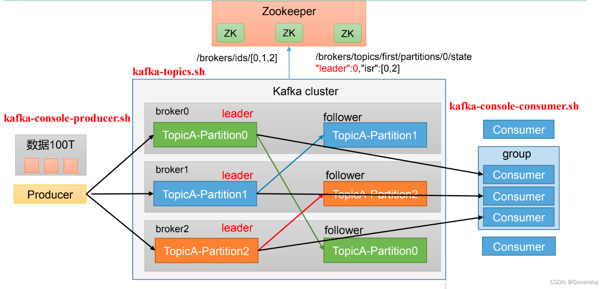
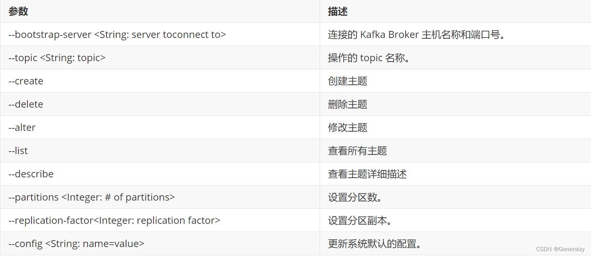
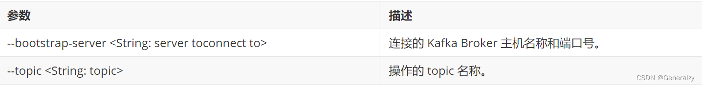
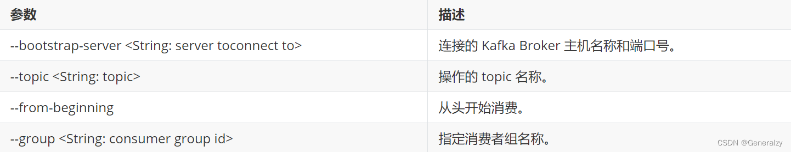
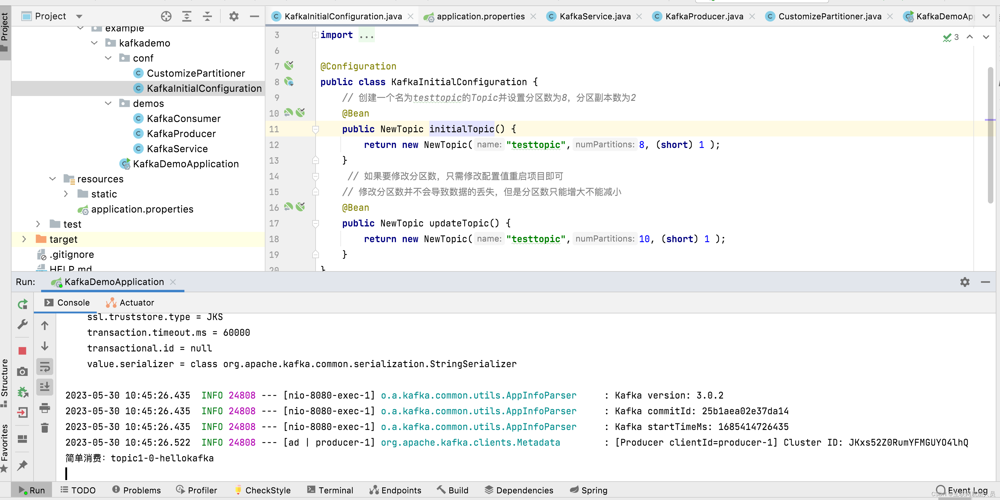

# 📚 Kafka

## 🚀 Kafka 命令行操作

### 🔧 Kafka基础架构



### 📝 主题命令行操作

#### 1. 查看操作主题命令参数
```shell
./bin/kafka-topics.sh 
```




#### 2. 查看当前服务器中的所有topic
```shell
./bin/kafka-topics.sh --bootstrap-server localhost:9092 --list
```


#### 3. 创建 `first topic`
```shell
./bin/kafka-topics.sh --bootstrap-server localhost:9092 --create --partitions 1 --replication-factor 1 --topic first
```


- topic 定义 topic 名
- replication-factor 定义副本数
- partitions 定义分区数

#### 4. 查看 `first` 主题的详情
```shell
./bin/kafka-topics.sh --bootstrap-server localhost:9092 --topic first --describe
```


#### 5. 修改分区数（⚠️ 注意：分区数只能增加，不能减少）
```shell
./bin/kafka-topics.sh --bootstrap-server localhost:9092 --alter --topic first --partitions 3
```


#### 6. 查看结果
```shell
./bin/kafka-topics.sh --bootstrap-server localhost:9092 --topic first --describe 
Topic: first	TopicId: _Pjhmn1NTr6ufGufcnsw5A	PartitionCount: 3	ReplicationFactor: 1	Configs: segment.bytes=1073741824
	Topic: first	Partition: 0	Leader: 0	Replicas: 0	Isr: 0
	Topic: first	Partition: 1	Leader: 0	Replicas: 0	Isr: 0
	Topic: first	Partition: 2	Leader: 0	Replicas: 0	Isr: 0
```


#### 7. 删除 `topic`
```shell
./bin/kafka-topics.sh --bootstrap-server localhost:9092 --delete --topic first 
```


### ✉️ 生产者命令行操作

#### 1. 查看操作者命令参数
```shell
./bin/kafka-console-producer.sh 
```




#### 2. 发送消息
```shell
./bin/kafka-console-producer.sh --bootstrap-server localhost:9092 --topic first
>hello world
>yooome yooome
```


### 👤 消费者命令行操作

#### 1. 查看操作消费者命令参数
```shell
./bin/kafka-console-consumer.sh
```




#### 2. 消费消息

- 消费 `first` 主题中的数据
```shell
./bin/kafka-console-consumer.sh --bootstrap-server localhost:9092 --topic first
```


- 把主题中所有的数据都读取出来（包括历史数据）
```shell
./bin/kafka-console-consumer.sh --bootstrap-server localhost:9092 --from-beginning --topic first
```


---

## 💻 Kafka Java API 开发

### 1. 创建主题
```shell
kafka-topics.sh --bootstrap-server 192.168.200.100:9092 --create --topic topic-java-client
```


### 2. 启动消费者监听主题
```shell
kafka-console-consumer.sh --bootstrap-server 192.168.200.100:9092 --topic topic-java-client
```


### 3. 引入 Kafka 客户端依赖
```xml
<!-- kafka-clients 2023.10-->
<dependency>
    <groupId>org.apache.kafka</groupId>
    <artifactId>kafka-clients</artifactId>
    <version>3.6.0</version>
</dependency>
```


### 4. 编写 Java 生产者代码
```java
public class MyProducerDemo
{
    public static final String TOPIC_NAME = "topic-java-client";

    public static void main(String[] args)
    {
        // 1. 创建Kafka生产者的配置对象
        Properties properties = new Properties();
        // 2. 给Kafka配置对象添加配置信息：bootstrap.servers
        properties.put(ProducerConfig.BOOTSTRAP_SERVERS_CONFIG, "192.168.200.100:9092");
        // key,value序列化（必须）：key.serializer，value.serializer
        properties.put(ProducerConfig.KEY_SERIALIZER_CLASS_CONFIG, "org.apache.kafka.common.serialization.StringSerializer");
        properties.put(ProducerConfig.VALUE_SERIALIZER_CLASS_CONFIG, "org.apache.kafka.common.serialization.StringSerializer");
        // 3. 创建Kafka生产者对象
        KafkaProducer kafkaProducer = new KafkaProducer(properties);

        // 4. 调用send方法,发送消息
        for (int i = 0; i < 5; i++) {
            kafkaProducer.send(new ProducerRecord<>(TOPIC_NAME, "hello-kafka-from-java-client~" + i));
        }
        
        System.out.println("----MyProducerDemo发送完毕");
        // 5. 关闭资源
        kafkaProducer.close();
    }
}
```


- `ProducerRecord` 构造函数参数说明：
```java
public class ProducerRecord<K, V> {
    //主题名称，必选参数
    private final String topic;
    
    //分区号，大于等于0的整数，可选参数。
    private final Integer partition;
    
    //消息的头信息，类型是RecordHeaders，可选属性。
    private final Headers headers;
    
    //键，可选参数。
    private final K key;
    
    //消息内容，必选参数。
    private final V value;
    
    //每条消息都有一个时间戳，可选参数
    private final Long timestamp;
}
```


### 5. send()方法返回值

- `send()` 方法返回一个 `Future<RecordMetadata>` 对象，用于异步处理发送结果。
- `RecordMetadata` 包含了消息的元数据，如主题、分区、偏移量等。
- 可以通过调用 `Future.get()` 方法阻塞等待发送结果，也可以注册回调函数异步处理。也就是说不调用 `Future.get()` 方法就是异步模式。

```java
// 同步
for (int i = 0; i < 5; i++) {
    // 发送消息的任务交给子线程去做
    ProducerRecord<String, String> producerRecord = new ProducerRecord<>(TOPIC_NAME, null, "hello-kafka-from-java-client~~~" + i);
    Future<RecordMetadata> future = kafkaProducer.send(producerRecord);
    TimeUnit.SECONDS.sleep(1);
    // 但是因为调用了 get() 方法，就变成子线程必须执行完发送消息的任务
    // for 循环的本次循环体才算执行完，才能继续执行下一次循环
    // 下一次循环就是发送下一条消息
    future.get();
}
```


### 6. 获取消息发送结果

- 给 `KafkaProducer` 的 `send()` 方法再传入一个 `CallBack` 类型的参数，以异步回调的方式获取消息发送结果，从而得知消息发送是成功还是失败。
  * `Callback` 接口的 `onCompletion()` 方法会在消息发送完成后被调用，无论消息是否成功发送。
  * `RecordMetadata`：消息的元数据（属于哪个topic、属于哪个partition、对应的offset是什么）
  * `Exception`：这个对象Kafka生产消息封装了出现的异常，如果为null，表示发送成功，如果不为null，表示出现异常。

```java
kafkaProducer.send(new ProducerRecord<>(TOPIC_NAME, "hello-kafka-from-java-client*******"), new Callback() {
    // onCompletion() 方法在发送消息操作完成时被调用
    @Override
    public void onCompletion(RecordMetadata recordMetadata, Exception e) {
        if (e == null) {
            long offset = recordMetadata.offset();
            System.out.println("offset = " + offset);

            int partition = recordMetadata.partition();
            System.out.println("partition = " + partition);

            long timestamp = recordMetadata.timestamp();
            System.out.println("timestamp = " + timestamp);

            String topic = recordMetadata.topic();
            System.out.println("topic = " + topic);

        } else {
            System.out.println("e = " + e);
        }
    }
});
```


### 7. 编写 Java 消费者代码

```java
public class MyConsumerDemo
{
    public static final String TOPIC_NAME = "topic-java-client";
    public static void main(String[] args) throws InterruptedException
    {
        // 1、创建Kafka消费者的配置对象
        Properties properties = new Properties();
		// 2、给Kafka配置对象添加配置信息：bootstrap.servers
        properties.put("bootstrap.servers", "192.168.200.100:9092");
        // 消费者组（可以使用消费者组将若干个消费者组织到一起），共同消费Kafka中topic的数据
        // 每一个消费者需要指定一个消费者组，如果消费者的组名是一样的，表示这几个消费者是一个组中的
        properties.setProperty("group.id", "test");
        // 自动提交offset（默认是true）
        properties.setProperty("enable.auto.commit", "true");
        // 自动提交offset的时间间隔（默认是5秒）
        properties.setProperty("auto.commit.interval.ms", "1000");
        // 拉取的key、value数据的
        properties.setProperty("key.deserializer", "org.apache.kafka.common.serialization.StringDeserializer");
        properties.setProperty("value.deserializer", "org.apache.kafka.common.serialization.StringDeserializer");

        // 3、创建消费者对象
        KafkaConsumer<String, String> consumer = new KafkaConsumer<>(properties);
        
        // 4、订阅指定主题
        // 指定消费者从哪个topic中拉取数据
        consumer.subscribe(Arrays.asList(TOPIC_NAME));

        while (true) {
            // 5、从broker拉取信息
            ConsumerRecords<String, String> records = consumer.poll(Duration.ofMillis(100));
            for (ConsumerRecord<String, String> record : records)
                System.out.printf("topic = %s, partition = %d, offset = %d, key = %s, value = %s%n", record.topic(), record.partition(), record.offset(), record.key(), record.value());
            
            // 6、每隔 1 秒做一次打印，让消费端程序持续运行
            TimeUnit.SECONDS.sleep(1);
            System.out.println("....进行中");
        }
    }
}
```


### 8. 事务编程

#### 开启事务

- 生产者
```java
    // 开启事务必须要配置事务的ID
    props.put("transactional.id", "dwd_user");
```


- 消费者
```java
    // 配置事务的隔离级别
    props.put("isolation.level","read_committed");
    // 关闭自动提交，一会我们需要手动来提交offset，通过事务来维护offset
    props.setProperty("enable.auto.commit", "false");
```


> ⚠️ 如果使用了事务，不要使用异步发送，因为异步发送会导致offset提交失败，事务无法回滚。

---

## 🌟 SpringBoot 集成Kafka

### 1. 引入依赖
```xml
    <dependency>
        <groupId>org.springframework.kafka</groupId>
        <artifactId>spring-kafka</artifactId>
    </dependency>
```


### 2. 配置文件
```properties
###########【Kafka集群】###########
spring.kafka.bootstrap-servers=192.168.200.100:7000,192.168.200.100:8000,192.168.200.100:9000
###########【初始化生产者配置】###########
# 重试次数
spring.kafka.producer.retries=0
# 应答级别:多少个分区副本备份完成时向生产者发送ack确认(可选0、1、all/-1)
spring.kafka.producer.acks=1
# 批量大小
spring.kafka.producer.batch-size=16384
# 提交延时
spring.kafka.producer.properties.linger.ms=0
# 当生产端积累的消息达到batch-size或接收到消息linger.ms后,生产者就会将消息提交给kafka
# linger.ms为0表示每接收到一条消息就提交给kafka,这时候batch-size其实就没用了
# 生产端缓冲区大小
spring.kafka.producer.buffer-memory = 33554432
# Kafka提供的序列化和反序列化类
spring.kafka.producer.key-serializer=org.apache.kafka.common.serialization.StringSerializer
spring.kafka.producer.value-serializer=org.apache.kafka.common.serialization.StringSerializer
# 自定义分区器
# spring.kafka.producer.properties.partitioner.class=com.felix.kafka.producer.CustomizePartitioner
###########【初始化消费者配置】###########
# 默认的消费组ID
spring.kafka.consumer.properties.group.id=defaultConsumerGroup
# 是否自动提交offset
spring.kafka.consumer.enable-auto-commit=true
# 提交offset延时(接收到消息后多久提交offset)
spring.kafka.consumer.auto.commit.interval.ms=1000
# 当kafka中没有初始offset或offset超出范围时将自动重置offset
# earliest:重置为分区中最小的offset;
# latest:重置为分区中最新的offset(消费分区中新产生的数据);
# none:只要有一个分区不存在已提交的offset,就抛出异常;
spring.kafka.consumer.auto-offset-reset=latest
# 消费会话超时时间(超过这个时间consumer没有发送心跳,就会触发rebalance操作)
spring.kafka.consumer.properties.session.timeout.ms=120000
# 消费请求超时时间
spring.kafka.consumer.properties.request.timeout.ms=180000
# Kafka提供的序列化和反序列化类
spring.kafka.consumer.key-deserializer=org.apache.kafka.common.serialization.StringDeserializer
spring.kafka.consumer.value-deserializer=org.apache.kafka.common.serialization.StringDeserializer
# 消费端监听的topic不存在时，项目启动会报错(关掉)
spring.kafka.listener.missing-topics-fatal=false
# 设置批量消费
# spring.kafka.listener.type=batch
# 批量消费每次最多消费多少条消息
# spring.kafka.consumer.max-poll-records=50
```


### 3. 接收消息的监听器
```java
@Component
public class KafkaMessageListener {
    @KafkaListener(topics = {"topic-spring-boot"})
    public void simpleConsumerPartition(ConsumerRecord<String, String> record) {
        System.out.println("进入simpleConsumer方法");
        System.out.printf(
                "分区 = %d, 偏移量 = %d, key = %s, 内容 = %s, 时间戳 = %d%n",
                record.partition(),
                record.offset(),
                record.key(),
                record.value(),
                record.timestamp()
        );
    }
}
```


> 💡 这里我们没有指定具体接收哪个分区的消息，所以如果接收不到消息，那么就需要登录 Zookeeper 删除 __consumer_offsets 这个节点

### 4. 实体类对象类型的消息

#### 4.1、创建实体类
```java
@Data
@AllArgsConstructor
public class UserDTO {
    private String name;
    private Integer age;
    private String mobile;
}
```


#### 4.2、发送消息的方法
```java
@Test
public void testSendEntity() {
    String topicName = "topic-spring-boot230628";
    UserDTO userDTO = new UserDTO("tom", 25, "12345343");

    kafkaTemplate.send(topicName, userDTO);
}
```


#### 4.3、异常

- 异常全类名：`java.lang.ClassCastException`
- 异常信息：`class com.atguigu.kafka.entity.UserDTO cannot be cast to class java.lang.String (com.atguigu.kafka.entity.UserDTO is in unnamed module of loader 'app'; java.lang.String is in module java.base of loader 'bootstrap')`
- 异常原因：目前使用的序列化器是 `StringSerializer` ，不支持非字符串序列化
- 解决办法：把序列化器换成支持复杂类型的序列化器

#### 4.4、解决办法

- 把序列化器换成支持复杂类型的序列化器，比如 `JsonSerializer`
- 把消费者的反序列化器换成支持复杂类型的，比如 `JsonDeserializer`

```properties
###########【初始化生产者配置】###########
# Kafka提供的序列化和反序列化类
spring.kafka.producer.key-serializer=org.apache.kafka.common.serialization.StringSerializer
spring.kafka.producer.value-serializer=org.apache.kafka.common.serialization.JsonSerializer
###########【初始化消费者配置】###########
# Kafka提供的序列化和反序列化类
spring.kafka.consumer.key-deserializer=org.apache.kafka.common.serialization.StringDeserializer
spring.kafka.consumer.value-deserializer=org.apache.kafka.common.serialization.JsonDeserializer
```


### 5. kafkaTemplate

#### 5.1、简单消费
```java
@Component
public class KafkaConsumer {
    // 消费监听
    @KafkaListener(topics = {"topic1"})
    public void onMessage1(ConsumerRecord<?, ?> record){
        // 消费的哪个topic、partition的消息,打印出消息内容
        System.out.println("简单消费："+record.topic()+"-"+record.partition()+"-"+record.value());
    }
}
```




#### 5.2、带回调的生产者

- `kafkaTemplate` 提供了一个回调方法 `addCallback`，我们可以在回调方法中监控消息是否发送成功或失败时做补偿处理.
```java
    @GetMapping("/kafka/callbackOne/{message}")
    public void sendMessage2(@PathVariable("message") String callbackMessage) {
        kafkaTemplate.send("topic1", callbackMessage).addCallback(success -> {
            // 消息发送到的topic
            String topic = success.getRecordMetadata().topic();
            // 消息发送到的分区
            int partition = success.getRecordMetadata().partition();
            // 消息在分区内的offset
            long offset = success.getRecordMetadata().offset();
            System.out.println("发送消息成功:" + topic + "-" + partition + "-" + offset);
        }, failure -> {
            System.out.println("发送消息失败:" + failure.getMessage());
        });
    }
```


#### 5.3、自定义分区器

Kafka 为我们提供了默认的分区策略，同时它也支持自定义分区策略。其路由机制为：

1. 若发送消息时指定了分区（即自定义分区策略），则直接将消息 `append` 到指定分区；
2. 若发送消息时未指定 `patition`，但指定了 `key`（ kafka 允许为每条消息设置一个 `key` ），则对 `key` 值进行 hash 计算，根据计算结果路由到指定分区，这种情况下可以保证同一个 `Key` 的所有消息都进入到相同的分区；
3. `patition` 和 `key` 都未指定，则使用 kafka 默认的分区策略，轮询选出一个 `patition`；
4. 我们来自定义一个分区策略，将消息发送到我们指定的 `partition` ，首先新建一个分区器类实现 `Partitioner` 接口，重写方法，其中 `partition` 方法的返回值就表示将消息发送到几号分区

```java
public class CustomizePartitioner implements Partitioner {
    @Override
    public int partition(String topic, Object key, byte[] keyBytes, Object value, byte[] valueBytes, Cluster cluster) {
        // 自定义分区规则(这里假设全部发到0号分区)
        // ......
        return 0;
    }
    
    @Override
    public void close() {
    }
    
    @Override
    public void configure(Map<String, ?> configs) {
    }
}
```


- 在 application.propertise 中配置自定义分区器，配置的值就是分区器类的全路径名

```properties
spring.kafka.producer.partitioner-class=course.kafka.partitioner.CustomizePartitioner
```


#### 5.4、kafka事务提交

- 如果在发送消息时需要创建事务，可以使用 `KafkaTemplate` 的 `executeInTransaction` 方法来声明事务.
```java
@GetMapping("/kafka/transaction")
public void sendMessage7(){
    // 声明事务：后面报错消息不会发出去
    kafkaTemplate.executeInTransaction(operations -> {
        operations.send("topic1","test executeInTransaction");
        throw new RuntimeException("fail");
    });
    // 不声明事务：后面报错但前面消息已经发送成功了
   kafkaTemplate.send("topic1","test executeInTransaction");
   throw new RuntimeException("fail");
}
```


#### 5.5、指定topic、partition、offset消费
```java
    /**
     * @Title 指定topic、partition、offset消费
     * @Description 同时监听topic1和topic2，监听topic1的0号分区、topic2的 "0号和1号" 分区，指向1号分区的offset初始值为8
     * @Param [record]
     * @return void
     **/
    @KafkaListener(id = "consumer1",groupId = "felix-group",topicPartitions = {
            @TopicPartition(topic = "topic1", partitions = { "0" }),
            @TopicPartition(topic = "topic2", partitions = "0", partitionOffsets = @PartitionOffset(partition = "1", initialOffset = "8"))
    })
    public void onMessage2(ConsumerRecord<?, ?> record) {
        System.out.println("topic:"+record.topic()+"|partition:"+record.partition()+"|offset:"+record.offset()+"|value:"+record.value());
    }
```


#### 5.6、手动提交offset

- 手动提交offset需要在 `@KafkaListener` 注解中设置 `ackMode` 为 `MANUAL`，并在消费方法中手动提交offset.
```java
    /**
     * @Title 指定topic、partition、offset消费-手动提交offset
     * @Description 同时监听topic1和topic2，监听topic1的0号分区、topic2的 "0号和1号" 分区，指向1号分区的offset初始值为8
     * @Param [record]
     * @return void
     **/
    @KafkaListener(id = "consumer1",groupId = "felix-group",topicPartitions = {
            @TopicPartition(topic = "topic1", partitions = { "0" }),
            @TopicPartition(topic = "topic2", partitions = "0", partitionOffsets = @PartitionOffset(partition = "1", initialOffset = "8"))
    },ackMode = KafkaListener.AckMode.MANUAL)
    public void onMessage3(ConsumerRecord<?, ?> record, Acknowledgment acknowledgment) {
        System.out.println("topic:"+record.topic()+"|partition:"+record.partition()+"|offset:"+record.offset()+"|value:"+record.value());
        // 手动提交offset
        acknowledgment.acknowledge();
    }
```


#### 5.7、ConsumerAwareListenerErrorHandler 异常处理器

> 通过异常处理器，我们可以处理consumer在消费时发生的异常。 </br>
> 新建一个 `ConsumerAwareListenerErrorHandler` 类型的异常处理方法，用 `@Bean` 注入,`BeanName` 默认就是方法名，然后我们将这个异常处理器的 `BeanName` 放到 `@KafkaListener` 注解的 `errorHandler` 属性里面，当监听抛出异常的时候，则会自动调用异常处理器

```java
    // 新建一个异常处理器，用@Bean注入
    @Bean
    public ConsumerAwareListenerErrorHandler consumerAwareErrorHandler() {
        return (message, exception, consumer) -> {
            System.out.println("消费异常："+message.getPayload());
            return null;
        };
    }
    
    // 将这个异常处理器的BeanName放到@KafkaListener注解的errorHandler属性里面
    @KafkaListener(topics = {"topic1"},errorHandler = "consumerAwareErrorHandler")
    public void onMessage4(ConsumerRecord<?, ?> record) throws Exception {
        throw new Exception("简单消费-模拟异常");
    }
    
    // 批量消费也一样，异常处理器的message.getPayload()也可以拿到各条消息的信息
    @KafkaListener(topics = "topic1",errorHandler="consumerAwareErrorHandler")
    public void onMessage5(List<ConsumerRecord<?, ?>> records) throws Exception {
        System.out.println("批量消费一次...");
        throw new Exception("批量消费-模拟异常");
    }
```


#### 5.8、消息过滤器

- 消息过滤器可以在消息抵达 `consumer` 之前被拦截，在实际应用中，我们可以根据自己的业务逻辑，筛选出需要的信息再交由 `KafkaListener` 处理，不需要的消息则过滤掉。
- 配置消息过滤只需要为监听器工厂 配置一个 `RecordFilterStrategy` （消息过滤策略），返回 true 的时候消息将会被抛弃，返回 false 时，消息能正常抵达监听容器。

```java
@Component
public class KafkaConsumer {
    @Autowired
    ConsumerFactory consumerFactory;

    // 消息过滤器
    @Bean
    public ConcurrentKafkaListenerContainerFactory filterContainerFactory() {
        ConcurrentKafkaListenerContainerFactory factory = new ConcurrentKafkaListenerContainerFactory();
        factory.setConsumerFactory(consumerFactory);
        // 被过滤的消息将被丢弃
        factory.setAckDiscarded(true);
        // 消息过滤策略
        factory.setRecordFilterStrategy(consumerRecord -> {
            if (Integer.parseInt(consumerRecord.value().toString()) % 2 == 0) {
                return false;
            }
            //返回true消息则被过滤
            return true;
        });
        return factory;
    }

    // 消息过滤监听
    @KafkaListener(topics = {"topic1"},containerFactory = "filterContainerFactory")
    public void onMessage6(ConsumerRecord<?, ?> record) {
        System.out.println(record.value());
    }
}
```


#### 5.9、消息转发
- 在实际开发中，我们可能有这样的需求，应用A从TopicA获取到消息，经过处理后转发到TopicB，再由应用B监听处理消息，即一个应用处理完成后将该消息转发至其他应用，完成消息的转发。
- 在 SpringBoot 集成 Kafka 实现消息的转发也很简单，只需要通过一个 `@SendTo` 注解，被注解方法的 return 值即转发的消息内容

```java
    /**
     * @Title 消息转发
     * @Description 从topic1接收到的消息经过处理后转发到topic2
     **/
    @KafkaListener(topics = {"topic1"})
    @SendTo("topic2")
    public String onMessage7(ConsumerRecord<?, ?> record) {
        return record.value()+"-forward message";
    }
```


#### 5.10、定时启动、停止监听器

默认情况下，当消费者项目启动的时候，监听器就开始工作，监听消费发送到指定topic的消息，那如果我们不想让监听器立即工作，想让它在我们指定的时间点开始工作，或者在我们指定的时间点停止工作，该怎么处理呢——使用 `KafkaListenerEndpointRegistry` ，下面我们就来实现：

1. 禁止监听器自启动；
2. 创建两个定时任务，一个用来在指定时间点启动定时器，另一个在指定时间点停止定时器；

新建一个定时任务类，用注解 `@EnableScheduling` 声明，`KafkaListenerEndpointRegistry` 在 SpringIOC 中已经被注册为 `Bean` ，直接注入，设置禁止 `KafkaListener` 自启动

```java
@EnableScheduling
@Component
public class CronTimer {
    /**
     * @KafkaListener注解所标注的方法并不会在IOC容器中被注册为Bean，
     * 而是会被注册在KafkaListenerEndpointRegistry中，
     * 而KafkaListenerEndpointRegistry在SpringIOC中已经被注册为Bean
     **/
    @Autowired
    private KafkaListenerEndpointRegistry registry;

    @Autowired
    private ConsumerFactory consumerFactory;

    // 监听器容器工厂(设置禁止KafkaListener自启动)
    @Bean
    public ConcurrentKafkaListenerContainerFactory delayContainerFactory() {
        ConcurrentKafkaListenerContainerFactory container = new ConcurrentKafkaListenerContainerFactory();
        container.setConsumerFactory(consumerFactory);
        //禁止KafkaListener自启动
        container.setAutoStartup(false);
        return container;
    }

    // 监听器
    @KafkaListener(id="timingConsumer",topics = "topic1",containerFactory = "delayContainerFactory")
    public void onMessage1(ConsumerRecord<?, ?> record){
        System.out.println("消费成功："+record.topic()+"-"+record.partition()+"-"+record.value());
    }

    // 定时启动监听器
    @Scheduled(cron = "0 42 11 * * ? ")
    public void startListener() {
        System.out.println("启动监听器...");
        // "timingConsumer"是@KafkaListener注解后面设置的监听器ID,标识这个监听器
        if (!registry.getListenerContainer("timingConsumer").isRunning()) {
            registry.getListenerContainer("timingConsumer").start();
        }
        //registry.getListenerContainer("timingConsumer").resume();
    }
    
    // 定时停止监听器
    @Scheduled(cron = "0 45 11 * * ? ")
    public void shutDownListener() {
        System.out.println("关闭监听器...");
        registry.getListenerContainer("timingConsumer").pause();
    }
}
```