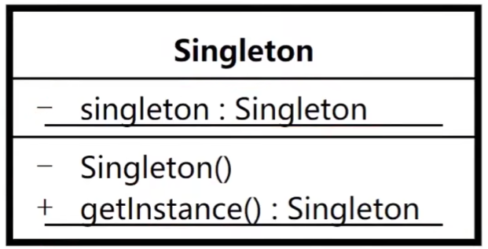

# 单例模式

## 介绍

- 单例模式（Singleton Pattern）是 Java 中最简单的设计模式之一。这种类型的设计模式属于创建型模式，它提供了一种创建对象的最佳方式。

- 这种模式涉及到一个单一的类，该类负责创建自己的对象，同时确保只有单个对象被创建。这个类提供了一种访问其唯一的对象的方式，可以直接访问，不需要实例化该类的对象。

### 单例模式的结构

单例模式的主要有以下角色：

- 单例类。只能创建一个实例的类
- 访问类。使用单例类

### 模式意图

- 保证一个类只有一个实例，并且提供一个全局访问点

### 场景

1. 需要更严格地控制全局变量时，使用单例模式。
2. 重量级的对象如线程池对象，数据库连接池对象/不需要多个实例的对象如工具类。



## 单例模式的实现

> 单例设计模式分类两种：
> 
> 饿汉式：类加载就会导致该单实例对象被创建 <br>
> 懒汉式：类加载不会导致该单实例对象被创建，而是首次使用该对象时才会创建

### 饿汉模式单例代码

```java
class HungrySingleton {
    private static HungrySingleton instance = new HungrySingleton();
    
    private HungrySingleton() {}
    
    public static HungrySingleton getInstance() {
        return instance;
    }
}
```

> 该方式在成员位置声明Singleton类型的静态变量，并创建Singleton类的对象instance。instance对象是随着类的加载而创建的。如果该对象足够大的话，而一直没有使用就会造成内存的浪费。

```java
class HungrySingleton {
    private static HungrySingleton instance;
    
    static {
        instance = new HungrySingleton();
    }
    
    private HungrySingleton() {}
    
    public static HungrySingleton getInstance() {
        return instance;
    }
}
```

> 该方式在成员位置声明Singleton类型的静态变量，而对象的创建是在静态代码块中，也是对着类的加载而创建。所以和饿汉式的方式1基本上一样，当然该方式也存在内存浪费问题。

### 懒汉模式单例代码

1. 懒汉式1

```java
class LazySingleton {
    private static LazySingleton instance;
    
    private LazySingleton() {}

    /**
     * 获取单例实例的静态方法
     * 采用双重检查锁定机制确保线程安全和性能优化
     *
     * @return Singleton 类的唯一实例对象
     */
    public static LazySingleton getInstance() {
        // 第一次检查：避免不必要的同步，提高性能
        if (instance == null) {
            // 使用类锁进行同步，确保线程安全
            synchronized (LazySingleton.class) {
                // 第二次检查：防止多个线程同时通过第一次检查时的重复创建
                if (instance == null) {
                    instance = new Singleton();
                }
            }
        }
        return instance;
    }
}
```

> 双重检查锁模式是一种非常好的单例实现模式，解决了单例、性能、线程安全问题，上面的双重检测锁模式看上去完美无缺，其实是存在问题，在多线程的情况下，可能会出现空指针问题，出现问题的原因是JVM在实例化对象的时候会进行优化和指令重排序操作。

2. 懒汉式2

> 要解决双重检查锁模式带来空指针异常的问题，只需要使用 `volatile` 关键字, `volatile` 关键字可以保证可见性和有序性。

```java
class LazySingleton {
    private static volatile LazySingleton instance;
    
    private LazySingleton() {}
    
    public static LazySingleton getInstance() {
        //第一次判断，如果instance不为null，不进入抢锁阶段，直接返回实际
        if (instance == null) {
            synchronized (LazySingleton.class) {
                //抢到锁之后再次判断是否为空
                if (instance == null) {
                    instance = new Singleton();
                }
            }
        }
    }
}
```

#### 关键要点

> **`volatile` 关键字的作用**  
> 解决双重检查锁定模式可能出现的空指针异常问题，保证：    
> - **可见性**：一个线程修改了 `volatile` 变量的值，新值对于其他线程立即可见        
> - **有序性**：禁止指令重排序，确保对象初始化完成后再返回引用

#### 潜在问题分析

**问题根源：** `instance = new LazySingleton()` 这行代码实际执行步骤：

1. 分配内存空间
2. 初始化对象
3. 将 `instance` 指向分配的内存地址

**风险场景：**
- 如果发生指令重排序（执行顺序变为 1→3→2）
- 另一个线程可能在步骤 3 完成后、步骤 2 完成前访问到未完全初始化的对象
- 导致获取到一个"半初始化"的实例，引发空指针异常

**解决方案：** 使用 `volatile` 关键字修饰 `instance` 变量，禁止指令重排序


3. 懒汉式3(静态内部类方式)

```java
class LazySingleton {
    private static LazySingleton instance;
    
    private LazySingleton() {}
    
    private static class SingletonHolder {
        private static final LazySingleton INSTANCE = new LazySingleton();
    }
    //对外提供静态方法获取该对象
    public static LazySingleton getInstance() {
        return SingletonHolder.INSTANCE;
    }
}
```

> 第一次加载 LazySingleton 类时不会去初始化 INSTANCE，只有第一次调用 getInstance，虚拟机加载 SingletonHolder <br>
> 并初始化 INSTANCE，这样不仅能确保线程安全，也能保证 LazySingleton 类的唯一性。

### 序列化、反序列方式破坏单例模式的解决方法

> 在Singleton类中添加`readResolve()`方法，在反序列化时被反射调用，如果定义了这个方法，就返回这个方法的值，如果没有定义，则返回新new出来的对象。

```java
public class Singleton implements Serializable {
    
    private static final long serialVersionUID = 1L;
    
    //私有构造方法
    private Singleton() {}

    private static class SingletonHolder {
        private static final Singleton INSTANCE = new Singleton();
    }

    //对外提供静态方法获取该对象
    public static Singleton getInstance() {
        return SingletonHolder.INSTANCE;
    }
    
    /**
     * 下面是为了解决序列化反序列化破解单例模式
     */
    private Object readResolve() {
        return SingletonHolder.INSTANCE;
    }
}
```
