# 第01章 JVM快速入门

## 1、什么是JVM

JVM：**J**ava **V**irtual **M**achine，Java虚拟机

JVM是**JRE**（Java Runtime Environment）的一部分，安装了JRE其实也就是相当于安装了JVM，可以运行Java程序了。

**位置：**JVM是运行在操作系统之上的，它与硬件没有直接的交互。

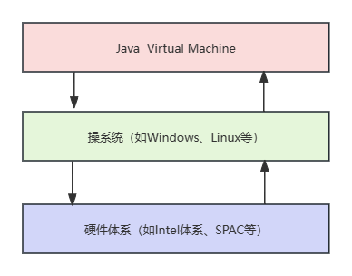

## 2、常见JVM

- JCP组织（Java Community Process 开放的国际组织 ）：Hotspot虚拟机（Open JDK版），sun2006年开源
- Oracle：Hotspot虚拟机（Oracle JDK版），闭源，允许个人使用，商用收费
- BEA：JRockit虚拟机
- IBM：J9虚拟机
- 阿里巴巴：Dragonwell JDK（龙井虚拟机），电商物流金融等领域，高性能要求。

## 3、结构图

**JVM的作用：**加载并执行Java字节码文件(.class) - 加载字节码文件、分配内存`（运行时数据区）`、运行程序

**JVM的特点：**一次编译到处运行、自动内存管理、自动垃圾回收


- 类加载器子系统：将字节码文件（.class）加载到内存中的方法区
- 运行时数据区：
    - 方法区：存储已被虚拟机加载的类的**元数据信息(元空间)**。也就是存储字节码信息。
    - 堆：**存放对象实例**，几乎所有的对象实例都在这里分配内存。
    - 虚拟机栈(java栈)：虚拟机栈描述的是**Java方法执行的内存模型**。每个方法被执行的时候都会创建一个**栈帧**（Stack Frame）用于存储局部变量表、操作数栈、动态链接、方法出口等信息
    - 程序计数器：当前线程所执行的字节码的**行号指示器**。
    - 本地方法栈：本地方法栈则是**记录**虚拟机当前使用到的**native方法**。

- 本地方法接口：虚拟机使用到的native类型的方法，负责调用操作系统类库。（例如Thread类中有很多Native方法的调用）
- 执行引擎：包含解释器、即时编译器和垃圾收集器 ，负责执行加载到JVM中的字节码指令。

**注意：**

- 多线程共享方法区和堆；
- Java栈、本地方法栈、程序计数器是每个线程私c有的。

## 4、执行引擎Execution Engine

**Execution Engine**执行引擎负责解释命令，提交操作系统执行。


JVM执行引擎通常由两个主要组成部分构成：解释器和即时编译器（Just-In-Time Compiler，JIT Compiler）。

1. 解释器：当Java字节码被加载到内存中时，解释器逐条解析和执行**字节码指令**。解释器逐条执行字节码，将每条指令转换为对应平台上的本地**机器指令**。由于解释器逐条解析执行，因此执行速度相对较慢。但解释器具有优点，即可立即执行字节码，无需等待编译过程。
2. 即时编译器（JIT Compiler）：为了提高执行速度，JVM还使用即时编译器。即时编译器将字节码动态地编译为本地机器码，以便直接在底层硬件上执行。即时编译器根据运行时的性能数据和优化技术，对经常执行的热点代码进行优化，从而提高程序的性能。即时编译器可以将经过优化的代码缓存起来，以便下次再次执行时直接使用。

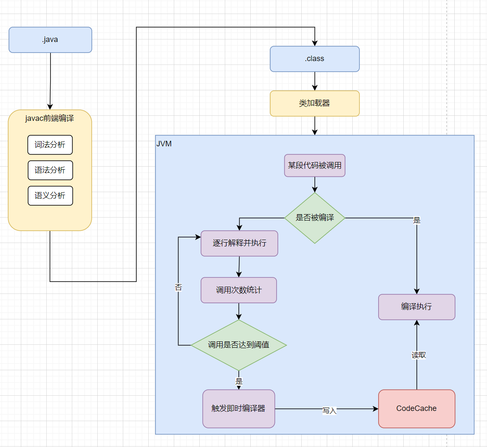

JVM执行引擎还包括其他一些重要的组件，如即时编译器后端、垃圾回收器、线程管理器等。这些组件共同协作，使得Java程序能够在不同的操作系统和硬件平台上运行，并且具备良好的性能。

## 5、本地方法接口Native Interface

本地接口的作用是融合不同的编程语言为 Java 所用，于是就在内存中专门开辟了一块区域处理标记为native的代码，它的具体做法是 Native Method Stack中登记 native方法，在Execution Engine 执行时加载native libraies。c

例如**Thread类**中有一些标记为native的方法：

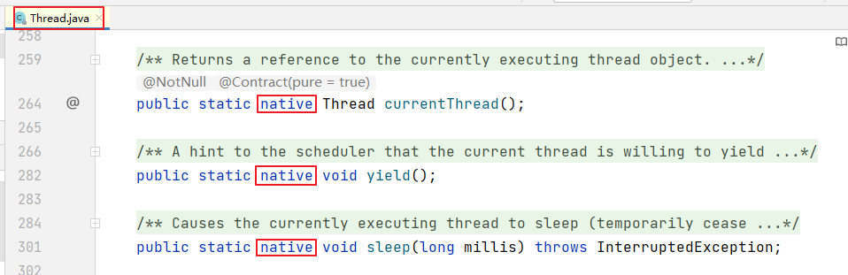

## 6、Native Method Stack

本地方法栈存储了从Java代码中调用本地方法时所需的信息。是**线程私有**的。

## 7、PC寄存器(程序计数器)

每个线程都有一个程序计数器，是**线程私有**的，就是一个指针，指向方法区中的方法字节码（用来存储指向下一条指令的地址，即 将要执行的指令代码），由执行引擎读取下一条指令，是一个非常小的内存空间，几乎可以忽略不记。

>  Java 虚拟机规范中这样定义：
>
> the `pc register` contains the address of the Java Virtual Machine instruction currently being executed.

# 第02章 类加载器ClassLoader

## 1、类加载器的作用

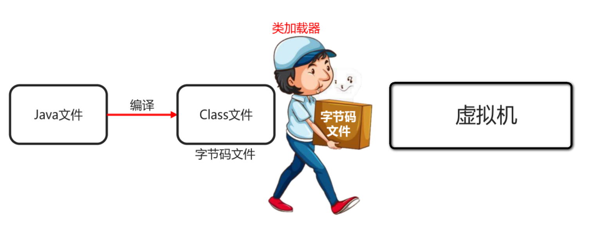

简单来说，类加载器的主要作用就是加载 Java 类的字节码（ `.class` 文件）到 JVM 中。

class文件在文件开头有的文件标识**（CA FE BA BE）**，并且ClassLoader只负责class文件的加载，至于它是否可以运行，则由Execution Engine决定。

## 2、类加载的过程

简单回顾一下类加载过程。

- 类加载过程：**加载->链接->初始化**。
- 链接过程又可分为三步：**验证->准备->解析**。

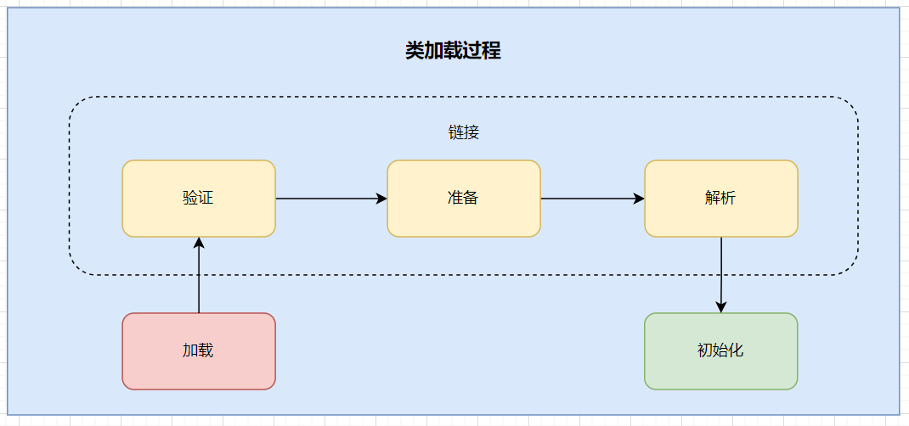

加载是类加载过程的第一步，主要完成下面 3 件事情：

1. 通过全类名获取定义此类的二进制字节流
2. 将字节流所代表的静态存储结构转换为方法区的运行时数据结构
3. 在内存中生成一个代表该类的 `Class` 对象，作为方法区这些数据的访问入口

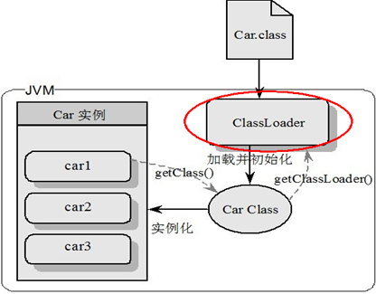

```java
public class ClassLoaderDemo1 {

    public static void main(String[] args) {

        Car car = new Car();
        Class<? extends Car> aClass = car.getClass(); //由对象得到类
        ClassLoader classLoader = aClass.getClassLoader(); //由类得到类加载器
        System.out.println(classLoader); //Car的类加载器是AppClassLoader
       
        
        //数组类不是通过 ClassLoader 创建的
        int[] arr = {1,2,3};
        System.out.println(arr.getClass().getClassLoader());
    }
}
```

从上面的介绍可以看出:

- 类加载器是一个负责加载类的对象，用于实现类加载过程中的加载这一步。
- 每个 Java 类都有一个引用指向加载它的 `ClassLoader`。
- 数组类不是通过 `ClassLoader` 创建的（数组类没有对应的二进制字节流），是由 JVM 直接生成的。

## 3、类加载器分类

分为四种，前三种为虚拟机自带的加载器。

- 启动类加载器（BootstrapClassLoader）：由C++实现。主要用来加载 JDK 内部的核心类库。
- 扩展类加载器（ExtClassLoader/PlatformClassLoader）：由Java实现，派生自ClassLoader类。主要用来加载 JDK 内部的扩展类库。
- 应用程序类加载器（AppClassLoader）：也叫系统类加载器。由Java实现，派生自ClassLoader类。面向我们用户的加载器，负责加载当前应用 classpath 下的所有 jar 包和类。

- 自定义加载器 ：程序员可以定制类的加载方式，以满足自己的特殊需求。派生自ClassLoader类。就比如说，我们可以对 Java 类的字节码（ `.class` 文件）进行加密，加载时再利用自定义的类加载器对其解密。

**Java 9之前的ClassLoader**

- Bootstrap ClassLoader加载$JAVA_HOME中jre/lib/rt.jar，加载JDK中的核心类库
- ExtClassLoader加载相对次要、但又通用的类，主要包括$JAVA_HOME中jre/lib/*.jar或-Djava.ext.dirs指定目录下的jar包

**Java 9及之后的ClassLoader**

- Bootstrap ClassLoader，使用了模块化设计，加载lib/modules启动时的基础模块类，java.base、java.management、java.xml

- ExtClassLoader更名为PlatformClassLoader，使用了模块化设计，加载lib/modules中平台相关模块，如java.scripting、java.compiler。

**查看类加载器的层级关系：**

```java
public class ClassLoaderDemo2 {

    public static void main(String[] args) {

        ClassLoaderDemo2 demo2 = new ClassLoaderDemo2();
        
        //AppClassLoader
        System.out.println(demo2.getClass().getClassLoader()); 
        System.out.println(ClassLoader.getSystemClassLoader());
        
        //PlatformClassLoader
        System.out.println(demo2.getClass().getClassLoader().getParent()); 
        
        //null(BootstrapClassLoader)
        System.out.println(demo2.getClass().getClassLoader().getParent().getParent()); 
        
        //null(BootstrapClassLoader)
        String s = new String();
        System.out.println(s.getClass().getClassLoader()); 
    }
}
```

**注意，**这里的父子关系并不是代码中的extends的关系，而是逻辑上的父子。

## 4、双亲委派模型

### 4.1、双亲委派模型

类加载器有很多种，当我们想要加载一个类的时候，具体是哪个类加载器加载呢？这就需要提到双亲委派模型了。


如果一个类加载器收到了类加载的请求，它首先不会自己去尝试加载这个类，**而是把请求委托给父加载器去完成，依次向上**：

- 1、当AppClassLoader加载一个class时，它首先不会自己去尝试加载这个类，而是把类加载请求委派给父类加载器PlatformClassLoader去完成。
- 2、当PlatformClassLoader加载一个class时，它首先也不会自己去尝试加载这个类，而是把类加载请求委派给父类加载器BootStrapClassLoader去完成。
- 3、如果BootStrapClassLoader加载失败，会用PlatformClassLoader来尝试加载；
- 4、若PlatformClassLoader也加载失败，则会使用AppClassLoader来加载
- 5、如果AppClassLoader也加载失败，则会报出异常ClassNotFoundException

其实这就是所谓的**双亲委派模型**。简单来说：如果一个类加载器收到了类加载的请求，它首先不会自己去尝试加载这个类，而是把**请求委托给父加载器去完成，依次向上**。

**目的：**

一，性能，避免重复加载；

二，安全性，避免核心类被修改。

### 4.2、双亲委派模型的源码分析

双亲委派模型的实现代码非常简单，逻辑非常清晰，都集中在 `java.lang.ClassLoader` 的 `loadClass()` 中，相关代码如下所示。

```java
protected Class<?> loadClass(String name, boolean resolve)
    throws ClassNotFoundException
{
    synchronized (getClassLoadingLock(name)) {
        //首先，检查该类是否已经加载过
        Class c = findLoadedClass(name);
        if (c == null) {
            //如果 c 为 null，则说明该类没有被加载过
            long t0 = System.nanoTime();
            try {
                if (parent != null) {
                    //当父类的加载器不为空，则通过父类的loadClass来加载该类
                    c = parent.loadClass(name, false);
                } else {
                    //当父类的加载器为空，则调用启动类加载器来加载该类
                    c = findBootstrapClassOrNull(name);
                }
            } catch (ClassNotFoundException e) {
                //非空父类的类加载器无法找到相应的类，则抛出异常
            }

            if (c == null) {
                //当父类加载器无法加载时，则调用findClass方法来加载该类
                //用户可通过覆写该方法，来自定义类加载器
                long t1 = System.nanoTime();
                c = findClass(name);

                //用于统计类加载器相关的信息
                sun.misc.PerfCounter.getParentDelegationTime().addTime(t1 - t0);
                sun.misc.PerfCounter.getFindClassTime().addElapsedTimeFrom(t1);
                sun.misc.PerfCounter.getFindClasses().increment();
            }
        }
        if (resolve) {
            //对类进行link操作
            resolveClass(c);
        }
        return c;
    }
}
```

### 4.3、总结双亲委派模型的执行流程

- 在类加载的时候，系统会首先判断当前类是否被加载过。已经被加载的类会直接返回，否则才会尝试加载（每个父类加载器都会走一遍这个流程）。
- 类加载器在进行类加载的时候，它首先不会自己去尝试加载这个类，而是把这个请求委派给父类加载器去完成（调用父加载器 `loadClass()`方法来加载类）。这样的话，所有的请求最终都会传送到顶层的启动类加载器 `BootstrapClassLoader` 中。
- 只有当父加载器反馈自己无法完成这个加载请求（它的搜索范围中没有找到所需的类）时，子加载器才会尝试自己去加载（调用自己的 `findClass()` 方法来加载类）。

### 4.4、打破双亲委派模型

**注意⚠️：**双亲委派模型并不是一种强制性的约束，只是 JDK 官方推荐的一种方式。如果我们因为某些特殊需求想要打破双亲委派模型，也是可以的

ClassLoader 类有两个关键的方法：

- `protected Class<?> loadClass(String name, boolean resolve)`：加载指定二进制名称的类，实现了双亲委派机制 。`name` 为类的二进制名称，`resove` 如果为 true，在加载时调用 `resolveClass(Class<?> c)` 方法解析该类。
- `protected Class findClass(String name)`：根据类的二进制名称来查找类，默认实现是空方法。

官方 API 文档中写到：

> Subclasses of `ClassLoader` are encouraged to override `findClass(String name)`, rather than this method.
>
> 建议 `ClassLoader`的子类重写 `findClass(String name)`方法而不是`loadClass(String name, boolean resolve)` 方法。

如果我们不想打破双亲委派模型，就重写 `ClassLoader` 类中的 `findClass()` 方法即可，无法被父类加载器加载的类最终会通过这个方法被加载。但是，如果想打破双亲委派模型则需要重写 `loadClass()` 方法。

# 第03章 方法区Method Area

## 1、方法区存储什么

方法区是被所有**线程共享**。《深入理解Java虚拟机》书中对方法区存储内容的**经典描述**如下：它用于存储已被虚拟机加载的类型信息、常量、静态变量、即时编译器编译后的代码缓存等：


## 2、方法区演进细节

**Hotspot中方法区的变化：**

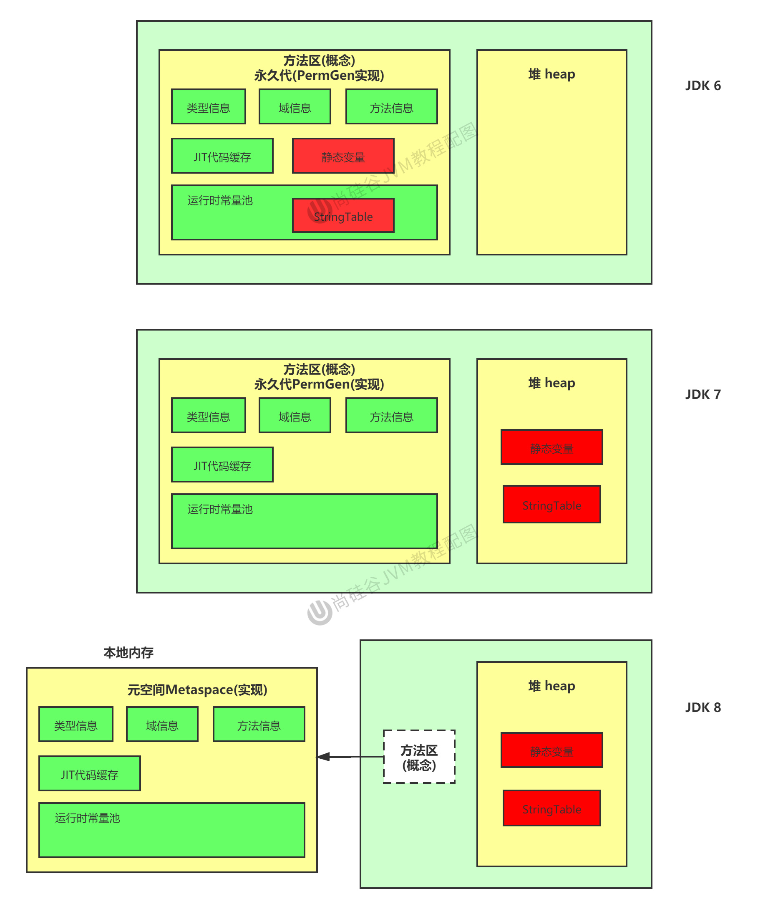

# 第04章 虚拟机栈stack

## 1、栈溢出

例如，如下代码：

```java
public class StackRecurrenceDemo {

    public static void main(String[] args) {
        StackRecurrenceDemo.test();
    }

    public static void test(){
        test();
    }
}
```

通常在**递归调用**时出现，

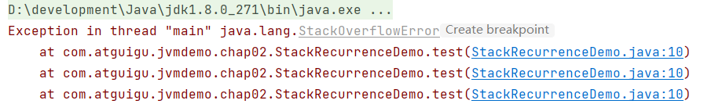

## 2、Stack 栈是什么？

- 栈也叫栈内存，主管Java程序的运行，是在线程创建时创建，每个线程都有自己的栈，它的生命周期是跟随线程的生命周期，线程结束栈内存也就释放，**是线程私有的**。
- 线程上正在执行的每个方法都各自对应一个**栈帧（Stack Frame）**。

## 3、栈运行原理

```java
public class StackDemo {

    public static void main(String[] args) {
        System.out.println("main()开始");
        StackDemo test = new StackDemo();
        test.method2();
        System.out.println("main()结束");
    }

    public void method2(){
        System.out.println("method2()执行...");
        this.method3();
        System.out.println("method2()结束...");
    }

    public void method3() {
        System.out.println("method3()执行...");
        this.method4();
        System.out.println("method3()结束...");
    }

    public void method4() {
        System.out.println("method4()执行...");
        System.out.println("method4()结束...");
    }
}
```

- JVM对Java栈的操作只有两个，就是对栈帧的**压栈和出栈**，遵循“先进后出”或者“后进先出”原则。
- 一个线程中只能由一个正在执行的方法（当前方法），因此对应只会有一个活动的**当前栈帧**。

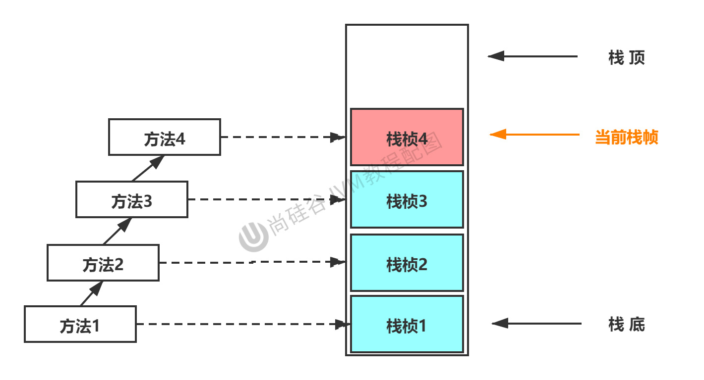

当一个方法1（main方法）被调用时就产生了一个栈帧1 并被压入到栈中，栈帧1位于栈底位置

方法1又调用了方法2，于是产生栈帧2 也被压入栈，

方法2又调用了方法3，于是产生栈帧3 也被压入栈，

……

执行完毕后，先弹出栈帧4，再弹出栈帧3，再弹出栈帧2，再弹出栈帧1，线程结束，栈释放。

## 4、栈存储什么?

栈中的数据都是以栈帧（Stack Frame）的格式存在。栈帧是一个内存区块，是一个数据集，包含方法执行过程中的各种数据信息。

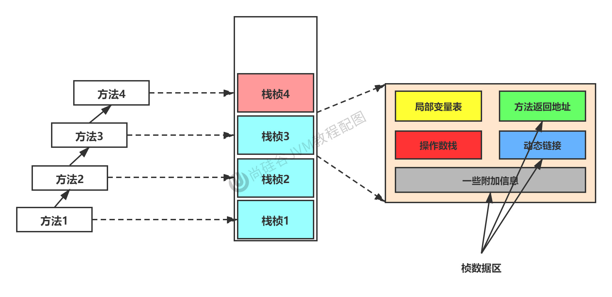

### 4.1、局部变量表（Local Variables）

也叫本地变量表。

**作用：**存储方法参数和方法体内的局部变量：8种基本类型变量、对象引用（reference）。

可以用如下方式查看字节码中一个方法内定义的的局部变量，当程序运行时，**这些局部变量会被加载到局部变量表中。**

```java
public class LocalVariableTableDemo {

    public static void main(String[] args) {
        int i = 100;
        String s = "hello";
        char c = 'c';
        Date date = new Date();
    }
}
```

查看局部变量：

- 可以使用javap命令：

```shell
类路径> javap -v 类名.class
```

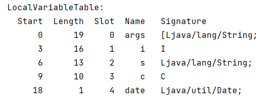

- 或者idea中的jclasslib插件：

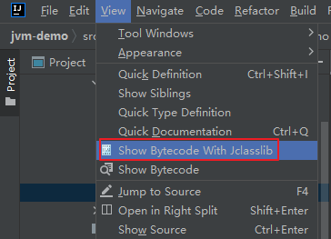

**注意：**以上方式看到的是加载到方法区中的字节码中的局部变量表，当程序运行时，局部变量表会被动态的加载到栈帧中的局部变量表中

### 4.2、操作数栈（Operand Stack）

**作用：**也是一个栈，在方法执行过程中根据字节码指令记录当前操作的数据，将它们入栈或出栈。用于保存计算过程的中间结果，同时作为计算过程中变量的临时存储空间。

```java
public class OperandStackDemo {

    public static void main(String[] args) {
        int i = 15;
        int j = 8;
        int k = i + j;
    }
}
```

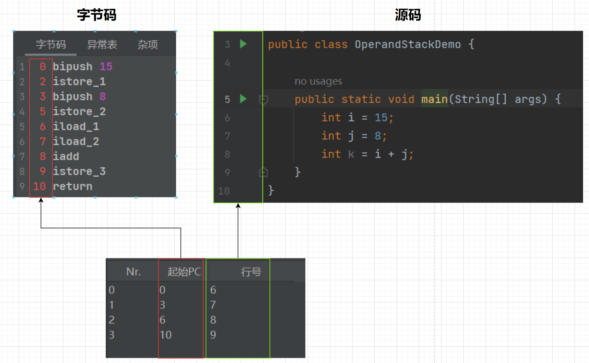

    0: bipush 15   		//一个8位带符号整数15压入栈,虚拟机将15当作byte类型处理
    2: istore_1			//将int类型值15存入局部变量1
    3: bipush 8    		//一个8位带符号整数8压入栈,虚拟机将8当作byte类型处理
    5: istore_2			//将int类型值8存入局部变量2
    6: iload_1			//从局部变量1中装载int类型值15入栈
    7: iload_2			//从局部变量2中装载int类型值8入栈
    8: iadd				//执行int类型的加法，将操作数栈中的数据出栈并相加，得到结果23，然后将23入栈
    9: istore_3			//将操作数栈中int类型值23存入局部变量3
    10: return			//返回

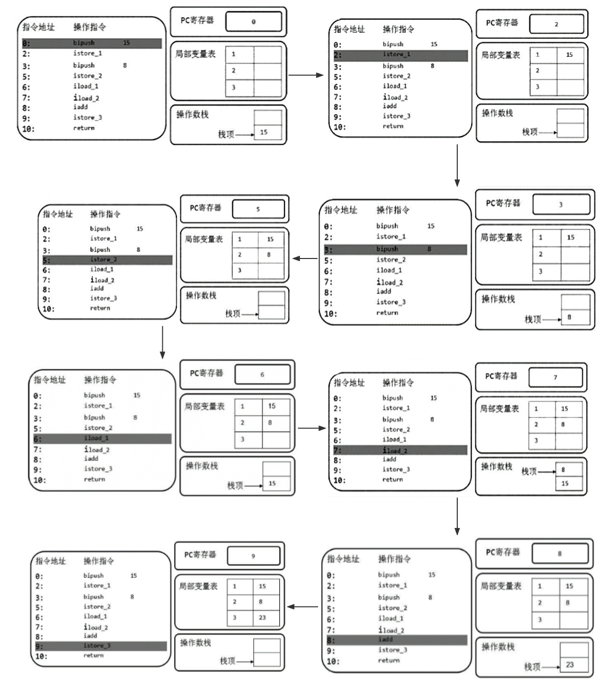

### 4.3、动态链接（Dynamic Linking）

**作用：**可以知道当前帧执行的是哪个方法。**指向运行时常量池中方法的符号引用。**程序真正执行时，类加载到内存中后，符号引用会换成直接引用。

```java
//编译以下代码，并查看字节码
public class DynamicLinkingDemo {

    public void methodA(){
        methodB(); //方法A引用方法B
    }

    public void methodB(){

    }
}
```

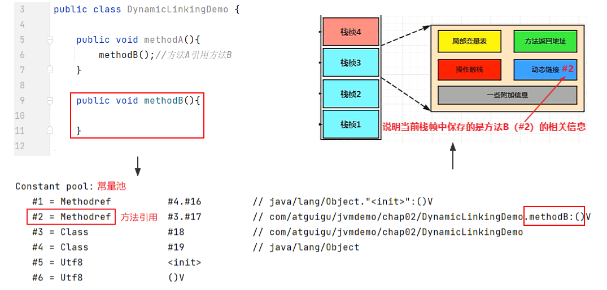

### 4.4、方法返回地址（Return Address）

**作用：**可以知道调用完当前方法后，上一层方法接着做什么，**即“return”到什么位置去**。存储当前方法调用完毕后下一条指令的地址。

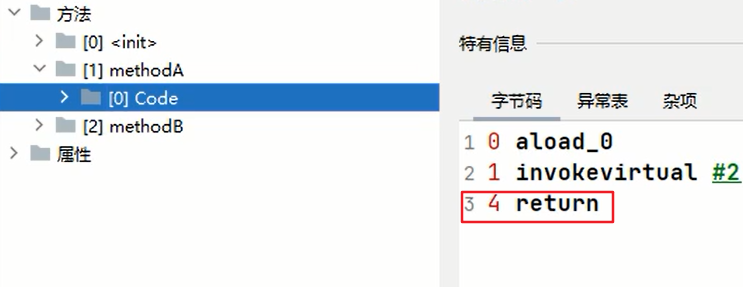

### 4.5、一些附加信息

栈帧中还允许携带与Java虚拟机实现相关的一些附加信息。

### 4.6、完整的内存结构图如下

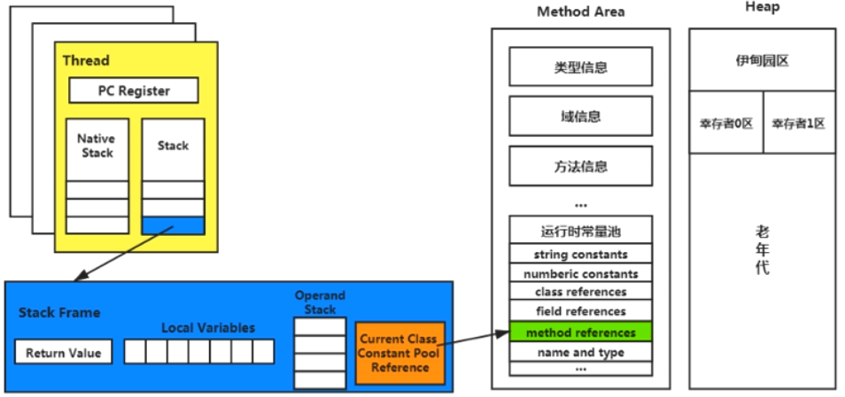

## 5、设置栈的大小

在StackRecurrenceDemo中添加count变量：

```java
public class StackRecurrenceDemo {

    private static long count = 0;
    public static void main(String[] args) {
        StackRecurrenceDemo.test();
    }

    public static void test(){
        System.out.println(count++);
        test();
    }
}
```

在idea中设置：

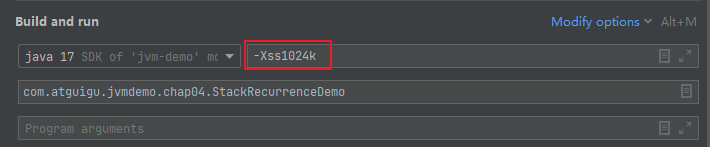

在命令行中设置：

```bash
java -Xss1m YourClassName
```

```bash
完整的写法是：-XX:ThreadStackSize=1m  

单位可以使用m、k、默认字节
-Xss1m  
-Xss1024k
-Xss1048576
```

# 第05章 堆heap

## 1、堆体系概述

### 1.1、堆、栈、方法区的关系

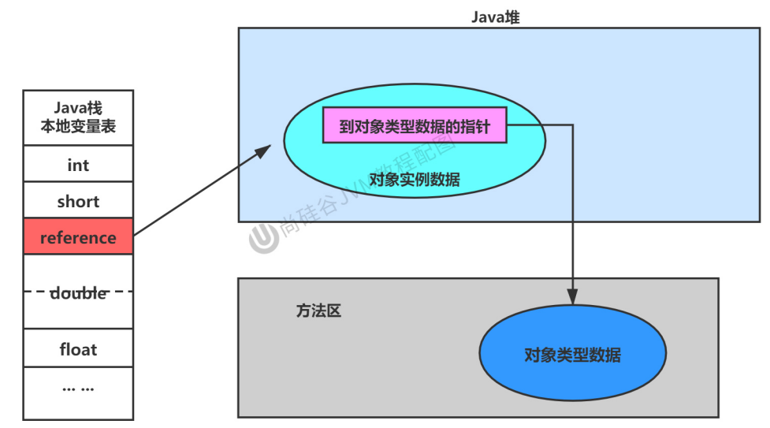

HotSpot是使用指针的方式来访问对象：

- 堆内存用于存放对象和数组
- 堆中会存放指向对象类型数据的地址
- 栈中会存放指向堆中的对象的地址

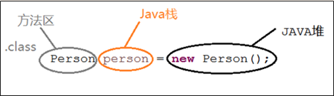

### 1.2、堆空间概述

- 一个Java程序运行起来对应一个进程，一个进程对应一个JVM实例，一个JVM实例中有一个运行时数据区。
- 堆是Java内存管理的核心区域，在JVM启动的时候被创建，并且一个JVM实例只存在一个堆内存，堆内存的大小是可以调节的。

### 1.3、分代空间

#### 1.3.1、堆空间划分

堆内存**逻辑**上分为三部分：

- Young Generation Space  				新生代/年轻代                    Young/New
- Tenured generation space  	       老年代/养老代                    Old/Tenured
- Permanent Space/Meta Space     永久代/元空间                    Permanent/Meta

新生代又划分为：

- 新生代又分为两部分： 伊甸园区（Eden space）和幸存者区（Survivor pace） 。
- 幸存者区有两个： 0区（Survivor 0 space）和1区（Survivor 1 space）。From区和To区。

堆内存内部空间所占比例：

- 新生代与老年代的默认比例： 1:2

- 伊甸园区与幸存者区的默认比例是：8:1:1

#### 1.3.2、JDK1.7及之前堆空间

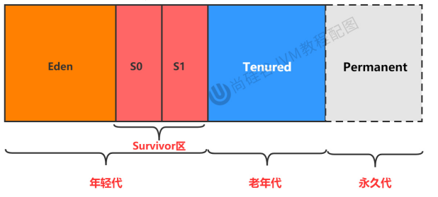

#### 1.3.3、JDK1.8及之后堆空间

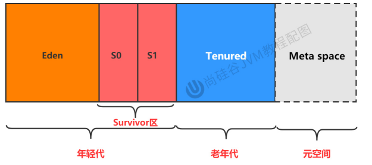

**注意：**方法区（具体的实现是永久代和元空间）逻辑上是堆空间的一部分，但是 虚拟机的实现中将方法区和堆分开了，如下图：

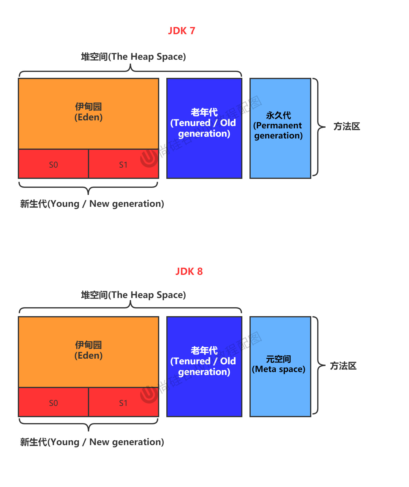

## 2、分代空间工作流程

存储在JVM中的Java对象可以被划分为两类：

- 一类是生命周期较短的对象，创建在新生代，在新生代中被垃圾回收。
- 一类是生命周期非常长的对象，创建在新生代，在老年代中被垃圾回收，甚至与JVM生命周期保持一致。
- 几乎所有的对象创建在伊甸园区，绝大部分对象销毁在新生代，大对象直接进入老年代。

### 2.1、新生代

**工作过程：**

（1）新创建的对象先放在伊甸园区。

（2）当伊甸园的空间用完时，程序又需要创建新对象，此时，触发JVM的垃圾回收器对伊甸园区进行垃圾回收（Minor GC，也叫Young GC），将伊甸园区中不再被引用的对象销毁。

（3）然后将伊甸园区的剩余对象移动到空的幸存0区。

（4）此时，伊甸园区清空。

（5）被移到幸存者0区的对象上有一个年龄计数器，值是1。

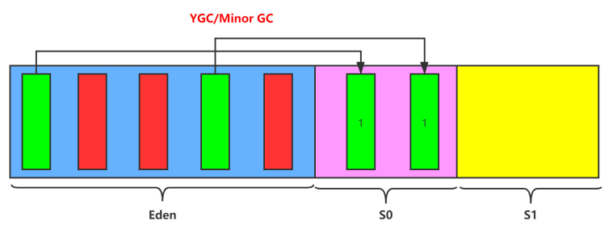

（6）然后再次将新对象放入伊甸园区。

（7）如果伊甸园区的空间再次用完，则再次触发垃圾回收，对伊甸园区和s0区进行垃圾回收，销毁不再引用的对象。

（8）此时s1区为空，然后将伊甸园区和s0区的剩余对象移动到空的s1区。

（9）此时，伊甸园区和s0区清空。

（10）从伊甸园区被移到s1区的对象上有一个年龄计数器，值是1。从s0区被移到s1区的对象上的年龄计数器+1，值是2。

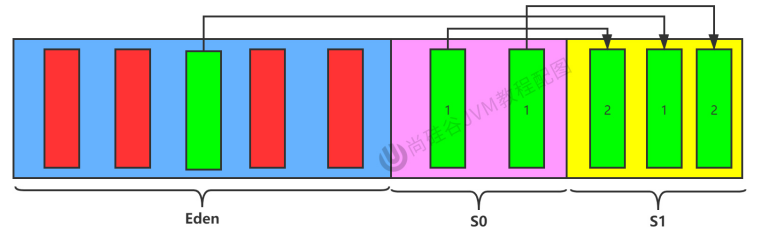

（11）然后再次将新对象放入伊甸园区。如果再次经历垃圾回收，那么伊甸园区和s1区的剩余对象移动到s0区。对象上的年龄计数器+1。

（12）当对象上的年龄计数器达到15时（**-XX:MaxTenuringThreshold**），则晋升到老年代。

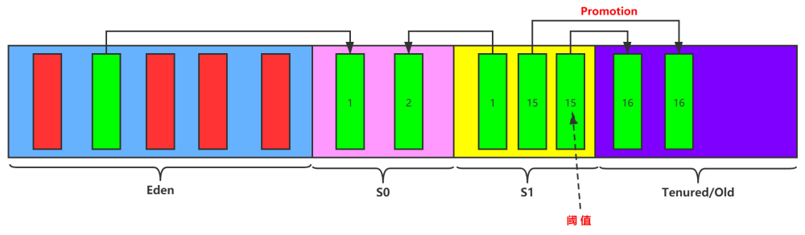

**总结：**

- 针对幸存者s0，s1，复制（复制算法）之后有交换，谁空谁是to

- 垃圾回收时，**伊甸园区和from区对象会被移动到to区**

### 2.2、老年代

经历**多次Minor GC/Young GC**仍然存在的对象（默认是15次）会被移入老年代，老年代的对象比较稳定，不会频繁的GC。

若老年代也满了，那么这个时候将**产生Major GC（同时触发Full GC）**，进行老年代的垃圾回收。

若老年代执行了Major GC之后发现依然无法进行对象的保存，就会**产生OOM异常OutOfMemoryError**。

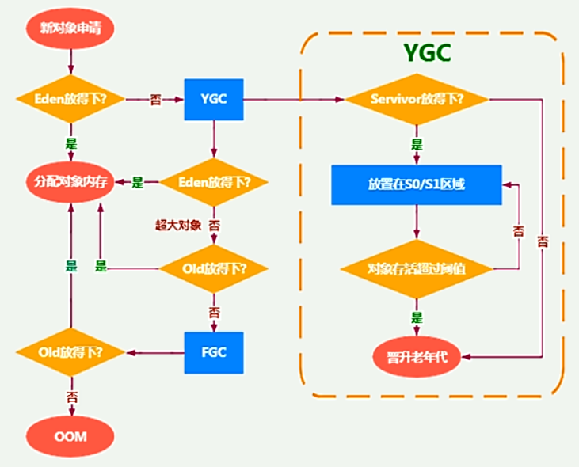

### 2.3、永久代/元空间

永久代是一个常驻内存区域，用于存放JDK自身所携带的 Class，Interface 的元数据，也就是说它存储的是运行环境必须的类信息，永久代的回收效率很低，在full gc的时候才会触发。而full gc是老年代的空间不足、永久代不足时才会触发。

如果出现 **java.lang.OutOfMemoryError:PermGen space**/**java.lang.OutOfMemoryError:Meta space**，说明是Java虚拟机对永久代内存设置不够。一般出现这种情况，都是程序启动需要加载大量的第三方jar包。例如：在一个Tomcat下部署了太多的应用。或者大量动态反射生成的类不断被加载，最终导致Perm区被占满。

尽管方法区在逻辑上属于堆的一部分，对于HotSpotJVM而言，**方法区还有一个别名叫做Non-Heap(非堆)**，目的就是要和堆分开。

对于HotSpot虚拟机，很多开发者习惯将方法区称之为永久代 ，但严格说两者不同，或者说是使用永久代来实现方法区而已。

### 2.4、GC总结

- 频繁回收新生代
- 很少回收老年代
- 几乎不在永久代/元空间回收

**部分收集：**

- 年轻代收集（Minor GC  /  Young GC）：伊甸园区 + 幸存者区垃圾收集
- 老年代收集（Major GC / Old GC）：老年代垃圾收集
- 混合收集（Mixed GC）：收集新生代以及老年代。G1垃圾收集器有这种方式

**整堆收集（Full GC）：**

- 新生代、老年代和方法区的垃圾收集

**年轻代GC触发机制（Minor GC ）：**

年轻代的Eden空间不足，触发Minor GC。

每次Minor GC在清理Eden的同时会清理Survivor From区。

Minor GC非常频繁，回收速度块。

**老年代GC触发机制（Major GC 和 Full GC ）：**

老年代空间不足，触发Major GC。

Major GC比Minor GC速度慢的多。

如果Major GC后，内存还不足，就报OOM。

**Full GC触发机制：**

Full GC（Full Garbage Collection）是Java虚拟机对堆内存中的所有对象进行全面回收的过程。Full GC的执行时机取决于Java虚拟机的实现和具体的垃圾回收策略。

一般情况下，Full GC发生的情况包括：

1. 当堆内存空间不足以分配新对象时，会触发一次Full GC。这种情况下，Java虚拟机会先执行一次新生代的垃圾回收（Minor GC），如果仍然无法满足内存需求，则会执行Full GC。
2. 在某些垃圾回收器中，当老年代空间不足以容纳晋升到老年代的对象时，会执行Full GC。这通常发生在长时间运行的应用程序中，随着对象的逐渐增加，老年代空间可能会变得不足。
3. 手动调用System.gc()方法或Runtime.getRuntime().gc()方法可以触发Full GC。但值得注意的是，这只是建议Java虚拟机进行垃圾回收的请求，并不能保证立即执行Full GC。

需要注意的是，Full GC是一项资源密集型的操作，会导致应用程序的停顿时间增加**（Stop The World - STW）**，因为在Full GC期间，应用程序的线程会被挂起。因此，在设计和开发应用程序时，应尽量避免频繁触发Full GC，以减少对应用程序性能的影响。

## 3、JVM结构总结

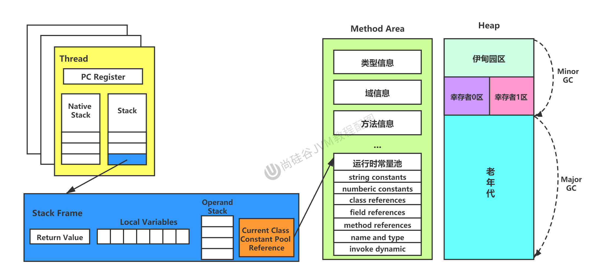

## 4、堆参数

### 4.1、查看堆内存大小

```java
/**
 * 查看堆内存大小
 */
public class HeapSpaceInitialDemo {
    public static void main(String[] args) {

        //返回Java虚拟机中的堆内存总量
        long initialMemory = Runtime.getRuntime().totalMemory() / 1024;
        //返回Java虚拟机试图使用的最大堆内存量
        long maxMemory = Runtime.getRuntime().maxMemory() / 1024;

        //起始内存
        System.out.println("-Xms : " + initialMemory + "K，" + initialMemory / 1024 + "M");
        //最大内存
        System.out.println("-Xmx : " + maxMemory + "K，" + maxMemory / 1024 + "M");
    }
}
```

- **-Xms**表示堆的起始内存，等价于-XX:InitialHeapSize，默认是物理电脑内存的1/64。
- **-Xmx**表示堆的最大内存，等价于-XX:MaxHeapSize，默认是物理电脑内存的1/4。

### 4.2、设置堆内存大小

- **-Xmn** 表示新生代堆大小，等价于-XX:NewSize，默认新生代占堆的**1/3空间**，老年代占堆的**2/3空间**。

使用下面的VM options参数启动HeapSpaceInitialDemo，

```shell
-Xms600m -Xmx600m -Xmn200m
```

**通常会将-Xms和-Xmx配置相同的值**，目的是为了在Java垃圾回收机制清理完堆区后，不需要重新分隔计算堆区的大小，从而提高性能。

### 4.3、OOM演示

**OOM异常：**

JVM启动时，为堆分配起始内存，当堆中数据超过-Xmx所指定的最大内存时，将会抛出**java.lang.OutOfMemoryError: Java heap space**  异常，此时说明Java虚拟机堆内存不够。

**原因有二：**

（1）Java虚拟机的**堆内存设置不够**，可以通过参数-Xms、-Xmx来调整。

（2）代码中创建了大量大对象，并且长时间**不能被垃圾收集器收集**（存在被引用）。

**OOM演示：**

```java
/**
 * -Xms30m -Xmx30m
 */
public class OOMDemo {

    public static void main(String[] args) throws InterruptedException {
        ArrayList<byte[]> list = new ArrayList<>();
        while(true){

            System.out.print("最大堆大小：Xmx=");
            System.out.println(Runtime.getRuntime().maxMemory() / 1024.0 / 1024 + "M");

            System.out.print("剩余堆大小：free mem=");
            System.out.println(Runtime.getRuntime().freeMemory() / 1024.0 / 1024 + "M");

            System.out.print("当前堆大小：total mem=");
            System.out.println(Runtime.getRuntime().totalMemory() / 1024.0 / 1024 + "M");

            list.add(new byte[1024*1024]);

            Thread.sleep(100);
        }
    }
}
```

## 5、Java VisualVM的使用

# 第06章 垃圾回收GC

## 1、内存管理

### 1.1、C/C++的内存管理

在C/C++这类没有自动垃圾回收机制的语言中，一个对象如果不再使用，需要手动释放，否则就会出现

内存泄漏。我们称这种释放对象的过程为垃圾回收，而需要程序员编写代码进行回收的方式为**手动回收**。

**内存泄漏**指的是不再使用的对象在系统中未被回收，内存泄漏的积累可能会导致**内存溢出**。

```c++
#include "Test.h"
init main(){
    while(true){
        Test* test = new Test();
        delete test; //手动回收内存
    }
    return 0;
}
```

### 1.2、Java的内存管理

Java中为了简化对象的释放，引入了自动的垃圾回收（**Garbage Collection简称GC**）机制。通过垃

圾回收器来对不再使用的对象完成自动的回收，垃圾回收器主要负责对**堆**上的内存进行回收。其他

很多现代语言比如C#、Python、Go都拥有自己的垃圾回收器。

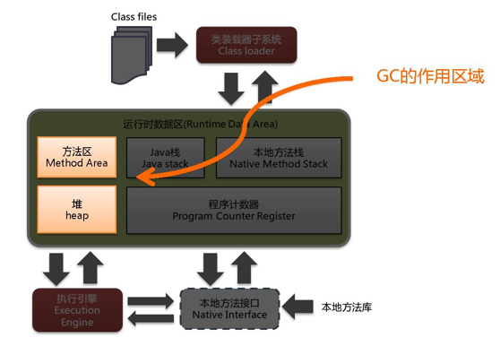

线程不共享的部分，都是伴随着线程的创建而创建，线程的销毁而销毁。因此线程不共享的程序计数器、虚拟机栈、本地方法栈中没有垃圾回收。

## 2、方法区的垃圾回收

### 2.1、类的生命周期

- 加载
- 连接
    - 验证：验证内容是否满足《Java虚拟机规范》
    - 准备：给静态变量赋初值
    - 解析：将常量池中的符号引用替换成指向内存的直接引用
- 初始化
- 使用
- **卸载：在方法区中的类是如何进行垃圾回收的**

### 2.2、方法区回收

方法区中能回收的内容主要就是不再使用的类。判定一个类可以被卸载。需要同时满足下面三个条件：

1、此类所有实例对象没有在任何地方被引用，在堆中不存在任何该类的实例对象以及子类对象。

```java
Car car = new Car();
car = null;
```

2、该类对应的 java.lang.Class 对象没有在任何地方被引用。

```
Car car = new Car(); 
Class<? extends Car> aClass = car.getClass(); 
car = null;
aClass = null;
```

3、加载该类的类加载器没有在任何地方被引用。

```java
Car car = new Car(); 
Class<? extends Car> aClass = car.getClass(); 
ClassLoader classLoader = aClass.getClassLoader();

car = null;
aClass = null;
classLoader = null;
```

**总结：**方法区的回收通常情况下很少发生，但是如果通过自定义类加载器加载特定的少数的类，那么可以在程序中释放自定义类加载器的引用，卸载当前类，当前对象置空，垃圾回收会对这部分内容进行回收

## 3、垃圾判定-对象已死？

**如何判断堆上的对象可以回收？**

Java中的对象是否能被回收，是根据对象是否被引用来决定的。如果对象被引用了，说明该对象还

在使用，不允许被回收。

```java
public class Demo {
	public static void main(String[]args){
		Demo demo = new Demo();
        demo = null;
        
       
        demo.f1();
    }
    
    public void f1(){
        Date d = new Date()
    }
}
```

特殊情况：循环引用的对象也可以被回收

```java
public class ReferenceCounting{
    public static void main(String[]args){
    	A a1 = new A();
    	B b1 = new B();
    	a1.b = b1;
    	b1.a = a1;
        
        a1 = null;
        b1 = null;
    }
}

class A{
	B b;
}

class B{
	A a;
}
```

**如何判断堆上的对象没有被引用？**

常见的有两种判断方法：引用计数法和可达性分析法。

### 3.1、引用计数法（Reference-Counting）

引用计数算法是通过判断对象的**引用数量**来决定对象是否可以被回收。

**基本思路：**

给对象中添加一个引用计数器，每当有一个地方引用它时，计数器值就加1；当引用失效时，计数器值就减1；

任何时刻计数器为0的对象就是不可能再被使用的。

**优点：**

- 简单，高效，现在的objective-c、python等用的就是这种算法。

**缺点：**

- 引用和去引用伴随着加减算法，影响性能

- 很难处理循环引用，相互引用的两个对象则无法释放。

**因此目前主流的Java虚拟机都摒弃掉了这种算法**。

### 3.2、可达性分析算法

实现简单，执行高效，解决引用计数算法中循环引用的问题，是Java和C#选择的算法。

**基本思路：**

可达性分析将对象分为两类：垃圾回收的根对象（GC Root）和普通对象，对象与对象之间存在引用关系

将一系列**GC Root**的集合作为起始点，按照从上至下的方式搜索所有能够被该合集引用到的对象（是否可达），并将其加入到该和集中，这个过程称之为标记（mark），被标记的对象是存活对象。 最终，未被探索到的对象便是死亡的，是可以回收的，标记为垃圾对象。

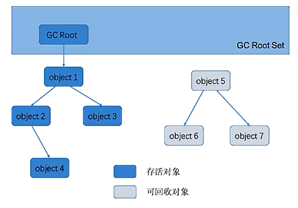

可以理解为没在`关系网中`的对象

在Java语言中，可以作为GC Root的对象包括下面几种：

1. 静态变量（Static Variables）：静态变量属于类，而不是实例对象。它们在整个程序执行期间都存在，并且被认为是 GC Root 对象。
2. 活动线程（Active Threads）：正在运行的线程也被视为 GC Root 对象。因为线程是程序执行的控制流，如果一个线程还在运行，那么它引用的对象也应该被保留。
3. 栈帧（Stack Frames）中的局部变量和输入参数：栈帧中的局部变量和输入参数也是 GC Root 对象。它们在方法调用期间创建，并且随着方法的结束而销毁。
4. JNI 引用（JNI References）：通过 Java Native Interface (JNI) 在 Java 代码和本地代码之间传递的对象也被视为 GC Root 对象。这些对象的生命周期由本地代码管理。

## 4、垃圾回收算法-清除已死对象

当成功区分出内存中存活对象和死亡对象后，GC接下来的任务就是执行垃圾回收。

在介绍JVM垃圾回收算法前，先介绍一个概念：**Stop-the-World：**

Stop-the-world意味着 JVM由于要执行GC而停止了应用程序的执行，并且这种情形会在任何一种GC算法中发生。

当Stop-the-world发生时，除了GC所需的线程以外，`所有线程都处于等待状态直到GC任务完成`。

事实上，`GC优化很多时候就是指减少Stop-the-world发生的时间，从而使系统具有高吞吐 、低停顿的特点。`

**吞吐量**

吞吐量指的是 CPU 用于执行用户代码的时间与 CPU 总执行时间的比值，即

吞吐量 = 执行用户代码时间 /（执行用户代码时间 + GC时间）。吞吐量数值越高，垃圾回收的效率就越高。

比如：虚拟机总共运行了 100 分钟，其中GC花掉 1 分钟，那么吞吐量就是 99%


### 4.1、标记清除（Mark-Sweep）

`标记-清除算法`是几种GC算法中最基础的算法，是因为后续的收集算法都是基于这种思路并对其不足进行改进而得到的。正如名字一样，算法分为**2个阶段**：

（1）**标记：**使用`可达性分析算法`，标记出可达对象。

（2）**清除：**对堆内存从头到尾进行线性便遍历，如果发现某个对象没有被标记为可达对象，则将其回收。

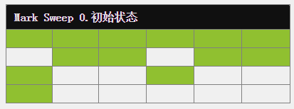

**缺点：**

- 效率问题（两次遍历）

- 空间问题（标记清除后会产生大量不连续的碎片。JVM就不得不维持一个`内存的空闲列表`，这又是一种开销。而且在分配数组对象的时候，寻找连续的内存空间会不太好找。）

### 4.2、复制算法（Copying）

**核心思想：**

1.将堆内存分割成两块From空间 To空间，对象分配阶段，创建对象。

2.GC阶段开始，将GC Root搬运到To空间

3.将GC Root关联的对象，搬运到To空间

4.清理From空间，并把名称互换

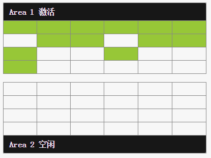

**优点：**

- 实现简单
- 不产生内存碎片

**缺点：**

- 将内存缩小为原来的一半，浪费了一半的内存空间，代价太高；如果不想浪费一半的空间，就需要有额外的空间进行分配担保，以应对被使用的内存中所有对象都100%存活的极端情况，所以在老年代一般不能直接选用这种算法。

- 如果对象的存活率很高，我们可以极端一点，假设是100%存活，那么我们需要将所有对象都复制一遍，并将所有引用地址重置一遍。复制这一工作所花费的时间，在对象存活率达到一定程度时，将会变的不可忽视。 所以从以上描述不难看出，复制算法要想使用，最起码对象的存活率要非常低才行，而且最重要的是，我们必须要克服50%内存的浪费。

**年轻代中使用的是Minor GC，这种GC算法采用的就是复制算法：**

HotSpot JVM把年轻代分为了三部分：1个Eden区和2个Survivor区（分别叫from和to）。一般情况下，新创建的对象都会被分配到Eden区。因为年轻代中的对象基本都是`朝生夕死的(90%以上)`，所以在年轻代的垃圾回收算法使用的是复制算法。

### 4.3、标记压缩（Mark-Compact）

**也叫标记整理算法。**

标记整理算法`是标记-清除法的一个改进版`。同样，在标记阶段，该算法也将所有对象标记为存活和死亡两种状态；不同的是，在第二个阶段，该算法并没有直接对死亡的对象进行清理，而是通过`所有存活对像都向一端移动，然后直接清除边界以外的内存`。


**优点：**

标记整理算法不仅可以弥补标记清除算法中，内存区域分散的缺点，也消除了复制算法当中，内存减半的高额代价。

**缺点：**

如果存活的对象过多，整理阶段将会执行较多复制操作，导致算法效率降低。

**老年代一般是由标记清除或者是标记清除与标记整理的混合实现。**

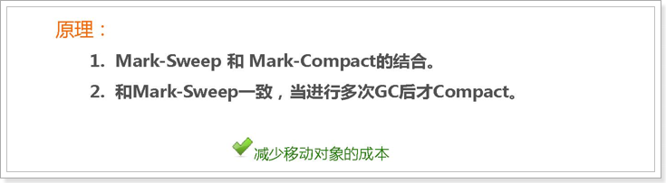

**难道就没有一种最优算法吗？**

回答：无，没有最好的算法，只有最合适的算法。==========>**分代收集算法**

### 4.4、分代收集算法（Generational-Collection）

**内存效率：**

复制算法 > 标记清除算法 > 标记整理算法（此处的效率只是简单的对比时间复杂度，实际情况不一定如此）。

**内存整齐度：**

复制算法 > 标记整理算法 > 标记清除算法。

**内存利用率：**

标记整理算法=标记清除算法>复制算法。

可以看出，效率上来说，`复制算法是当之无愧的老大，但是却浪费了太多内存`。

为了尽量兼顾上面所提到的三个指标，标记整理算法相对来说更平滑一些，但效率上依然不尽如人意。

比复制算法多了一个标记的阶段，又比标记清除多了一个整理内存的过程

`分代回收算法`实际上是`复制算法和标记整理法、标记清除的结合`，并不是真正一个新的算法。

一般分为`老年代（Old Generation）和年轻代（Young Generation）`

老年代就是很少垃圾需要进行回收的，年轻代就是有很多的内存空间需要回收，所以不同代就采用不同的回收算法，以此来达到高效的回收算法。

**年轻代（Young Gen）**

`年轻代特点是区域相对老年代较小，对像存活率低。`

这种情况`复制算法`的回收整理，速度是最快的。复制算法的效率只和当前存活对像大小有关，因而很适用于年轻代的回收。而复制算法内存利用率不高的问题，通过hotspot中的两个survivor的设计得到缓解。

**老年代（Tenure Gen）**

`老年代的特点是区域较大，对像存活率高。`

这种情况，存在大量存活率高的对像，复制算法明显变得不合适。一般是`由标记清除或者是标记清除与标记整理的混合实现`。

## 5、四种引用

创建一个User类：

```java
public class User {

    public User(int id, String name) {
        this.id = id;
        this.name = name;
    }

    public int id;
    public String name;

    @Override
    public String toString() {
        return "[id=" + id + ", name=" + name + "] ";
    }
}

```

### 5.1、强引用

**不回收**

只要强引用还存在，垃圾收集器永远不会回收掉被引用的对象。

```java
User user = new User(1, "zhangsan");
```

- 案例：

```java
public class StrongReferenceTest {

    public static void main(String[] args) {
        //定义强引用
        User user = new User(1, "zhangsan");
        //定义强引用
        User user1 = user;

        //设置user为null，User对象不会被回收，因为依然被user1引用
        user = null;

        //强制垃圾回收
        System.gc();

         try {
             TimeUnit.SECONDS.sleep(1);
         } catch (InterruptedException e) {
             throw new RuntimeException(e);
         }
        System.out.println(user1);
    }
}
```

### 5.2、软引用

**内存不足即回收**

`SoftReference` 类实现软引用。在系统要发生内存溢出`（OOM）`之前，才会将这些对象列进回收范围之中`进行二次回收`。如果这次回收还没有足够的内存，才会抛出内存溢出异常。`软引用可用来实现内存敏感的高速缓存`。

```java
SoftReference<User> userSoftRef = new SoftReference<>(new User(1, "zhangsan"));
```

- 案例：内存空间充足时，不会回收软引用的可达对象。注意测试环境设置为  **-Xms10m -Xmx10m**

```java
//-Xms10m -Xmx10m
public class SoftReferenceTest {

    public static void main(String[] args) {
        //创建对象，建立软引用
        SoftReference<User> userSoftRef = new SoftReference<>(new User(1, "zhangsan"));

        //上面的一行代码，等价于如下的三行代码
        //User u1 = new User(1,"zhangsan");
        //SoftReference<User> userSoftRef = new SoftReference<>(u1);
        //u1 = null;//如果之前定义了强引用，则需要取消强引用，否则后期userSoftRef无法回收

        //从软引用中获得强引用对象
        System.out.println(userSoftRef.get());

        //内存不足测试：让系统认为内存资源紧张
        //测试环境： -Xms10m -Xmx10m
        try {
            //默认新生代占堆的1/3空间，老年代占堆的2/3空间，因此7m的内容在哪个空间都放不下
            byte[] b = new byte[1024 * 1024 * 7]; //7M
        } catch (Throwable e) {
            e.printStackTrace();
        } finally {

            System.out.println("finally");

            //再次从软引用中获取数据
            //在报OOM之前，垃圾回收器会回收软引用的可达对象。
            System.out.println(userSoftRef.get());
        }
    }
}
```

### 5.3、弱引用

**发现即回收**

`WeakReference` 类实现弱引用。对象只能生存到下一次垃圾收集`（GC）`之前。在垃圾收集器工作时，无论内存是否足够都会回收掉只被弱引用关联的对象。

```java
WeakReference<User> userWeakRef = new WeakReference<>(new User(1, "zhangsan"));
```

- 案例：

```java
public class WeakReferenceTest {

    public static void main(String[] args) {
        //构造了弱引用
        WeakReference<User> userWeakRef = new WeakReference<>(new User(1, "zhangsan"));
        //从弱引用中重新获取对象
        System.out.println(userWeakRef.get());

        System.gc();
        
        try {
            TimeUnit.SECONDS.sleep(1);
        } catch (InterruptedException e) {
            throw new RuntimeException(e);
        }
        
        // 不管当前内存空间足够与否，都会回收它的内存
        System.out.println("After GC:");
        //重新尝试从弱引用中获取对象
        System.out.println(userWeakRef.get());
    }
}
```

### 5.4、虚引用

也叫幽灵引用、幻影引用

**对象回收跟踪**

`PhantomReference` 类实现虚引用。无法通过虚引用获取一个对象的实例，为一个对象设置虚引用关联的唯一目的就是能在这个对象被收集器回收时收到一个系统通知。它主要用于执行一些清理操作或监视对象的回收状态。

```java
ReferenceQueue phantomQueue = new ReferenceQueue();
PhantomReference<User> obj = new PhantomReference(new User(1, "tom"), phantomQueue);
```

- 案例：

```java
public class PhantomReferenceTest {

    public static void main(String[] args) {
        User obj = new User(1, "zhangsan");
        ReferenceQueue<Object> queue = new ReferenceQueue<>();
        PhantomReference<Object> phantomRef = new PhantomReference<>(obj, queue);

        obj = null; // 解除强引用

        // 在这里，对象可能已经被垃圾回收了，但我们无法通过虚引用获取它

        // 判断虚引用是否被回收
        boolean isCollected = false;
        while (!isCollected) {
            System.gc(); // 建议垃圾回收器执行回收操作
            try {
                Thread.sleep(1000); // 等待1秒钟
            } catch (InterruptedException e) {
                e.printStackTrace();
            }
            if (phantomRef.isEnqueued()) { //判断虚引用是否已经被回收。
                isCollected = true;
            }
        }

        // 输出虚引用是否被回收
        System.out.println("虚引用是否被回收：" + isCollected);
    }
}
```

在上面的示例中，我们创建了一个`PhantomReference`对象`phantomRef`，它引用了一个`User`实例`obj`。当我们解除`obj`的强引用后，`obj`将成为垃圾回收的候选对象。然后，我们通过调用`System.gc()`方法建议垃圾回收器执行回收操作，并等待一段时间以确保垃圾回收完成。最后，我们使用`isEnqueued()`方法判断虚引用是否已经被回收。

需要注意的是，由于垃圾回收操作的不确定性，虚引用的回收并不是立即发生的，所以程序中需要等待一段时间才能得出结论。另外，虚引用的主要作用是允许程序员在对象被回收之前进行一些清理操作，而不是直接获取对象的引用。

## 6、垃圾收集器

> 如果说收集算法是内存回收的方法论，垃圾收集器就是内存回收的具体实现

### 6.1、JVM中的默认垃圾收集器

查看JVM中默认的垃圾收集器

```bash
java -XX:+PrintCommandLineFlags -version
```

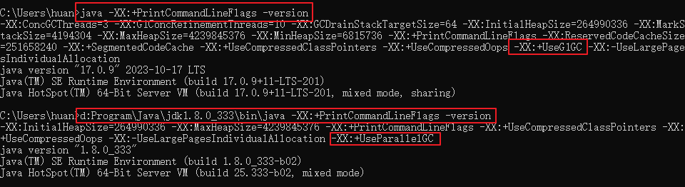

- JDK7：Parallel Scavenge + Serial Old
- JDK8 及 JDK 7U40之后的版本：Parallel Scavenge + Parallel Old
- JDK9+：G1

### 6.2、七款经典垃圾收集器

#### 垃圾收集器与分代关系


新生代收集器：Serial、ParNew、Parallel Scavenge

老年代收集器：Serial Old、Parallel Old、CMS

整堆收集器：G1

#### 垃圾回收器的组合


新生代GC和老年代GC搭配工作

- JDK9中Serial GC 不再能够和 CMS GC一起使用
- JDK9中ParNew GC 也不再和Serial Old GC 一起使用
- JDK14中Parallel Scavenge 和 Serial Old GC 一起使用被废弃
- JDK10中CMS GC被废弃
- Serial Old GC 是 CMS GC的替补 。

### 6.3、Serial/Serial Old收集器

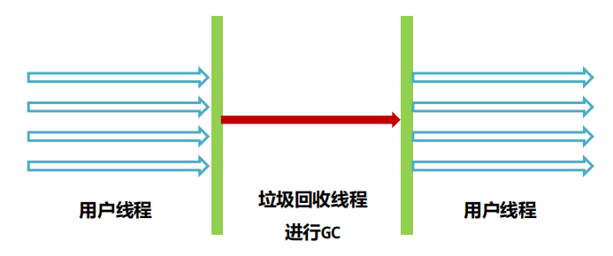

`串行收集器`是最古老、最稳定的收集器，垃圾收集的过程中会`Stop The World`，只使用`一个线程`去回收。

**工作过程：**

新生代（Serial）使用复制算法、老年代（Serial Old）使用标记整理算法

**参数控制：**

`-XX:+UseSerialGC` 串行收集器（单线程收集器）

### 6.3、ParNew 收集器

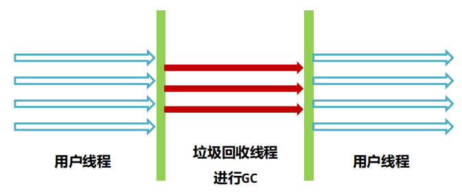

ParNew收集器收集器其实就是`Serial收集器的多线程版本`，除了使用多线程进行垃圾收集之外，其余行为包括Serial收集器可用的所有控制参数、收集算法、Stop The world、对象分配规则、回收策略等都与Serial收集器完全一样，实现上这两种收集器也共用了相当多的代码。

**工作过程：**

新生代并行，老年代串行；新生代使用复制算法、老年代使用标记整理算法。

**参数控制：**

`-XX:+UseParNewGC` ParNew收集器
`-XX:ParallelGCThreads` 限制线程数量

### 6.4、Parallel / Parallel Old 收集器

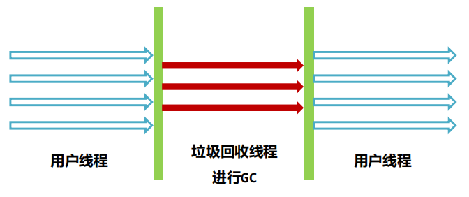

Parallel收集器类似ParNew收集器，Parallel收集器更关注系统的吞吐量。可以通过参数来打开自适应调节策略，虚拟机会根据当前系统的运行情况收集性能监控信息，动态调整这些参数以提供最合适的停顿时间或最大的吞吐量；也可以通过参数控制GC的时间不大于多少毫秒或者比例。

**工作过程：**

新生代使用复制算法、老年代使用标记整理算法。

**参数控制：**

`-XX:+UseParallelGC` 使用Parallel收集器

Parallel Old是Parallel Scavenge收集器的老年代版本，主要用于在多线程或多核处理器环境中并行地进行垃圾回收,使用标记整理算法。这个收集器是在JDK 1.6中才开始提供

**参数控制：**

`-XX:+UseParallelOldGC` 使用Parallel收集器+ 老年代并行

### 6.5、CMS收集器（老年代）

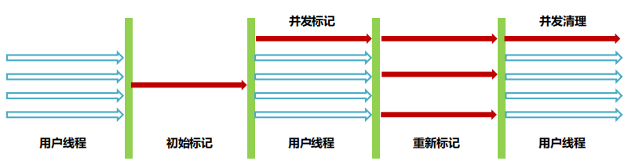

CMS（Concurrent Mark Sweep）收集器是一种以获取最短回收停顿时间为目标的收集器。目前很大一部分的Java应用都集中在互联网站或B/S系统的服务端上，这类应用尤其重视服务的响应速度，**希望系统停顿时间最短**，以给用户带来较好的体验。

从名字（包含“Mark Sweep”）上就可以看出CMS收集器是基于**“标记-清除”算法**实现的，它的运作过程相对于前面几种收集器来说要更复杂一些，整个过程分为4个步骤，包括：

- 初始标记（CMS initial mark）
- 并发标记（CMS concurrent mark）
- 重新标记（CMS remark）
- 并发清除（CMS concurrent sweep）

**其中初始标记、重新标记这两个步骤仍然需要“Stop The World”。**

- 初始标记仅仅只是标记一下GC Roots能**直接关联**到的对象，速度很快。
- 并发标记阶段就是进行GC Roots Tracing的过程，从CG Roots直接能关联到的对象开始遍历整个树对象，这个过程耗时长，但不需要停顿用户线程
- 而重新标记阶段则是为了修正并发标记期间，因用户程序继续运作而导致标记产生变动的那一部分对象的标记记录，这个阶段的停顿时间一般会比初始标记阶段稍长一些，但远比并发标记的时间短。
- 并发清理：此阶段清理删除掉标记阶段判断的已经死亡的对象，释放内存空间。由于不需要移动存活对象，这个阶段也可以与用户线程并发。

由于整个过程中耗时最长的并发标记和并发清除过程中，收集器线程都可以与用户线程一起工作，所以总体上来说，CMS收集器的内存回收过程是与用户线程一起并发地执行。老年代收集器（新生代使用ParNew）

**优点： **

并发收集、低停顿
**缺点：**

产生大量空间碎片、并发阶段会降低吞吐量

**参数控制：**

`-XX:+UseConcMarkSweepGC` 使用CMS收集器
`-XX:+UseCMSCompactAtFullCollection` Full GC后，进行一次碎片整理；整理过程是独占的，会引起停顿时间变长
`-XX:+CMSFullGCsBeforeCompaction` 设置进行几次Full GC后，进行一次碎片整理
`-XX:ParallelCMSThreads` 设定CMS的线程数量（一般情况约等于可用CPU数量）

CMS是一种**预处理垃圾回收器**，它不能等到old内存用尽时回收，需要在内存用尽前，完成回收操作，否则会导致并发回收失败。

### 6.6、G1收集器（区域化分代式）

G1是目前技术发展的最前沿成果之一，HotSpot开发团队赋予它的使命是未来可以替换掉JDK1.5中发布的CMS收集器。与CMS收集器相比G1收集器有以下特点：

1. 并行与并发：G1能充分利用CPU、**多核环境下**的硬件优势，使用多个CPU（CPU或者CPU核心）来缩短stop-The-World停顿时间。部分其他收集器原本需要停顿Java线程执行的GC动作，G1收集器仍然可以通过并发的方式让java程序继续执行。

2. **分代收集：**分代概念在G1中依然得以保留。虽然G1可以不需要其它收集器配合就能**独立管理整个GC堆**，但它能够采用不同的方式去处理新创建的对象和已经存活了一段时间、熬过多次GC的旧对象以获取更好的收集效果。**也就是说G1可以自己管理新生代和老年代了**。

3. 空间整合：由于G1使用了**独立区域**（Region）概念，G1从整体来看是基于“标记-整理”算法实现收集，从局部（两个Region）上来看是基于“复制”算法实现的，但无论如何，这两种算法都意味着G1运作期间不会产生内存空间碎片。

4. **可预测的停顿**：这是G1相对于CMS的另一大优势，降低停顿时间是G1和CMS共同的关注点，但G1除了追求低停顿外，还能建立可预测的停顿时间模型，能让使用这明确指定一个长度为**M毫秒的时间片段内**，消耗在**垃圾收集上的时间不得超过N毫秒**。

上面提到的垃圾收集器，收集的范围都是整个新生代或者老年代，而G1不再是这样。使用G1收集器时，Java堆的内存布局与其他收集器有很大差别，它将整个Java堆划分为多个大小相等的独立区域（Region），虽然还保留有新生代和老年代的概念，但新生代和老年代不再是物理隔阂了，它们都是一部分（可以不连续）Region的集合。

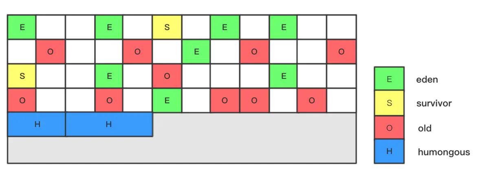

每个Region被标记了E、S、O和H，说明每个Region在运行时都充当了一种角色，其中H是以往算法中没有的，它代表Humongous，这表示这些Region存储的是**巨型对象（humongous object，H-obj）**，当新建对象大小超过Region大小一半时，直接在新的一个或多个连续Region中分配，并标记为H。

为了**避免全堆扫描**，G1使用了Remembered Set来管理相关的对象引用信息。当进行内存回收时，在GC根节点的枚举范围中加入**Remembered Set**即可保证不对全堆扫描也不会有遗漏了。

如果不计算维护Remembered Set的操作，G1收集器的运作大致可划分为以下几个步骤：

1、初始标记（Initial Making）

2、并发标记（Concurrent Marking）

3、最终标记（Final Marking）

4、筛选回收（Live Data Counting and Evacuation）

看上去跟CMS收集器的运作过程有几分相似，不过确实也这样。初始阶段仅仅只是标记一下GC Roots能**直接关联**到的对象，并且修改TAMS（Next Top Mark Start）的值，让下一阶段用户程序并发运行时，能在正确可以用的Region中创建新对象，**这个阶段需要停顿线程，但耗时很短**。并发标记阶段是从GC Roots开始对堆中对象进行可达性分析，找出存活对象，这一阶段耗时较长但能与用户线程并发运行。而最终标记阶段需要把Remembered Set Logs的数据合并到Remembered Set中，这阶段需要停顿线程，但可并行执行。最后筛选回收阶段首先对各个Region的**回收价值和成本进行排序**，根据用户所期望的GC停顿时间来**制定回收计划**，这一过程同样**是需要停顿线程的**，但Sun公司透露这个阶段其实也可以做到并发，但考虑到停顿线程将大幅度提高收集效率，所以选择停顿。下图为G1收集器运行示意图：

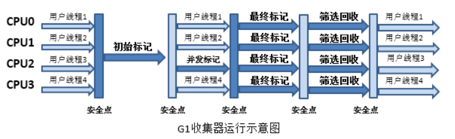

**整堆收集器**： G1

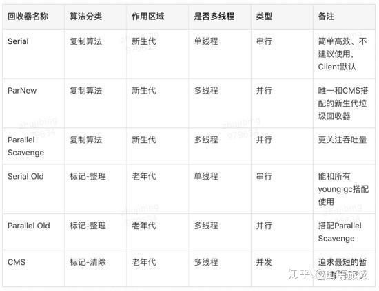

垃圾回收器选择策略 ：

- 客户端程序 ： Serial + Serial Old；
- **吞吐率优先**的服务端程序（比如：计算密集型） ： Parallel Scavenge + Parallel Old；
- **响应时间优先**的服务端程序 ：ParNew + CMS。
- G1收集器是基于标记整理算法实现的，不会产生空间碎片，可以精确地控制停顿，将堆划分为多个大小固定的独立区域，并跟踪这些区域的垃圾堆积程度，在后台维护一个优先列表，每次根据允许的收集时间，优先回收垃圾最多的区域（Garbage First）。

# 附录1：Java虚拟机规范

[Java Platform, Standard Edition Documentation - Releases (oracle.com)](https://docs.oracle.com/en/java/javase/index.html)

# 附录2：JVM参数配置参考

https://docs.oracle.com/javase/8/docs/technotes/tools/unix/java.html

