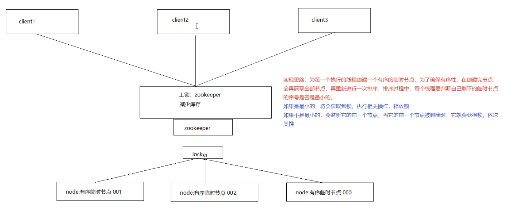

# Zookeeper 🐒

## 配置中心 🔧

- 应用启动时读取配置信息，进行初始化。传统的实现方式将配置存储在本地文件和内存中，一旦机器规模更大，配置变更频繁情况下，本地文件和内存方式的配置维护成本较高，使用zookeeper作为分布式的配置中心就可以解决这个问题。
- 我们将配置信息存在zk中的一个节点中，同时给该节点注册一个数据节点变更的watcher监听，一旦节点数据发生变更，所有的订阅该节点的客户端都可以获取数据变更通知。

## 负载均衡 🔄

- 建立server节点，并建立监听器监视servers子节点的状态（用于在服务器增添时及时同步当前集群中服务器列表）。在每个服务器启动时，在servers节点下建立具体服务器地址的子节点,并在对应的字节点下存入服务器的相关信息。这样，我们在zookeeper服务器上可以获取当前集群中的服务器列表及相关信息，可以自定义一个负载均衡算法，在每个请求过来时从zookeeper服务器中获取当前集群服务器列表，根据算法选出其中一个服务器来处理请求。


## 命名服务 🏷️

- 命名服务是分布式系统中的基本功能之一。被命名的实体通常可以是集群中的机器、提供的服务地址或者远程对象，这些都可以称作为名字。常见的就是一些分布式服务框架（RPC、RMI）中的服务地址列表，通过使用名称服务客户端可以获取资源的实体、服务地址和提供者信息。命名服务就是通过一个资源引用的方式来实现对资源的定位和使用。在分布式环境中，上层应用仅仅需要一个全局唯一名称，就像数据库中的主键。
- 在单库单表系统中可以通过自增ID来标识每一条记录，但是随着规模变大分库分表很常见，那么自增ID有仅能针对单一表生成ID，所以在这种情况下无法依靠这个来标识唯一ID。UUID就是一种全局唯一标识符。但是长度过长不易识别。


- 在Zookeeper中通过创建顺序节点就可以实现，所有客户端都会根据自己的任务类型来创建一个顺序节点，例如 job-00000001
- 节点创建完毕后，create()接口会返回一个完整的节点名，例如：job-00000002
  - 拼接type类型和完整节点名作为全局唯一的ID

## DNS服务 🌐

### 域名配置

- 在分布式系统应用中，每一个应用都需要分配一个域名，日常开发中，往往使用本地HOST绑定域名解析，开发阶段可以随时修改域名和IP的映射，大大提高开发的调试效率。如果应用的机器规模达到一定程度后，需要频繁更新域名时，需要在规模的集群中变更，无法保证实时性。所有我们在zk上创建一个节点来进行域名配置


### 域名解析

- 应用解析时，首先从zk域名节点中获取域名映射的IP和端口。

### 域名变更

- 每个应用都会在在对应的域名节点注册一个数据变更的watcher监听，一旦监听的域名节点数据变更，zk会向所有订阅的客户端发送域名变更通知。

## 集群管理 👥

- 随着分布式系统规模日益扩大，集群中机器的数量越来越多。有效的集群管理越来越重要了，zookeeper集群管理主要利用了watcher机制和创建临时节点来实现。以机器上下线和机器监控为例：

### 机器上下线

- 新增机器的时候，将Agent部署到新增的机器上，当Agent部署启动时，会向zookeeper指定的节点下创建一个临时子节点，当Agent在zk上创建完这个临时节点后，当关注的节点zookeeper/machines下的子节点新加入新的节点时或删除都会发送通知，这样就对机器的上下线进行监控。


### 机器监控

- 在机器运行过程中，Agent会定时将主机的的运行状态信息写入到/machines/hostn主机节点，监控中心通过订阅这些节点的数据变化来获取主机的运行信息。

## 分布式锁 🔒

### 数据库实现分布式锁

1. 创建一张锁表

```sql
CREATE TABLE `lock_record` (
  `id` bigint(20) NOT NULL AUTO_INCREMENT COMMENT '主键',
  `lock_name` varchar(64) NOT NULL COMMENT '锁名称',
  PRIMARY KEY (`id`),
  UNIQUE KEY `uk_lock_name` (`lock_name`)
) ENGINE=InnoDB AUTO_INCREMENT=38 DEFAULT CHARSET=utf8mb4 COLLT=utf8mb4_unicode_ci;
```


2. 定义锁，实现Lock接口，tryLock()尝试获取锁，从锁表中查询指定的锁记录，如果查询到记录，说明已经上锁，不能再上锁

```java
@Override
public boolean tryLock() {
    Example example = new Example(LockRecord.class);
    example.createCriteria().andEqualTo("lockName", LOCK_NAME);
    LockRecord lockRecord = lockRecordMapper.selectOneByExample(example);
    if (lockRecord == null) {
        return true;
    }
    return false;
}
```


3. 在lock方法获取锁之前先调用tryLock()方法尝试获取锁，如果未加锁则向锁表中插入一条锁记录来获取锁，这里我们通过循环，如果上锁我们一致等待锁的释放

```java
public void lock() {
    while (true) {
        if (tryLock()) {
            LockRecord lockRecord = new LockRecord();
            lockRecord.setLockName(LOCK_NAME);
            lockRecordMapper.insert(lockRecord);
            return;
        } else {
            System.out.println("等待锁......");
        }
    }
}
```


4. 释放锁，即是将数据库中对应的锁表记录删除

```java
public void unlock() {
    Example example = new Example(LockRecord.class);
    example.createCriteria().andEqualTo("lockName", LOCK_NAME);
    lockRecordMapper.deleteByExample(example);
}
```


> 注意在尝试获取锁的方法tryLock中，存在多个线程同时获取锁的情况，可以简单通过synchronized解决

### Redis实现分布式锁 💾

- redis分布式锁的实现基于setnx（set if not exists），设置成功，返回1；设置失败，返回0，释放锁的操作通过del指令来完成
- 如果设置锁后在执行中间过程时，程序抛出异常，导致del指令没有调用，锁永远无法释放，这样就会陷入死锁。所以我们拿到锁之后会给锁加上一个过期时间，这样即使中间出现异常，过期时间到后会自动释放锁。
- 同时在setnx 和 expire 如果进程挂掉，expire不能执行也会死锁。所以要保证setnx和expire是一个原子性操作即可。redis 2.8之后推出了setnx和expire的组合指令

  ```redis
  set key value ex 5 nx
  ```


#### Redis实现分布式锁注意的事项

1. lock获取锁方法

```java
while (true) {
    // 注意版本
    Boolean f = redisTemplate.opsForValue().setIfAbsent(LOCK_KEY_NAME, LOCK_NAME, 10, TimeUnit.SECONDS);
    if (f) {
        return;
    } else {
        System.out.println("等待锁......");
    }
}
```


2. 释放锁

```java
    redisTemplate.delete(LOCK_KEY_NAME);
```


> redis实现分布式锁存在的问题，为了解决redis单点问题，我们会部署redis集群，在 Sentinel 集群中，主节点突然挂掉了。同时主节点中有把锁还没有来得及同步到从节点。这样就会导致系统中同样一把锁被两个客户端同时持有，不安全性由此产生。redis官方为了解决这个问题，推出了Redlock 算法解决这个问题。但是带来的网络消耗较大。

#### 分布式锁的 Redisson 实现

1. 添加依赖

```xml
    <dependency>
      <groupId>org.redisson</groupId>
      <artifactId>redisson</artifactId>
      <version>3.6.5</version>
    </dependency>
```


2. 获取锁释放锁

```java
    Config config = new Config();
    config.useSingleServer()
          .setAddress("redis://127.0.0.1:6379")
          .setDatabase(0);
    Redisson redisson = (Redisson) Redisson.create(config);
    RLock mylock = redisson.getLock(key); //获取锁
    mylock.lock();
    // 资源操作...
    mylock.unlock();
```


### Zookeeper实现分布式锁 🧩

- 原理：有序临时节点 + watch 监听



1. 创建锁节点

```java
public class ZkLock implements Lock {
  // zk客户端
  private ZooKeeper zk;
  // zk是一个目录结构，root为最外层目录
  private String root = "/locks";
  // 锁的名称
  private String lockName;
  // 当前线程创建的序列node
  private ThreadLocal<String> nodeId = new ThreadLocal<>();
  // 用来同步等待zkclient链接到了服务端
  private CountDownLatch connectedSignal = new CountDownLatch(1);
  private final static int sessionTimeout = 3000;
  private final static byte[] data = new byte[0];

  public ZkLock(String config, String lockName) {
    this.lockName = lockName;
    try {
      zk = new ZooKeeper(config, sessionTimeout, new Watcher() {
        @Override
        public void process(WatchedEvent event) {
          if (event.getState() == Event.KeeperState.SyncConnected) {
            // 注册 Watcher 监听器，当连接建立成功时触发 CountDownLatch 计数减一
            connectedSignal.countDown();
          }
        }
      });
      // 阻塞当前线程，直到 ZooKeeper 客户端连接到服务器确保后续操作在连接建立后执行
      connectedSignal.await();
      Stat stat = zk.exists(root, false);
      if (null == stat) {
        // 创建根节点
        // 使用 OPEN_ACL_UNSAFE 表示无限制访问权限
        zk.create(root, data, ZooDefs.Ids.OPEN_ACL_UNSAFE, CreateMode.PERSISTENT);
      }
    } catch (Exception e) {
      throw new RuntimeException(e);
    }
  }
}
```


2. 添加watch监听临时顺序节点的删除

```java
class LockWatcher implements Watcher {
    private CountDownLatch latch = null;
    
    public LockWatcher(CountDownLatch latch) {
        this.latch = latch;
    }
    
    @Override
    public void process(WatchedEvent event) {
        if (event.getType() == Event.EventType.NodeDeleted) {
            latch.countDown();
        }
    }
}
```


3. 获取锁操作

```java
@Override
public void lock() {
    try {
        // CreateMode.EPHEMERAL_SEQUENTIAL：临时顺序节点
        zk.create(root + "/" + lockName, data, ZooDefs.Ids.OPEN_ACL_UNSAFE, CreateMode.EPHEMERAL_SEQUENTIAL);
        System.out.println(Thread.currentThread().getName() + myNode + " created");
    
        // 取出所有子节点
        List<String> subNodes = zk.getChildren(root, false);
        TreeSet<String> sortedNodes = new TreeSet<>();
        for (String node : subNodes) {
          sortedNodes.add(root + "/" + node);
        }
        String smallNode = sortedNodes.first();
        String preNode = sortedNodes.lower(myNode);
    
        if (myNode.equals(smallNode)) {
          // 如果是最小的节点,则表示取得锁
          System.out.println(Thread.currentThread().getName() + myNode + " get lock");
          this.nodeId.set(myNode);
          return;
        }
    
        CountDownLatch latch = new CountDownLatch(1);
        Stat stat = zk.exists(preNode, new LockWatcher(latch));// 同时注册监听。
    
        // 判断比自己小一个数的节点是否存在,如果不存在则无需等待锁,同时注册监听
        if (stat != null) {
          System.out.println(Thread.currentThread().getName() + myNode +
                  " waiting for " + root + "/" + preNode + " released lock");
          latch.await();// 等待，这里应该一直等待其他线程释放锁
          nodeId.set(myNode);
          latch = null;
        }
    } catch (Exception e) {
        throw new RuntimeException(e);
    }
}
```


4. 释放锁

```java
public void unlock() {
    try {
        System.out.println(Thread.currentThread().getName() + " unlock ");
        if (null != nodeId) {
            zk.delete(nodeId.get(), -1);
        }
        nodeId.remove();
    } catch (InterruptedException e) {
        e.printStackTrace();
    } catch (KeeperException e) {
        e.printStackTrace();
    }
}

```


### 基于 Curator 实现分布式锁 🧪

1. 添加依赖

```xml
    <dependency>
        <groupId>org.apache.curator</groupId>
        <artifactId>curator-recipes</artifactId>
        <version>4.0.0</version>
    </dependency>
```


2. 锁操作

```java
    // 创建zookeeper的客户端
    RetryPolicy retryPolicy = new ExponentialBackoffRetry(1000, 3);
    // 集群通过，分割
    CuratorFramework client = CuratorFrameworkFactory.newClient("127.0.0.1:2181", retryPolicy);
    client.start();
    
    // 创建分布式锁, 锁空间的根节点路径为/curator/lock
    InterProcessMutex mutex = new InterProcessMutex(client, "/curator/lock");
    mutex.acquire(); // 获得了锁, 进行业务流程
    // ......
    // 完成业务流程, 释放锁
    mutex.release();
    
    // 关闭客户端
    client.close();
```


## 分布式队列 📝

- 队列特性：FIFO（先入先出），zookeeper实现分布式队列的步骤：

- 在队列节点下创建临时顺序节点 例如/queue_info/192.168.1.1-0000001
- 调用getChildren()接口来获取/queue_info节点下所有子节点，获取队列中所有元素
- 比较自己节点是否是序号最小的节点，如果不是，则等待其他节点出队列，在序号最小的节点注册 watcher
- 获取watcher通知后，重复步骤


