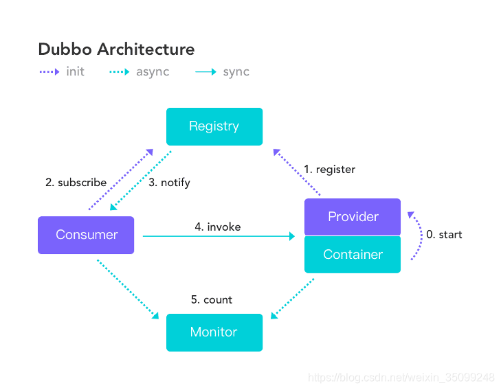

# 🚀 Dubbo

## 📡 RPC 核心概念

- **RPC**（Remote Procedure Call）— **远程过程调用**，它是一种通过 **网络** 从远程计算机程序上请求服务，而不需要了解底层网络技术的协议
- 在面向对象的编程语言中，远程过程调用即是 **远程方法调用**
- **核心优势**：屏蔽网络通信细节，让调用远程服务像调用本地方法一样简单


### 💫 Dubbo 概念

- Dubbo是阿里巴巴公司开源的一个**高性能、轻量级**的 Java RPC 框架
- 致力于提供**高性能**和**透明化**的 RPC 远程服务调用方案，以及 SOA 服务治理方案
- 官网：http://dubbo.apache.org
- **发展历史**：2011年开源，2014年停止维护，2018年捐献给 Apache 软件基金会

### 🏗️ Dubbo 架构



| 角色 | 说明 |
|------|------|
| **Provider** | 😎 暴露服务的服务提供方 |
| **Container** | 📦 服务运行容器 |
| **Consumer** | 👤 调用远程服务的服务消费方 |
| **Registry** | 🏛️ 服务注册与发现的注册中心 |
| **Monitor** | 📊 统计服务的调用次数和调用时间的监控中心 |

### 🚀 Dubbo 快速入门

- 创建服务提供者**Provider**模块
- 创建服务消费者**Consumer**模块
- 在服务提供者模块编写 [UserServiceImpl](file:///E:%5CUsers%5C32147%5CDocuments%5CObsidian%20Vault%5CJava-Stack%5Cweb%E5%90%8E%E7%AB%AF%5C%E4%B8%AD%E9%97%B4%E4%BB%B6%5C13.Dubbo%5C01.Dubbo.md#L51) 提供服务
- 在服务消费者中的 [UserController](file:///E:%5CUsers%5C32147%5CDocuments%5CObsidian%20Vault%5CJava-Stack%5Cweb%E5%90%8E%E7%AB%AF%5C%E4%B8%AD%E9%97%B4%E4%BB%B6%5C13.Dubbo%5C01.Dubbo.md#L71) 远程调用[UserServiceImpl](file:///E:%5CUsers%5C32147%5CDocuments%5CObsidian%20Vault%5CJava-Stack%5Cweb%E5%90%8E%E7%AB%AF%5C%E4%B8%AD%E9%97%B4%E4%BB%B6%5C13.Dubbo%5C01.Dubbo.md#L51) 提供的服务

## 🔄 SpringBoot 项目整合 Dubbo

### 🏗️ 创建服务提供者 Provider 模块

#### 1. 引入依赖

```xml
<dependencies>
    <dependency>
        <groupId>org.apache.dubbo</groupId>
        <artifactId>dubbo-dependencies-zookeeper</artifactId>
        <version>2.7.4.1</version>
        <type>pom</type>
        <exclusions>
            <exclusion>
                <groupId>org.slf4j</groupId>
                <artifactId>slf4j-log4j12</artifactId>
            </exclusion>
        </exclusions>
    </dependency>
    <!-- dubbo 2.7.x引入-->
    <dependency>
        <groupId>org.apache.dubbo</groupId>
        <artifactId>dubbo-spring-boot-starter</artifactId>
        <version>2.7.4.1</version>
    </dependency>
</dependencies>
```


#### 2. 创建 UserService 接口

```java
public interface UserService {
    public String sayHello();
}
```


#### 3. 创建 UserServiceImpl 实现类

```java
import org.apache.dubbo.config.annotation.Service;

@Service       // 导入dubbo的service注解，将这个类提供的方法对外发布，注册到注册中心中
public class UserServiceImpl implements UserService {

    @Override
    public String sayHello() {
        return "hello dubbo !";
    }
}
```


> ⚠️ **注意**：这里使用的是 `org.apache.dubbo.config.annotation.Service`，不是Spring的@Service

#### 4. 配置 yaml 文件

```yaml
dubbo:
  registry:
    address: zookeeper://127.0.0.1:2181   #自己的zookeeper服务器的IP:默认端口号
  application:
    name: dubbo-zookeeper-producer1 #注册进去的名字
  protocol:
    name: dubbo     #设置类型
    port: -1      #因为dubbo的服务器端口号是不能唯一的，所以，设置为-1会帮我们自动改变端口号
  config-center:
    timeout: 120000  #超时时间  （毫秒）
```


### 📱 创建服务消费者 Consumer 模块

#### 1. 引入依赖

```xml
<dependencies>
    <!--dubbo-zookeeper-->
    <dependency>
        <groupId>org.apache.dubbo</groupId>
        <artifactId>dubbo-dependencies-zookeeper</artifactId>
        <version>2.7.4.1</version>
        <type>pom</type>
        <exclusions>
            <exclusion>
                <groupId>org.slf4j</groupId>
                <artifactId>slf4j-log4j12</artifactId>
            </exclusion>
        </exclusions>
    </dependency>
    <!-- dubbo 2.7.x引入-->
    <dependency>
        <groupId>org.apache.dubbo</groupId>
        <artifactId>dubbo-spring-boot-starter</artifactId>
        <version>2.7.4.1</version>
    </dependency>
</dependencies>
```


#### 2. 创建 UserController

```java
@RestController
@RequestMapping("/user")
public class UserController {
    @Reference          //dubbo 的 Reference
    private UserService userService;

    @RequestMapping("/sayHello")
    public String sayHello() {
        return userService.sayHello();
    }
}
```


> ⚠️ **注意**：这里使用的是 `org.apache.dubbo.config.annotation.Reference`，不是Spring的@Autowire

#### 3. 配置 yaml 文件

```yaml
dubbo:
  registry:
    address: zookeeper://127.0.0.1:2181   #自己的zookeeper服务器的IP:默认端口号
  application:
    name: dubbo-zookeeper-consumer1 #注册进去的名字（注意与provider不同）
  protocol:
    name: dubbo     #设置类型
    port: -1      #因为dubbo的服务器端口号是不能唯一的，所以，设置为-1会帮我们自动改变端口号
  config-center:
    timeout: 120000  #超时时间  （毫秒）
```


## 💡 关键知识点补充

### 🎯 核心注解说明

- **@Service**：Dubbo服务提供注解，将服务发布到注册中心
- **@Reference**：Dubbo服务引用注解，从注册中心获取服务