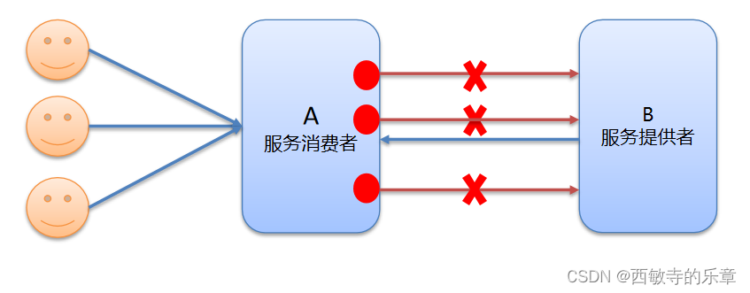

# 🔧 Dubbo 高级特性

## 🎛️ dubbo-admin 管理平台

- **dubbo-admin** 管理平台，是图形化的服务管理页面
- 从注册中心中获取到所有的提供者 / 消费者进行配置管理
- 提供路由规则、动态配置、服务降级、访问控制、权重调整、负载均衡等管理功能
- **dubbo-admin** 是一个前后端分离的项目，前端使用Vue，后端使用SpringBoot
- 安装 **dubbo-admin** 其实就是部署该项目

> 💡 **提示**：dubbo-admin 其实就是 dubbo 服务的管理平台，一个可视化工具，可以自行下载

## 📦 序列化机制

- Dubbo 内部已经将序列化和反序列化的过程内部封装了
- 我们只需要在定义 POJO 类时实现 `Serializable` 接口即可
- 一般会定义一个公共的 POJO 模块，让生产者和消费者都依赖该模块
- **推荐序列化方式**：
    - **Hessian2**：Dubbo默认序列化方式
    - **JSON**：跨语言友好
    - **Kryo**：性能优秀，但需注意版本兼容性

## 💾 地址缓存机制

> ❓ **思考**：假如注册中心挂了，服务是否可以正常访问？

- ✅ **可以**，因为 Dubbo 服务消费者在第一次调用时，会将服务提供方地址缓存到本地，以后在调用则不会访问注册中心
- 当服务提供者地址发生变化时，注册中心会通知服务消费者
- **缓存优势**：提高服务调用效率，增强系统容错能力


## ⏰ 超时与重试机制

- 服务消费者在调用服务提供者的时候发生了阻塞、等待的情形，这个时候，服务消费者会一直等待下去
- 在某个峰值时刻，大量的请求都在同时请求服务消费者，会造成线程的大量堆积，势必会造成雪崩



### 🛡️ 解决方案

#### 1. 设置超时和重试机制

- Dubbo 利用超时机制来解决这个问题，设置一个超时时间，在这个时间段内，无法完成服务访问，则自动断开连接
- 使用 `timeout` 属性配置超时时间，默认值1000，单位毫秒
- 设置了超时时间，在这个时间段内，无法完成服务访问，则自动断开连接
- 如果出现网络抖动，则这一次请求就会失败
- Dubbo 提供重试机制来避免类似问题的发生
- 通过 `retries` 属性来设置重试次数，默认为 2 次

#### 2. 超时和重试代码示例

- 其实就是在 service 上加配置属性

```java
@Service(timeout=3000) @Reference(timeout=3000)
@Service(retries=2) @Reference(retries=2)
```
```java
@Service(timeout=3000,retries=2)
public class DemoServiceImpl implements DemoService {
    @Override
    public String sayHello(String name) {
        return "Hello " + name;
    }
}
```


> ⚠️ **注意**：超时时间设置要合理，过短可能导致正常业务被中断，过长可能导致资源长时间占用

## 🔄 多版本控制

- **灰度发布**：当出现新功能时，会让一部分用户先使用新功能，用户反馈没问题时，再将所有用户迁移到新功能
- Dubbo 中使用 `version` 属性来设置和调用同一个接口的不同版本

### 🎯 可以控制服务使用范围

#### 1. 代码示例

> 其实就是在服务生产者的 `@Service` 注解和服务消费者的 `@Reference` 注解上加 `version` 属性，并确保值相同，才能访问的到

```java
@Service(version="1.0.0")
public class DemoServiceImpl implements DemoService {
}
```
```java
@Reference(version="1.0.0")
private DemoService demoService;
```


## ⚖️ 负载均衡策略

- **Random**：按权重随机，默认值，按权重设置随机概率
- **RoundRobin**：按权重轮询
- **LeastActive**：最少活跃调用数，相同活跃数的随机
- **ConsistentHash**：一致性 Hash，相同参数的请求总是发到同一提供者

### 1. 代码示例

> 再在生产者的 `@Service` 注解上加 `loadbalance` 属性，默认是 random 随机负载

```java
@Service(loadbalance="random") 
@Reference(loadbalance="random")
```


> 💡 **策略选择建议**：
> - **Random**：适用于大多数场景
> - **RoundRobin**：适用于服务器性能相近的场景
> - **LeastActive**：适用于处理时间差异较大的场景
> - **ConsistentHash**：适用于需要会话保持的场景

## 🛡️ 集群容错机制

- **Failover Cluster**：失败重试。默认值。当出现失败，重试其它服务器，默认重试2次，使用 `retries` 配置。一般用于读操作
- **Failfast Cluster**：快速失败，只发起一次调用，失败立即报错。通常用于写操作
- **Failsafe Cluster**：失败安全，出现异常时，直接忽略。返回一个空结果
- **Failback Cluster**：失败自动恢复，后台记录失败请求，定时重发。通常用于消息通知操作
- **Forking Cluster**：并行调用多个服务器，只要一个成功即返回
- **Broadcast Cluster**：广播调用所有提供者，逐个调用，任意一台报错则报错

### 1. 集群容错代码示例

> 在服务消费者 `@Reference` 注解上加 `cluster` 集群属性，默认是 failover 集群容错

```java
@Service(cluster="failfast") 
@Reference(cluster="failfast")
```


> 💡 **容错策略选择建议**：
> - **Failover**：适用于读操作，需要保证请求成功
> - **Failfast**：适用于写操作，需要快速失败
> - **Failsafe**：适用于不重要的操作，允许失败
> - **Failback**：适用于异步操作，需要确保最终成功