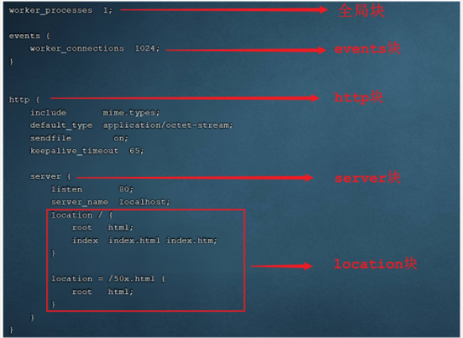

# 🚀 Nginx 使用指南

## 🎯 Nginx 常用命令

### 1. 基础操作命令
```shell
# 查看Nginx版本
./nginx -v

# 检查配置文件语法
./nginx -t

# 启动Nginx服务
./nginx

# 停止Nginx服务
./nginx -s stop

# 优雅停止Nginx服务
./nginx -s quit

# 重新加载配置文件（不停机更新配置）
./nginx -s reload

# 重新打开日志文件
./nginx -s reopen
```


> 💡 **reload命令优势**：
> - Nginx正在运行时修改配置文件后，无需重启即可使配置生效
> - 线上环境中临时修改 `nginx.conf` 文件时，避免停止服务造成业务中断

---

## 📁 Nginx 应用配置

### 配置文件结构

| 区域 | 职责 |
|------|------|
| `全局块` | 配置和nginx运行相关的全局配置 |
| `events块` | 配置和网络连接相关的配置 |
| `http块` | 配置代理、缓存、日志记录、虚拟主机、静态资源配置等配置 |



### 典型配置示例

#### 1. 基础HTTP服务器配置
```nginx
# 全局块配置
worker_processes  1;

# events块配置
events {
    worker_connections  1024;
}

# http块配置
http {
    include       mime.types;
    default_type  application/octet-stream;
    
    # 日志格式
    log_format  main  '$remote_addr - $remote_user [$time_local] "$request" '
                      '$status $body_bytes_sent "$http_referer" '
                      '"$http_user_agent" "$http_x_forwarded_for"';
    
    # 虚拟主机配置
    server {
        listen       80;
        server_name  localhost;
        
        location / {
            root   html;
            index  index.html index.htm;
        }
        
        # 错误页面配置
        error_page   500 502 503 504  /50x.html;
        location = /50x.html {
            root   html;
        }
    }
}
```


#### 2. 反向代理配置
```nginx
server {
    listen       82;
    server_name  example.com;
    
    location / {
        proxy_pass http://backend_server;
        proxy_set_header Host $host;
        proxy_set_header X-Real-IP $remote_addr;
        proxy_set_header X-Forwarded-For $proxy_add_x_forwarded_for;
    }
}
```


#### 3. 负载均衡配置

```nginx
upstream TargetHTTP {
    server 192.168.1.10:8080;
    server 192.168.1.11:8080;
    server 192.168.1.12:8080;
}

server {
    listen 80;
    server_name example.com;
    
    location / {
        proxy_pass https://TargetHTTP;
    }
}
```

- 负载均衡策略

| **名称**     | **说明**         | 特点                                       |
| ---------- | -------------- | ---------------------------------------- |
| 轮询         | 默认方式           | 轮流均衡访问服务节点                               |
| weight     | 权重方式           | 根据权重分发请求,权重大的分配到请求的概率大                   |
| ip_hash    | 依据ip分配方式       | 根据客户端请求的IP地址计算hash值， 根据hash值来分发请求, 同一个IP发起的请求, 会发转发到同一个服务器上 |
| least_conn | 依据最少连接方式       | 哪个服务器当前处理的连接少, 请求优先转发到这台服务器（谁闲用谁）        |
| url_hash   | 依据url分配方式（第三方） | 根据客户端请求url的hash值，来分发请求, 同一个url请求, 会发转发到同一个服务器上 |
| fair       | 依据响应时间方式（第三方）  | 优先把请求分发给处理请求时间短的服务器（强调响应速度-活干的快，就多干-能者多劳） |

- 权重的配置
```nginx
upstream backend {
    server 192.168.1.10:8080 weight=3;
    server 192.168.1.11:8080 weight=2;
    server 192.168.1.12:8080 weight=1;
}
```


#### 4. 静态资源缓存配置
```nginx
server {
    listen 80;
    server_name static.example.com;
    
    location ~* \.(jpg|jpeg|png|gif|ico|css|js)$ {
        root /var/www/static;
        expires 1y;
        add_header Cache-Control "public, immutable";
    }
}
```
