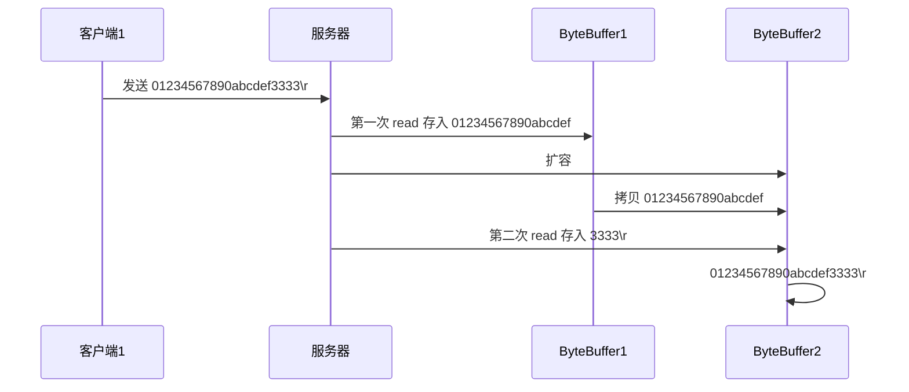

# 📡 NIO 网络编程

> NIO (Non-blocking I/O) 是 Java 提供的一种高性能 I/O 处理方式，特别适合处理高并发的网络通信场景。

## 四、网络编程 🌐

### 4.1 非阻塞 vs 阻塞 ⚡

#### 🔒 阻塞模式（Blocking Mode）

**阻塞模式特点：**

- 🛑 阻塞模式下，相关方法都会导致线程暂停
    - `ServerSocketChannel.accept` 会在没有连接建立时让线程暂停
    - `SocketChannel.read` 会在没有数据可读时让线程暂停
    - 阻塞的表现其实就是线程暂停了，暂停期间不会占用 CPU，但线程相当于闲置

- ⚠️ 单线程下，阻塞方法之间相互影响，几乎不能正常工作，需要多线程支持

- 🧵 但多线程下，有新的问题，体现在以下方面：
    - **内存开销大**：32 位 JVM 一个线程 320k，64 位 JVM 一个线程 1024k，如果连接数过多，必然导致 OOM
    - **上下文切换频繁**：线程太多，反而会因为频繁上下文切换导致性能降低
    - **线程池局限性**：可以采用线程池技术来减少线程数和线程上下文切换，但治标不治本，如果有很多连接建立但长时间 inactive，会阻塞线程池中所有线程
    - **适用场景**：因此不适合长连接，只适合短连接

**代码示例：**

##### 1️⃣ 服务器端

```java
// 使用 nio 来理解阻塞模式, 单线程  
// 0. ByteBuffer  
ByteBuffer buffer = ByteBuffer.allocate(16);  
// 1. 创建了服务器  
ServerSocketChannel ssc = ServerSocketChannel.open();  
​  
// 2. 绑定监听端口  
ssc.bind(new InetSocketAddress(8080));  
​  
// 3. 连接集合  
List<SocketChannel> channels = new ArrayList<>();  
while (true) {  
    // 4. accept 建立与客户端连接， SocketChannel 用来与客户端之间通信  
    log.debug("connecting...");  
    SocketChannel sc = ssc.accept(); // 阻塞方法，线程停止运行  
    log.debug("connected... {}", sc);  
    channels.add(sc);  
    for (SocketChannel channel : channels) {  
        // 5. 接收客户端发送的数据  
        log.debug("before read... {}", channel);  
        channel.read(buffer); // 阻塞方法，线程停止运行  
        buffer.flip();  
        debugRead(buffer);  
        buffer.clear();  
        log.debug("after read...{}", channel);  
    }  
}
```

##### 2️⃣ 客户端

```java
SocketChannel sc = SocketChannel.open();
sc.connect(new InetSocketAddress("localhost", 8080));
System.out.println("waiting...");
```

---

#### 🚀 非阻塞模式（Non-Blocking Mode）

**非阻塞模式特点：**

- ✅ 非阻塞模式下，相关方法都不会让线程暂停
    - `ServerSocketChannel.accept` 在没有连接建立时，会返回 `null`，继续运行
    - `SocketChannel.read` 在没有数据可读时，会返回 `0`，但线程不必阻塞，可以去执行其它 SocketChannel 的 read 或是去执行 ServerSocketChannel.accept
    - 写数据时，线程只是等待数据写入 Channel 即可，无需等 Channel 通过网络把数据发送出去

- ⚠️ **缺点**：
    - 即使没有连接建立和可读数据，线程仍然在不断运行，白白浪费了 CPU（空转问题）
    - 数据复制过程中，线程实际还是阻塞的（这是 AIO 改进的地方）

**代码示例：**

##### 1️⃣ 服务器端（客户端代码不变）

```java
// 使用 nio 来理解非阻塞模式, 单线程  
// 0. ByteBuffer  
ByteBuffer buffer = ByteBuffer.allocate(16);  
// 1. 创建了服务器  
ServerSocketChannel ssc = ServerSocketChannel.open();  
ssc.configureBlocking(false); // ServerSocketChannel 非阻塞模式  
// 2. 绑定监听端口  
ssc.bind(new InetSocketAddress(8080));  
// 3. 连接集合  
List<SocketChannel> channels = new ArrayList<>();  
while (true) {  
    // 4. accept 建立与客户端连接， SocketChannel 用来与客户端之间通信  
    SocketChannel sc = ssc.accept(); // 非阻塞，线程还会继续运行，如果没有连接建立，但sc是null  
    if (sc != null) {  
        log.debug("connected... {}", sc);  
        sc.configureBlocking(false); // SocketChannel 非阻塞模式  
        channels.add(sc);  
    }  
    for (SocketChannel channel : channels) {  
        // 5. 接收客户端发送的数据  
        int read = channel.read(buffer);// 非阻塞，线程仍然会继续运行，如果没有读到数据，read 返回 0  
        if (read > 0) {  
            buffer.flip();  
            debugRead(buffer);  
            buffer.clear();  
            log.debug("after read...{}", channel);  
        }  
    }  
}
```

---

#### 🎯 多路复用（Multiplexing）

> 💡 **核心思想**：单线程可以配合 Selector 完成对多个 Channel 可读写事件的监控，这称之为多路复用。

**多路复用的特点：**

- 📌 **适用范围**：多路复用仅针对网络 IO，普通文件 IO 没法利用多路复用

- 🎯 **优势**：如果不用 Selector 的非阻塞模式，线程大部分时间都在做无用功，而 Selector 能够保证：
    - ✅ 有可连接事件时才去连接
    - ✅ 有可读事件才去读取
    - ✅ 有可写事件才去写入
        - 💡 限于网络传输能力，Channel 未必时时可写，一旦 Channel 可写，会触发 Selector 的可写事件

---

### 4.2 Selector 选择器 🎛️

> Selector 是 NIO 中最核心的组件之一，它可以监控多个 Channel 的 I/O 事件。

**Selector 的好处：**

- 🎯 一个线程配合 selector 就可以监控多个 channel 的事件，事件发生线程才去处理，避免非阻塞模式下所做无用功
- ⚡ 让这个线程能够被充分利用
- 💾 节约了线程的数量
- 🔄 减少了线程上下文切换

#### 📝 创建 Selector
```java
Selector selector = Selector.open();
```

#### 🔗 绑定 Channel 事件

> 也称之为**注册事件**，绑定的事件 selector 才会关心。

```java
channel.configureBlocking(false);
SelectionKey key = channel.register(selector, 绑定事件);
```

**注意事项：**

- ⚠️ Channel 必须工作在**非阻塞模式**
- ❌ FileChannel 没有非阻塞模式，因此不能配合 selector 一起使用

**事件类型（SelectionKey 常量）：**

| 事件类型 | 说明 | 使用场景 |
|---------|------|---------|
| `SelectionKey.OP_CONNECT` | 客户端连接成功时触发 | 客户端 |
| `SelectionKey.OP_ACCEPT` | 服务器端成功接受连接时触发 | 服务器端 |
| `SelectionKey.OP_READ` | 数据可读入时触发 | 读取数据 |
| `SelectionKey.OP_WRITE` | 数据可写出时触发 | 写入数据 |

> 💡 **提示**：read 和 write 事件可能因为接收/发送能力弱，数据暂时不能读入/写出。

#### 👂 监听 Channel 事件

可以通过下面三种方法来监听是否有事件发生，**方法的返回值代表有多少 channel 发生了事件**。

##### 方式一：阻塞直到绑定事件发生

```java
int count = selector.select();
```

##### 方式二：阻塞直到绑定事件发生，或是超时

```java
int count = selector.select(long timeout);  // 时间单位为 ms
```

##### 方式三：不会阻塞，立刻返回

```java
int count = selector.selectNow();  // 不管有没有事件，立刻返回
```

#### 💡 select 何时不阻塞？

> **重要知识点**：了解 select 方法何时会从阻塞状态返回，对于正确使用 Selector 至关重要。

**select 不阻塞的情况：**

1. **事件发生时**
   - 🔌 客户端发起连接请求，会触发 `accept` 事件
   - 📨 客户端发送数据过来，客户端正常、异常关闭时，都会触发 `read` 事件
   - 📦 如果发送的数据大于 buffer 缓冲区，会触发多次读取事件
   - ✍️ Channel 可写，会触发 `write` 事件
   - 🐛 在 Linux 下 NIO bug 发生时

2. **主动唤醒**
   - 调用 `selector.wakeup()`
   - 调用 `selector.close()`
   - selector 所在线程 `interrupt`

---

### 4.3 处理 accept 事件 🤝

> accept 事件表示有新的客户端连接请求到达。

**代码示例：**

##### 1️⃣ 客户端代码

```java
public class Client {  
    public static void main(String[] args) {  
        try (Socket socket = new Socket("localhost", 8080)) {  
            System.out.println(socket);  
            socket.getOutputStream().write("world".getBytes());  
            System.in.read();  
        } catch (IOException e) {  
            e.printStackTrace();  
        }  
    }  
}
```

##### 2️⃣ 服务器端代码

```java
@Slf4j  
public class ChannelDemo6 {  
    public static void main(String[] args) {  
        try (ServerSocketChannel channel = ServerSocketChannel.open()) {  
            channel.bind(new InetSocketAddress(8080));  
            System.out.println(channel);  
            
            Selector selector = Selector.open();  
            channel.configureBlocking(false);  
            channel.register(selector, SelectionKey.OP_ACCEPT);  
​  
            while (true) {  
                int count = selector.select();  
//                int count = selector.selectNow();  
                log.debug("select count: {}", count);  
//                if(count <= 0) {  
//                    continue;  
//                }  
​  
                // 获取所有事件  
                Set<SelectionKey> keys = selector.selectedKeys();  
​  
                // 遍历所有事件，逐一处理  
                Iterator<SelectionKey> iter = keys.iterator();  
                while (iter.hasNext()) {  
                    SelectionKey key = iter.next();  
                    // 判断事件类型  
                    if (key.isAcceptable()) {  
                        ServerSocketChannel c = (ServerSocketChannel) key.channel();  
                        // 必须处理  
                        SocketChannel sc = c.accept();  
                        log.debug("{}", sc);  
                    }  
                    // 处理完毕，必须将事件移除  
                    iter.remove();  
                }  
            }  
        } catch (IOException e) {  
            e.printStackTrace();  
        }  
    }  
}
```

#### 💡 事件发生后能否不处理？

> ⚠️ **重要**：事件发生后，要么处理，要么取消（cancel），不能什么都不做，否则下次该事件仍会触发，这是因为 NIO 底层使用的是**水平触发**（Level Triggered）。

**水平触发 vs 边缘触发：**
- **水平触发（Level Triggered）**：只要条件满足，就会一直触发事件
- **边缘触发（Edge Triggered）**：只在状态变化时触发一次

---

### 4.4 处理 read 事件 📖

```java
@Slf4j  
public class ChannelDemo6 {  
    public static void main(String[] args) {  
        try (ServerSocketChannel channel = ServerSocketChannel.open()) {  
            channel.bind(new InetSocketAddress(8080));  
            System.out.println(channel);  
            Selector selector = Selector.open();  
            channel.configureBlocking(false);  
            channel.register(selector, SelectionKey.OP_ACCEPT);  
​  
            while (true) {  
                int count = selector.select();  
//                int count = selector.selectNow();  
                log.debug("select count: {}", count);  
//                if(count <= 0) {  
//                    continue;  
//                }  
​  
                // 获取所有事件  
                Set<SelectionKey> keys = selector.selectedKeys();  
​  
                // 遍历所有事件，逐一处理  
                Iterator<SelectionKey> iter = keys.iterator();  
                while (iter.hasNext()) {  
                    SelectionKey key = iter.next();  
                    // 判断事件类型  
                    if (key.isAcceptable()) {  
                        ServerSocketChannel c = (ServerSocketChannel) key.channel();  
                        // 必须处理  
                        SocketChannel sc = c.accept();  
                        sc.configureBlocking(false);  
                        sc.register(selector, SelectionKey.OP_READ);  
                        log.debug("连接已建立: {}", sc);  
                    } else if (key.isReadable()) {  
                        SocketChannel sc = (SocketChannel) key.channel();  
                        ByteBuffer buffer = ByteBuffer.allocate(128);  
                        int read = sc.read(buffer);  
                        if(read == -1) {  
                            key.cancel();  
                            sc.close();  
                        } else {  
                            buffer.flip();  
                            debug(buffer);  
                        }  
                    }  
                    // 处理完毕，必须将事件移除  
                    iter.remove();  
                }  
            }  
        } catch (IOException e) {  
            e.printStackTrace();  
        }  
    }  
}
```

**运行结果：**

开启两个客户端，修改一下发送文字，输出：

```
sun.nio.ch.ServerSocketChannelImpl[/0:0:0:0:0:0:0:0:8080]  
21:16:39 [DEBUG] [main] c.i.n.ChannelDemo6 - select count: 1  
21:16:39 [DEBUG] [main] c.i.n.ChannelDemo6 - 连接已建立: java.nio.channels.SocketChannel[connected local=/127.0.0.1:8080 remote=/127.0.0.1:60367]  
21:16:39 [DEBUG] [main] c.i.n.ChannelDemo6 - select count: 1  
         +-------------------------------------------------+  
         |  0  1  2  3  4  5  6  7  8  9  a  b  c  d  e  f |  
+--------+-------------------------------------------------+----------------+  
|00000000| 68 65 6c 6c 6f                                  |hello           |  
+--------+-------------------------------------------------+----------------+  
21:16:59 [DEBUG] [main] c.i.n.ChannelDemo6 - select count: 1  
21:16:59 [DEBUG] [main] c.i.n.ChannelDemo6 - 连接已建立: java.nio.channels.SocketChannel[connected local=/127.0.0.1:8080 remote=/127.0.0.1:60378]  
21:16:59 [DEBUG] [main] c.i.n.ChannelDemo6 - select count: 1  
         +-------------------------------------------------+  
         |  0  1  2  3  4  5  6  7  8  9  a  b  c  d  e  f |  
+--------+-------------------------------------------------+----------------+  
|00000000| 77 6f 72 6c 64                                  |world           |  
+--------+-------------------------------------------------+----------------+
```

#### 💡 为何要 iter.remove()？

> ⚠️ **关键点**：因为 select 在事件发生后，就会将相关的 key 放入 selectedKeys 集合，但**不会在处理完后自动从 selectedKeys 集合中移除**，需要我们自己编码删除。

**不移除会导致的问题：**

1. 第一次触发了 `ssckey` 上的 accept 事件，没有移除 ssckey
2. 第二次触发了 `sckey` 上的 read 事件，但这时 selectedKeys 中还有上次的 ssckey
3. 在处理时因为没有真正的 serverSocket 连上了，就会导致**空指针异常**

#### 💡 cancel 的作用

> `cancel()` 会取消注册在 selector 上的 channel，并从 keys 集合中删除 key，后续不会再监听事件。

**使用场景：**
- 客户端正常断开连接
- 客户端异常断开连接
- 不再需要监听某个 Channel 的事件

---

#### ⚠️ 不处理边界的问题

> 在网络编程中，消息边界处理是一个常见且重要的问题。

以前有同学写过这样的代码，思考注释中两个问题，以 BIO 为例，其实 NIO 道理是一样的：

```java
public class Server {  
    public static void main(String[] args) throws IOException {  
        ServerSocket ss=new ServerSocket(9000);  
        while (true) {  
            Socket s = ss.accept();  
            InputStream in = s.getInputStream();  
            // 这里这么写，有没有问题  
            byte[] arr = new byte[4];  
            while(true) {  
                int read = in.read(arr);  
                // 这里这么写，有没有问题  
                if(read == -1) {  
                    break;  
                }  
                System.out.println(new String(arr, 0, read));  
            }  
        }  
    }  
}
```

客户端

```java
public class Client {  
    public static void main(String[] args) throws IOException {  
        Socket max = new Socket("localhost", 9000);  
        OutputStream out = max.getOutputStream();  
        out.write("hello".getBytes());  
        out.write("world".getBytes());  
        out.write("你好".getBytes());  
        max.close();  
    }  
}
```

#### 🔧 处理消息的边界


**三种常见的消息边界处理方案：**

| 方案 | 说明 | 优点 | 缺点 |
|------|------|------|------|
| 📏 **固定消息长度** | 数据包大小一样，服务器按预定长度读取 | 实现简单 | 浪费带宽 |
| ✂️ **分隔符拆分** | 使用特殊字符（如 `\n`）分隔消息 | 灵活 | 效率低，需要逐字节扫描 |
| 📦 **TLV 格式** | Type 类型、Length 长度、Value 数据 | 高效，易解析 | buffer 需要提前分配 |

> 💡 **实际应用**：
> - HTTP 1.1 使用 TLV 格式
> - HTTP 2.0 使用 LTV 格式
        




**完整示例代码：**

##### 服务器端

```java
private static void split(ByteBuffer source) {
    source.flip();
    for (int i = 0; i < source.limit(); i++) {
        // 找到一条完整消息
        if (source.get(i) == '\n') {
            int length = i + 1 - source.position();
            // 把这条完整消息存入新的 ByteBuffer
            ByteBuffer target = ByteBuffer.allocate(length);
            // 从 source 读，向 target 写
            for (int j = 0; j < length; j++) {
                target.put(source.get());
            }
            debugAll(target);
        }
    }
    source.compact(); // 0123456789abcdef  position 16 limit 16
}

public static void main(String[] args) throws IOException {
    // 1. 创建 selector, 管理多个 channel
    Selector selector = Selector.open();
    ServerSocketChannel ssc = ServerSocketChannel.open();
    ssc.configureBlocking(false);
    // 2. 建立 selector 和 channel 的联系（注册）
    // SelectionKey 就是将来事件发生后，通过它可以知道事件和哪个channel的事件
    SelectionKey sscKey = ssc.register(selector, 0, null);
    // key 只关注 accept 事件
    sscKey.interestOps(SelectionKey.OP_ACCEPT);
    log.debug("sscKey:{}", sscKey);
    ssc.bind(new InetSocketAddress(8080));
    while (true) {
        // 3. select 方法, 没有事件发生，线程阻塞，有事件，线程才会恢复运行
        // select 在事件未处理时，它不会阻塞, 事件发生后要么处理，要么取消，不能置之不理
        selector.select();
        // 4. 处理事件, selectedKeys 内部包含了所有发生的事件
        Iterator<SelectionKey> iter = selector.selectedKeys().iterator(); // accept, read
        while (iter.hasNext()) {
            SelectionKey key = iter.next();
            // 处理key 时，要从 selectedKeys 集合中删除，否则下次处理就会有问题
            iter.remove();
            log.debug("key: {}", key);
            // 5. 区分事件类型
            if (key.isAcceptable()) { // 如果是 accept
                ServerSocketChannel channel = (ServerSocketChannel) key.channel();
                SocketChannel sc = channel.accept();
                sc.configureBlocking(false);
                ByteBuffer buffer = ByteBuffer.allocate(16); // attachment
                // 将一个 byteBuffer 作为附件关联到 selectionKey 上
                SelectionKey scKey = sc.register(selector, 0, buffer);
                scKey.interestOps(SelectionKey.OP_READ);
                log.debug("{}", sc);
                log.debug("scKey:{}", scKey);
            } else if (key.isReadable()) { // 如果是 read
                try {
                    SocketChannel channel = (SocketChannel) key.channel(); // 拿到触发事件的channel
                    // 获取 selectionKey 上关联的附件
                    ByteBuffer buffer = (ByteBuffer) key.attachment();
                    int read = channel.read(buffer); // 如果是正常断开，read 的方法的返回值是 -1
                    if(read == -1) {
                        key.cancel();
                    } else {
                        split(buffer);
                        // 需要扩容
                        if (buffer.position() == buffer.limit()) {
                            ByteBuffer newBuffer = ByteBuffer.allocate(buffer.capacity() * 2);
                            buffer.flip();
                            newBuffer.put(buffer); // 0123456789abcdef3333\n
                            key.attach(newBuffer);
                        }
                    }

                } catch (IOException e) {
                    e.printStackTrace();
                    key.cancel();  // 因为客户端断开了,因此需要将 key 取消（从 selector 的 keys 集合中真正删除 key）
                }
            }
        }
    }
}
```

##### 客户端

```java
SocketChannel sc = SocketChannel.open();
sc.connect(new InetSocketAddress("localhost", 8080));
SocketAddress address = sc.getLocalAddress();
// sc.write(Charset.defaultCharset().encode("hello\nworld\n"));
sc.write(Charset.defaultCharset().encode("0123\n456789abcdef"));
sc.write(Charset.defaultCharset().encode("0123456789abcdef3333\n"));
System.in.read();
```

---

#### 💾 ByteBuffer 大小分配

> 合理分配 ByteBuffer 大小对于高并发场景下的内存管理至关重要。

**核心问题：**

- ⚠️ 每个 channel 都需要记录可能被切分的消息，因为 ByteBuffer 不能被多个 channel 共同使用，因此需要为每个 channel 维护一个独立的 ByteBuffer
- ⚠️ ByteBuffer 不能太大，比如一个 ByteBuffer 1MB 的话，要支持百万连接就要 1TB 内存

**两种解决方案：**

| 方案 | 实现方式 | 优点 | 缺点 |
|------|---------|------|------|
| 📈 **动态扩容** | 首先分配较小的 buffer（如 4k），数据不够时再分配 8k，并拷贝原内容 | 消息连续，容易处理 | 数据拷贝耗费性能 |
| 🔗 **数组链表** | 用多个数组组成 buffer，一个数组不够就写入新数组 | 避免拷贝，性能好 | 消息存储不连续，解析复杂 |

> 📚 **参考实现**：[http://tutorials.jenkov.com/java-performance/resizable-array.html](http://tutorials.jenkov.com/java-performance/resizable-array.html)

---

### 4.5 处理 write 事件 ✍️

> write 事件的处理需要特别注意，因为 Channel 并不总是可写的。

#### 📝 一次无法写完的例子

**问题分析：**

- ⚠️ 非阻塞模式下，无法保证把 buffer 中所有数据都写入 channel，因此需要追踪 write 方法的返回值（代表实际写入字节数）
- 🎯 用 selector 监听所有 channel 的可写事件，每个 channel 都需要一个 key 来跟踪 buffer

**两阶段策略：**

1. ✅ 当消息处理器第一次写入消息时，才将 channel 注册到 selector 上
2. ✅ selector 检查 channel 上的可写事件，如果所有的数据写完了，就取消 channel 的注册
3. ⚠️ 如果不取消，会每次可写均会触发 write 事件（造成资源浪费）

**代码示例：**


```java
public class WriteServer {

    public static void main(String[] args) throws IOException {
        ServerSocketChannel ssc = ServerSocketChannel.open();
        ssc.configureBlocking(false);
        ssc.bind(new InetSocketAddress(8080));

        Selector selector = Selector.open();
        ssc.register(selector, SelectionKey.OP_ACCEPT);

        while(true) {
            selector.select();

            Iterator<SelectionKey> iter = selector.selectedKeys().iterator();
            while (iter.hasNext()) {
                SelectionKey key = iter.next();
                iter.remove();
                if (key.isAcceptable()) {
                    SocketChannel sc = ssc.accept();
                    sc.configureBlocking(false);
                    SelectionKey sckey = sc.register(selector, SelectionKey.OP_READ);
                    // 1. 向客户端发送内容
                    StringBuilder sb = new StringBuilder();
                    for (int i = 0; i < 3000000; i++) {
                        sb.append("a");
                    }
                    ByteBuffer buffer = Charset.defaultCharset().encode(sb.toString());
                    int write = sc.write(buffer);
                    // 3. write 表示实际写了多少字节
                    System.out.println("实际写入字节:" + write);
                    // 4. 如果有剩余未读字节，才需要关注写事件
                    if (buffer.hasRemaining()) {
                        // read 1  write 4
                        // 在原有关注事件的基础上，多关注 写事件
                        sckey.interestOps(sckey.interestOps() + SelectionKey.OP_WRITE);
                        // 把 buffer 作为附件加入 sckey
                        sckey.attach(buffer);
                    }
                } else if (key.isWritable()) {
                    ByteBuffer buffer = (ByteBuffer) key.attachment();
                    SocketChannel sc = (SocketChannel) key.channel();
                    int write = sc.write(buffer);
                    System.out.println("实际写入字节:" + write);
                    if (!buffer.hasRemaining()) { // 写完了
                        key.interestOps(key.interestOps() - SelectionKey.OP_WRITE);
                        key.attach(null);
                    }
                }
            }
        }
    }
}
```

##### 客户端

```java
public class WriteClient {
    public static void main(String[] args) throws IOException {
        Selector selector = Selector.open();
        SocketChannel sc = SocketChannel.open();
        sc.configureBlocking(false);
        sc.register(selector, SelectionKey.OP_CONNECT | SelectionKey.OP_READ);
        sc.connect(new InetSocketAddress("localhost", 8080));
        int count = 0;
        while (true) {
            selector.select();
            Iterator<SelectionKey> iter = selector.selectedKeys().iterator();
            while (iter.hasNext()) {
                SelectionKey key = iter.next();
                iter.remove();
                if (key.isConnectable()) {
                    System.out.println(sc.finishConnect());
                } else if (key.isReadable()) {
                    ByteBuffer buffer = ByteBuffer.allocate(1024 * 1024);
                    count += sc.read(buffer);
                    buffer.clear();
                    System.out.println(count);
                }
            }
        }
    }
}
```


#### 💡 write 为何要取消？

> ⚠️ **重要原因**：只要向 channel 发送数据时，socket 缓冲可写，这个事件会**频繁触发**，因此应当只在 socket 缓冲区写不下时再关注可写事件，数据写完之后再取消关注。

**最佳实践：**
- ✅ 按需注册：只在需要写但写不完时才注册 write 事件
- ✅ 及时取消：数据写完后立即取消 write 事件
- ❌ 避免：一直监听 write 事件会导致 CPU 空转

---

### 4.6 更进一步 🚀

#### 💡 利用多线程优化

> 💻 **现代服务器设计**：现在都是多核 CPU，设计时要充分考虑别让 CPU 的力量被白白浪费。

**问题分析：**

前面的代码只有一个选择器，没有充分利用多核 CPU，如何改进呢？

**解决方案：分两组选择器（主从 Reactor 模式）**

| 角色 | 线程数 | 职责 | 说明 |
|------|--------|------|------|
| 🎯 **Boss 线程** | 1 个 | 处理 accept 事件 | 专门负责接收新连接 |
| 👷 **Worker 线程** | CPU 核心数 | 处理 read/write 事件 | 轮流处理已建立连接的读写 |

> 💡 **设计模式**：这就是经典的 **Reactor 主从模式**，Netty 也采用了这种设计。

**代码示例：**


```java
public class ChannelDemo7 {
    public static void main(String[] args) throws IOException {
        new BossEventLoop().register();
    }


    @Slf4j
    static class BossEventLoop implements Runnable {
        private Selector boss;
        private WorkerEventLoop[] workers;
        private volatile boolean start = false;
        AtomicInteger index = new AtomicInteger();

        public void register() throws IOException {
            if (!start) {
                ServerSocketChannel ssc = ServerSocketChannel.open();
                ssc.bind(new InetSocketAddress(8080));
                ssc.configureBlocking(false);
                boss = Selector.open();
                SelectionKey ssckey = ssc.register(boss, 0, null);
                ssckey.interestOps(SelectionKey.OP_ACCEPT);
                workers = initEventLoops();
                new Thread(this, "boss").start();
                log.debug("boss start...");
                start = true;
            }
        }

        public WorkerEventLoop[] initEventLoops() {
//        EventLoop[] eventLoops = new EventLoop[Runtime.getRuntime().availableProcessors()];
            WorkerEventLoop[] workerEventLoops = new WorkerEventLoop[2];
            for (int i = 0; i < workerEventLoops.length; i++) {
                workerEventLoops[i] = new WorkerEventLoop(i);
            }
            return workerEventLoops;
        }

        @Override
        public void run() {
            while (true) {
                try {
                    boss.select();
                    Iterator<SelectionKey> iter = boss.selectedKeys().iterator();
                    while (iter.hasNext()) {
                        SelectionKey key = iter.next();
                        iter.remove();
                        if (key.isAcceptable()) {
                            ServerSocketChannel c = (ServerSocketChannel) key.channel();
                            SocketChannel sc = c.accept();
                            sc.configureBlocking(false);
                            log.debug("{} connected", sc.getRemoteAddress());
                            workers[index.getAndIncrement() % workers.length].register(sc);
                        }
                    }
                } catch (IOException e) {
                    e.printStackTrace();
                }
            }
        }
    }

    @Slf4j
    static class WorkerEventLoop implements Runnable {
        private Selector worker;
        private volatile boolean start = false;
        private int index;

        private final ConcurrentLinkedQueue<Runnable> tasks = new ConcurrentLinkedQueue<>();

        public WorkerEventLoop(int index) {
            this.index = index;
        }

        public void register(SocketChannel sc) throws IOException {
            if (!start) {
                worker = Selector.open();
                new Thread(this, "worker-" + index).start();
                start = true;
            }
            tasks.add(() -> {
                try {
                    SelectionKey sckey = sc.register(worker, 0, null);
                    sckey.interestOps(SelectionKey.OP_READ);
                    worker.selectNow();
                } catch (IOException e) {
                    e.printStackTrace();
                }
            });
            worker.wakeup();
        }

        @Override
        public void run() {
            while (true) {
                try {
                    worker.select();
                    Runnable task = tasks.poll();
                    if (task != null) {
                        task.run();
                    }
                    Set<SelectionKey> keys = worker.selectedKeys();
                    Iterator<SelectionKey> iter = keys.iterator();
                    while (iter.hasNext()) {
                        SelectionKey key = iter.next();
                        if (key.isReadable()) {
                            SocketChannel sc = (SocketChannel) key.channel();
                            ByteBuffer buffer = ByteBuffer.allocate(128);
                            try {
                                int read = sc.read(buffer);
                                if (read == -1) {
                                    key.cancel();
                                    sc.close();
                                } else {
                                    buffer.flip();
                                    log.debug("{} message:", sc.getRemoteAddress());
                                    debugAll(buffer);
                                }
                            } catch (IOException e) {
                                e.printStackTrace();
                                key.cancel();
                                sc.close();
                            }
                        }
                        iter.remove();
                    }
                } catch (IOException e) {
                    e.printStackTrace();
                }
            }
        }
    }
}
```


#### 如何拿到 CPU 个数？

> **获取 CPU 核心数**：`Runtime.getRuntime().availableProcessors()`

**注意事项：**

- **Docker 容器问题**：如果工作在 Docker 容器下，因为容器不是物理隔离的，会拿到物理 CPU 个数，而不是容器申请时的个数
- **JDK 10+ 修复**：这个问题直到 JDK 10 才修复，使用 JVM 参数 `UseContainerSupport` 配置，默认开启

```java
// 获取 CPU 核心数
int processors = Runtime.getRuntime().availableProcessors();
System.out.println("CPU 核心数: " + processors);
```

---

### 4.7 UDP 编程 

> UDP（User Datagram Protocol）是一种无连接的传输层协议，适合对实时性要求高但对可靠性要求不高的场景。

**UDP 特点：**

-  **无连接**：client 发送数据不会管 server 是否开启
-  **数据可能丢失**：server 这边的 receive 方法会将接收到的数据存入 byte buffer，但如果数据报文超过 buffer 大小，多出来的数据会被默默抛弃
-  **速度快**：没有连接建立和维护的开销
-  **面向报文**：保留消息边界

**代码示例：**

##### 1️⃣ 服务器端

```java
public class UdpServer {
    public static void main(String[] args) {
        try (DatagramChannel channel = DatagramChannel.open()) {
            channel.socket().bind(new InetSocketAddress(9999));
            System.out.println("waiting...");
            ByteBuffer buffer = ByteBuffer.allocate(32);
            channel.receive(buffer);
            buffer.flip();
            debug(buffer);
        } catch (IOException e) {
            e.printStackTrace();
        }
    }
}
```

**运行结果：**

```
waiting...
```

##### 2️⃣ 客户端

```java
public class UdpClient {
    public static void main(String[] args) {
        try (DatagramChannel channel = DatagramChannel.open()) {
            ByteBuffer buffer = StandardCharsets.UTF_8.encode("hello");
            InetSocketAddress address = new InetSocketAddress("localhost", 9999);
            channel.send(buffer, address);
        } catch (Exception e) {
            e.printStackTrace();
        }
    }
}
```

**服务器端接收到数据后输出：**

```
         +-------------------------------------------------+
         |  0  1  2  3  4  5  6  7  8  9  a  b  c  d  e  f |
+--------+-------------------------------------------------+----------------+
|00000000| 68 65 6c 6c 6f                                  |hello           |
+--------+-------------------------------------------------+----------------+
```

---

## 五、NIO vs BIO 对比 ⚖️

### 5.1 Stream vs Channel

> 理解 Stream 和 Channel 的区别，有助于选择合适的 I/O 方式。

**核心区别对比：**

| 特性 | Stream（BIO） | Channel（NIO） |
|------|--------------|----------------|
| 🔄 **缓冲机制** | 不会自动缓冲数据 | 利用系统提供的发送/接收缓冲区（更底层） |
| 🚦 **阻塞模式** | 仅支持阻塞 API | 同时支持阻塞、非阻塞 API |
| 🎯 **多路复用** | 不支持 | 网络 channel 可配合 selector 实现多路复用 |
| 🔀 **双工模式** | 全双工（读写可同时进行） | 全双工（读写可同时进行） |

---

### 5.2 IO 模型详解

> I/O 模型是理解网络编程性能的关键。

**五种 I/O 模型：**

1. ⏸️ **同步阻塞**（Blocking I/O）
2. 🔄 **同步非阻塞**（Non-blocking I/O）
3. 🎯 **同步多路复用**（I/O Multiplexing）
4. ❌ **异步阻塞**（没有此情况）
5. ⚡ **异步非阻塞**（Asynchronous I/O）

**同步 vs 异步：**

- 🔵 **同步**：线程自己去获取结果（一个线程）
- 🟢 **异步**：线程自己不去获取结果，而是由其它线程送结果（至少两个线程）

**I/O 操作的两个阶段：**

当调用一次 `channel.read` 或 `stream.read` 后，会切换至操作系统内核态来完成真正数据读取，而读取又分为两个阶段：

1. ⏳ **等待数据阶段**：等待数据从网络到达内核缓冲区
2. 📋 **复制数据阶段**：将数据从内核缓冲区复制到用户空间


**各种 I/O 模型图示：**

- **阻塞 IO**

  

- **非阻塞 IO**

  

- **多路复用**

  

- **信号驱动**

- **异步 IO**

  

- **阻塞 IO vs 多路复用**

  

  

####  参考资料

📖 UNIX 网络编程 - 卷 I

---

### 5.3 零拷贝技术

> 零拷贝是提升 I/O 性能的重要技术，可以大幅减少数据拷贝次数和上下文切换。

####  传统 IO 问题

**示例代码：**

```java
File f = new File("helloword/data.txt");
RandomAccessFile file = new RandomAccessFile(file, "r");

byte[] buf = new byte[(int)f.length()];
file.read(buf);

Socket socket = ...;
socket.getOutputStream().write(buf);
```

**内部工作流程：**


**详细步骤分析：**

1. 🔄 **用户态 → 内核态**：Java 本身并不具备 IO 读写能力，因此 read 方法调用后，要从 Java 程序的**用户态**切换至**内核态**，去调用操作系统（Kernel）的读能力，将数据读入**内核缓冲区**。这期间用户线程阻塞，操作系统使用 DMA（Direct Memory Access）来实现文件读，其间也不会使用 CPU

   > 💡 **DMA**：也可以理解为硬件单元，用来解放 CPU 完成文件 IO

2. 🔄 **内核态 → 用户态**：从**内核态**切换回**用户态**，将数据从**内核缓冲区**读入**用户缓冲区**（即 byte[] buf），这期间 CPU 会参与拷贝，无法利用 DMA

3. 📝 **写入 Socket 缓冲区**：调用 write 方法，这时将数据从**用户缓冲区**（byte[] buf）写入 **socket 缓冲区**，CPU 会参与拷贝

4. 🔄 **用户态 → 内核态**：接下来要向网卡写数据，这项能力 Java 又不具备，因此又得从**用户态**切换至**内核态**，调用操作系统的写能力，使用 DMA 将 **socket 缓冲区**的数据写入网卡，不会使用 CPU

**性能问题总结：**

可以看到中间环节较多，Java 的 IO 实际不是物理设备级别的读写，而是缓存的复制，底层的真正读写是操作系统来完成的。

- ⚠️ **用户态与内核态的切换**：发生了 **3 次**，这个操作比较重量级
- ⚠️ **数据拷贝**：共 **4 次**

---

####  NIO 优化（DirectByteBuffer）

**DirectByteBuffer 介绍：**

```java
ByteBuffer.allocate(10)        // HeapByteBuffer 使用的还是 Java 内存
ByteBuffer.allocateDirect(10)  // DirectByteBuffer 使用的是操作系统内存
```


**优化原理：**

大部分步骤与优化前相同，不再赘述。唯有一点：Java 可以使用 DirectByteBuf 将堆外内存映射到 JVM 内存中来直接访问使用。

**DirectByteBuffer 特点：**

- ✅ 这块内存不受 JVM 垃圾回收的影响，因此内存地址固定，有助于 IO 读写
- 🔄 Java 中的 DirectByteBuf 对象仅维护了此内存的虚引用，内存回收分成两步：
  1. DirectByteBuf 对象被垃圾回收，将虚引用加入引用队列
  2. 通过专门线程访问引用队列，根据虚引用释放堆外内存

**性能提升：**

- ✅ 减少了一次数据拷贝（从 4 次减少到 3 次）
- ⚠️ 用户态与内核态的切换次数没有减少（仍然是 3 次）


####  进一步优化（Linux 2.1 sendFile）

> 底层采用了 Linux 2.1 后提供的 sendFile 方法，Java 中对应着两个 channel 调用 `transferTo`/`transferFrom` 方法拷贝数据。


**优化步骤：**

1. 🔄 Java 调用 transferTo 方法后，要从 Java 程序的**用户态**切换至**内核态**，使用 DMA 将数据读入**内核缓冲区**，不会使用 CPU
2. 📋 数据从**内核缓冲区**传输到 **socket 缓冲区**，CPU 会参与拷贝
3. 📡 最后使用 DMA 将 **socket 缓冲区**的数据写入网卡，不会使用 CPU

**性能提升：**

- ✅ 只发生了 **1 次**用户态与内核态的切换
- ✅ 数据拷贝了 **3 次**

---

####  终极优化（Linux 2.4 真正的零拷贝）


**优化步骤：**

1. 🔄 Java 调用 transferTo 方法后，要从 Java 程序的**用户态**切换至**内核态**，使用 DMA 将数据读入**内核缓冲区**，不会使用 CPU
2. 📌 只会将一些 offset 和 length 信息拷入 **socket 缓冲区**，几乎无消耗
3. 📡 使用 DMA 将 **内核缓冲区**的数据写入网卡，不会使用 CPU

**性能提升：**

整个过程仅只发生了 **1 次**用户态与内核态的切换，数据拷贝了 **2 次**。

**零拷贝总结：**

> 💡 所谓的【零拷贝】，并不是真正无拷贝，而是不会拷贝重复数据到 JVM 内存中。

**零拷贝的优点：**

- ✅ 更少的用户态与内核态的切换
- ✅ 不利用 CPU 计算，减少 CPU 缓存伪共享
- ✅ 零拷贝适合小文件传输

**适用场景：**

| 场景 | 是否适合零拷贝 | 原因 |
|------|--------------|------|
| 📄 小文件传输 | ✅ 适合 | 性能提升明显 |
| 📦 大文件传输 | ✅ 适合 | 减少内存占用 |
| 🔄 需要处理数据 | ❌ 不适合 | 数据不经过用户空间 |


---

### 5.4 AIO 异步 IO

> AIO（Asynchronous I/O）用来解决数据复制阶段的阻塞问题，是真正的异步非阻塞 I/O。

**同步 vs 异步：**

- **同步**：在进行读写操作时，线程需要等待结果，还是相当于闲置
- **异步**：在进行读写操作时，线程不必等待结果，而是将来由操作系统来通过回调方式由另外的线程来获得结果

**操作系统支持：**

> ⚠️ 异步模型需要底层操作系统（Kernel）提供支持

| 操作系统        | 实现方式                      | 性能                |
| ----------- | ------------------------- | ----------------- |
| **Windows** | IOCP（I/O Completion Port） | 真正的异步 IO，性能优秀     |
| **Linux**   | 2.6 版本引入 AIO              |  底层用多路复用模拟，性能没有优势 |

> 💡 **提示**：由于 Linux 下 AIO 性能不佳，实际生产中更多使用 NIO + Epoll 的方式。

---

####  文件 AIO

**AsynchronousFileChannel 示例：**

```java
@Slf4j
public class AioDemo1 {
    public static void main(String[] args) throws IOException {
        try{
            AsynchronousFileChannel s = 
                AsynchronousFileChannel.open(
                	Paths.get("1.txt"), StandardOpenOption.READ);
            ByteBuffer buffer = ByteBuffer.allocate(2);
            log.debug("begin...");
            s.read(buffer, 0, null, new CompletionHandler<Integer, ByteBuffer>() {
                @Override
                public void completed(Integer result, ByteBuffer attachment) {
                    log.debug("read completed...{}", result);
                    buffer.flip();
                    debug(buffer);
                }

                @Override
                public void failed(Throwable exc, ByteBuffer attachment) {
                    log.debug("read failed...");
                }
            });

        } catch (IOException e) {
            e.printStackTrace();
        }
        log.debug("do other things...");
        System.in.read();
    }
}
```

**运行结果：**

```
13:44:56 [DEBUG] [main] c.i.aio.AioDemo1 - begin...
13:44:56 [DEBUG] [main] c.i.aio.AioDemo1 - do other things...
13:44:56 [DEBUG] [Thread-5] c.i.aio.AioDemo1 - read completed...2
         +-------------------------------------------------+
         |  0  1  2  3  4  5  6  7  8  9  a  b  c  d  e  f |
+--------+-------------------------------------------------+----------------+
|00000000| 61 0d                                           |a.              |
+--------+-------------------------------------------------+----------------+
```

**关键观察点：**

- 响应文件读取成功的是另一个线程 `Thread-5`
- 主线程并没有 IO 操作阻塞，可以继续执行其他任务

---

####  守护线程

> **重要**：默认文件 AIO 使用的线程都是守护线程，所以最后要执行 `System.in.read()` 以避免守护线程意外结束。

**守护线程特点：**

- 🔹 当所有非守护线程结束时，JVM 会退出，守护线程也会被强制终止
- 🔹 AIO 的回调线程默认是守护线程
- 🔹 需要主线程保持运行，否则看不到异步操作的结果

---

####  网络 AIO

```java
public class AioServer {
    public static void main(String[] args) throws IOException {
        AsynchronousServerSocketChannel ssc = AsynchronousServerSocketChannel.open();
        ssc.bind(new InetSocketAddress(8080));
        ssc.accept(null, new AcceptHandler(ssc));
        System.in.read();
    }

    private static void closeChannel(AsynchronousSocketChannel sc) {
        try {
            System.out.printf("[%s] %s close\n", Thread.currentThread().getName(), sc.getRemoteAddress());
            sc.close();
        } catch (IOException e) {
            e.printStackTrace();
        }
    }

    private static class ReadHandler implements CompletionHandler<Integer, ByteBuffer> {
        private final AsynchronousSocketChannel sc;

        public ReadHandler(AsynchronousSocketChannel sc) {
            this.sc = sc;
        }

        @Override
        public void completed(Integer result, ByteBuffer attachment) {
            try {
                if (result == -1) {
                    closeChannel(sc);
                    return;
                }
                System.out.printf("[%s] %s read\n", Thread.currentThread().getName(), sc.getRemoteAddress());
                attachment.flip();
                System.out.println(Charset.defaultCharset().decode(attachment));
                attachment.clear();
                // 处理完第一个 read 时，需要再次调用 read 方法来处理下一个 read 事件
                sc.read(attachment, attachment, this);
            } catch (IOException e) {
                e.printStackTrace();
            }
        }

        @Override
        public void failed(Throwable exc, ByteBuffer attachment) {
            closeChannel(sc);
            exc.printStackTrace();
        }
    }

    private static class WriteHandler implements CompletionHandler<Integer, ByteBuffer> {
        private final AsynchronousSocketChannel sc;

        private WriteHandler(AsynchronousSocketChannel sc) {
            this.sc = sc;
        }

        @Override
        public void completed(Integer result, ByteBuffer attachment) {
            // 如果作为附件的 buffer 还有内容，需要再次 write 写出剩余内容
            if (attachment.hasRemaining()) {
                sc.write(attachment);
            }
        }

        @Override
        public void failed(Throwable exc, ByteBuffer attachment) {
            exc.printStackTrace();
            closeChannel(sc);
        }
    }

    private static class AcceptHandler implements CompletionHandler<AsynchronousSocketChannel, Object> {
        private final AsynchronousServerSocketChannel ssc;

        public AcceptHandler(AsynchronousServerSocketChannel ssc) {
            this.ssc = ssc;
        }

        @Override
        public void completed(AsynchronousSocketChannel sc, Object attachment) {
            try {
                System.out.printf("[%s] %s connected\n", Thread.currentThread().getName(), sc.getRemoteAddress());
            } catch (IOException e) {
                e.printStackTrace();
            }
            ByteBuffer buffer = ByteBuffer.allocate(16);
            // 读事件由 ReadHandler 处理
            sc.read(buffer, buffer, new ReadHandler(sc));
            // 写事件由 WriteHandler 处理
            sc.write(Charset.defaultCharset().encode("server hello!"), ByteBuffer.allocate(16), new WriteHandler(sc));
            // 处理完第一个 accpet 时，需要再次调用 accept 方法来处理下一个 accept 事件
            ssc.accept(null, this);
        }

        @Override
        public void failed(Throwable exc, Object attachment) {
            exc.printStackTrace();
        }
    }
}
```